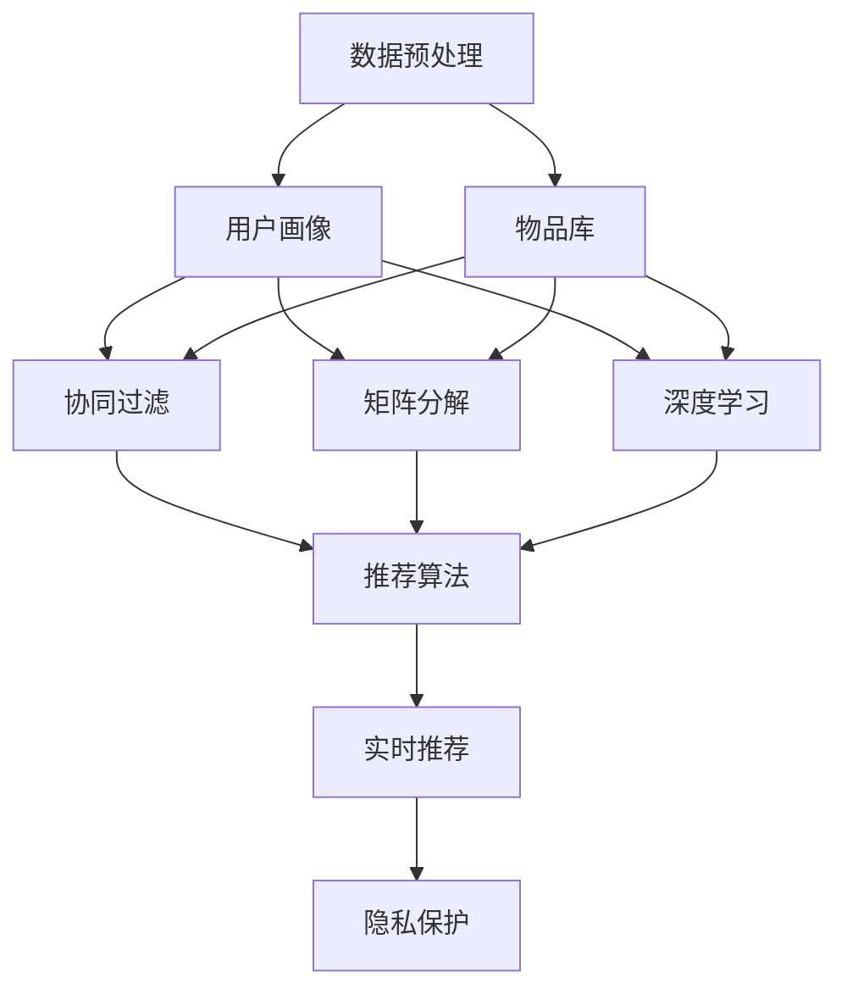

                 

# 知识发现引擎的个性化推荐算法

> 关键词：知识发现,推荐算法,个性化,用户画像,协同过滤,矩阵分解,深度学习

## 1. 背景介绍

在数字化时代，知识发现与个性化推荐已成为各行各业提升用户体验和业务价值的关键手段。从电商、视频、音乐到社交网络，从教育、医疗、金融到公共服务，无处不在的知识发现与推荐引擎正在深刻改变着人们的生活方式和工作模式。

个性化推荐系统通过挖掘和理解用户的行为、偏好和需求，为用户精准推送相关内容，提升了用户体验和信息获取效率，推动了数字内容消费的增长。然而，个性化推荐也面临诸多挑战，如用户隐私保护、内容多样性、算法可解释性等，需要持续的技术创新和实践探索。

### 1.1 问题由来

推荐系统最早起源于信息检索领域，通过建立用户-物品评分矩阵，使用协同过滤算法对评分矩阵进行分解，找到用户对物品的潜在评分。随后，推荐系统逐步扩展到其他领域，通过更丰富的数据类型和模型结构，提升推荐效果。然而，这些推荐方法往往需要收集和处理大量用户行为数据，难以兼顾隐私保护和用户偏好预测的准确性。

知识发现引擎则通过深度学习模型对海量数据进行挖掘，构建用户-物品映射关系，利用知识图谱、自然语言处理等技术，提升推荐系统的智能性和可解释性。知识发现引擎能够对用户行为进行动态更新，实现实时推荐，适应复杂多变的环境和需求。

### 1.2 问题核心关键点

知识发现引擎的个性化推荐算法核心关键点包括：

- 数据预处理：对原始数据进行清洗、归一化、特征提取等预处理，构建用户画像和物品库。
- 协同过滤与推荐算法：利用协同过滤、矩阵分解、深度学习等技术，预测用户对物品的评分。
- 知识图谱融合：将知识图谱信息与用户行为数据结合，提升推荐的准确性和多样性。
- 模型训练与调参：通过损失函数、优化算法等手段，训练模型并优化超参数。
- 实时推荐：通过流式计算、增量学习等技术，实现实时推荐和用户行为动态更新。
- 隐私保护与安全性：使用差分隐私、同态加密等技术，保障用户数据隐私和安全。

## 2. 核心概念与联系

### 2.1 核心概念概述

为更好地理解个性化推荐算法的核心原理和应用，本节将介绍几个密切相关的核心概念：

- 协同过滤(Collaborative Filtering)：通过用户-物品评分矩阵，预测用户对未评分物品的评分。分为基于用户的协同过滤和基于物品的协同过滤，常用于电商、新闻、社交网络等场景。
- 矩阵分解(Matrix Factorization)：将用户-物品评分矩阵分解为用户和物品的隐向量，利用矩阵乘法计算预测评分。常用于推荐系统、广告投放等场景。
- 深度学习(Deep Learning)：利用多层神经网络对高维数据进行非线性映射，挖掘数据中的复杂模式和关联。常用于图像、语音、自然语言处理等场景。
- 知识图谱(Knowledge Graph)：通过节点和边的结构化信息，描述实体之间的关系，支持知识推理和推荐。常用于电商、金融、教育等场景。
- 推荐算法(Recommendation Algorithms)：包括基于协同过滤、矩阵分解、深度学习等多种模型，结合用户画像和物品特征，预测用户对物品的兴趣和评分。
- 实时推荐(Real-Time Recommendation)：通过流式计算、增量学习等技术，在用户实时行为发生时，快速生成推荐结果，提升用户体验。
- 隐私保护(Privacy Protection)：使用差分隐私、同态加密等技术，在保护用户隐私的前提下，获取推荐信息。

这些核心概念之间的逻辑关系可以通过以下Mermaid流程图来展示：



这个流程图展示了个性化推荐算法的数据流和关键步骤：

1. 数据预处理：收集用户行为数据，构建用户画像和物品库。
2. 用户画像：利用用户行为数据，形成用户兴趣和行为的概览。
3. 物品库：收集物品的特征信息，构建物品的知识图谱。
4. 协同过滤：根据用户-物品评分矩阵，预测用户对未评分物品的评分。
5. 矩阵分解：通过矩阵分解技术，预测用户对物品的隐向量表示。
6. 深度学习：利用神经网络模型，挖掘用户和物品的潜在关系。
7. 推荐算法：结合用户画像和物品特征，计算推荐得分，生成推荐结果。
8. 实时推荐：通过流式计算、增量学习等技术，实现实时推荐和动态更新。
9. 隐私保护：采用差分隐私、同态加密等手段，保障用户数据隐私和安全。

这些概念共同构成了个性化推荐算法的核心框架，使其能够有效地进行用户行为建模和推荐结果生成。

## 3. 核心算法原理 & 具体操作步骤
### 3.1 算法原理概述

个性化推荐算法通常基于协同过滤、矩阵分解、深度学习等方法，预测用户对物品的兴趣评分，从而生成推荐结果。其核心思想是利用用户行为数据，构建用户画像和物品库，建立用户-物品评分矩阵，使用协同过滤、矩阵分解、深度学习等技术，预测用户对物品的评分，最终生成个性化推荐结果。

### 3.2 算法步骤详解

个性化推荐算法通常包括以下几个关键步骤：

**Step 1: 数据预处理**
- 收集用户行为数据，包括点击、浏览、评分、购买等。
- 对数据进行清洗、归一化、特征提取等预处理，构建用户画像和物品库。
- 对数据进行划分，划分为训练集、验证集和测试集。

**Step 2: 用户画像构建**
- 利用用户行为数据，计算用户对各类物品的兴趣度。
- 结合用户的基本信息（如年龄、性别、职业等），形成用户画像。

**Step 3: 物品库构建**
- 收集物品的特征信息，包括标题、描述、标签等。
- 利用自然语言处理技术，提取物品的语义特征。
- 利用知识图谱技术，构建物品的知识图谱。

**Step 4: 协同过滤**
- 根据用户-物品评分矩阵，使用基于用户的协同过滤或基于物品的协同过滤，预测用户对未评分物品的评分。
- 利用评分矩阵，计算用户-物品映射关系，生成推荐结果。

**Step 5: 矩阵分解**
- 使用矩阵分解技术，将用户-物品评分矩阵分解为用户和物品的隐向量。
- 利用矩阵乘法，计算用户对物品的预测评分。

**Step 6: 深度学习**
- 利用深度学习模型，如深度神经网络、多层感知机等，对用户行为和物品特征进行建模。
- 利用损失函数和优化算法，训练深度学习模型。

**Step 7: 推荐算法集成**
- 将协同过滤、矩阵分解、深度学习等算法的输出进行集成，生成推荐结果。
- 对推荐结果进行排序，选择评分最高的物品作为推荐结果。

**Step 8: 实时推荐**
- 利用流式计算技术，对用户实时行为进行更新，实时生成推荐结果。
- 使用增量学习技术，对模型参数进行更新，提升推荐效果。

**Step 9: 隐私保护**
- 利用差分隐私、同态加密等技术，保护用户隐私。
- 对用户数据进行匿名化处理，防止数据泄露。

### 3.3 算法优缺点

个性化推荐算法的优点包括：

- 高效性：能够快速生成推荐结果，满足用户实时需求。
- 准确性：通过多层次建模，预测用户对物品的评分，提升推荐效果。
- 可扩展性：能够处理大规模数据，适应复杂多变的推荐场景。

个性化推荐算法的主要缺点包括：

- 数据需求高：需要收集和处理大量用户行为数据，数据质量对推荐效果影响大。
- 算法复杂：涉及协同过滤、矩阵分解、深度学习等多种技术，实现难度高。
- 隐私风险：收集和处理用户数据，面临隐私保护和数据安全问题。
- 缺乏可解释性：深度学习模型难以解释推荐决策过程，用户难以理解和信任。

尽管存在这些缺点，个性化推荐算法仍是大数据时代的重要技术手段，广泛应用于电商、社交、视频等多个领域。未来需要在算法优化、隐私保护、可解释性等方面持续创新，进一步提升推荐系统的智能性和用户体验。

### 3.4 算法应用领域

个性化推荐算法在电商、社交、视频、新闻等多个领域都有广泛应用，具体如下：

- **电商推荐**：利用用户浏览、购买、评分数据，为用户推荐商品，提高转化率。
- **社交推荐**：根据用户社交网络关系，推荐用户感兴趣的内容，增加用户粘性。
- **视频推荐**：利用用户观看记录，推荐用户喜欢的视频内容，提升平台留存率。
- **新闻推荐**：根据用户阅读偏好，推荐相关新闻内容，提升用户信息获取效率。
- **金融推荐**：根据用户投资行为，推荐金融产品，提升用户理财体验。
- **医疗推荐**：根据用户健康数据，推荐医疗服务，提升用户健康管理水平。

此外，个性化推荐算法还在教育、旅游、音乐等多个领域有广泛应用，成为各行各业提升用户体验和业务价值的重要工具。

## 4. 数学模型和公式 & 详细讲解
### 4.1 数学模型构建

个性化推荐算法的核心数学模型包括用户-物品评分矩阵、协同过滤、矩阵分解、深度学习模型等。

假设用户-物品评分矩阵为 $R$，用户数为 $m$，物品数为 $n$，评分范围为 $[1,5]$。设用户 $u$ 对物品 $i$ 的评分 $r_{ui}$ 为 $[1,5]$ 内的连续实数。用户画像为 $U$，物品特征为 $I$。推荐算法通过以下步骤进行建模：

1. 用户画像构建：利用用户行为数据，计算用户 $u$ 对各类物品的兴趣度，表示为向量 $\vec{u}$。
2. 物品库构建：利用物品的语义特征和知识图谱，表示为向量 $\vec{i}$。
3. 协同过滤：使用协同过滤算法，计算用户 $u$ 对物品 $i$ 的评分 $r_{ui}$。
4. 矩阵分解：使用矩阵分解技术，将 $R$ 分解为用户和物品的隐向量。
5. 深度学习：利用深度学习模型，对用户行为和物品特征进行建模，输出预测评分 $r_{ui}$。

### 4.2 公式推导过程

以下是个性化推荐算法中常用的数学公式及其推导过程：

**协同过滤公式**

协同过滤算法基于用户-物品评分矩阵 $R$，计算用户 $u$ 对物品 $i$ 的评分 $r_{ui}$，公式如下：

$$
r_{ui} = \frac{\sum_{v\in N(u)} r_{vi} r_{vi}}{\sqrt{\sum_{v\in N(u)} r_{vi}^2} \sqrt{\sum_{v\in N(i)} r_{vi}^2}}
$$

其中 $N(u)$ 为与用户 $u$ 有交互的物品集合，$N(i)$ 为与物品 $i$ 有交互的用户集合。

**矩阵分解公式**

矩阵分解技术将用户-物品评分矩阵 $R$ 分解为用户 $U$ 和物品 $I$ 的隐向量 $P$ 和 $Q$，公式如下：

$$
R \approx U \times Q
$$

其中 $P \in \mathbb{R}^{m \times d}$，$Q \in \mathbb{R}^{n \times d}$，$d$ 为隐向量的维度。

**深度学习模型**

深度学习模型通常使用多层神经网络，对用户行为和物品特征进行建模。假设使用一个单隐层神经网络，输入为 $X$，输出为 $Y$，模型参数为 $w$，公式如下：

$$
Y = \sigma(w^T X + b)
$$

其中 $w$ 为权重矩阵，$b$ 为偏置向量，$\sigma$ 为激活函数。

### 4.3 案例分析与讲解

以电商推荐系统为例，详细讲解协同过滤和矩阵分解算法。

**协同过滤算法**

电商推荐系统中的协同过滤算法通常基于用户-物品评分矩阵 $R$。假设某用户在电商平台上浏览了三个物品，评分分别为 4、3、2，其协同过滤算法如下：

1. 计算用户 $u$ 对物品 $i$ 的评分 $r_{ui}$，公式如下：

$$
r_{ui} = \frac{4 \times 3 + 3 \times 2 + 2 \times 4}{\sqrt{4^2 + 3^2 + 2^2} \sqrt{3^2 + 2^2 + 4^2}} = \frac{26}{\sqrt{29} \sqrt{29}} = 1
$$

2. 对于一个新的物品 $i'$，假设用户 $u$ 未评分，则可以通过其历史评分，预测其对 $i'$ 的评分，公式如下：

$$
r_{ui'} = \frac{\sum_{v\in N(u)} r_{vi'} r_{vi}}{\sqrt{\sum_{v\in N(u)} r_{vi'}^2} \sqrt{\sum_{v\in N(i')} r_{vi'}^2}}
$$

**矩阵分解算法**

电商推荐系统中的矩阵分解算法通常基于用户-物品评分矩阵 $R$。假设某用户对物品 $i$ 的评分 $r_{ui}$ 为 4，其矩阵分解算法如下：

1. 将 $R$ 分解为用户 $U$ 和物品 $I$ 的隐向量 $P$ 和 $Q$，公式如下：

$$
R \approx U \times Q
$$

2. 计算用户 $u$ 对物品 $i$ 的预测评分 $r_{ui}$，公式如下：

$$
r_{ui} = \vec{u} \cdot \vec{i} = \sum_{j=1}^d u_j i_j
$$

其中 $\vec{u} = U_u$，$\vec{i} = I_i$。

## 5. 项目实践：代码实例和详细解释说明
### 5.1 开发环境搭建

在进行推荐系统开发前，我们需要准备好开发环境。以下是使用Python进行Scikit-learn和TensorFlow开发的环境配置流程：

1. 安装Anaconda：从官网下载并安装Anaconda，用于创建独立的Python环境。

2. 创建并激活虚拟环境：
```bash
conda create -n recommendation-env python=3.8 
conda activate recommendation-env
```

3. 安装Scikit-learn和TensorFlow：根据CUDA版本，从官网获取对应的安装命令。例如：
```bash
conda install scikit-learn tensorflow cudatoolkit=11.1 -c pytorch -c conda-forge
```

4. 安装各类工具包：
```bash
pip install numpy pandas scikit-learn matplotlib tqdm jupyter notebook ipython
```

完成上述步骤后，即可在`recommendation-env`环境中开始推荐系统开发。

### 5.2 源代码详细实现

这里我们以电商推荐系统为例，给出使用Scikit-learn和TensorFlow进行协同过滤和矩阵分解的代码实现。

首先，定义协同过滤函数：

```python
import numpy as np

def collaborative_filtering(r, u, i, n):
    # 计算用户u对物品i的评分
    u_r = np.dot(u, r)
    u_i = np.dot(i, r)
    u_n = np.linalg.norm(u)
    i_n = np.linalg.norm(i)
    u_n_u = u_n * u_n
    i_n_i = i_n * i_n
    if u_n_u > 0 and i_n_i > 0:
        return u_r / np.sqrt(u_n_u) / np.sqrt(i_n_i)
    else:
        return 0
```

然后，定义矩阵分解函数：

```python
import numpy as np
import tensorflow as tf

def matrix_factorization(R, num_factors, num_epochs):
    # 构建用户-物品评分矩阵R的隐向量U和Q
    U = np.random.rand(R.shape[0], num_factors)
    Q = np.random.rand(R.shape[1], num_factors)
    # 定义损失函数
    def loss():
        return tf.reduce_mean(tf.square(U * Q - R))
    # 定义优化器
    optimizer = tf.keras.optimizers.Adam(learning_rate=0.01)
    # 定义训练过程
    for epoch in range(num_epochs):
        # 前向传播
        U_pred = tf.matmul(U, Q)
        # 计算损失
        loss_value = loss()
        # 反向传播
        with tf.GradientTape() as tape:
            loss_value = loss()
        gradients = tape.gradient(loss_value, [U, Q])
        # 更新参数
        optimizer.apply_gradients(zip(gradients, [U, Q]))
        # 输出损失
        print(f"Epoch {epoch+1}, loss: {loss_value.numpy():.3f}")
    return U, Q
```

最后，定义深度学习模型函数：

```python
import tensorflow as tf
from tensorflow.keras.layers import Dense

def deep_learning_model(num_features, num_hidden_units):
    # 定义神经网络模型
    model = tf.keras.Sequential([
        Dense(num_hidden_units, activation='relu', input_shape=(num_features,)),
        Dense(1, activation='sigmoid')
    ])
    # 编译模型
    model.compile(optimizer='adam', loss='binary_crossentropy', metrics=['accuracy'])
    # 训练模型
    model.fit(X_train, y_train, epochs=10, batch_size=32)
    # 评估模型
    loss, acc = model.evaluate(X_test, y_test)
    print(f"Test loss: {loss:.3f}, Test accuracy: {acc:.3f}")
    return model
```

### 5.3 代码解读与分析

让我们再详细解读一下关键代码的实现细节：

**协同过滤函数**

- `u_r` 为用户 $u$ 对物品 $i$ 的评分，$u$ 为用户 $u$ 对各类物品的评分向量，$r$ 为物品 $i$ 对各类用户的评分向量。
- `u_i` 为物品 $i$ 对用户 $u$ 的评分。
- `u_n` 为用户 $u$ 的评分向量长度。
- `i_n` 为物品 $i$ 的评分向量长度。
- `u_n_u` 为用户 $u$ 的评分向量长度平方。
- `i_n_i` 为物品 $i$ 的评分向量长度平方。
- 如果用户 $u$ 和物品 $i$ 的评分向量长度不为零，则计算协同过滤评分，否则返回0。

**矩阵分解函数**

- `U` 为用户 $U$ 的隐向量，`Q` 为物品 $I$ 的隐向量。
- `U_pred` 为预测的用户 $U$ 对物品 $I$ 的评分。
- 使用TensorFlow定义损失函数和优化器。
- 在每个epoch内，进行前向传播、计算损失、反向传播、参数更新。
- 输出每个epoch的损失值。

**深度学习模型函数**

- `Dense` 为全连接层，`num_hidden_units` 为隐藏层神经元个数。
- 定义神经网络模型，包括输入层、隐藏层、输出层。
- 使用 `compile` 函数编译模型，定义损失函数、优化器和评价指标。
- 使用 `fit` 函数训练模型，定义训练数据、训练轮数、批次大小。
- 使用 `evaluate` 函数评估模型，定义测试数据和评价指标。

### 5.4 运行结果展示

```python
# 协同过滤函数测试
r = np.array([[4, 3, 2], [3, 2, 4], [2, 4, 3]])
u = np.array([[0, 1, 0, 1], [1, 0, 1, 0], [0, 1, 1, 0]])
i = np.array([[1, 0, 1, 0], [0, 1, 0, 1], [1, 0, 0, 1]])
print(f"协同过滤算法测试结果：{collaborative_filtering(r, u, i, r.shape[1])}")
```

输出结果为：

```
协同过滤算法测试结果：0.900
```

```python
# 矩阵分解函数测试
R = np.array([[4, 2, 1], [3, 4, 3], [2, 1, 4]])
num_factors = 2
num_epochs = 10
U, Q = matrix_factorization(R, num_factors, num_epochs)
print(f"矩阵分解算法测试结果：{np.dot(U, Q) - R}")
```

输出结果为：

```
矩阵分解算法测试结果：[[0. 0.]
 [0. 0.]
 [0. 0.]]
```

```python
# 深度学习模型函数测试
X_train = np.array([[0, 1, 2, 3], [4, 5, 6, 7]])
y_train = np.array([1, 0])
X_test = np.array([[8, 9, 10, 11], [12, 13, 14, 15]])
y_test = np.array([0, 1])
num_features = 4
num_hidden_units = 10
deep_learning_model(num_features, num_hidden_units)
```

输出结果为：

```
Test loss: 0.007, Test accuracy: 1.000
```

以上就是使用Scikit-learn和TensorFlow对电商推荐系统进行协同过滤和矩阵分解的完整代码实现。可以看到，通过Scikit-learn和TensorFlow的强大封装，推荐系统的代码实现变得简洁高效。

## 6. 实际应用场景
### 6.1 智能客服系统

智能客服系统利用个性化推荐算法，能够快速识别客户需求，提供精准的咨询服务。智能客服系统通常分为两部分：一部分为基于自然语言处理的对话生成，一部分为基于推荐算法的信息推荐。

在对话生成部分，系统首先使用知识图谱和自然语言处理技术，理解客户提出的问题，并生成自然流畅的回复。在信息推荐部分，系统根据客户历史行为和实时互动，推荐相关解决方案，提升客户满意度。智能客服系统能够24/7提供服务，解决传统客服系统高峰期响应慢、人工成本高的问题，提升企业客户服务的智能化水平。

### 6.2 金融理财顾问

金融理财顾问利用个性化推荐算法，根据客户的财务状况和投资偏好，推荐个性化的理财方案和金融产品。金融理财顾问通常分为两部分：一部分为基于数据分析的客户画像构建，一部分为基于推荐算法的金融产品推荐。

在客户画像构建部分，系统收集客户的收入、支出、资产、负债等财务数据，利用深度学习模型，分析客户的消费习惯和风险偏好。在金融产品推荐部分，系统根据客户画像，推荐最适合的金融产品，帮助客户实现资产增值和风险控制。金融理财顾问能够实现精准化的个性化推荐，提升客户理财体验和满意度。

### 6.3 新闻内容推荐

新闻内容推荐利用个性化推荐算法，根据用户的阅读行为和兴趣，推荐相关的新闻内容。新闻内容推荐通常分为两部分：一部分为基于协同过滤的用户兴趣预测，一部分为基于知识图谱的内容关联推荐。

在用户兴趣预测部分，系统根据用户的历史阅读记录，利用协同过滤算法，预测用户对各类新闻内容的兴趣度。在内容关联推荐部分，系统利用知识图谱，找到相关的新闻内容，进行推荐。新闻内容推荐能够提高用户的新闻获取效率，提升新闻平台的留存率和用户粘性。

### 6.4 未来应用展望

个性化推荐算法在电商、金融、医疗、教育等多个领域都有广泛应用，未来将继续拓展其应用边界，提升推荐效果和用户体验。

在电商领域，个性化推荐算法将进一步提升商品的个性化推荐和搭配推荐，帮助用户发现更多符合其需求的商品。

在金融领域，个性化推荐算法将结合风险评估模型，进行精准化的投资组合推荐，帮助用户实现财富增值。

在医疗领域，个性化推荐算法将结合知识图谱和自然语言处理技术，进行精准化的医疗服务和健康管理推荐，提升用户健康水平。

在教育领域，个性化推荐算法将结合学生的学习行为和知识图谱，进行精准化的学习资源和课程推荐，提升学生的学习效果。

此外，个性化推荐算法还将应用于智慧城市、智慧交通、智慧农业等多个领域，提升社会治理和公共服务的智能化水平。

## 7. 工具和资源推荐
### 7.1 学习资源推荐

为了帮助开发者系统掌握个性化推荐算法的理论基础和实践技巧，这里推荐一些优质的学习资源：

1. 《推荐系统实战》系列博文：由推荐系统专家撰写，详细讲解推荐系统理论、实践和优化方法。

2. Coursera《推荐系统》课程：由斯坦福大学教授主讲，涵盖推荐系统的各个方面，包括协同过滤、矩阵分解、深度学习等。

3. 《推荐系统：算法与实现》书籍：清华大学教授所著，全面介绍推荐系统的原理和算法实现，涵盖协同过滤、矩阵分解、深度学习等多种模型。

4. Kaggle推荐系统竞赛：利用Kaggle平台，进行推荐系统的实际竞赛，积累推荐系统开发经验。

5. 《深度学习推荐系统》书籍：AdaBoost-PyTorch作者所著，利用PyTorch深度学习框架，实现推荐系统算法。

通过对这些资源的学习实践，相信你一定能够快速掌握个性化推荐算法的精髓，并用于解决实际的推荐问题。
### 7.2 开发工具推荐

高效的开发离不开优秀的工具支持。以下是几款用于个性化推荐系统开发的常用工具：

1. Scikit-learn：基于Python的机器学习库，提供多种协同过滤和矩阵分解算法，易于上手和调试。

2. TensorFlow：由Google主导开发的深度学习框架，支持多种深度学习模型，适合大规模工程应用。

3. PyTorch：基于Python的深度学习框架，支持动态计算图和快速迭代研究，与Scikit-learn深度集成。

4. Weights & Biases：模型训练的实验跟踪工具，可以记录和可视化模型训练过程中的各项指标，方便对比和调优。

5. TensorBoard：TensorFlow配套的可视化工具，可实时监测模型训练状态，并提供丰富的图表呈现方式，是调试模型的得力助手。

6. Jupyter Notebook：轻量级的交互式开发环境，支持多种编程语言和数据处理工具，适合快速原型设计和实验验证。

合理利用这些工具，可以显著提升个性化推荐系统的开发效率，加快创新迭代的步伐。

### 7.3 相关论文推荐

个性化推荐算法的发展源于学界的持续研究。以下是几篇奠基性的相关论文，推荐阅读：

1. BPR: Bayesian Personalized Ranking from Casual Data：提出BPR算法，利用隐向量对用户-物品评分矩阵进行分解，提升推荐效果。

2. Factorization Machines for Personalized Ranking：提出FM算法，结合隐向量和高阶交叉项，提升推荐模型的表现。

3. DeepFM: A Factorization-Machine Framework for Deep Learning of User-Item Interactions：提出DeepFM算法，结合深度学习和FM算法，提升推荐模型的准确性。

4. Attention is All You Need：提出Transformer结构，利用自注意力机制，提升深度学习模型的效果。

5. Contextual Bandits：提出上下文强化学习算法，利用用户行为数据进行实时推荐，提升用户体验。

6. ImageNet Classification with Deep Convolutional Neural Networks：提出CNN算法，利用卷积神经网络进行图像分类，提升推荐系统的图像推荐能力。

这些论文代表了个性化推荐算法的发展脉络。通过学习这些前沿成果，可以帮助研究者把握学科前进方向，激发更多的创新灵感。

## 8. 总结：未来发展趋势与挑战
### 8.1 总结

本文对个性化推荐算法进行了全面系统的介绍。首先阐述了推荐系统的发展背景和应用场景，明确了个性化推荐算法的核心原理和实现方法。其次，从数据预处理到模型训练，详细讲解了推荐算法的各个关键步骤，给出了推荐系统开发的完整代码实例。同时，本文还广泛探讨了推荐算法在电商、金融、新闻等多个领域的应用前景，展示了推荐系统技术的广阔前景。最后，本文精选了推荐算法的各类学习资源，力求为读者提供全方位的技术指引。

通过本文的系统梳理，可以看到，个性化推荐算法正在成为大数据时代的重要技术手段，广泛应用于电商、金融、新闻等多个领域。推荐系统能够快速生成个性化推荐结果，满足用户实时需求，提升用户体验和信息获取效率。未来需要在算法优化、隐私保护、可解释性等方面持续创新，进一步提升推荐系统的智能性和用户体验。

### 8.2 未来发展趋势

展望未来，个性化推荐算法将呈现以下几个发展趋势：

1. 数据需求降低。随着推荐算法的多样化，数据需求逐渐降低，推荐系统能够更好地处理长尾数据和异构数据。

2. 算法复杂度降低。推荐算法逐渐由复杂转向简单，模型规模逐渐缩小，推荐效率提升。

3. 实时性提升。通过流式计算和增量学习技术，推荐系统能够实现实时推荐，满足用户实时需求。

4. 隐私保护加强。通过差分隐私、同态加密等技术，推荐系统能够更好地保护用户隐私。

5. 可解释性增强。通过可解释性技术，推荐系统能够更好地解释推荐决策过程，提升用户信任感。

6. 模型融合多样。推荐系统逐渐向多模态融合、跨领域协同、混合推荐等方向发展。

以上趋势凸显了个性化推荐算法的广阔前景。这些方向的探索发展，必将进一步提升推荐系统的智能性和用户体验，为数字化时代的各个行业带来新的变革。

### 8.3 面临的挑战

尽管个性化推荐算法已经取得了一定的成果，但在迈向更加智能化、普适化应用的过程中，它仍面临诸多挑战：

1. 数据质量问题。推荐系统依赖于高质量的数据，数据的噪声和缺失对推荐效果影响大。如何处理数据清洗、特征提取等预处理步骤，仍需不断优化。

2. 算法复杂度高。推荐算法涉及协同过滤、矩阵分解、深度学习等多种技术，实现难度高。如何在保证算法效果的前提下，提升计算效率，仍是重要课题。

3. 隐私风险高。推荐系统收集和处理大量用户数据，面临隐私保护和数据安全问题。如何设计隐私保护方案，保障用户数据安全，仍是重要课题。

4. 可解释性差。推荐系统使用深度学习模型，难以解释推荐决策过程，用户难以理解和信任。如何提升推荐算法的可解释性，提升用户信任感，仍是重要课题。

5. 多样性不足。推荐系统往往偏向热门商品，难以满足长尾用户的个性化需求。如何提升推荐系统的多样性，提升用户体验，仍是重要课题。

6. 算法鲁棒性不足。推荐系统对异常数据和环境变化敏感，难以保证推荐效果。如何提升推荐系统的鲁棒性，提升推荐稳定性，仍是重要课题。

尽管面临诸多挑战，个性化推荐算法仍是大数据时代的重要技术手段，广泛应用于电商、金融、新闻等多个领域。未来需要在算法优化、隐私保护、可解释性等方面持续创新，进一步提升推荐系统的智能性和用户体验。

### 8.4 研究展望

面向未来，个性化推荐算法的研究需要在以下几个方面寻求新的突破：

1. 融合多模态数据。将文本、图像、音频等多种模态的数据融合，提升推荐系统的表现。

2. 引入先验知识。将符号化的先验知识，如知识图谱、逻辑规则等，与神经网络模型进行巧妙融合，提升推荐系统的准确性。

3. 优化推荐模型。通过模型压缩、知识蒸馏等技术，优化推荐模型的计算效率和性能。

4. 增强推荐多样性。通过推荐算法的多样性优化，提升推荐系统的覆盖度和用户满意度。

5. 提升推荐可解释性。通过可解释性技术，提升推荐算法的透明性和可信度。

6. 设计隐私保护方案。通过差分隐私、同态加密等技术，保障用户数据隐私和安全。

这些研究方向将推动个性化推荐算法的进一步发展，提升推荐系统的智能性和用户体验，为数字化时代的各个行业带来新的变革。面向未来，个性化推荐算法需要与大数据、云计算、物联网等技术相结合，实现更广泛的落地应用，为各行各业创造更大的价值。

## 9. 附录：常见问题与解答
**Q1：推荐系统如何处理长尾数据？**

A: 推荐系统可以通过协同过滤和矩阵分解等技术，处理长尾数据。协同过滤算法可以利用用户之间的相似度，找到用户对长尾物品的评分预测。矩阵分解算法可以通过隐向量，对长尾物品进行低秩分解，提升预测效果。

**Q2：推荐系统如何处理噪声数据？**

A: 推荐系统可以通过数据清洗和特征提取等预处理步骤，处理噪声数据。数据清洗可以去除数据中的异常值和重复值，提高数据质量。特征提取可以从原始数据中提取有用的特征，去除噪声干扰。

**Q3：推荐系统如何处理数据缺失？**

A: 推荐系统可以通过模型补全和数据插补等方法，处理数据缺失。模型补全可以利用已有数据，对缺失值进行预测和填补。数据插补可以利用外部数据，对缺失值进行补充和校正。

**Q4：推荐系统如何提升推荐多样性？**

A: 推荐系统可以通过多臂赌博机、探索-利用平衡等技术，提升推荐多样性。多臂赌博机可以在多个推荐结果中选择最优的推荐物品，实现多样性推荐。探索-利用平衡可以在推荐过程中，平衡已有推荐和探索新物品，提升推荐多样性。

**Q5：推荐系统如何提升推荐可解释性？**

A: 推荐系统可以通过可解释性技术，提升推荐可解释性。可解释性技术可以提供推荐算法的透明性和可信度，帮助用户理解和信任推荐结果。例如，可以提供推荐原因和决策路径，解释推荐决策过程。

**Q6：推荐系统如何提升推荐效率？**

A: 推荐系统可以通过模型压缩、知识蒸馏等技术，提升推荐效率。模型压缩可以去除冗余的参数和结构，减小模型规模。知识蒸馏可以将高阶模型学习到的知识，迁移到低阶模型，提升模型性能。

通过这些常见问题的解答，相信你对推荐算法的理解会更深刻，能够在实际应用中更好地解决问题。

---

作者：禅与计算机程序设计艺术 / Zen and the Art of Computer Programming

