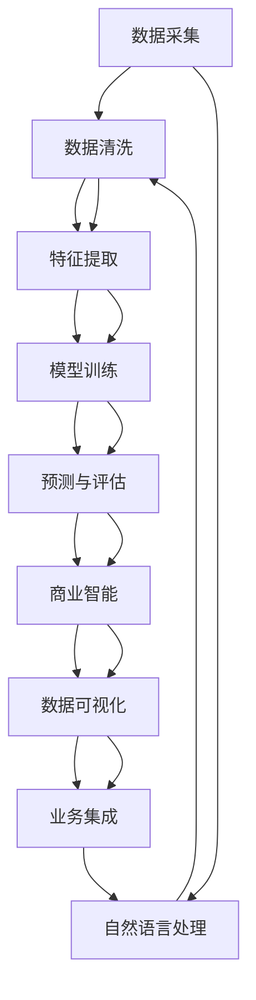
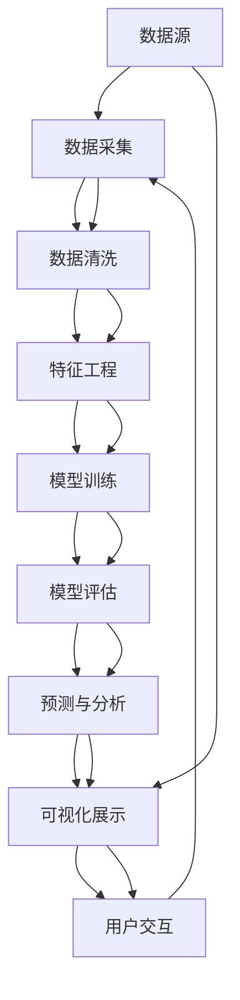

                 

# 知识发现引擎的商业化：程序员创业新方向

> 关键词：知识发现引擎, 商业化, 程序员创业, 数据挖掘, 机器学习, 人工智能, 商业智能, 数据可视化

## 1. 背景介绍

### 1.1 问题由来
近年来，随着数据量的爆炸性增长和计算能力的提升，大数据和人工智能技术迅速渗透各行各业，为企业带来了巨大的商业价值和竞争优势。在数据驱动的商业决策时代，企业需要从海量数据中发现潜在的知识，提取有价值的洞察，以支撑策略制定和运营优化。

在这样的背景下，知识发现引擎(Knowledge Discovery Engine, KDE)应运而生，作为集成数据挖掘、机器学习和商业智能技术的智能平台，它能够从数据中自动挖掘并提取出关键的知识模式和趋势，为决策者提供精准、及时、个性化的业务洞见。然而，尽管KDE在技术上日趋成熟，但在实际落地应用方面仍面临诸多挑战，如数据质量不足、用户需求复杂化、应用场景多样化等。因此，如何将知识发现引擎进行商业化运作，成为一个亟待解决的问题。

### 1.2 问题核心关键点
知识发现引擎的商业化主要涉及以下几个关键点：

1. **数据采集与处理**：有效获取高质量的数据是KDE商业化的基础，数据采集的质量和数据处理的效率直接影响了最终结果的准确性和可靠性。

2. **算法模型优化**：KDE的核心在于其算法模型，如何选择合适的算法，并在数据集上不断优化模型，才能获得最佳的发现效果。

3. **用户需求适配**：每个企业或用户对知识发现的需求千差万别，如何设计灵活的接口和参数，让用户能够方便地使用和定制KDE，是商业化的关键。

4. **性能与成本平衡**：在满足业务需求的同时，需要考虑系统的计算资源消耗和成本，以实现性价比最优。

5. **业务融合与集成**：将KDE与企业现有的业务系统和决策支持系统进行无缝集成，充分发挥其商业价值。

6. **隐私与安全保障**：在数据处理过程中，如何保证用户隐私和数据安全，是商业化过程中必须严格遵守的规范。

这些问题相互关联，共同构成了一个复杂且多层次的商业化挑战。

### 1.3 问题研究意义
知识发现引擎的商业化研究对于推动人工智能技术在企业中的应用，提升企业数据利用效率和决策能力具有重要意义：

1. **降低技术门槛**：通过KDE的商业化，使得复杂的技术和算法对普通用户透明化，降低了企业和个人对数据挖掘技术的依赖和学习成本。

2. **加速业务转型**：KDE能够自动挖掘数据中的价值，为企业提供数据驱动的商业洞见，加速从传统业务向数据驱动业务的转型。

3. **创造新价值**：通过KDE的商业化应用，企业可以发现新的市场机会和业务模式，创造更多的商业价值。

4. **促进数据利用**：KDE能够对不同数据源进行整合和分析，充分利用数据资源，提升数据利用效率。

5. **支持决策优化**：基于KDE的数据洞见，决策者可以更加精准地制定策略，优化运营和市场响应，提高竞争力。

## 2. 核心概念与联系

### 2.1 核心概念概述

KDE作为知识发现引擎，主要包含以下几个核心概念：

- **数据挖掘**：从大量数据中挖掘和发现模式、趋势、关联等有价值的信息。

- **机器学习**：基于数据集，使用算法模型自动学习和提取特征，提升发现效果。

- **商业智能**：将数据挖掘和机器学习的结果转化为可操作的业务洞见，支持决策。

- **数据可视化**：通过图表、仪表盘等可视化手段，直观展示发现结果，便于理解和使用。

- **自然语言处理(NLP)**：处理和理解人类语言，提取文本中的信息。

- **模型部署与集成**：将KDE算法模型部署到生产环境，并与现有业务系统集成，实现业务流程自动化。

这些概念之间通过数据流和逻辑流程紧密联系，构成了一个完整的知识发现系统。以下是一个Mermaid流程图，展示了KDE的各组件和它们之间的联系：



### 2.2 核心概念原理和架构的 Mermaid 流程图



这个流程图展示了KDE从数据源到用户交互的整个流程。

## 3. 核心算法原理 & 具体操作步骤

### 3.1 算法原理概述

知识发现引擎的商业化核心在于如何将复杂的算法模型转化为易于使用、可扩展的商业产品。主要涉及以下几个关键算法：

- **聚类算法**：用于将数据分成不同群组，识别出相似数据集。

- **分类算法**：用于预测数据属于哪个类别，如决策树、支持向量机等。

- **回归算法**：用于预测数值型输出，如线性回归、随机森林等。

- **关联规则算法**：用于挖掘数据中的频繁项集和关联规则，如Apriori算法、FP-Growth算法等。

- **时间序列分析算法**：用于分析和预测时间序列数据，如ARIMA、LSTM等。

这些算法通过合理的组合和优化，可以支持企业进行多维度、多层次的知识发现。

### 3.2 算法步骤详解

知识发现引擎的商业化步骤大致分为以下几个：

1. **需求调研与分析**：了解用户需求，确定KDE的功能和性能要求。

2. **数据采集与预处理**：选择合适的数据源，对数据进行清洗、去重、归一化等预处理操作。

3. **模型选择与训练**：根据数据类型和业务需求，选择合适的算法模型，并在训练集上进行训练和调优。

4. **测试与评估**：在测试集上评估模型的性能，调整模型参数，确保模型效果满足业务需求。

5. **部署与集成**：将训练好的模型部署到生产环境中，并与现有系统集成，实现业务流程自动化。

6. **监控与优化**：实时监控KDE运行状态，根据反馈数据进行模型优化和参数调整。

### 3.3 算法优缺点

知识发现引擎的商业化具有以下优点：

- **高效性**：通过自动化和智能化处理，大幅提高了数据挖掘的效率。

- **易用性**：将复杂的算法模型封装成易于使用的API和工具，降低了技术门槛。

- **灵活性**：支持多种数据源和算法模型，满足不同企业的个性化需求。

- **可视化展示**：通过直观的数据可视化，帮助用户快速理解发现结果。

但同时，商业化也存在以下挑战：

- **数据质量问题**：数据采集和处理过程中的噪音和错误可能影响结果的准确性。

- **模型选择复杂**：不同算法模型适用于不同类型的数据和业务需求，选择不当可能导致效果不佳。

- **资源消耗大**：高算力需求和复杂模型训练可能带来较高的计算成本和资源消耗。

- **隐私安全问题**：在数据处理过程中，如何保护用户隐私和数据安全，是商业化过程中必须严格遵守的规范。

### 3.4 算法应用领域

知识发现引擎的应用领域非常广泛，涵盖了以下几类：

1. **金融风险管理**：通过分析交易数据，发现异常行为，预测风险。

2. **市场营销**：基于用户行为数据，进行客户细分和市场细分，优化营销策略。

3. **供应链优化**：通过分析订单数据和物流数据，优化供应链管理。

4. **产品推荐**：分析用户历史行为，推荐个性化的产品和服务。

5. **医疗健康**：分析患者数据，预测疾病发展趋势，辅助临床决策。

6. **零售电商**：分析消费行为数据，优化库存管理和定价策略。

7. **智能制造**：分析生产数据，优化生产流程和设备维护。

这些领域中的每一个，都能通过知识发现引擎提升业务效率和决策能力。

## 4. 数学模型和公式 & 详细讲解 & 举例说明

### 4.1 数学模型构建

知识发现引擎的核心数学模型通常包括以下几种：

- **分类模型**：
  - 决策树：$H(T)=\sum_{i=1}^m H(D_i) - H(D)$，其中$H(D)$是熵，$D_i$是子集，$m$是子集个数。
  
- **回归模型**：
  - 线性回归：$\hat{y} = \theta_0 + \sum_{i=1}^n \theta_i x_i$，其中$\theta$是回归系数，$x_i$是输入变量。
  
- **聚类模型**：
  - K-means：$J_k = \sum_{i=1}^n \sum_{j=1}^k (x_i - \mu_j)^2$，其中$x_i$是样本，$\mu_j$是聚类中心。
  
- **关联规则模型**：
  - Apriori算法：通过频率筛选频繁项集，逐步合并生成关联规则。

### 4.2 公式推导过程

以决策树分类模型为例，推导其基本公式：

设数据集$D$包含$n$个样本，每个样本有$m$个特征，特征值$x_1, x_2, ..., x_m$。假设每个特征$x_i$取$k_i$个值，即$x_i$可以取$v_1, v_2, ..., v_{k_i}$中的一个。设目标变量$y$可以取两个值$y=0$或$y=1$。

决策树的构建步骤如下：

1. 计算特征$x_i$的信息增益：$Gain(x_i) = H(D) - \sum_{j=1}^{k_i} \frac{|D_j|}{|D|} H(D_j)$，其中$D_j$是特征$x_i=v_j$的子集。

2. 选择信息增益最大的特征$x_i$作为当前节点。

3. 计算每个特征值$v_j$的加权信息增益比：$IG(x_i, v_j) = \frac{Gain(x_i, v_j)}{SplitEntropy(x_i, v_j)}$，其中$SplitEntropy(x_i, v_j)$是特征$x_i=v_j$在子集$D_j$上的信息熵。

4. 选择加权信息增益比最大的特征值$v_j$作为分支节点。

5. 递归地构建子树，直到达到预设的深度或满足停止条件。

最终得到的决策树模型可以用于分类新样本。

### 4.3 案例分析与讲解

以一个简单的购物网站数据集为例，通过决策树模型对用户行为进行分类，预测其是否会购买某个产品：

设数据集$D$包含$n=1000$个用户，每个用户有$m=3$个特征，分别为$x_1$（浏览时间）、$x_2$（浏览次数）和$x_3$（支付记录）。目标变量$y$可以取$y=0$或$y=1$，其中$y=1$表示购买，$y=0$表示未购买。

1. 计算每个特征的信息增益：$Gain(x_i) = H(D) - \sum_{j=1}^{k_i} \frac{|D_j|}{|D|} H(D_j)$。

2. 选择信息增益最大的特征$x_i$作为当前节点，假设为$x_1$。

3. 计算每个特征值$v_j$的加权信息增益比，选择最大的特征值$v_j$作为分支节点。

4. 递归地构建子树，直到达到预设的深度或满足停止条件。

5. 通过测试集验证模型效果，调整参数并优化模型。

最终得到的决策树模型可以用来预测新用户的购买行为，辅助商家制定营销策略。

## 5. 项目实践：代码实例和详细解释说明

### 5.1 开发环境搭建

知识发现引擎的开发需要具备以下环境：

1. **操作系统**：
   - Windows, Linux, macOS

2. **编程语言**：
   - Python
   - R
   - Java

3. **依赖库**：
   - scikit-learn
   - TensorFlow
   - PyTorch
   - Pandas
   - NumPy

4. **开发工具**：
   - Jupyter Notebook
   - PyCharm
   - VSCode

完成上述环境配置后，即可开始KDE的开发实践。

### 5.2 源代码详细实现

以下是一个简单的基于Python的KDE项目实现：

```python
import pandas as pd
from sklearn.ensemble import DecisionTreeClassifier
from sklearn.model_selection import train_test_split
from sklearn.metrics import accuracy_score

# 数据加载
data = pd.read_csv('shopping_data.csv')

# 数据处理
X = data[['浏览时间', '浏览次数', '支付记录']]
y = data['购买行为']

# 模型训练
X_train, X_test, y_train, y_test = train_test_split(X, y, test_size=0.2)
clf = DecisionTreeClassifier(max_depth=3)
clf.fit(X_train, y_train)

# 模型评估
y_pred = clf.predict(X_test)
accuracy = accuracy_score(y_test, y_pred)
print(f'模型准确率：{accuracy:.2f}')
```

### 5.3 代码解读与分析

代码实现中，使用了Pandas库进行数据加载和处理，使用sklearn库进行模型训练和评估。

- **数据加载**：通过Pandas的`read_csv`方法，从CSV文件中加载数据。

- **数据处理**：选择与目标变量相关的特征，使用`train_test_split`方法进行数据分割。

- **模型训练**：使用`DecisionTreeClassifier`训练决策树模型，并通过`fit`方法拟合训练集数据。

- **模型评估**：使用`predict`方法对测试集进行预测，并通过`accuracy_score`方法计算模型准确率。

运行上述代码，可以得到模型预测结果和准确率，进而进行后续的优化和调整。

### 5.4 运行结果展示

运行结果展示了模型训练和评估的整个过程，包括数据加载、数据分割、模型训练和评估等步骤。通过可视化展示，能够直观了解模型的效果和性能。

## 6. 实际应用场景

### 6.1 金融风险管理

知识发现引擎在金融领域的应用场景包括：

1. **信用评分**：通过分析客户的历史交易数据，预测其信用风险，辅助决策。

2. **欺诈检测**：利用交易数据，检测异常行为，防范欺诈风险。

3. **股票预测**：基于历史股价数据，预测股票价格趋势。

4. **投资组合优化**：通过分析市场数据，优化投资组合，提高收益。

### 6.2 市场营销

知识发现引擎在市场营销领域的应用场景包括：

1. **客户细分**：基于用户行为数据，对客户进行细分，制定个性化营销策略。

2. **广告投放优化**：分析广告效果，优化广告投放策略，提升广告转化率。

3. **市场趋势分析**：通过分析市场数据，预测市场趋势，制定市场策略。

### 6.3 供应链优化

知识发现引擎在供应链管理中的应用场景包括：

1. **库存管理**：通过分析销售数据，优化库存管理，降低库存成本。

2. **供应商选择**：通过分析供应商数据，选择最佳供应商，提高供应链效率。

3. **需求预测**：通过分析订单数据，预测市场需求，优化生产计划。

### 6.4 未来应用展望

随着数据量的持续增长和计算技术的不断进步，知识发现引擎的应用前景将更加广阔。未来，它将在以下领域发挥更大的作用：

1. **智能制造**：通过分析生产数据，优化生产流程，提高生产效率。

2. **智慧医疗**：通过分析患者数据，预测疾病发展趋势，辅助临床决策。

3. **智能交通**：通过分析交通数据，优化交通管理，提高交通效率。

4. **智能安防**：通过分析监控数据，识别异常行为，提升安全防护水平。

5. **智能客服**：通过分析客户数据，优化客服策略，提升客户满意度。

## 7. 工具和资源推荐

### 7.1 学习资源推荐

1. **《数据挖掘导论》**：吴恩达（Andrew Ng）所著，全面介绍了数据挖掘的基本概念和技术。

2. **《机器学习》**：周志华所著，系统讲解了机器学习的基本算法和应用。

3. **Kaggle**：数据科学竞赛平台，提供丰富的数据集和挑战，有助于学习数据挖掘和KDE技术。

4. **Coursera**：在线教育平台，提供多门关于数据挖掘和KDE的课程，适合自学和进阶学习。

5. **GitHub**：开源代码平台，提供丰富的数据挖掘和KDE项目，有助于学习和参考。

### 7.2 开发工具推荐

1. **PyTorch**：深度学习框架，支持分布式训练和GPU加速，适合复杂模型的训练。

2. **TensorFlow**：深度学习框架，支持TensorBoard可视化，适合大规模应用。

3. **Scikit-learn**：数据挖掘和机器学习库，提供丰富的算法模型和工具函数。

4. **Jupyter Notebook**：交互式编程环境，支持Python和其他语言，适合数据探索和可视化。

5. **Hadoop**：大数据处理平台，支持分布式存储和计算，适合大规模数据处理。

### 7.3 相关论文推荐

1. **《数据挖掘：概念与技术》**：教材类书籍，全面介绍了数据挖掘的基本概念和技术。

2. **《机器学习实战》**：实践类书籍，提供了丰富的数据挖掘和KDE项目案例。

3. **《深度学习》**：教材类书籍，系统讲解了深度学习的基本原理和应用。

4. **《Apriori算法》**：论文类文献，介绍了Apriori算法的基本原理和实现。

5. **《时间序列分析》**：教材类书籍，系统讲解了时间序列分析的基本概念和技术。

## 8. 总结：未来发展趋势与挑战

### 8.1 研究成果总结

知识发现引擎的商业化研究取得了丰硕成果，推动了大数据和人工智能技术在企业中的应用。其主要研究成果包括：

1. **算法模型优化**：提出了多种高效的算法模型，提高了数据挖掘的精度和效率。

2. **数据处理技术**：开发了高效的数据采集和处理工具，解决了数据质量问题。

3. **商业化应用**：设计了灵活的API和工具，降低了技术门槛，提升了用户体验。

### 8.2 未来发展趋势

未来，知识发现引擎的发展趋势将体现在以下几个方面：

1. **自动化与智能化**：通过智能算法和自动化工具，进一步提高数据挖掘的效率和精度。

2. **多模态融合**：将文本、图像、音频等多模态数据融合，提升综合发现能力。

3. **实时性增强**：通过流式处理和实时计算，实现对实时数据的快速响应。

4. **跨领域应用**：推动知识发现引擎在更多行业的应用，提升各行业的数据利用效率。

5. **隐私与安全保障**：加强数据隐私和安全保护，确保用户数据的安全和合规性。

### 8.3 面临的挑战

知识发现引擎的商业化在取得巨大成功的同时，也面临着以下挑战：

1. **数据质量和隐私**：数据采集和处理过程中的噪音和隐私问题可能影响结果的准确性和可靠性。

2. **算法复杂性**：一些复杂的算法模型需要大量计算资源，可能带来较高的计算成本和资源消耗。

3. **应用场景多样化**：不同行业的业务需求复杂多样，需要灵活调整算法模型。

4. **技术更新迭代快**：算法模型和技术不断更新迭代，需要持续学习和跟踪最新的研究成果。

5. **用户接受度**：如何让用户接受和使用KDE，提高其普及度和应用效果。

### 8.4 研究展望

未来，知识发现引擎的研究方向将体现在以下几个方面：

1. **算法模型优化**：开发更加高效和灵活的算法模型，提高数据挖掘的精度和效率。

2. **智能决策支持**：结合人工智能技术，提升决策支持的智能化水平，提高决策效果。

3. **跨领域应用**：推动知识发现引擎在更多行业的应用，提升各行业的数据利用效率。

4. **隐私与安全保护**：加强数据隐私和安全保护，确保用户数据的安全和合规性。

5. **业务融合与集成**：推动KDE与现有业务系统的集成，实现业务流程自动化。

通过不断优化算法模型，提高数据处理效率，增强业务融合能力，知识发现引擎必将在商业化过程中发挥更大的作用，为企业的智能化转型提供有力支持。

