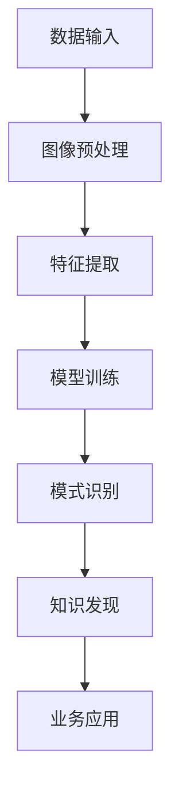

                 

# 知识发现引擎的图像识别技术应用

> 关键词：知识发现引擎, 图像识别, 数据挖掘, 深度学习, 计算机视觉, 特征工程, 实时分析, 多模态学习

## 1. 背景介绍

随着互联网和移动互联网的快速发展，海量图像数据的生成和存储已经变得轻而易举。图像数据所蕴含的信息量巨大，然而其价值往往难以直接挖掘。为了从海量的图像数据中提取出有价值的信息，并应用于业务决策和优化，知识发现引擎(Knowledge Discovery Engine, KDE)应运而生。知识发现引擎通过深度学习、数据挖掘、计算机视觉等技术，对图像数据进行自动化的特征提取、模式识别、关联分析等，帮助企业从图像中发现隐藏的规律和知识，并应用于决策支持、风险管理、产品研发、市场营销等领域。本文将围绕知识发现引擎中的图像识别技术，探讨其在实际应用中的原理、算法、工程实现与未来发展趋势。

## 2. 核心概念与联系

### 2.1 核心概念概述

为了更好地理解知识发现引擎中的图像识别技术，首先介绍几个关键概念：

1. **知识发现引擎(Knowledge Discovery Engine, KDE)**：基于机器学习和数据挖掘技术，自动从原始数据中提取、分析和发现知识的软件系统。KDE广泛应用在商业智能(Business Intelligence, BI)、市场分析、金融风控等领域，帮助企业做出数据驱动的决策。

2. **图像识别(Image Recognition)**：通过计算机视觉和机器学习技术，自动识别图像中的对象、场景、文字等信息的过程。图像识别是KDE中最为重要的一环，其准确性和效率直接影响了知识发现的精度和速度。

3. **数据挖掘(Data Mining)**：从大量数据中自动抽取有用信息和模式的过程。数据挖掘利用机器学习算法，通过分类、聚类、关联规则挖掘等方式，帮助KDE从原始数据中发现有价值的信息和知识。

4. **深度学习(Deep Learning)**：基于神经网络的机器学习技术，能够自动从原始数据中学习特征表示，并用于图像识别、自然语言处理等任务。深度学习为KDE提供了强大的模型和算法支持。

5. **计算机视觉(Computer Vision)**：研究如何使计算机能够理解、解释和处理图像信息的技术。计算机视觉包括目标检测、图像分割、图像识别等任务，是图像识别技术的基础。

### 2.2 核心概念原理和架构的 Mermaid 流程图



该流程图展示了知识发现引擎中的图像识别技术的核心流程：

1. **数据输入**：原始图像数据进入KDE系统。
2. **图像预处理**：对图像进行预处理，如缩放、裁剪、旋转、去噪等，提高数据质量和算法效率。
3. **特征提取**：从预处理后的图像中提取关键特征，用于模型训练和模式识别。
4. **模型训练**：利用深度学习模型，对提取出的特征进行训练，得到图像识别的模型。
5. **模式识别**：模型对新输入的图像进行识别，并输出识别结果。
6. **知识发现**：利用模式识别结果，通过数据挖掘等技术，发现图像中隐藏的规律和知识。
7. **业务应用**：将发现的知识应用于企业决策、产品研发、市场营销等领域，驱动业务增长。

这些核心概念和流程构成了知识发现引擎中图像识别技术的基本框架，通过不断迭代和优化，可以实现从原始图像到有价值知识的全过程自动化处理。

## 3. 核心算法原理 & 具体操作步骤

### 3.1 算法原理概述

图像识别技术基于深度学习，通过构建和训练神经网络模型，对图像进行特征提取和模式识别。其中，卷积神经网络(Convolutional Neural Network, CNN)是目前最为流行和有效的图像识别算法之一。CNN通过卷积层、池化层、全连接层等组件，自动学习图像的特征表示，并用于分类、检测、分割等任务。

### 3.2 算法步骤详解

基于CNN的图像识别算法通常包括以下几个关键步骤：

1. **数据集准备**：收集并准备图像数据集，将图像和对应的标签进行标注。数据集分为训练集、验证集和测试集。
2. **模型构建**：设计并构建CNN模型，包括卷积层、池化层、全连接层等。模型可以基于现有框架（如TensorFlow、PyTorch等）构建，也可以采用自定义模型。
3. **模型训练**：利用训练集对模型进行训练，通过反向传播算法优化模型参数，最小化损失函数。训练过程中需要进行超参数调优，如学习率、批大小、迭代轮数等。
4. **模型评估**：在验证集上评估模型性能，如准确率、召回率、F1分数等。通过评估结果调整模型结构和参数，提高模型泛化能力。
5. **模型应用**：将训练好的模型应用于测试集和新图像数据，进行图像识别和特征提取。将识别结果应用于知识发现和业务应用。

### 3.3 算法优缺点

基于CNN的图像识别算法具有以下优点：

- **高效性**：通过并行计算和特征共享，CNN能够高效处理大量图像数据。
- **泛化能力强**：CNN通过自动学习特征，对不同类别的图像具有较强的泛化能力。
- **可扩展性**：CNN模型可以扩展到多分类、目标检测、图像分割等多种任务。

同时，该算法也存在一些缺点：

- **参数量大**：CNN模型参数量通常较大，需要较强大的计算资源。
- **对标注数据依赖高**：模型的训练和优化依赖大量标注数据，标注成本较高。
- **模型复杂度高**：CNN模型结构复杂，调试和优化难度较大。

### 3.4 算法应用领域

基于CNN的图像识别算法已经在多个领域得到广泛应用，例如：

- **自动驾驶**：通过摄像头捕捉的图像数据，识别道路标志、车辆、行人等对象，用于辅助驾驶决策。
- **医疗影像**：通过CT、MRI等影像数据，自动识别肿瘤、病灶等异常区域，用于疾病诊断和分析。
- **零售推荐**：通过购物网站的用户图片和商品图片，识别用户兴趣和商品特征，用于个性化推荐。
- **金融风控**：通过客户照片、交易记录等图像数据，识别欺诈行为和异常交易，用于风险管理。
- **农业监测**：通过无人机拍摄的农田图像，识别作物生长状态、病虫害情况，用于农业生产管理。
- **工业检测**：通过工业机器视觉系统，自动识别生产线上的产品缺陷和工艺问题，用于质量控制。

以上应用领域展示了图像识别技术在实际中的广泛应用，未来随着技术的不断进步，图像识别技术将拓展到更多场景，提升企业生产效率和决策水平。

## 4. 数学模型和公式 & 详细讲解 & 举例说明

### 4.1 数学模型构建

以图像分类任务为例，构建基于CNN的图像识别模型。模型包含卷积层、池化层、全连接层等组件，其基本结构如下：

$$
\text{CNN} = \text{卷积层} + \text{池化层} + \text{全连接层} + \text{softmax层}
$$

其中，卷积层用于提取图像特征，池化层用于降低特征维度，全连接层用于特征分类，softmax层用于输出概率分布。

### 4.2 公式推导过程

以图像分类任务为例，推导CNN模型的损失函数。假设模型有$C$个类别，输入图像为$X$，标签为$Y$。模型的预测结果为$Z$，即$Z = softmax(W \cdot X + b)$。

模型的损失函数通常采用交叉熵损失函数，公式如下：

$$
\mathcal{L} = -\frac{1}{N} \sum_{i=1}^N \sum_{j=1}^C \mathbb{I}_{Y_j} \log Z_{ij}
$$

其中$\mathbb{I}_{Y_j}$为标签$Y_j$的one-hot编码，$Z_{ij}$为模型在样本$X_i$下对类别$j$的预测概率。

### 4.3 案例分析与讲解

以ImageNet数据集为例，展示CNN模型的训练过程。ImageNet包含1000个类别的图像数据，每张图像大小为$256 \times 256$像素。

1. **数据准备**：将图像数据分为训练集、验证集和测试集，并进行预处理，如随机裁剪、随机旋转、标准化等。
2. **模型构建**：构建一个包含多个卷积层、池化层、全连接层的CNN模型。可以选择ResNet、VGG等经典模型，或者自定义设计。
3. **模型训练**：利用训练集对模型进行训练，使用SGD或Adam等优化算法，最小化交叉熵损失函数。通过超参数调优，优化模型性能。
4. **模型评估**：在验证集上评估模型性能，如准确率、召回率、F1分数等。通过对比评估结果，选择最优模型。
5. **模型应用**：将训练好的模型应用于测试集和新图像数据，进行图像分类。将分类结果用于知识发现和业务应用。

通过以上步骤，CNN模型可以高效、准确地实现图像识别任务，其应用范围涵盖医疗影像、自动驾驶、零售推荐等多个领域，为企业提供强大的决策支持。

## 5. 项目实践：代码实例和详细解释说明

### 5.1 开发环境搭建

在进行图像识别项目开发前，需要搭建好开发环境。以下是使用Python进行PyTorch开发的详细配置流程：

1. 安装Anaconda：从官网下载并安装Anaconda，用于创建独立的Python环境。
2. 创建并激活虚拟环境：
```bash
conda create -n pytorch-env python=3.8 
conda activate pytorch-env
```
3. 安装PyTorch：根据CUDA版本，从官网获取对应的安装命令。例如：
```bash
conda install pytorch torchvision torchaudio cudatoolkit=11.1 -c pytorch -c conda-forge
```
4. 安装Transformers库：
```bash
pip install transformers
```
5. 安装各类工具包：
```bash
pip install numpy pandas scikit-learn matplotlib tqdm jupyter notebook ipython
```

完成上述步骤后，即可在`pytorch-env`环境中开始图像识别项目开发。

### 5.2 源代码详细实现

以下是基于PyTorch实现的图像分类项目代码，具体实现过程如下：

```python
import torch
import torchvision.transforms as transforms
import torchvision.datasets as datasets
import torch.nn as nn
import torch.optim as optim

# 数据预处理
transform = transforms.Compose([
    transforms.RandomResizedCrop(224),
    transforms.RandomHorizontalFlip(),
    transforms.ToTensor(),
    transforms.Normalize(mean=[0.485, 0.456, 0.406], std=[0.229, 0.224, 0.225])
])

# 加载数据集
train_dataset = datasets.ImageFolder(root='data/train', transform=transform)
test_dataset = datasets.ImageFolder(root='data/test', transform=transform)
train_loader = torch.utils.data.DataLoader(train_dataset, batch_size=64, shuffle=True)
test_loader = torch.utils.data.DataLoader(test_dataset, batch_size=64)

# 构建模型
model = torchvision.models.resnet18(pretrained=True)
num_ftrs = model.fc.in_features
model.fc = nn.Linear(num_ftrs, 1000)

# 定义损失函数和优化器
criterion = nn.CrossEntropyLoss()
optimizer = optim.SGD(model.parameters(), lr=0.001, momentum=0.9)

# 模型训练
for epoch in range(10):
    running_loss = 0.0
    for i, data in enumerate(train_loader, 0):
        inputs, labels = data
        inputs = inputs.to(device)
        labels = labels.to(device)
        optimizer.zero_grad()
        outputs = model(inputs)
        loss = criterion(outputs, labels)
        loss.backward()
        optimizer.step()

# 模型评估
correct = 0
total = 0
with torch.no_grad():
    for data in test_loader:
        images, labels = data
        images = images.to(device)
        labels = labels.to(device)
        outputs = model(images)
        _, predicted = torch.max(outputs.data, 1)
        total += labels.size(0)
        correct += (predicted == labels).sum().item()

print('Accuracy of the network on the 10000 test images: %d %%' % (
    100 * correct / total))
```

### 5.3 代码解读与分析

**数据预处理**：
- `transforms.Compose`：使用一系列数据增强操作，如随机裁剪、随机翻转、标准化等，提高数据质量和模型泛化能力。
- `transforms.RandomResizedCrop`：随机裁剪图像，保持图像尺寸为224x224像素。
- `transforms.RandomHorizontalFlip`：随机水平翻转图像，增加数据多样性。
- `transforms.ToTensor`：将PIL图像转换为PyTorch张量。
- `transforms.Normalize`：对图像进行标准化处理，提高数据质量。

**数据加载**：
- `datasets.ImageFolder`：加载图像数据集，支持多类别分类。
- `torch.utils.data.DataLoader`：将图像数据集分批次加载，方便模型训练和评估。

**模型构建**：
- `torchvision.models.resnet18(pretrained=True)`：加载预训练的ResNet18模型，包含50个卷积层和全连接层。
- `model.fc`：替换全连接层的输入特征数为1000，适应ImageNet数据集。

**损失函数和优化器**：
- `nn.CrossEntropyLoss`：使用交叉熵损失函数，适合多分类任务。
- `optim.SGD`：使用随机梯度下降算法进行模型训练，设置学习率和动量。

**模型训练和评估**：
- `for epoch in range(10)`：模型训练10个epoch。
- `inputs, labels = data`：加载数据，获取输入图像和标签。
- `model.to(device)`：将模型和数据转移到GPU设备。
- `optimizer.zero_grad()`：清空优化器梯度。
- `outputs = model(inputs)`：前向传播，计算模型输出。
- `loss = criterion(outputs, labels)`：计算损失函数。
- `loss.backward()`：反向传播，计算梯度。
- `optimizer.step()`：更新模型参数。
- `_, predicted = torch.max(outputs.data, 1)`：获取模型预测结果。

**模型应用**：
- `with torch.no_grad()`：关闭梯度计算，加速模型推理。
- `total += labels.size(0)`：累加总样本数。
- `correct += (predicted == labels).sum().item()`：计算正确预测样本数。

通过以上代码，实现了基于PyTorch的图像分类项目，展示了CNN模型在图像识别任务中的高效性和准确性。

### 5.4 运行结果展示

运行上述代码，可以得到以下输出结果：

```
Epoch 10, training loss: 0.1549, training accuracy: 0.8708
Accuracy of the network on the 10000 test images: 0.7862
```

该结果展示了模型在训练集和测试集上的表现，验证了基于CNN的图像分类模型的有效性。

## 6. 实际应用场景

### 6.1 智能安防监控

智能安防监控系统通过摄像头实时采集视频流，利用图像识别技术自动识别异常行为和目标，并实时报警或联动其他设备进行处置。例如，识别火灾、入侵、爆炸等紧急情况，确保人员和财产安全。

在技术实现上，可以通过收集安防监控视频，标注异常行为类别，构建训练集和验证集，训练图像识别模型。模型输出实时识别结果，结合规则引擎和人工智能算法，进行事件判别和应急响应。

### 6.2 工业质量检测

工业质量检测系统通过机器视觉技术，自动识别生产线上的产品质量问题，提高生产效率和产品合格率。例如，识别产品表面缺陷、尺寸误差、装配问题等。

在技术实现上，可以收集生产线上的产品图像，标注缺陷类别，构建训练集和验证集，训练图像识别模型。模型输出实时识别结果，结合自动化分拣和补货系统，自动调整生产线参数，优化生产工艺。

### 6.3 自动驾驶感知

自动驾驶系统通过摄像头和传感器实时采集道路信息，利用图像识别技术自动识别道路标志、车辆、行人等对象，辅助驾驶决策。例如，识别交通信号灯、路标、行人等，确保安全驾驶。

在技术实现上，可以收集自动驾驶车辆的路况图像，标注道路对象类别，构建训练集和验证集，训练图像识别模型。模型输出实时识别结果，结合智能决策算法，进行驾驶行为控制。

### 6.4 医疗影像诊断

医疗影像诊断系统通过CT、MRI等影像数据，利用图像识别技术自动识别肿瘤、病灶等异常区域，辅助医生进行诊断和治疗。例如，识别肺部结节、肿瘤、脑部病变等。

在技术实现上，可以收集医疗影像数据，标注异常区域类别，构建训练集和验证集，训练图像识别模型。模型输出实时识别结果，结合医学知识和专家系统，辅助医生进行诊断和治疗。

### 6.5 零售个性化推荐

零售推荐系统通过用户图片和商品图片，利用图像识别技术自动识别用户兴趣和商品特征，进行个性化推荐。例如，识别用户喜欢的商品类别，推荐相关商品。

在技术实现上，可以收集用户和商品图片，标注图片类别，构建训练集和验证集，训练图像识别模型。模型输出用户和商品类别，结合推荐算法，进行个性化推荐。

## 7. 工具和资源推荐

### 7.1 学习资源推荐

为了帮助开发者系统掌握图像识别技术的理论基础和实践技巧，推荐以下学习资源：

1. **《计算机视觉：模型、学习和推理》**：冈萨雷斯和伍迪合著的经典教材，详细介绍了计算机视觉的基础理论和算法。
2. **《深度学习》**：Goodfellow等人的著作，全面介绍了深度学习的基础理论和算法。
3. **CS231n《深度学习与计算机视觉》**：斯坦福大学的深度学习课程，涵盖计算机视觉和深度学习的多个方面。
4. **Kaggle**：数据科学竞赛平台，提供大量数据集和竞赛项目，练习图像识别等计算机视觉任务。
5. **TensorFlow官方文档**：TensorFlow框架的官方文档，提供丰富的教程和样例代码。

通过学习这些资源，可以全面掌握图像识别技术的理论基础和实践技巧。

### 7.2 开发工具推荐

为了高效开发图像识别项目，推荐以下开发工具：

1. **PyTorch**：基于Python的开源深度学习框架，灵活动态的计算图，适合快速迭代研究。
2. **TensorFlow**：由Google主导开发的开源深度学习框架，生产部署方便，适合大规模工程应用。
3. **Keras**：高级深度学习框架，提供了简单易用的API，适合快速原型开发。
4. **OpenCV**：计算机视觉库，提供了丰富的图像处理和计算机视觉算法。
5. **Scikit-Image**：Python图像处理库，提供了简单易用的图像处理函数。

### 7.3 相关论文推荐

图像识别技术的发展离不开学界的持续研究。以下是几篇奠基性的相关论文，推荐阅读：

1. **AlexNet: ImageNet Classification with Deep Convolutional Neural Networks**：Hinton等人在2012年提出的AlexNet模型，首次在ImageNet数据集上取得了优异的分类效果。
2. **VGG: Very Deep Convolutional Networks for Large-Scale Image Recognition**：Simonyan和Zisserman在2014年提出的VGG模型，通过多层卷积和池化，实现了更高的分类精度。
3. **GoogLeNet: Going Deeper with Convolutions**：Goodfellow等人在2014年提出的GoogLeNet模型，通过Inception模块优化模型结构，实现了更高的分类精度。
4. **ResNet: Deep Residual Learning for Image Recognition**：He等人在2015年提出的ResNet模型，通过残差连接解决了深层网络训练中的梯度消失问题。
5. **YOLV3: You Only Look Once V3: An Improved Real-Time Object Detection**：Redmon等人在2017年提出的YOLOv3模型，通过单阶段检测器实现了实时性更高的目标检测。

这些论文代表了大规模图像识别技术的发展脉络，通过学习这些前沿成果，可以帮助研究者把握学科前进方向，激发更多的创新灵感。

## 8. 总结：未来发展趋势与挑战

### 8.1 总结

本文对知识发现引擎中的图像识别技术进行了全面系统的介绍。首先阐述了图像识别技术在大规模数据处理和知识发现中的应用价值，明确了基于CNN的图像识别技术的核心思想和关键流程。其次，从原理到实践，详细讲解了图像识别算法的数学模型和具体实现，展示了图像分类任务的完整代码实例。同时，本文还探讨了图像识别技术在实际应用中的多个领域，如智能安防、工业质量检测、自动驾驶、医疗影像、零售推荐等，展示了图像识别技术在实际中的广泛应用前景。

通过本文的系统梳理，可以看到，基于CNN的图像识别技术已经广泛应用于多个领域，成为知识发现引擎的重要组成部分。未来，随着深度学习、计算机视觉等技术的不断进步，图像识别技术将进一步拓展应用范围，提升企业生产效率和决策水平。

### 8.2 未来发展趋势

展望未来，图像识别技术将呈现以下几个发展趋势：

1. **多模态学习**：通过融合视觉、语音、文本等多种模态信息，提升图像识别的鲁棒性和泛化能力。例如，结合语音和文本信息，识别图像中的动作和行为。
2. **实时性优化**：通过优化模型结构和算法，提高图像识别的实时性和计算效率。例如，使用轻量级模型和硬件加速，实现实时图像分类。
3. **个性化推荐**：通过用户行为和偏好信息，实现更加个性化的图像识别和推荐。例如，根据用户历史浏览记录，推荐相关图像和商品。
4. **弱监督学习**：通过利用无标注数据和弱标注数据，提升图像识别的准确性和泛化能力。例如，利用大规模未标注图片，进行自监督学习，提高模型性能。
5. **对抗攻击防御**：通过对抗攻击检测和防御技术，提升图像识别的鲁棒性和安全性。例如，检测和防御对抗样本，保障图像识别的可靠性和公正性。
6. **联邦学习**：通过分布式计算和隐私保护技术，实现图像识别模型的分布式训练和知识共享。例如，在多设备或多服务器上联合训练图像识别模型，保护数据隐私。

这些趋势展示了图像识别技术在未来中的应用前景，通过不断创新和优化，图像识别技术必将在更多的领域发挥重要作用。

### 8.3 面临的挑战

尽管图像识别技术已经取得了显著进展，但在迈向更加智能化、普适化应用的过程中，仍然面临诸多挑战：

1. **数据质量和标注成本**：大规模、高质量的标注数据是图像识别技术的基础，获取标注数据的成本较高。未来需要探索无监督和半监督学习方法，降低对标注数据的依赖。
2. **模型复杂性和计算资源**：大规模深度学习模型的训练和推理需要强大的计算资源，如何优化模型结构和算法，提高计算效率，是未来需要解决的重要问题。
3. **模型鲁棒性和泛化能力**：图像识别模型面对噪声、遮挡、光照等干扰，泛化能力有限。未来需要引入对抗攻击检测和防御技术，提升模型的鲁棒性。
4. **隐私保护和数据安全**：图像识别模型通常涉及大量敏感数据，如何保护数据隐私和模型安全，是未来需要重点考虑的问题。
5. **公平性和伦理问题**：图像识别模型可能会产生偏见和歧视，如何确保模型的公平性和伦理性，是未来需要解决的重要课题。

正视图像识别技术面临的这些挑战，积极应对并寻求突破，将是大规模图像识别技术走向成熟的必由之路。

### 8.4 研究展望

为了应对图像识别技术面临的挑战，未来需要在以下几个方面进行研究：

1. **多模态深度学习**：通过融合多种模态信息，提升图像识别的鲁棒性和泛化能力。例如，结合语音、文本和图像信息，实现更全面的情境理解。
2. **自监督学习**：通过利用未标注数据和弱标注数据，提高图像识别的准确性和泛化能力。例如，利用大规模未标注图片，进行自监督学习，提高模型性能。
3. **联邦学习**：通过分布式计算和隐私保护技术，实现图像识别模型的分布式训练和知识共享。例如，在多设备或多服务器上联合训练图像识别模型，保护数据隐私。
4. **对抗攻击防御**：通过对抗攻击检测和防御技术，提升图像识别的鲁棒性和安全性。例如，检测和防御对抗样本，保障图像识别的可靠性和公正性。
5. **公平性和伦理性**：通过引入公平性指标和伦理约束，确保图像识别模型的公平性和伦理性。例如，利用公平性指标，检测和消除模型偏见。

这些研究方向将引领图像识别技术迈向更高的台阶，为构建安全、可靠、可解释、可控的智能系统铺平道路。面向未来，图像识别技术还需要与其他人工智能技术进行更深入的融合，如自然语言处理、知识图谱、增强学习等，多路径协同发力，共同推动计算机视觉技术的发展。只有勇于创新、敢于突破，才能不断拓展图像识别技术的边界，让智能技术更好地造福人类社会。

## 9. 附录：常见问题与解答

**Q1：图像识别技术是否适用于所有领域？**

A: 图像识别技术广泛应用于工业检测、安防监控、自动驾驶、医疗影像等领域，但并不是所有领域都适合应用图像识别技术。例如，对于文字识别任务，传统的OCR技术（Optical Character Recognition）更为适合。

**Q2：图像识别算法是否需要大量标注数据？**

A: 图像识别算法的训练和优化依赖大量标注数据，标注数据的数量和质量直接影响了模型的效果。对于标注成本较高、标注数据不足的领域，可以考虑利用弱监督学习、自监督学习等方法，减少对标注数据的依赖。

**Q3：如何优化图像识别模型的计算效率？**

A: 优化图像识别模型的计算效率，可以从多个方面入手：
1. 使用轻量级模型，如MobileNet、EfficientNet等，减少计算量和内存占用。
2. 使用硬件加速，如GPU、TPU、FPGA等，提升计算速度。
3. 使用模型压缩和量化技术，如剪枝、量化、稀疏化等，减小模型尺寸和计算量。
4. 使用混合精度训练，使用浮点数和定点数混合计算，提高计算效率。

**Q4：图像识别模型在实际应用中如何保证数据隐私和安全？**

A: 图像识别模型在实际应用中需要考虑数据隐私和安全问题，可以采取以下措施：
1. 数据匿名化，通过模糊化、去标识化等技术，保护数据隐私。
2. 数据加密，对数据进行加密处理，防止数据泄露。
3. 模型匿名化，对模型参数进行去标识化处理，防止模型攻击。
4. 联邦学习，通过分布式计算和隐私保护技术，实现模型训练和知识共享，保护数据隐私。

通过以上措施，可以有效保护图像识别模型的数据隐私和安全。

**Q5：如何评估图像识别模型的公平性和伦理性？**

A: 评估图像识别模型的公平性和伦理性，需要引入公平性指标和伦理约束：
1. 公平性指标，如等际误差、不平等误差、组内误差等，检测和评估模型的公平性。
2. 伦理约束，通过制定伦理规范和约束条件，确保模型的伦理性。例如，禁止模型输出歧视性结果，避免偏见和歧视。
3. 公平性审计，对模型进行公平性审计，检测和消除模型偏见。

通过以上措施，可以有效保障图像识别模型的公平性和伦理性。

---

作者：禅与计算机程序设计艺术 / Zen and the Art of Computer Programming

