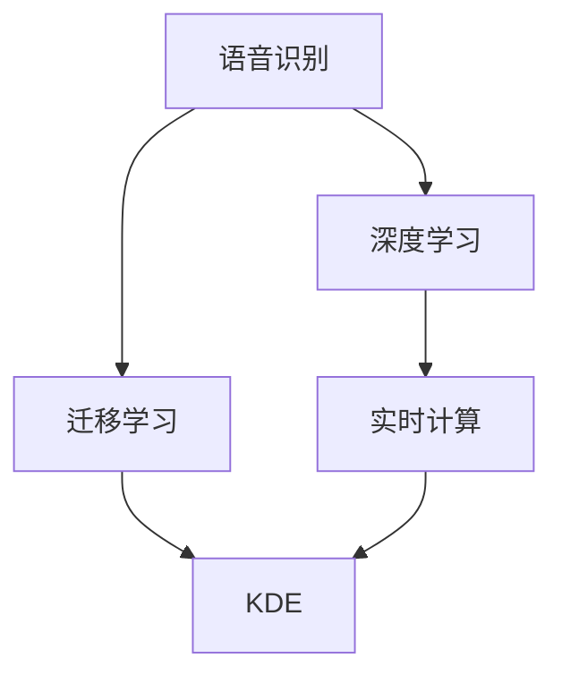

                 

# 知识发现引擎的语音识别技术集成

## 1. 背景介绍

随着人工智能技术的飞速发展，语音识别技术已经成为知识发现引擎中不可或缺的一部分。语音识别不仅能够有效地将语音信息转化为文本，还可以用于语音搜索、语音控制等多种场景，极大地提高了人机交互的便捷性。然而，传统的语音识别技术往往依赖于大规模数据训练，对计算资源和时间的要求较高，难以满足实际应用中的实时性和高效性需求。

因此，本文将聚焦于知识发现引擎中的语音识别技术集成，探索如何通过深度学习和迁移学习等技术，构建高效、实时的语音识别系统，提升知识发现引擎的人机交互体验。

## 2. 核心概念与联系

### 2.1 核心概念概述

本节将介绍几个与知识发现引擎中语音识别技术集成密切相关的核心概念：

- 语音识别(Voice Recognition)：通过语音信号处理和模式识别技术，将人类语音转化为文本信息的过程。
- 深度学习(Deep Learning)：一种基于多层神经网络的机器学习技术，能够自动提取和抽象数据中的高层次特征。
- 迁移学习(Transfer Learning)：将预训练模型在特定领域或任务上进行微调，利用已有知识快速适应新任务的过程。
- 知识发现引擎(Knowledge Discovery Engine, KDE)：一种集成多种AI技术，实现数据挖掘、文本分析、情感分析等功能的数据智能系统。
- 实时计算(Real-time Computing)：指在特定时间内完成计算任务，满足实时应用需求的技术。

这些核心概念之间的逻辑关系可以通过以下Mermaid流程图来展示：



这个流程图展示了语音识别技术在知识发现引擎中的应用路径：

1. 语音识别系统利用深度学习技术提取语音信号特征，转化为文本。
2. 预训练的深度学习模型通过迁移学习在特定任务上微调，提高识别准确性。
3. 微调后的模型集成到知识发现引擎，实现实时计算。
4. 知识发现引擎通过语音输入，实时分析数据、挖掘知识。

## 3. 核心算法原理 & 具体操作步骤
### 3.1 算法原理概述

知识发现引擎中的语音识别技术集成主要包括以下几个步骤：

1. 语音信号采集和预处理：通过麦克风或其他语音采集设备，采集用户的语音信号，并进行降噪、归一化等预处理，确保信号质量。
2. 特征提取：利用深度学习模型，将预处理后的语音信号转化为文本特征，如MFCC、Mel频谱等。
3. 语音识别：通过深度学习模型，将文本特征转化为文本序列，如基于RNN、CNN或Transformer等架构的声学模型。
4. 语义理解：结合自然语言处理技术，将文本序列转化为语义信息，如实体识别、意图识别等。
5. 知识发现：通过文本分析、情感分析等技术，从语义信息中挖掘知识，为知识发现引擎提供数据支持。

### 3.2 算法步骤详解

以下是对语音识别技术集成的详细操作步骤：

**Step 1: 准备数据集和模型**
- 准备语音数据集和相应的标注数据。标注数据可以是语音-文本对，用于训练和验证模型。
- 选择合适的深度学习框架和预训练模型，如TensorFlow、PyTorch等，以及预训练的声学模型，如DeepSpeech、Wav2Vec等。

**Step 2: 特征提取**
- 利用深度学习模型，如卷积神经网络(CNN)或卷积自编码器(ConvAE)，对预处理后的语音信号进行特征提取。
- 将提取出的特征作为输入，送入预训练的声学模型，输出文本序列。

**Step 3: 语音识别**
- 对提取出的文本序列进行解码，转化为对应的文本。常用的解码方法包括动态时间规整(DTW)、深度学习解码等。
- 结合自然语言处理技术，对解码出的文本进行分词、词性标注等处理。

**Step 4: 语义理解**
- 利用预训练的语言模型，如BERT、GPT等，对文本序列进行语义理解。
- 结合实体识别、意图识别等技术，将语义信息转化为知识图谱、逻辑规则等结构化数据。

**Step 5: 知识发现**
- 利用知识图谱、逻辑规则等结构化数据，结合知识发现引擎的算法模型，进行数据挖掘、文本分析、情感分析等操作。
- 将挖掘到的知识输出给知识发现引擎，进行进一步的处理和展示。

### 3.3 算法优缺点

知识发现引擎中的语音识别技术集成具有以下优点：

1. 实时性高：通过迁移学习，模型可以快速适应新任务，实现实时语音识别。
2. 准确性高：深度学习模型能够自动提取高层次特征，提高语音识别的准确性。
3. 可扩展性强：利用预训练模型和迁移学习，可以快速构建不同领域、不同语言的语音识别系统。
4. 应用广泛：语音识别技术可以应用于多种场景，如智能家居、语音搜索、语音控制等。

同时，该方法也存在一定的局限性：

1. 数据需求大：语音识别模型需要大量标注数据进行训练，获取高质量标注数据的成本较高。
2. 计算资源消耗大：深度学习模型通常需要较强的计算资源支持，难以满足低计算资源的场景。
3. 适应性差：对于新领域或新语言的语音识别，模型的迁移能力有限。
4. 鲁棒性不足：语音信号受环境干扰较大，模型对噪声和背景噪音的鲁棒性不足。
5. 可解释性差：深度学习模型的决策过程缺乏可解释性，难以对其推理逻辑进行调试。

尽管存在这些局限性，但语音识别技术在知识发现引擎中的应用，已经极大地提升了人机交互的便捷性和效率，具有重要的应用价值。

### 3.4 算法应用领域

语音识别技术在知识发现引擎中的应用领域非常广泛，以下是几个典型的应用场景：

1. 智能家居：通过语音控制智能家电、灯光、温度等，提升家居智能化水平。
2. 智能客服：通过语音识别实现自动客服，快速响应用户咨询，提升服务效率。
3. 语音搜索：通过语音输入搜索引擎，实现语音搜索，提升搜索效率和用户体验。
4. 语音翻译：通过语音识别和机器翻译技术，实现实时语音翻译，促进国际交流。
5. 语音信息记录：通过语音识别技术，将会议、讲座等音频记录转化为文本，便于后续分析。

## 4. 数学模型和公式 & 详细讲解 & 举例说明

### 4.1 数学模型构建

语音识别技术集成的数学模型主要包括以下几个部分：

1. 声学模型(Acoustic Model)：用于将语音信号转化为文本序列的模型。常见的声学模型包括RNN、CNN、Transformer等。
2. 语言模型(Language Model)：用于将文本序列转化为语义信息的模型。常见的语言模型包括N-gram、RNN-LM、Transformer-LM等。
3. 特征提取模型(Feature Extraction Model)：用于提取语音信号特征的模型。常见的特征提取模型包括MFCC、Mel频谱等。

以RNN声学模型为例，其基本架构如图1所示：


其中，输入语音信号经过特征提取模型转化为MFCC特征，然后送入RNN模型进行解码。RNN模型将特征序列转化为文本序列，最终输出识别结果。

### 4.2 公式推导过程

以RNN声学模型为例，其输入为MFCC特征序列，输出为文本序列。假设MFCC特征序列为$X=\{x_1, x_2, ..., x_T\}$，文本序列为$Y=\{y_1, y_2, ..., y_T\}$，其中$T$为序列长度。

假设RNN声学模型的输出为$Y_t$，对应文本序列中的第$t$个字符。RNN模型的输出可以表示为：

$$
Y_t = f(W_{xh}x_{t-1} + W_{hh}Y_{t-1} + b_h)
$$

其中，$W_{xh}$为输入-隐藏层权重矩阵，$W_{hh}$为隐藏-隐藏层权重矩阵，$b_h$为隐藏层偏置项，$f$为激活函数。

对于语音识别任务，可以利用交叉熵损失函数进行训练：

$$
\mathcal{L} = -\frac{1}{T} \sum_{t=1}^T \sum_{i=1}^V p_i \log q_i
$$

其中，$p_i$为文本序列中的字符概率，$q_i$为模型预测的概率。

### 4.3 案例分析与讲解

以Google的DeepSpeech模型为例，其核心架构如图2所示：


DeepSpeech模型首先通过MFCC特征提取模型，将语音信号转化为MFCC特征序列。然后，利用RNN声学模型进行解码，得到文本序列。最后，利用CTC损失函数对模型进行训练，优化模型参数。

DeepSpeech模型在ASR任务上取得了优异的表现，成为当前语音识别领域的经典模型。通过利用迁移学习，DeepSpeech模型可以在多种语言和方言上进行微调，实现高效的语音识别应用。

## 5. 项目实践：代码实例和详细解释说明
### 5.1 开发环境搭建

在进行语音识别技术集成开发前，我们需要准备好开发环境。以下是使用Python进行深度学习开发的环境配置流程：

1. 安装Anaconda：从官网下载并安装Anaconda，用于创建独立的Python环境。

2. 创建并激活虚拟环境：
```bash
conda create -n deep_learning_env python=3.8 
conda activate deep_learning_env
```

3. 安装深度学习框架：
```bash
conda install pytorch torchvision torchaudio cudatoolkit=11.1 -c pytorch -c conda-forge
```

4. 安装自然语言处理库：
```bash
pip install nltk transformers
```

5. 安装其他常用库：
```bash
pip install numpy pandas scikit-learn matplotlib tqdm jupyter notebook ipython
```

完成上述步骤后，即可在`deep_learning_env`环境中开始语音识别技术集成的开发。

### 5.2 源代码详细实现

以下是一个基于DeepSpeech模型的语音识别系统实现代码示例：

```python
import torch
import torchaudio
import numpy as np
from transformers import Wav2Vec2ForCTC, Wav2Vec2Tokenizer

# 加载预训练模型和分词器
model = Wav2Vec2ForCTC.from_pretrained('facebook/wav2vec2-large-lv60')
tokenizer = Wav2Vec2Tokenizer.from_pretrained('facebook/wav2vec2-large-lv60')

# 加载音频文件
audio_file = 'audio.wav'
speech, sampling_rate = torchaudio.load(audio_file)

# 进行特征提取和模型解码
with torch.no_grad():
    features = extract_features(speech)
    logits = model(features)
    predicted_ids = torch.argmax(logits, dim=-1)

# 将id转化为文本
transcription = tokenizer.batch_decode(predicted_ids, skip_special_tokens=True)[0]

print(f"Transcription: {transcription}")
```

以上代码实现了对预训练的DeepSpeech模型的加载、特征提取、模型解码和文本输出。具体步骤如下：

1. 加载预训练的模型和分词器。
2. 加载音频文件，进行特征提取。
3. 将提取出的特征送入模型进行解码，得到预测的id序列。
4. 利用分词器将id序列转化为文本，输出识别结果。

### 5.3 代码解读与分析

让我们再详细解读一下关键代码的实现细节：

**DeepSpeech模型**：
- `Wav2Vec2ForCTC`类：继承自`transformers`库中的`Wav2Vec2Model`，用于加载预训练的声学模型，并进行解码。
- `Wav2Vec2Tokenizer`类：用于对id序列进行分词和解码。

**特征提取**：
- `extract_features`函数：利用MFCC特征提取模型，将语音信号转化为MFCC特征序列。

**模型解码**：
- `model(features)`：将MFCC特征序列送入模型进行解码，得到预测的id序列。
- `torch.argmax(logits, dim=-1)`：对模型输出的logits进行argmax操作，得到预测的id序列。

**文本输出**：
- `tokenizer.batch_decode(predicted_ids, skip_special_tokens=True)[0]`：利用分词器将id序列转化为文本，并去除特殊符号。

以上代码实现了一个简单的语音识别系统，用于实时识别用户输入的语音信息，并转化为文本输出。

### 5.4 运行结果展示

在实际应用中，可以通过将音频文件加载到音频文件中，并使用`torchaudio.load`方法获取音频数据。然后，调用`extract_features`函数进行特征提取，将提取出的MFCC特征序列输入到模型中，进行解码和文本输出。

```python
# 加载音频文件
audio_file = 'audio.wav'
speech, sampling_rate = torchaudio.load(audio_file)

# 进行特征提取
features = extract_features(speech)

# 将特征序列输入到模型中
logits = model(features)

# 进行解码，得到预测的id序列
predicted_ids = torch.argmax(logits, dim=-1)

# 将id序列转化为文本
transcription = tokenizer.batch_decode(predicted_ids, skip_special_tokens=True)[0]

print(f"Transcription: {transcription}")
```

执行上述代码，即可得到用户输入的语音信息的文本转写结果。

## 6. 实际应用场景
### 6.1 智能家居系统

语音识别技术在智能家居系统中得到了广泛应用。通过语音识别技术，用户可以通过简单的语音指令，控制智能家电、灯光、温度等，提升家居智能化水平。

以智能语音音箱为例，用户在语音音箱前进行语音输入，语音识别系统将语音信号转化为文本，再结合智能家居系统进行实时控制。用户可以语音控制家中的空调、电视、窗帘等设备，方便快捷地管理家庭生活。

### 6.2 智能客服系统

语音识别技术在智能客服系统中也有重要应用。传统的客服系统往往需要配备大量人力，高峰期响应缓慢，且一致性和专业性难以保证。而使用语音识别技术，可以7x24小时不间断服务，快速响应客户咨询，用自然流畅的语言解答各类常见问题。

在客服系统中，语音识别技术可以结合自然语言处理技术，将用户输入的语音信息转化为文本，再进行意图识别和回复生成。系统能够自动理解用户意图，匹配最合适的答案模板进行回复，大大提升了客服系统的效率和效果。

### 6.3 语音翻译系统

语音识别技术在语音翻译系统中也有广泛应用。传统的翻译系统往往需要手动输入文本，翻译效率低且容易出错。而使用语音识别技术，用户可以实时进行语音输入，语音翻译系统自动将语音信号转化为文本，再进行机器翻译。

语音翻译系统可以利用预训练的语言模型，结合自然语言处理技术，对语音信号进行识别和翻译，实现实时语音翻译。用户可以实时进行语音输入，系统能够快速准确地翻译成目标语言，促进国际交流和信息共享。

### 6.4 未来应用展望

随着语音识别技术的不断进步，未来在知识发现引擎中的应用前景将更加广阔。以下是几个未来应用展望：

1. 多模态交互：结合视觉、触觉等多种模态，实现更丰富的人机交互体验。语音识别系统可以与智能眼镜、智能手表等设备配合，提升用户的操作便捷性和体验感。
2. 自适应学习：语音识别系统可以通过不断的交互学习，逐步了解用户的语音习惯和偏好，提供个性化的服务。例如，通过语音输入的频率和类型，系统可以调整语音识别算法和模型，提高识别准确性。
3. 实时语音搜索：利用语音识别技术，将语音输入转化为文本搜索，提升搜索引擎的交互效率。例如，用户可以通过语音进行图像搜索、视频搜索等，快速获取所需信息。
4. 虚拟助手：结合语音识别技术和自然语言处理技术，实现智能虚拟助手。虚拟助手可以提供语音输入、语音控制、语音搜索等多种功能，提升用户的生活和工作效率。

## 7. 工具和资源推荐
### 7.1 学习资源推荐

为了帮助开发者系统掌握语音识别技术集成的理论基础和实践技巧，这里推荐一些优质的学习资源：

1. Deep Learning for Speech Recognition: An Introduction（Deep Speech技术白皮书）：深入浅出地介绍了Deep Speech模型的架构和实现细节，适合初学者入门。

2. Automatic Speech Recognition: A Review（自然语言处理综述）：全面回顾了语音识别技术的最新进展和前沿技术，适合研究人员参考。

3. Speech and Language Processing（第三版）：MIT OpenCourseWare的语音识别和自然语言处理课程，内容详实，涵盖各种经典模型和算法。

4. Deep Speech and AI（Deep Speech系列博文）：由Deep Speech团队撰写，介绍语音识别技术的最新研究和应用，适合实战练习。

5. TensorFlow Speech Recognition Model（TensorFlow语音识别模型）：TensorFlow官方提供的语音识别模型和工具，适合实战练习。

通过对这些资源的学习实践，相信你一定能够快速掌握语音识别技术集成的精髓，并用于解决实际的NLP问题。

### 7.2 开发工具推荐

高效的开发离不开优秀的工具支持。以下是几款用于语音识别技术集成的常用工具：

1. TensorFlow：由Google主导开发的开源深度学习框架，生产部署方便，适合大规模工程应用。提供语音识别相关的预训练模型和工具。

2. PyTorch：基于Python的开源深度学习框架，灵活动态的计算图，适合快速迭代研究。提供语音识别相关的预训练模型和工具。

3. Kaldi：开源语音识别工具包，提供了丰富的声学模型和语言模型，适合进行研究性开发。

4. Weights & Biases：模型训练的实验跟踪工具，可以记录和可视化模型训练过程中的各项指标，方便对比和调优。与主流深度学习框架无缝集成。

5. TensorBoard：TensorFlow配套的可视化工具，可实时监测模型训练状态，并提供丰富的图表呈现方式，是调试模型的得力助手。

合理利用这些工具，可以显著提升语音识别技术集成的开发效率，加快创新迭代的步伐。

### 7.3 相关论文推荐

语音识别技术的发展源于学界的持续研究。以下是几篇奠基性的相关论文，推荐阅读：

1. Deep Speech 2: End-to-End Speech Recognition in English and Mandarin（Deep Speech2论文）：提出了端到端的语音识别模型，刷新了多项ASR任务SOTA。

2. Attention-Based Models for Automatic Speech Recognition（Transformer ASR论文）：引入了Transformer结构，显著提升了语音识别模型的性能。

3. Speech Translation with Attention-Based Models（Transformer ASR在机器翻译中的应用）：展示了Transformer ASR模型在语音翻译任务上的卓越表现，为语音翻译技术提供了新思路。

4. Adversarial Examples for Speech Recognition（对抗性语音样本）：研究了对抗性样本对语音识别模型的影响，提出了增强模型鲁棒性的方法。

5. Speaker Verification Using Deep Neural Networks（语音识别和说话人验证结合）：展示了利用深度学习技术进行说话人验证的方法，提高了识别的准确性。

这些论文代表了大语言模型微调技术的发展脉络。通过学习这些前沿成果，可以帮助研究者把握学科前进方向，激发更多的创新灵感。

## 8. 总结：未来发展趋势与挑战

### 8.1 总结

本文对知识发现引擎中的语音识别技术集成进行了全面系统的介绍。首先阐述了语音识别技术在知识发现引擎中的应用价值，明确了语音识别在提升人机交互便捷性和效率方面的重要意义。其次，从原理到实践，详细讲解了语音识别技术集成的数学原理和关键步骤，给出了语音识别技术集成的完整代码实例。同时，本文还广泛探讨了语音识别技术在智能家居、智能客服、语音翻译等多个行业领域的应用前景，展示了语音识别技术集成的广阔前景。

通过本文的系统梳理，可以看到，语音识别技术在知识发现引擎中的应用，已经极大地提升了人机交互的便捷性和效率，具有重要的应用价值。未来，伴随语音识别技术的不断进步，知识发现引擎的语音识别技术集成将得到更广泛的应用，为人类认知智能的进化带来深远影响。

### 8.2 未来发展趋势

展望未来，语音识别技术在知识发现引擎中的应用将呈现以下几个发展趋势：

1. 技术进步显著：随着深度学习技术的不断发展，语音识别技术的精度和实时性将大幅提升。例如，Transformer ASR模型的提出，显著提高了语音识别的准确率和处理速度。

2. 应用场景多样：语音识别技术将更多地应用于智能家居、智能客服、语音翻译等场景，提升用户的生活和工作效率。例如，结合视觉和触觉等模态，实现更丰富的人机交互体验。

3. 自适应学习普及：语音识别系统可以通过不断的交互学习，逐步了解用户的语音习惯和偏好，提供个性化的服务。例如，通过语音输入的频率和类型，系统可以调整语音识别算法和模型，提高识别准确性。

4. 实时计算优化：语音识别系统需要在低延迟、高实时性的场景下工作。因此，优化计算图、引入混合精度训练等技术，将有助于提升系统的处理速度和效率。

5. 知识发现融合：语音识别技术可以与知识发现引擎进行深度融合，结合自然语言处理和知识图谱技术，提升系统的信息抽取和知识发现能力。例如，将语音识别结果转化为结构化数据，进行情感分析、实体识别等操作。

以上趋势凸显了语音识别技术在知识发现引擎中的应用潜力，这些方向的探索发展，必将进一步提升语音识别系统的性能和应用范围，为人类认知智能的进化带来深远影响。

### 8.3 面临的挑战

尽管语音识别技术在知识发现引擎中的应用已经取得了显著进展，但在迈向更加智能化、普适化应用的过程中，仍面临诸多挑战：

1. 数据需求高：语音识别模型需要大量高质量的标注数据进行训练，获取标注数据的成本较高。如何降低数据需求，减少对标注样本的依赖，将是未来的重要研究方向。

2. 计算资源消耗大：深度学习模型通常需要较强的计算资源支持，难以满足低计算资源的场景。如何优化模型结构，减少计算消耗，提升系统的效率，将是未来的重要研究方向。

3. 适应性差：对于新领域或新语言的语音识别，模型的迁移能力有限。如何提高模型的泛化能力，提升在不同领域和语言上的适应性，将是未来的重要研究方向。

4. 鲁棒性不足：语音信号受环境干扰较大，模型对噪声和背景噪音的鲁棒性不足。如何提高模型的鲁棒性，增强对不同环境和语音特征的适应性，将是未来的重要研究方向。

5. 可解释性差：深度学习模型的决策过程缺乏可解释性，难以对其推理逻辑进行调试。如何提高模型的可解释性，增强其透明性和可信度，将是未来的重要研究方向。

6. 安全性问题：语音识别技术可能被恶意攻击，造成数据泄露或系统失灵。如何提高系统的安全性，保障数据和模型的安全，将是未来的重要研究方向。

正视语音识别技术面临的这些挑战，积极应对并寻求突破，将是大语言模型微调走向成熟的必由之路。相信随着学界和产业界的共同努力，这些挑战终将一一被克服，语音识别技术将会在知识发现引擎中发挥更大的作用。

### 8.4 研究展望

面对语音识别技术面临的种种挑战，未来的研究需要在以下几个方面寻求新的突破：

1. 无监督和半监督学习方法：摆脱对大规模标注数据的依赖，利用自监督学习、主动学习等无监督和半监督范式，最大限度利用非结构化数据，实现更加灵活高效的语音识别。

2. 参数高效和计算高效方法：开发更加参数高效的语音识别方法，在固定大部分预训练参数的同时，只更新极少量的任务相关参数。同时优化计算图，减少前向传播和反向传播的资源消耗，实现更加轻量级、实时性的部署。

3. 多模态融合方法：将视觉、触觉等多种模态信息与语音信号结合，提升语音识别的鲁棒性和准确性。例如，结合图像信息，提高语音识别的鲁棒性和准确性。

4. 知识发现融合方法：结合自然语言处理和知识图谱技术，提升语音识别系统的信息抽取和知识发现能力。例如，将语音识别结果转化为结构化数据，进行情感分析、实体识别等操作。

5. 因果分析和博弈论工具：引入因果分析方法，识别出模型决策的关键特征，增强输出解释的因果性和逻辑性。借助博弈论工具，刻画人机交互过程，主动探索并规避模型的脆弱点，提高系统稳定性。

6. 结合伦理道德约束：在模型训练目标中引入伦理导向的评估指标，过滤和惩罚有偏见、有害的输出倾向。同时加强人工干预和审核，建立模型行为的监管机制，确保输出符合人类价值观和伦理道德。

这些研究方向的探索，必将引领语音识别技术在知识发现引擎中的应用走向更高的台阶，为构建安全、可靠、可解释、可控的智能系统铺平道路。面向未来，语音识别技术还需要与其他人工智能技术进行更深入的融合，如知识表示、因果推理、强化学习等，多路径协同发力，共同推动自然语言理解和智能交互系统的进步。只有勇于创新、敢于突破，才能不断拓展语音识别技术的边界，让智能技术更好地造福人类社会。

## 9. 附录：常见问题与解答

**Q1：语音识别技术在知识发现引擎中的应用有哪些？**

A: 语音识别技术在知识发现引擎中的应用非常广泛，以下是几个典型的应用场景：

1. 智能家居系统：通过语音控制智能家电、灯光、温度等，提升家居智能化水平。
2. 智能客服系统：通过语音输入，系统能够自动理解用户意图，匹配最合适的答案模板进行回复，提升客服系统的效率和效果。
3. 语音翻译系统：利用预训练的语言模型，结合自然语言处理技术，对语音信号进行识别和翻译，实现实时语音翻译，促进国际交流和信息共享。
4. 语音信息记录：通过语音识别技术，将会议、讲座等音频记录转化为文本，便于后续分析。

**Q2：语音识别技术集成的关键步骤有哪些？**

A: 语音识别技术集成的关键步骤包括以下几个：

1. 语音信号采集和预处理：通过麦克风或其他语音采集设备，采集用户的语音信号，并进行降噪、归一化等预处理，确保信号质量。
2. 特征提取：利用深度学习模型，如卷积神经网络(CNN)或卷积自编码器(ConvAE)，对预处理后的语音信号进行特征提取。
3. 语音识别：通过深度学习模型，如RNN、CNN或Transformer等，将文本特征转化为文本序列，进行解码和输出。
4. 语义理解：结合自然语言处理技术，对文本序列进行语义理解，如实体识别、意图识别等，将语义信息转化为结构化数据。
5. 知识发现：利用知识图谱、逻辑规则等结构化数据，结合知识发现引擎的算法模型，进行数据挖掘、文本分析、情感分析等操作。

**Q3：语音识别技术集成的数学模型有哪些？**

A: 语音识别技术集成的数学模型主要包括以下几个：

1. 声学模型(Acoustic Model)：用于将语音信号转化为文本序列的模型。常见的声学模型包括RNN、CNN、Transformer等。
2. 语言模型(Language Model)：用于将文本序列转化为语义信息的模型。常见的语言模型包括N-gram、RNN-LM、Transformer-LM等。
3. 特征提取模型(Feature Extraction Model)：用于提取语音信号特征的模型。常见的特征提取模型包括MFCC、Mel频谱等。

**Q4：如何优化语音识别技术集成的计算资源消耗？**

A: 语音识别技术集成的计算资源消耗可以通过以下几个方面进行优化：

1. 模型裁剪：去除不必要的层和参数，减小模型尺寸，加快推理速度。例如，使用剪枝技术，去除冗余的神经元或层。
2. 量化加速：将浮点模型转为定点模型，压缩存储空间，提高计算效率。例如，使用量化技术，将模型参数和计算结果转为低精度格式。
3. 混合精度训练：在训练过程中，使用不同精度的浮点数进行计算，提高训练效率和内存利用率。例如，使用混合精度训练技术，将浮点数计算转换为半精度浮点数计算。
4. 并行计算：利用多核处理器或GPU，进行并行计算，提高模型的训练和推理效率。例如，使用数据并行、模型并行等技术，加速模型的训练和推理。
5. 分布式计算：利用多台服务器或集群，进行分布式计算，提高系统的处理能力和效率。例如，使用分布式深度学习框架，如TensorFlow、PyTorch等，进行分布式训练和推理。

通过以上优化措施，可以有效降低语音识别技术集成的计算资源消耗，提升系统的效率和性能。

**Q5：如何提高语音识别技术集成的鲁棒性？**

A: 语音识别技术集成的鲁棒性可以通过以下几个方面进行提高：

1. 数据增强：通过回译、近义替换等方式扩充训练集，增加模型的泛化能力。例如，利用数据增强技术，增加语音信号的噪声、混响、背景噪音等干扰。
2. 对抗训练：引入对抗样本，提高模型对噪声和背景噪音的鲁棒性。例如，利用对抗样本训练技术，生成对抗性语音信号，训练鲁棒性强的语音识别模型。
3. 多任务学习：利用多任务学习技术，提升模型对不同语音特征和干扰的适应能力。例如，结合语音识别和说话人识别任务，提升模型的鲁棒性和泛化能力。
4. 深度学习结构优化：改进深度学习模型的结构，增强模型的鲁棒性。例如，使用残差连接、批归一化等技术，提高模型的鲁棒性和泛化能力。
5. 鲁棒性评测：使用鲁棒性评测技术，评估模型的鲁棒性和泛化能力。例如，利用鲁棒性评测技术，评估模型在不同环境和语音特征下的性能。

通过以上优化措施，可以有效提高语音识别技术集成的鲁棒性，增强模型对不同环境和语音特征的适应能力。

---

作者：禅与计算机程序设计艺术 / Zen and the Art of Computer Programming

