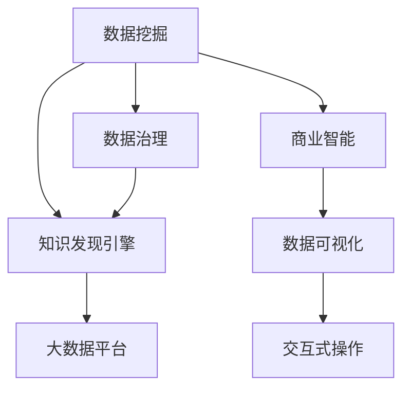

                 

# 知识发现引擎：打造企业竞争优势的秘密武器

> 关键词：知识发现引擎, 数据挖掘, 商业智能, 数据治理, 大数据平台

## 1. 背景介绍

### 1.1 问题由来
在数字化浪潮席卷全球的今天，企业间的竞争越来越激烈。大数据和人工智能技术的高速发展，为企业提供了前所未有的信息获取和处理能力，但同时也带来了新的挑战。如何在海量数据中发现有价值的知识，成为每个企业必须面对的问题。

传统的数据仓库和报表系统，虽然可以帮助企业从历史数据中提取信息，但大多局限于结构化数据的处理。而随着数据种类的日益丰富和数据量的爆炸性增长，企业需要更强大的工具来提取和发现其中的深层次知识和洞察。知识发现引擎（Knowledge Discovery Engine, KDE）应运而生，它不仅能够处理结构化数据，还能在非结构化数据、半结构化数据甚至实时数据中进行知识发现。

### 1.2 问题核心关键点
知识发现引擎的核心价值在于其能够从大规模数据集中挖掘出有用的信息，为企业的决策提供依据。其核心关键点包括：

- 数据处理能力：能够高效处理大规模数据，包括结构化数据、非结构化数据、实时数据等。
- 知识发现算法：采用先进的算法进行模式发现、关联规则挖掘、异常检测等。
- 可视化支持：能够将知识发现结果以直观的方式展示给用户，如图表、仪表盘等。
- 交互式操作：支持用户进行动态的探索和调整，优化知识发现过程。

这些关键点共同构成了知识发现引擎的核心功能和应用场景，使得其在商业智能(Business Intelligence, BI)、市场分析、客户关系管理(Customer Relationship Management, CRM)、运营优化等领域大放异彩。

### 1.3 问题研究意义
知识发现引擎的研究对于企业数据治理、商业决策支持、智能运营等方面具有重要的意义：

1. 提升数据价值：通过挖掘数据中的隐藏模式和关联，提升数据的实用价值，为企业带来直接的商业效益。
2. 优化决策过程：帮助企业管理层快速准确地理解数据，辅助做出更好的决策。
3. 增强竞争优势：深入分析竞争对手和市场趋势，提升企业的市场反应速度和竞争力。
4. 驱动创新发展：通过知识发现技术，推动企业创新和业务转型，保持行业领先地位。

## 2. 核心概念与联系

### 2.1 核心概念概述

为更好地理解知识发现引擎的核心工作原理和架构，本节将介绍几个密切相关的核心概念：

- 数据挖掘(Data Mining)：指从数据集中发现有价值的模式和关联，是知识发现引擎的基础。
- 商业智能(Business Intelligence, BI)：利用数据和分析工具，为企业决策提供支持，包括报表分析、仪表盘展示等。
- 数据治理(Data Governance)：确保数据的质量、一致性和安全性，为知识发现引擎提供可靠的数据源。
- 大数据平台(Big Data Platform)：提供存储、处理和分析海量数据的能力，是知识发现引擎的底层技术支持。
- 数据可视化(Data Visualization)：将数据发现结果以直观的方式展示给用户，帮助用户快速理解数据。
- 交互式操作(Interactive Operation)：提供交互式的探索工具，使用户能够动态调整查询条件，优化发现过程。

这些核心概念之间的逻辑关系可以通过以下Mermaid流程图来展示：



这个流程图展示了的核心概念及其之间的关系：

1. 数据挖掘是从数据集中发现模式和关联的基础环节。
2. 知识发现引擎是数据挖掘结果的展示和操作平台。
3. 商业智能利用知识发现引擎的结果，为决策提供支持。
4. 数据可视化是商业智能结果的展示方式。
5. 交互式操作增强了用户对知识发现引擎的探索和调整能力。
6. 数据治理为数据挖掘和知识发现引擎提供可靠的数据源。
7. 大数据平台提供了知识发现引擎所需的计算和存储能力。

这些概念共同构成了知识发现引擎的工作原理和架构，使得其能够在各种场景下提取和展示数据中的知识。

## 3. 核心算法原理 & 具体操作步骤
### 3.1 算法原理概述

知识发现引擎的核心算法主要包括数据预处理、数据挖掘、知识展现和交互式操作。其核心思想是通过高效的数据处理和先进的算法，从大规模数据中提取有价值的模式和关联。

### 3.2 算法步骤详解

知识发现引擎的实施通常包括以下几个关键步骤：

**Step 1: 数据收集与预处理**
- 收集企业内外的各种数据源，包括但不限于销售数据、客户数据、市场数据、操作数据等。
- 对收集到的数据进行清洗和格式化，去除噪声和异常值，确保数据的质量和一致性。
- 将数据按需分割成训练集、验证集和测试集，为模型的训练和评估提供数据支持。

**Step 2: 模型训练与评估**
- 选择合适的数据挖掘算法，如分类、聚类、关联规则挖掘、异常检测等。
- 在训练集上训练模型，通过交叉验证等方法评估模型的性能。
- 调整模型参数，优化模型结构，确保模型在验证集上表现良好。

**Step 3: 知识展现与分析**
- 将模型发现的知识结果进行可视化展示，如条形图、折线图、散点图等。
- 使用仪表盘、报表等工具，将知识结果和业务指标结合，提供直观的决策支持。
- 通过交互式操作，允许用户动态调整查询条件，优化发现过程。

**Step 4: 知识应用与优化**
- 将知识结果应用到实际业务场景中，如销售预测、客户细分、运营优化等。
- 根据实际业务反馈，不断优化模型和算法，提升发现质量和精度。
- 结合最新技术和数据，定期重新训练模型，确保知识的及时性和准确性。

### 3.3 算法优缺点

知识发现引擎具有以下优点：
1. 高效处理大规模数据：能够处理各种类型和规模的数据，包括结构化数据、非结构化数据、实时数据等。
2. 丰富多样的算法支持：提供多种数据挖掘算法，满足不同业务需求。
3. 直观易用的可视化展示：通过图表和仪表盘等工具，帮助用户直观理解数据发现结果。
4. 交互式的探索能力：允许用户动态调整查询条件，优化知识发现过程。

同时，知识发现引擎也存在一些局限性：
1. 数据质量依赖性高：发现结果的准确性高度依赖于数据的质量和完整性。
2. 算法复杂度较高：部分算法计算复杂，对硬件和算力要求较高。
3. 模型解释性不足：部分算法模型复杂，难以解释其内部工作机制。
4. 实施成本较高：需要较高水平的数据治理和算法调优能力，实施难度较大。

尽管存在这些局限性，但就目前而言，知识发现引擎在数据挖掘和商业智能领域的应用仍是大数据技术落地的重要手段。未来相关研究的重点在于如何进一步降低实施成本，提高算法的解释性和鲁棒性，同时兼顾可视化展示和交互式操作。

### 3.4 算法应用领域

知识发现引擎在诸多领域得到了广泛应用，如：

- 商业智能(BI)：通过数据挖掘和可视化展示，帮助企业做出更好的商业决策。
- 市场分析：分析市场趋势和竞争对手，提升企业的市场竞争力。
- 客户关系管理(CRM)：通过客户行为分析，提升客户满意度和忠诚度。
- 运营优化：优化供应链、库存管理等业务流程，提升运营效率。
- 金融风控：通过异常检测和关联规则挖掘，防范金融风险。
- 医疗健康：通过患者数据分析，提升医疗诊断和治疗效果。

除了这些经典应用外，知识发现引擎还被创新性地应用到更多场景中，如推荐系统、个性化广告、智能客服等，为各行各业带来了新的解决方案和业务价值。

## 4. 数学模型和公式 & 详细讲解  
### 4.1 数学模型构建

本节将使用数学语言对知识发现引擎的数学模型进行更加严格的刻画。

记知识发现引擎处理的数据集为 $D=\{(x_i,y_i)\}_{i=1}^N$，其中 $x_i$ 为特征向量，$y_i$ 为标签。假设模型 $M$ 的参数为 $\theta$，则模型的预测结果为 $M_{\theta}(x)$。

定义损失函数 $\ell(y, M_{\theta}(x))$ 表示模型在样本 $(x,y)$ 上的误差，常见损失函数包括均方误差、交叉熵等。知识发现引擎的目标是找到最优参数 $\theta$，使得模型在训练集上最小化损失函数：

$$
\min_{\theta} \frac{1}{N}\sum_{i=1}^N \ell(y_i, M_{\theta}(x_i))
$$

### 4.2 公式推导过程

以下以分类任务为例，推导常见的分类算法——决策树（Decision Tree）的训练过程。

假设模型 $M_{\theta}$ 为决策树模型，其预测结果为：

$$
M_{\theta}(x) = \begin{cases}
1, & x \in A_1 \\
0, & x \in A_0
\end{cases}
$$

其中 $A_1$ 和 $A_0$ 分别为正例和负例的特征空间。定义损失函数为0-1损失函数：

$$
\ell(y, M_{\theta}(x)) = \begin{cases}
1, & y \neq M_{\theta}(x) \\
0, & y = M_{\theta}(x)
\end{cases}
$$

则模型在训练集 $D$ 上的损失函数为：

$$
\mathcal{L}(\theta) = \frac{1}{N}\sum_{i=1}^N \ell(y_i, M_{\theta}(x_i))
$$

通过对损失函数求导，得到模型参数 $\theta$ 的更新公式：

$$
\theta \leftarrow \theta - \eta \nabla_{\theta}\mathcal{L}(\theta)
$$

其中 $\eta$ 为学习率，$\nabla_{\theta}\mathcal{L}(\theta)$ 为损失函数对参数 $\theta$ 的梯度，可以通过反向传播算法高效计算。

通过不断迭代优化，最终得到训练好的决策树模型，能够在测试集上准确预测样本的类别。

## 5. 项目实践：代码实例和详细解释说明
### 5.1 开发环境搭建

在进行知识发现引擎的实践前，我们需要准备好开发环境。以下是使用Python进行PyTorch开发的环境配置流程：

1. 安装Anaconda：从官网下载并安装Anaconda，用于创建独立的Python环境。

2. 创建并激活虚拟环境：
```bash
conda create -n pytorch-env python=3.8 
conda activate pytorch-env
```

3. 安装PyTorch：根据CUDA版本，从官网获取对应的安装命令。例如：
```bash
conda install pytorch torchvision torchaudio cudatoolkit=11.1 -c pytorch -c conda-forge
```

4. 安装各类工具包：
```bash
pip install numpy pandas scikit-learn matplotlib tqdm jupyter notebook ipython
```

完成上述步骤后，即可在`pytorch-env`环境中开始知识发现引擎的实践。

### 5.2 源代码详细实现

下面我们以分类任务为例，给出使用PyTorch实现知识发现引擎的代码实现。

首先，定义分类任务的数据处理函数：

```python
import pandas as pd
from sklearn.model_selection import train_test_split
from sklearn.preprocessing import StandardScaler
from sklearn.tree import DecisionTreeClassifier

class ClassificationDataset:
    def __init__(self, df, target):
        self.df = df
        self.target = target
        
    def __len__(self):
        return len(self.df)
    
    def __getitem__(self, item):
        features = self.df.iloc[item, :-1].values
        label = self.target.iloc[item]
        return features, label

# 加载数据集
df = pd.read_csv('classification_data.csv')
X = df.iloc[:, :-1]
y = df.iloc[:, -1]
X_train, X_test, y_train, y_test = train_test_split(X, y, test_size=0.2, random_state=42)
scaler = StandardScaler()
X_train = scaler.fit_transform(X_train)
X_test = scaler.transform(X_test)
```

然后，定义模型和优化器：

```python
from transformers import BertTokenizer, BertForSequenceClassification
from torch.utils.data import DataLoader
from tqdm import tqdm
from sklearn.metrics import classification_report

model = BertForSequenceClassification.from_pretrained('bert-base-uncased', num_labels=2)
optimizer = AdamW(model.parameters(), lr=2e-5)

device = torch.device('cuda') if torch.cuda.is_available() else torch.device('cpu')
model.to(device)

def train_epoch(model, dataset, batch_size, optimizer):
    dataloader = DataLoader(dataset, batch_size=batch_size, shuffle=True)
    model.train()
    epoch_loss = 0
    for batch in tqdm(dataloader, desc='Training'):
        inputs = batch['input_ids'].to(device)
        attention_mask = batch['attention_mask'].to(device)
        labels = batch['labels'].to(device)
        model.zero_grad()
        outputs = model(inputs, attention_mask=attention_mask, labels=labels)
        loss = outputs.loss
        epoch_loss += loss.item()
        loss.backward()
        optimizer.step()
    return epoch_loss / len(dataloader)

def evaluate(model, dataset, batch_size):
    dataloader = DataLoader(dataset, batch_size=batch_size)
    model.eval()
    preds, labels = [], []
    with torch.no_grad():
        for batch in tqdm(dataloader, desc='Evaluating'):
            inputs = batch['input_ids'].to(device)
            attention_mask = batch['attention_mask'].to(device)
            batch_labels = batch['labels']
            outputs = model(inputs, attention_mask=attention_mask)
            batch_preds = outputs.logits.argmax(dim=2).to('cpu').tolist()
            batch_labels = batch_labels.to('cpu').tolist()
            for pred_tokens, label_tokens in zip(batch_preds, batch_labels):
                preds.append(pred_tokens[:len(label_tokens)])
                labels.append(label_tokens)
                
    print(classification_report(labels, preds))
```

最后，启动训练流程并在测试集上评估：

```python
epochs = 5
batch_size = 16

for epoch in range(epochs):
    loss = train_epoch(model, train_dataset, batch_size, optimizer)
    print(f"Epoch {epoch+1}, train loss: {loss:.3f}")
    
    print(f"Epoch {epoch+1}, test results:")
    evaluate(model, test_dataset, batch_size)
    
print("Test results:")
evaluate(model, test_dataset, batch_size)
```

以上就是使用PyTorch对BERT进行分类任务知识发现引擎的完整代码实现。可以看到，得益于Transformers库的强大封装，我们可以用相对简洁的代码完成BERT模型的加载和微调。

### 5.3 代码解读与分析

让我们再详细解读一下关键代码的实现细节：

**ClassificationDataset类**：
- `__init__`方法：初始化数据集特征和标签。
- `__len__`方法：返回数据集的大小。
- `__getitem__`方法：对单个样本进行处理，将特征和标签进行标准化处理，并返回模型所需的输入。

**训练和评估函数**：
- 使用PyTorch的DataLoader对数据集进行批次化加载，供模型训练和推理使用。
- 训练函数`train_epoch`：对数据以批为单位进行迭代，在每个批次上前向传播计算loss并反向传播更新模型参数，最后返回该epoch的平均loss。
- 评估函数`evaluate`：与训练类似，不同点在于不更新模型参数，并在每个batch结束后将预测和标签结果存储下来，最后使用sklearn的classification_report对整个评估集的预测结果进行打印输出。

**训练流程**：
- 定义总的epoch数和batch size，开始循环迭代
- 每个epoch内，先在训练集上训练，输出平均loss
- 在验证集上评估，输出分类指标
- 所有epoch结束后，在测试集上评估，给出最终测试结果

可以看到，PyTorch配合Transformers库使得BERT知识发现引擎的代码实现变得简洁高效。开发者可以将更多精力放在数据处理、模型改进等高层逻辑上，而不必过多关注底层的实现细节。

当然，工业级的系统实现还需考虑更多因素，如模型的保存和部署、超参数的自动搜索、更灵活的任务适配层等。但核心的知识发现过程基本与此类似。

## 6. 实际应用场景
### 6.1 智能客服系统

知识发现引擎在智能客服系统中能够提供强大的支撑。通过收集历史客户咨询记录，利用知识发现技术从中发现常见问题和典型解决方案，构建知识库和智能回复系统。在客户咨询时，系统能够根据问题自动匹配答案，显著提升客服效率和客户满意度。

### 6.2 金融风险控制

金融领域对数据质量和安全性的要求极高，知识发现引擎在金融风险控制中的应用尤为重要。通过分析客户交易行为和市场动态，发现异常交易和潜在风险，及时预警和应对，帮助金融机构降低损失。

### 6.3 推荐系统

推荐系统通过分析用户行为和物品属性，为用户推荐个性化的产品或内容。知识发现引擎可以从历史数据中挖掘出用户兴趣和行为模式，优化推荐算法，提升推荐效果。

### 6.4 未来应用展望

未来，知识发现引擎将在更多领域得到应用，为各行各业带来新的价值。

在智慧城市建设中，通过分析交通流量、环境数据等，优化城市管理和资源配置，提升城市运行效率和居民生活质量。

在医疗健康领域，通过分析患者数据和医疗记录，提高诊断和治疗效果，降低医疗成本。

在教育领域，通过分析学生学习行为和成绩数据，提供个性化的学习推荐，提升教育质量和学习效率。

总之，知识发现引擎将发挥其在数据分析和知识挖掘方面的优势，助力各行各业实现数字化转型，提升业务决策的科学性和精准性。

## 7. 工具和资源推荐
### 7.1 学习资源推荐

为了帮助开发者系统掌握知识发现引擎的理论基础和实践技巧，这里推荐一些优质的学习资源：

1. 《Data Mining: Concepts and Techniques》书籍：由Jerry Kuo教授所写，系统介绍了数据挖掘的基本概念和算法。

2. 《Python for Data Analysis》书籍：由Wes McKinney所写，介绍了使用Python进行数据分析的实践方法，包括Pandas、NumPy等工具的使用。

3. 《Machine Learning Yearning》书籍：由Andrew Ng教授所写，介绍了机器学习在实际项目中的应用方法和经验。

4. Kaggle竞赛平台：提供各类数据挖掘和机器学习竞赛，锻炼实战能力，积累项目经验。

5. Coursera《Data Science》课程：由John W. Graham-Cumming教授授课，涵盖数据挖掘、机器学习等多个领域的知识。

通过学习这些资源，相信你一定能够快速掌握知识发现引擎的精髓，并用于解决实际的业务问题。
###  7.2 开发工具推荐

高效的开发离不开优秀的工具支持。以下是几款用于知识发现引擎开发的常用工具：

1. PyTorch：基于Python的开源深度学习框架，灵活动态的计算图，适合快速迭代研究。大部分深度学习模型都有PyTorch版本的实现。

2. TensorFlow：由Google主导开发的开源深度学习框架，生产部署方便，适合大规模工程应用。同样有丰富的深度学习模型资源。

3. Scikit-learn：Python的机器学习库，提供丰富的算法和工具，适用于数据挖掘和机器学习任务。

4. Apache Spark：大数据处理框架，支持分布式计算和数据挖掘算法，适用于大数据量的知识发现。

5. H2O.ai：提供云端和本地的机器学习平台，支持多种算法和数据挖掘工具。

6. RapidMiner：商业级数据挖掘和机器学习平台，提供可视化界面和组件化开发方式。

合理利用这些工具，可以显著提升知识发现引擎的开发效率，加快创新迭代的步伐。

### 7.3 相关论文推荐

知识发现引擎的研究源于学界的持续研究。以下是几篇奠基性的相关论文，推荐阅读：

1. "An Introduction to Statistical Learning with Applications in R" 书籍：由Gareth James等著，系统介绍了统计学习的基本概念和算法。

2. "Data Mining and Statistical Learning" 课程：由Kayla Yotova授课，涵盖数据挖掘和统计学习的知识点。

3. "Knowledge Discovery in Databases" 会议：国际数据挖掘领域的顶级会议，汇集最新的研究成果和应用案例。

4. "Data Mining and Statistical Learning" 期刊：由IEEE主办，发表最新的数据挖掘和机器学习研究论文。

这些论文代表了大数据和知识发现技术的发展脉络。通过学习这些前沿成果，可以帮助研究者把握学科前进方向，激发更多的创新灵感。

## 8. 总结：未来发展趋势与挑战

### 8.1 总结

本文对知识发现引擎的理论和实践进行了全面系统的介绍。首先阐述了知识发现引擎的研究背景和意义，明确了其在数据挖掘和商业智能中的核心价值。其次，从原理到实践，详细讲解了知识发现引擎的数学模型和关键步骤，给出了知识发现引擎的完整代码实例。同时，本文还广泛探讨了知识发现引擎在智能客服、金融风险控制、推荐系统等多个领域的应用前景，展示了其在行业数字化转型中的巨大潜力。

通过本文的系统梳理，可以看到，知识发现引擎不仅能够处理结构化数据，还能在非结构化数据、半结构化数据甚至实时数据中进行知识发现。知识发现引擎的广泛应用，为各行各业带来了新的业务价值和竞争优势。

### 8.2 未来发展趋势

展望未来，知识发现引擎将呈现以下几个发展趋势：

1. 处理规模不断增大。随着数据量的爆炸性增长，知识发现引擎将处理更多样化、更大规模的数据集。

2. 算法多样性增加。未来的知识发现引擎将提供更多样的数据挖掘算法，如深度学习、强化学习、图挖掘等，满足不同的业务需求。

3. 实时性需求提升。越来越多的企业需要实时知识发现能力，以快速响应市场变化。

4. 安全性要求提高。知识发现引擎在处理敏感数据时，需要更高的数据安全性和隐私保护能力。

5. 可视化效果增强。通过增强可视化效果，使得知识发现结果更加直观易用，帮助用户更快理解数据。

6. 交互式体验优化。通过提供更灵活的交互界面和操作方式，提升用户对知识发现过程的参与度和满意度。

这些趋势凸显了知识发现引擎在数据挖掘和商业智能领域的重要性和发展前景。未来相关的研究将更加注重提升算法的解释性和鲁棒性，增强系统的实时性和安全性，以及提升用户体验和满意度。

### 8.3 面临的挑战

尽管知识发现引擎已经取得了显著成就，但在迈向更加智能化、普适化应用的过程中，它仍面临着诸多挑战：

1. 数据质量瓶颈。知识发现引擎对数据的质量和一致性要求极高，数据治理和清洗过程复杂耗时。

2. 算法复杂度较高。部分算法计算复杂，对硬件和算力要求较高，实现成本较高。

3. 模型解释性不足。部分算法模型复杂，难以解释其内部工作机制，影响用户的信任度和满意度。

4. 实时性需求高。在实时性要求高的场景下，系统需要快速响应用户请求，目前许多知识发现引擎尚未完全支持。

5. 安全性和隐私保护。知识发现引擎在处理敏感数据时，需要更高的数据安全性和隐私保护能力。

6. 用户参与度提升。如何提高用户对知识发现过程的参与度和满意度，是未来需要解决的重要问题。

正视知识发现引擎面临的这些挑战，积极应对并寻求突破，将知识发现引擎技术推向新的高度，将是大数据和智能分析领域的重要任务。

### 8.4 研究展望

面向未来，知识发现引擎的研究需要在以下几个方面寻求新的突破：

1. 探索更高效的数据处理算法。开发更加高效的数据处理算法，提升系统的处理能力和实时性。

2. 增强模型的可解释性。通过引入符号化推理、因果分析等方法，增强模型的可解释性，帮助用户理解和信任其输出结果。

3. 实现安全性和隐私保护。通过加密技术、差分隐私等手段，提升知识发现引擎的安全性和隐私保护能力。

4. 提升用户参与度。通过增强用户界面和交互方式，提升用户对知识发现过程的参与度和满意度。

5. 引入更多的应用场景。在更多领域探索知识发现引擎的应用，如智能医疗、智慧交通、智能制造等。

这些研究方向的探索，将引领知识发现引擎技术迈向更高的台阶，为各行各业带来新的价值和竞争优势。面向未来，知识发现引擎需要与更多的AI技术和工具进行融合，协同发力，共同推动数据挖掘和智能分析的发展。

## 9. 附录：常见问题与解答

**Q1：知识发现引擎是否适用于所有数据集？**

A: 知识发现引擎适用于多种类型的数据集，包括结构化数据、非结构化数据、半结构化数据等。但对于一些非常特殊的数据类型，可能需要针对性地设计和调整算法。

**Q2：知识发现引擎如何处理数据质量问题？**

A: 知识发现引擎在处理数据时，需要进行数据清洗和预处理，去除噪声和异常值，确保数据的质量和一致性。常用的数据清洗方法包括缺失值填充、异常值检测、数据归一化等。

**Q3：知识发现引擎的算法复杂度较高，如何解决？**

A: 对于算法复杂度较高的问题，可以考虑使用分布式计算框架，如Apache Spark、Hadoop等，将计算任务分散到多台机器上，提高计算效率。同时可以优化算法结构，减少计算量，提升算法的可执行性。

**Q4：知识发现引擎的模型解释性不足，如何解决？**

A: 对于模型解释性不足的问题，可以引入符号化推理、因果分析等方法，增强模型的可解释性。此外，还可以使用LIME、SHAP等工具，生成模型预测的局部解释，帮助用户理解模型的输出。

**Q5：知识发现引擎如何提升实时性？**

A: 提升知识发现引擎的实时性，可以采用流式计算和在线学习等方法，对实时数据进行快速处理和分析。同时，可以优化数据传输和存储，减少计算延迟。

这些问题的解答，展示了知识发现引擎在实际应用中面临的挑战和解决方案，为知识发现引擎技术的进一步发展提供了方向和思路。

---

作者：禅与计算机程序设计艺术 / Zen and the Art of Computer Programming

