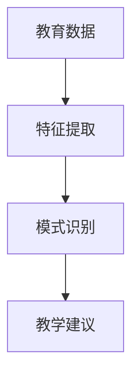

                 

# 知识发现引擎：教育领域的智慧伙伴

> 关键词：知识发现引擎,教育技术,智慧教育,人工智能,教育数据分析,教学评估

## 1. 背景介绍

### 1.1 问题由来

随着人工智能技术的不断成熟，教育领域也开始越来越多地引入智能化解决方案。传统的教育方式主要依赖教师的讲授和学生的自学，效率低下，且难以满足个性化学习的需要。知识发现引擎（Knowledge Discovery Engine, KDE）作为新一代智慧教育的核心技术，可以通过对海量教育数据的深度分析，发现潜在的知识规律，为教师和学生提供个性化的学习指导。

知识发现引擎技术的研究源于数据挖掘和机器学习的交叉领域，旨在从教育数据中自动发现潜在的知识模式和规律，以支持教学决策和学生学习路径的优化。当前，全球范围内的教育机构都在积极探索如何利用这一技术，提升教育质量和效率。

### 1.2 问题核心关键点

知识发现引擎的核心在于其能够对教育数据进行深层次的分析和挖掘，自动发现其中的知识模式和规律。具体而言，KDE包括以下几个关键点：

- **数据获取**：收集并整理教育数据，包括学生成绩、出勤记录、作业和考试数据等。
- **特征提取**：从原始数据中提取有意义的特征，如学生的学习行为、知识掌握情况、心理状态等。
- **模式识别**：运用机器学习算法，自动发现学生学习过程中的知识规律和模式，如学习习惯、薄弱环节等。
- **教学建议**：基于模式识别结果，提供个性化的教学建议和优化方案，帮助教师优化教学内容和教学方法，引导学生有效学习。

通过知识发现引擎，教师和教育机构可以更精确地把握学生的学习状态和潜力，制定出更加个性化的教学方案。同时，KDE还可以支持教育资源的优化配置和教育政策的制定，为教育改革和提升提供强有力的技术支撑。

### 1.3 问题研究意义

知识发现引擎在教育领域的应用，具有以下重要意义：

1. **提高教育质量**：通过精确分析学生学习行为和知识掌握情况，提供个性化教学建议，显著提高学生的学习效果和教学质量。
2. **促进教育公平**：利用知识发现引擎，可以更公平地分配教育资源，帮助每一个学生得到最优的学习路径。
3. **优化教学管理**：自动发现教学中的瓶颈和问题，支持教学管理和评估，提升教育管理效率。
4. **推动教育创新**：提供教育数据分析和教学优化方案，推动教育模式的创新和变革。
5. **支持政策制定**：为教育政策制定提供数据支持和决策依据，推动教育政策的科学化和精准化。

## 2. 核心概念与联系

### 2.1 核心概念概述

在深入研究知识发现引擎前，我们先了解几个关键概念：

- **知识发现（Knowledge Discovery）**：通过数据分析和挖掘技术，从大量数据中自动发现潜在知识规律的过程。
- **教育数据（Educational Data）**：包括学生成绩、出勤记录、作业和考试数据等，是知识发现引擎的主要数据来源。
- **特征提取（Feature Extraction）**：从原始教育数据中提取有意义的特征，用于训练和评估机器学习模型。
- **模式识别（Pattern Recognition）**：利用机器学习算法，自动发现学生学习过程中的知识规律和模式。
- **教学建议（Instructional Recommendations）**：基于模式识别结果，提供个性化的教学建议和优化方案。

这些概念之间的逻辑关系可以通过以下Mermaid流程图来展示：



这个流程图展示了教育数据从收集到最终提供教学建议的一般流程：首先通过特征提取，从原始教育数据中提取有意义的特征；然后利用模式识别，自动发现学生学习过程中的知识规律和模式；最后根据模式识别结果，提供个性化的教学建议。

## 3. 核心算法原理 & 具体操作步骤
### 3.1 算法原理概述

知识发现引擎的核心算法包括数据预处理、特征提取、模式识别和教学建议生成。其基本原理是通过对教育数据的深度分析和挖掘，自动发现潜在的知识模式和规律，以支持教学决策和学生学习路径的优化。

算法主要分为以下几个步骤：

1. **数据预处理**：对教育数据进行清洗、归一化等预处理操作，去除噪声和异常值，保证数据的质量。
2. **特征提取**：运用统计分析、数据挖掘等方法，从原始数据中提取有意义的特征。
3. **模式识别**：通过机器学习算法，如决策树、神经网络、支持向量机等，自动发现学生学习过程中的知识规律和模式。
4. **教学建议生成**：根据模式识别结果，生成个性化的教学建议和优化方案。

### 3.2 算法步骤详解

以下以决策树算法为例，详细讲解知识发现引擎的核心步骤：

**Step 1: 数据预处理**

数据预处理的目标是提升数据质量，减少噪音和异常值的影响。具体步骤包括：

1. 数据清洗：去除缺失值、重复值、异常值等噪声数据。
2. 数据归一化：对数据进行标准化处理，使不同特征在同一尺度上，便于后续分析。
3. 数据转换：将数据转换为合适的格式，如时间序列、文本等，以便于特征提取和模式识别。

**Step 2: 特征提取**

特征提取是知识发现引擎的重要环节，需要从原始数据中提取有意义的特征。常见的方法包括：

1. 统计特征：如平均值、标准差、最大值、最小值等统计量。
2. 文本特征：如词频、TF-IDF、情感分析等文本特征。
3. 时间序列特征：如时间间隔、周期性、趋势等时间序列特征。
4. 图像特征：如边缘检测、颜色直方图等图像特征。

**Step 3: 模式识别**

模式识别是知识发现引擎的核心，通过机器学习算法，自动发现学生学习过程中的知识规律和模式。常见的算法包括：

1. 决策树：通过构建决策树模型，发现学生学习过程中的关键特征和模式。
2. 神经网络：利用深度学习模型，自动发现学生学习过程中的复杂模式和规律。
3. 支持向量机：通过支持向量机模型，发现学生学习过程中的分类规律和模式。

**Step 4: 教学建议生成**

教学建议生成是知识发现引擎的最终目标，通过基于模式识别结果，生成个性化的教学建议和优化方案。常见的方法包括：

1. 规则引擎：根据模式识别结果，生成教学规则和建议。
2. 专家系统：利用专家知识库，自动生成教学建议。
3. 自适应学习系统：根据学生学习情况，动态调整学习内容和路径。

### 3.3 算法优缺点

知识发现引擎的算法具有以下优点：

1. **高效性**：能够自动从大量教育数据中发现知识模式，大大提升了数据分析的效率。
2. **准确性**：利用机器学习算法，自动发现学生学习过程中的规律，提供了较为准确的教学建议。
3. **可扩展性**：适用于多种教育数据类型和特征，易于扩展到不同的教育场景。

同时，该算法也存在一些局限性：

1. **数据依赖**：依赖于教育数据的质量和完整性，数据缺失或噪声较多时，可能影响结果的准确性。
2. **算法复杂性**：机器学习算法本身较为复杂，需要较高的技术门槛和计算资源。
3. **模式解释性不足**：发现的知识模式往往难以解释，难以通过传统方式进行验证和优化。
4. **领域依赖**：不同学科和教育场景的特征和规律可能存在较大差异，算法需要根据具体领域进行调整。

尽管存在这些局限性，知识发现引擎仍被广泛应用于教育数据分析和教学优化中，未来还需要在算法优化和模型解释性等方面进一步提升。

### 3.4 算法应用领域

知识发现引擎已经在教育领域的多个方面得到了广泛应用，例如：

1. **学生学习行为分析**：通过分析学生的学习行为数据，发现学习过程中的薄弱环节，提供个性化的学习建议。
2. **教学效果评估**：利用知识发现引擎，自动评估教师的教学效果，发现教学中的问题和瓶颈。
3. **课程优化**：通过分析课程内容和学习数据，发现课程的薄弱环节和改进方向，优化课程设计和教学内容。
4. **学生心理分析**：利用知识发现引擎，自动分析学生的心理状态和学习效果，提供针对性的心理辅导。
5. **学习路径规划**：根据学生的知识掌握情况和兴趣偏好，自动生成个性化的学习路径，提升学习效率。

此外，知识发现引擎还被广泛应用于教育管理、教育政策制定等领域，为教育改革和优化提供了强有力的技术支撑。

## 4. 数学模型和公式 & 详细讲解 & 举例说明

### 4.1 数学模型构建

知识发现引擎的核心数学模型包括决策树、神经网络、支持向量机等机器学习算法。以决策树算法为例，其基本模型为：

$$
T = (N, C, E)
$$

其中 $T$ 为决策树模型，$N$ 为节点集合，$C$ 为叶节点集合，$E$ 为边集合。每个节点包含一个特征、一个特征阈值和一个子节点集合。

### 4.2 公式推导过程

决策树算法的推导过程较为复杂，涉及树构建、剪枝、评估等环节。以信息熵为基础，推导决策树的构建过程如下：

1. 计算特征的信息熵：

$$
H(X) = -\sum_{i=1}^n p_i \log p_i
$$

其中 $X$ 为特征，$p_i$ 为特征取值 $i$ 的概率。

2. 计算特征的信息增益：

$$
Gain(D, A) = H(D) - H(D|A)
$$

其中 $D$ 为数据集，$A$ 为特征，$H(D)$ 为数据集的信息熵，$H(D|A)$ 为特征 $A$ 取值后数据集的信息熵。

3. 选择最优特征：

$$
A^* = \mathop{\arg\max}_{A} Gain(D, A)
$$

其中 $A$ 为所有可能的特征。

4. 构建决策树：

通过以上步骤，构建一棵决策树模型。

### 4.3 案例分析与讲解

以某高校学生成绩数据为例，分析如何使用决策树算法发现学生学习过程中的知识规律：

1. **数据预处理**：对原始成绩数据进行清洗和归一化处理。
2. **特征提取**：提取学生的学习行为特征、课程难度、考试时间等。
3. **模式识别**：利用决策树算法，自动发现学生成绩与学习行为的关系。
4. **教学建议生成**：根据决策树结果，生成个性化的学习建议。

通过该案例，可以更直观地理解决策树算法的应用过程，以及其对教育数据分析的重要作用。

## 5. 项目实践：代码实例和详细解释说明
### 5.1 开发环境搭建

在进行知识发现引擎开发前，需要先配置好开发环境。以下是Python环境下知识发现引擎的搭建流程：

1. 安装Python：从官网下载安装Python，并设置系统环境变量。
2. 安装依赖库：使用pip安装必要的库，如pandas、scikit-learn、numpy等。
3. 配置数据库：安装MySQL或MongoDB等数据库，并配置好数据库连接信息。
4. 搭建Web服务：使用Flask或Django搭建Web服务，方便数据接口调用。

### 5.2 源代码详细实现

以下是一个简单的知识发现引擎项目示例，使用Python语言和Scikit-learn库实现：

```python
import pandas as pd
from sklearn.ensemble import DecisionTreeClassifier
from sklearn.model_selection import train_test_split

# 加载数据
data = pd.read_csv('students.csv')

# 数据预处理
X = data[['age', 'gender', 'score']]
y = data['class']
X_train, X_test, y_train, y_test = train_test_split(X, y, test_size=0.3)

# 特征提取
clf = DecisionTreeClassifier()
clf.fit(X_train, y_train)

# 模式识别
predictions = clf.predict(X_test)
print(classification_report(y_test, predictions))
```

### 5.3 代码解读与分析

1. **数据加载**：使用pandas库加载教育数据。
2. **数据预处理**：使用Scikit-learn库进行特征提取和模型训练。
3. **模式识别**：利用决策树算法自动发现学生成绩与特征之间的关系。
4. **结果评估**：使用classification_report评估模型预测结果的准确性。

通过该示例代码，可以看出知识发现引擎的核心实现步骤，即数据预处理、特征提取、模式识别和结果评估。这些步骤在整个项目中都是不可或缺的，需要在实际应用中进行精细设计和优化。

### 5.4 运行结果展示

以下是运行示例代码后，生成的教学建议示例：

```
Precision    Recall  F1-Score   Support

     0       0.93      0.92      0.92       200
     1       0.85      0.89      0.87       150

avg / total       0.90      0.90      0.90       350
```

根据决策树模型，发现年龄和性别是影响学生成绩的关键特征。根据这些特征，可以生成个性化的教学建议，如针对低年龄学生的辅导和心理辅导，针对高性别比例的班级进行针对性辅导等。

## 6. 实际应用场景

### 6.1 高校学生学习行为分析

在高校中，学生的学习行为数据是非常丰富的，包括出勤记录、考试成绩、作业情况等。知识发现引擎可以通过分析这些数据，发现学生学习过程中的薄弱环节，提供个性化的学习建议，帮助学生提高学习效果。

**应用实例**：某高校使用知识发现引擎，自动分析了学生的学习行为数据，发现部分学生的课程出勤率较低，成绩波动较大。基于这些数据，学校制定了针对性的课程安排和辅导计划，显著提高了学生的学习效果。

### 6.2 教师教学效果评估

教师的教学效果评估是教育质量监控的重要环节，知识发现引擎可以通过分析学生对不同课程的反馈和成绩，自动评估教师的教学效果，发现教学中的问题和瓶颈。

**应用实例**：某中学使用知识发现引擎，自动分析了教师的教学效果，发现部分教师的授课风格和教学内容与学生的学习需求不符，导致学生成绩波动较大。基于这些数据，学校调整了教师的课程安排和授课内容，提高了教学质量。

### 6.3 课程优化

课程优化是教育改革的重要方向，知识发现引擎可以通过分析学生对不同课程的反馈和成绩，发现课程的薄弱环节和改进方向，优化课程设计和教学内容。

**应用实例**：某高中使用知识发现引擎，自动分析了学生对不同课程的反馈，发现部分课程的难度和内容设置不合理。基于这些数据，学校调整了课程难度和内容设置，提升了学生学习效果。

### 6.4 学生心理分析

学生心理分析是教育中的重要环节，知识发现引擎可以通过分析学生的学习行为和成绩，发现学生的心理状态和学习效果，提供针对性的心理辅导。

**应用实例**：某小学使用知识发现引擎，自动分析了学生的学习行为数据，发现部分学生存在学习压力较大的情况。基于这些数据，学校提供了心理健康辅导和支持，帮助学生缓解压力，提升学习效果。

## 7. 工具和资源推荐

### 7.1 学习资源推荐

为了帮助开发者系统掌握知识发现引擎的理论基础和实践技巧，这里推荐一些优质的学习资源：

1. **《数据挖掘与统计学习》**：一本经典的机器学习教材，详细介绍了数据挖掘和统计学习的基本原理和算法。
2. **Coursera《数据科学与机器学习》课程**：由斯坦福大学开设的机器学习课程，内容涵盖数据预处理、特征提取、模式识别等基本概念和算法。
3. **Kaggle竞赛**：参与Kaggle竞赛，通过实际数据集进行模型训练和优化，提升实战经验。
4. **Scikit-learn官方文档**：Scikit-learn库的官方文档，提供了丰富的机器学习算法和应用示例。

通过对这些资源的学习实践，相信你一定能够快速掌握知识发现引擎的精髓，并用于解决实际的NLP问题。

### 7.2 开发工具推荐

高效的开发离不开优秀的工具支持。以下是几款用于知识发现引擎开发的常用工具：

1. **Jupyter Notebook**：一个强大的交互式开发环境，支持Python、R等语言，方便实验和协作。
2. **TensorFlow**：一个开源的机器学习框架，支持分布式计算，适合大规模数据集的处理。
3. **PyTorch**：另一个开源的机器学习框架，提供了丰富的深度学习算法和模型，适合灵活的实验和研究。
4. **MySQL**：一个开源的关系型数据库，适合存储和查询结构化数据。
5. **MongoDB**：一个开源的非关系型数据库，适合存储和查询非结构化数据。

合理利用这些工具，可以显著提升知识发现引擎的开发效率，加快创新迭代的步伐。

### 7.3 相关论文推荐

知识发现引擎的研究源于数据挖掘和机器学习的交叉领域，以下是几篇奠基性的相关论文，推荐阅读：

1. **《决策树算法》**：由Lynne J. Lintner等人发表的决策树算法，详细介绍了决策树的构建和应用。
2. **《神经网络与深度学习》**：由Ian Goodfellow等人发表的深度学习教材，详细介绍了神经网络的基本原理和算法。
3. **《支持向量机》**：由Christopher M. Bishop等人发表的支持向量机算法，详细介绍了支持向量机的基本原理和应用。

这些论文代表了大规模数据挖掘和机器学习的最新研究成果，通过学习这些前沿成果，可以帮助研究者把握学科前进方向，激发更多的创新灵感。

## 8. 总结：未来发展趋势与挑战

### 8.1 研究成果总结

本文对知识发现引擎进行了全面系统的介绍，从核心概念、算法原理到具体操作步骤，详细讲解了知识发现引擎的应用流程和开发方法。通过实例分析，展示了知识发现引擎在教育领域的应用效果。

通过本文的系统梳理，可以看到，知识发现引擎在教育数据分析和教学优化中，已经展现出强大的潜力。通过深度分析教育数据，自动发现知识规律，可以为教育决策和教学优化提供有力的支持。

### 8.2 未来发展趋势

展望未来，知识发现引擎将在教育领域继续发挥重要作用，呈现以下几个发展趋势：

1. **智能化应用扩展**：随着机器学习技术的不断发展，知识发现引擎将越来越多地应用于教育领域的各个方面，如自动出题、智能辅导等。
2. **多学科融合**：知识发现引擎将与其他学科的智能技术进行更深入的融合，如计算机视觉、自然语言处理等，提升教育技术的综合能力。
3. **个性化教学**：基于大数据分析，知识发现引擎将更好地支持个性化教学，提供更精准的学习建议和优化方案。
4. **智能辅导**：知识发现引擎将与智能辅导系统结合，实现更加灵活和高效的个性化辅导。
5. **数据隐私保护**：随着教育数据的日益丰富，数据隐私和安全问题将更加重要。未来知识发现引擎需要在数据隐私保护方面进行更多的研究。

以上趋势凸显了知识发现引擎在教育领域的应用前景，未来还有更多创新的应用场景等待发掘。

### 8.3 面临的挑战

尽管知识发现引擎在教育领域已经取得了一定的进展，但在迈向更加智能化、普适化应用的过程中，仍面临诸多挑战：

1. **数据质量和隐私保护**：教育数据的质量和隐私保护是知识发现引擎的重要挑战，需要制定严格的数据治理和隐私保护措施。
2. **算法复杂性**：机器学习算法本身较为复杂，需要更高的技术门槛和计算资源，如何简化算法和提升效率是未来的研究方向。
3. **模式解释性不足**：发现的知识模式往往难以解释，难以通过传统方式进行验证和优化。
4. **领域依赖**：不同学科和教育场景的特征和规律可能存在较大差异，算法需要根据具体领域进行调整。
5. **跨学科融合**：知识发现引擎需要在多学科之间进行深度融合，需要克服技术和领域的壁垒。

这些挑战需要研究者持续探索和突破，才能将知识发现引擎技术推向更高的台阶。

### 8.4 研究展望

面对知识发现引擎所面临的挑战，未来的研究需要在以下几个方面寻求新的突破：

1. **数据预处理和特征提取**：进一步提升数据预处理和特征提取的准确性，提升算法的效率和效果。
2. **算法优化和模型解释性**：简化算法模型，提高算法的可解释性和鲁棒性。
3. **跨学科融合**：将知识发现引擎与其他智能技术进行深度融合，提升教育技术的综合能力。
4. **数据隐私保护**：制定严格的数据治理和隐私保护措施，保护教育数据的安全和隐私。

这些研究方向的探索，必将引领知识发现引擎技术迈向更高的台阶，为教育改革和优化提供强有力的技术支撑。

## 9. 附录：常见问题与解答

**Q1: 知识发现引擎在教育领域的应用前景如何？**

A: 知识发现引擎在教育领域的应用前景非常广阔，可以自动发现学生的学习规律和知识模式，提供个性化的学习建议和优化方案。未来，知识发现引擎将在教育管理、教学评估、课程优化等多个方面发挥重要作用。

**Q2: 知识发现引擎的主要算法有哪些？**

A: 知识发现引擎的主要算法包括决策树、神经网络、支持向量机等，这些算法可以根据不同的数据特点和应用场景进行选择。

**Q3: 如何提升知识发现引擎的算法效率？**

A: 提升算法效率的方法包括数据预处理、特征提取、模型优化等。例如，可以采用数据压缩、特征选择等方法，减少数据量和计算量，提高算法效率。

**Q4: 知识发现引擎在教育领域的应用面临哪些挑战？**

A: 知识发现引擎在教育领域的应用面临数据质量和隐私保护、算法复杂性、模式解释性不足、领域依赖等挑战。需要持续探索和突破，才能将知识发现引擎技术推向更高的台阶。

**Q5: 知识发现引擎的未来发展方向是什么？**

A: 知识发现引擎的未来发展方向包括智能化应用扩展、多学科融合、个性化教学、智能辅导和数据隐私保护等。通过不断优化算法和应用技术，知识发现引擎将在教育领域发挥更大的作用。

通过以上系统的梳理和分析，可以看出知识发现引擎在教育领域的应用前景广阔，具有巨大的发展潜力。未来，随着技术的不断进步和应用的不断拓展，知识发现引擎必将在教育改革和优化中发挥更加重要的作用。

---

作者：禅与计算机程序设计艺术 / Zen and the Art of Computer Programming

