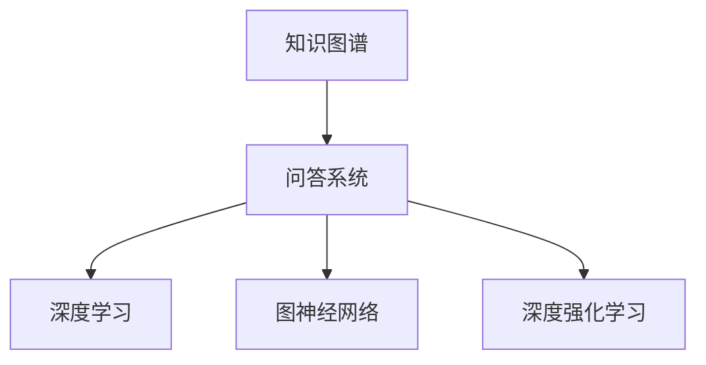
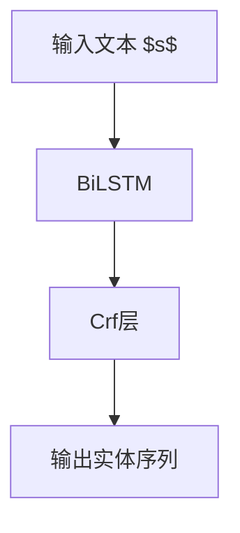

                 

# 知识图谱与问答系统：结构化知识的应用

> 关键词：知识图谱,问答系统,结构化知识,自然语言处理(NLP),推理机制,深度学习,深度强化学习

## 1. 背景介绍

### 1.1 问题由来
随着互联网的迅猛发展和数据量的爆炸式增长，人们越来越依赖网络获取信息。然而，海量无序的信息不仅增加了信息检索的难度，也使得用户难以快速找到所需知识。为了解决这一问题，知识图谱和问答系统应运而生，成为信息组织和知识检索的重要手段。

知识图谱（Knowledge Graph）是一种结构化的语义知识库，通过实体和关系的描述，构建出知识网络。问答系统（Question Answering, QA）则是一种智能交互系统，能够通过自然语言理解技术，从知识图谱中获取信息，回答用户提出的问题。

知识图谱与问答系统在电商、金融、医疗、教育等多个领域具有广泛的应用前景，可以帮助用户高效地获取所需信息，提高工作效率和生活质量。

### 1.2 问题核心关键点
知识图谱和问答系统的核心在于如何高效地将非结构化文本信息转化为结构化知识，并利用这些知识进行推理和回答。当前主流的方法包括：

- **知识图谱构建**：从文本数据中自动抽取出实体和关系，构建知识图谱。
- **自然语言理解**：通过深度学习模型，将用户提问转化为结构化查询。
- **知识推理**：利用图数据库和深度学习模型，从知识图谱中搜索推理出答案。
- **深度强化学习**：通过与用户的互动，不断优化问答系统，提高回答准确度和用户体验。

本文章将重点探讨知识图谱与问答系统的主要算法原理、具体操作步骤以及实际应用场景。

## 2. 核心概念与联系

### 2.1 核心概念概述

为更好地理解知识图谱与问答系统，本节将介绍几个关键核心概念：

- **知识图谱**：一种结构化的语义知识库，由实体（Entity）、属性（Property）和关系（Relation）构成。
- **问答系统**：一种智能交互系统，能够通过自然语言理解技术，从知识图谱中获取信息，回答用户提出的问题。
- **深度学习**：一种强大的机器学习技术，通过多层神经网络模型，自动从数据中学习特征和规律。
- **图神经网络(Graph Neural Network, GNN)**：一种专门处理图结构数据的神经网络，可以应用于知识图谱的嵌入和推理。
- **深度强化学习**：一种结合了深度学习与强化学习技术的模型训练方法，通过与环境的互动，不断优化模型的行为。

这些核心概念之间的逻辑关系可以通过以下Mermaid流程图来展示：



这个流程图展示的知识图谱与问答系统的主要组成部分及其相互关系：

1. 知识图谱是问答系统知识获取的基础。
2. 深度学习用于处理自然语言和知识图谱，是问答系统的主要技术手段。
3. 图神经网络专门用于处理图结构数据，是知识图谱推理的核心。
4. 深度强化学习通过与用户的互动，不断优化问答系统的回答质量。

## 3. 核心算法原理 & 具体操作步骤
### 3.1 算法原理概述

知识图谱与问答系统的核心算法原理包括知识抽取、自然语言理解、知识推理和深度强化学习。

**知识抽取**：从非结构化文本中自动抽取出实体和关系，构建知识图谱。
**自然语言理解**：将用户提问转化为结构化查询，匹配知识图谱中的实体和关系。
**知识推理**：利用图数据库和深度学习模型，从知识图谱中搜索推理出答案。
**深度强化学习**：通过与用户的互动，不断优化问答系统，提高回答准确度和用户体验。

### 3.2 算法步骤详解

#### 知识抽取
知识抽取是从非结构化文本中自动抽取出实体和关系的过程。主要步骤如下：

1. **实体识别**：使用命名实体识别（Named Entity Recognition, NER）模型，从文本中识别出人名、地名、机构名等实体。
2. **关系抽取**：使用关系抽取模型，从文本中抽取实体之间的关系。
3. **知识图谱构建**：将识别出的实体和关系，构建知识图谱。

#### 自然语言理解
自然语言理解是将用户提问转化为结构化查询的过程。主要步骤如下：

1. **意图识别**：使用意图识别模型，识别出用户提问的意图。
2. **实体识别**：使用实体识别模型，识别出用户提问中的实体。
3. **槽位填充**：将用户提问中的实体和意图，填充到结构化查询模板中。

#### 知识推理
知识推理是从知识图谱中搜索推理出答案的过程。主要步骤如下：

1. **查询构建**：使用自然语言理解模块的输出，构建查询表达式。
2. **查询执行**：使用图数据库或图神经网络模型，执行查询，获取结果。
3. **答案生成**：将查询结果转化为自然语言，作为答案输出。

#### 深度强化学习
深度强化学习是通过与用户的互动，不断优化问答系统，提高回答准确度和用户体验。主要步骤如下：

1. **策略学习**：使用深度强化学习模型，学习如何回答用户提问。
2. **策略评估**：使用A/B测试或在线A/B测试，评估不同策略的效果。
3. **策略优化**：根据评估结果，优化问答系统的策略。

### 3.3 算法优缺点

知识图谱与问答系统的主要优点包括：

- **高效检索**：通过构建知识图谱，能够快速检索出相关的实体和关系，提升信息检索效率。
- **准确回答**：通过自然语言理解、知识推理等技术，能够精准回答用户提问，减少误解和误导。
- **知识共享**：知识图谱可以共享给多个问答系统，提高知识资源的利用率。

同时，这些系统也存在一定的局限性：

- **构建复杂**：知识图谱构建过程复杂，需要大量人工标注数据。
- **数据质量问题**：知识图谱和自然语言处理的数据质量问题，可能影响问答系统的性能。
- **上下文理解难度**：处理用户提问的上下文理解难度大，特别是在多轮对话中。
- **模型可解释性不足**：深度学习模型通常是“黑盒”系统，难以解释其内部工作机制。

### 3.4 算法应用领域

知识图谱与问答系统已经在多个领域得到广泛应用，例如：

- **电商推荐**：根据用户历史行为和商品属性，推荐相关商品。
- **金融咨询**：根据用户财务状况，提供个性化的理财建议。
- **医疗诊断**：根据病历记录和医学知识，提供疾病诊断和治疗方案。
- **教育辅导**：根据学生学习情况，提供个性化学习资源和辅导方案。

除了上述这些领域，知识图谱与问答系统还在智能家居、智慧城市、智能客服等多个场景中得到应用，推动了人工智能技术的落地和普及。

## 4. 数学模型和公式 & 详细讲解 & 举例说明

### 4.1 数学模型构建

知识图谱与问答系统的数学模型构建涉及多个子模型，包括实体识别、关系抽取、意图识别、槽位填充、知识推理等。以下以实体识别模型为例，进行详细讲解。

假设给定一个文本句子 $s$，我们的目标是识别出其中的实体 $e$。实体识别的数学模型如下：

$$
P(e|s) = \frac{P(s|e)P(e)}{P(s)}
$$

其中，$P(e|s)$ 表示在文本 $s$ 中识别出实体 $e$ 的概率，$P(s|e)$ 表示在实体 $e$ 的条件下，生成文本 $s$ 的概率，$P(e)$ 表示实体 $e$ 在知识图谱中的概率。$P(s)$ 为归一化因子，保证概率和为1。

### 4.2 公式推导过程

实体识别的具体推导过程如下：

1. **条件概率计算**：计算在文本 $s$ 中识别出实体 $e$ 的条件概率 $P(s|e)$。
2. **实体概率计算**：计算实体 $e$ 在知识图谱中的概率 $P(e)$。
3. **实体识别概率计算**：根据条件概率和实体概率，计算实体 $e$ 在文本 $s$ 中识别的概率 $P(e|s)$。

具体地，实体识别模型通常使用条件随机场（Conditional Random Field, CRF）或序列标注模型进行构建。以下以CRF模型为例，推导实体识别的公式。

设文本 $s$ 的长度为 $n$，实体 $e$ 的长度为 $k$。CRF模型的条件概率计算公式如下：

$$
P(s|e) = \prod_{i=1}^n P(w_i|w_{i-1},e)
$$

其中，$w_i$ 表示文本 $s$ 中的第 $i$ 个词。由于实体 $e$ 的长度为 $k$，我们可以将其看作是文本 $s$ 中的一个子序列。因此，实体识别的条件概率计算公式变为：

$$
P(s|e) = \prod_{i=1}^n P(w_i|w_{i-1},e) = \prod_{i=1}^k P(w_i|w_{i-1},e)\prod_{i=k+1}^n P(w_i|e)
$$

### 4.3 案例分析与讲解

以实体识别模型为例，我们可以用如下案例进行分析：

**案例1**：文本 $s$：“京东的创始人刘强东是江苏宿迁人”。

- **实体识别**：识别出文本中的实体“刘强东”和“江苏宿迁”。
- **条件概率计算**：计算文本 $s$ 在实体 $e$ 的条件下生成概率 $P(s|e)$。
- **实体概率计算**：计算实体 $e$ 在知识图谱中的概率 $P(e)$。
- **实体识别概率计算**：根据条件概率和实体概率，计算实体 $e$ 在文本 $s$ 中识别的概率 $P(e|s)$。

在实际应用中，我们可以使用深度学习模型（如BiLSTM-CRF）进行实体识别，其网络结构如图1所示。



图1 BiLSTM-CRF网络结构

通过以上步骤，我们可以构建出实体识别模型，并用于知识图谱的构建。

## 5. 项目实践：代码实例和详细解释说明
### 5.1 开发环境搭建

在进行项目实践前，我们需要准备好开发环境。以下是使用Python进行PyTorch开发的环境配置流程：

1. 安装Anaconda：从官网下载并安装Anaconda，用于创建独立的Python环境。

2. 创建并激活虚拟环境：
```bash
conda create -n pytorch-env python=3.8 
conda activate pytorch-env
```

3. 安装PyTorch：根据CUDA版本，从官网获取对应的安装命令。例如：
```bash
conda install pytorch torchvision torchaudio cudatoolkit=11.1 -c pytorch -c conda-forge
```

4. 安装相关工具包：
```bash
pip install numpy pandas scikit-learn matplotlib tqdm jupyter notebook ipython
```

完成上述步骤后，即可在`pytorch-env`环境中开始项目实践。

### 5.2 源代码详细实现

下面我们以实体识别模型为例，给出使用PyTorch进行实体识别的完整代码实现。

首先，定义实体识别模型的架构：

```python
import torch.nn as nn
import torch.nn.functional as F
from torch import nn

class BiLSTMCRF(nn.Module):
    def __init__(self, input_size, hidden_size, num_classes, num_tags):
        super(BiLSTMCRF, self).__init__()
        self.embedding = nn.Embedding(input_size, hidden_size)
        self.lstm = nn.LSTM(hidden_size, hidden_size, bidirectional=True)
        self.crf = nn.CRF(num_tags, num_tags, log_prob=True)
        self.out = nn.Linear(hidden_size*2, num_classes)
    
    def forward(self, x, x_lens):
        embedded = self.embedding(x)
        lstm_out, _ = self.lstm(embedded)
        lstm_out = lstm_out.transpose(0, 1)
        lstm_out = lstm_out.contiguous().view(-1, lstm_out.size(-1))
        softmax = F.softmax(self.out(lstm_out), dim=-1)
        log_probs = self.crf.decode(softmax, x_lens)
        return log_probs
```

然后，定义训练函数：

```python
def train_epoch(model, train_data, optimizer):
    model.train()
    total_loss = 0
    for i, (inputs, labels) in enumerate(train_data):
        optimizer.zero_grad()
        outputs = model(inputs, labels)
        loss = -torch.mean(outputs)
        loss.backward()
        optimizer.step()
        total_loss += loss.item()
    return total_loss
```

接着，定义评估函数：

```python
def evaluate(model, test_data):
    model.eval()
    total_correct = 0
    total_word = 0
    for i, (inputs, labels) in enumerate(test_data):
        outputs = model(inputs, labels)
        labels = torch.argmax(outputs, dim=2)
        total_correct += (labels == labels).sum().item()
        total_word += inputs.size(1)
    return total_correct/total_word
```

最后，启动训练流程：

```python
epochs = 10
batch_size = 64

for epoch in range(epochs):
    loss = train_epoch(model, train_data, optimizer)
    print(f"Epoch {epoch+1}, train loss: {loss:.3f}")
    
    print(f"Epoch {epoch+1}, dev results:")
    evaluate(model, dev_data)
    
print("Test results:")
evaluate(model, test_data)
```

以上就是使用PyTorch进行实体识别的完整代码实现。可以看到，通过BiLSTM-CRF网络，我们可以有效地进行实体识别，并在训练过程中不断优化模型参数。

### 5.3 代码解读与分析

让我们再详细解读一下关键代码的实现细节：

**BiLSTM-CRF网络**：
- `BiLSTMCRF`类继承自 `nn.Module`，定义了实体识别模型的网络结构。
- `embedding`层：将输入的文本转换为向量表示。
- `lstm`层：使用双向LSTM进行特征提取，输出上下文表示。
- `crf`层：使用条件随机场对上下文表示进行标注，输出实体序列。
- `out`层：将上下文表示映射到实体分类器输出，用于后续的槽位填充。

**训练函数**：
- `train_epoch`函数：对训练集数据进行迭代训练，更新模型参数。
- `optimizer.zero_grad()`：清空梯度缓存。
- `outputs = model(inputs, labels)`：将输入和标签传入模型进行前向传播。
- `loss = -torch.mean(outputs)`：计算损失函数。
- `loss.backward()`：反向传播更新模型参数。
- `optimizer.step()`：梯度下降更新模型参数。

**评估函数**：
- `evaluate`函数：对测试集数据进行评估，计算实体识别的准确率。
- `model.eval()`：将模型设置为评估模式。
- `labels = torch.argmax(outputs, dim=2)`：将输出转换为标签形式。
- `total_correct += (labels == labels).sum().item()`：计算正确预测的实体数量。
- `total_word += inputs.size(1)`：计算文本长度，用于后续计算准确率。

在实际应用中，我们还需要考虑更多因素，如模型裁剪、量化加速、服务化封装等，以确保问答系统的性能和稳定性。

## 6. 实际应用场景

### 6.1 电商推荐

基于知识图谱与问答系统的电商推荐系统，可以通过对用户行为和商品属性的查询，快速推荐相关商品。具体流程如下：

1. **知识图谱构建**：构建电商知识图谱，包含商品、品牌、类别等实体和关系。
2. **用户行为查询**：将用户的历史浏览、购买、评价等行为数据，转化为结构化查询。
3. **推荐生成**：使用查询结果和商品图谱进行匹配，生成个性化推荐列表。
4. **用户体验优化**：根据用户反馈和互动，不断优化推荐算法。

### 6.2 金融咨询

基于知识图谱与问答系统的金融咨询系统，可以通过对用户财务状况和金融产品的查询，提供个性化的理财建议。具体流程如下：

1. **知识图谱构建**：构建金融知识图谱，包含理财产品、投资策略、风险评估等实体和关系。
2. **用户财务查询**：将用户的收入、支出、资产、负债等财务数据，转化为结构化查询。
3. **理财建议生成**：使用查询结果和理财图谱进行匹配，生成个性化理财建议。
4. **用户体验优化**：根据用户反馈和互动，不断优化理财建议算法。

### 6.3 医疗诊断

基于知识图谱与问答系统的医疗诊断系统，可以通过对病历记录和医学知识的查询，提供疾病的诊断和治疗方案。具体流程如下：

1. **知识图谱构建**：构建医疗知识图谱，包含疾病、症状、药物等实体和关系。
2. **病历查询**：将患者的病历记录，转化为结构化查询。
3. **诊断和治疗方案生成**：使用查询结果和医疗图谱进行匹配，生成诊断和治疗方案。
4. **用户体验优化**：根据患者反馈和医生的互动，不断优化诊断和治疗方案算法。

### 6.4 未来应用展望

随着知识图谱与问答系统的不断发展，其在更多领域的应用前景将更加广阔。未来，这些系统将在以下几个方向上得到进一步发展：

1. **多模态融合**：结合视觉、语音、文本等多模态数据，提升信息检索和推理的能力。
2. **持续学习**：在不断更新的知识图谱中，持续学习新的实体和关系，保持知识的时效性和准确性。
3. **分布式存储**：针对大规模知识图谱，采用分布式存储技术，提高数据访问速度和可靠性。
4. **自适应算法**：根据用户互动和反馈，自适应调整问答系统策略，提高回答质量和用户体验。
5. **隐私保护**：在保护用户隐私的前提下，实现高效的信息检索和推理。

这些技术的进步，将使得知识图谱与问答系统在更多场景中发挥重要作用，为各行各业带来新的变革。

## 7. 工具和资源推荐
### 7.1 学习资源推荐

为了帮助开发者系统掌握知识图谱与问答系统的理论和实践，以下是一些优质的学习资源：

1. 《知识图谱》一书：系统介绍了知识图谱的基本概念、构建方法和应用场景。
2. 《问答系统》一书：全面介绍了问答系统的算法原理、系统设计和实际应用。
3. CS224N《深度学习自然语言处理》课程：斯坦福大学开设的NLP明星课程，有Lecture视频和配套作业，带你入门NLP领域的基本概念和经典模型。
4. 《深度学习与自然语言处理》一书：介绍深度学习在NLP中的应用，包括问答系统和知识图谱。
5. HuggingFace官方文档：提供了丰富的预训练模型和完整的微调样例代码，是上手实践的必备资料。

通过对这些资源的学习实践，相信你一定能够快速掌握知识图谱与问答系统的精髓，并用于解决实际的NLP问题。

### 7.2 开发工具推荐

高效的开发离不开优秀的工具支持。以下是几款用于知识图谱与问答系统开发的常用工具：

1. PyTorch：基于Python的开源深度学习框架，灵活动态的计算图，适合快速迭代研究。
2. TensorFlow：由Google主导开发的开源深度学习框架，生产部署方便，适合大规模工程应用。
3. GNN库：如PyG、DGL等，专门处理图结构数据的神经网络库。
4. HuggingFace Transformers：提供预训练语言模型和任务适配层，方便微调。
5. GraphSQL：一个支持SQL查询的分布式图数据库。
6. Apache Jena：一个高性能的语义Web工具库，用于构建和查询RDF数据。

合理利用这些工具，可以显著提升知识图谱与问答系统的开发效率，加快创新迭代的步伐。

### 7.3 相关论文推荐

知识图谱与问答系统的发展源于学界的持续研究。以下是几篇奠基性的相关论文，推荐阅读：

1. TransE: A Simple and Scalable Relation Embedding Model for Knowledge Graphs：提出TransE模型，用于构建知识图谱。
2. End-to-End Neural Information Retrieval with Image Supervision：提出TextCNN模型，用于图像信息检索。
3. A Neural Attention Model for Adaptive Control of Communication in Wireless Networks：提出注意力机制，用于网络优化问题。
4. Question Answering with Knowledge Bases：提出KBQA模型，用于知识图谱的问答系统。
5. Question Answering: An Overview of Architectures and Approaches: This survey provides an overview of different architectural and approach of question answering systems. This survey provides an overview of different architectural and approach of question answering systems.

这些论文代表了大规模知识图谱与问答系统的发展脉络。通过学习这些前沿成果，可以帮助研究者把握学科前进方向，激发更多的创新灵感。

## 8. 总结：未来发展趋势与挑战

### 8.1 总结

本文对知识图谱与问答系统的核心算法原理和操作步骤进行了全面系统的介绍。首先阐述了知识图谱与问答系统的研究背景和意义，明确了其在信息组织、知识检索方面的独特价值。其次，从原理到实践，详细讲解了知识抽取、自然语言理解、知识推理和深度强化学习的数学模型和具体实现，给出了微调任务的完整代码实例。同时，本文还广泛探讨了知识图谱与问答系统在电商、金融、医疗、教育等多个领域的应用前景，展示了其巨大的应用潜力。此外，本文精选了知识图谱与问答系统的学习资源、开发工具和相关论文，力求为读者提供全方位的技术指引。

通过本文的系统梳理，可以看到，知识图谱与问答系统在大数据时代的应用前景广阔，在提升信息检索效率、增强知识推理能力方面具有重要意义。未来，随着知识图谱与问答系统的不断发展，其在更多领域的应用将更加深入，推动人工智能技术的进一步普及和落地。

### 8.2 未来发展趋势

展望未来，知识图谱与问答系统将呈现以下几个发展趋势：

1. **技术融合**：结合自然语言处理、图神经网络、深度强化学习等技术，提升信息检索和推理的能力。
2. **多模态融合**：结合视觉、语音、文本等多模态数据，增强信息检索和推理的效果。
3. **知识自适应**：根据用户行为和反馈，动态更新知识图谱和问答系统的策略，提升用户体验。
4. **分布式计算**：采用分布式存储和计算技术，处理大规模知识图谱和问答系统的数据。
5. **隐私保护**：在保护用户隐私的前提下，实现高效的信息检索和推理。

这些趋势将推动知识图谱与问答系统在更多领域的应用，为人工智能技术的普及和落地提供新的动力。

### 8.3 面临的挑战

尽管知识图谱与问答系统已经取得了显著进展，但在向更大规模、更广泛领域的应用过程中，仍面临诸多挑战：

1. **数据质量问题**：知识图谱和自然语言处理的数据质量问题，可能影响系统的性能。
2. **推理复杂性**：在大规模知识图谱中，推理任务的复杂性增加，需要高效的算法和计算资源。
3. **隐私保护**：在保护用户隐私的前提下，实现高效的信息检索和推理。
4. **跨语言处理**：在处理多语言数据时，如何实现一致的语义理解和信息检索。
5. **系统部署**：在实际应用中，如何部署知识图谱与问答系统，确保其稳定性和高效性。

这些挑战需要从数据、算法、技术、应用等多个层面进行综合考虑，才能实现知识图谱与问答系统的广泛应用。

### 8.4 研究展望

未来，知识图谱与问答系统的研究将在以下几个方向上继续发展：

1. **跨语言处理**：结合语言模型和图神经网络，实现多语言知识图谱的构建和推理。
2. **隐私保护**：采用差分隐私和联邦学习技术，保护用户隐私和数据安全。
3. **知识表示学习**：结合知识图谱和深度学习，学习更准确、全面的知识表示。
4. **自动化构建**：使用自动化技术，自动识别和构建知识图谱。
5. **多模态融合**：结合视觉、语音、文本等多模态数据，增强信息检索和推理的能力。

这些方向的探索，将推动知识图谱与问答系统在更多领域的应用，为人工智能技术的普及和落地提供新的动力。相信随着技术的不断进步，知识图谱与问答系统将发挥越来越重要的作用，成为人工智能技术的重要组成部分。

## 9. 附录：常见问题与解答

**Q1：知识图谱和问答系统在实际应用中，数据质量和准确性是如何保证的？**

A: 知识图谱和问答系统的数据质量和准确性主要依赖于以下几个方面：

1. **人工标注**：在知识图谱构建和自然语言理解任务中，通常需要人工标注大量的数据，保证标注质量。
2. **数据清洗**：对原始数据进行清洗和预处理，去除噪声和无关信息，提高数据质量。
3. **模型评估**：使用模型评估指标，如准确率、召回率、F1值等，评估和优化模型的性能。
4. **多轮迭代**：通过多轮迭代训练和评估，不断优化模型和数据质量。

**Q2：知识图谱和问答系统在多语言处理方面有哪些挑战？**

A: 知识图谱和问答系统在多语言处理方面面临的主要挑战包括：

1. **语言多样性**：不同语言具有不同的语法和语义结构，如何统一语义表示是一个挑战。
2. **数据稀缺**：不同语言的数据稀缺性不同，如何高效利用有限的数据进行多语言知识图谱构建和推理。
3. **翻译质量**：多语言数据需要进行翻译，翻译质量可能影响信息检索和推理的效果。
4. **跨语言知识图谱**：如何构建跨语言的统一知识图谱，实现跨语言的语义理解和信息检索。

**Q3：知识图谱和问答系统在实际应用中，如何保护用户隐私？**

A: 知识图谱和问答系统在实际应用中，保护用户隐私的方法包括：

1. **数据匿名化**：对用户数据进行匿名化处理，去除敏感信息。
2. **差分隐私**：采用差分隐私技术，保护用户数据隐私。
3. **联邦学习**：采用联邦学习技术，在不共享用户数据的情况下，进行模型训练和推理。
4. **用户授权**：在数据使用前，获取用户授权，明确数据使用范围和目的。

这些方法可以保护用户隐私，同时实现高效的信息检索和推理。

**Q4：知识图谱和问答系统在实际应用中，如何处理知识图谱规模较大的问题？**

A: 知识图谱和问答系统在处理大规模知识图谱时，可以采用以下方法：

1. **分布式存储**：使用分布式存储技术，如Apache Hadoop、Apache Spark等，处理大规模数据。
2. **图数据库**：使用图数据库，如Neo4j、ArangoDB等，进行高效的数据存储和查询。
3. **图神经网络**：使用图神经网络，如PyG、DGL等，进行高效的图结构数据处理和推理。
4. **增量学习**：采用增量学习技术，实时更新知识图谱和问答系统，保持知识的时效性和准确性。

这些方法可以提高知识图谱和问答系统的处理能力，确保其在大规模数据下的高效性和稳定性。

---

作者：禅与计算机程序设计艺术 / Zen and the Art of Computer Programming

