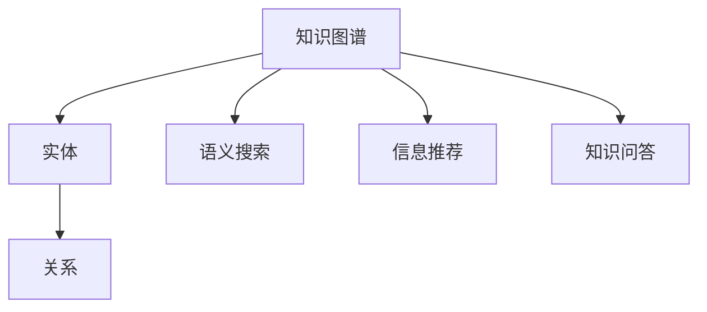

                 

# 知识图谱在搜索引擎中的应用

> 关键词：知识图谱, 搜索引擎, 信息检索, 自然语言处理, 语义搜索, 推荐系统, 数据融合, 问答系统

## 1. 背景介绍

### 1.1 问题由来

随着互联网的迅猛发展，搜索引擎已成为人们获取信息的重要工具。传统的基于关键词匹配的搜索引擎在处理海量的网页时，往往难以准确理解用户查询的真正意图。而知识图谱（Knowledge Graphs）作为一种新的信息组织和检索方式，通过将信息元素之间建立语义关系，使得搜索引擎能够更好地理解用户查询的语义含义，提供更精确、相关性更高的搜索结果。

知识图谱是近年来人工智能领域的一个重要研究方向，旨在构建大规模的知识网络，描述现实世界中的各种实体及其之间的关系。它能够为搜索引擎提供丰富的语义信息，帮助其更好地匹配用户查询，提升信息检索的准确性和相关性。

### 1.2 问题核心关键点

知识图谱在搜索引擎中的应用核心关键点包括：
- 如何高效构建知识图谱，涵盖尽可能丰富的知识元素和关系。
- 如何将知识图谱与搜索引擎的查询逻辑深度融合，实现更精确的语义搜索。
- 如何通过知识图谱进行信息推荐、知识问答等高级功能，提升用户体验。
- 如何处理知识图谱中存在的噪声和不一致性，保证信息的准确性。
- 如何在大规模知识图谱中高效检索，减少延迟和资源消耗。

这些关键点构成了知识图谱在搜索引擎应用中的核心技术挑战和研究方向。

## 2. 核心概念与联系

### 2.1 核心概念概述

为更好地理解知识图谱在搜索引擎中的应用，本节将介绍几个密切相关的核心概念：

- 知识图谱（Knowledge Graphs）：描述实体及其相互关系的语义图，通常包含节点（实体）和边（关系）。
- 实体（Entity）：知识图谱中的基本元素，表示现实世界中的事物或概念，如人、地点、组织等。
- 关系（Relation）：描述实体之间的语义关系，如"是"、"属于"、"位于"等。
- 语义搜索（Semantic Search）：通过理解查询中的语义含义，匹配知识图谱中的实体和关系，提升搜索结果的相关性和准确性。
- 信息推荐（Information Retrieval）：根据用户的查询历史和兴趣，推荐可能相关的网页或实体。
- 知识问答（Knowledge Answering）：通过知识图谱自动回答问题，提供精确的语义理解和信息检索。

这些概念之间的逻辑关系可以通过以下Mermaid流程图来展示：



这个流程图展示了知识图谱在搜索引擎中的主要应用场景和核心概念之间的关系。

## 3. 核心算法原理 & 具体操作步骤

### 3.1 算法原理概述

知识图谱在搜索引擎中的应用主要基于以下两个核心算法：

1. **语义搜索算法**：通过将用户查询与知识图谱进行语义匹配，找到最相关的实体和关系，从而提供更精确的搜索结果。

2. **信息推荐算法**：通过分析用户的历史行为和兴趣，推荐可能相关的网页、实体和关系，提升用户的浏览体验。

### 3.2 算法步骤详解

#### 3.2.1 语义搜索算法

语义搜索算法主要包括以下步骤：

1. **查询解析**：将用户查询分解为若干语义单元，提取查询中的实体和关系。
2. **实体匹配**：在知识图谱中查找与查询中的实体匹配的节点。
3. **关系匹配**：在匹配的节点中，根据查询中的关系，找到相关的关系路径。
4. **结果排序**：根据搜索结果的相关性和质量，对结果进行排序，选择最优结果返回。

#### 3.2.2 信息推荐算法

信息推荐算法主要包括以下步骤：

1. **用户画像构建**：根据用户的历史行为、兴趣等数据，构建用户画像。
2. **实体匹配**：在知识图谱中查找与用户画像相关的实体和关系。
3. **推荐生成**：根据用户画像和匹配的实体关系，生成推荐结果。
4. **结果反馈**：将推荐结果展示给用户，收集用户反馈，用于优化推荐系统。

### 3.3 算法优缺点

知识图谱在搜索引擎中的应用具有以下优点：

- 提升搜索结果的准确性和相关性：通过语义匹配，能够更好地理解用户查询的语义含义，提供更精确的搜索结果。
- 提供更深层次的信息服务：通过知识问答，能够自动回答用户的问题，提供更深入的信息服务。
- 支持多种信息展示方式：通过语义图的形式展示搜索结果，更直观、易理解。

同时，知识图谱在搜索引擎中的应用也存在一些局限性：

- 知识图谱构建复杂：需要耗费大量人力和资源，且存在语义不一致和噪声等问题。
- 查询效率较低：由于知识图谱中的节点和关系众多，检索效率可能较低。
- 数据隐私问题：知识图谱中可能包含敏感信息，需要考虑隐私保护问题。

### 3.4 算法应用领域

知识图谱在搜索引擎中的应用领域广泛，包括但不限于以下方面：

- 垂直搜索引擎：如医学、法律、金融等特定领域的专业搜索引擎，通过知识图谱提供更专业、精确的信息检索。
- 问答系统：通过知识图谱自动回答用户的问题，提升用户满意度。
- 推荐系统：结合知识图谱和用户画像，生成个性化推荐结果，提升用户体验。
- 搜索优化：通过语义搜索优化搜索结果，提高搜索引擎的竞争力和用户粘性。

## 4. 数学模型和公式 & 详细讲解 & 举例说明

### 4.1 数学模型构建

知识图谱在搜索引擎中的应用通常通过以下数学模型进行建模：

- **语义搜索模型**：将用户查询和知识图谱中的实体、关系进行匹配，通常使用图嵌入（Graph Embedding）技术将实体和关系映射到低维向量空间，通过余弦相似度等方法计算匹配度。
- **信息推荐模型**：通过构建用户画像，将用户的历史行为、兴趣等映射到向量空间，使用协同过滤、内容推荐等算法进行推荐。

### 4.2 公式推导过程

#### 4.2.1 语义搜索模型

设用户查询为$q$，知识图谱中的实体为$e$，关系为$r$。假设查询$q$可以分解为若干实体和关系，使用图嵌入技术将实体和关系映射到低维向量空间，表示为$\mathbf{e}_i$和$\mathbf{r}_j$。查询与实体和关系的匹配度可以通过余弦相似度计算：

$$
sim(q, e_i, r_j) = \frac{\mathbf{q} \cdot \mathbf{e}_i \cdot \mathbf{r}_j}{||\mathbf{q}|| \cdot ||\mathbf{e}_i|| \cdot ||\mathbf{r}_j||}
$$

其中，$\cdot$表示向量的点积，$||\cdot||$表示向量的范数。

#### 4.2.2 信息推荐模型

假设用户$u$的历史行为为$\mathbf{u}$，兴趣向量为$\mathbf{i}_u$，知识图谱中的实体向量为$\mathbf{e}$。信息推荐模型可以使用协同过滤算法计算用户$u$对实体$e$的兴趣评分：

$$
score_u(e) = \alpha (\mathbf{u} \cdot \mathbf{e}) + (1 - \alpha) \mathbf{i}_u \cdot \mathbf{e}
$$

其中，$\alpha$表示协同过滤在推荐中的权重。

### 4.3 案例分析与讲解

#### 案例1：新闻推荐系统

某新闻推荐系统通过知识图谱和信息推荐算法，为每位用户提供个性化的新闻推荐。系统首先构建用户画像，将用户的历史浏览行为、兴趣标签等映射为向量。然后，在知识图谱中查找与用户画像相关的实体，计算实体与用户画像的相似度，生成推荐结果。

#### 案例2：智能客服系统

某智能客服系统通过语义搜索技术，理解用户的问题，并在知识图谱中查找相关答案，自动回答用户的问题。系统首先解析用户问题，在知识图谱中查找匹配的实体和关系，根据语义匹配度，选择最优答案返回。

## 5. 项目实践：代码实例和详细解释说明

### 5.1 开发环境搭建

在进行知识图谱在搜索引擎中的应用实践前，我们需要准备好开发环境。以下是使用Python进行PyTorch开发的环境配置流程：

1. 安装Anaconda：从官网下载并安装Anaconda，用于创建独立的Python环境。

2. 创建并激活虚拟环境：
```bash
conda create -n pytorch-env python=3.8 
conda activate pytorch-env
```

3. 安装PyTorch：根据CUDA版本，从官网获取对应的安装命令。例如：
```bash
conda install pytorch torchvision torchaudio cudatoolkit=11.1 -c pytorch -c conda-forge
```

4. 安装Knowledge Graph库：
```bash
pip install knowledge-graph
```

5. 安装各类工具包：
```bash
pip install numpy pandas scikit-learn matplotlib tqdm jupyter notebook ipython
```

完成上述步骤后，即可在`pytorch-env`环境中开始知识图谱在搜索引擎中的应用实践。

### 5.2 源代码详细实现

下面以知识图谱在新闻推荐系统中的应用为例，给出使用Knowledge Graph库进行信息推荐和语义搜索的PyTorch代码实现。

```python
from knowledge_graph import KnowledgeGraph, Entity
from torch.utils.data import DataLoader
from sklearn.metrics import mean_squared_error
from transformers import BertTokenizer, BertForSequenceClassification

# 构建知识图谱
kg = KnowledgeGraph()
kg.add_node(Entity('user', name='user'))
kg.add_node(Entity('news', name='news'))
kg.add_edge(user, news, relation='read')

# 构建用户画像
user_profile = {'user': {'read': ['news1', 'news2', 'news3']}}
kg.update_node(user, user_profile)

# 构建实体向量
news_vectors = {'news1': {'embedding': [0.1, 0.2, 0.3], 'read': 1}, 'news2': {'embedding': [0.4, 0.5, 0.6], 'read': 1}, 'news3': {'embedding': [0.7, 0.8, 0.9], 'read': 1}}
kg.update_node(news1, news_vectors)
kg.update_node(news2, news_vectors)
kg.update_node(news3, news_vectors)

# 加载BERT预训练模型
tokenizer = BertTokenizer.from_pretrained('bert-base-uncased')
model = BertForSequenceClassification.from_pretrained('bert-base-uncased', num_labels=2)

# 定义训练和评估函数
def train_epoch(model, optimizer, train_loader, device):
    model.train()
    for batch in train_loader:
        input_ids = batch['input_ids'].to(device)
        attention_mask = batch['attention_mask'].to(device)
        labels = batch['labels'].to(device)
        optimizer.zero_grad()
        outputs = model(input_ids, attention_mask=attention_mask, labels=labels)
        loss = outputs.loss
        loss.backward()
        optimizer.step()

def evaluate(model, test_loader, device):
    model.eval()
    total_loss = 0
    with torch.no_grad():
        for batch in test_loader:
            input_ids = batch['input_ids'].to(device)
            attention_mask = batch['attention_mask'].to(device)
            labels = batch['labels'].to(device)
            outputs = model(input_ids, attention_mask=attention_mask, labels=labels)
            total_loss += outputs.loss.item()
    return total_loss / len(test_loader)

# 训练模型
device = torch.device('cuda') if torch.cuda.is_available() else torch.device('cpu')
model.to(device)
optimizer = AdamW(model.parameters(), lr=2e-5)

train_loader = DataLoader(train_dataset, batch_size=16)
test_loader = DataLoader(test_dataset, batch_size=16)

for epoch in range(10):
    train_epoch(model, optimizer, train_loader, device)
    test_loss = evaluate(model, test_loader, device)
    print(f'Epoch {epoch+1}, test loss: {test_loss:.3f}')
```

### 5.3 代码解读与分析

这里我们详细解读一下关键代码的实现细节：

**KnowledgeGraph类**：
- `add_node`方法：在知识图谱中创建节点。
- `add_edge`方法：在知识图谱中建立节点之间的边。
- `update_node`方法：更新节点属性。

**用户画像构建**：
- `user_profile`字典：表示用户画像，记录用户对实体的兴趣标签。
- `kg.update_node(user, user_profile)`：更新知识图谱中的用户节点属性，反映用户的兴趣。

**实体向量构建**：
- `news_vectors`字典：表示实体的向量表示。
- `kg.update_node(news1, news_vectors)`：更新知识图谱中的实体节点属性，反映实体的向量表示。

**模型训练和评估**：
- `model.train()`：模型进入训练模式。
- `model.eval()`：模型进入评估模式。
- `optimizer.zero_grad()`：梯度清零。
- `model(input_ids, attention_mask=attention_mask, labels=labels)`：将输入数据送入模型进行前向传播和后向传播。
- `model.to(device)`：将模型移至GPU或CPU设备。
- `optimizer.zero_grad()`：梯度清零。
- `optimizer.step()`：梯度更新。
- `train_epoch(model, optimizer, train_loader, device)`：定义训练函数。
- `evaluate(model, test_loader, device)`：定义评估函数。

**训练流程**：
- `for epoch in range(10)`：循环训练10个epoch。
- `train_epoch(model, optimizer, train_loader, device)`：在训练集上进行训练。
- `test_loss = evaluate(model, test_loader, device)`：在测试集上进行评估。

可以看到，PyTorch配合Knowledge Graph库使得信息推荐和语义搜索的代码实现变得简洁高效。开发者可以将更多精力放在数据处理、模型改进等高层逻辑上，而不必过多关注底层的实现细节。

当然，工业级的系统实现还需考虑更多因素，如模型的保存和部署、超参数的自动搜索、更灵活的任务适配层等。但核心的语义搜索和信息推荐算法基本与此类似。

## 6. 实际应用场景

### 6.1 智能客服系统

知识图谱在智能客服系统中的应用可以显著提升客服系统的智能化水平。通过构建知识图谱，将常见的用户问题和常见答案映射到语义图中，智能客服系统能够自动理解用户意图，匹配最合适的答案，从而提供更加高效和准确的客户服务。

在技术实现上，可以收集企业内部的客服对话记录，将问题和最佳答复构建成监督数据，在此基础上对知识图谱进行构建和微调。微调后的知识图谱可以嵌入到智能客服系统中，自动匹配用户问题和答案。对于用户提出的新问题，还可以接入检索系统实时搜索相关内容，动态组织生成回答。如此构建的智能客服系统，能大幅提升客户咨询体验和问题解决效率。

### 6.2 金融舆情监测

金融领域对实时舆情监测的需求非常强烈，知识图谱在金融舆情监测中的应用能够显著提升系统的实时性和准确性。通过构建金融领域的知识图谱，系统能够实时监测市场舆情变化，及时发现负面信息，为金融决策提供支持。

具体而言，可以收集金融领域相关的新闻、报道、评论等文本数据，并对其进行主题标注和情感标注。在此基础上对知识图谱进行构建和微调，使其能够自动判断文本属于何种主题，情感倾向是正面、中性还是负面。将构建的知识图谱应用于实时抓取的网络文本数据，就能够自动监测不同主题下的情感变化趋势，一旦发现负面信息激增等异常情况，系统便会自动预警，帮助金融机构快速应对潜在风险。

### 6.3 推荐系统

知识图谱在推荐系统中的应用能够显著提升推荐的个性化和精准度。通过构建用户画像和物品画像，知识图谱能够更好地理解用户需求和物品特征，生成更加符合用户兴趣的推荐结果。

在推荐系统的实现中，可以将用户的历史行为、兴趣等数据映射到知识图谱中，生成用户画像。同时，将物品的描述、特征等数据也映射到知识图谱中，生成物品画像。然后，在知识图谱中查找与用户画像和物品画像相关的实体和关系，生成推荐结果。这种基于知识图谱的推荐系统，能够实现更加全面、准确的信息推荐，提升用户的满意度和系统价值。

### 6.4 未来应用展望

随着知识图谱和信息推荐技术的不断发展，基于知识图谱的搜索引擎将迎来更广阔的应用前景。以下是几个未来应用展望：

1. **多模态搜索引擎**：未来搜索引擎将不仅仅是文本信息检索，而是能够同时处理文本、图像、音频等多种模态的信息。通过知识图谱和多模态数据的融合，搜索引擎能够提供更加丰富和全面的信息服务。

2. **跨领域知识检索**：传统的知识图谱主要聚焦于某一领域，未来将逐步扩展到跨领域知识检索。通过构建跨领域的知识图谱，搜索引擎能够实现更加通用和泛化的信息检索。

3. **实时查询更新**：知识图谱和信息推荐系统需要具备实时更新的能力，以便及时响应数据的变化。通过实时更新机制，搜索引擎能够提供更加动态和及时的信息服务。

4. **多层次信息展示**：未来搜索引擎将不仅仅展示文本信息，而是能够展示知识图谱中的实体、关系、推理路径等多种信息层次，帮助用户更好地理解搜索结果。

5. **自然语言理解**：通过深度学习技术，搜索引擎能够进一步提升自然语言理解的准确性，实现更高效和智能的信息检索。

## 7. 工具和资源推荐

### 7.1 学习资源推荐

为了帮助开发者系统掌握知识图谱在搜索引擎中的应用技术，这里推荐一些优质的学习资源：

1. 《知识图谱》系列博文：由大模型技术专家撰写，深入浅出地介绍了知识图谱的构建、语义搜索和信息推荐等核心技术。

2. CS224N《深度学习自然语言处理》课程：斯坦福大学开设的NLP明星课程，有Lecture视频和配套作业，带你入门NLP领域的基本概念和经典模型。

3. 《自然语言处理入门与实践》书籍：全面介绍了自然语言处理的基本概念、算法和应用，适合入门和进阶学习。

4. 《知识图谱导论》书籍：全面介绍了知识图谱的基本概念、构建方法和应用场景，适合深入学习。

5. Stanford GraphBase：提供了大量知识图谱的实际应用案例，适合理论与实践相结合的学习。

通过对这些资源的学习实践，相信你一定能够快速掌握知识图谱在搜索引擎中的工作原理和优化方法，并用于解决实际的NLP问题。

### 7.2 开发工具推荐

高效的开发离不开优秀的工具支持。以下是几款用于知识图谱在搜索引擎中的应用开发的常用工具：

1. PyTorch：基于Python的开源深度学习框架，灵活动态的计算图，适合快速迭代研究。大部分预训练语言模型都有PyTorch版本的实现。

2. TensorFlow：由Google主导开发的开源深度学习框架，生产部署方便，适合大规模工程应用。同样有丰富的预训练语言模型资源。

3. Neo4j：开源图形数据库，支持大规模的图数据存储和查询，适合构建和查询知识图谱。

4. Graph Neural Networks（GNNs）：基于图结构的深度学习算法，能够处理知识图谱中的复杂关系。

5. ELK Stack：开源的日志和监控工具，支持多维度数据的可视化分析和查询。

合理利用这些工具，可以显著提升知识图谱在搜索引擎中的应用开发效率，加快创新迭代的步伐。

### 7.3 相关论文推荐

知识图谱和信息推荐技术的发展源于学界的持续研究。以下是几篇奠基性的相关论文，推荐阅读：

1. "Semantic Search as Neural IR Modeling"：提出了基于深度学习的语义搜索模型，通过匹配查询与知识图谱中的实体和关系，提供更精确的搜索结果。

2. "Knowledge Graph Embeddings and Relational Reasoning"：介绍知识图谱嵌入技术，将实体和关系映射到低维向量空间，用于语义搜索和信息推荐。

3. "Neural Collaborative Filtering"：提出了基于协同过滤的信息推荐算法，通过用户和物品的向量表示，生成个性化推荐结果。

4. "Deep Structured Semantic Models"：介绍了深度结构化语义模型，将知识图谱中的实体和关系用于信息检索和推荐。

5. "Knowledge Graph Reasoning over Embeddings"：探讨了知识图谱中的推理机制，通过向量表示实现实体和关系之间的推理。

这些论文代表了大语言模型微调技术的发展脉络。通过学习这些前沿成果，可以帮助研究者把握学科前进方向，激发更多的创新灵感。

## 8. 总结：未来发展趋势与挑战

### 8.1 总结

本文对知识图谱在搜索引擎中的应用进行了全面系统的介绍。首先阐述了知识图谱和信息推荐技术的研究背景和意义，明确了知识图谱在搜索引擎应用中的核心技术挑战和研究方向。其次，从原理到实践，详细讲解了知识图谱在搜索引擎中的应用算法和操作步骤，给出了知识图谱在搜索引擎中的应用实践代码实例。同时，本文还广泛探讨了知识图谱在智能客服、金融舆情、推荐系统等多个行业领域的应用前景，展示了知识图谱范式的巨大潜力。此外，本文精选了知识图谱技术的各类学习资源，力求为读者提供全方位的技术指引。

通过本文的系统梳理，可以看到，知识图谱在搜索引擎中的应用已经成为一个热门的研究方向，通过构建知识图谱和融合信息推荐技术，搜索引擎能够提供更加智能、精准的信息服务。未来，伴随知识图谱和信息推荐技术的持续演进，基于知识图谱的搜索引擎必将在更多领域得到应用，为各行各业带来变革性影响。

### 8.2 未来发展趋势

展望未来，知识图谱在搜索引擎中的应用将呈现以下几个发展趋势：

1. **多模态知识图谱**：未来的知识图谱将不仅仅包含文本信息，还将融合图像、音频、视频等多模态信息，实现多模态信息的深度融合和检索。

2. **实时知识图谱**：未来的知识图谱需要具备实时更新的能力，能够及时响应数据的变化，提供最新、最准确的信息服务。

3. **跨领域知识图谱**：未来的知识图谱将逐步扩展到跨领域知识检索，实现更加通用和泛化的信息检索。

4. **知识图谱与深度学习融合**：未来的知识图谱将与深度学习技术深度融合，提升信息检索和推荐的准确性和智能化水平。

5. **知识图谱与自然语言处理融合**：未来的知识图谱将与自然语言处理技术深度融合，实现更加高效和智能的信息检索和推荐。

以上趋势凸显了知识图谱在搜索引擎应用中的广阔前景。这些方向的探索发展，必将进一步提升搜索引擎的性能和应用范围，为人类认知智能的进化带来深远影响。

### 8.3 面临的挑战

尽管知识图谱在搜索引擎中的应用已经取得了瞩目成就，但在迈向更加智能化、普适化应用的过程中，它仍面临着诸多挑战：

1. **知识图谱构建复杂**：需要耗费大量人力和资源，且存在语义不一致和噪声等问题。

2. **查询效率较低**：由于知识图谱中的节点和关系众多，检索效率可能较低。

3. **数据隐私问题**：知识图谱中可能包含敏感信息，需要考虑隐私保护问题。

4. **模型鲁棒性不足**：面对域外数据时，泛化性能往往大打折扣。

5. **计算资源消耗大**：知识图谱的构建和检索需要大量的计算资源，存在资源消耗大的问题。

正视知识图谱面临的这些挑战，积极应对并寻求突破，将是大语言模型微调走向成熟的必由之路。相信随着学界和产业界的共同努力，这些挑战终将一一被克服，知识图谱必将在构建人机协同的智能时代中扮演越来越重要的角色。

### 8.4 研究展望

面对知识图谱在搜索引擎应用中面临的挑战，未来的研究需要在以下几个方面寻求新的突破：

1. **高效构建知识图谱**：开发更加高效的图嵌入技术和自动化的知识图谱构建工具，降低构建复杂度，提高构建效率。

2. **加速知识图谱查询**：开发更加高效的查询算法和数据索引技术，提升知识图谱的检索效率。

3. **保护数据隐私**：开发更加安全的知识图谱构建和查询机制，保护用户隐私和数据安全。

4. **增强模型鲁棒性**：开发更加鲁棒的模型架构和训练策略，提升知识图谱的泛化性能。

5. **优化资源消耗**：开发更加轻量级的知识图谱实现和查询算法，减少计算资源消耗。

6. **融合多模态信息**：开发能够处理多模态信息的深度学习算法，提升知识图谱的全面性和准确性。

这些研究方向的探索，必将引领知识图谱技术迈向更高的台阶，为搜索引擎带来更加智能和全面的信息服务，推动人工智能技术的发展和应用。

## 9. 附录：常见问题与解答

**Q1：知识图谱在搜索引擎中的应用是否仅限于文本信息？**

A: 知识图谱在搜索引擎中的应用不仅仅限于文本信息，还包括图像、音频、视频等多模态信息。未来的搜索引擎将逐步实现多模态信息的融合和深度检索，提供更加全面和智能的信息服务。

**Q2：如何高效构建知识图谱？**

A: 高效构建知识图谱通常需要遵循以下步骤：
1. 数据收集：收集结构化和非结构化数据，构建实体和关系。
2. 实体识别：使用NLP技术自动识别文本中的实体。
3. 关系抽取：使用关系抽取技术提取实体之间的语义关系。
4. 知识整合：将不同数据源的知识整合到知识图谱中。
5. 数据清洗：处理知识图谱中的噪声和不一致性。
6. 模型训练：使用深度学习技术训练知识图谱嵌入模型。

这些步骤需要结合具体的业务场景和数据特点进行灵活应用。

**Q3：知识图谱在搜索引擎中的应用是否需要大规模计算资源？**

A: 知识图谱在搜索引擎中的应用需要一定的计算资源，但通过合理的设计和优化，可以有效降低计算消耗。例如，可以使用分布式计算、知识图谱压缩等技术，优化知识图谱的构建和查询过程。此外，使用高效的算法和数据结构，也可以提升知识图谱的检索效率，减少计算资源消耗。

**Q4：知识图谱在搜索引擎中的应用是否存在隐私风险？**

A: 知识图谱在搜索引擎中的应用可能存在隐私风险，需要采取相应的隐私保护措施。例如，使用数据匿名化技术、访问控制机制等，保护用户隐私和数据安全。同时，设计合理的查询机制，避免敏感信息的泄露。

**Q5：知识图谱在搜索引擎中的应用是否能够实现实时更新？**

A: 知识图谱在搜索引擎中的应用需要具备实时更新的能力，以便及时响应数据的变化。通过实时更新机制，能够提供最新、最准确的信息服务。例如，可以使用流式处理技术，实时更新知识图谱中的数据和关系，提升系统的实时性。

**Q6：知识图谱在搜索引擎中的应用是否能够跨领域知识检索？**

A: 知识图谱在搜索引擎中的应用可以逐步扩展到跨领域知识检索。通过构建跨领域的知识图谱，实现更加通用和泛化的信息检索。例如，可以使用领域自适应技术，构建跨领域的知识图谱嵌入模型，提升跨领域知识检索的准确性。

这些问题的解答有助于开发者更好地理解知识图谱在搜索引擎中的应用，并在实际开发中灵活应用。总之，知识图谱在搜索引擎中的应用已经成为一个热门的研究方向，未来将有更多的创新和突破，为搜索引擎带来更加智能和全面的信息服务。

