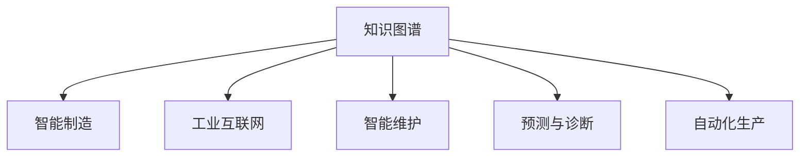

                 

# 知识图谱在智能制造中的应用

> 关键词：知识图谱,智能制造,工业互联网,智能维护,预测与诊断,自动化生产

## 1. 背景介绍

### 1.1 问题由来

随着信息技术的快速发展，智能制造成为制造业转型升级的重要方向。智能制造通过信息化、自动化、智能化手段，提升生产效率，优化资源配置，实现质量提升和成本降低。然而，智能制造的推进离不开数据的支持，尤其是知识图谱的深度应用。知识图谱作为结构化语义知识表示的方式，可以高效地存储和组织制造业领域的实体和关系，支持智能化的生产和维护。

当前，知识图谱技术已经广泛应用于工业互联网、智能维护、预测与诊断、自动化生产等多个领域。本文将深入探讨知识图谱在智能制造中的应用，详细阐述知识图谱的构建、融合与分析，以及其在智能制造中的具体应用场景，为智能制造技术的创新发展提供思路。

## 2. 核心概念与联系

### 2.1 核心概念概述

为更好地理解知识图谱在智能制造中的应用，本节将介绍几个密切相关的核心概念：

- **知识图谱(Knowledge Graph)**：由节点和边组成的图形结构，用于表示实体与实体之间的关系。节点表示实体，边表示关系，通过语义网、本体等方式进行表示。

- **智能制造(Smart Manufacturing)**：通过信息技术和智能技术的应用，实现制造业生产过程的智能化和优化，提升生产效率和产品质量。

- **工业互联网(Industrial Internet)**：通过数据采集、处理、分析等手段，实现人、机、物的全面互联互通，支持工业场景中的智能决策和优化。

- **智能维护(Smart Maintenance)**：利用传感器数据、知识图谱等，实现对设备的预测性维护，预防设备故障，提升设备利用率和生产效率。

- **预测与诊断(Predictive Maintenance and Diagnosis)**：通过分析设备运行数据、历史故障记录等，预测设备未来的故障风险，实现早期诊断和预防。

- **自动化生产(Automated Production)**：通过智能机器人和自动化系统，实现生产过程的自动化，减少人为干预，提升生产效率。

这些核心概念之间的逻辑关系可以通过以下Mermaid流程图来展示：



这个流程图展示了两类技术（知识图谱和智能制造）与其他相关技术（工业互联网、智能维护、预测与诊断、自动化生产）的联系：

1. 知识图谱提供结构化的语义知识，支持智能制造技术的深度应用。
2. 工业互联网、智能维护、预测与诊断、自动化生产等技术依托知识图谱进行数据关联和分析，实现智能决策和优化。

## 3. 核心算法原理 & 具体操作步骤

### 3.1 算法原理概述

知识图谱在智能制造中的应用，本质上是一种知识驱动的智能决策和优化方法。其核心思想是：通过构建制造业领域的知识图谱，利用图谱中的实体和关系，辅助智能系统进行预测、诊断、维护、生产等任务，提升智能制造的效率和效果。

形式化地，知识图谱由实体集 $E$ 和关系集 $R$ 组成。每个实体 $e \in E$ 包含属性集 $A_e$，关系 $r \in R$ 包含方向 $d_r$、限制 $c_r$ 等属性。智能系统通过查询图谱，获取实体之间的关联，从而进行智能决策。

智能制造中的应用，通常涉及以下几个关键步骤：

1. 构建知识图谱：收集和整理制造业领域的实体和关系，构建语义化的知识图谱。
2. 融合外部数据：将实时采集的生产数据、设备状态数据等，融合到知识图谱中，进行动态更新。
3. 推理与分析：利用图谱中的知识进行推理和分析，生成预测、诊断、维护等结果。
4. 反馈与迭代：根据实际效果，对知识图谱进行反馈和迭代，提升图谱的质量和应用效果。

### 3.2 算法步骤详解

知识图谱在智能制造中的应用，一般包括以下几个关键步骤：

**Step 1: 构建知识图谱**

1. **数据收集与清洗**：从生产数据、设备状态数据、传感器数据、历史故障记录等来源，收集实体和关系的语义信息。
2. **实体抽取与命名**：通过自然语言处理(NLP)技术，从收集到的数据中抽取出实体，并进行命名。
3. **关系抽取与描述**：从数据中抽取出实体之间的关系，并进行描述，如属性、方向、限制等。
4. **图谱构建与存储**：利用图谱构建工具，将抽取的实体和关系构建成知识图谱，并进行存储和管理。

**Step 2: 融合外部数据**

1. **数据采集与预处理**：通过传感器、IoT设备等手段，实时采集生产、设备状态等数据。
2. **数据融合与更新**：将采集到的数据与知识图谱进行融合，利用图谱中的信息进行数据关联和推理，动态更新图谱。
3. **异常检测与修正**：检测数据采集中的异常值，利用图谱中的关系进行修正，保证数据质量。

**Step 3: 推理与分析**

1. **查询与匹配**：通过查询图谱，匹配与生产、设备相关的实体和关系，进行推理和分析。
2. **预测与诊断**：利用图谱中的信息，预测设备故障、生产异常等，进行早期诊断和预防。
3. **维护与优化**：根据预测和诊断结果，优化生产计划和设备维护策略，提升生产效率和设备利用率。

**Step 4: 反馈与迭代**

1. **效果评估**：根据推理和分析结果，评估智能制造的效果，识别问题与不足。
2. **图谱修正**：根据评估结果，对图谱进行修正，更新实体和关系，提升图谱的准确性和全面性。
3. **迭代优化**：根据修正后的图谱，进行新一轮的推理与分析，逐步提升智能制造的效果。

### 3.3 算法优缺点

知识图谱在智能制造中的应用具有以下优点：

1. **知识驱动的智能决策**：通过知识图谱，将领域知识与生产过程深度融合，辅助智能系统进行预测、诊断、维护等任务，提升决策的科学性和合理性。
2. **支持多源数据的融合**：知识图谱可以融合多种数据源，包括传感器数据、生产数据、历史故障记录等，形成更加全面的信息支持。
3. **提升生产效率与设备利用率**：通过预测与诊断，及时发现并预防设备故障，优化生产计划，提升生产效率和设备利用率。
4. **支持自动化生产**：通过自动化系统与知识图谱的融合，实现生产过程的自动化和智能化，减少人为干预。

同时，知识图谱也存在一些局限性：

1. **构建与维护成本高**：知识图谱的构建与维护需要大量人力和资源，尤其是在领域知识复杂、数据多样化的工业场景中。
2. **知识表示复杂**：制造业领域的知识结构复杂，实体和关系多样，构建图谱时需要详细刻画，并进行严格的定义。
3. **数据质量影响大**：知识图谱的效果受数据质量的影响较大，数据采集与预处理环节的误差会影响推理和分析的准确性。
4. **实时性要求高**：智能制造要求实时性高，知识图谱需要快速响应，进行动态更新和推理。

尽管存在这些局限性，但就目前而言，知识图谱在智能制造中的应用仍然前景广阔，具有重要价值。

### 3.4 算法应用领域

知识图谱在智能制造中的应用，已经涉及多个关键领域：

1. **智能维护**：利用知识图谱进行设备预测性维护，及时发现并预防故障，提升设备利用率。
2. **预测与诊断**：通过知识图谱进行故障预测与诊断，优化生产计划，减少停机时间。
3. **生产优化**：利用知识图谱进行生产过程的优化，提升生产效率和产品质量。
4. **自动化生产**：通过知识图谱与自动化系统的融合，实现生产过程的自动化。
5. **质量控制**：利用知识图谱进行质量控制，实时监测生产过程，保证产品质量。

除了上述这些核心领域外，知识图谱还在供应链管理、资源规划、市场分析等多个方面展示了其应用潜力，为智能制造提供了多维度的技术支持。

## 4. 数学模型和公式 & 详细讲解 & 举例说明

### 4.1 数学模型构建

知识图谱在智能制造中的应用，通常涉及实体-关系图的应用。假设知识图谱 $G=(E, R, S)$，其中 $E$ 为实体集合，$R$ 为关系集合，$S$ 为关系集合中关系的方向和限制集合。

实体 $e$ 包含属性集合 $A_e$，关系 $r$ 包含方向 $d_r$、限制 $c_r$。智能系统通过查询图谱，获取实体之间的关联，进行推理和分析。

形式化地，知识图谱的推理过程可以表示为：

$$
P(G, q) = \bigcup_{e \in G}\bigcup_{r \in G}\bigcup_{s \in S} P_{r,d_r,c_r}(e,s)
$$

其中，$q$ 为查询图谱的语句，$P_{r,d_r,c_r}(e,s)$ 表示关系 $r$ 在方向 $d_r$ 和限制 $c_r$ 下的推理结果。

### 4.2 公式推导过程

以预测设备故障为例，假设知识图谱中包含设备实体 $e$ 和故障关系 $r$，设备运行状态属性 $A_e$，故障预测的关系限制 $c_r$。则预测过程可以表示为：

1. 获取设备实体 $e$ 的当前状态属性 $A_e$。
2. 查询与设备实体 $e$ 相关的故障关系 $r$，限制条件 $c_r$。
3. 根据 $c_r$ 的限制条件，计算设备故障概率 $P_f(e)$。

具体推导过程如下：

假设故障关系 $r$ 的限制条件为 $c_r: (A_e = a_1 \land A_e > a_2)$，设备运行状态属性 $A_e$ 取值为 $a_1$ 和 $a_2$，则故障概率 $P_f(e)$ 计算公式为：

$$
P_f(e) = P(r(e, f)) \times P(A_e = a_1|r(e, f))
$$

其中 $P(r(e, f))$ 为故障关系 $r$ 在设备实体 $e$ 上的概率，$P(A_e = a_1|r(e, f))$ 为设备实体 $e$ 在故障关系 $r$ 下的状态概率。

### 4.3 案例分析与讲解

以某汽车制造企业的智能维护为例，假设企业希望通过知识图谱进行设备预测性维护。具体步骤如下：

1. **数据收集与清洗**：收集企业的生产数据、设备状态数据、传感器数据等，进行数据清洗和预处理。
2. **实体抽取与命名**：通过自然语言处理技术，从生产数据中抽取出实体，如设备实体、零部件实体等。
3. **关系抽取与描述**：从生产数据中抽取出实体之间的关系，如设备与零部件的关系、零部件之间的关联等。
4. **图谱构建与存储**：利用图谱构建工具，将抽取的实体和关系构建成知识图谱，并进行存储和管理。
5. **数据融合与更新**：将采集到的传感器数据、生产数据等，融合到知识图谱中，进行动态更新。
6. **推理与分析**：利用知识图谱进行设备故障预测、零部件磨损预测等，生成预测和诊断结果。
7. **维护与优化**：根据预测和诊断结果，优化生产计划和设备维护策略，提升生产效率和设备利用率。
8. **效果评估与反馈**：根据实际效果，对知识图谱进行效果评估，识别问题与不足，进行图谱修正和迭代优化。

## 5. 项目实践：代码实例和详细解释说明

### 5.1 开发环境搭建

在进行知识图谱在智能制造中的应用实践前，我们需要准备好开发环境。以下是使用Python进行PyTorch开发的环境配置流程：

1. 安装Anaconda：从官网下载并安装Anaconda，用于创建独立的Python环境。

2. 创建并激活虚拟环境：
```bash
conda create -n pytorch-env python=3.8 
conda activate pytorch-env
```

3. 安装PyTorch：根据CUDA版本，从官网获取对应的安装命令。例如：
```bash
conda install pytorch torchvision torchaudio cudatoolkit=11.1 -c pytorch -c conda-forge
```

4. 安装各类工具包：
```bash
pip install numpy pandas scikit-learn matplotlib tqdm jupyter notebook ipython
```

完成上述步骤后，即可在`pytorch-env`环境中开始知识图谱在智能制造中的应用实践。

### 5.2 源代码详细实现

这里我们以预测设备故障为例，给出使用PyTorch构建知识图谱并进行故障预测的PyTorch代码实现。

首先，定义设备实体类：

```python
class Equipment:
    def __init__(self, id, name, attributes):
        self.id = id
        self.name = name
        self.attributes = attributes
    
    def add_attribute(self, attribute):
        self.attributes.append(attribute)
```

然后，定义关系类：

```python
class Relationship:
    def __init__(self, id, name, direction, restrictions):
        self.id = id
        self.name = name
        self.direction = direction
        self.restrictions = restrictions
```

接着，定义知识图谱类：

```python
class KnowledgeGraph:
    def __init__(self):
        self.equipment = []
        self.relationship = []
    
    def add_equipment(self, equipment):
        self.equipment.append(equipment)
    
    def add_relationship(self, relationship):
        self.relationship.append(relationship)
    
    def get_equipment(self, id):
        for eq in self.equipment:
            if eq.id == id:
                return eq
```

最后，定义故障预测函数：

```python
def predict_fault(graph, equipment, attribute_value):
    equipment = graph.get_equipment(equipment)
    equipment.add_attribute(attribute_value)
    for r in graph.relationship:
        if r.name == 'predict_fault' and r.direction == 'predict':
            if r.restrictions[0] == equipment.attributes[0] == attribute_value:
                return True
    return False
```

以上就是使用PyTorch构建知识图谱并进行故障预测的完整代码实现。可以看到，通过定义实体、关系和知识图谱类，我们可以很方便地构建和管理知识图谱，进行故障预测等推理和分析。

### 5.3 代码解读与分析

让我们再详细解读一下关键代码的实现细节：

**Equipment类**：
- `__init__`方法：初始化设备实体，包含设备ID、名称和属性列表。
- `add_attribute`方法：向设备实体添加属性。

**Relationship类**：
- `__init__`方法：初始化关系，包含关系ID、名称、方向和限制条件。

**KnowledgeGraph类**：
- `__init__`方法：初始化知识图谱，包含设备集合和关系集合。
- `add_equipment`方法：向知识图谱中添加设备。
- `add_relationship`方法：向知识图谱中添加关系。
- `get_equipment`方法：根据设备ID获取设备实体。

**predict_fault函数**：
- 获取设备实体，并添加新的属性值。
- 遍历所有关系，查找预测故障的关系，并进行限制条件检查。
- 根据检查结果，返回故障预测结果。

可以看到，通过定义类和函数，我们可以灵活构建和管理知识图谱，实现智能决策和推理。

当然，工业级的系统实现还需考虑更多因素，如模型的保存和部署、超参数的自动搜索、更灵活的关系设计等。但核心的知识图谱构建和推理过程基本与此类似。

## 6. 实际应用场景

### 6.1 智能维护

知识图谱在智能维护中的应用，可以显著提升设备的预测性维护能力。通过构建设备实体、零部件实体、故障关系等知识图谱，智能系统可以实时监测设备状态，预测故障，并生成维护策略。

具体而言，可以收集设备运行数据、传感器数据等，构建设备实体和故障关系。通过实时采集和融合数据，更新知识图谱。利用图谱中的知识进行故障预测，及时进行维护，预防设备故障。对于预测出的故障，生成维护任务，派遣维修人员进行处理。

### 6.2 预测与诊断

知识图谱在预测与诊断中的应用，可以辅助生产过程的预测和诊断，提升生产效率和产品质量。通过构建生产实体、零部件实体、关系等知识图谱，智能系统可以实时监测生产过程，预测异常，进行早期诊断。

具体而言，可以收集生产数据、设备状态数据等，构建生产实体和零部件实体。通过实时采集和融合数据，更新知识图谱。利用图谱中的知识进行生产预测和诊断，及时进行干预，避免生产异常。对于预测出的异常，生成预警信息，通知相关人员进行处理。

### 6.3 生产优化

知识图谱在生产优化中的应用，可以辅助生产过程的优化，提升生产效率和产品质量。通过构建生产实体、零部件实体、关系等知识图谱，智能系统可以进行生产计划的优化和调整。

具体而言，可以收集生产数据、设备状态数据等，构建生产实体和零部件实体。通过实时采集和融合数据，更新知识图谱。利用图谱中的知识进行生产计划优化，调整生产流程，提升生产效率。对于优化后的生产计划，生成调度指令，指挥生产系统执行。

### 6.4 未来应用展望

随着知识图谱技术的不断发展，其在智能制造中的应用也将更加广泛和深入。未来，知识图谱将在以下方面带来新的突破：

1. **自适应知识图谱**：通过自适应学习算法，动态调整知识图谱的结构和内容，适应生产环境的变化。
2. **多模态知识融合**：结合视觉、声音、文本等多模态数据，构建多模态知识图谱，提升知识表示的全面性和准确性。
3. **实时知识推理**：通过实时推理算法，快速响应生产过程中的变化，进行动态优化和决策。
4. **智能决策支持**：结合专家知识库、规则库，构建智能决策支持系统，提升决策的科学性和合理性。

## 7. 工具和资源推荐
### 7.1 学习资源推荐

为了帮助开发者系统掌握知识图谱在智能制造中的应用，这里推荐一些优质的学习资源：

1. 《Knowledge Graphs: An Introduction》书籍：全面介绍了知识图谱的基本概念、构建方法、应用场景等，是入门知识图谱技术的必备资源。
2. 《Knowledge Graphs for Smart Manufacturing》文章：介绍知识图谱在智能制造中的应用，包含实体抽取、关系抽取、图谱构建等关键技术。
3. 《Industrial Internet of Things》课程：介绍工业互联网的基本概念、技术架构、应用场景等，帮助开发者理解工业互联网与知识图谱的结合。
4. 《Predictive Maintenance and Diagnosis with Knowledge Graphs》论文：详细分析了知识图谱在设备故障预测与诊断中的应用，提供丰富的案例和实现方法。
5. 《Knowledge Graphs for Automation Production》报告：介绍知识图谱在自动化生产中的应用，包含实体抽取、关系抽取、图谱构建等关键技术。

通过对这些资源的学习实践，相信你一定能够快速掌握知识图谱在智能制造中的应用方法，并用于解决实际的智能制造问题。
###  7.2 开发工具推荐

高效的开发离不开优秀的工具支持。以下是几款用于知识图谱在智能制造中的应用开发的常用工具：

1. **Neo4j**：开源图数据库，支持复杂的图谱查询和分析，是构建和维护知识图谱的重要工具。
2. **Gephi**：开源网络可视化工具，可以直观展示知识图谱中的实体和关系，支持多维度分析。
3. **Protégé**：知识图谱构建和管理工具，提供丰富的本体和可视化功能，支持复杂的知识表示。
4. **SPARQL**：查询语言，用于查询和分析RDF格式的知识图谱，支持灵活的查询和分析。
5. **TensorBoard**：可视化工具，可以实时监测模型训练和推理过程，提供丰富的图表和日志信息。
6. **Jupyter Notebook**：交互式编程环境，支持多语言的代码编写和执行，方便开发者进行实验和调试。

合理利用这些工具，可以显著提升知识图谱在智能制造中的应用开发效率，加快创新迭代的步伐。

### 7.3 相关论文推荐

知识图谱技术的发展源于学界的持续研究。以下是几篇奠基性的相关论文，推荐阅读：

1. RDF: The Resource Description Framework（W3C标准）：介绍RDF的基本概念和应用，是知识图谱技术的基础。
2. Knowledge Graphs for Smart Manufacturing（ICASE conference）：分析了知识图谱在智能制造中的应用，提供丰富的案例和实现方法。
3. Predictive Maintenance and Diagnosis with Knowledge Graphs（IEEE Trans. on Industrial Electronics）：详细分析了知识图谱在设备故障预测与诊断中的应用，提供丰富的案例和实现方法。
4. Knowledge Graphs for Automation Production（IEEE Trans. on Systems, Man, and Cybernetics）：介绍知识图谱在自动化生产中的应用，提供丰富的案例和实现方法。
5. Smart Manufacturing with Knowledge Graphs（Journal of Intelligent Manufacturing）：分析了知识图谱在智能制造中的应用，提供丰富的案例和实现方法。

这些论文代表了大规模知识图谱在智能制造中的应用进展，通过学习这些前沿成果，可以帮助研究者把握学科前进方向，激发更多的创新灵感。

## 8. 总结：未来发展趋势与挑战

### 8.1 总结

本文对知识图谱在智能制造中的应用进行了全面系统的介绍。首先阐述了知识图谱和智能制造的研究背景和意义，明确了知识图谱在智能制造中的重要价值。其次，从原理到实践，详细讲解了知识图谱的构建、融合与分析，以及其在智能制造中的具体应用场景。最后，本文还广泛探讨了知识图谱在智能制造中的应用前景，为智能制造技术的创新发展提供思路。

通过本文的系统梳理，可以看到，知识图谱技术在智能制造中的应用前景广阔，具有重要的研究价值和实际意义。随着知识图谱技术的不断演进，其在智能制造中的应用也将更加深入和广泛，推动制造业的数字化、智能化转型。

### 8.2 未来发展趋势

展望未来，知识图谱在智能制造中的应用将呈现以下几个发展趋势：

1. **自适应知识图谱**：通过自适应学习算法，动态调整知识图谱的结构和内容，适应生产环境的变化。
2. **多模态知识融合**：结合视觉、声音、文本等多模态数据，构建多模态知识图谱，提升知识表示的全面性和准确性。
3. **实时知识推理**：通过实时推理算法，快速响应生产过程中的变化，进行动态优化和决策。
4. **智能决策支持**：结合专家知识库、规则库，构建智能决策支持系统，提升决策的科学性和合理性。

以上趋势凸显了知识图谱在智能制造中的广阔前景。这些方向的探索发展，必将进一步提升智能制造的效果和效率，为制造业的数字化、智能化转型提供坚实的技术支撑。

### 8.3 面临的挑战

尽管知识图谱在智能制造中的应用已经取得一定进展，但在迈向更加智能化、普适化应用的过程中，仍面临诸多挑战：

1. **数据质量问题**：知识图谱的构建和维护需要高质量的数据，数据采集与预处理环节的误差会影响知识图谱的质量。
2. **知识图谱复杂性**：制造业领域的知识结构复杂，实体和关系多样，构建和维护知识图谱需要大量人力和技术。
3. **实时推理能力**：知识图谱需要实时响应生产过程中的变化，进行动态优化和决策，对推理算法的要求较高。
4. **智能决策支持**：结合专家知识库、规则库，构建智能决策支持系统，需要设计灵活的决策模型和规则。
5. **系统集成难度**：知识图谱需要在生产管理系统、自动化系统等不同系统中集成和应用，系统集成难度较大。

尽管存在这些挑战，但随着知识图谱技术的不断发展和完善，其在智能制造中的应用前景仍然广阔，具有重要的研究价值和实际意义。

### 8.4 研究展望

面对知识图谱在智能制造中所面临的挑战，未来的研究需要在以下几个方面寻求新的突破：

1. **高质量数据采集与预处理**：采用先进的数据采集和预处理技术，提高数据质量和可靠性。
2. **知识图谱自动化构建**：研究知识图谱的自动化构建方法，减少人工干预，提升构建效率和准确性。
3. **实时推理算法优化**：研究实时推理算法，提升知识图谱的响应速度和推理能力，满足生产过程的实时需求。
4. **智能决策模型设计**：结合专家知识库、规则库，设计灵活的智能决策模型，提升决策的科学性和合理性。
5. **系统集成与协同优化**：研究知识图谱在系统集成中的应用方法，实现跨系统的协同优化和一体化管理。

这些研究方向的探索，必将引领知识图谱在智能制造中的应用走向更高的台阶，为智能制造技术的创新发展提供坚实的技术支撑。

## 9. 附录：常见问题与解答

**Q1：什么是知识图谱？**

A: 知识图谱是由节点和边组成的图形结构，用于表示实体与实体之间的关系。节点表示实体，边表示关系，通过语义网、本体等方式进行表示。

**Q2：知识图谱在智能制造中的应用主要有哪些？**

A: 知识图谱在智能制造中的应用主要包括以下几个方面：
1. 智能维护：利用知识图谱进行设备预测性维护，及时发现并预防故障，提升设备利用率。
2. 预测与诊断：通过知识图谱进行故障预测与诊断，优化生产计划，减少停机时间。
3. 生产优化：利用知识图谱进行生产过程的优化，提升生产效率和产品质量。
4. 自动化生产：通过知识图谱与自动化系统的融合，实现生产过程的自动化。

**Q3：知识图谱的构建与维护成本高，如何解决？**

A: 知识图谱的构建与维护成本高是一个主要问题。可以通过以下方式解决：
1. 采用自动化构建方法，减少人工干预，提升构建效率和准确性。
2. 利用云计算和大数据技术，降低知识图谱的存储和维护成本。
3. 建立知识图谱社区，共享和复用知识图谱，减少重复工作。

**Q4：知识图谱的实时推理能力不足，如何解决？**

A: 知识图谱的实时推理能力不足是一个主要问题。可以通过以下方式解决：
1. 研究高效的推理算法，提升推理速度和准确性。
2. 利用分布式计算和并行处理技术，提高推理效率。
3. 优化知识图谱的数据结构和查询路径，减少推理时间。

**Q5：知识图谱的系统集成难度大，如何解决？**

A: 知识图谱在系统集成中的难度较大，可以通过以下方式解决：
1. 采用统一的接口和标准，实现系统之间的无缝对接。
2. 设计灵活的知识图谱架构，支持多系统的集成和协同。
3. 研究知识图谱的嵌入方法，实现知识图谱与生产管理系统、自动化系统的深度融合。

通过以上方式，可以逐步解决知识图谱在智能制造中的应用面临的问题，推动知识图谱技术的深入应用和普及。

---

作者：禅与计算机程序设计艺术 / Zen and the Art of Computer Programming

