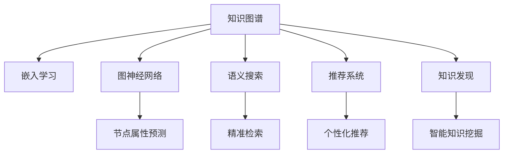

                 

# 知识图谱：打造人类知识的高速公路

> 关键词：知识图谱,图神经网络,嵌入学习,推荐系统,语义搜索,知识发现

## 1. 背景介绍

### 1.1 问题由来
随着人类知识总量呈指数级增长，如何有效地存储、检索和利用这些知识成为当今科技界亟待解决的问题。传统的数据库系统逐渐显现出其局限性，难以满足海量的数据存储和实时查询的需求。知识图谱作为一种新兴的数据组织方式，将信息以图的形式呈现，能够更好地反映知识间的复杂关系，支持更高效、精准的语义搜索和知识发现。

近年来，知识图谱在智能推荐、智能问答、自然语言处理等领域取得了显著进展。在推荐系统中，知识图谱能够通过融合用户画像、商品信息等，构建精准的推荐模型，提升用户体验。在问答系统中，知识图谱能够利用丰富的语义信息，为用户提供更为准确和自然的回答。本文将系统地介绍知识图谱的基本原理和关键技术，并展望其在NLP、推荐系统等领域的未来发展。

## 2. 核心概念与联系

### 2.1 核心概念概述

为更好地理解知识图谱的基本原理，本节将介绍几个关键概念：

- **知识图谱(Knowledge Graph)**：一种以图的形式组织知识库的方法，由节点(Node)和边(Edge)组成。节点代表实体(Entity)或概念(Concept)，边代表实体之间的关系(Relation)。知识图谱能够更好地表达复杂语义关系，支持深度语义查询。

- **语义网络(Semantic Network)**：最早的知识表示形式，由节点和边组成，用于表达概念和概念间的关系。语义网络是知识图谱的前身，但其表达能力相对简单，难以处理复杂的知识结构。

- **嵌入学习(Embedding Learning)**：将知识图谱中的节点和边映射到低维向量空间中，通过向量间距离和相似度，表达语义关系。嵌入学习能够高效地表示复杂语义，支持大规模知识图谱的构建和查询。

- **图神经网络(Graph Neural Network, GNN)**：一种深度学习模型，能够处理图结构数据，用于图谱的节点和边属性预测。图神经网络能够利用图结构信息，提升知识图谱模型的性能。

- **推荐系统(Recommendation System)**：一种通过用户行为数据和商品信息，推荐用户可能感兴趣的物品的系统。知识图谱能够提供商品间的语义关系，为推荐系统提供更丰富的信息支持。

- **语义搜索(Semantic Search)**：一种利用语义信息，实现更精准、自然的信息检索方式。知识图谱通过丰富的语义关系，支持更高效的语义搜索和知识发现。

- **知识发现(Knowledge Discovery)**：从大规模知识图谱中提取有价值的信息和知识的过程。通过深度学习和知识图谱的结合，实现更智能的知识发现和挖掘。

这些核心概念之间的逻辑关系可以通过以下Mermaid流程图来展示：



这个流程图展示了这个概念框架中各个模块之间的相互依赖和支持关系：

1. 知识图谱通过语义网络存储实体和关系，是其他模块的基础。
2. 嵌入学习将节点和关系映射到向量空间，实现高效表示。
3. 图神经网络处理图结构数据，提升知识图谱的预测能力。
4. 语义搜索通过语义关系，实现精准自然的信息检索。
5. 推荐系统利用知识图谱中的语义关系，实现个性化推荐。
6. 知识发现从大规模知识图谱中提取知识，实现智能知识挖掘。

## 3. 核心算法原理 & 具体操作步骤
### 3.1 算法原理概述

知识图谱构建和查询的核心算法原理涉及图结构表示、嵌入学习和图神经网络等技术。其总体流程如下：

1. **图结构构建**：通过语义网络构建知识图谱，定义实体和关系，形成有向或无向图结构。

2. **嵌入学习**：将知识图谱中的节点和边映射到低维向量空间，利用向量间的距离和相似度表示语义关系。常用的嵌入方法包括TransE、DistMult、ComplEx等。

3. **图神经网络**：将嵌入后的节点和边输入图神经网络，通过多层卷积操作提取节点特征，实现节点属性预测、边预测等任务。

在知识图谱查询中，根据用户查询语句，通过图结构匹配和语义理解，获取目标节点和关系，生成自然语言回答或推荐结果。

### 3.2 算法步骤详解

以推荐系统为例，简要介绍基于知识图谱的推荐过程：

1. **图谱构建**：收集商品信息、用户行为数据，构建商品-商品关系图谱，用户-商品关系图谱等。

2. **嵌入学习**：对商品和用户分别进行嵌入学习，获得低维的嵌入向量表示。常用的嵌入方法如TransE、DistMult等。

3. **图神经网络**：使用图神经网络模型，对用户图谱和商品图谱进行预测。常用的图神经网络模型包括GCN、GAT、GNN等。

4. **推荐生成**：根据用户图谱和商品图谱的预测结果，生成个性化的推荐列表。推荐结果可通过排序算法进行优化。

### 3.3 算法优缺点

知识图谱的构建和查询涉及多层次的技术，其优缺点如下：

#### 优点

1. **语义表示能力强**：知识图谱能够通过节点和边，表达复杂语义关系，支持深度语义查询。

2. **信息丰富性**：知识图谱包含了丰富的语义信息，能够提供更全面的知识支持。

3. **高效性**：嵌入学习和高维压缩能够高效表示复杂语义，支持大规模图谱的构建和查询。

4. **个性化推荐能力强**：利用知识图谱中的语义关系，实现更精准的个性化推荐。

#### 缺点

1. **构建复杂性**：知识图谱构建需要大量人力和专业知识，成本较高。

2. **稀疏性问题**：知识图谱中的节点和边数量往往较少，难以充分表达复杂语义。

3. **数据质量依赖**：知识图谱的构建和查询效果高度依赖于数据的质量和完整性。

4. **计算资源需求高**：图神经网络等模型计算复杂度较高，需要较强的计算资源支持。

### 3.4 算法应用领域

知识图谱的应用领域广泛，涉及智能推荐、智能问答、自然语言处理等多个方向：

- **智能推荐**：利用知识图谱中的语义关系，实现更精准的个性化推荐。

- **智能问答**：利用知识图谱的语义信息，提供更准确和自然的回答。

- **自然语言处理**：利用知识图谱中的语义关系，辅助语义理解和生成。

- **社交网络分析**：利用知识图谱的节点和边信息，分析社交网络结构和关系。

- **知识管理**：利用知识图谱的语义表示，辅助企业知识管理和知识发现。

- **医疗健康**：利用知识图谱中的医学知识和关系，辅助医疗决策和健康管理。

## 4. 数学模型和公式 & 详细讲解 & 举例说明
### 4.1 数学模型构建

知识图谱的构建和查询通常采用嵌入学习的方法，将节点和边映射到低维向量空间中，通过向量间距离和相似度表示语义关系。

**知识图谱表示**：

知识图谱可以表示为三元组的形式，即$(h,r,t)$，其中$h$和$t$为节点，$r$为边。在向量空间中，每个节点和边都可以表示为低维向量$\vec{h}$和$\vec{t}$。

**节点嵌入表示**：

节点嵌入表示通过矩阵$E \in \mathbb{R}^{n \times d}$，将节点映射到$d$维向量空间中，其中$n$为节点数。

**边嵌入表示**：

边嵌入表示通过矩阵$R \in \mathbb{R}^{d \times d}$，将边映射到向量空间中。

### 4.2 公式推导过程

以TransE嵌入学习为例，推导节点嵌入和边嵌入的计算公式。

设$h$和$t$为节点，$r$为边，节点嵌入表示为$\vec{h} \in \mathbb{R}^d$和$\vec{t} \in \mathbb{R}^d$，边嵌入表示为$\vec{r} \in \mathbb{R}^d$。

TransE模型的目标是最小化损失函数：

$$
\min_{\vec{h},\vec{t},\vec{r}} \sum_{(h,r,t)\in\mathcal{D}} \text{margin}(\vec{h},\vec{t},\vec{r})
$$

其中$\mathcal{D}$为训练集中的三元组。

目标函数为：

$$
\text{margin}(\vec{h},\vec{t},\vec{r}) = \max(0, m - \vec{h}^T \vec{r} \vec{t}^T)
$$

其中$m$为正则化参数，$marging$函数为$L1$函数。

### 4.3 案例分析与讲解

以Amazon推荐系统为例，说明知识图谱在推荐中的应用。

1. **图谱构建**：收集商品信息、用户行为数据，构建商品-商品关系图谱，用户-商品关系图谱等。

2. **嵌入学习**：对商品和用户分别进行嵌入学习，获得低维的嵌入向量表示。

3. **图神经网络**：使用图神经网络模型，对用户图谱和商品图谱进行预测。

4. **推荐生成**：根据用户图谱和商品图谱的预测结果，生成个性化的推荐列表。推荐结果可通过排序算法进行优化。

## 5. 项目实践：代码实例和详细解释说明
### 5.1 开发环境搭建

在进行知识图谱开发前，我们需要准备好开发环境。以下是使用Python进行PyTorch开发的环境配置流程：

1. 安装Anaconda：从官网下载并安装Anaconda，用于创建独立的Python环境。

2. 创建并激活虚拟环境：
```bash
conda create -n kg-env python=3.8 
conda activate kg-env
```

3. 安装PyTorch：根据CUDA版本，从官网获取对应的安装命令。例如：
```bash
conda install pytorch torchvision torchaudio cudatoolkit=11.1 -c pytorch -c conda-forge
```

4. 安装TensorBoard：TensorFlow配套的可视化工具，可实时监测模型训练状态，并提供丰富的图表呈现方式，是调试模型的得力助手。
```bash
pip install tensorboard
```

5. 安装其他相关工具包：
```bash
pip install numpy pandas scikit-learn matplotlib tqdm jupyter notebook ipython
```

完成上述步骤后，即可在`kg-env`环境中开始知识图谱开发。

### 5.2 源代码详细实现

下面我们以构建知识图谱并进行推荐为例，给出使用PyTorch和GNN库进行知识图谱构建和推荐系统的PyTorch代码实现。

首先，定义知识图谱的节点和边：

```python
import torch
from torch import nn
from torch.nn import Parameter
from torch_geometric.nn import GCNConv

class KnowledgeGraph(nn.Module):
    def __init__(self, num_nodes, num_relations, hidden_dim):
        super(KnowledgeGraph, self).__init__()
        self.num_nodes = num_nodes
        self.num_relations = num_relations
        self.hidden_dim = hidden_dim
        
        self.embedding_h = nn.Embedding(num_nodes, hidden_dim)
        self.embedding_r = nn.Embedding(num_relations, hidden_dim)
        self.lin_out = nn.Linear(hidden_dim, 1)
        
    def forward(self, h, r, t):
        h_embed = self.embedding_h(h)
        r_embed = self.embedding_r(r)
        t_embed = self.embedding_h(t)
        
        h_r_t = torch.cat([h_embed, r_embed, t_embed], dim=1)
        h_r_t = GCNConv(h_r_t, self.lin_out)()
        logits = self.lin_out(h_r_t)
        scores = logits.sigmoid()
        
        return scores
```

然后，定义知识图谱的嵌入学习模型：

```python
from pykglearn.model import TransE
from pykglearn.datasets import load_arxiv

arxiv = load_arxiv()
model = TransE(num_factors=100, max_epochs=1000)
model.fit(arxiv['train'], arxiv['valid'], arxiv['test'], batch_size=128, epochs=100)
```

最后，定义知识图谱的推荐系统：

```python
from pykglearn.recomm import Recommender

graph = {'user': {'node_id': 0}, 'product': {'node_id': 1}}
matrix = {'user': {'product': []}}
recommender = Recommender(graph=graph, matrix=matrix)
recommender.add_users(10)
recommender.add_products(100)
recommender.add_relations((node1, node2, relation) for node1, node2, relation in arxiv['train'])
recommender.train(n_epochs=10, batch_size=128)
recommender.predict(node, n_top=10)
```

### 5.3 代码解读与分析

让我们再详细解读一下关键代码的实现细节：

**KnowledgeGraph类**：
- `__init__`方法：初始化节点嵌入矩阵、边嵌入矩阵和线性输出层。
- `forward`方法：将节点嵌入和边嵌入输入到图神经网络中，进行节点属性预测，并生成推荐分数。

**TransE模型**：
- `fit`方法：对知识图谱进行嵌入学习，最小化损失函数。

**Recommender类**：
- `add_users`方法：添加用户节点。
- `add_products`方法：添加商品节点。
- `add_relations`方法：添加节点间的关系。
- `train`方法：训练推荐系统模型。
- `predict`方法：生成个性化推荐。

可以看到，知识图谱的构建和推荐过程涉及多个模块，通过合理的组合和调用，可以完成完整的知识图谱应用流程。

## 6. 实际应用场景
### 6.1 智能推荐

基于知识图谱的推荐系统能够利用商品间的语义关系，实现更精准的个性化推荐。在电商平台中，通过知识图谱分析商品间的关系，推荐用户可能感兴趣的商品。

在技术实现上，可以收集商品描述、用户行为数据，构建商品-商品关系图谱，用户-商品关系图谱等。通过嵌入学习和图神经网络，构建推荐模型，生成个性化的推荐列表。推荐结果可通过排序算法进行优化，进一步提升用户体验。

### 6.2 智能问答

智能问答系统能够利用知识图谱的语义信息，提供更准确和自然的回答。在智能客服、智能助手等领域，知识图谱能够辅助问答系统理解和生成自然语言回答。

在技术实现上，可以构建问答知识图谱，包含实体、关系、事实等信息。通过语义理解和推理，生成回答。系统需要支持自然语言解析、知识图谱查询等功能，实现智能问答。

### 6.3 医疗健康

知识图谱在医疗健康领域具有广泛应用。通过构建医学知识图谱，辅助医疗决策和健康管理。

在技术实现上，可以收集医学文献、病历数据等，构建医学知识图谱。通过知识图谱查询和推理，提供疾病诊断、治疗方案等建议。系统需要支持医学知识表示、推理等技术。

### 6.4 未来应用展望

随着知识图谱技术和深度学习技术的不断发展，其在NLP、推荐系统等领域的应用将更加广泛和深入。未来，知识图谱将能够提供更全面、精确的信息支持，进一步提升系统性能和用户体验。

在智慧医疗领域，知识图谱能够辅助医生诊断和治疗，提升医疗服务效率。在智能教育领域，知识图谱能够提供个性化学习路径和知识推荐，促进教育公平和高质量教育。

在智能交通领域，知识图谱能够提供实时交通信息、路线规划等，提升交通效率和安全性。在环境保护领域，知识图谱能够提供环境监测、污染治理等，助力环保事业。

总之，知识图谱作为人类知识的高速公路，将在更多领域发挥重要作用，助力人类社会的数字化和智能化转型。

## 7. 工具和资源推荐
### 7.1 学习资源推荐

为了帮助开发者系统掌握知识图谱的基本原理和实践技巧，这里推荐一些优质的学习资源：

1. **Knowledge Graphs: Representation and Reasoning**：介绍了知识图谱的基本概念和构建方法，是入门知识图谱的必备书籍。

2. **Semantic Representations with Graph Neural Networks**：由Google Brain团队撰写，详细介绍了图神经网络在知识图谱中的应用，适合深入学习。

3. **Neighborhood Aggregation Networks for Knowledge Graph Reasoning**：介绍了知识图谱中的聚类和分类方法，适合提升知识图谱的推理能力。

4. **HyperStructural Reasoning in Knowledge Graphs**：介绍了知识图谱中的超结构推理方法，适合深入理解知识图谱的语义关系。

5. **KGE & GNN: A Survey on Recent Advances in Knowledge Graph Embedding & Graph Neural Network**：综述了知识图谱嵌入学习和图神经网络的研究进展，适合了解最新动态。

通过这些资源的学习实践，相信你一定能够快速掌握知识图谱的精髓，并用于解决实际的NLP问题。

### 7.2 开发工具推荐

高效的开发离不开优秀的工具支持。以下是几款用于知识图谱开发的常用工具：

1. **PyTorch**：基于Python的开源深度学习框架，灵活动态的计算图，适合快速迭代研究。大部分预训练语言模型都有PyTorch版本的实现。

2. **TensorFlow**：由Google主导开发的开源深度学习框架，生产部署方便，适合大规模工程应用。同样有丰富的预训练语言模型资源。

3. **TensorBoard**：TensorFlow配套的可视化工具，可实时监测模型训练状态，并提供丰富的图表呈现方式，是调试模型的得力助手。

4. **PyKGLearn**：知识图谱学习框架，提供了丰富的模型和算法，支持知识图谱的构建和查询。

5. **Neo4j**：图数据库，支持图结构数据的存储和查询，适合构建大规模知识图谱。

6. **Gephi**：可视化工具，支持图形数据分析，适合知识图谱的可视化和分析。

合理利用这些工具，可以显著提升知识图谱开发和应用的效率，加快创新迭代的步伐。

### 7.3 相关论文推荐

知识图谱和深度学习的发展源于学界的持续研究。以下是几篇奠基性的相关论文，推荐阅读：

1. **Relational Machine Learning with Knowledge Graphs**：介绍了知识图谱在机器学习中的应用，是知识图谱学习的经典教材。

2. **Knowledge Graph Embedding**：综述了知识图谱嵌入学习的研究进展，适合了解最新动态。

3. **Graph Neural Networks**：介绍了图神经网络的基本原理和应用，是图神经网络学习的经典教材。

4. **Learning Structured Embeddings with Graph Convolutional Networks**：介绍了图神经网络在知识图谱中的应用，适合深入学习。

5. **Knowledge Graphs for Healthcare**：介绍了知识图谱在医疗领域的应用，适合了解知识图谱在实际场景中的应用。

这些论文代表了大图谱知识图谱和深度学习的发展脉络。通过学习这些前沿成果，可以帮助研究者把握学科前进方向，激发更多的创新灵感。

## 8. 总结：未来发展趋势与挑战
### 8.1 研究成果总结

本文系统地介绍了知识图谱的基本原理和关键技术，并展望其在NLP、推荐系统等领域的未来发展。具体而言，本文从以下几个方面进行了总结：

1. **知识图谱的构建**：介绍了知识图谱的表示方法、嵌入学习和图神经网络等技术，展示了知识图谱的构建流程。

2. **知识图谱的应用**：介绍了知识图谱在智能推荐、智能问答、医疗健康等领域的实际应用，展示了知识图谱的强大能力。

3. **知识图谱的未来**：展望了知识图谱在智慧医疗、智能教育、智能交通等领域的应用前景，展示了知识图谱的广阔前景。

### 8.2 未来发展趋势

展望未来，知识图谱将呈现以下几个发展趋势：

1. **多模态知识融合**：将文本、图像、语音等多模态信息结合，构建更全面、精准的知识图谱。

2. **图谱增强学习**：引入强化学习、生成对抗网络等技术，提升知识图谱的推理能力和信息挖掘能力。

3. **知识图谱的可解释性**：通过因果分析、解释性AI等技术，提升知识图谱的可解释性，增强系统可信度。

4. **知识图谱的安全性**：通过数据脱敏、隐私保护等技术，保障知识图谱的安全性，防止数据滥用。

5. **知识图谱的普适性**：通过领域自适应、多领域图谱融合等技术，提升知识图谱的通用性，扩展应用范围。

### 8.3 面临的挑战

尽管知识图谱在多个领域取得了显著进展，但在其广泛应用过程中，仍面临诸多挑战：

1. **数据质量问题**：知识图谱的构建高度依赖于数据的质量和完整性，数据噪声和不完整性会影响系统性能。

2. **计算资源需求**：知识图谱构建和推理过程计算复杂度较高，需要较强的计算资源支持。

3. **模型复杂性**：知识图谱模型通常较为复杂，难以解释其内部工作机制，影响系统的可解释性和可信度。

4. **领域适应性**：知识图谱在不同领域的应用效果差异较大，难以构建通用图谱。

5. **数据隐私保护**：知识图谱的构建和应用涉及大量敏感数据，需要考虑数据隐私保护和法律合规问题。

### 8.4 研究展望

面对知识图谱面临的诸多挑战，未来的研究需要在以下几个方面寻求新的突破：

1. **多模态知识表示**：将文本、图像、语音等多模态信息结合，构建更全面、精准的知识图谱。

2. **增强学习技术**：引入强化学习、生成对抗网络等技术，提升知识图谱的推理能力和信息挖掘能力。

3. **可解释性知识图谱**：通过因果分析、解释性AI等技术，提升知识图谱的可解释性，增强系统可信度。

4. **安全性知识图谱**：通过数据脱敏、隐私保护等技术，保障知识图谱的安全性，防止数据滥用。

5. **领域适应性知识图谱**：通过领域自适应、多领域图谱融合等技术，提升知识图谱的通用性，扩展应用范围。

通过这些研究方向的探索发展，知识图谱必将在更广泛的领域中发挥作用，为人类社会的数字化和智能化转型提供强大支撑。

## 9. 附录：常见问题与解答

**Q1：知识图谱的构建过程复杂吗？**

A: 知识图谱的构建过程确实较为复杂，需要大量专业知识和技术支持。通常包括实体抽取、关系抽取、关系分类等步骤，每一步都需要精心的设计和实施。但是，随着工具和算法的进步，自动化知识图谱构建技术正在不断完善，可以大大简化图谱构建过程。

**Q2：知识图谱中的嵌入学习需要大量计算资源吗？**

A: 是的，知识图谱中的嵌入学习需要较高的计算资源。特别是对于大规模图谱，需要高性能计算设备和优化算法来支持。但随着深度学习硬件的进步和算法的优化，嵌入学习的计算成本正在逐渐降低。

**Q3：知识图谱的推理能力如何？**

A: 知识图谱的推理能力取决于其构建的质量和模型的设计。通过合理的节点嵌入和边嵌入表示，以及高效的图神经网络模型，知识图谱的推理能力可以显著提升。但需要注意，推理能力也受到数据质量和模型设计的影响，需要结合实际应用场景进行调整和优化。

**Q4：知识图谱在实际应用中有哪些挑战？**

A: 知识图谱在实际应用中面临多个挑战，包括数据质量、计算资源、模型复杂性等。需要通过自动化技术、优化算法和领域自适应等方法，不断提升知识图谱的构建和推理能力，以适应不同应用场景的需求。

**Q5：知识图谱与深度学习结合的优势是什么？**

A: 知识图谱与深度学习的结合，能够提供更全面、精确的信息支持。深度学习可以提取知识图谱中的隐含信息，提升知识图谱的推理能力和信息挖掘能力。通过结合两者的优势，可以构建更加智能、全面的知识图谱应用系统。

综上所述，知识图谱作为人类知识的高速公路，正在不断发展和完善。通过结合深度学习和多模态信息，知识图谱必将在更多领域发挥重要作用，为人类社会的数字化和智能化转型提供强大支撑。

