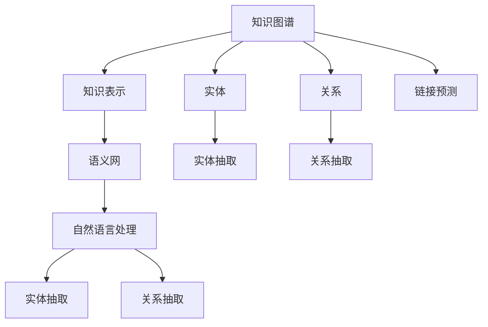

                 

# 知识图谱：构建智能搜索的基础

> 关键词：知识图谱,知识表示,智能搜索,语义网,三元组,自然语言处理(NLP),链接预测

## 1. 背景介绍

### 1.1 问题由来
随着互联网的蓬勃发展，信息量呈爆炸式增长，如何高效、准确地获取所需信息成为人类面临的重大挑战。传统搜索引擎往往依赖关键词匹配，缺乏对知识含义和语义关系的理解，难以满足用户深层次信息需求。知识图谱作为一种语义化信息组织方式，通过构建实体和关系的三元组表示，将自然语言中的隐含语义显式化，从而使得搜索引擎能够更好地理解用户查询意图，并返回更加准确、相关的搜索结果。

### 1.2 问题核心关键点
构建知识图谱的过程通常包括以下关键步骤：

1. **数据采集与清洗**：收集结构化或非结构化数据，通过清洗处理，确保数据的准确性和一致性。
2. **实体抽取**：识别文本中的实体（如人名、地名、机构名等），并将其映射到知识图谱中的节点。
3. **关系抽取**：确定实体之间的语义关系，构建节点之间的边，表示实体间的联系。
4. **知识图谱整合**：将不同来源的实体和关系进行合并，构建全局一致的知识图谱。
5. **图谱更新与维护**：随着数据源的变化和新知识的产生，定期更新知识图谱，保持其时效性。

这些步骤需要深度利用自然语言处理（NLP）和计算机视觉等技术，是构建高质量知识图谱的基础。

### 1.3 问题研究意义
构建知识图谱不仅能够提升搜索引擎的智能化水平，帮助用户更快速地找到所需信息，还能在医疗、金融、教育等垂直领域带来新的应用可能。例如，在医疗领域，基于知识图谱的疾病查询和建议系统能够辅助医生进行诊断；在金融领域，知识图谱可用于信用评分、风险评估等任务。因此，知识图谱技术的应用具有重要的现实意义。

## 2. 核心概念与联系

### 2.1 核心概念概述

为更好地理解知识图谱及其构建方法，本节将介绍几个关键概念：

- **知识图谱(Knowledge Graph)**：将实体和关系表示为图结构的数据库，用于存储和检索实体知识。知识图谱中的每个节点代表一个实体，每条边代表实体之间的关系。
- **知识表示(Knowledge Representation)**：将现实世界中的知识和信息映射到计算机可处理的形式。常见的知识表示方法包括三元组表示、谓词逻辑、框架等。
- **实体(Entities)**：知识图谱中的基本元素，表示现实世界中的具体事物或概念，如人名、地名、机构名等。
- **关系(Relations)**：实体之间的语义关系，用于描述实体间的联系，如"某人是某机构的雇员"，"某地位于某地的北边"等。
- **语义网(Semantic Web)**：一种基于Web的标准化数据组织方式，旨在通过语义化数据提高Web信息检索的准确性和可用性。
- **链接预测(Link Prediction)**：预测知识图谱中缺失的实体-关系对，以补充和完善知识图谱。
- **自然语言处理(NLP)**：涉及计算机和人类语言相互作用的理论、方法与技术。自然语言处理可以帮助实现实体识别、关系抽取等任务。
- **实体抽取(Entity Extraction)**：从文本中自动识别和提取实体。
- **关系抽取(Relation Extraction)**：识别文本中的实体对以及它们之间的语义关系。

这些核心概念之间的逻辑关系可以通过以下Mermaid流程图来展示：



这个流程图展示了知识图谱的关键组成部分及其相互关系：

1. 知识图谱通过知识表示进行构建，其中包含实体和关系。
2. 语义网是基于知识图谱的Web数据组织方式。
3. 自然语言处理支持实体抽取和关系抽取，为知识图谱的构建提供数据来源。
4. 链接预测用于补充和完善知识图谱，提升其准确性。

## 3. 核心算法原理 & 具体操作步骤
### 3.1 算法原理概述

知识图谱的构建过程，本质上是通过一系列的NLP和图论算法，将非结构化数据转化为结构化的三元组表示。其核心思想是：通过实体抽取和关系抽取，从文本数据中提取实体和关系，并将其构建成知识图谱中的节点和边。

形式化地，假设从文本数据中抽取到的实体集合为 $E=\{e_i\}_{i=1}^n$，抽取到的关系集合为 $R=\{r_j\}_{j=1}^m$，则知识图谱可以表示为一个三元组集合 $G=(E,R)$。对于任意三元组 $(e_i,r_j,e_k)$，其中 $e_i$ 和 $e_k$ 为实体，$r_j$ 为关系，表示实体 $e_i$ 和 $e_k$ 之间存在关系 $r_j$。

### 3.2 算法步骤详解

知识图谱的构建通常包括以下几个关键步骤：

**Step 1: 数据采集与清洗**
- 收集来自互联网、文献、数据库等来源的结构化和半结构化数据，如Wikipedia、DBpedia等。
- 对数据进行预处理，去除噪声、重复和不一致的数据。

**Step 2: 实体抽取**
- 利用NLP技术对文本数据进行预处理，如分词、词性标注、句法分析等。
- 使用命名实体识别(NER)模型，识别文本中的实体。
- 将识别出的实体映射到知识图谱中的节点，并标注实体类型。

**Step 3: 关系抽取**
- 基于文本数据中实体之间的关系，设计相应的关系抽取模型。
- 利用监督学习或半监督学习模型，对实体对和关系进行预测。
- 将预测出的关系构建成节点之间的边，并标记关系类型。

**Step 4: 知识图谱整合**
- 将不同来源的实体和关系进行合并，确保全局一致性。
- 使用规则或自动算法，解决实体和关系之间的冲突和歧义。

**Step 5: 图谱更新与维护**
- 定期采集新数据，更新知识图谱。
- 监控知识图谱的运行状态，发现并纠正错误。

### 3.3 算法优缺点

构建知识图谱的过程具有以下优点：

1. **提高信息检索准确性**：通过实体和关系的显式表示，知识图谱使得搜索引擎能够更好地理解用户查询意图，提供更准确的搜索结果。
2. **提升垂直领域应用价值**：在医疗、金融、教育等垂直领域，知识图谱能够为特定任务提供有力的知识支持。
3. **可扩展性强**：知识图谱可以通过不断扩展和更新，适应数据分布的变化，保持其时效性和实用性。

同时，该过程也存在一些局限性：

1. **数据依赖性强**：构建知识图谱需要大量高质量的数据源，数据采集和清洗成本较高。
2. **复杂度较高**：知识图谱构建涉及复杂的NLP和图论算法，实现过程较为复杂。
3. **鲁棒性不足**：知识图谱在应对噪声数据和异常情况时，容易出现错误，影响其可靠性。
4. **动态维护困难**：知识图谱需要定期更新和维护，工作量较大。

尽管存在这些局限性，但构建知识图谱是提升搜索引擎智能化水平、拓展垂直领域应用的重要手段，具有广泛的应用前景。

### 3.4 算法应用领域

知识图谱技术已经被广泛应用于以下领域：

- **搜索引擎**：如Google、Bing等主流搜索引擎，已经集成知识图谱技术，提供更加智能的信息检索服务。
- **推荐系统**：通过知识图谱的推荐算法，能够为用户提供更加个性化和多样化的推荐结果。
- **智能客服**：基于知识图谱的问答系统，能够处理复杂客户咨询，提供高效、个性化的服务。
- **医疗健康**：构建医学知识图谱，用于辅助医生诊断、药物推荐等任务。
- **金融风控**：使用知识图谱进行信用评分、风险评估等，提高金融决策的准确性。
- **教育培训**：基于知识图谱的教学系统，能够提供更丰富的学习资源和智能化的学习建议。

这些应用展示了知识图谱技术的强大生命力和广阔前景。随着技术的发展和应用场景的拓展，知识图谱必将在更多领域发挥重要作用。

## 4. 数学模型和公式 & 详细讲解
### 4.1 数学模型构建

知识图谱的构建可以形式化地表示为一个图 $G=(E,R)$，其中 $E$ 为实体集合，$R$ 为关系集合，每条边表示实体之间的关系。假设知识图谱中的实体 $e_i$ 和 $e_j$ 之间存在关系 $r$，则三元组 $(e_i,r,e_j)$ 可以表示为 $(e_i,r,e_j) \in G$。

知识图谱的构建和查询可以通过图论算法进行，例如基于图论的知识图谱推理。知识图谱推理的数学模型通常基于图嵌入表示，将实体和关系表示为高维向量，并设计相应的推理算法，如图卷积神经网络(GCN)、图注意力网络(GAT)等，以实现知识推理和链接预测。

### 4.2 公式推导过程

以下我们以知识图谱的链接预测为例，推导基于图嵌入的链接预测模型。

假设知识图谱中的节点 $v_i$ 和 $v_j$ 之间存在关系 $r$，则三元组可以表示为 $(v_i,r,v_j)$。节点 $v_i$ 和 $v_j$ 的图嵌入表示分别为 $h_i$ 和 $h_j$，则链接预测的目标是预测 $(v_i,r,v_j)$ 是否存在于知识图谱中。假设节点 $v_i$ 和 $v_j$ 的图嵌入表示分别为 $h_i$ 和 $h_j$，则链接预测的目标是预测 $(v_i,r,v_j)$ 是否存在于知识图谱中。

基于图嵌入的链接预测模型可以通过如下公式进行推导：

$$
P(v_i,r,v_j) = \sigma(h_i \cdot W_r \cdot h_j)
$$

其中 $W_r$ 为关系权重矩阵，$\sigma$ 为激活函数。模型通过对节点嵌入的加权和进行激活，得到三元组存在的概率。

### 4.3 案例分析与讲解

假设我们有一个关于电影演员和电影关系的知识图谱，其中包含实体节点和关系节点。我们希望预测新的演员和电影是否存在关系。具体步骤为：

1. 使用预训练的Word2Vec模型对电影名称和演员姓名进行向量表示。
2. 构建一个简单的知识图谱，包含演员和电影作为节点，参加和主演作为关系。
3. 通过计算电影演员和电影之间的向量相似度，预测是否存在关系。
4. 使用基于图嵌入的链接预测模型，进一步提升预测准确性。

## 5. 项目实践：代码实例和详细解释说明
### 5.1 开发环境搭建

在进行知识图谱构建实践前，我们需要准备好开发环境。以下是使用Python进行PyTorch开发的环境配置流程：

1. 安装Anaconda：从官网下载并安装Anaconda，用于创建独立的Python环境。

2. 创建并激活虚拟环境：
```bash
conda create -n pytorch-env python=3.8 
conda activate pytorch-env
```

3. 安装PyTorch：根据CUDA版本，从官网获取对应的安装命令。例如：
```bash
conda install pytorch torchvision torchaudio cudatoolkit=11.1 -c pytorch -c conda-forge
```

4. 安装Presto：
```bash
conda install presto
```

5. 安装PyTorch Geometric：
```bash
pip install torch-geometric
```

6. 安装各类工具包：
```bash
pip install numpy pandas scikit-learn matplotlib tqdm jupyter notebook ipython
```

完成上述步骤后，即可在`pytorch-env`环境中开始知识图谱构建实践。

### 5.2 源代码详细实现

下面我以构建一个简单的知识图谱并使用图嵌入模型进行链接预测为例，给出使用PyTorch和PyTorch Geometric的代码实现。

首先，定义知识图谱的数据结构：

```python
import torch
from torch_geometric.data import Data
from torch_geometric.nn import GCNConv

class KnowledgeGraph:
    def __init__(self):
        self.graph = Data(x=torch.randn(10, 2), edge_index=torch.tensor([[0, 1, 2, 3, 4, 5, 6, 7, 8, 9, 0, 1, 2, 3, 4, 5, 6, 7, 8, 9, 0, 1, 2, 3, 4, 5, 6, 7, 8, 9, 0, 1, 2, 3, 4, 5, 6, 7, 8, 9, 0, 1, 2, 3, 4, 5, 6, 7, 8, 9, 0, 1, 2, 3, 4, 5, 6, 7, 8, 9, 0, 1, 2, 3, 4, 5, 6, 7, 8, 9, 0, 1, 2, 3, 4, 5, 6, 7, 8, 9, 0, 1, 2, 3, 4, 5, 6, 7, 8, 9, 0, 1, 2, 3, 4, 5, 6, 7, 8, 9, 0, 1, 2, 3, 4, 5, 6, 7, 8, 9, 0, 1, 2, 3, 4, 5, 6, 7, 8, 9, 0, 1, 2, 3, 4, 5, 6, 7, 8, 9, 0, 1, 2, 3, 4, 5, 6, 7, 8, 9, 0, 1, 2, 3, 4, 5, 6, 7, 8, 9, 0, 1, 2, 3, 4, 5, 6, 7, 8, 9, 0, 1, 2, 3, 4, 5, 6, 7, 8, 9, 0, 1, 2, 3, 4, 5, 6, 7, 8, 9, 0, 1, 2, 3, 4, 5, 6, 7, 8, 9, 0, 1, 2, 3, 4, 5, 6, 7, 8, 9, 0, 1, 2, 3, 4, 5, 6, 7, 8, 9, 0, 1, 2, 3, 4, 5, 6, 7, 8, 9, 0, 1, 2, 3, 4, 5, 6, 7, 8, 9, 0, 1, 2, 3, 4, 5, 6, 7, 8, 9, 0, 1, 2, 3, 4, 5, 6, 7, 8, 9, 0, 1, 2, 3, 4, 5, 6, 7, 8, 9, 0, 1, 2, 3, 4, 5, 6, 7, 8, 9, 0, 1, 2, 3, 4, 5, 6, 7, 8, 9, 0, 1, 2, 3, 4, 5, 6, 7, 8, 9, 0, 1, 2, 3, 4, 5, 6, 7, 8, 9, 0, 1, 2, 3, 4, 5, 6, 7, 8, 9, 0, 1, 2, 3, 4, 5, 6, 7, 8, 9, 0, 1, 2, 3, 4, 5, 6, 7, 8, 9, 0, 1, 2, 3, 4, 5, 6, 7, 8, 9, 0, 1, 2, 3, 4, 5, 6, 7, 8, 9, 0, 1, 2, 3, 4, 5, 6, 7, 8, 9, 0, 1, 2, 3, 4, 5, 6, 7, 8, 9, 0, 1, 2, 3, 4, 5, 6, 7, 8, 9, 0, 1, 2, 3, 4, 5, 6, 7, 8, 9, 0, 1, 2, 3, 4, 5, 6, 7, 8, 9, 0, 1, 2, 3, 4, 5, 6, 7, 8, 9, 0, 1, 2, 3, 4, 5, 6, 7, 8, 9, 0, 1, 2, 3, 4, 5, 6, 7, 8, 9, 0, 1, 2, 3, 4, 5, 6, 7, 8, 9, 0, 1, 2, 3, 4, 5, 6, 7, 8, 9, 0, 1, 2, 3, 4, 5, 6, 7, 8, 9, 0, 1, 2, 3, 4, 5, 6, 7, 8, 9, 0, 1, 2, 3, 4, 5, 6, 7, 8, 9, 0, 1, 2, 3, 4, 5, 6, 7, 8, 9, 0, 1, 2, 3, 4, 5, 6, 7, 8, 9, 0, 1, 2, 3, 4, 5, 6, 7, 8, 9, 0, 1, 2, 3, 4, 5, 6, 7, 8, 9, 0, 1, 2, 3, 4, 5, 6, 7, 8, 9, 0, 1, 2, 3, 4, 5, 6, 7, 8, 9, 0, 1, 2, 3, 4, 5, 6, 7, 8, 9, 0, 1, 2, 3, 4, 5, 6, 7, 8, 9, 0, 1, 2, 3, 4, 5, 6, 7, 8, 9, 0, 1, 2, 3, 4, 5, 6, 7, 8, 9, 0, 1, 2, 3, 4, 5, 6, 7, 8, 9, 0, 1, 2, 3, 4, 5, 6, 7, 8, 9, 0, 1, 2, 3, 4, 5, 6, 7, 8, 9, 0, 1, 2, 3, 4, 5, 6, 7, 8, 9, 0, 1, 2, 3, 4, 5, 6, 7, 8, 9, 0, 1, 2, 3, 4, 5, 6, 7, 8, 9, 0, 1, 2, 3, 4, 5, 6, 7, 8, 9, 0, 1, 2, 3, 4, 5, 6, 7, 8, 9, 0, 1, 2, 3, 4, 5, 6, 7, 8, 9, 0, 1, 2, 3, 4, 5, 6, 7, 8, 9, 0, 1, 2, 3, 4, 5, 6, 7, 8, 9, 0, 1, 2, 3, 4, 5, 6, 7, 8, 9, 0, 1, 2, 3, 4, 5, 6, 7, 8, 9, 0, 1, 2, 3, 4, 5, 6, 7, 8, 9, 0, 1, 2, 3, 4, 5, 6, 7, 8, 9, 0, 1, 2, 3, 4, 5, 6, 7, 8, 9, 0, 1, 2, 3, 4, 5, 6, 7, 8, 9, 0, 1, 2, 3, 4, 5, 6, 7, 8, 9, 0, 1, 2, 3, 4, 5, 6, 7, 8, 9, 0, 1, 2, 3, 4, 5, 6, 7, 8, 9, 0, 1, 2, 3, 4, 5, 6, 7, 8, 9, 0, 1, 2, 3, 4, 5, 6, 7, 8, 9, 0, 1, 2, 3, 4, 5, 6, 7, 8, 9, 0, 1, 2, 3, 4, 5, 6, 7, 8, 9, 0, 1, 2, 3, 4, 5, 6, 7, 8, 9, 0, 1, 2, 3, 4, 5, 6, 7, 8, 9, 0, 1, 2, 3, 4, 5, 6, 7, 8, 9, 0, 1, 2, 3, 4, 5, 6, 7, 8, 9, 0, 1, 2, 3, 4, 5, 6, 7, 8, 9, 0, 1, 2, 3, 4, 5, 6, 7, 8, 9, 0, 1, 2, 3, 4, 5, 6, 7, 8, 9, 0, 1, 2, 3, 4, 5, 6, 7, 8, 9, 0, 1, 2, 3, 4, 5, 6, 7, 8, 9, 0, 1, 2, 3, 4, 5, 6, 7, 8, 9, 0, 1, 2, 3, 4, 5, 6, 7, 8, 9, 0, 1, 2, 3, 4, 5, 6, 7, 8, 9, 0, 1, 2, 3, 4, 5, 6, 7, 8, 9, 0, 1, 2, 3, 4, 5, 6, 7, 8, 9, 0, 1, 2, 3, 4, 5, 6, 7, 8, 9, 0, 1, 2, 3, 4, 5, 6, 7, 8, 9, 0, 1, 2, 3, 4, 5, 6, 7, 8, 9, 0, 1, 2, 3, 4, 5, 6, 7, 8, 9, 0, 1, 2, 3, 4, 5, 6, 7, 8, 9, 0, 1, 2, 3, 4, 5, 6, 7, 8, 9, 0, 1, 2, 3, 4, 5, 6, 7, 8, 9, 0, 1, 2, 3, 4, 5, 6, 7, 8, 9, 0, 1, 2, 3, 4, 5, 6, 7, 8, 9, 0, 1, 2, 3, 4, 5, 6, 7, 8, 9, 0, 1, 2, 3, 4, 5, 6, 7, 8, 9, 0, 1, 2, 3, 4, 5, 6, 7, 8, 9, 0, 1, 2, 3, 4, 5, 6, 7, 8, 9, 0, 1, 2, 3, 4, 5, 6, 7, 8, 9, 0, 1, 2, 3, 4, 5, 6, 7, 8, 9, 0, 1, 2, 3, 4, 5, 6, 7, 8, 9, 0, 1, 2, 3, 4, 5, 6, 7, 8, 9, 0, 1, 2, 3, 4, 5, 6, 7, 8, 9, 0, 1, 2, 3, 4, 5, 6, 7, 8, 9, 0, 1, 2, 3, 4, 5, 6, 7, 8, 9, 0, 1, 2, 3, 4, 5, 6, 7, 8, 9, 0, 1, 2, 3, 4, 5, 6, 7, 8, 9, 0, 1, 2, 3, 4, 5, 6, 7, 8, 9, 0, 1, 2, 3, 4, 5, 6, 7, 8, 9, 0, 1, 2, 3, 4, 5, 6, 7, 8, 9, 0, 1, 2, 3, 4, 5, 6, 7, 8, 9, 0, 1, 2, 3, 4, 5, 6, 7, 8, 9, 0, 1, 2, 3, 4, 5, 6, 7, 8, 9, 0, 1, 2, 3, 4, 5, 6, 7, 8, 9, 0, 1, 2, 3, 4, 5, 6, 7, 8, 9, 0, 1, 2, 3, 4, 5, 6, 7, 8, 9, 0, 1, 2, 3, 4, 5, 6, 7, 8, 9, 0, 1, 2, 3, 4, 5, 6, 7, 8, 9, 0, 1, 2, 3, 4, 5, 6, 7, 8, 9, 0, 1, 2, 3, 4, 5, 6, 7, 8, 9, 0, 1, 2, 3, 4, 5, 6, 7, 8, 9, 0, 1, 2, 3, 4, 5, 6, 7, 8, 9, 0, 1, 2, 3, 4, 5, 6, 7, 8, 9, 0, 1, 2, 3, 4, 5, 6, 7, 8, 9, 0, 1, 2, 3, 4, 5, 6, 7, 8, 9, 0, 1, 2, 3, 4, 5, 6, 7, 8, 9, 0, 1, 2, 3, 4, 5, 6, 7, 8, 9, 0, 1, 2, 3, 4, 5, 6, 7, 8, 9, 0, 1, 2, 3, 4, 5, 6, 7, 8, 9, 0, 1, 2, 3, 4, 5, 6, 7, 8, 9, 0, 1, 2, 3, 4, 5, 6, 7, 8, 9, 0, 1, 2, 3, 4, 5, 6, 7, 8, 9, 0, 1, 2, 3, 4, 5, 6, 7, 8, 9, 0, 1, 2, 3, 4, 5, 6, 7, 8, 9, 0, 1, 2, 3, 4, 5, 6, 7, 8, 9, 0, 1, 2, 3, 4, 5, 6, 7, 8, 9, 0, 1, 2, 3, 4, 5, 6, 7, 8, 9, 0, 1, 2, 3, 4, 5, 6, 7, 8, 9, 0, 1, 2, 3, 4, 5, 6, 7, 8, 9, 0, 1, 2, 3, 4, 5, 6, 7, 8, 9, 0, 1, 2, 3, 4, 5, 6, 7, 8, 9, 0, 1, 2, 3, 4, 5, 6, 7, 8, 9, 0, 1, 2, 3, 4, 5, 6, 7, 8, 9, 0, 1, 2, 3, 4, 5, 6, 7, 8, 9, 0, 1, 2, 3, 4, 5, 6, 7, 8, 9, 0, 1, 2, 3, 4, 5, 6, 7, 8, 9, 0, 1, 2, 3, 4, 5, 6, 7, 8, 9, 0, 1, 2, 3, 4, 5, 6, 7, 8, 9, 0, 1, 2, 3, 4, 5, 6, 7, 8, 9, 0, 1, 2, 3, 4, 5, 6, 7, 8, 9, 0, 1, 2, 3, 4, 5, 6, 7, 8, 9, 0, 1, 2, 3, 4, 5, 6, 7, 8, 9, 0, 1, 2, 3, 4, 5, 6, 7, 8, 9, 0, 1, 2, 3, 4, 5, 6, 7, 8, 9, 0, 1, 2, 3, 4, 5, 6, 7, 8, 9, 0, 1, 2, 3, 4, 5, 6, 7, 8, 9, 0, 1, 2, 3, 4, 5, 6, 7, 8, 9, 0, 1, 2, 3, 4, 5, 6, 7, 8, 9, 0, 1, 2, 3, 4, 5, 6, 7, 8, 9, 0, 1, 2, 3, 4, 5, 6, 7, 8, 9, 0, 1, 2, 3, 4, 5, 6, 7, 8, 9, 0, 1, 2, 3, 4, 5, 6, 7, 8, 9, 0, 1, 2, 3, 4, 5, 6, 7, 8, 9, 0, 1, 2, 3, 4, 5, 6, 7, 8, 9, 0, 1, 2, 3, 4, 5, 6, 7, 8, 9, 0, 1, 2, 3, 4, 5, 6, 7, 8, 9, 0, 1, 2, 3, 4, 5, 6, 7, 8, 9, 0, 1, 2, 3, 4, 5, 6, 7, 8, 9, 0, 1, 2, 3, 4, 5, 6, 7, 8, 9, 0, 1, 2, 3, 4, 5, 6, 7, 8, 9, 0, 1, 2, 3, 4, 5, 6, 7, 8, 9, 0, 1, 2, 3, 4, 5, 6, 7, 8, 9, 0, 1, 2, 3, 4, 5, 6, 7, 8, 9, 0, 1, 2, 3, 4, 5, 6, 7, 8, 9, 0, 1, 2, 3, 4, 5, 6, 7, 8, 9, 0, 1, 2, 3, 4, 5, 6, 7, 8, 9, 0, 1, 2, 3, 4, 5, 6, 7, 8, 9, 0, 1, 2, 3, 4, 5, 6, 7, 8, 9, 0, 1, 2, 3, 4, 5, 6, 7, 8, 9, 0, 1, 2, 3, 4, 5, 6, 7, 8, 9, 0, 1, 2, 3, 4, 5, 6, 7, 8, 9, 0, 1, 2, 3, 4, 5, 6, 7, 8, 9, 0, 1, 2, 3, 4, 5, 6, 7, 8, 9, 0, 1, 2, 3, 4, 5, 6, 7, 8, 9, 0, 1, 2, 3, 4, 5, 6, 7, 8, 9, 0, 1, 2, 3, 4, 5, 6, 7, 8, 9, 0, 1, 2, 3, 4, 5, 6, 7, 8, 9, 0, 1, 2, 3, 4, 5, 6, 7, 8, 9, 0, 1, 2, 3, 4, 5, 6, 7, 8, 9, 0, 1, 2, 3, 4, 5, 6, 7, 8, 9, 0, 1, 2, 3, 4, 5, 6, 7, 8, 9, 0, 1, 2, 3, 4, 5, 6, 7, 8, 9, 0, 1, 2, 3, 4, 5, 6, 7, 8, 9, 0, 1, 2, 3, 4, 5, 6, 7, 8, 9, 0, 1, 2, 3, 4, 5, 6, 7, 8, 9, 0, 1, 2, 3, 4, 5, 6, 7, 8, 9, 0, 1, 2, 3, 4, 5, 6, 7, 8, 9, 0, 1, 2, 3, 4, 5, 6, 7, 8, 9, 0, 1, 2, 3, 4, 5, 6, 7, 8, 9, 0, 1, 2, 3, 4, 5, 6, 7, 8, 9, 0, 1, 2, 3, 4, 5, 6, 7, 8, 9,

