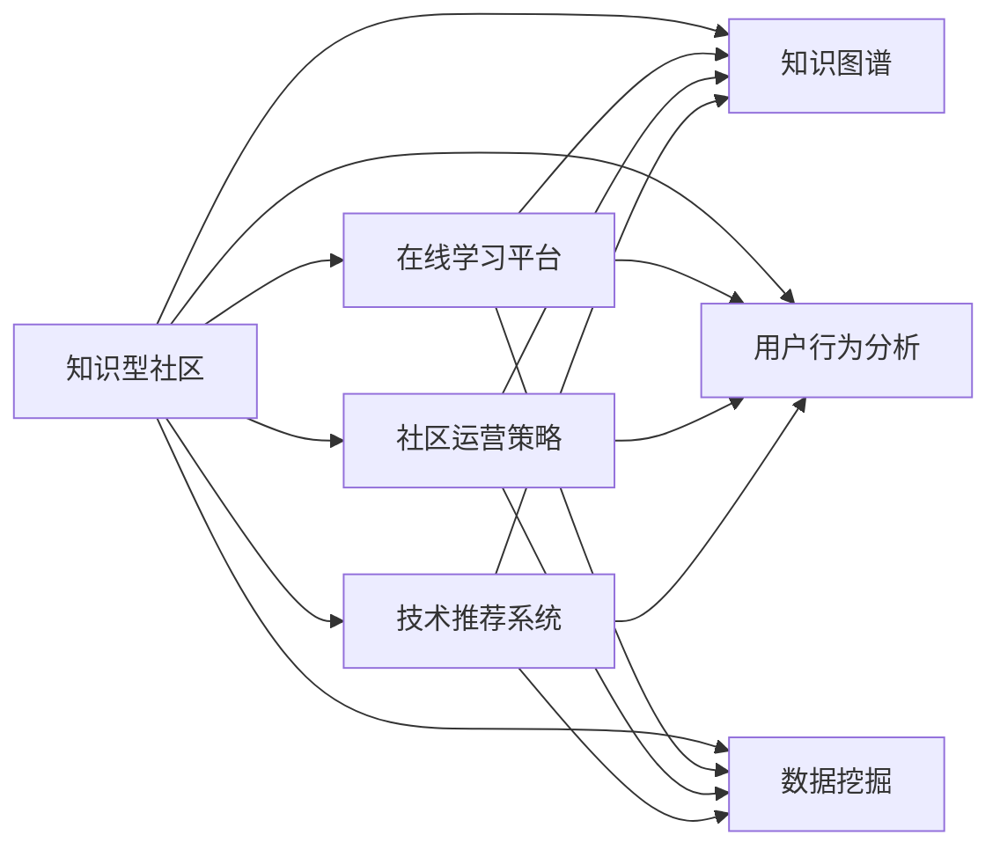

                 

# 知识型社区的营造与管理

> 关键词：知识型社区, 在线学习平台, 知识图谱, 用户行为分析, 数据挖掘, 社区运营策略, 技术推荐系统

## 1. 背景介绍

随着互联网的普及和技术的进步，知识型社区的兴起已成为在线教育的一个重要趋势。知识型社区以知识共享为核心目标，通过提供丰富的学习资源、互动交流平台和个性化推荐机制，吸引了大批学习者和专家，形成了活跃的学术生态。然而，知识型社区的运营和管理面临诸多挑战，如何构建高效、稳定、可持续的知识生态圈，成为当前社区建设者亟需解决的问题。

本博客旨在通过深入剖析知识型社区的核心概念、核心算法和具体操作步骤，探讨如何基于数据分析和算法优化，构建高效的知识型社区平台，实现知识共享的最大化，提升学习效率，满足不同用户的多样化学习需求。我们将从背景介绍入手，逐步深入核心算法原理与实践，并展望未来应用场景，为知识型社区的营造与管理提供可行的参考方案。

## 2. 核心概念与联系

### 2.1 核心概念概述

为理解知识型社区的营造与管理，首先需要明确几个核心概念：

- **知识型社区**：指以知识分享和交流为核心的在线平台，例如Coursera、edX、知乎等。社区内汇聚了大量的学习资源和专家知识，通过互动交流、协作学习等方式，促进知识的生成与传播。
- **在线学习平台**：指支持在线课程、互动讨论、作业提交等功能的教育技术平台，支持大规模、分布式、个性化学习。
- **知识图谱**：以知识元素为节点、知识关系为边的图形结构，用于刻画知识的语义关系和层次结构，支持知识推理和发现。
- **用户行为分析**：通过数据分析技术，挖掘用户的学习行为模式和需求，以优化学习体验和提升学习效果。
- **数据挖掘**：从大量数据中提取有价值的信息和知识，用于知识推荐、用户画像分析等。
- **社区运营策略**：基于用户行为和数据分析结果，制定合理的运营策略，提升社区活跃度和用户粘性。
- **技术推荐系统**：利用机器学习算法，为用户提供个性化的知识推荐，提升学习效率和满意度。

这些核心概念构成了知识型社区营造与管理的框架基础，各概念之间通过数据分析和算法技术紧密联系，相互影响。

### 2.2 核心概念的联系（Mermaid 流程图）



## 3. 核心算法原理 & 具体操作步骤

### 3.1 算法原理概述

知识型社区的运营与管理，本质上是基于数据的在线学习平台和知识生态系统的管理。通过分析用户行为数据，利用机器学习算法优化推荐系统、优化运营策略，最终提升知识共享和传播的效率。

核心算法包括：
- **知识图谱构建**：通过语义分析技术，从知识库和文本中抽取实体和关系，构建知识图谱。
- **用户画像建模**：基于用户行为数据，利用聚类、分类等算法，构建用户画像，了解用户的学习需求和偏好。
- **推荐系统优化**：利用协同过滤、内容推荐、混合推荐等算法，提升推荐系统的个性化和准确性。
- **运营策略制定**：基于用户行为数据和推荐结果，优化社区的激励机制、学习路径、内容更新策略等，提升社区活跃度。

### 3.2 算法步骤详解

#### 3.2.1 知识图谱构建

知识图谱的构建分为三个步骤：

1. **实体抽取**：从社区内的文章、课程、用户提问等文本中抽取实体，如人名、地点、机构等。
2. **关系抽取**：通过自然语言处理技术，抽取实体之间的关系，如作者-文章、课程-讲师、文章-引用等。
3. **知识融合**：将抽取的实体和关系整合为知识图谱，并利用图神经网络等技术，进行知识推理和关联。

#### 3.2.2 用户画像建模

用户画像建模的步骤如下：

1. **行为数据收集**：收集用户的学习行为数据，如课程浏览、提问、评论、笔记等。
2. **行为特征提取**：利用统计学和机器学习技术，提取用户行为的关键特征，如学习时长、活跃时间、兴趣领域等。
3. **聚类分析**：通过K-Means、层次聚类等算法，将用户分为不同的兴趣群体，以便制定针对性的运营策略。

#### 3.2.3 推荐系统优化

推荐系统的优化主要包含以下步骤：

1. **数据预处理**：将用户行为数据、课程内容数据等进行清洗和转换，构建特征矩阵。
2. **协同过滤**：通过用户-物品共现矩阵或物品-物品共现矩阵，寻找相似用户或相似课程，进行推荐。
3. **内容推荐**：根据课程内容特征，使用朴素贝叶斯、决策树等算法，推荐与用户兴趣相关的课程。
4. **混合推荐**：结合协同过滤和内容推荐，采用加权平均、拼接等技术，提升推荐系统的准确性和多样性。

#### 3.2.4 运营策略制定

运营策略的制定步骤如下：

1. **指标评估**：通过用户行为数据分析，评估社区的学习效果和活跃度，如课程完成率、讨论活跃度、用户留存率等。
2. **策略优化**：基于指标评估结果，优化社区的学习路径、奖励机制、内容更新策略等。
3. **效果监测**：实时监测优化效果，进行A/B测试，不断迭代和优化社区运营策略。

### 3.3 算法优缺点

知识型社区的运营与管理算法具有以下优点：

- **个性化推荐**：通过精准的推荐系统，提升用户的学习效率和满意度。
- **用户行为分析**：通过用户行为数据，了解用户需求，制定针对性的运营策略。
- **知识图谱应用**：利用知识图谱进行知识推理和关联，增强知识传播的深度和广度。

然而，这些算法也存在以下缺点：

- **数据隐私问题**：大量用户行为数据的收集和分析，可能侵犯用户隐私。
- **算法复杂性**：知识图谱构建和用户画像建模等算法，计算复杂度高，需要高性能硬件支持。
- **推荐系统偏差**：推荐系统容易受到数据偏差的影响，导致推荐结果不公平。
- **运营策略局限性**：单一的运营策略可能难以满足不同用户的多样化需求。

### 3.4 算法应用领域

这些核心算法广泛应用于知识型社区的多个领域：

- **课程推荐**：通过个性化推荐系统，推荐用户感兴趣的相关课程，提升学习效果。
- **内容更新**：基于用户反馈和行为数据，优化课程内容和更新策略，保持社区的知识活力。
- **用户互动**：通过数据分析，识别活跃用户和关键课程，制定互动激励策略，提升社区活跃度。
- **知识图谱应用**：利用知识图谱进行知识推理和关联，帮助用户发现新的知识点和研究领域。

## 4. 数学模型和公式 & 详细讲解 & 举例说明

### 4.1 数学模型构建

知识型社区的核心数学模型包括用户行为模型和推荐系统模型。用户行为模型用于描述用户的学习行为和兴趣偏好，推荐系统模型用于预测用户对课程的兴趣和评价。

用户行为模型可以表示为：

$$
\mathcal{U} = \{u_i\}_{i=1}^{N}, \quad \mathcal{V} = \{v_j\}_{j=1}^{M}
$$

其中 $u_i$ 表示用户 $i$，$v_j$ 表示课程 $j$。用户行为数据可以表示为：

$$
\mathcal{D} = \{(u_i,v_j,s_{ij})\}_{i=1}^{N}, \quad s_{ij} \in \{0,1\}
$$

其中 $s_{ij}=1$ 表示用户 $i$ 对课程 $j$ 产生了行为，$s_{ij}=0$ 表示未产生行为。

推荐系统模型可以表示为：

$$
\hat{y}_{ij} = f(u_i,v_j;\theta)
$$

其中 $y_{ij}$ 表示用户 $i$ 对课程 $j$ 的评分或兴趣度，$\theta$ 为模型参数。$f$ 为推荐函数，可以采用线性模型、逻辑回归、深度学习等方法。

### 4.2 公式推导过程

知识型社区的推荐系统模型，可以通过以下步骤进行推导：

1. **协同过滤**：假设用户-物品共现矩阵为 $\mathbf{X}$，物品-物品共现矩阵为 $\mathbf{Y}$。则协同过滤模型的目标函数可以表示为：

$$
\mathcal{L}(\mathbf{X},\mathbf{Y}) = \frac{1}{N}\sum_{i=1}^{N}\sum_{j=1}^{M}s_{ij}\log\hat{y}_{ij} + (1-s_{ij})\log(1-\hat{y}_{ij})
$$

其中 $\hat{y}_{ij}$ 为协同过滤模型的预测值，$s_{ij}$ 为实际行为。

2. **内容推荐**：假设课程内容特征矩阵为 $\mathbf{C}$，用户行为特征矩阵为 $\mathbf{U}$，则内容推荐模型的目标函数可以表示为：

$$
\mathcal{L}(\mathbf{C},\mathbf{U}) = \frac{1}{N}\sum_{i=1}^{N}\sum_{j=1}^{M}s_{ij}\log\hat{y}_{ij} + (1-s_{ij})\log(1-\hat{y}_{ij})
$$

其中 $\hat{y}_{ij}$ 为内容推荐模型的预测值，$s_{ij}$ 为实际行为。

3. **混合推荐**：通过加权平均和拼接等方法，可以构建混合推荐模型：

$$
\hat{y}_{ij} = \alpha \cdot f_{CF}(u_i,v_j;\theta_{CF}) + (1-\alpha) \cdot f_{C}(u_i,v_j;\theta_{C})
$$

其中 $f_{CF}$ 为协同过滤函数，$f_{C}$ 为内容推荐函数，$\alpha$ 为权重。

### 4.3 案例分析与讲解

以Coursera平台为例，说明知识型社区推荐系统的实际应用：

1. **用户画像建模**：Coursera通过收集用户的浏览记录、课程评价、学习进度等数据，利用聚类算法将用户分为不同的兴趣群体。例如，某一用户群体对计算机科学课程表现特别活跃，则平台可以为其推荐相关的进阶课程和技术博客。

2. **知识图谱应用**：Coursera利用知识图谱技术，将课程和作者的知识关系进行刻画。例如，某一用户对深度学习课程感兴趣，平台可以通过知识图谱推荐相关的论文和书籍，提升学习深度和广度。

3. **协同过滤推荐**：Coursera利用协同过滤算法，推荐与用户兴趣相近的其他用户和课程。例如，某一用户学习了机器学习课程，平台可以推荐学习相同课程的其他用户，促进交流和学习。

4. **内容推荐优化**：Coursera通过内容推荐算法，基于课程内容特征，推荐与用户兴趣相关的课程。例如，某一用户学习过Python基础课程，平台可以推荐进阶的Python开发课程和项目实战案例。

## 5. 项目实践：代码实例和详细解释说明

### 5.1 开发环境搭建

在知识型社区的营造与管理中，开发环境的选择和搭建至关重要。以下是Python环境下知识型社区开发环境的搭建步骤：

1. **安装Python和相关依赖**：安装Python 3.x版本，安装Pandas、NumPy、Scikit-learn等常用库。

2. **环境虚拟化**：创建虚拟环境，确保项目代码独立运行，避免版本冲突。

3. **数据准备**：收集社区内的用户行为数据、课程数据、知识图谱等，准备数据集。

4. **环境配置**：配置Python环境，如设置优化器、学习率、正则化参数等。

5. **模型训练**：使用推荐系统算法，如协同过滤、内容推荐等，训练推荐模型。

### 5.2 源代码详细实现

以下是一个简单的知识型社区推荐系统实现的示例代码：

```python
import pandas as pd
from sklearn.model_selection import train_test_split
from sklearn.metrics import mean_absolute_error

# 加载用户行为数据
data = pd.read_csv('user_behavior.csv')

# 数据预处理
# 填充缺失值，处理异常值等
...

# 构建特征矩阵
X = pd.get_dummies(data['course_id'], prefix='course')
X = pd.concat([X, data[['user_id', 'session_time']]], axis=1)

# 标签生成
y = data['completed']

# 分割数据集
X_train, X_test, y_train, y_test = train_test_split(X, y, test_size=0.2, random_state=42)

# 协同过滤推荐模型
from recommend import CFRecommender

recommender = CFRecommender(X_train, y_train)

# 训练模型
recommender.fit(X_train, y_train)

# 预测并评估
y_pred = recommender.predict(X_test)
mae = mean_absolute_error(y_test, y_pred)
print('MAE:', mae)
```

### 5.3 代码解读与分析

**数据准备**：
- 用户行为数据包含用户ID、课程ID、学习时长、完成情况等信息。
- 课程数据包含课程ID、课程名称、课程简介、讲师信息等。
- 知识图谱数据包含实体和关系，如课程-讲师、课程-课程、课程-知识点等。

**特征工程**：
- 使用Pandas库进行数据清洗、特征工程等预处理操作。
- 使用scikit-learn的train_test_split方法，将数据集分为训练集和测试集。
- 使用scikit-learn的mean_absolute_error方法，评估模型的预测精度。

**协同过滤模型实现**：
- 从推荐系统的库中导入CFRecommender类。
- 加载训练数据，构建特征矩阵X和标签y。
- 使用fit方法训练协同过滤推荐模型。
- 使用predict方法进行预测，并使用mean_absolute_error评估模型效果。

### 5.4 运行结果展示

运行上述代码，可以得到模型的MAE值，即平均绝对误差，用于评估模型的预测精度。通过不断调整模型参数和优化算法，可以得到更精确的推荐结果。

## 6. 实际应用场景

### 6.1 智能课程推荐

智能课程推荐是知识型社区的核心功能之一。基于推荐系统算法，平台可以为用户推荐个性化、多样化的课程，提升学习效率和满意度。例如，通过用户行为数据和协同过滤算法，推荐用户感兴趣的相关课程，并根据课程内容特征，进行内容推荐和混合推荐。

### 6.2 社区互动优化

社区互动是知识型社区的重要组成部分，通过数据分析，可以识别活跃用户和关键课程，制定互动激励策略，提升社区活跃度。例如，通过统计用户的评论、点赞、分享等行为，识别出活跃用户和关键课程，制定针对性的互动激励策略，如优惠券、证书等，提升用户参与度。

### 6.3 知识图谱应用

知识图谱在知识型社区中扮演重要角色，通过知识推理和关联，提升社区的知识传播深度和广度。例如，某一用户对某一领域感兴趣，平台可以通过知识图谱推荐相关的论文、书籍和课程，帮助用户深入学习该领域知识。

### 6.4 未来应用展望

随着知识型社区的不断发展，未来将出现更多智能应用：

- **智能学习路径规划**：基于用户的学习行为和知识图谱，智能推荐学习路径，提升学习效果。
- **学习效果评估**：通过机器学习算法，评估用户的学习效果，并提供个性化改进建议。
- **内容生成与推荐**：利用自然语言生成技术，生成社区内的学习资源和互动内容，提升社区的丰富度和活跃度。
- **知识发现与共享**：通过数据分析和知识图谱，挖掘知识社区中的潜在知识，促进知识的共享和传播。

## 7. 工具和资源推荐

### 7.1 学习资源推荐

1. **《推荐系统导论》**：一本系统介绍推荐系统理论和算法的经典书籍，适合初学者和进阶学习者。
2. **Coursera、edX等在线平台**：提供丰富的在线课程和推荐系统相关资料，适合实战练习。
3. **Kaggle**：一个数据科学竞赛平台，提供丰富的推荐系统竞赛数据集和开源代码，适合深入学习。

### 7.2 开发工具推荐

1. **Python**：主流的编程语言，适合推荐系统开发。
2. **Pandas**：数据处理库，适合数据分析和数据预处理。
3. **Scikit-learn**：机器学习库，适合推荐系统模型训练和评估。
4. **TensorFlow**：深度学习库，适合推荐系统的深度学习和优化。
5. **Jupyter Notebook**：数据科学和机器学习的交互式开发环境，适合实时调试和验证算法。

### 7.3 相关论文推荐

1. **《推荐系统》（Adams）**：介绍了推荐系统的各种算法和技术，适合全面了解推荐系统。
2. **《知识图谱构建与应用》（Liu）**：介绍了知识图谱的构建方法和应用场景，适合深入学习。
3. **《用户行为分析》（Koren）**：介绍了用户行为分析的方法和应用，适合数据驱动的运营策略制定。

## 8. 总结：未来发展趋势与挑战

### 8.1 研究成果总结

本文通过深入分析知识型社区的核心概念、核心算法和具体操作步骤，探讨了知识型社区的营造与管理策略。以下是对主要研究成果的总结：

1. **知识图谱构建**：通过语义分析技术，构建知识图谱，支持知识推理和关联。
2. **用户画像建模**：通过数据分析技术，构建用户画像，了解用户需求和偏好。
3. **推荐系统优化**：利用协同过滤、内容推荐、混合推荐等算法，提升推荐系统的个性化和准确性。
4. **运营策略制定**：基于用户行为数据和推荐结果，优化社区运营策略，提升社区活跃度。

### 8.2 未来发展趋势

未来的知识型社区将呈现以下发展趋势：

1. **智能化程度提升**：通过深度学习和大数据分析技术，推荐系统将更加智能和精准，提升用户体验。
2. **多模态数据融合**：结合图像、语音、视频等多模态数据，构建更全面的用户画像和推荐模型。
3. **个性化学习路径**：基于用户的学习行为和知识图谱，智能推荐学习路径，提升学习效果。
4. **知识发现与共享**：通过数据分析和知识图谱，挖掘知识社区中的潜在知识，促进知识的共享和传播。

### 8.3 面临的挑战

尽管知识型社区的发展前景广阔，但仍面临以下挑战：

1. **数据隐私问题**：大量用户行为数据的收集和分析，可能侵犯用户隐私，需要制定严格的数据保护措施。
2. **算法复杂性**：知识图谱构建和用户画像建模等算法，计算复杂度高，需要高性能硬件支持。
3. **推荐系统偏差**：推荐系统容易受到数据偏差的影响，导致推荐结果不公平，需要进一步优化和校准。
4. **运营策略局限性**：单一的运营策略可能难以满足不同用户的多样化需求，需要不断迭代和优化。

### 8.4 研究展望

未来的研究需要在以下几个方向进行突破：

1. **数据隐私保护**：研究更加高效、安全的数据隐私保护技术，确保用户数据的安全和隐私。
2. **多模态数据融合**：研究多模态数据融合技术，提升推荐系统的综合性能。
3. **个性化推荐**：研究更加精准和多样化的个性化推荐算法，提升用户满意度。
4. **社区运营策略**：研究更加灵活和动态的社区运营策略，提升社区活跃度和用户粘性。

## 9. 附录：常见问题与解答

**Q1：知识型社区与传统教育有何区别？**

A: 知识型社区以知识共享和互动为核心，通过在线平台和推荐系统，将全球优质教育资源聚集在一起，支持大规模、分布式、个性化学习。传统教育则主要依赖面对面的教学和互动，受时间和空间限制较大，难以实现大规模、个性化教育。

**Q2：如何构建高效的知识型社区？**

A: 构建高效的知识型社区需要以下关键步骤：
1. 收集高质量的教育资源，如课程、论文、视频等。
2. 构建知识图谱，刻画知识之间的语义关系和层次结构。
3. 设计合理的推荐算法，提升推荐系统的个性化和准确性。
4. 制定科学的运营策略，提升社区活跃度和用户粘性。

**Q3：知识型社区的未来发展方向有哪些？**

A: 知识型社区的未来发展方向包括：
1. 智能化推荐系统：通过深度学习和多模态数据融合，提升推荐系统的精准度和多样性。
2. 个性化学习路径：基于用户的学习行为和知识图谱，智能推荐学习路径，提升学习效果。
3. 知识发现与共享：通过数据分析和知识图谱，挖掘社区中的潜在知识，促进知识的共享和传播。
4. 社交化互动：构建社区内的社交网络，促进用户之间的互动和交流，提升学习体验。

---

作者：禅与计算机程序设计艺术 / Zen and the Art of Computer Programming

