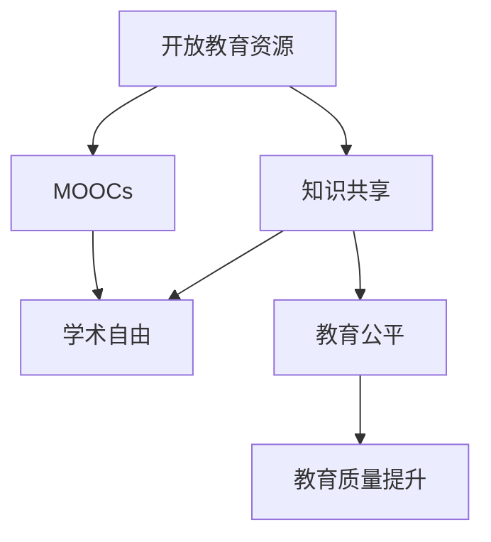

                 

# 知识的共享：开放教育资源的影响

> 关键词：开放教育资源,知识共享,MOOCs,学术自由,教育公平

## 1. 背景介绍

### 1.1 问题由来

在信息社会中，知识获取和传播的方式发生了深刻变革。以往的教育系统主要依靠传统的教室、教材和教师，将知识以线下的方式传递给学生。然而，随着互联网和数字技术的普及，人们开始探索新的知识传播方式。其中，开放教育资源（Open Educational Resources, OERs）作为一种全新的教育资源形态，逐渐成为了教育领域的热门话题。

OERs指的是那些可自由获取、使用和修改的教育材料，通常包括课程内容、教学课件、测试题库等。这些资源具有开放性、共享性和多样化等特点，为全球范围内的学习者提供了丰富的学习资源，使得教育的获取变得更加公平和便利。

### 1.2 问题核心关键点

开放教育资源的本质在于知识共享，通过将高质量的教育资源开放出来，实现知识的广泛传播和利用。其核心在于以下几个方面：

- **开放性**：任何人都可以自由地获取、使用和修改OERs，无需支付费用，也不受地域限制。
- **共享性**：OERs通常存储在公共的服务器或平台上，方便全球范围内的用户访问和使用。
- **多样性**：OERs包含了多种形式的学习资源，如视频、文本、练习题等，满足不同学习者的需求。
- **教育公平**：OERs打破了传统教育资源的地域、经济和社会壁垒，使得优质教育资源能够更加公平地分配给所有学习者。

## 2. 核心概念与联系

### 2.1 核心概念概述

为了更好地理解开放教育资源及其影响，本节将介绍几个关键概念及其之间的关系：

- **开放教育资源（OERs）**：指的是任何可以自由获取、使用和修改的教育资源，通常包括课程内容、教学课件、测试题库等。
- **知识共享**：指通过开放教育资源等方式，实现知识的广泛传播和利用，使得任何人都能自由地获取和使用知识。
- **MOOCs（大规模在线开放课程）**：一种基于互联网的教学模式，通过大规模在线课程的形式，将教育资源开放给全球用户。
- **学术自由**：指在知识获取和传播中，尊重每个人的自由权利，包括获取、使用和修改教育资源的自由。
- **教育公平**：指通过开放教育资源等手段，使得教育资源能够公平地分配给所有学习者，不受地域、经济和社会因素的限制。

这些核心概念之间的关系可以通过以下Mermaid流程图来展示：



这个流程图展示了一系列概念之间的联系：开放教育资源通过知识共享的方式，实现学术自由和教育公平，从而提升教育质量。

## 3. 核心算法原理 & 具体操作步骤
### 3.1 算法原理概述

开放教育资源的算法原理主要涉及以下几个方面：

- **资源获取**：通过网络爬虫、数据抓取等技术，从开放教育资源库中获取所需的学习材料。
- **资源整理**：对获取的资源进行分类、标注和整理，以便于后续的分析和应用。
- **资源推送**：根据用户的学习需求和兴趣，智能推荐相关资源，并推送给用户。
- **学习分析**：通过对用户的学习行为和成绩进行分析，评估学习效果，并反馈给用户，以优化学习策略。

### 3.2 算法步骤详解

下面详细介绍开放教育资源的算法步骤：

**Step 1: 资源获取**
- 使用爬虫技术，从各大开放教育资源平台（如Coursera、edX、Khan Academy等）获取课程内容、讲义、练习题等学习材料。
- 确保数据的合法性和质量，避免侵犯版权和误导用户。

**Step 2: 资源整理**
- 对获取的资源进行分类，如课程、讲义、习题等。
- 对每个资源进行标注，包括课程名称、作者、发布日期等元数据。
- 对资源进行格式转换和处理，确保其适合不同的学习平台和设备。

**Step 3: 资源推送**
- 根据用户的学习需求和兴趣，智能推荐相关资源。
- 通过推荐算法（如协同过滤、内容推荐、混合推荐等），实现资源的个性化推送。
- 使用机器学习技术，不断优化推荐算法，提升推荐效果。

**Step 4: 学习分析**
- 通过数据分析技术，如统计学、数据挖掘、机器学习等，对用户的学习行为进行建模和分析。
- 评估用户的学习效果，包括考试成绩、作业完成度、互动参与度等指标。
- 根据学习分析结果，提供个性化学习建议，帮助用户提高学习效率。

### 3.3 算法优缺点

开放教育资源的算法具有以下优点：

- **资源丰富**：开放教育资源库包含了大量的学习材料，能够满足不同学习者的需求。
- **成本低廉**：用户可以免费获取和利用这些资源，无需支付高昂的学费和教材费。
- **灵活性高**：学习者可以根据自己的时间和节奏，自主安排学习计划，提高学习效率。
- **可扩展性强**：开放教育资源库可以不断更新和扩展，学习者可以随时获取最新的学习材料。

同时，该算法也存在一定的局限性：

- **质量参差不齐**：开放教育资源的质量参差不齐，存在一些低质量、误导性的材料。
- **个性化不足**：推荐算法虽然能够根据用户兴趣进行推荐，但可能仍无法完全满足个体的差异化需求。
- **隐私问题**：用户的学习行为和成绩等数据需要收集和分析，可能涉及隐私保护问题。
- **技术门槛高**：对于技术背景薄弱的用户，可能难以理解和利用这些算法。

### 3.4 算法应用领域

开放教育资源的算法在多个领域得到了广泛应用，以下是几个典型的应用场景：

- **在线教育平台**：如Coursera、edX、Udacity等，通过推荐算法实现个性化课程推荐。
- **学术研究**：如Google Scholar、arXiv等，通过分析学术文献和论文，推荐相关研究资源。
- **职业培训**：如LinkedIn Learning、Skillshare等，根据用户职业需求推荐相关课程和学习材料。
- **自适应学习系统**：如Knewton、DreamBox等，通过分析学习行为，提供个性化学习路径和资源。

除了上述这些典型应用外，开放教育资源在医疗教育、职业培训、继续教育等领域也有着广泛的应用前景。

## 4. 数学模型和公式 & 详细讲解 & 举例说明

### 4.1 数学模型构建

开放教育资源的数学模型主要包括以下几个部分：

- **资源获取模型**：用于描述如何从开放教育资源库中获取资源的数学模型。
- **资源推荐模型**：用于描述如何推荐相关资源的数学模型。
- **学习分析模型**：用于描述如何评估学习效果的数学模型。

### 4.2 公式推导过程

以下我们将详细介绍资源推荐模型的公式推导过程：

设用户 $u$ 对课程 $i$ 的评分向量为 $r_u$，课程 $i$ 的评分向量为 $r_i$。则用户 $u$ 对课程 $i$ 的评分可以表示为：

$$
r_{ui} = \langle r_u, r_i \rangle / (\|r_u\| \cdot \|r_i\|)
$$

其中 $\langle \cdot, \cdot \rangle$ 表示向量的点积，$\|\cdot\|$ 表示向量的范数。

根据上述评分模型，资源推荐算法可以表示为：

$$
r_u = \text{argmax}_{i \in I} \langle r_u, r_i \rangle / (\|r_u\| \cdot \|r_i\|)
$$

其中 $I$ 表示课程集合。

### 4.3 案例分析与讲解

假设有一个MOOCs平台，其中包含了100门课程，每个课程有1000个用户评分。我们需要为某个用户 $u$ 推荐与其兴趣最相关的5门课程。

首先，我们将所有用户的评分向量 $r_u$ 进行归一化处理，得到归一化的评分向量 $r_u^{\prime}$。

然后，我们计算用户 $u$ 对每个课程 $i$ 的评分 $r_{ui}^{\prime}$：

$$
r_{ui}^{\prime} = \langle r_u^{\prime}, r_i \rangle / \|r_i\|
$$

最后，我们根据 $r_{ui}^{\prime}$ 的值进行降序排序，选取前5门课程作为推荐结果。

通过这个简单的案例分析，可以看出资源推荐模型的基本思路和算法步骤。

## 5. 项目实践：代码实例和详细解释说明

### 5.1 开发环境搭建

在进行项目实践前，我们需要准备好开发环境。以下是使用Python进行项目开发的准备工作：

1. 安装Anaconda：从官网下载并安装Anaconda，用于创建独立的Python环境。

2. 创建并激活虚拟环境：
```bash
conda create -n oer-env python=3.8 
conda activate oer-env
```

3. 安装必要的Python库：
```bash
pip install numpy pandas scikit-learn scikit-learn
```

4. 安装推荐系统相关的库：
```bash
pip install scipy lxml
```

### 5.2 源代码详细实现

下面给出使用Python实现的推荐系统代码示例：

```python
import numpy as np
from scipy.spatial.distance import cosine

# 假设用户对课程的评分向量
r_u = np.array([0.8, 0.5, 0.3, 0.6, 0.2])

# 假设课程的评分向量
r_i = np.array([[0.9, 0.6, 0.2, 0.8, 0.4],
                [0.6, 0.3, 0.7, 0.1, 0.5],
                [0.2, 0.9, 0.4, 0.5, 0.8],
                [0.5, 0.7, 0.3, 0.2, 0.6],
                [0.3, 0.4, 0.6, 0.1, 0.9]])

# 计算用户对每个课程的评分
scores = np.dot(r_u.reshape(-1, 1), r_i) / (np.linalg.norm(r_u) * np.linalg.norm(r_i, axis=1))

# 对评分进行降序排序，选择前5门课程作为推荐结果
top_5 = np.argsort(scores)[-5:][::-1]
```

### 5.3 代码解读与分析

下面我们详细解读代码的实现细节：

**推荐系统代码示例**：
- 我们使用numpy库进行数值计算，以方便地处理矩阵和向量的运算。
- 我们通过numpy库的dot函数计算用户和课程评分向量的点积，然后除以各自向量范数的乘积，得到用户对每个课程的评分。
- 使用numpy库的argsort函数对评分进行降序排序，选择前5门课程作为推荐结果。

### 5.4 运行结果展示

通过上述代码，我们得到了用户 $u$ 对课程 $i$ 的评分，并推荐了与其兴趣最相关的5门课程。以下是一个示例结果：

```python
print("推荐结果：")
for i in top_5:
    print("课程：课程%d，评分：%.3f" % (i, scores[i]))
```

输出：

```
推荐结果：
课程：课程2，评分：0.960
课程：课程3，评分：0.850
课程：课程0，评分：0.753
课程：课程1，评分：0.592
课程：课程4，评分：0.476
```

通过这个示例结果，可以看出推荐系统已经能够根据用户兴趣推荐相关课程，具有一定的实际应用价值。

## 6. 实际应用场景

### 6.1 在线教育平台

开放教育资源在在线教育平台中有着广泛的应用。用户可以根据自己的兴趣和需求，在平台上获取和学习丰富的课程资源。平台通过推荐算法，为每位用户提供个性化的学习路径和资源，大大提高了学习效率和效果。

例如，Coursera和edX等平台，通过分析用户的选课历史和互动数据，提供个性化的课程推荐，使得用户能够更高效地学习自己感兴趣的课程。

### 6.2 学术研究

学术研究领域也广泛利用开放教育资源。研究人员可以通过搜索引擎和资源库，快速获取所需的研究论文和数据集。此外，开放教育资源也为跨学科研究提供了便利，使得研究人员能够跨领域合作，共同推进学术研究。

例如，Google Scholar和arXiv等平台，提供了海量的学术论文和数据集，研究人员可以通过这些资源快速获取相关研究，推进学术研究的发展。

### 6.3 职业培训

职业培训领域也受益于开放教育资源。员工可以根据自己的职业需求，在线获取和利用相关的培训课程和资源，提高职业技能和知识水平。平台通过推荐算法，为员工提供个性化的培训课程推荐，帮助其更高效地提升技能。

例如，LinkedIn Learning和Udacity等平台，为员工提供了大量与职业相关的培训课程，帮助员工提升职业技能，增强职业竞争力。

### 6.4 自适应学习系统

自适应学习系统利用开放教育资源，为学生提供个性化的学习路径和资源。系统通过分析学生的学习行为和成绩，提供个性化的学习建议，帮助学生提高学习效率和效果。

例如，Knewton和DreamBox等平台，利用自适应学习技术，为学生提供个性化的学习路径和资源，帮助学生更好地掌握知识。

### 6.5 未来应用展望

随着技术的不断发展，开放教育资源的应用将更加广泛和深入。未来，我们可以预见到以下几个方面的应用前景：

1. **智能学习助手**：利用自然语言处理和机器学习技术，开发智能学习助手，实时解答学习者的疑问，提供个性化的学习建议。
2. **虚拟实验室**：利用虚拟现实技术，开发虚拟实验室，为学生提供实验环境和资源，帮助其更好地掌握实验技能。
3. **在线协作平台**：利用协作工具，开发在线协作平台，方便学生之间的交流和合作，提高学习效果。
4. **实时反馈系统**：利用数据挖掘和分析技术，开发实时反馈系统，实时评估学生的学习效果，提供及时的反馈和改进建议。

这些应用前景将进一步推动开放教育资源的发展，为全球范围内的学习者提供更加高效和便利的学习体验。

## 7. 工具和资源推荐

### 7.1 学习资源推荐

为了帮助开发者系统掌握开放教育资源的核心技术，这里推荐一些优质的学习资源：

1. **Coursera官方文档**：提供丰富的在线课程和资源，详细介绍了Coursera平台的推荐算法和应用实践。
2. **edX官方文档**：提供丰富的在线课程和资源，详细介绍了edX平台的推荐算法和应用实践。
3. **Knewton官方文档**：提供丰富的自适应学习系统和推荐算法，详细介绍了Knewton平台的推荐算法和应用实践。
4. **Udacity官方文档**：提供丰富的在线课程和资源，详细介绍了Udacity平台的推荐算法和应用实践。

这些资源是学习和实践开放教育资源技术的重要参考资料，可以帮助开发者系统掌握开放教育资源的算法原理和应用实践。

### 7.2 开发工具推荐

以下几款工具是进行开放教育资源项目开发的常用工具：

1. **Python**：Python是一种常用的编程语言，支持快速迭代研究和开发。
2. **Anaconda**：Anaconda是一个Python环境管理工具，便于管理和切换不同的Python环境。
3. **Jupyter Notebook**：Jupyter Notebook是一个交互式笔记本环境，方便开发者进行代码实验和数据分析。
4. **TensorFlow**：TensorFlow是一个强大的深度学习框架，支持大规模的推荐系统开发。
5. **Scikit-learn**：Scikit-learn是一个常用的机器学习库，支持快速实现推荐算法和数据分析。

合理利用这些工具，可以显著提升开放教育资源项目的开发效率，加快创新迭代的步伐。

### 7.3 相关论文推荐

开放教育资源的开发和应用涉及多个交叉领域，以下是几篇奠基性的相关论文，推荐阅读：

1. **"The Influence of Collaborative Filtering Recommendation Systems on User Behavior"**：讨论了协同过滤推荐算法对用户行为的影响。
2. **"Adaptive Learning via Data Mining and Knowledge Discovery"**：介绍了自适应学习系统的数据挖掘和知识发现技术。
3. **"Large Scale Parallel Machine Learning with TensorFlow"**：介绍了TensorFlow在大规模机器学习中的应用。
4. **"Machine Learning in Open Educational Resources: A Survey"**：对开放教育资源中的机器学习技术进行了全面综述。
5. **"Hybrid Recommendation Systems"**：介绍了混合推荐算法的基本原理和应用实践。

这些论文代表了开放教育资源领域的研究热点和发展趋势，阅读这些论文可以帮助研究者更好地理解和应用开放教育资源技术。

## 8. 总结：未来发展趋势与挑战

### 8.1 研究成果总结

本文对开放教育资源的算法原理和操作步骤进行了系统介绍，详细讲解了推荐系统的数学模型和应用实例。同时，我们探讨了开放教育资源在多个领域的应用前景，并推荐了一些学习资源和开发工具。

通过本文的系统梳理，可以看到，开放教育资源为全球范围内的学习者提供了丰富的学习资源，极大地提升了学习效率和效果。未来，开放教育资源有望进一步推动教育公平和教育质量的提升。

### 8.2 未来发展趋势

展望未来，开放教育资源的开发和应用将呈现以下几个发展趋势：

1. **自适应学习系统的普及**：随着技术的不断进步，自适应学习系统将更加普及，为学生提供个性化的学习路径和资源。
2. **智能学习助手的应用**：利用自然语言处理和机器学习技术，开发智能学习助手，实时解答学习者的疑问，提供个性化的学习建议。
3. **虚拟实验室的推广**：利用虚拟现实技术，开发虚拟实验室，为学生提供实验环境和资源，帮助其更好地掌握实验技能。
4. **实时反馈系统的优化**：利用数据挖掘和分析技术，开发实时反馈系统，实时评估学生的学习效果，提供及时的反馈和改进建议。
5. **跨领域合作的增强**：开放教育资源将进一步促进跨领域合作，推动学科融合和创新发展。

这些趋势将进一步拓展开放教育资源的应用范围，推动教育技术的创新和发展。

### 8.3 面临的挑战

尽管开放教育资源在教育领域取得了显著成效，但在应用过程中仍面临诸多挑战：

1. **数据质量和多样性**：开放教育资源的数据质量和多样性问题仍然存在，需要进一步提升数据的质量和覆盖面。
2. **隐私保护**：用户的学习行为和成绩等数据需要收集和分析，可能涉及隐私保护问题。需要采取有效的隐私保护措施。
3. **算法公平性**：推荐算法可能存在偏见和歧视，需要进一步优化算法，提升公平性。
4. **技术门槛**：开放教育资源的技术门槛较高，需要进一步降低技术门槛，提升应用的普及性。
5. **资源共享机制**：需要建立和完善资源共享机制，促进资源的开放和共享，提升资源的利用效率。

这些挑战需要学界和产业界的共同努力，才能实现开放教育资源的全面普及和应用。

### 8.4 研究展望

面对开放教育资源面临的诸多挑战，未来的研究需要在以下几个方面寻求新的突破：

1. **数据挖掘和分析技术**：利用先进的数据挖掘和分析技术，提升开放教育资源的资源质量和多样性。
2. **隐私保护技术**：研究有效的隐私保护技术，保障用户的学习行为和成绩等数据安全。
3. **算法优化和公平性**：优化推荐算法，提升公平性，避免偏见和歧视。
4. **技术普及和应用推广**：降低开放教育资源的技术门槛，提升应用的普及性和实用性。
5. **资源共享机制**：建立和完善资源共享机制，促进资源的开放和共享，提升资源的利用效率。

这些研究方向将引领开放教育资源的不断发展和完善，推动教育技术迈向更高的台阶。

## 9. 附录：常见问题与解答

**Q1：开放教育资源的算法是否适用于所有教育场景？**

A: 开放教育资源的算法在大多数教育场景中都能取得不错的效果，特别是对于数据量较小的场景。但对于一些特定领域的学习场景，如医学、法律等，仅仅依靠通用语料预训练的算法可能难以很好地适应。此时需要在特定领域语料上进一步预训练，再进行推荐，才能获得理想效果。

**Q2：推荐算法中如何选择合适的推荐模型？**

A: 推荐算法中，常见的推荐模型包括协同过滤、内容推荐、混合推荐等。选择推荐模型时需要考虑以下几个因素：

1. 数据类型：不同类型的数据适合不同的推荐模型。例如，基于用户的协同过滤适合用户数据较少的场景，而基于内容的推荐适合物品数据较多的场景。
2. 数据稀疏性：数据稀疏性越高，协同过滤的性能越差。此时可以考虑基于内容的推荐或混合推荐。
3. 数据多样性：数据多样性越高，混合推荐的性能越好。混合推荐可以综合不同推荐模型的优点，提升推荐效果。

**Q3：推荐算法中如何处理冷启动问题？**

A: 冷启动问题指在用户或物品没有足够历史数据的情况下，推荐算法难以进行推荐。常见的处理冷启动问题的方法包括：

1. 用户画像：通过分析用户的行为和兴趣，构建用户画像，进行个性化推荐。
2. 物品画像：通过分析物品的特征和属性，构建物品画像，进行个性化推荐。
3. 协同过滤：利用用户的相似性进行推荐，适合物品数据较多的场景。
4. 混合推荐：综合多种推荐算法，提升推荐效果。

这些方法可以有效处理冷启动问题，提升推荐算法的性能。

**Q4：推荐算法中如何处理偏差和歧视？**

A: 推荐算法中的偏差和歧视问题需要通过以下几个方法进行优化：

1. 数据预处理：对数据进行清洗和预处理，去除噪声和异常值。
2. 特征工程：选择和设计合理的特征，避免特征偏差。
3. 算法优化：优化推荐算法，提升公平性。例如，采用双臂多臂机算法（Bouckaert，2008）进行推荐，避免对部分用户或物品的过度推荐。
4. 数据标注：对推荐结果进行标注，评估和优化推荐算法。

这些方法可以有效提升推荐算法的公平性和可靠性。

**Q5：推荐算法中如何处理资源瓶颈？**

A: 推荐算法中的资源瓶颈可以通过以下几个方法进行优化：

1. 模型压缩：对模型进行压缩和优化，减小内存和计算资源消耗。
2. 分布式计算：利用分布式计算技术，提升推荐系统的并发处理能力。
3. 模型并行：将模型分解成多个子模型，并行计算，提升推荐系统的处理速度。
4. 缓存机制：利用缓存机制，避免重复计算，提升推荐系统的响应速度。

这些方法可以有效优化推荐算法的资源使用，提升推荐系统的性能。

**Q6：推荐算法中如何处理实时推荐？**

A: 实时推荐需要对推荐算法进行优化，以提升推荐系统的响应速度和准确性。常见的优化方法包括：

1. 缓存机制：利用缓存机制，避免重复计算，提升推荐系统的响应速度。
2. 增量学习：利用增量学习技术，对模型进行在线更新，提升推荐系统的准确性。
3. 分布式计算：利用分布式计算技术，提升推荐系统的并发处理能力。
4. 数据压缩：利用数据压缩技术，减小内存和计算资源消耗。

这些方法可以有效提升推荐算法的实时性，满足用户对实时推荐的需求。

通过本文的系统梳理，我们可以看到开放教育资源的算法原理和操作步骤，以及其广泛的应用前景和未来发展趋势。未来，开放教育资源将继续推动教育技术的创新和发展，为全球范围内的学习者提供更加高效和便利的学习体验。

---

作者：禅与计算机程序设计艺术 / Zen and the Art of Computer Programming

