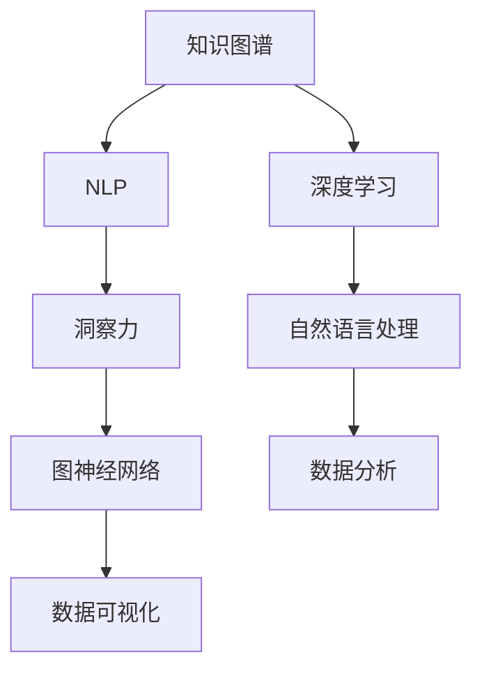

                 

# 知识的创新机制：洞察力的独特贡献

> 关键词：知识图谱, 洞察力, 深度学习, 自然语言处理, 图神经网络, 数据驱动决策

## 1. 背景介绍

### 1.1 问题由来

在信息爆炸的今天，知识管理已成为了企业和组织的核心竞争力和决策关键。从早期的纸质文档管理到如今的大数据与人工智能时代，知识管理的方式不断演进，但知识利用效率和创新能力始终是研究的焦点。如何从海量数据中提炼出价值，如何激发团队的创造力，如何更好地运用知识来驱动决策，这些是业界亟待解决的痛点。

### 1.2 问题核心关键点

洞察力在知识创新中扮演着至关重要的角色。与传统的数据分析相比，洞察力不仅能够揭示数据背后的规律，还能预测未来趋势，指导行动策略，从而驱动商业决策。在商业环境中，洞察力被视为提升竞争力的关键。因此，如何构建和提升洞察力成为了当前研究的热点问题。

### 1.3 问题研究意义

本论文旨在通过深入分析知识的创新机制，特别是洞察力的贡献，为知识管理与决策支持系统的构建提供新的视角和方法。通过深入探讨深度学习、自然语言处理（NLP）、图神经网络（GNN）等技术如何协同作用，以期构建出高效的知识创新框架，从而在实际应用中实现数据驱动的商业决策。

## 2. 核心概念与联系

### 2.1 核心概念概述

为了更好地理解知识创新和洞察力的独特贡献，本节将介绍几个关键概念及其之间的联系：

- **知识图谱(Knowledge Graph)**：一种结构化的知识表示形式，通过节点和边的关系，构建知识网络。知识图谱能够捕捉实体之间的关联，是洞察力发现的重要基础。
- **洞察力(Insight)**：从复杂数据中提取关键信息、趋势和关联的过程。洞察力通常通过分析、推理和预测等方式实现。
- **深度学习(Deep Learning)**：一种机器学习技术，通过多层神经网络对数据进行自动特征提取和模式识别。深度学习在自然语言处理、图像识别等领域应用广泛。
- **自然语言处理(NLP)**：研究计算机如何理解、处理和生成自然语言的技术。NLP是构建知识图谱和洞察力的重要工具。
- **图神经网络(GNN)**：一种神经网络，专门设计用于处理图数据。GNN可以捕捉节点之间的关系，支持复杂的图结构分析。

这些概念通过合成的研究范式，共同构成了知识创新和洞察力的知识图谱。通过理解这些核心概念，我们可以更好地把握知识创新的原理和关键点。

### 2.2 核心概念原理和架构的 Mermaid 流程图(Mermaid 流程节点中不要有括号、逗号等特殊字符)



此图展示了核心概念之间的逻辑关系：知识图谱通过深度学习和NLP技术，捕捉和表示知识，洞察力通过对知识图谱的分析推理，预测未来趋势，并最终通过图神经网络和数据可视化技术，提供决策支持。

## 3. 核心算法原理 & 具体操作步骤

### 3.1 算法原理概述

洞察力是知识创新机制的核心，通过对知识图谱的分析，洞察力能够揭示数据背后的规律，预测未来趋势，指导行动策略。为了构建和提升洞察力，我们需要对现有的数据和知识图谱进行深入的分析，并使用深度学习、NLP和GNN等技术，进行数据驱动的决策支持。

### 3.2 算法步骤详解

构建和提升洞察力的主要步骤如下：

1. **数据准备**：收集和整合相关领域的数据，构建统一的知识图谱。
2. **特征工程**：使用NLP技术对文本数据进行清洗和处理，使用深度学习技术提取数据特征。
3. **图神经网络建模**：在知识图谱的基础上，使用GNN进行图结构分析，捕捉节点之间的关系。
4. **洞察力生成**：通过对图神经网络模型的输出进行分析和推理，生成洞察力报告。
5. **决策支持**：将洞察力报告与业务决策结合，提供数据驱动的策略建议。

### 3.3 算法优缺点

洞察力的构建和提升，有着显著的优点和局限性：

**优点：**
- **高效性**：通过深度学习和GNN等先进技术，洞察力能够高效地从海量数据中提炼关键信息。
- **泛化能力**：洞察力能够泛化到不同的业务场景和问题，提升决策的准确性和一致性。
- **实时性**：使用图神经网络进行实时分析，洞察力能够快速响应变化，提供即时的决策支持。

**局限性：**
- **依赖高质量数据**：洞察力的准确性高度依赖于数据的质量和完整性，数据偏差可能导致洞察力错误。
- **复杂度**：深度学习、GNN等技术的复杂性较高，需要较高的技术门槛和计算资源。
- **解释性**：洞察力通常是黑盒模型，缺乏可解释性，难以理解和调试。

### 3.4 算法应用领域

洞察力在多个领域有广泛的应用前景，包括但不限于：

- **商业决策支持**：洞察力能够为企业的市场分析、产品开发和运营管理提供决策支持。
- **金融风险管理**：洞察力能够帮助银行和保险公司识别和预测风险，制定风险管理策略。
- **医疗健康**：洞察力能够为医院和诊所提供诊断支持，优化医疗流程。
- **公共安全**：洞察力能够辅助政府部门分析犯罪趋势，优化警务策略。

## 4. 数学模型和公式 & 详细讲解 & 举例说明

### 4.1 数学模型构建

构建洞察力的数学模型主要分为三个步骤：

1. **数据表示**：使用向量或图等形式表示数据。
2. **特征提取**：使用NLP技术提取文本数据的特征。
3. **洞察力生成**：使用GNN模型捕捉节点之间的关系，并生成洞察力报告。

### 4.2 公式推导过程

以GNN模型为例，推导洞察力的生成过程：

1. **节点表示**：每个节点用一个向量表示，形式为：$$\mathbf{x}_i = \{x_{i1}, x_{i2}, ..., x_{in}\}$$。
2. **边关系**：节点之间的边关系表示为邻接矩阵 $$\mathbf{A}$$，形式为：$$\mathbf{A}_{ij} = \begin{cases} 1, & \text{如果节点i和j相邻} \\ 0, & \text{如果节点i和j不相连} \end{cases}$$。
3. **消息传递**：在GNN中，每个节点通过接收邻居节点的信息来更新自己的表示。消息传递过程可以表示为：$$\mathbf{x}_i^{(k+1)} = \sigma(\sum_{j=1}^N \mathbf{A}_{ij} \cdot \mathbf{W} \cdot \mathbf{x}_j^{(k)})$$，其中 $$\sigma$$ 为激活函数，$$\mathbf{W}$$ 为权重矩阵。
4. **聚合**：将邻居节点的信息聚合到当前节点，生成新的表示。聚合过程可以表示为：$$\mathbf{x}_i^{(k+1)} = \sigma(\sum_{j=1}^N \mathbf{A}_{ij} \cdot \mathbf{W} \cdot \mathbf{x}_j^{(k)})$$。
5. **洞察力生成**：通过GNN模型的多次迭代，生成最终洞察力报告，形式为：$$\mathbf{z} = f(\mathbf{x}^{(L)})$$，其中 $$L$$ 为迭代次数。

### 4.3 案例分析与讲解

以商业决策支持为例，说明洞察力的生成和应用过程：

1. **数据准备**：收集市场数据、销售数据和用户反馈数据，构建知识图谱。
2. **特征工程**：使用NLP技术对文本数据进行清洗和处理，使用深度学习技术提取数据特征。
3. **图神经网络建模**：在知识图谱的基础上，使用GNN进行图结构分析，捕捉节点之间的关系。
4. **洞察力生成**：通过GNN模型的多次迭代，生成洞察力报告，如市场趋势、用户偏好和产品推荐。
5. **决策支持**：将洞察力报告与业务决策结合，提供数据驱动的策略建议，如调整营销策略、优化产品设计等。

## 5. 项目实践：代码实例和详细解释说明

### 5.1 开发环境搭建

在进行洞察力分析实践前，我们需要准备好开发环境。以下是使用Python进行PyTorch开发的环境配置流程：

1. 安装Anaconda：从官网下载并安装Anaconda，用于创建独立的Python环境。

2. 创建并激活虚拟环境：
```bash
conda create -n pytorch-env python=3.8 
conda activate pytorch-env
```

3. 安装PyTorch：根据CUDA版本，从官网获取对应的安装命令。例如：
```bash
conda install pytorch torchvision torchaudio cudatoolkit=11.1 -c pytorch -c conda-forge
```

4. 安装Transformers库：
```bash
pip install transformers
```

5. 安装各类工具包：
```bash
pip install numpy pandas scikit-learn matplotlib tqdm jupyter notebook ipython
```

完成上述步骤后，即可在`pytorch-env`环境中开始洞察力分析实践。

### 5.2 源代码详细实现

下面我们以知识图谱上的洞察力生成为例，给出使用Transformers库和PyTorch进行代码实现的示例。

首先，定义知识图谱的节点和边关系：

```python
import torch
from transformers import GNN

# 定义知识图谱的节点表示
num_nodes = 100
features = torch.randn(num_nodes, 50)

# 定义邻接矩阵
adjacency_matrix = torch.randint(0, 2, (num_nodes, num_nodes))

# 创建GNN模型
model = GNN(features, adjacency_matrix)
```

然后，进行多轮消息传递：

```python
# 进行多轮消息传递
for _ in range(10):
    hidden = model(features, adjacency_matrix)
    features = hidden

# 获取最终洞察力报告
insight = torch.mean(hidden, dim=1)
```

最后，对洞察力报告进行可视化：

```python
import matplotlib.pyplot as plt

# 可视化洞察力报告
plt.bar(range(num_nodes), insight.numpy())
plt.xlabel('Node')
plt.ylabel('Insight Score')
plt.title('Insight Report')
plt.show()
```

这就是使用PyTorch和Transformers库进行洞察力生成的完整代码实现。可以看到，借助GNN模型，我们能够高效地从知识图谱中提取洞察力，并以图形化的方式展示分析结果。

### 5.3 代码解读与分析

让我们再详细解读一下关键代码的实现细节：

**节点表示**：
- `num_nodes`：知识图谱中节点的数量。
- `features`：节点的特征表示，这里使用随机生成的50维向量。

**邻接矩阵**：
- `adjacency_matrix`：节点之间的边关系，使用随机生成的0或1表示是否相邻。

**GNN模型**：
- `model = GNN(features, adjacency_matrix)`：创建GNN模型，输入节点的特征表示和邻接矩阵。

**多轮消息传递**：
- 使用`for`循环进行多轮消息传递，更新节点的表示。

**洞察力报告**：
- 使用`torch.mean`对所有节点的表示进行平均，得到最终的洞察力报告。

可以看到，通过深度学习、GNN等技术的协同作用，我们能够高效地从知识图谱中提取洞察力，并生成可解释的报告。这种技术方法在商业决策、金融风险管理、医疗健康等多个领域有着广泛的应用前景。

## 6. 实际应用场景

### 6.1 商业决策支持

洞察力在商业决策支持中的应用，可以显著提升企业的市场分析和产品开发能力。传统的数据分析往往局限于历史数据的统计和描述，而洞察力能够通过深度学习和GNN技术，从数据中挖掘出趋势、模式和关联，提供更具前瞻性的策略建议。

以电商为例，洞察力能够分析用户购买行为、市场需求和竞争对手策略，帮助企业制定精准的市场营销计划和产品推广策略。例如，洞察力能够识别出热销产品的共性特征，帮助企业开发类似产品，提高市场竞争力。

### 6.2 金融风险管理

洞察力在金融风险管理中的应用，可以显著提升银行和保险公司的风险识别和预测能力。传统的风险管理依赖于历史数据和专家经验，而洞察力能够通过深度学习和GNN技术，从海量数据中提取关键信息，识别潜在风险。

例如，洞察力能够分析贷款申请者的信用历史、交易记录和社会网络，预测其信用风险和违约概率。金融机构可以根据洞察力报告，优化信贷审批流程，提高风险管理的准确性和效率。

### 6.3 医疗健康

洞察力在医疗健康中的应用，可以显著提升医院的诊断和治疗能力。传统的医疗决策依赖于医生经验和历史数据，而洞察力能够通过深度学习和GNN技术，从电子病历、临床试验和基因数据中提取关键信息，提供更具针对性的治疗建议。

例如，洞察力能够分析患者的病史和基因信息，预测其病情发展趋势，制定个性化的治疗方案。医疗机构可以根据洞察力报告，优化诊疗流程，提高治疗效果。

### 6.4 公共安全

洞察力在公共安全中的应用，可以显著提升政府部门的犯罪预测和应急响应能力。传统的公共安全管理依赖于经验和历史数据，而洞察力能够通过深度学习和GNN技术，从犯罪记录、交通数据和社会网络中提取关键信息，预测犯罪趋势和风险。

例如，洞察力能够分析犯罪热点和犯罪团伙关系，制定预防和打击策略。政府部门可以根据洞察力报告，优化警务资源配置，提高公共安全水平。

## 7. 工具和资源推荐

### 7.1 学习资源推荐

为了帮助开发者系统掌握洞察力的构建和提升，这里推荐一些优质的学习资源：

1. 《深度学习入门》系列博文：由大模型技术专家撰写，深入浅出地介绍了深度学习的基本概念和应用，适合初学者入门。

2. 《自然语言处理综述》论文：涵盖NLP领域的经典理论和技术，帮助你全面理解NLP的现状和发展方向。

3. 《图神经网络：模型、算法与应用》书籍：介绍GNN的原理、算法和应用，是GNN研究的入门读物。

4. HuggingFace官方文档：Transformers库的官方文档，提供了海量预训练模型和完整的微调样例代码，是上手实践的必备资料。

5. Kaggle竞赛：参加Kaggle的机器学习和数据科学竞赛，通过实际项目实践，提升洞察力分析能力。

通过对这些资源的学习实践，相信你一定能够快速掌握洞察力的构建和提升的精髓，并用于解决实际的商业问题。

### 7.2 开发工具推荐

高效的开发离不开优秀的工具支持。以下是几款用于洞察力分析开发的常用工具：

1. PyTorch：基于Python的开源深度学习框架，灵活动态的计算图，适合快速迭代研究。

2. TensorFlow：由Google主导开发的开源深度学习框架，生产部署方便，适合大规模工程应用。

3. Transformers库：HuggingFace开发的NLP工具库，集成了众多SOTA语言模型，支持PyTorch和TensorFlow，是进行洞察力分析开发的利器。

4. Weights & Biases：模型训练的实验跟踪工具，可以记录和可视化模型训练过程中的各项指标，方便对比和调优。

5. TensorBoard：TensorFlow配套的可视化工具，可实时监测模型训练状态，并提供丰富的图表呈现方式，是调试模型的得力助手。

6. Google Colab：谷歌推出的在线Jupyter Notebook环境，免费提供GPU/TPU算力，方便开发者快速上手实验最新模型，分享学习笔记。

合理利用这些工具，可以显著提升洞察力分析的开发效率，加快创新迭代的步伐。

### 7.3 相关论文推荐

洞察力在知识管理与决策支持中的应用，得到了学界的广泛关注。以下是几篇奠基性的相关论文，推荐阅读：

1. Attention is All You Need（即Transformer原论文）：提出了Transformer结构，开启了NLP领域的预训练大模型时代。

2. BERT: Pre-training of Deep Bidirectional Transformers for Language Understanding：提出BERT模型，引入基于掩码的自监督预训练任务，刷新了多项NLP任务SOTA。

3. Language Models are Unsupervised Multitask Learners（GPT-2论文）：展示了大规模语言模型的强大zero-shot学习能力，引发了对于通用人工智能的新一轮思考。

4. Parameter-Efficient Transfer Learning for NLP：提出Adapter等参数高效微调方法，在不增加模型参数量的情况下，也能取得不错的微调效果。

5. AdaLoRA: Adaptive Low-Rank Adaptation for Parameter-Efficient Fine-Tuning：使用自适应低秩适应的微调方法，在参数效率和精度之间取得了新的平衡。

这些论文代表了大语言模型和洞察力分析的发展脉络。通过学习这些前沿成果，可以帮助研究者把握学科前进方向，激发更多的创新灵感。

## 8. 总结：未来发展趋势与挑战

### 8.1 总结

本文对知识图谱和洞察力的构建和提升机制进行了全面系统的介绍。首先阐述了知识图谱和洞察力的研究背景和意义，明确了其在知识创新中的关键作用。其次，从原理到实践，详细讲解了洞察力的生成过程和关键步骤，给出了洞察力分析任务开发的完整代码实例。同时，本文还广泛探讨了洞察力在商业决策、金融风险管理、医疗健康等各个领域的应用前景，展示了洞察力分析范式的巨大潜力。此外，本文精选了洞察力分析技术的各类学习资源，力求为开发者提供全方位的技术指引。

通过本文的系统梳理，可以看到，洞察力分析在大数据与人工智能时代的应用前景广阔，通过深度学习、NLP和GNN等技术，洞察力能够从海量数据中提炼关键信息，预测未来趋势，指导行动策略，驱动数据驱动的商业决策。未来，伴随技术的持续演进和应用场景的拓展，洞察力分析必将在各个领域大放异彩，深刻影响人类的生产生活方式。

### 8.2 未来发展趋势

展望未来，洞察力分析技术将呈现以下几个发展趋势：

1. **自动化程度提升**：自动化洞察力分析将成为主流，通过预训练和微调技术，减少人工干预，提升分析效率。
2. **多模态融合**：将文本、图像、视频等多模态数据整合，构建更全面、丰富的知识图谱，提升洞察力分析的深度和广度。
3. **实时分析能力增强**：洞察力分析将实现实时化，通过流式数据处理和动态图结构分析，提供即时的决策支持。
4. **分布式计算优化**：通过分布式计算和边缘计算技术，降低计算成本，提升洞察力分析的响应速度。
5. **可解释性增强**：通过可解释性方法，提升洞察力分析的透明性和可信度，增强用户的信任感。
6. **跨领域应用拓展**：洞察力分析将从商业决策、金融风险管理等领域，拓展到医疗健康、公共安全等更多领域，提升各领域的智能化水平。

这些趋势凸显了洞察力分析技术的广阔前景。这些方向的探索发展，必将进一步提升洞察力分析的性能和应用范围，为各个领域带来新的突破。

### 8.3 面临的挑战

尽管洞察力分析技术已经取得了瞩目成就，但在迈向更加智能化、普适化应用的过程中，它仍面临诸多挑战：

1. **数据质量**：洞察力分析高度依赖于数据质量，数据偏差可能导致洞察力错误。如何保证数据质量和完整性，是重要的研究课题。
2. **计算资源**：洞察力分析需要较高的计算资源，特别是深度学习和GNN技术，需要高性能的GPU和TPU。如何降低计算成本，提高计算效率，是亟待解决的问题。
3. **模型复杂性**：洞察力分析模型通常较为复杂，难以理解和调试。如何提高模型的可解释性和可理解性，是提升洞察力分析可靠性的关键。
4. **隐私保护**：洞察力分析需要处理大量敏感数据，如何保护用户隐私和数据安全，是至关重要的。
5. **跨领域应用**：洞察力分析在不同领域的应用，需要针对特定领域的知识图谱进行构建，提升跨领域知识图谱的构建和应用效率。

### 8.4 研究展望

面对洞察力分析面临的种种挑战，未来的研究需要在以下几个方面寻求新的突破：

1. **数据治理**：研究数据治理和数据质量保证方法，提升洞察力分析的可靠性和准确性。
2. **模型压缩**：研究模型压缩和轻量化技术，降低计算资源需求，提高洞察力分析的可部署性。
3. **可解释性增强**：研究可解释性方法和模型，提升洞察力分析的可解释性和可信度。
4. **跨领域知识图谱**：研究跨领域知识图谱的构建和应用方法，提升跨领域洞察力分析的性能和效率。
5. **隐私保护**：研究隐私保护技术，如差分隐私、联邦学习等，保护用户隐私和数据安全。

这些研究方向将推动洞察力分析技术不断进步，为各个领域的智能化转型提供坚实的基础。未来，洞察力分析必将在构建知识图谱和驱动决策支持方面发挥更大的作用，深刻影响人类的生产生活方式。

## 9. 附录：常见问题与解答

**Q1：洞察力分析与传统数据分析的区别是什么？**

A: 洞察力分析与传统数据分析的主要区别在于，传统的数据分析侧重于数据统计和描述，而洞察力分析侧重于数据挖掘和预测。洞察力分析能够通过深度学习和GNN技术，从数据中提取趋势、模式和关联，提供更具前瞻性的策略建议。

**Q2：洞察力分析需要多少数据才能有效？**

A: 洞察力分析对数据量的需求因任务而异，但一般来说，需要足够的数据来构建准确的洞察力模型。对于商业决策、金融风险管理等任务，通常需要数百万条以上的数据。而对于医疗健康、公共安全等任务，数据需求相对较少，但数据的准确性和完整性更加重要。

**Q3：洞察力分析的计算复杂度如何？**

A: 洞察力分析的计算复杂度较高，特别是深度学习和GNN技术，需要高性能的计算资源。为降低计算复杂度，可以采用分布式计算、模型压缩等方法，优化计算效率。

**Q4：洞察力分析的应用场景有哪些？**

A: 洞察力分析在多个领域有广泛的应用前景，包括但不限于商业决策支持、金融风险管理、医疗健康、公共安全等。通过洞察力分析，可以提升各领域的智能化水平，驱动数据驱动的决策支持。

**Q5：洞察力分析的局限性有哪些？**

A: 洞察力分析的局限性主要在于数据质量、计算资源和模型复杂性。数据质量不高可能导致洞察力错误，计算资源需求高可能影响可部署性，模型复杂性可能影响可解释性和可信度。

---

作者：禅与计算机程序设计艺术 / Zen and the Art of Computer Programming

