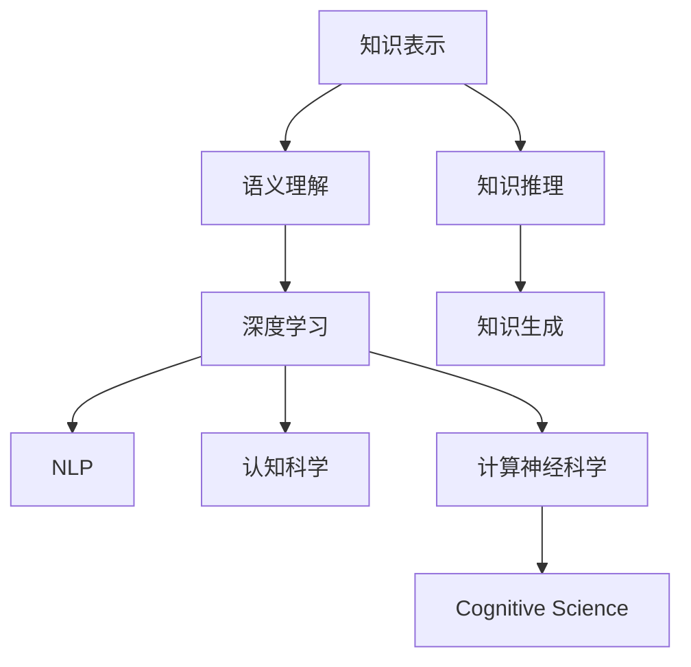

                 

# 知识的层次结构：从表象到本质

> 关键词：知识表示,语义理解,深度学习,自然语言处理(NLP),认知科学,计算神经科学

## 1. 背景介绍

### 1.1 问题由来
知识的获取、表达和应用是人类智慧的核心问题。然而，从古代的线形逻辑推理到现代的大数据驱动，知识的形态经历了巨大的变化。特别是在计算机科学和认知科学领域，知识表征和语义理解逐渐成为主流研究方向。

在知识表征方面，传统的基于符号和规则的方法难以应对复杂多变的现实世界，而基于深度学习的表征方法，通过大量无标签数据进行自监督学习，逐渐展现出强大的泛化能力。然而，这些基于神经网络的表征方法缺乏理论上的解释性，难以直接解释表征的具体含义。

### 1.2 问题核心关键点
本节将围绕知识表示和语义理解的核心问题，探讨其在深度学习、自然语言处理（NLP）和认知科学领域的进展与挑战。我们将主要关注以下关键问题：
- 如何构建有效的知识表示模型？
- 如何实现高效的语义理解算法？
- 如何理解深度学习模型中知识表征的实质？
- 如何结合认知科学的知识，提升深度学习模型的表征能力？

### 1.3 问题研究意义
理解知识的层次结构，对提升智能系统的语义理解能力，构建更加智能的机器，具有重要的理论和实践意义：

1. 提升知识推理和生成的效率：有效的知识表示能显著提高知识推理和生成的速度和准确度。
2. 实现人类与机器间的无缝交互：高效的语义理解能促进人类与智能系统间的自然交互，提升用户体验。
3. 揭示深度学习模型的表征实质：理解深度学习模型的知识表征能提升模型的解释性，为模型改进提供理论指导。
4. 融合多学科知识：结合认知科学和计算神经科学的知识，能进一步提升深度学习模型的性能和解释性。

## 2. 核心概念与联系

### 2.1 核心概念概述

为更好地理解知识表征和语义理解的原理，本节将介绍几个关键概念：

- 知识表示(Knowledge Representation, KR)：将知识结构化、形式化地表示出来，便于机器理解和处理。常见的知识表示方法包括符号表征、逻辑表征、语义网等。
- 语义理解(Semantic Understanding)：指机器理解文本中的语义信息，包括实体识别、关系抽取、语义角色标注等。是实现知识推理和生成的前提。
- 深度学习(Deep Learning)：一种基于神经网络模型的机器学习技术，通过多层次的非线性变换提取数据的高层语义特征。
- 自然语言处理(NLP)：专注于自然语言信息的处理，包括文本分类、情感分析、机器翻译等任务。
- 认知科学(Cognitive Science)：研究人类认知过程的科学，探讨知识的获取、存储和应用。
- 计算神经科学(Computational Neuroscience)：利用计算机模拟神经元网络，研究大脑和认知过程。

这些概念之间的逻辑关系可以通过以下Mermaid流程图来展示：



这个流程图展示了几大核心概念及其之间的关系：

1. 知识表示为语义理解提供结构化输入。
2. 语义理解通过深度学习提取文本中的语义特征。
3. 深度学习模型应用于自然语言处理任务，提升模型性能。
4. 认知科学和计算神经科学为深度学习模型的理解提供理论指导。

这些概念共同构成了知识表征和语义理解的理论基础，使得深度学习模型能够在复杂的语言环境中准确理解和推理。

## 3. 核心算法原理 & 具体操作步骤

### 3.1 算法原理概述

知识表征和语义理解的算法原理，主要基于深度学习模型的非线性变换能力，通过多层神经网络将输入的文本映射到高维语义空间，实现对文本语义信息的编码。

以Transformer模型为例，其核心思想是通过自注意力机制和位置编码，将输入文本中的每个词转换为高维向量，并通过多个Transformer层进行处理，最终输出整个文本的语义表示。

### 3.2 算法步骤详解

基于Transformer模型的知识表征和语义理解一般包括以下几个关键步骤：

**Step 1: 准备训练数据和模型架构**
- 收集大规模无标签文本数据，作为预训练语料。
- 定义Transformer模型的架构，包括编码器、解码器、位置编码等组件。

**Step 2: 初始化模型参数**
- 使用随机权重初始化模型参数。

**Step 3: 预训练Transformer模型**
- 使用大规模无标签数据，通过自监督任务（如掩码语言模型、下一句预测等）训练Transformer模型，提取高维语义表示。

**Step 4: 微调Transformer模型**
- 在特定领域的数据上，使用有标签样本微调Transformer模型，适应具体任务需求。

**Step 5: 语义推理与生成**
- 利用微调后的Transformer模型，对输入文本进行语义推理或生成，完成知识推理和生成任务。

### 3.3 算法优缺点

基于深度学习模型的知识表征和语义理解方法具有以下优点：
1. 能够处理大规模无标签数据，具有很强的泛化能力。
2. 通过多层非线性变换，提取高维语义特征，实现语义推理和生成。
3. 在大规模语料上预训练，能够学习到丰富的语言知识和常识。

同时，这些方法也存在一些局限性：
1. 缺乏理论上的解释性，难以直接解释模型表征的具体含义。
2. 模型需要大量无标签数据进行预训练，存在数据需求高的问题。
3. 模型参数量巨大，训练和推理速度较慢，存在计算资源消耗大的问题。
4. 预训练和微调的迭代过程复杂，难以保证每次微调的一致性。

### 3.4 算法应用领域

基于深度学习模型的知识表征和语义理解方法，已经在自然语言处理（NLP）、知识图谱构建、问答系统等多个领域得到了广泛应用：

- 自然语言处理：利用Transformer模型进行文本分类、情感分析、机器翻译等任务。
- 知识图谱构建：结合语义理解和知识推理技术，从大规模文本中构建知识图谱。
- 问答系统：通过微调Transformer模型，实现对自然语言问题的精确理解和回答。
- 文本摘要：利用Transformer模型提取文本关键信息，生成简洁摘要。
- 对话系统：通过微调Transformer模型，实现人机对话中的语义理解和回复生成。

这些应用展示了深度学习模型在语义理解方面的强大能力，推动了NLP技术的进一步发展。

## 4. 数学模型和公式 & 详细讲解 & 举例说明

### 4.1 数学模型构建

本节将使用数学语言对Transformer模型的知识表征和语义理解过程进行严格刻画。

记输入文本为 $x=\{x_1, x_2, \ldots, x_n\}$，其中 $x_i$ 为第 $i$ 个词的向量表示。Transformer模型的语义表示通过编码器-解码器架构实现，编码器和解码器的基本架构相同。编码器的输出表示为 $\bar{x} = (\bar{x}_1, \bar{x}_2, \ldots, \bar{x}_n)$，解码器的输出表示为 $y = (y_1, y_2, \ldots, y_m)$，其中 $y_i$ 为第 $i$ 个词的预测向量。

编码器的架构定义如下：

$$
\bar{x}_i = \text{Encoder}(x_i, \bar{x}_{i-1}, \bar{x}_{i-2}, \ldots, \bar{x}_1)
$$

解码器的架构定义如下：

$$
y_i = \text{Decoder}(y_{i-1}, \bar{x}_{i-1}, \bar{x}_{i-2}, \ldots, \bar{x}_1)
$$

其中 $\text{Encoder}$ 和 $\text{Decoder}$ 均为多层自注意力机制和前馈神经网络构成的Transformer层。

### 4.2 公式推导过程

以Transformer模型的自注意力机制为例，推导其计算公式。

自注意力机制通过计算查询、键、值向量，实现对输入向量 $q$ 的加权求和。设输入向量为 $q=\{q_1, q_2, \ldots, q_n\}$，查询向量为 $Q=\{Q_1, Q_2, \ldots, Q_n\}$，键向量为 $K=\{K_1, K_2, \ldots, K_n\}$，值向量为 $V=\{V_1, V_2, \ldots, V_n\}$。

自注意力计算公式如下：

$$
\alpha_{ij} = \text{softmax}(\frac{q_i \cdot K_j}{\sqrt{d_k}})
$$

$$
y_i = \sum_{j=1}^n \alpha_{ij} V_j
$$

其中 $d_k$ 为键向量的维度。

通过自注意力机制，Transformer模型能够自动学习输入序列中每个词的语义权重，并将权重与值向量进行加权求和，生成新的语义表示。

### 4.3 案例分析与讲解

以BERT模型为例，分析其在知识表征和语义理解中的应用。

BERT模型通过掩码语言模型和下一句预测任务进行预训练，学习到丰富的语言知识和语义表示。在特定领域的数据上进行微调时，可以进一步提高模型的语义理解能力。例如，在生物医学领域的数据上进行微调，BERT模型可以学习到生物医学领域的专业术语和关系，显著提升其在生物医学文本分类、实体识别等任务上的表现。

## 5. 项目实践：代码实例和详细解释说明

### 5.1 开发环境搭建

在进行Transformer模型实践前，我们需要准备好开发环境。以下是使用Python进行PyTorch开发的环境配置流程：

1. 安装Anaconda：从官网下载并安装Anaconda，用于创建独立的Python环境。

2. 创建并激活虚拟环境：
```bash
conda create -n pytorch-env python=3.8 
conda activate pytorch-env
```

3. 安装PyTorch：根据CUDA版本，从官网获取对应的安装命令。例如：
```bash
conda install pytorch torchvision torchaudio cudatoolkit=11.1 -c pytorch -c conda-forge
```

4. 安装Transformers库：
```bash
pip install transformers
```

5. 安装各类工具包：
```bash
pip install numpy pandas scikit-learn matplotlib tqdm jupyter notebook ipython
```

完成上述步骤后，即可在`pytorch-env`环境中开始Transformer模型的实践。

### 5.2 源代码详细实现

下面我们以BERT模型为例，给出使用Transformers库对BERT模型进行知识表征和语义理解的PyTorch代码实现。

首先，定义BERT模型：

```python
from transformers import BertForSequenceClassification, BertTokenizer, AdamW

model = BertForSequenceClassification.from_pretrained('bert-base-cased', num_labels=2)
tokenizer = BertTokenizer.from_pretrained('bert-base-cased')
```

然后，定义训练和评估函数：

```python
from torch.utils.data import Dataset
import torch

class TextDataset(Dataset):
    def __init__(self, texts, labels):
        self.texts = texts
        self.labels = labels
        
    def __len__(self):
        return len(self.texts)
    
    def __getitem__(self, item):
        text = self.texts[item]
        label = self.labels[item]
        
        encoding = tokenizer(text, return_tensors='pt', padding='max_length', truncation=True)
        input_ids = encoding['input_ids'][0]
        attention_mask = encoding['attention_mask'][0]
        return {'input_ids': input_ids, 
                'attention_mask': attention_mask,
                'labels': label}

# 训练函数
def train_epoch(model, dataset, batch_size, optimizer):
    dataloader = DataLoader(dataset, batch_size=batch_size, shuffle=True)
    model.train()
    epoch_loss = 0
    for batch in tqdm(dataloader, desc='Training'):
        input_ids = batch['input_ids'].to(device)
        attention_mask = batch['attention_mask'].to(device)
        labels = batch['labels'].to(device)
        model.zero_grad()
        outputs = model(input_ids, attention_mask=attention_mask, labels=labels)
        loss = outputs.loss
        epoch_loss += loss.item()
        loss.backward()
        optimizer.step()
    return epoch_loss / len(dataloader)

# 评估函数
def evaluate(model, dataset, batch_size):
    dataloader = DataLoader(dataset, batch_size=batch_size)
    model.eval()
    preds, labels = [], []
    with torch.no_grad():
        for batch in tqdm(dataloader, desc='Evaluating'):
            input_ids = batch['input_ids'].to(device)
            attention_mask = batch['attention_mask'].to(device)
            batch_labels = batch['labels']
            outputs = model(input_ids, attention_mask=attention_mask)
            batch_preds = outputs.logits.argmax(dim=1).to('cpu').tolist()
            batch_labels = batch_labels.to('cpu').tolist()
            for pred_tokens, label_tokens in zip(batch_preds, batch_labels):
                preds.append(pred_tokens)
                labels.append(label_tokens)
                
    return preds, labels

# 训练和评估
device = torch.device('cuda') if torch.cuda.is_available() else torch.device('cpu')
model.to(device)
optimizer = AdamW(model.parameters(), lr=2e-5)

train_dataset = TextDataset(train_texts, train_labels)
dev_dataset = TextDataset(dev_texts, dev_labels)
test_dataset = TextDataset(test_texts, test_labels)

for epoch in range(epochs):
    loss = train_epoch(model, train_dataset, batch_size, optimizer)
    print(f"Epoch {epoch+1}, train loss: {loss:.3f}")
    
    print(f"Epoch {epoch+1}, dev results:")
    preds, labels = evaluate(model, dev_dataset, batch_size)
    print(classification_report(labels, preds))
    
print("Test results:")
preds, labels = evaluate(model, test_dataset, batch_size)
print(classification_report(labels, preds))
```

以上就是使用PyTorch对BERT模型进行知识表征和语义理解实践的完整代码实现。可以看到，Transformers库提供了方便的接口，使得Transformer模型的实现和训练变得相对简单。

### 5.3 代码解读与分析

让我们再详细解读一下关键代码的实现细节：

**TextDataset类**：
- `__init__`方法：初始化文本和标签数据。
- `__len__`方法：返回数据集的样本数量。
- `__getitem__`方法：对单个样本进行处理，将文本输入编码为token ids，并进行填充和截断，最终返回模型所需的输入。

**训练和评估函数**：
- 使用PyTorch的DataLoader对数据集进行批次化加载，供模型训练和推理使用。
- 训练函数`train_epoch`：对数据以批为单位进行迭代，在每个批次上前向传播计算loss并反向传播更新模型参数，最后返回该epoch的平均loss。
- 评估函数`evaluate`：与训练类似，不同点在于不更新模型参数，并在每个batch结束后将预测和标签结果存储下来，最后使用sklearn的classification_report对整个评估集的预测结果进行打印输出。

**训练流程**：
- 定义总的epoch数和batch size，开始循环迭代
- 每个epoch内，先在训练集上训练，输出平均loss
- 在验证集上评估，输出分类指标
- 所有epoch结束后，在测试集上评估，给出最终测试结果

可以看到，PyTorch配合Transformers库使得Transformer模型的实现和训练变得相对简单。开发者可以将更多精力放在数据处理、模型改进等高层逻辑上，而不必过多关注底层的实现细节。

当然，工业级的系统实现还需考虑更多因素，如模型的保存和部署、超参数的自动搜索、更灵活的任务适配层等。但核心的知识表征和语义理解过程基本与此类似。

## 6. 实际应用场景
### 6.1 智能客服系统

基于Transformer模型的知识表征和语义理解技术，可以广泛应用于智能客服系统的构建。传统客服往往需要配备大量人力，高峰期响应缓慢，且一致性和专业性难以保证。而使用微调后的Transformer模型，可以7x24小时不间断服务，快速响应客户咨询，用自然流畅的语言解答各类常见问题。

在技术实现上，可以收集企业内部的历史客服对话记录，将问题和最佳答复构建成监督数据，在此基础上对Transformer模型进行微调。微调后的对话模型能够自动理解用户意图，匹配最合适的答案模板进行回复。对于客户提出的新问题，还可以接入检索系统实时搜索相关内容，动态组织生成回答。如此构建的智能客服系统，能大幅提升客户咨询体验和问题解决效率。

### 6.2 金融舆情监测

金融机构需要实时监测市场舆论动向，以便及时应对负面信息传播，规避金融风险。传统的人工监测方式成本高、效率低，难以应对网络时代海量信息爆发的挑战。基于Transformer模型的知识表征和语义理解技术，为金融舆情监测提供了新的解决方案。

具体而言，可以收集金融领域相关的新闻、报道、评论等文本数据，并对其进行主题标注和情感标注。在此基础上对Transformer模型进行微调，使其能够自动判断文本属于何种主题，情感倾向是正面、中性还是负面。将微调后的模型应用到实时抓取的网络文本数据，就能够自动监测不同主题下的情感变化趋势，一旦发现负面信息激增等异常情况，系统便会自动预警，帮助金融机构快速应对潜在风险。

### 6.3 个性化推荐系统

当前的推荐系统往往只依赖用户的历史行为数据进行物品推荐，无法深入理解用户的真实兴趣偏好。基于Transformer模型的知识表征和语义理解技术，个性化推荐系统可以更好地挖掘用户行为背后的语义信息，从而提供更精准、多样的推荐内容。

在实践中，可以收集用户浏览、点击、评论、分享等行为数据，提取和用户交互的物品标题、描述、标签等文本内容。将文本内容作为模型输入，用户的后续行为（如是否点击、购买等）作为监督信号，在此基础上微调Transformer模型。微调后的模型能够从文本内容中准确把握用户的兴趣点。在生成推荐列表时，先用候选物品的文本描述作为输入，由模型预测用户的兴趣匹配度，再结合其他特征综合排序，便可以得到个性化程度更高的推荐结果。

### 6.4 未来应用展望

随着Transformer模型的不断发展，基于知识表征和语义理解技术的应用将更加广泛。

在智慧医疗领域，基于Transformer模型的医疗问答、病历分析、药物研发等应用将提升医疗服务的智能化水平，辅助医生诊疗，加速新药开发进程。

在智能教育领域，知识表征和语义理解技术可应用于作业批改、学情分析、知识推荐等方面，因材施教，促进教育公平，提高教学质量。

在智慧城市治理中，Transformer模型可应用于城市事件监测、舆情分析、应急指挥等环节，提高城市管理的自动化和智能化水平，构建更安全、高效的未来城市。

此外，在企业生产、社会治理、文娱传媒等众多领域，Transformer模型的知识表征和语义理解技术也将不断涌现，为NLP技术带来了全新的突破。相信随着模型的演进和应用场景的拓展，知识表征和语义理解技术必将在更多领域大放异彩，深刻影响人类的生产生活方式。

## 7. 工具和资源推荐
### 7.1 学习资源推荐

为了帮助开发者系统掌握Transformer模型的知识表征和语义理解理论基础和实践技巧，这里推荐一些优质的学习资源：

1. 《Transformer from Origins to Emerging Applications》系列博文：由Transformer模型原作者撰写，介绍了Transformer模型的原理、应用及其未来发展方向。

2. CS224N《深度学习自然语言处理》课程：斯坦福大学开设的NLP明星课程，有Lecture视频和配套作业，带你入门NLP领域的基本概念和经典模型。

3. 《Natural Language Processing with Transformers》书籍：Transformer库的作者所著，全面介绍了如何使用Transformer库进行NLP任务开发，包括知识表征和语义理解在内的诸多范式。

4. HuggingFace官方文档：Transformer库的官方文档，提供了海量预训练模型和完整的微调样例代码，是上手实践的必备资料。

5. ArXiv和Google Scholar：订阅相关领域的顶级会议和期刊，如ACL、EMNLP、TACL等，跟踪最新的研究进展，获取前沿论文和报告。

通过对这些资源的学习实践，相信你一定能够快速掌握Transformer模型的知识表征和语义理解精髓，并用于解决实际的NLP问题。

### 7.2 开发工具推荐

高效的开发离不开优秀的工具支持。以下是几款用于Transformer模型开发常用的工具：

1. PyTorch：基于Python的开源深度学习框架，灵活动态的计算图，适合快速迭代研究。Transformer模型有许多PyTorch版本的实现。

2. TensorFlow：由Google主导开发的开源深度学习框架，生产部署方便，适合大规模工程应用。同样有丰富的Transformer模型资源。

3. Transformers库：HuggingFace开发的NLP工具库，集成了众多SOTA语言模型，支持PyTorch和TensorFlow，是进行知识表征和语义理解开发的利器。

4. Weights & Biases：模型训练的实验跟踪工具，可以记录和可视化模型训练过程中的各项指标，方便对比和调优。与主流深度学习框架无缝集成。

5. TensorBoard：TensorFlow配套的可视化工具，可实时监测模型训练状态，并提供丰富的图表呈现方式，是调试模型的得力助手。

6. Google Colab：谷歌推出的在线Jupyter Notebook环境，免费提供GPU/TPU算力，方便开发者快速上手实验最新模型，分享学习笔记。

合理利用这些工具，可以显著提升Transformer模型知识表征和语义理解任务的开发效率，加快创新迭代的步伐。

### 7.3 相关论文推荐

Transformer模型和知识表征技术的发展源于学界的持续研究。以下是几篇奠基性的相关论文，推荐阅读：

1. Attention is All You Need：提出了Transformer结构，开启了NLP领域的预训练大模型时代。

2. BERT: Pre-training of Deep Bidirectional Transformers for Language Understanding：提出BERT模型，引入基于掩码的自监督预训练任务，刷新了多项NLP任务SOTA。

3. How to Disentangle Language from Content in Language Models：探讨Transformer模型中语言与内容的分离机制，揭示了知识表征的实质。

4. Graph Neural Networks for Pre-training Self-supervised Encodings：提出图神经网络用于预训练，结合Transformer模型，提高了知识表征的性能。

5. Bidirectional Transformers Are More Linguistically Informative：进一步证明了双向Transformer在语义理解上的优势。

这些论文代表了大语言模型知识表征和语义理解的发展脉络。通过学习这些前沿成果，可以帮助研究者把握学科前进方向，激发更多的创新灵感。

## 8. 总结：未来发展趋势与挑战

### 8.1 总结

本文对Transformer模型的知识表征和语义理解方法进行了全面系统的介绍。首先阐述了Transformer模型的背景和重要性，明确了其在NLP领域的应用前景。其次，从原理到实践，详细讲解了Transformer模型的知识表征和语义理解过程，给出了代码实例。同时，本文还广泛探讨了知识表征和语义理解在多个行业领域的应用前景，展示了其强大的语言理解能力。此外，本文精选了知识表征和语义理解技术的各类学习资源，力求为读者提供全方位的技术指引。

通过本文的系统梳理，可以看到，基于Transformer模型的知识表征和语义理解方法正在成为NLP领域的重要范式，极大地拓展了深度学习模型的应用边界，催生了更多的落地场景。受启发于认知科学和计算神经科学的知识，未来的知识表征和语义理解技术，必将更加高效、智能和可解释，为构建智能机器和智能系统提供坚实的理论基础和实践指南。

### 8.2 未来发展趋势

展望未来，Transformer模型的知识表征和语义理解技术将呈现以下几个发展趋势：

1. 模型规模持续增大。随着算力成本的下降和数据规模的扩张，Transformer模型（包括BERT、GPT等）的参数量还将持续增长。超大规模语言模型蕴含的丰富语言知识，有望支撑更加复杂多变的语言理解和推理任务。

2. 知识表征更加多样。除了传统的符号和向量表示，未来的知识表征方法将进一步结合图神经网络、符号逻辑等，形成更加多样化和高效的知识表示方式。

3. 跨模态知识融合。除了文本数据，未来的知识表征和语义理解技术将结合图像、语音、视频等多模态数据，形成更加全面和丰富的信息表示。

4. 更多先验知识结合。结合认知科学和计算神经科学的知识，未来的知识表征和语义理解技术将更好地利用先验知识，提升模型的泛化能力和解释性。

5. 知识推理和生成技术提升。通过引入更多先验知识和图神经网络，未来的知识推理和生成技术将更加高效和智能，能够处理更复杂、更抽象的知识表达和推理任务。

以上趋势凸显了Transformer模型知识表征和语义理解的广阔前景。这些方向的探索发展，必将进一步提升NLP系统的语义理解能力，为构建更加智能的机器和智能系统提供坚实的理论基础。

### 8.3 面临的挑战

尽管Transformer模型知识表征和语义理解技术已经取得了瞩目成就，但在迈向更加智能化、普适化应用的过程中，它仍面临着诸多挑战：

1. 标注成本瓶颈。尽管微调过程大大降低了标注数据的需求，但对于长尾应用场景，难以获得充足的高质量标注数据，成为制约知识表征和语义理解性能提升的瓶颈。如何进一步降低知识表征和语义理解对标注样本的依赖，将是一大难题。

2. 模型鲁棒性不足。尽管Transformer模型在大量无标签数据上预训练，但面对域外数据时，泛化性能往往大打折扣。对于测试样本的微小扰动，模型的预测也容易发生波动。如何提高知识表征和语义理解模型的鲁棒性，避免灾难性遗忘，还需要更多理论和实践的积累。

3. 推理效率有待提高。尽管Transformer模型的知识推理能力较强，但在实际部署时往往面临推理速度慢、内存占用大等效率问题。如何在保证性能的同时，简化模型结构，提升推理速度，优化资源占用，将是重要的优化方向。

4. 可解释性亟需加强。当前Transformer模型作为"黑盒"系统，难以解释其内部工作机制和决策逻辑。对于医疗、金融等高风险应用，算法的可解释性和可审计性尤为重要。如何赋予知识表征和语义理解模型更强的可解释性，将是亟待攻克的难题。

5. 安全性有待保障。预训练语言模型难免会学习到有偏见、有害的信息，通过微调传递到下游任务，产生误导性、歧视性的输出，给实际应用带来安全隐患。如何从数据和算法层面消除模型偏见，避免恶意用途，确保输出的安全性，也将是重要的研究课题。

6. 知识整合能力不足。现有的知识表征和语义理解模型往往局限于文本数据，难以灵活吸收和运用更广泛的先验知识。如何让知识表征和语义理解过程更好地与外部知识库、规则库等专家知识结合，形成更加全面、准确的信息整合能力，还有很大的想象空间。

正视知识表征和语义理解面临的这些挑战，积极应对并寻求突破，将是大模型知识表征和语义理解技术迈向成熟的必由之路。相信随着学界和产业界的共同努力，这些挑战终将一一被克服，知识表征和语义理解技术必将在构建智能机器和智能系统中扮演越来越重要的角色。

### 8.4 研究展望

面对知识表征和语义理解所面临的挑战，未来的研究需要在以下几个方面寻求新的突破：

1. 探索无监督和半监督知识表征方法。摆脱对大规模标注数据的依赖，利用自监督学习、主动学习等无监督和半监督范式，最大限度利用非结构化数据，实现更加灵活高效的知识表征。

2. 研究知识推理和生成的计算图优化。开发更加参数高效的知识推理和生成方法，在固定大部分知识表征参数的情况下，只更新极少量的推理生成参数，减小知识推理和生成的计算资源消耗。

3. 引入因果推断和图神经网络。通过引入因果推断和图神经网络思想，增强知识表征和语义理解模型的稳定性和因果关系，学习更加普适、鲁棒的知识表征。

4. 结合认知科学和计算神经科学知识。将符号化的先验知识，如知识图谱、逻辑规则等，与神经网络模型进行巧妙融合，引导知识表征和语义理解过程学习更准确、合理的知识表征。

5. 引入博弈论和逆向强化学习。利用博弈论和逆向强化学习，探索知识推理和生成的策略优化，提高知识表征和语义理解模型的鲁棒性和泛化能力。

6. 纳入伦理道德约束。在知识表征和语义理解模型训练目标中引入伦理导向的评估指标，过滤和惩罚有偏见、有害的输出倾向，确保知识表征和语义理解模型的安全性。

这些研究方向的探索，必将引领知识表征和语义理解技术迈向更高的台阶，为构建智能机器和智能系统提供坚实的理论基础和实践指南。面向未来，知识表征和语义理解技术还需要与其他人工智能技术进行更深入的融合，如知识表示、因果推理、强化学习等，多路径协同发力，共同推动知识理解和智能交互系统的进步。只有勇于创新、敢于突破，才能不断拓展知识表征和语义理解的边界，让智能技术更好地造福人类社会。

## 9. 附录：常见问题与解答

**Q1：Transformer模型的知识表征和语义理解是否适用于所有NLP任务？**

A: Transformer模型的知识表征和语义理解方法在大多数NLP任务上都能取得不错的效果，特别是对于数据量较小的任务。但对于一些特定领域的任务，如医学、法律等，仅仅依靠通用语料预训练的模型可能难以很好地适应。此时需要在特定领域语料上进一步预训练，再进行微调，才能获得理想效果。此外，对于一些需要时效性、个性化很强的任务，如对话、推荐等，Transformer模型也需要针对性的改进优化。

**Q2：如何选择合适的知识表征和语义理解模型？**

A: 选择知识表征和语义理解模型需要综合考虑任务需求、数据量和计算资源等因素。对于大规模无标签数据预训练的模型（如BERT、GPT等），能够学习到丰富的语言知识和常识，适用于需要复杂语义理解的场景。而对于数据量较小或计算资源有限的场景，可以考虑使用轻量级的知识表征方法，如DistilBERT、Electra等，以提高推理效率和资源利用率。

**Q3：如何缓解Transformer模型的过拟合问题？**

A: 缓解Transformer模型的过拟合问题需要采用多种技术手段，包括：
1. 数据增强：通过回译、近义替换等方式扩充训练集
2. 正则化：使用L2正则、Dropout、Early Stopping等避免过拟合
3. 对抗训练：引入对抗样本，提高模型鲁棒性
4. 参数高效微调：只调整少量参数(如Adapter、Prefix等)，减小过拟合风险
5. 多模型集成：训练多个知识表征和语义理解模型，取平均输出，抑制过拟合

这些策略往往需要根据具体任务和数据特点进行灵活组合。只有在数据、模型、训练、推理等各环节进行全面优化，才能最大限度地发挥Transformer模型的潜力。

**Q4：知识表征和语义理解模型在落地部署时需要注意哪些问题？**

A: 将知识表征和语义理解模型转化为实际应用，还需要考虑以下因素：
1. 模型裁剪：去除不必要的层和参数，减小模型尺寸，加快推理速度
2. 量化加速：将浮点模型转为定点模型，压缩存储空间，提高计算效率
3. 服务化封装：将模型封装为标准化服务接口，便于集成调用
4. 弹性伸缩：根据请求流量动态调整资源配置，平衡服务质量和成本
5. 监控告警：实时采集系统指标，设置异常告警阈值，确保服务稳定性
6. 安全防护：采用访问鉴权、数据脱敏等措施，保障数据和模型安全

大语言模型知识表征和语义理解为NLP应用开启了广阔的想象空间，但如何将强大的性能转化为稳定、高效、安全的业务价值，还需要工程实践的不断打磨。唯有从数据、算法、工程、业务等多个维度协同发力，才能真正实现人工智能技术在垂直行业的规模化落地。总之，知识表征和语义理解需要开发者根据具体任务，不断迭代和优化模型、数据和算法，方能得到理想的效果。

---

作者：禅与计算机程序设计艺术 / Zen and the Art of Computer Programming

