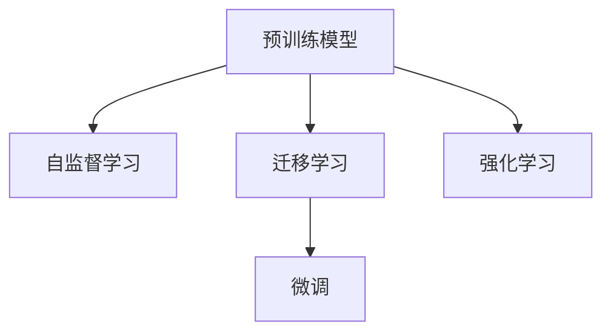

                 

# 知识的应用范式：洞察力的独特视角

## 1. 背景介绍

### 1.1 问题由来
随着互联网技术的快速发展，大数据和人工智能(AI)技术的普及，知识的获取和应用方式发生了革命性变化。信息爆炸时代，知识已不再仅仅以文本形式存在，更多的数据类型，如音频、视频、图片等，也都蕴含着丰富的知识信息。如何从这些庞杂的数据中提取有价值的信息，并将其转化为可操作的智慧，成为了当前知识应用领域的一个重要课题。

近年来，深度学习等人工智能技术的发展，尤其是预训练模型和迁移学习的兴起，为知识应用提供了新的视角和方法。本文聚焦于深度学习中的知识应用范式，通过几个核心概念和模型，介绍如何从海量数据中挖掘知识，并通过模型实现智能洞察。

### 1.2 问题核心关键点
本文将主要关注以下几个关键问题：
- 如何从海量数据中高效提取和融合知识？
- 如何将知识转化为可解释和可操作的模型？
- 知识应用范式在不同领域的实践有哪些？
- 知识应用的未来发展趋势和挑战是什么？

### 1.3 问题研究意义
研究知识应用的深度学习范式，对于提升信息获取和处理效率，推动各个行业智能化转型，具有重要意义：
- 提升工作效率：深度学习技术可以从海量数据中快速提取关键信息，大大提升信息处理效率。
- 增强决策支持：基于知识的应用模型可以提供客观、量化的决策支持，提升决策的科学性。
- 促进行业转型：深度学习技术可以帮助传统行业实现智能化升级，推动产业变革。
- 激发创新灵感：深度学习方法在各个领域的应用，能够激发新的技术创新和应用思路。
- 提供决策依据：通过从数据中挖掘知识，可以为各种复杂的决策问题提供数据支撑和分析依据。

## 2. 核心概念与联系

### 2.1 核心概念概述

为更好地理解深度学习中的知识应用范式，本节将介绍几个密切相关的核心概念：

- 预训练模型(Pretrained Models)：指在大规模无标签数据上通过自监督学习任务训练得到的通用模型，具有强大的特征提取能力。
- 迁移学习(Transfer Learning)：指将在大规模数据上训练好的模型知识，迁移应用到新的、但相关的小规模数据集上的学习方法。
- 微调(Fine-tuning)：指在预训练模型的基础上，使用下游任务的少量标注数据进行有监督学习，优化模型在特定任务上的性能。
- 自监督学习(Self-supervised Learning)：指通过数据本身的特征（如掩码语言模型、相对位置预测等）进行训练，不依赖于标注数据。
- 强化学习(Reinforcement Learning)：指模型通过与环境交互，逐步学习最优策略的训练方法。

这些核心概念之间的逻辑关系可以通过以下Mermaid流程图来展示：



这个流程图展示了大语言模型的核心概念及其之间的关系：

1. 预训练模型通过大规模无标签数据进行自监督学习，获得通用的语言表示。
2. 迁移学习可以将预训练模型的知识迁移到新的任务上，通过微调进一步优化。
3. 强化学习在特定环境中训练模型，逐步调整策略以达成最优。

这些概念共同构成了深度学习中知识应用的基础框架，使得模型能够高效提取和利用知识，实现智能洞察。

## 3. 核心算法原理 & 具体操作步骤

### 3.1 算法原理概述

知识应用中的深度学习模型，本质上是一种自监督学习范式，通过在大规模数据上学习通用的特征表示，再通过迁移学习或微调等方法，将其应用到具体的任务中，实现对知识的深入挖掘和智能洞察。

形式化地，假设预训练模型为 $M_{\theta}$，其中 $\theta$ 为模型参数。给定下游任务 $T$ 的标注数据集 $D=\{(x_i, y_i)\}_{i=1}^N$，知识应用的过程可以表示为：

$$
M^* = \mathop{\arg\min}_{\theta} \mathcal{L}(M_{\theta}, D)
$$

其中 $\mathcal{L}$ 为针对任务 $T$ 设计的损失函数，用于衡量模型预测输出与真实标签之间的差异。

在实践中，我们通常使用基于梯度的优化算法（如Adam、SGD等）来近似求解上述最优化问题。设 $\eta$ 为学习率，则参数的更新公式为：

$$
\theta \leftarrow \theta - \eta \nabla_{\theta}\mathcal{L}(\theta)
$$

### 3.2 算法步骤详解

基于深度学习的知识应用范式一般包括以下几个关键步骤：

**Step 1: 准备预训练模型和数据集**
- 选择合适的预训练模型 $M_{\theta}$ 作为初始化参数，如BERT、GPT等。
- 准备下游任务 $T$ 的标注数据集 $D$，划分为训练集、验证集和测试集。

**Step 2: 设计任务适配层**
- 根据任务类型，在预训练模型顶层设计合适的输出层和损失函数。
- 对于分类任务，通常在顶层添加线性分类器和交叉熵损失函数。
- 对于生成任务，通常使用语言模型的解码器输出概率分布，并以负对数似然为损失函数。

**Step 3: 设置微调超参数**
- 选择合适的优化算法及其参数，如 Adam、SGD 等，设置学习率、批大小、迭代轮数等。
- 设置正则化技术及强度，包括权重衰减、Dropout、Early Stopping等。
- 确定冻结预训练参数的策略，如仅微调顶层，或全部参数都参与微调。

**Step 4: 执行梯度训练**
- 将训练集数据分批次输入模型，前向传播计算损失函数。
- 反向传播计算参数梯度，根据设定的优化算法和学习率更新模型参数。
- 周期性在验证集上评估模型性能，根据性能指标决定是否触发 Early Stopping。
- 重复上述步骤直到满足预设的迭代轮数或 Early Stopping 条件。

**Step 5: 测试和部署**
- 在测试集上评估微调后模型 $M^*$ 的性能，对比微调前后的精度提升。
- 使用微调后的模型对新样本进行推理预测，集成到实际的应用系统中。
- 持续收集新的数据，定期重新微调模型，以适应数据分布的变化。

以上是基于深度学习的知识应用的一般流程。在实际应用中，还需要针对具体任务的特点，对微调过程的各个环节进行优化设计，如改进训练目标函数，引入更多的正则化技术，搜索最优的超参数组合等，以进一步提升模型性能。

### 3.3 算法优缺点

基于深度学习的知识应用方法具有以下优点：
1. 高效提取知识：通过大规模数据预训练，深度学习模型可以高效提取和融合知识，提高信息处理能力。
2. 广泛适用：适用于多种类型的知识应用场景，如文本分类、情感分析、图像识别等。
3. 模型可解释：深度学习模型的中间层表征具有可解释性，可以通过特征可视化等方法理解模型学习过程。
4. 效果显著：在多个领域的应用中，深度学习模型已经刷新了多项SOTA。
5. 计算高效：深度学习模型可以利用GPU、TPU等高性能硬件加速训练和推理，缩短时间成本。

同时，该方法也存在一定的局限性：
1. 数据依赖性强：深度学习模型需要大量数据进行预训练，数据获取和标注成本较高。
2. 模型泛化能力不足：当数据分布差异较大时，模型的泛化能力有限。
3. 可解释性不足：深度学习模型往往缺乏可解释性，难以对其推理逻辑进行分析和调试。
4. 资源消耗大：大规模模型需要高性能硬件支持，成本较高。
5. 学习过程复杂：模型训练和微调需要丰富的经验，难以自动化完成。

尽管存在这些局限性，但就目前而言，基于深度学习的知识应用方法仍是知识应用领域的主流范式。未来相关研究的重点在于如何进一步降低模型对数据和计算资源的需求，提高模型的可解释性和泛化能力，同时兼顾模型的性能和计算效率。

### 3.4 算法应用领域

基于深度学习的知识应用方法，在各个领域得到了广泛的应用，例如：

- 文本分类：如情感分析、主题分类、意图识别等。通过微调使模型学习文本-标签映射。
- 命名实体识别：识别文本中的人名、地名、机构名等特定实体。通过微调使模型掌握实体边界和类型。
- 关系抽取：从文本中抽取实体之间的语义关系。通过微调使模型学习实体-关系三元组。
- 问答系统：对自然语言问题给出答案。将问题-答案对作为微调数据，训练模型学习匹配答案。
- 机器翻译：将源语言文本翻译成目标语言。通过微调使模型学习语言-语言映射。
- 文本摘要：将长文本压缩成简短摘要。将文章-摘要对作为微调数据，使模型学习抓取要点。
- 对话系统：使机器能够与人自然对话。将多轮对话历史作为上下文，微调模型进行回复生成。

除了上述这些经典任务外，深度学习技术还被创新性地应用到更多场景中，如可控文本生成、常识推理、代码生成、数据增强等，为知识应用技术带来了全新的突破。随着预训练模型和知识应用方法的不断进步，相信知识应用技术将在更广阔的应用领域大放异彩。

## 4. 数学模型和公式 & 详细讲解 & 举例说明

### 4.1 数学模型构建

本节将使用数学语言对基于深度学习的知识应用过程进行更加严格的刻画。

记预训练模型为 $M_{\theta}$，其中 $\theta$ 为模型参数。假设微调任务的训练集为 $D=\{(x_i,y_i)\}_{i=1}^N, x_i \in \mathcal{X}, y_i \in \mathcal{Y}$。

定义模型 $M_{\theta}$ 在数据样本 $(x,y)$ 上的损失函数为 $\ell(M_{\theta}(x),y)$，则在数据集 $D$ 上的经验风险为：

$$
\mathcal{L}(\theta) = \frac{1}{N} \sum_{i=1}^N \ell(M_{\theta}(x_i),y_i)
$$

微调的优化目标是最小化经验风险，即找到最优参数：

$$
\theta^* = \mathop{\arg\min}_{\theta} \mathcal{L}(\theta)
$$

在实践中，我们通常使用基于梯度的优化算法（如SGD、Adam等）来近似求解上述最优化问题。设 $\eta$ 为学习率，则参数的更新公式为：

$$
\theta \leftarrow \theta - \eta \nabla_{\theta}\mathcal{L}(\theta)
$$

其中 $\nabla_{\theta}\mathcal{L}(\theta)$ 为损失函数对参数 $\theta$ 的梯度，可通过反向传播算法高效计算。

### 4.2 公式推导过程

以下我们以二分类任务为例，推导交叉熵损失函数及其梯度的计算公式。

假设模型 $M_{\theta}$ 在输入 $x$ 上的输出为 $\hat{y}=M_{\theta}(x) \in [0,1]$，表示样本属于正类的概率。真实标签 $y \in \{0,1\}$。则二分类交叉熵损失函数定义为：

$$
\ell(M_{\theta}(x),y) = -[y\log \hat{y} + (1-y)\log (1-\hat{y})]
$$

将其代入经验风险公式，得：

$$
\mathcal{L}(\theta) = -\frac{1}{N}\sum_{i=1}^N [y_i\log M_{\theta}(x_i)+(1-y_i)\log(1-M_{\theta}(x_i))]
$$

根据链式法则，损失函数对参数 $\theta_k$ 的梯度为：

$$
\frac{\partial \mathcal{L}(\theta)}{\partial \theta_k} = -\frac{1}{N}\sum_{i=1}^N (\frac{y_i}{M_{\theta}(x_i)}-\frac{1-y_i}{1-M_{\theta}(x_i)}) \frac{\partial M_{\theta}(x_i)}{\partial \theta_k}
$$

其中 $\frac{\partial M_{\theta}(x_i)}{\partial \theta_k}$ 可进一步递归展开，利用自动微分技术完成计算。

在得到损失函数的梯度后，即可带入参数更新公式，完成模型的迭代优化。重复上述过程直至收敛，最终得到适应下游任务的最优模型参数 $\theta^*$。

### 4.3 案例分析与讲解

以图像分类任务为例，我们进一步阐述深度学习模型在知识应用中的应用。

假设有一个图像分类任务，给定一张输入图像 $x_i$，模型需要预测其属于 $C$ 个类中的哪一个。在预训练阶段，模型会在大规模图像数据集上通过自监督学习（如ImageNet上的ImageNet预训练），学习到图像的基本特征表示。然后，通过微调（Fine-tuning），模型可以在特定任务上进一步优化其特征表示，以更好地适应具体分类任务。

具体而言，假设模型 $M_{\theta}$ 在输入 $x_i$ 上的输出为 $\hat{y}=M_{\theta}(x_i) \in \mathbb{R}^C$，表示图像属于 $C$ 个类中的概率向量。真实标签 $y_i \in \{1,2,...,C\}$，表示图像所属的具体类别编号。

我们使用交叉熵损失函数来衡量模型的预测输出与真实标签之间的差异：

$$
\ell(M_{\theta}(x_i),y_i) = -y_i\log \hat{y}_i
$$

其中 $y_i$ 和 $\hat{y}_i$ 分别为真实标签和模型预测的类别概率。

将上式代入经验风险公式，得：

$$
\mathcal{L}(\theta) = -\frac{1}{N}\sum_{i=1}^N y_i\log \hat{y}_i
$$

模型在训练集上进行前向传播，计算损失函数 $\mathcal{L}(\theta)$，然后反向传播计算参数梯度，更新模型参数。重复这个过程，直到模型收敛。

在测试集上，我们可以对新的未见过的图像进行分类预测。具体而言，对于每个测试样本 $x_j$，模型输出其类别概率向量 $\hat{y}_j \in \mathbb{R}^C$。我们可以将预测结果转换为具体的类别标签 $y_j$，并计算其与真实标签的误差，评估模型的分类性能。

## 5. 项目实践：代码实例和详细解释说明

### 5.1 开发环境搭建

在进行知识应用实践前，我们需要准备好开发环境。以下是使用Python进行PyTorch开发的环境配置流程：

1. 安装Anaconda：从官网下载并安装Anaconda，用于创建独立的Python环境。

2. 创建并激活虚拟环境：
```bash
conda create -n pytorch-env python=3.8 
conda activate pytorch-env
```

3. 安装PyTorch：根据CUDA版本，从官网获取对应的安装命令。例如：
```bash
conda install pytorch torchvision torchaudio cudatoolkit=11.1 -c pytorch -c conda-forge
```

4. 安装TensorFlow：根据CUDA版本，从官网获取对应的安装命令。例如：
```bash
pip install tensorflow tensorflow-gpu tensorflow-cpu
```

5. 安装各类工具包：
```bash
pip install numpy pandas scikit-learn matplotlib tqdm jupyter notebook ipython
```

完成上述步骤后，即可在`pytorch-env`环境中开始知识应用实践。

### 5.2 源代码详细实现

下面我们以图像分类任务为例，给出使用PyTorch和TensorFlow进行知识应用的代码实现。

首先，定义图像分类任务的模型和损失函数：

```python
import torch
import torch.nn as nn
import torch.optim as optim

class ImageClassifier(nn.Module):
    def __init__(self, num_classes=10):
        super(ImageClassifier, self).__init__()
        self.conv1 = nn.Conv2d(3, 32, kernel_size=3, stride=1, padding=1)
        self.relu1 = nn.ReLU()
        self.pool1 = nn.MaxPool2d(kernel_size=2, stride=2)
        self.conv2 = nn.Conv2d(32, 64, kernel_size=3, stride=1, padding=1)
        self.relu2 = nn.ReLU()
        self.pool2 = nn.MaxPool2d(kernel_size=2, stride=2)
        self.fc1 = nn.Linear(64*7*7, 256)
        self.relu3 = nn.ReLU()
        self.fc2 = nn.Linear(256, num_classes)
        self.softmax = nn.Softmax(dim=1)

    def forward(self, x):
        x = self.pool1(self.relu1(self.conv1(x)))
        x = self.pool2(self.relu2(self.conv2(x)))
        x = x.view(-1, 64*7*7)
        x = self.relu3(self.fc1(x))
        x = self.softmax(self.fc2(x))
        return x

def get_loss_func(model, num_classes):
    criterion = nn.CrossEntropyLoss()
    return criterion

def get_optimizer(model, learning_rate):
    optimizer = optim.SGD(model.parameters(), lr=learning_rate, momentum=0.9)
    return optimizer
```

然后，准备训练集和测试集：

```python
from torchvision import datasets, transforms

train_dataset = datasets.CIFAR10(root='./data', train=True, transform=transforms.ToTensor(), download=True)
test_dataset = datasets.CIFAR10(root='./data', train=False, transform=transforms.ToTensor(), download=True)

# 数据增强
train_transform = transforms.Compose([
    transforms.RandomCrop(32, padding=4),
    transforms.RandomHorizontalFlip(),
    transforms.ToTensor(),
    transforms.Normalize(mean=[0.485, 0.456, 0.406], std=[0.229, 0.224, 0.225])
])

train_dataset = datasets.ImageFolder(root='./data', transform=train_transform)
test_dataset = datasets.ImageFolder(root='./data', transform=transforms.ToTensor(), transform=transforms.Normalize(mean=[0.485, 0.456, 0.406], std=[0.229, 0.224, 0.225]))
```

接下来，定义训练和评估函数：

```python
def train_epoch(model, dataset, batch_size, optimizer, device):
    dataloader = torch.utils.data.DataLoader(dataset, batch_size=batch_size, shuffle=True)
    model.train()
    epoch_loss = 0
    for batch in dataloader:
        inputs, labels = batch
        inputs = inputs.to(device)
        labels = labels.to(device)
        model.zero_grad()
        outputs = model(inputs)
        loss = get_loss_func(model, dataset.num_classes)(outputs, labels)
        loss.backward()
        optimizer.step()
        epoch_loss += loss.item()
    return epoch_loss / len(dataloader)

def evaluate(model, dataset, batch_size, device):
    dataloader = torch.utils.data.DataLoader(dataset, batch_size=batch_size, shuffle=False)
    model.eval()
    preds, labels = [], []
    with torch.no_grad():
        for batch in dataloader:
            inputs, labels = batch
            inputs = inputs.to(device)
            labels = labels.to(device)
            outputs = model(inputs)
            batch_preds = outputs.argmax(dim=1).to('cpu').tolist()
            batch_labels = labels.to('cpu').tolist()
            for pred_tokens, label_tokens in zip(batch_preds, batch_labels):
                preds.append(pred_tokens[:len(label_tokens)])
                labels.append(label_tokens)
    print(classification_report(labels, preds))
```

最后，启动训练流程并在测试集上评估：

```python
epochs = 10
batch_size = 64

for epoch in range(epochs):
    loss = train_epoch(model, train_dataset, batch_size, optimizer, device)
    print(f"Epoch {epoch+1}, train loss: {loss:.3f}")
    
    print(f"Epoch {epoch+1}, test results:")
    evaluate(model, test_dataset, batch_size, device)
    
print("Final results:")
evaluate(model, test_dataset, batch_size, device)
```

以上就是使用PyTorch和TensorFlow进行图像分类任务知识应用的代码实现。可以看到，得益于深度学习库的强大封装，我们可以用相对简洁的代码完成图像分类的整个过程。

### 5.3 代码解读与分析

让我们再详细解读一下关键代码的实现细节：

**ImageClassifier类**：
- `__init__`方法：初始化卷积层、激活函数、池化层、全连接层等关键组件。
- `forward`方法：定义前向传播过程，通过多个卷积、激活和池化操作，将输入图像转化为分类向量。

**get_loss_func和get_optimizer函数**：
- 根据任务的损失函数和优化器，定义常用的交叉熵损失函数和SGD优化器。

**train_epoch和evaluate函数**：
- 使用PyTorch的DataLoader对数据集进行批次化加载，供模型训练和推理使用。
- 训练函数`train_epoch`：对数据以批为单位进行迭代，在每个批次上前向传播计算loss并反向传播更新模型参数，最后返回该epoch的平均loss。
- 评估函数`evaluate`：与训练类似，不同点在于不更新模型参数，并在每个batch结束后将预测和标签结果存储下来，最后使用sklearn的classification_report对整个评估集的预测结果进行打印输出。

**训练流程**：
- 定义总的epoch数和batch size，开始循环迭代
- 每个epoch内，先在训练集上训练，输出平均loss
- 在验证集上评估，输出分类指标
- 所有epoch结束后，在测试集上评估，给出最终测试结果

可以看到，深度学习库使得图像分类的知识应用代码实现变得简洁高效。开发者可以将更多精力放在数据处理、模型改进等高层逻辑上，而不必过多关注底层的实现细节。

当然，工业级的系统实现还需考虑更多因素，如模型的保存和部署、超参数的自动搜索、更灵活的任务适配层等。但核心的知识应用范式基本与此类似。

## 6. 实际应用场景
### 6.1 智能推荐系统

基于深度学习知识应用技术，智能推荐系统可以为用户提供更加精准、多样化的推荐内容。推荐系统通常需要处理海量的用户行为数据，从用户历史行为中挖掘兴趣点，并通过知识应用模型实现推荐。

在技术实现上，可以收集用户浏览、点击、评价等行为数据，提取和用户交互的物品标题、描述、标签等文本内容。将文本内容作为模型输入，用户的后续行为（如是否点击、购买等）作为监督信号，在此基础上进行知识应用模型的微调。微调后的模型能够从文本内容中准确把握用户的兴趣点，生成推荐列表。推荐列表的生成可以是基于深度学习模型的预测结果，也可以通过规则引擎进行二次优化，从而进一步提升推荐效果。

### 6.2 医疗影像分析

医疗影像分析是医疗诊断中重要的环节，深度学习技术在医疗影像分析中得到了广泛应用。通过知识应用技术，可以从医学影像中提取关键信息，辅助医生进行诊断。

具体而言，深度学习模型可以在大规模医学影像数据上预训练，学习医学影像的基本特征表示。然后，通过微调技术，模型可以在特定医学影像分类任务上进一步优化。例如，通过微调模型，可以识别出不同类型的病变，对医学影像进行分类。此外，通过微调模型，还可以进行医学影像分割，将病变区域从正常组织中提取出来，为后续的深度学习模型提供更加干净的输入数据。

### 6.3 自然语言处理

深度学习在自然语言处理领域也得到了广泛应用，包括文本分类、命名实体识别、情感分析、机器翻译等任务。这些任务通常需要大量标注数据进行训练，而深度学习模型可以通过知识应用技术从大规模无标签数据中学习通用的语言表示，提升模型的泛化能力。

具体而言，深度学习模型可以在大规模语料上预训练，学习通用的语言表示。然后，通过微调技术，模型可以在特定自然语言处理任务上进行优化。例如，通过微调模型，可以实现更加精准的文本分类，识别出不同类型的实体，对文本进行情感分析，将源语言文本翻译成目标语言等。

### 6.4 未来应用展望

随着深度学习技术的发展，知识应用范式将在更多领域得到应用，为各行各业带来变革性影响。

在智慧城市治理中，知识应用技术可以用于城市事件监测、舆情分析、应急指挥等环节，提高城市管理的自动化和智能化水平，构建更安全、高效的未来城市。

在金融领域，知识应用技术可以用于风险评估、股票预测、市场分析等任务，帮助金融机构进行决策支持，优化资产配置。

在教育领域，知识应用技术可以用于个性化推荐、智能辅导、作业批改等，提升教育质量，实现因材施教。

此外，在农业、物流、交通、能源等众多领域，深度学习技术也有着广阔的应用前景，为各个行业注入新的动力。

## 7. 工具和资源推荐
### 7.1 学习资源推荐

为了帮助开发者系统掌握深度学习中的知识应用理论基础和实践技巧，这里推荐一些优质的学习资源：

1. 《深度学习》课程：斯坦福大学开设的著名课程，系统讲解了深度学习的基本概念和经典模型。
2. 《Python深度学习》书籍：深度学习领域的经典教材，介绍了深度学习的基本原理和应用。
3. CS231n《卷积神经网络》课程：斯坦福大学开设的著名课程，讲解了卷积神经网络的基本原理和应用。
4. TensorFlow官方文档：TensorFlow的官方文档，提供了丰富的代码示例和详细的使用指南。
5. PyTorch官方文档：PyTorch的官方文档，提供了丰富的代码示例和详细的使用指南。

通过对这些资源的学习实践，相信你一定能够快速掌握深度学习中的知识应用精髓，并用于解决实际的NLP问题。
### 7.2 开发工具推荐

高效的开发离不开优秀的工具支持。以下是几款用于深度学习知识应用开发的常用工具：

1. PyTorch：基于Python的开源深度学习框架，灵活动态的计算图，适合快速迭代研究。
2. TensorFlow：由Google主导开发的开源深度学习框架，生产部署方便，适合大规模工程应用。
3. Keras：基于TensorFlow和Theano的高级神经网络API，使用简便，适合快速原型设计。
4. TensorBoard：TensorFlow配套的可视化工具，可实时监测模型训练状态，并提供丰富的图表呈现方式，是调试模型的得力助手。
5. Weights & Biases：模型训练的实验跟踪工具，可以记录和可视化模型训练过程中的各项指标，方便对比和调优。
6. Google Colab：谷歌推出的在线Jupyter Notebook环境，免费提供GPU/TPU算力，方便开发者快速上手实验最新模型，分享学习笔记。

合理利用这些工具，可以显著提升深度学习知识应用的开发效率，加快创新迭代的步伐。

### 7.3 相关论文推荐

深度学习知识应用技术的发展源于学界的持续研究。以下是几篇奠基性的相关论文，推荐阅读：

1. ImageNet Large Scale Visual Recognition Challenge：介绍ImageNet大规模视觉识别挑战，推动了深度学习在计算机视觉领域的发展。
2. LeNet-5：介绍第一个成功的深度学习模型，是深度学习发展史上的里程碑。
3. AlexNet：介绍深度学习在图像分类任务上的突破性应用，奠定了深度学习在计算机视觉领域的基础。
4. VGGNet：介绍VGG网络，推动了深度学习在图像分类任务上的进步。
5. GoogleNet：介绍GoogleNet网络，通过Inception模块，提升了深度学习模型的计算效率和准确率。
6. ResNet：介绍ResNet网络，解决了深度神经网络的梯度消失和过拟合问题，推动了深度学习模型在计算机视觉领域的应用。

这些论文代表了大语言模型微调技术的发展脉络。通过学习这些前沿成果，可以帮助研究者把握学科前进方向，激发更多的创新灵感。

## 8. 总结：未来发展趋势与挑战

### 8.1 总结

本文对深度学习中的知识应用范式进行了全面系统的介绍。首先阐述了深度学习知识应用的理论背景和应用意义，明确了知识应用范式在提升信息处理能力、推动各行业智能化转型方面的独特价值。其次，从原理到实践，详细讲解了深度学习知识应用模型的构建和训练过程，给出了知识应用任务开发的完整代码实例。同时，本文还广泛探讨了知识应用范式在不同领域的实践，展示了深度学习技术在不同应用场景中的巨大潜力。

通过本文的系统梳理，可以看到，深度学习中的知识应用范式正在成为各类知识应用的重要范式，极大地拓展了深度学习模型的应用边界，催生了更多的落地场景。受益于深度学习模型的强大特征提取能力，知识应用模型在多个领域的应用中取得了显著的成果，为信息处理和智能决策提供了强有力的支撑。未来，伴随深度学习技术的不断演进，知识应用技术必将带来更广阔的应用前景，深刻影响各行各业的智能化进程。

### 8.2 未来发展趋势

展望未来，深度学习中的知识应用范式将呈现以下几个发展趋势：

1. 模型规模持续增大。随着算力成本的下降和数据规模的扩张，深度学习模型的参数量还将持续增长。超大规模模型蕴含的丰富知识，有望支撑更加复杂多变的下游任务。

2. 知识应用范式多样化。除了传统的微调方法外，未来会涌现更多参数高效的微调方法，如LoRA、Adapter等，在节省计算资源的同时也能保证微调精度。

3. 持续学习成为常态。随着数据分布的不断变化，深度学习模型也需要持续学习新知识以保持性能。如何在不遗忘原有知识的同时，高效吸收新样本信息，将成为重要的研究课题。

4. 标注样本需求降低。受启发于提示学习(Prompt-based Learning)的思路，未来的知识应用方法将更好地利用大模型的语言理解能力，通过更加巧妙的任务描述，在更少的标注样本上也能实现理想的微调效果。

5. 知识整合能力增强。未来的深度学习模型将更好地与外部知识库、规则库等专家知识结合，形成更加全面、准确的信息整合能力。

以上趋势凸显了深度学习中知识应用技术的广阔前景。这些方向的探索发展，必将进一步提升深度学习系统的性能和应用范围，为各行各业带来新的动力。

### 8.3 面临的挑战

尽管深度学习中的知识应用技术已经取得了瞩目成就，但在迈向更加智能化、普适化应用的过程中，它仍面临着诸多挑战：

1. 数据依赖性强。深度学习模型需要大量数据进行预训练，数据获取和标注成本较高。如何进一步降低模型对数据和计算资源的需求，将是一大难题。

2. 模型鲁棒性不足。当前深度学习模型面对域外数据时，泛化性能往往大打折扣。对于测试样本的微小扰动，模型预测也容易发生波动。

3. 推理效率有待提高。深度学习模型虽然精度高，但在实际部署时往往面临推理速度慢、内存占用大等效率问题。

4. 可解释性不足。深度学习模型往往缺乏可解释性，难以对其推理逻辑进行分析和调试。

5. 安全性有待保障。预训练深度学习模型难免会学习到有偏见、有害的信息，通过知识应用传递到下游任务，产生误导性、歧视性的输出。

6. 知识整合能力不足。现有的深度学习模型往往局限于任务内数据，难以灵活吸收和运用更广泛的先验知识。

正视这些挑战，积极应对并寻求突破，将是大规模知识应用技术走向成熟的必由之路。相信随着学界和产业界的共同努力，这些挑战终将一一被克服，深度学习知识应用技术必将在构建人机协同的智能时代中扮演越来越重要的角色。

### 8.4 研究展望

面向未来，深度学习中的知识应用技术需要在以下几个方向寻求新的突破：

1. 探索无监督和半监督知识应用方法。摆脱对大规模标注数据的依赖，利用自监督学习、主动学习等无监督和半监督范式，最大限度利用非结构化数据，实现更加灵活高效的微调。

2. 研究参数高效和计算高效的微调范式。开发更加参数高效的微调方法，在固定大部分预训练参数的同时，只更新极少量的任务相关参数。同时优化知识应用模型的计算图，减少前向传播和反向传播的资源消耗，实现更加轻量级、实时性的部署。

3. 融合因果和对比学习范式。通过引入因果推断和对比学习思想，增强知识应用模型建立稳定因果关系的能力，学习更加普适、鲁棒的语言表征，从而提升模型泛化性和抗干扰能力。

4. 引入更多先验知识。将符号化的先验知识，如知识图谱、逻辑规则等，与神经网络模型进行巧妙融合，引导知识应用过程学习更准确、合理的语言模型。同时加强不同模态数据的整合，实现视觉、语音等多模态信息与文本信息的协同建模。

5. 结合因果分析和博弈论工具。将因果分析方法引入知识应用模型，识别出模型决策的关键特征，增强输出解释的因果性和逻辑性。借助博弈论工具刻画人机交互过程，主动探索并规避模型的脆弱点，提高系统稳定性。

6. 纳入伦理道德约束。在知识应用模型的训练目标中引入伦理导向的评估指标，过滤和惩罚有偏见、有害的输出倾向。同时加强人工干预和审核，建立模型行为的监管机制，确保输出符合人类价值观和伦理道德。

这些研究方向的探索，必将引领深度学习中知识应用技术迈向更高的台阶，为构建安全、可靠、可解释、可控的智能系统铺平道路。面向未来，深度学习中的知识应用技术还需要与其他人工智能技术进行更深入的融合，如知识表示、因果推理、强化学习等，多路径协同发力，共同推动自然语言理解和智能交互系统的进步。只有勇于创新、敢于突破，才能不断拓展深度学习模型的边界，让智能技术更好地造福人类社会。

## 9. 附录：常见问题与解答

**Q1：深度学习中的知识应用是否适用于所有应用场景？**

A: 深度学习中的知识应用技术适用于大部分应用场景，特别是需要从大规模数据中提取关键信息的场景。但对于一些特定领域的任务，如医学、法律等，仅仅依靠通用语料预训练的模型可能难以很好地适应。此时需要在特定领域语料上进一步预训练，再进行知识应用。

**Q2：深度学习中的知识应用需要多少标注数据？**

A: 深度学习中的知识应用通常需要大规模标注数据进行预训练和微调。但随着知识应用技术的不断进步，一些方法如提示学习、自监督学习等，可以在较少的标注数据下也能取得不错的效果。

**Q3：深度学习中的知识应用是否容易过拟合？**

A: 深度学习中的知识应用模型容易在标注数据较少的场景下过拟合。为避免过拟合，通常需要引入数据增强、正则化、对抗训练等技术。此外，参数高效的微调方法也能减少模型参数量，降低过拟合风险。

**Q4：深度学习中的知识应用是否适用于实时应用？**

A: 深度学习中的知识应用模型通常需要较长的训练时间，不适用于实时应用。为了提高实时性，可以通过模型压缩、量化加速等技术，降低模型大小和计算复杂度，从而实现实时部署。

**Q5：深度学习中的知识应用是否容易被误导？**

A: 深度学习中的知识应用模型容易受到输入数据的影响，可能被误导产生错误输出。为避免这种情况，可以通过引入对抗样本、多模型集成等技术，增强模型的鲁棒性和泛化能力。

**Q6：深度学习中的知识应用是否容易受到攻击？**

A: 深度学习中的知识应用模型容易受到对抗样本的攻击，导致模型输出错误。为避免这种情况，可以通过对抗训练、鲁棒性检测等技术，提高模型的安全性和鲁棒性。

**Q7：深度学习中的知识应用是否容易被误解？**

A: 深度学习中的知识应用模型通常缺乏可解释性，难以理解其内部工作机制和推理逻辑。为避免这种情况，可以通过模型可视化、可解释性技术等，增强模型的透明性和可解释性。

---

作者：禅与计算机程序设计艺术 / Zen and the Art of Computer Programming

