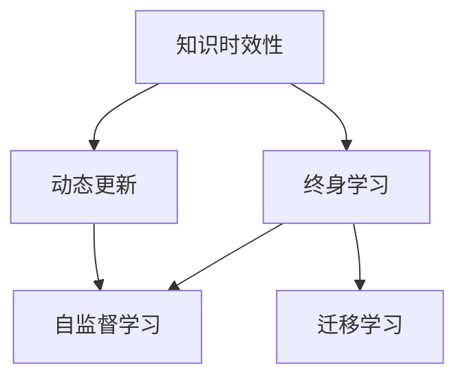

                 

# 知识的时效性：动态更新机制与终身学习

## 1. 背景介绍

### 1.1 问题由来

随着科技的飞速发展，知识更新速度不断加快。在一个知识驱动的世界里，保持知识的最新性、及时性和有效性变得愈发重要。特别是对于依赖数据驱动和深度学习模型的人工智能(AI)领域，如何处理知识的时效性问题成为了关键挑战。

现代AI系统，尤其是深度学习模型，往往基于大规模的历史数据进行训练。然而，随着时间的推移，数据的分布和性质可能会发生变化。如果模型未能及时更新知识，其预测能力和泛化能力可能会受到影响，甚至出现性能衰退。

本文章聚焦于深度学习模型的知识时效性问题，讨论如何设计动态更新机制，实现模型的终身学习，确保其知识能够与时俱进。

### 1.2 问题核心关键点

构建具有时效性的知识更新机制，主要包括以下几个核心问题：
- 如何识别知识的时效性：在哪个时间点或什么情况下，需要更新模型的知识？
- 如何更新知识：采用何种策略和方法来更新模型，以最小化性能损失？
- 动态更新与终身学习：在模型生命周期内，如何持续学习新知识，同时保留已有知识？

这些问题的答案将决定一个模型能否适应快速变化的环境，以及其在实际应用中的可靠性。

## 2. 核心概念与联系

### 2.1 核心概念概述

为更好地理解如何处理知识的时效性，本节将介绍几个关键概念及其相互联系：

- **知识时效性(Knowledge Expiry)**：指知识的价值随时间推移而衰减的特性。例如，某个领域的最新研究成果可能在几个月后就不再适用。
- **动态更新(Dynamic Updating)**：指模型在运行过程中，根据外部环境变化或新数据出现，及时调整其知识结构的过程。
- **终身学习(Lifelong Learning)**：指模型能够在其生命周期内不断学习新知识，保持知识的时效性和有效性。
- **自监督学习(Self-supervised Learning)**：利用数据自身的内在关系进行训练，如掩码语言模型(Masked Language Model)等，以提升模型的泛化能力。
- **迁移学习(Transfer Learning)**：将一个领域学到的知识迁移到另一个相关领域，以提升新任务的学习效率和性能。

这些概念之间的逻辑关系可以通过以下Mermaid流程图来展示：



这个流程图展示了这个生态系统的主要构成元素及其关系：知识时效性驱动了动态更新，动态更新是实现终身学习的关键环节，而自监督学习和迁移学习则提供了模型学习和适应的手段。

## 3. 核心算法原理 & 具体操作步骤
### 3.1 算法原理概述

动态更新与终身学习的核心原理在于，通过识别知识的时效性，模型能够在必要时及时更新其知识结构。这个过程通常涉及以下几个步骤：

1. **知识评估**：评估当前知识的时效性，判断是否需要更新。
2. **知识获取**：通过新数据或外部知识源，获取最新的知识。
3. **知识融合**：将新知识与现有知识融合，形成更新后的知识结构。
4. **知识应用**：将更新后的知识应用于模型推理或决策过程中。

在深度学习模型中，这个动态更新过程通常需要结合自监督学习和迁移学习的思想，以提升模型的适应性和泛化能力。

### 3.2 算法步骤详解

下面详细介绍一个基于深度学习模型的动态更新框架，包含三个主要步骤：知识评估、知识获取和知识融合。

**Step 1: 知识评估**
- **评估策略**：常用的策略包括时间窗口、性能阈值、事件触发等。例如，模型可以根据最近一段时间内测试数据上的性能变化，或者根据特定事件（如新数据发布）触发更新。
- **评估指标**：模型性能指标如准确率、F1分数、对数似然等。

**Step 2: 知识获取**
- **数据源**：新数据、在线学习资源、领域专家知识等。
- **数据预处理**：清洗、标准化、分批处理等。
- **知识提取**：通过自监督学习或迁移学习，提取新数据的有用信息。

**Step 3: 知识融合**
- **融合策略**：静态融合、在线融合、混合策略等。例如，静态融合指一次性将新知识与现有知识合并；在线融合指在每次推理时逐步更新模型。
- **融合算法**：如线性插值、最大似然估计、元学习等。

### 3.3 算法优缺点

动态更新与终身学习算法具有以下优点：
1. 提高模型适应性：通过及时更新，模型能够更好地适应外部环境的变化。
2. 提升泛化能力：结合自监督学习和迁移学习，模型能够更好地泛化到新场景。
3. 减少过拟合风险：通过定期更新，避免模型对旧数据过拟合。

同时，该算法也存在一定的局限性：
1. 数据依赖性强：动态更新依赖于高质量的新数据或知识源。
2. 计算成本高：新知识的获取和融合可能涉及高成本的计算和存储。
3. 更新策略复杂：需要设计合适的更新策略和评估指标，避免模型性能波动。

尽管存在这些局限性，但基于深度学习模型的动态更新和终身学习范式在实际应用中已经显示出巨大潜力，值得进一步探索和优化。

### 3.4 算法应用领域

动态更新和终身学习技术在多个领域都有广泛应用：

- **推荐系统**：实时更新用户偏好和物品属性，提升个性化推荐效果。
- **智能医疗**：不断学习最新的医学研究成果，更新疾病诊断和治疗方案。
- **金融分析**：实时分析市场数据，及时调整投资策略和风险评估。
- **自动驾驶**：不断学习新的交通规则和道路条件，提升驾驶决策的准确性和安全性。
- **智能客服**：实时更新知识库，提供更准确的解答和更自然的对话体验。

这些应用展示了动态更新和终身学习技术的广泛应用前景，也证明了其在提升模型性能和适应性方面的重要性。

## 4. 数学模型和公式 & 详细讲解 & 举例说明
### 4.1 数学模型构建

为了更好地描述动态更新机制，我们引入一个简化的数学模型。假设模型在时间 $t$ 时的知识状态为 $\theta_t$，且模型的知识状态随时间更新。模型的目标是通过评估当前知识的时效性 $e_t$，决定是否进行知识更新，并根据新知识 $k_t$ 更新知识状态 $\theta_{t+1}$。

**知识时效性模型**：
$$
e_t = f(\theta_t, D_t)
$$

其中，$D_t$ 为时间 $t$ 时的数据集，$f$ 为评估函数，例如，可以采用模型在测试数据上的性能变化作为评估指标。

**知识更新模型**：
$$
\theta_{t+1} = g(\theta_t, k_t)
$$

其中，$k_t$ 为新知识，$g$ 为融合函数，例如，可以采用线性插值等方法。

### 4.2 公式推导过程

以自监督学习的掩码语言模型为例，推导动态更新的公式。

假设模型在时间 $t$ 时的知识状态为 $\theta_t$，模型在时间 $t$ 时接收的新数据 $D_t$ 为：

$$
D_t = \{(x_i, y_i)\}_{i=1}^N
$$

其中 $x_i$ 为输入数据，$y_i$ 为掩码标签。模型的知识状态 $\theta_t$ 可以通过自监督学习训练得到：

$$
\theta_t = \mathop{\arg\min}_{\theta} \mathcal{L}(D_t, \theta)
$$

其中 $\mathcal{L}$ 为模型的损失函数，例如交叉熵损失。

模型在时间 $t$ 时评估知识时效性 $e_t$：

$$
e_t = \mathcal{L}_{test}(\theta_t, D_{test})
$$

其中 $D_{test}$ 为测试数据集。

若 $e_t$ 超过预设阈值，则进行知识更新，接收新数据 $D_t$ 进行训练：

$$
\theta_{t+1} = g(\theta_t, D_t)
$$

例如，采用线性插值方法：

$$
\theta_{t+1} = (1-\alpha)\theta_t + \alpha g(D_t)
$$

其中 $\alpha$ 为插值系数。

### 4.3 案例分析与讲解

以推荐系统为例，分析动态更新与终身学习的具体实现。

推荐系统通常基于用户的历史行为数据进行训练。假设模型在时间 $t$ 时接收新用户行为数据 $D_t$，模型对新用户行为数据的评估如下：

- **知识时效性评估**：模型在最近一段时间内，对于新用户行为数据的预测准确率是否显著下降。
- **知识获取**：获取新用户行为数据，并进行预处理。
- **知识融合**：将新用户行为数据与模型历史数据进行融合，更新推荐模型。

通过动态更新机制，推荐系统能够实时适应新用户行为变化，提升推荐效果。

## 5. 项目实践：代码实例和详细解释说明
### 5.1 开发环境搭建

为了实践动态更新与终身学习的算法，需要以下开发环境：

1. Python 3.x
2. PyTorch
3. TensorFlow
4. Jupyter Notebook

安装过程如下：

```bash
pip install torch tensorflow jupyter
```

### 5.2 源代码详细实现

下面以推荐系统为例，给出基于PyTorch实现动态更新的代码：

```python
import torch
import torch.nn as nn
import torch.optim as optim

# 定义推荐模型
class Recommender(nn.Module):
    def __init__(self):
        super(Recommender, self).__init__()
        self.fc1 = nn.Linear(100, 50)
        self.fc2 = nn.Linear(50, 1)
        
    def forward(self, x):
        x = torch.relu(self.fc1(x))
        x = self.fc2(x)
        return x

# 定义损失函数和优化器
criterion = nn.MSELoss()
optimizer = optim.SGD(model.parameters(), lr=0.01)

# 定义数据集
train_data = torch.randn(1000, 100)
train_labels = torch.randn(1000, 1)

# 定义评估函数
def evaluate(model, data, labels):
    predictions = model(data)
    loss = criterion(predictions, labels)
    return loss

# 定义知识时效性评估函数
def check_expiry(model, data, labels):
    loss = evaluate(model, data, labels)
    if loss > 0.05:
        return True
    else:
        return False

# 定义知识更新函数
def update(model, data, labels):
    optimizer.zero_grad()
    predictions = model(data)
    loss = criterion(predictions, labels)
    loss.backward()
    optimizer.step()

# 训练和更新过程
for epoch in range(1000):
    if check_expiry(model, train_data, train_labels):
        update(model, train_data, train_labels)

# 测试模型
test_data = torch.randn(100, 100)
test_labels = torch.randn(100, 1)
test_loss = evaluate(model, test_data, test_labels)
print("Test loss:", test_loss)
```

### 5.3 代码解读与分析

以上代码实现了基于PyTorch的推荐模型训练和动态更新。代码的关键步骤如下：

1. **模型定义**：定义推荐模型，包含两个线性层。
2. **损失函数和优化器**：定义均方误差损失函数和随机梯度下降优化器。
3. **数据集定义**：定义训练数据集和标签。
4. **评估函数**：定义模型在训练数据上的损失计算函数。
5. **知识时效性评估函数**：定义模型在测试数据上的性能阈值，超过该阈值时触发知识更新。
6. **知识更新函数**：定义模型参数的更新函数，根据评估结果决定是否进行更新。
7. **训练和更新过程**：循环训练模型，并在必要时进行知识更新。
8. **测试模型**：在测试数据上评估模型性能。

可以看出，通过动态更新机制，推荐系统能够实时适应新用户行为数据的变化，从而提升推荐效果。

## 6. 实际应用场景
### 6.1 推荐系统

推荐系统是动态更新和终身学习技术的典型应用场景。推荐系统通过实时更新用户行为数据，及时调整推荐策略，提升推荐效果。

在电商、视频、音乐等领域，推荐系统通过动态更新用户行为数据，实时调整商品、视频、音乐等的推荐顺序和内容，使用户获得更好的个性化体验。

### 6.2 智能医疗

智能医疗系统通过实时更新最新的医学研究成果，提升疾病诊断和治疗方案的准确性。

在医学影像、基因组学、临床决策等领域，智能医疗系统通过动态更新医学知识库，实时分析患者数据，提供最合适的诊断和治疗方案，提升医疗服务的质量和效率。

### 6.3 金融分析

金融分析系统通过实时更新市场数据，及时调整投资策略和风险评估。

在股票交易、资产管理、风险控制等领域，金融分析系统通过动态更新市场数据和预测模型，实时分析市场动态，调整投资策略和风险控制参数，优化资产配置，提升投资回报。

### 6.4 未来应用展望

未来，动态更新和终身学习技术将在更多领域得到应用，推动人工智能技术的进步：

- **自动驾驶**：通过实时更新交通规则和道路条件，提升驾驶决策的准确性和安全性。
- **智能客服**：通过实时更新知识库，提供更准确的解答和更自然的对话体验。
- **智能制造**：通过实时更新生产数据和质量反馈，优化生产流程和质量控制。
- **智慧城市**：通过实时更新城市数据和用户反馈，优化城市管理和公共服务。

这些应用展示了动态更新和终身学习技术的广泛应用前景，也证明了其在提升模型性能和适应性方面的重要性。

## 7. 工具和资源推荐
### 7.1 学习资源推荐

为了帮助开发者系统掌握动态更新和终身学习的技术，这里推荐一些优质的学习资源：

1. 《深度学习》书籍：Ian Goodfellow等著，全面介绍了深度学习的基本概念和算法，适合初学者入门。
2. 《Lifelong Learning with Neural Networks》书籍：Ravi & McAllister著，系统介绍了终身学习的理论基础和实践方法。
3. 《Reinforcement Learning: An Introduction》书籍：Sutton & Barto著，介绍了强化学习的基本概念和算法，适合学习动态更新机制。
4. 《TensorFlow 2.0》书籍：Manning等著，详细介绍了TensorFlow框架的使用和实践，适合深度学习开发。
5. 《PyTorch 1.0》书籍：Eickenberg等著，介绍了PyTorch框架的使用和实践，适合深度学习开发。

通过对这些资源的学习实践，相信你一定能够快速掌握动态更新和终身学习的精髓，并用于解决实际的AI问题。

### 7.2 开发工具推荐

高效的开发离不开优秀的工具支持。以下是几款用于动态更新和终身学习开发的常用工具：

1. TensorFlow：由Google主导开发的开源深度学习框架，生产部署方便，适合大规模工程应用。
2. PyTorch：基于Python的开源深度学习框架，灵活动态的计算图，适合快速迭代研究。
3. Jupyter Notebook：交互式编程环境，方便开发者进行实验和分享学习笔记。
4. Keras：高层次的深度学习框架，简化了深度学习模型的构建过程，适合快速原型开发。
5. Weights & Biases：模型训练的实验跟踪工具，可以记录和可视化模型训练过程中的各项指标，方便对比和调优。

合理利用这些工具，可以显著提升动态更新和终身学习任务的开发效率，加快创新迭代的步伐。

### 7.3 相关论文推荐

动态更新和终身学习技术的发展源于学界的持续研究。以下是几篇奠基性的相关论文，推荐阅读：

1. Lifelong Meta-Learning for Language Generation（2021）：提出了基于元学习的终身学习算法，应用于语言生成任务。
2. Online Learning in Depth-Transfer Learning with Unsupervised Playback（2020）：提出了基于在线学习的知识更新机制，应用于计算机视觉任务。
3. Learning Continual and lifelong Depths（2017）：提出了基于记忆的终身学习算法，应用于计算机视觉任务。
4. Continual Learning with the LSTM Network（2016）：提出了基于LSTM的终身学习算法，应用于语音识别任务。
5. Lifelong Online Learning for Deep Neural Networks（2013）：提出了基于在线学习的终身学习算法，应用于深度神经网络。

这些论文代表了大模型微调技术的发展脉络。通过学习这些前沿成果，可以帮助研究者把握学科前进方向，激发更多的创新灵感。

## 8. 总结：未来发展趋势与挑战

### 8.1 研究成果总结

本文章介绍了动态更新和终身学习的基本原理和实践方法，展示了其在推荐系统、智能医疗、金融分析等领域的广泛应用。同时，文章系统梳理了相关的学习资源、开发工具和研究论文，为动态更新和终身学习技术的深入研究和实践提供了全面的参考。

### 8.2 未来发展趋势

展望未来，动态更新和终身学习技术将呈现以下几个发展趋势：

1. 自动化和自适应：动态更新和终身学习技术将更加自动化和自适应，能够根据环境变化自主调整更新策略。
2. 跨领域迁移：模型将具备跨领域迁移的能力，能够在不同任务和领域间高效迁移和融合知识。
3. 实时更新：模型将实现实时更新，能够在不断变化的环境中保持高效和稳定。
4. 多模态融合：模型将支持多模态数据的融合，能够同时处理文本、图像、音频等多种形式的数据。
5. 知识图谱：模型将结合知识图谱，增强对复杂知识结构的理解和利用。

这些趋势将进一步提升动态更新和终身学习技术的实用性和普适性，推动其在更多领域的应用。

### 8.3 面临的挑战

尽管动态更新和终身学习技术在实际应用中已经显示出巨大潜力，但在迈向更加智能化、普适化应用的过程中，仍面临诸多挑战：

1. 数据依赖性：动态更新和终身学习技术依赖于高质量的数据和知识源，数据获取和知识提取的成本较高。
2. 计算资源：实时更新和知识融合需要高成本的计算和存储资源，资源优化和算法优化至关重要。
3. 更新策略：设计合适的更新策略和评估指标，避免模型性能波动，是动态更新和终身学习的关键问题。
4. 模型复杂度：动态更新和终身学习模型的复杂度较高，需要优化模型结构，提升训练和推理效率。
5. 知识管理：如何有效管理知识的时效性和关联性，避免知识的冗余和重复，是动态更新和终身学习的难点之一。

这些挑战需要通过持续的技术创新和算法优化，逐步克服，推动动态更新和终身学习技术的成熟和应用。

### 8.4 研究展望

面向未来，动态更新和终身学习技术需要在以下几个方向进行深入探索：

1. 自适应学习算法：开发更加自适应和灵活的学习算法，能够在不同环境和任务中高效迁移和融合知识。
2. 跨模态融合技术：研究多模态数据的融合方法，提升模型的泛化能力和适应性。
3. 知识图谱整合：将知识图谱与深度学习模型结合，增强模型对复杂知识结构的理解和利用。
4. 模型压缩与加速：开发高效的模型压缩和加速方法，降低计算和存储成本。
5. 知识管理与治理：建立知识管理的机制和治理框架，提升知识的时效性和可靠性。

这些研究方向将推动动态更新和终身学习技术的进步，为构建更加智能化、普适化的AI系统铺平道路。

## 9. 附录：常见问题与解答

**Q1：动态更新和终身学习技术是否适用于所有AI任务？**

A: 动态更新和终身学习技术在大多数AI任务上都有应用价值，特别是对于需要实时适应新数据和环境的任务。但对于一些特定任务，如语言模型、时间序列预测等，可能需要结合领域特性进行优化。

**Q2：如何选择合适的更新策略？**

A: 选择合适的更新策略需要考虑多个因素，如数据的时效性、任务的复杂度、模型的结构等。常用的策略包括时间窗口、性能阈值、事件触发等。例如，可以采用交叉验证评估模型的性能，当性能下降超过一定阈值时触发更新。

**Q3：如何优化动态更新和终身学习模型的计算成本？**

A: 优化动态更新和终身学习模型的计算成本可以从多个方面入手：
1. 模型压缩：使用模型压缩技术，如剪枝、量化等，减少模型参数量。
2. 算法优化：优化模型的训练和推理算法，提升计算效率。
3. 分布式计算：采用分布式计算架构，并行化计算过程，提升计算速度。
4. 数据优化：优化数据预处理和加载过程，减少内存占用和IO开销。

**Q4：动态更新和终身学习技术的局限性有哪些？**

A: 动态更新和终身学习技术虽然具有广泛应用前景，但也存在以下局限性：
1. 数据依赖性强：动态更新和终身学习技术依赖于高质量的数据和知识源。
2. 计算成本高：实时更新和知识融合需要高成本的计算和存储资源。
3. 更新策略复杂：设计合适的更新策略和评估指标，避免模型性能波动，是动态更新和终身学习的关键问题。
4. 模型复杂度：动态更新和终身学习模型的复杂度较高，需要优化模型结构，提升训练和推理效率。

这些局限性需要通过持续的技术创新和算法优化，逐步克服，推动动态更新和终身学习技术的成熟和应用。

**Q5：如何设计动态更新和终身学习模型的评估指标？**

A: 设计动态更新和终身学习模型的评估指标需要考虑多个因素，如模型性能、数据质量、更新频率等。常用的评估指标包括：
1. 性能指标：模型在测试数据上的准确率、召回率、F1分数等。
2. 时效性指标：模型在每次更新后的性能变化趋势，是否能够快速适应新数据。
3. 鲁棒性指标：模型在不同数据分布和环境下的鲁棒性和泛化能力。

这些评估指标可以帮助衡量模型的性能和适应性，确保动态更新和终身学习技术的有效性和可靠性。

---

作者：禅与计算机程序设计艺术 / Zen and the Art of Computer Programming

