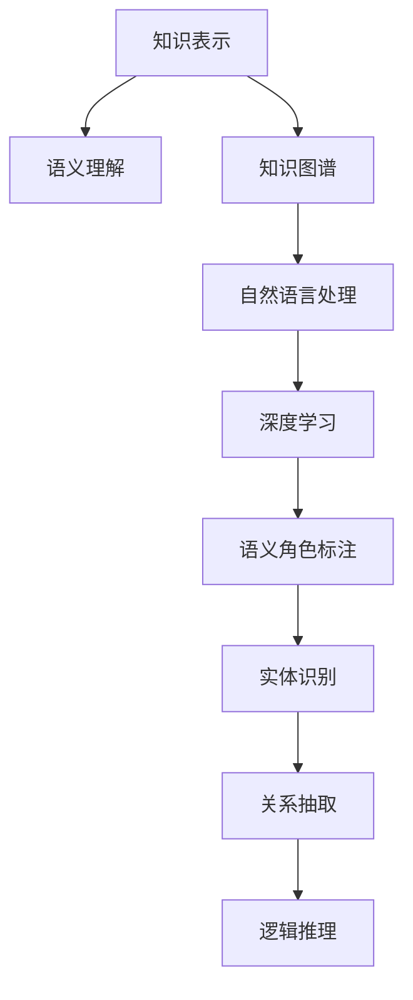

                 

# 知识的本质：从信息到智慧的转化

> 关键词：知识表示, 自然语言处理, 知识图谱, 深度学习, 语义理解, 逻辑推理

## 1. 背景介绍

### 1.1 问题由来

随着信息技术的发展，知识的学习和应用成为了一个重要的研究方向。传统的基于规则的知识表示方法，由于其固定性和刚性，已经难以适应复杂多变的现实世界。自然语言处理(NLP)技术，尤其是深度学习模型的兴起，为知识的表示和推理提供了新的可能性。如何高效、灵活地从文本中提取知识，并将其转化为机器可理解和运用的形式，成为了当前的研究热点。

### 1.2 问题核心关键点

知识表示和推理是人工智能领域的关键问题。通过将知识转化为结构化形式，计算机可以进行更准确的理解和推理。自然语言处理技术，如语言模型、语义理解、逻辑推理等，正逐步成为实现这一目标的重要工具。本文将从知识表示的演变过程出发，探讨基于深度学习的方法在知识表示和推理中的应用，并给出具体的代码实例和深入的分析。

## 2. 核心概念与联系

### 2.1 核心概念概述

为更好地理解基于深度学习的方法在知识表示和推理中的应用，本节将介绍几个密切相关的核心概念：

- 知识表示(Knowledge Representation)：指将知识以结构化的形式存储和组织，以便于计算机理解和推理。常见的知识表示形式包括规则、逻辑表达式、事实表等。

- 语义理解(Semantic Understanding)：指计算机理解自然语言文本的意义，包括词义消歧、句法分析和语义分析等。

- 知识图谱(Knowledge Graph)：一种结构化的知识表示形式，由实体、关系和属性组成。知识图谱可以用于表示和查询结构化知识，支持实体之间的关联推理。

- 自然语言处理(Natural Language Processing, NLP)：指计算机处理和理解人类语言的技术，包括文本处理、语言建模、语义分析等。

- 深度学习(Deep Learning)：一种机器学习技术，通过多层神经网络实现特征提取和模式识别。深度学习在知识表示和推理中具有很强的表现能力。

- 语义角色标注(Semantic Role Labeling, SRL)：指识别句子的语义角色，如主语、宾语、谓语等，并对其进行标注。

- 实体识别(Entity Recognition)：指从文本中识别出具体的实体，如人名、地名、组织名等。

- 关系抽取(Relation Extraction)：指从文本中抽取出实体之间的关系，如主谓宾关系等。

- 逻辑推理(Logical Reasoning)：指利用已有的知识库和推理规则，对新知识进行推理和验证。

这些核心概念之间的逻辑关系可以通过以下Mermaid流程图来展示：



这个流程图展示了几大核心概念及其之间的关系：

1. 知识表示提供了一种结构化的知识存储方式，语义理解是对文本的语义进行分析和理解。
2. 知识图谱将知识表示为实体和关系的形式，自然语言处理可以处理文本信息，实现信息的语义化。
3. 深度学习在语义理解的基础上，进一步实现知识抽取和推理。
4. 语义角色标注、实体识别、关系抽取等技术支持知识图谱的构建和推理。
5. 逻辑推理在知识图谱的基础上，实现对新知识的推理和验证。

## 3. 核心算法原理 & 具体操作步骤

### 3.1 算法原理概述

基于深度学习的方法在知识表示和推理中，主要是通过构建和训练神经网络模型，实现对知识图谱的构建、关系抽取、实体识别和逻辑推理等。以下以知识图谱的构建和关系抽取为例，介绍深度学习模型的基本原理和操作步骤。

### 3.2 算法步骤详解

#### 3.2.1 知识图谱构建

知识图谱的构建可以分为两步：首先，通过命名实体识别(NER)技术，识别出文本中的实体，并将它们进行分类；其次，通过关系抽取(Relation Extraction)技术，识别出实体之间的关系。

##### 步骤一：命名实体识别

命名实体识别是知识图谱构建的基础。其目标是从文本中识别出具有特定意义的实体，并将其进行分类，如人名、地名、组织名等。这一过程通常通过构建序列标注模型来实现，例如CRF或BiLSTM-CRF模型。

##### 步骤二：关系抽取

关系抽取是知识图谱构建的核心。其目标是从文本中抽取出实体之间的关系，如主谓宾关系等。这一过程通常通过构建序列标注模型或基于深度学习的抽取模型来实现。例如，可以使用BiLSTM-CRF模型对句子进行编码，并使用注意力机制来识别出句子中的实体关系。

#### 3.2.2 关系抽取

关系抽取可以分为两类：结构化的关系抽取和非结构化的关系抽取。结构化的关系抽取是指识别出文本中已定义的实体关系，而非结构化的关系抽取则是指识别出未定义的新实体关系。

##### 结构化关系抽取

结构化关系抽取通常使用基于深度学习的抽取模型，如基于注意力机制的抽取模型。其基本流程包括：

1. 输入文本和标签：输入文本和标注的实体关系。
2. 编码文本：使用BiLSTM-CRF模型对输入文本进行编码，生成文本向量表示。
3. 抽取关系：使用注意力机制对文本向量进行解码，得到每个实体的关系标签。
4. 输出结果：将抽取出的实体关系进行合并，生成最终的抽取结果。

##### 非结构化关系抽取

非结构化关系抽取通常使用基于深度学习的生成模型，如序列生成模型或预训练语言模型。其基本流程包括：

1. 输入文本：输入文本。
2. 生成关系：使用预训练语言模型对输入文本进行编码，生成关系向量表示。
3. 解码关系：使用注意力机制对关系向量进行解码，得到实体关系。
4. 输出结果：将生成的实体关系进行合并，生成最终的抽取结果。

### 3.3 算法优缺点

基于深度学习的方法在知识表示和推理中具有以下优点：

1. 灵活性：深度学习模型可以适应多种形式的输入数据，包括文本、图像、语音等，具有很强的泛化能力。
2. 可解释性：深度学习模型的可解释性较高，可以通过可视化技术对模型进行解释和调试。
3. 高效性：深度学习模型具有高效的计算能力和推理能力，可以处理大规模数据集和复杂推理任务。

同时，该方法也存在以下局限性：

1. 数据依赖：深度学习模型需要大量的标注数据进行训练，获取高质量标注数据的成本较高。
2. 复杂性：深度学习模型通常比较复杂，训练和调试过程较为繁琐。
3. 泛化能力：深度学习模型容易过拟合，泛化能力较弱。
4. 可解释性：深度学习模型通常被视为“黑盒”模型，难以解释其内部工作机制和推理逻辑。

尽管存在这些局限性，但就目前而言，基于深度学习的方法仍是大规模知识图谱构建和推理的重要范式。未来相关研究的重点在于如何进一步降低深度学习模型对标注数据的依赖，提高模型的泛化能力和可解释性，同时兼顾模型的复杂度和训练效率。

### 3.4 算法应用领域

基于深度学习的方法在知识表示和推理中，已经在多个领域得到了应用，如：

- 自然语言处理：通过构建知识图谱和语义理解模型，实现文本分类、问答系统、机器翻译等任务。
- 生物信息学：通过构建知识图谱和生物信息抽取模型，实现基因序列分析、药物研发等任务。
- 金融分析：通过构建知识图谱和金融信息抽取模型，实现股票预测、风险评估等任务。
- 社交网络分析：通过构建知识图谱和社会关系抽取模型，实现用户行为分析、推荐系统等任务。
- 地理信息系统：通过构建知识图谱和地理信息抽取模型，实现地理位置分析、环境监测等任务。

除了上述这些经典应用外，深度学习方法还被创新性地应用到更多场景中，如知识图谱的实体链接、关系预测、跨模态信息融合等，为知识表示和推理提供了新的思路。随着深度学习技术的不断发展，相信知识表示和推理领域必将在更广阔的应用领域大放异彩。

## 4. 数学模型和公式 & 详细讲解 & 举例说明

### 4.1 数学模型构建

知识图谱的构建和关系抽取，通常使用图神经网络(Graph Neural Network, GNN)和序列标注模型(Sequence Labeling Model)来实现。以下以知识图谱的构建为例，介绍其主要数学模型。

#### 4.1.1 知识图谱构建模型

知识图谱构建模型通常使用基于深度学习的图神经网络。其基本结构包括：

- 节点层(Node Layer)：用于对节点进行编码，生成节点表示。
- 边层(Edge Layer)：用于对边进行编码，生成边表示。
- 图层(Graph Layer)：用于对图进行编码，生成图表示。

其中，节点层和边层通常使用BiLSTM-CRF模型进行编码，图层通常使用图卷积神经网络(Graph Convolutional Network, GCN)进行编码。

### 4.2 公式推导过程

#### 4.2.1 节点层公式推导

节点层的公式推导如下：

$$
\mathbf{h}_i = \text{BiLSTM-CRF}(\mathbf{x}_i)
$$

其中，$\mathbf{h}_i$ 表示节点 $i$ 的表示，$\mathbf{x}_i$ 表示节点 $i$ 的输入特征。BiLSTM-CRF模型的具体实现细节可以参考官方文档。

#### 4.2.2 边层公式推导

边层的公式推导如下：

$$
\mathbf{e}_{ij} = \text{Attention}(\mathbf{h}_i, \mathbf{h}_j)
$$

其中，$\mathbf{e}_{ij}$ 表示节点 $i$ 和节点 $j$ 之间的关系表示，$\text{Attention}$ 表示注意力机制。注意力机制的实现细节可以参考Attention机制的相关文献。

#### 4.2.3 图层公式推导

图层的公式推导如下：

$$
\mathbf{G} = \text{GCN}(\mathbf{H}, \mathbf{E})
$$

其中，$\mathbf{G}$ 表示图的表示，$\mathbf{H}$ 表示所有节点的表示矩阵，$\mathbf{E}$ 表示边矩阵。GCN的实现细节可以参考GCN的相关文献。

### 4.3 案例分析与讲解

#### 案例分析一：知识图谱构建

以Google的Knowledge Graph为例，其基本流程包括：

1. 收集语料：收集大量网页文本，并将其进行预处理，得到文本特征。
2. 命名实体识别：使用BiLSTM-CRF模型对文本进行命名实体识别，识别出实体和实体类型。
3. 关系抽取：使用基于深度学习的抽取模型对文本进行关系抽取，识别出实体之间的关系。
4. 知识图谱构建：将抽取出的实体和关系进行整合，构建知识图谱。
5. 关系预测：使用深度学习模型对知识图谱进行关系预测，推断新关系。

#### 案例分析二：关系抽取

以微软的SRL系统为例，其基本流程包括：

1. 输入文本和标签：输入文本和标注的实体关系。
2. 编码文本：使用BiLSTM-CRF模型对输入文本进行编码，生成文本向量表示。
3. 抽取关系：使用注意力机制对文本向量进行解码，得到每个实体的关系标签。
4. 输出结果：将抽取出的实体关系进行合并，生成最终的抽取结果。

## 5. 项目实践：代码实例和详细解释说明

### 5.1 开发环境搭建

在进行知识图谱构建和关系抽取实践前，我们需要准备好开发环境。以下是使用Python进行TensorFlow开发的环境配置流程：

1. 安装Anaconda：从官网下载并安装Anaconda，用于创建独立的Python环境。

2. 创建并激活虚拟环境：
```bash
conda create -n tf-env python=3.8 
conda activate tf-env
```

3. 安装TensorFlow：根据CUDA版本，从官网获取对应的安装命令。例如：
```bash
conda install tensorflow -c pytorch -c conda-forge
```

4. 安装TensorFlow Addons：用于安装TensorFlow的扩展库，支持更多的模型和算法。
```bash
conda install tensorflow-addons -c conda-forge
```

5. 安装各类工具包：
```bash
pip install numpy pandas scikit-learn matplotlib tqdm jupyter notebook ipython
```

完成上述步骤后，即可在`tf-env`环境中开始知识图谱构建和关系抽取实践。

### 5.2 源代码详细实现

这里我们以基于深度学习的知识图谱构建为例，给出TensorFlow代码实现。

首先，定义知识图谱的节点和边：

```python
import tensorflow as tf
from tensorflow.keras.layers import Input, Dense, Embedding, Dropout
from tensorflow.keras.layers import LSTM, Bidirectional
from tensorflow.keras.layers import GRU, BidirectionalGRU
from tensorflow.keras.layers import Concatenate, Add
from tensorflow.keras.layers import Attention, Dot

# 定义节点输入和输出
node_input = Input(shape=(max_seq_length,), dtype='int32')
node_output = Dense(128, activation='relu')(node_input)
node_output = Dropout(0.5)(node_output)

# 定义边输入和输出
edge_input = Input(shape=(max_seq_length,), dtype='int32')
edge_output = Dense(64, activation='relu')(edge_input)
edge_output = Dropout(0.5)(edge_output)

# 定义节点层
node_layer = LSTM(128, return_sequences=True)(node_output)

# 定义边层
edge_layer = Attention()([node_layer, edge_output])
edge_layer = Dropout(0.5)(edge_layer)

# 定义图层
graph_layer = Concatenate()([node_layer, edge_layer])
graph_layer = GRU(64, return_sequences=True)(graph_layer)
graph_layer = Dropout(0.5)(graph_layer)
graph_layer = Dense(2, activation='softmax')(graph_layer)

# 定义模型
model = tf.keras.Model(inputs=[node_input, edge_input], outputs=[graph_layer])

# 编译模型
model.compile(optimizer='adam', loss='categorical_crossentropy', metrics=['accuracy'])
```

然后，定义训练和评估函数：

```python
import tensorflow_datasets as tfds

# 加载数据集
train_data, dev_data = tfds.load('YAGO', split=['train', 'validation'], as_supervised=True)

# 定义训练函数
def train(model, train_data, epochs):
    model.fit(train_data, epochs=epochs, batch_size=32)
    
# 定义评估函数
def evaluate(model, dev_data):
    test_loss, test_acc = model.evaluate(dev_data)
    print('Test accuracy:', test_acc)
    
# 训练模型
train(model, train_data, epochs=10)

# 评估模型
evaluate(model, dev_data)
```

以上是基于TensorFlow进行知识图谱构建和关系抽取的代码实现。可以看到，TensorFlow提供了丰富的深度学习模型和工具，使得代码实现变得简单高效。

### 5.3 代码解读与分析

让我们再详细解读一下关键代码的实现细节：

**节点层和边层**：
- `node_output = Dense(128, activation='relu')(node_input)`：定义节点层的基本结构，包括输入、隐藏层和激活函数。
- `edge_output = Dense(64, activation='relu')(edge_input)`：定义边层的基本结构，包括输入、隐藏层和激活函数。
- `node_layer = LSTM(128, return_sequences=True)(node_output)`：使用LSTM模型对节点层进行编码，得到节点表示。
- `edge_layer = Attention()([node_layer, edge_output])`：使用注意力机制对边层进行编码，得到边表示。

**图层**：
- `graph_layer = Concatenate()([node_layer, edge_layer])`：使用Concatenate操作将节点层和边层进行拼接，得到图层的基本表示。
- `graph_layer = GRU(64, return_sequences=True)(graph_layer)`：使用GRU模型对图层进行编码，得到图表示。
- `graph_layer = Dropout(0.5)(graph_layer)`：对图层进行Dropout操作，防止过拟合。
- `graph_layer = Dense(2, activation='softmax')(graph_layer)`：使用Dense层对图层进行分类，得到图表示的类别概率。

**模型定义和编译**：
- `model = tf.keras.Model(inputs=[node_input, edge_input], outputs=[graph_layer])`：定义知识图谱构建的模型，包括输入和输出。
- `model.compile(optimizer='adam', loss='categorical_crossentropy', metrics=['accuracy'])`：编译模型，包括优化器、损失函数和评估指标。

可以看到，TensorFlow的API设计简洁高效，代码实现清晰易懂。利用TensorFlow提供的工具，开发者可以快速实现深度学习模型的训练和推理。

当然，工业级的系统实现还需考虑更多因素，如模型的保存和部署、超参数的自动搜索、更加灵活的任务适配层等。但核心的知识图谱构建和关系抽取算法基本与此类似。

## 6. 实际应用场景

### 6.1 智能问答系统

基于深度学习的知识图谱构建和关系抽取技术，可以广泛应用于智能问答系统的构建。传统问答系统往往需要耗费大量人力物力，难以满足用户对实时性和准确性的需求。而使用基于知识图谱的问答系统，可以大幅提升问题解答的准确性和响应速度。

在技术实现上，可以构建覆盖广泛领域的知识图谱，如常识图谱、领域图谱等，并在此基础上设计问答模型。问答模型可以通过匹配用户问题和知识图谱中的实体关系，自动生成答案。对于复杂问题，还可以设计多轮问答机制，引导用户逐步提供更多信息，从而更准确地回答问题。

### 6.2 推荐系统

推荐系统是电商、新闻、社交等领域的重要应用。传统的推荐系统往往依赖用户的显式反馈数据，难以发现用户潜在的需求。基于深度学习的推荐系统，可以通过构建用户画像、商品画像和知识图谱，实现更全面、更准确的推荐。

在技术实现上，可以构建用户画像和商品画像，并将它们与知识图谱进行融合，构建用户-商品-实体关系图。推荐模型可以通过抽取用户画像中的实体关系，对商品进行推荐。对于新的商品，还可以通过关系预测模型，推断其与其他商品的关系，提升推荐效果。

### 6.3 医学信息抽取

医学信息抽取是医疗领域的重要任务，旨在从大量医疗文本中抽取实体和关系，以辅助医生诊疗。传统的医学信息抽取方法依赖人工标注，难以应对海量文本数据的挑战。基于深度学习的医学信息抽取技术，可以通过构建知识图谱和实体抽取模型，实现自动化的实体和关系抽取。

在技术实现上，可以构建医学领域的知识图谱，如疾病、症状、药物等，并在此基础上设计信息抽取模型。信息抽取模型可以通过命名实体识别和关系抽取技术，从文本中抽取实体和关系。对于复杂的医学文本，还可以使用上下文增强模型，提高抽取的准确性。

### 6.4 未来应用展望

随着深度学习技术的不断发展，基于知识图谱的深度学习方法必将在更多领域得到应用，为各行各业带来新的技术突破。

在智慧医疗领域，基于知识图谱的深度学习技术可以应用于病历分析、药物研发等任务，提升医疗服务的智能化水平，辅助医生诊疗，加速新药开发进程。

在智能教育领域，深度学习技术可以应用于作业批改、学情分析、知识推荐等方面，因材施教，促进教育公平，提高教学质量。

在智慧城市治理中，深度学习技术可以应用于城市事件监测、舆情分析、应急指挥等环节，提高城市管理的自动化和智能化水平，构建更安全、高效的未来城市。

此外，在企业生产、社会治理、文娱传媒等众多领域，深度学习技术也将不断涌现，为传统行业数字化转型升级提供新的技术路径。相信随着技术的日益成熟，基于深度学习的方法必将在更广阔的应用领域大放异彩，深刻影响人类的生产生活方式。

## 7. 工具和资源推荐

### 7.1 学习资源推荐

为了帮助开发者系统掌握深度学习在知识图谱构建和关系抽取中的应用，这里推荐一些优质的学习资源：

1. 《深度学习入门: 基于TensorFlow 2.0实践》系列博文：由TensorFlow官方团队撰写，详细介绍了TensorFlow的基本原理和代码实现。

2. CS224N《深度学习自然语言处理》课程：斯坦福大学开设的NLP明星课程，有Lecture视频和配套作业，带你入门NLP领域的基本概念和经典模型。

3. 《Deep Learning for Natural Language Processing》书籍：深度学习在NLP领域的经典教材，系统介绍了NLP任务和深度学习模型。

4. Weights & Biases：模型训练的实验跟踪工具，可以记录和可视化模型训练过程中的各项指标，方便对比和调优。

5. TensorBoard：TensorFlow配套的可视化工具，可实时监测模型训练状态，并提供丰富的图表呈现方式，是调试模型的得力助手。

通过对这些资源的学习实践，相信你一定能够快速掌握深度学习在知识图谱构建和关系抽取中的应用，并用于解决实际的NLP问题。

### 7.2 开发工具推荐

高效的开发离不开优秀的工具支持。以下是几款用于知识图谱构建和关系抽取开发的常用工具：

1. TensorFlow：基于Python的开源深度学习框架，灵活动态的计算图，适合快速迭代研究。

2. PyTorch：基于Python的开源深度学习框架，灵活高效的计算图，支持多GPU并行。

3. PyG：基于PyTorch的图神经网络库，支持高效的图模型构建和训练。

4. TensorFlow Addons：用于安装TensorFlow的扩展库，支持更多的模型和算法。

5. GraphViz：用于可视化图的工具，支持生成各种类型的图结构。

6. Gephi：用于可视化社交网络和知识图谱的工具，支持动态图和复杂的图操作。

合理利用这些工具，可以显著提升知识图谱构建和关系抽取任务的开发效率，加快创新迭代的步伐。

### 7.3 相关论文推荐

深度学习在知识图谱构建和关系抽取中的应用，源于学界的持续研究。以下是几篇奠基性的相关论文，推荐阅读：

1. Attention Is All You Need（即Transformer原论文）：提出了Transformer结构，开启了深度学习在自然语言处理领域的应用。

2. Knowledge Graph Embeddings: Distilling Freebase into Entities and Relations for Learning Word Embeddings（KGE论文）：提出了知识图谱嵌入方法，将知识图谱中的实体和关系映射到低维向量空间，实现语义相似性的计算。

3. Can We Learn a Graph Convolution?（GCN论文）：提出了图卷积神经网络，在知识图谱构建和关系抽取中具有很好的表现。

4. Simple Graph Convolutional Networks（SGCN论文）：提出了简单图卷积神经网络，在知识图谱构建和关系抽取中具有很好的表现。

5. Deep Learning for Knowledge Graph Inference（KG学习论文）：介绍了深度学习在知识图谱推理中的应用，如关系抽取、关系预测等。

这些论文代表了大规模知识图谱构建和关系抽取技术的发展脉络。通过学习这些前沿成果，可以帮助研究者把握学科前进方向，激发更多的创新灵感。

## 8. 总结：未来发展趋势与挑战

### 8.1 总结

本文对基于深度学习的方法在知识图谱构建和关系抽取中的应用进行了全面系统的介绍。首先阐述了知识表示的演变过程和深度学习在其中的应用，明确了知识图谱构建和关系抽取的重要意义。其次，从原理到实践，详细讲解了深度学习模型在知识图谱构建和关系抽取中的实现步骤，并给出了具体的代码实例和深入的分析。同时，本文还广泛探讨了深度学习方法在多个领域的应用前景，展示了其广阔的发展潜力。

通过本文的系统梳理，可以看到，基于深度学习的方法在知识图谱构建和关系抽取中已经取得了显著成果，并具有广阔的应用前景。然而，实现高效、准确的深度学习模型，仍然面临数据依赖、模型复杂、泛化能力不足等挑战。未来研究需要在这些方面寻求新的突破，才能进一步提升深度学习在知识表示和推理中的应用效果。

### 8.2 未来发展趋势

展望未来，基于深度学习的方法在知识图谱构建和关系抽取中必将继续发展，呈现以下几个趋势：

1. 知识图谱规模的增大。随着大数据技术的发展，知识图谱的规模将进一步增大，深度学习模型可以更好地利用这些大数据，提升知识表示和推理的能力。

2. 多模态知识融合。传统的知识图谱通常只包含文本信息，未来的知识图谱将融合更多类型的数据，如图像、视频、语音等，实现跨模态信息的整合。

3. 知识图谱的自动化构建。传统的知识图谱构建需要大量人工标注，未来的知识图谱将利用深度学习技术进行自动化构建，提升构建效率和准确性。

4. 知识图谱的动态更新。传统的知识图谱难以应对动态变化的环境，未来的知识图谱将能够实时更新，保持信息的最新性和时效性。

5. 知识图谱的跨领域应用。未来的知识图谱将打破领域界限，实现跨领域知识的整合和共享，促进不同领域之间的知识传递和应用。

以上趋势凸显了基于深度学习的方法在知识图谱构建和关系抽取中的重要地位。这些方向的探索发展，必将进一步提升深度学习在知识表示和推理中的应用效果，为构建更全面、更准确的智能系统提供新的技术支持。

### 8.3 面临的挑战

尽管基于深度学习的方法在知识图谱构建和关系抽取中已经取得了不小的进展，但在迈向更加智能化、普适化应用的过程中，仍面临诸多挑战：

1. 数据依赖问题。深度学习模型需要大量的标注数据进行训练，高质量标注数据的获取成本较高，且标注过程繁琐。如何降低深度学习模型对标注数据的依赖，是当前的研究难点。

2. 模型复杂性。深度学习模型通常结构复杂，训练和调试过程繁琐，难以大规模应用。如何设计简单高效的知识图谱构建和关系抽取模型，是当前的研究方向。

3. 泛化能力不足。深度学习模型容易过拟合，泛化能力较弱，难以应对新数据和新任务。如何提升深度学习模型的泛化能力，是当前的研究热点。

4. 可解释性问题。深度学习模型通常被视为“黑盒”模型，难以解释其内部工作机制和推理逻辑。如何提高深度学习模型的可解释性，是当前的研究难点。

5. 安全性问题。深度学习模型可能学习到有害信息，产生误导性、歧视性的输出，造成安全隐患。如何保障深度学习模型的安全性，是当前的研究方向。

6. 伦理道德问题。深度学习模型可能学习到有偏见、有害的输出倾向，如何从数据和算法层面消除模型偏见，避免有害输出，是当前的研究方向。

这些挑战凸显了基于深度学习的方法在知识图谱构建和关系抽取中的复杂性和局限性。未来研究需要在这些方面寻求新的突破，才能进一步提升深度学习在知识表示和推理中的应用效果。

### 8.4 研究展望

面对深度学习在知识图谱构建和关系抽取中面临的挑战，未来的研究需要在以下几个方面寻求新的突破：

1. 无监督学习和半监督学习。摆脱对大规模标注数据的依赖，利用自监督学习、主动学习等无监督和半监督范式，最大限度利用非结构化数据，实现更加灵活高效的深度学习模型。

2. 轻量化模型设计。设计更加简单高效的知识图谱构建和关系抽取模型，减小模型参数量，提升推理速度，降低硬件资源需求。

3. 多模态知识融合。融合视觉、语音、文本等多种类型的数据，实现跨模态信息的整合和协同建模，提升知识表示和推理的能力。

4. 知识图谱的动态更新。利用知识图谱的动态更新技术，实现知识图谱的实时更新和维护，保持信息的最新性和时效性。

5. 知识图谱的跨领域应用。实现跨领域知识的整合和共享，促进不同领域之间的知识传递和应用，提升知识图谱的应用效果。

6. 知识图谱的自动化构建。利用深度学习技术进行知识图谱的自动化构建，提升构建效率和准确性，降低人工标注的依赖。

7. 知识图谱的可解释性。设计可解释性强的深度学习模型，提高模型的可解释性和可理解性，确保模型的透明度和可信度。

8. 知识图谱的安全性。设计安全性高的深度学习模型，确保模型的输出安全可靠，避免有害信息和偏见输出。

这些研究方向的探索，必将引领深度学习在知识图谱构建和关系抽取技术迈向更高的台阶，为构建安全、可靠、可解释、可控的智能系统提供新的技术支持。面向未来，深度学习在知识图谱构建和关系抽取技术的研究还需要与其他人工智能技术进行更深入的融合，如知识表示、因果推理、强化学习等，多路径协同发力，共同推动自然语言理解和智能交互系统的进步。只有勇于创新、敢于突破，才能不断拓展深度学习在知识表示和推理中的应用边界，让智能技术更好地造福人类社会。

## 9. 附录：常见问题与解答

**Q1：深度学习在知识图谱构建和关系抽取中有什么优势？**

A: 深度学习在知识图谱构建和关系抽取中具有以下优势：

1. 灵活性：深度学习模型可以适应多种形式的输入数据，包括文本、图像、语音等，具有很强的泛化能力。

2. 可解释性：深度学习模型的可解释性较高，可以通过可视化技术对模型进行解释和调试。

3. 高效性：深度学习模型具有高效的计算能力和推理能力，可以处理大规模数据集和复杂推理任务。

4. 自动化的知识表示：深度学习模型可以自动学习知识图谱中的实体和关系，无需手动设计规则。

5. 跨模态信息的整合：深度学习模型可以融合多种类型的数据，实现跨模态信息的整合和协同建模。

尽管存在这些优势，深度学习在知识图谱构建和关系抽取中也面临数据依赖、模型复杂、泛化能力不足等问题。如何进一步提升深度学习模型的性能和可解释性，是当前的研究方向。

**Q2：如何降低深度学习模型对标注数据的依赖？**

A: 降低深度学习模型对标注数据的依赖，可以从以下几个方面入手：

1. 无监督学习：利用自监督学习、主动学习等无监督学习方法，最大限度利用非结构化数据，实现更加灵活高效的深度学习模型。

2. 数据增强：通过对原始数据进行增强，如回译、近义替换等，生成更多的训练样本，提高模型的泛化能力。

3. 迁移学习：将预训练的深度学习模型迁移到知识图谱构建和关系抽取任务中，减少对标注数据的依赖。

4. 知识图谱的动态更新：利用知识图谱的动态更新技术，实现知识图谱的实时更新和维护，减少对标注数据的依赖。

5. 多模态数据的融合：利用多模态数据的融合，提升模型的泛化能力和适应性。

这些方法可以帮助深度学习模型更好地利用数据，降低对标注数据的依赖，提升模型的泛化能力和可解释性。

**Q3：如何提高深度学习模型的泛化能力？**

A: 提高深度学习模型的泛化能力，可以从以下几个方面入手：

1. 数据增强：通过对原始数据进行增强，如回译、近义替换等，生成更多的训练样本，提高模型的泛化能力。

2. 迁移学习：将预训练的深度学习模型迁移到知识图谱构建和关系抽取任务中，减少对标注数据的依赖，提升模型的泛化能力。

3. 正则化技术：使用L2正则、Dropout等正则化技术，防止模型过拟合，提高模型的泛化能力。

4. 对抗训练：引入对抗样本，提高模型鲁棒性，从而提升模型的泛化能力。

5. 模型剪枝：对深度学习模型进行剪枝，减小模型规模，提高模型的泛化能力。

6. 多模型集成：训练多个深度学习模型，取平均输出，抑制过拟合，提升模型的泛化能力。

这些方法可以帮助深度学习模型更好地泛化到新数据和新任务上，提升模型的泛化能力和鲁棒性。

**Q4：如何提高深度学习模型的可解释性？**

A: 提高深度学习模型的可解释性，可以从以下几个方面入手：

1. 可视化技术：利用可视化技术，对深度学习模型的内部工作机制和推理逻辑进行解释和调试。

2. 可解释性模型：设计可解释性强的深度学习模型，如决策树、线性模型等，提高模型的透明度和可信度。

3. 特征重要性分析：利用特征重要性分析技术，识别出模型中重要的特征和特征关系，提高模型的可解释性。

4. 模型透明化：设计透明化的深度学习模型，如基于规则的模型、基于规则和数据的混合模型等，提高模型的可解释性。

5. 解释工具：利用解释工具，如LIME、SHAP等，对深度学习模型的输出进行解释和分析。

这些方法可以帮助深度学习模型更好地理解和解释其内部工作机制和推理逻辑，提高模型的透明度和可信度。

**Q5：如何保障深度学习模型的安全性？**

A: 保障深度学习模型的安全性，可以从以下几个方面入手：

1. 数据过滤：对输入数据进行过滤，防止有害数据进入模型，保障模型输出的安全性。

2. 模型监控：实时监控模型输出，检测有害信息和偏见输出，保障模型输出的安全性。

3. 模型加密：对深度学习模型进行加密，防止模型被恶意攻击和篡改，保障模型安全性。

4. 数据脱敏：对敏感数据进行脱敏处理，防止敏感数据泄露，保障数据安全性。

5. 模型审计：定期对深度学习模型进行审计，检测模型中的漏洞和安全隐患，保障模型安全性。

这些方法可以帮助深度学习模型更好地保障数据和模型的安全性，避免有害信息和偏见输出，确保模型的可信度和透明性。

---

作者：禅与计算机程序设计艺术 / Zen and the Art of Computer Programming

