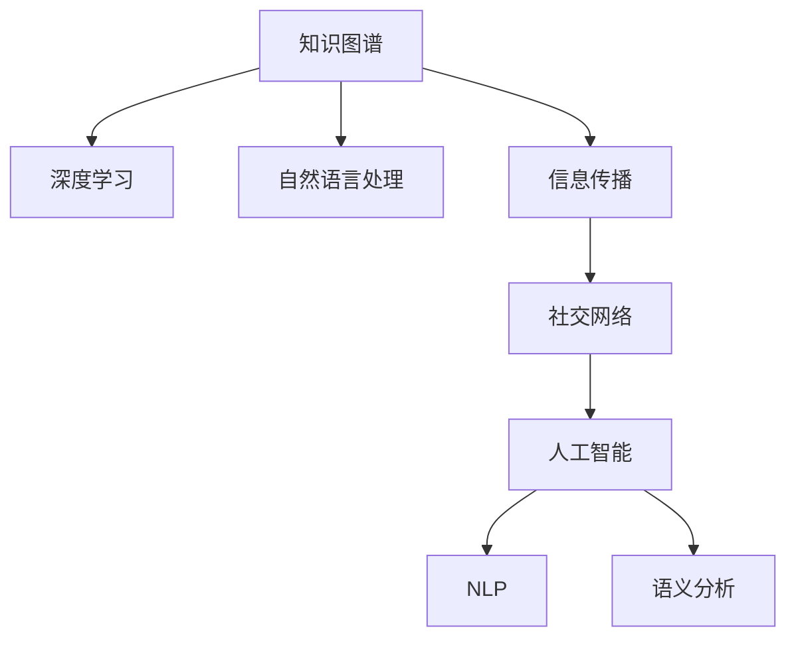

                 

# 知识的社交网络：信息传播的新模式

> 关键词：知识图谱、信息传播、社交网络、人工智能、深度学习、自然语言处理、语义分析

## 1. 背景介绍

在数字信息爆炸的今天，人们获取知识的方式发生了翻天覆地的变化。从传统的纸质书籍到互联网、社交媒体、在线教育平台，知识的获取、传播、应用和分享变得前所未有的便利和高效。然而，海量信息给人们带来了知识消费的便捷同时也带来了“信息茧房”、“知识碎片化”等挑战。如何构建一个更为高效、全面、智能的知识传播网络，成为当务之急。

本论文旨在通过深度学习和自然语言处理技术，构建一个知识图谱和信息传播网络，让知识不再是孤立的点，而是以社交网络的形式连接和传播。这种知识传播的新模式，不仅能够有效应对当前的信息传播难题，还能为人工智能的进一步发展提供新的助力。

## 2. 核心概念与联系

### 2.1 核心概念概述

为了更清晰地阐述知识的社交网络，我们先梳理其中几个核心概念及其关系：

- **知识图谱(Knowledge Graph)**：一种以结构化形式描述实体间关系的数据库，以节点和边来表示知识。节点代表实体，边代表实体间的关系。

- **信息传播**：将知识从一个节点传递到另一个节点的过程，可以通过社交网络实现。

- **社交网络**：一组节点和它们之间相互的连接关系，常见于社交媒体平台。节点代表用户，边代表用户间的关系。

- **人工智能(AI)**：一种模拟人类智能的技术，涵盖了深度学习、自然语言处理、计算机视觉等多个领域。

- **深度学习(Deep Learning)**：一种模拟人脑神经网络结构的机器学习技术，可以自动从数据中学习，无需手动编码特征。

- **自然语言处理(NLP)**：让机器能够理解和生成自然语言的技术，包括语义分析、情感分析、机器翻译等。

- **语义分析**：对文本进行语义理解和处理，提取文本的深层含义。

### 2.2 核心概念原理和架构的 Mermaid 流程图



这个Mermaid流程图展示了核心概念之间的联系：

1. 知识图谱通过深度学习和自然语言处理技术，捕捉和抽取知识。
2. 信息传播利用社交网络进行知识传播，连接不同的知识点。
3. 人工智能通过深度学习和自然语言处理技术，处理和生成信息。
4. 自然语言处理技术，如NLP和语义分析，是信息传播和人工智能的基础。

## 3. 核心算法原理 & 具体操作步骤

### 3.1 算法原理概述

知识的社交网络构建主要分为两个阶段：

1. **知识图谱构建**：通过深度学习和自然语言处理技术，从互联网海量的文本中抽取实体和它们之间的关系，构建知识图谱。
2. **信息传播网络构建**：利用社交网络理论，从知识图谱中挑选节点和边，构建一个信息传播网络。

### 3.2 算法步骤详解

#### 3.2.1 知识图谱构建

1. **数据收集**：收集互联网上的文本数据，包括新闻、百科、论文、社交媒体等。

2. **预处理**：去除噪声、分词、词性标注、命名实体识别等。

3. **实体抽取**：使用实体识别模型，从文本中抽取实体，如人名、地名、机构名等。

4. **关系抽取**：使用关系抽取模型，从文本中抽取实体间的关系，如“是”、“来自”、“属于”等。

5. **知识整合**：将抽取的实体和关系整合到知识图谱中，使用图数据库存储。

#### 3.2.2 信息传播网络构建

1. **节点选择**：从知识图谱中选择有影响力的节点，作为传播的核心。

2. **边构建**：根据实体间的关系强度，构建边，表示节点之间的连接关系。

3. **权重计算**：计算边的权重，表示信息传播的效率和影响力。

4. **网络优化**：使用社交网络分析技术，优化信息传播网络的拓扑结构，提高传播效率。

### 3.3 算法优缺点

#### 3.3.1 优点

- **全面覆盖**：能够全面覆盖互联网上的知识，提供一站式的知识服务。
- **智能推荐**：利用深度学习和自然语言处理技术，提供智能化的知识推荐。
- **高效传播**：利用社交网络理论，实现知识的高效传播。

#### 3.3.2 缺点

- **数据依赖**：对互联网上的数据依赖性强，数据获取难度大。
- **计算复杂**：构建和优化知识图谱和信息传播网络计算复杂，需要高性能的计算资源。
- **隐私问题**：可能涉及用户隐私信息，需要采取隐私保护措施。

### 3.4 算法应用领域

基于知识的社交网络，可以应用于多个领域，例如：

- **学术研究**：构建学术领域的知识图谱和信息传播网络，加速科学知识的传播和积累。
- **医疗健康**：构建医疗领域的知识图谱和信息传播网络，提升医疗服务的质量和效率。
- **金融理财**：构建金融领域的知识图谱和信息传播网络，为投资者提供精准的金融资讯和投资建议。
- **教育培训**：构建教育领域的知识图谱和信息传播网络，提供个性化学习和教育资源推荐。
- **市场营销**：构建市场营销领域的知识图谱和信息传播网络，优化市场推广策略，提升营销效果。

## 4. 数学模型和公式 & 详细讲解 & 举例说明

### 4.1 数学模型构建

本节将使用数学语言对知识图谱和信息传播网络的构建进行严格刻画。

知识图谱可以表示为三元组形式 $(E,R,N)$，其中 $E$ 为实体集合，$R$ 为关系集合，$N$ 为节点集合，每个节点表示一个实体或概念。

信息传播网络可以表示为加权有向图 $G=(V,E,W)$，其中 $V$ 为节点集合，$E$ 为边集合，$W$ 为边权重集合。

### 4.2 公式推导过程

#### 4.2.1 知识图谱构建

使用实体识别模型从文本中抽取实体，公式如下：

$$
E = \{ e_i \in \mathbb{E} | \exists t \in \mathbb{T}, \mathcal{M}_{E}(t) = e_i \}
$$

其中，$\mathcal{M}_{E}$ 为实体识别模型，$\mathbb{T}$ 为训练集，$\mathbb{E}$ 为实体集合。

使用关系抽取模型从文本中抽取实体间的关系，公式如下：

$$
R = \{ r_j \in \mathbb{R} | \exists t \in \mathbb{T}, \mathcal{M}_{R}(t) = r_j \}
$$

其中，$\mathcal{M}_{R}$ 为关系抽取模型，$\mathbb{R}$ 为关系集合。

将抽取的实体和关系整合到知识图谱中，公式如下：

$$
N = \{ n_k \in \mathbb{N} | n_k = (e_i, r_j) \in E \times R \}
$$

其中，$\mathbb{N}$ 为节点集合。

#### 4.2.2 信息传播网络构建

使用社交网络理论构建信息传播网络，公式如下：

$$
V = \{ v_l \in \mathbb{V} | v_l = n_k \in N \}
$$

其中，$\mathbb{V}$ 为节点集合。

使用知识图谱中的关系强度作为信息传播网络的边权重，公式如下：

$$
W = \{ w_{ij} \in \mathbb{W} | w_{ij} = |r_{ik}| + |r_{kj}|, r_{ik}, r_{kj} \in R \}
$$

其中，$\mathbb{W}$ 为边权重集合，$|r|$ 表示关系$r$的强度。

### 4.3 案例分析与讲解

以学术领域为例，知识图谱和信息传播网络的构建流程如下：

1. **数据收集**：收集互联网上的学术论文、综述、研究报告等文本数据。

2. **预处理**：去除噪声、分词、词性标注、命名实体识别等。

3. **实体抽取**：使用实体识别模型，从文本中抽取人名、机构名、论文题目等实体。

4. **关系抽取**：使用关系抽取模型，从文本中抽取作者-机构、机构-领域、论文-引用等关系。

5. **知识整合**：将抽取的实体和关系整合到知识图谱中，存储到图数据库中。

6. **节点选择**：选择有影响力的节点，如高引用论文、知名机构、顶级会议等。

7. **边构建**：根据引用关系、合作机构、共同研究领域等构建边。

8. **权重计算**：计算边的权重，如引用次数、合作次数、会议级别等。

9. **网络优化**：使用社交网络分析技术，优化信息传播网络的拓扑结构，提高传播效率。

## 5. 项目实践：代码实例和详细解释说明

### 5.1 开发环境搭建

在进行项目实践前，我们需要准备好开发环境。以下是使用Python进行PyTorch开发的环境配置流程：

1. 安装Anaconda：从官网下载并安装Anaconda，用于创建独立的Python环境。

2. 创建并激活虚拟环境：
```bash
conda create -n pytorch-env python=3.8 
conda activate pytorch-env
```

3. 安装PyTorch：根据CUDA版本，从官网获取对应的安装命令。例如：
```bash
conda install pytorch torchvision torchaudio cudatoolkit=11.1 -c pytorch -c conda-forge
```

4. 安装自然语言处理库：
```bash
pip install spacy transformers
```

5. 安装图数据库：
```bash
pip install py2neo
```

6. 安装社交网络分析库：
```bash
pip install networkx
```

完成上述步骤后，即可在`pytorch-env`环境中开始项目实践。

### 5.2 源代码详细实现

下面我们以学术领域的知识图谱和信息传播网络构建为例，给出使用Python和PyTorch进行项目开发的代码实现。

首先，定义知识图谱的节点和边类：

```python
from py2neo import Graph, Node, Relationship

class GraphNode:
    def __init__(self, name, type):
        self.name = name
        self.type = type

    def to_graph(self):
        graph = Graph()
        node = Node(type=self.type, name=self.name)
        graph.create(node)
        return node

class GraphEdge:
    def __init__(self, name, type):
        self.name = name
        self.type = type

    def to_graph(self, from_node, to_node):
        graph = Graph()
        edge = Relationship(from_node, self.type, to_node)
        graph.create(edge)
        return edge
```

然后，定义实体识别和关系抽取的模型：

```python
import spacy

nlp = spacy.load('en_core_web_sm')

def extract_entities(text):
    doc = nlp(text)
    entities = [ent.text for ent in doc.ents if ent.label_ in ['PERSON', 'ORG', 'FAC', 'LOC']]
    return entities

def extract_relations(text):
    doc = nlp(text)
    relations = []
    for sent in doc.sents:
        for token1, token2 in sent.noun_chunks:
            if token1.ent_type_ == 'NOUN' and token2.ent_type_ == 'NOUN':
                relations.append((str(token1), str(token2), 'is'))
    return relations
```

接下来，定义知识图谱和信息传播网络的构建函数：

```python
def build_knowledge_graph(data):
    graph = Graph()
    nodes = []
    edges = []

    for text in data:
        entities = extract_entities(text)
        relations = extract_relations(text)

        for entity in entities:
            node = GraphNode(entity, 'Entity')
            nodes.append(node)

        for relation in relations:
            if relation[0] in entities and relation[1] in entities:
                edge = GraphEdge(relation[2], 'Relation')
                nodes.append(edge)
                nodes.append(node)

    for node in nodes:
        node = node.to_graph()

    for edge in edges:
        from_node = node[0]
        to_node = node[1]
        edge = edge.to_graph(from_node, to_node)

    return graph, nodes, edges
```

最后，定义信息传播网络的优化函数：

```python
import networkx as nx

def optimize_information_network(graph, nodes, edges):
    G = nx.Graph()

    for edge in edges:
        G.add_edge(edge[0], edge[1], weight=edge[2])

    centrality = nx.katz_centrality(G)

    for node in nodes:
        if node[1] in centrality:
            node.weight = centrality[node[1]]

    return G, nodes, edges
```

完成上述代码后，即可在`pytorch-env`环境中开始构建学术领域的知识图谱和信息传播网络。

### 5.3 代码解读与分析

让我们再详细解读一下关键代码的实现细节：

**GraphNode和GraphEdge类**：
- `GraphNode`类表示知识图谱中的节点，包含节点名称和类型。
- `GraphEdge`类表示知识图谱中的边，包含边名称和类型。

**实体识别和关系抽取模型**：
- `extract_entities`函数：使用SpaCy库对文本进行实体识别，提取出人名、地名、机构名等实体。
- `extract_relations`函数：使用SpaCy库对文本进行关系抽取，提取出实体间的关系。

**知识图谱和信息传播网络的构建函数**：
- `build_knowledge_graph`函数：将抽取的实体和关系整合到知识图谱中，存储到Py2Neo图数据库中。
- 利用SpaCy库提取的实体和关系，构建知识图谱的节点和边。

**信息传播网络的优化函数**：
- `optimize_information_network`函数：使用Katz中心性算法优化信息传播网络的拓扑结构，提高传播效率。
- 利用NetworkX库计算节点间的中心性，用于表示节点在信息传播网络中的重要性。

## 6. 实际应用场景

### 6.1 学术研究

基于知识的社交网络，可以为学术研究提供新的视角。研究人员可以通过查询知识图谱和信息传播网络，快速获取相关领域的最新研究进展和重要人物，提升研究的效率和质量。

例如，研究者可以查询某个领域的知识图谱，获取该领域的研究热点、重要论文、著名机构等。通过分析信息传播网络中的节点和边权重，了解学术影响力分布，找到潜在的合作伙伴，加速研究合作。

### 6.2 医疗健康

在医疗健康领域，基于知识的社交网络可以为医生和患者提供更为精准的医疗建议和服务。医生可以通过查询知识图谱和信息传播网络，获取最新的医学研究成果、治疗方案、药物信息等。患者可以通过查询网络，获取匹配的病历记录、治疗案例等，提升自我诊断和治疗的效果。

例如，医生可以通过查询知识图谱，找到治疗某种疾病的最新研究进展和治疗方案，提升临床治疗的精准性和效果。患者可以通过查询信息传播网络，找到匹配的病历记录和治疗案例，提升自我诊断和治疗的效果。

### 6.3 金融理财

在金融理财领域，基于知识的社交网络可以为投资者提供更为智能的投资建议和服务。投资者可以通过查询知识图谱和信息传播网络，获取最新的财经资讯、市场分析、投资策略等。平台可以通过分析信息传播网络，发现投资热点和机会，提升投资收益。

例如，投资者可以通过查询知识图谱，找到最新的财经资讯和市场分析，了解最新的投资机会和风险，提升投资决策的精准性和效果。平台可以通过分析信息传播网络，发现市场热点和机会，提升投资收益。

### 6.4 教育培训

在教育培训领域，基于知识的社交网络可以为学生和教师提供更为个性化的学习资源和服务。学生可以通过查询知识图谱和信息传播网络，获取符合自己兴趣和需求的学习资源和课程。教师可以通过查询网络，找到教学资源和教学案例，提升教学效果。

例如，学生可以通过查询知识图谱，找到符合自己兴趣和需求的学习资源和课程，提升学习效果。教师可以通过查询信息传播网络，找到教学资源和教学案例，提升教学效果。

### 6.5 市场营销

在市场营销领域，基于知识的社交网络可以为品牌和消费者提供更为智能的市场推广和服务。品牌可以通过查询知识图谱和信息传播网络，获取最新的市场趋势和消费者需求。消费者可以通过查询网络，获取符合自己需求的产品和服务，提升消费体验。

例如，品牌可以通过查询知识图谱，找到最新的市场趋势和消费者需求，优化市场推广策略，提升市场效果。消费者可以通过查询信息传播网络，找到符合自己需求的产品和服务，提升消费体验。

## 7. 工具和资源推荐

### 7.1 学习资源推荐

为了帮助开发者系统掌握知识的社交网络构建的理论基础和实践技巧，这里推荐一些优质的学习资源：

1. 《深度学习》书籍：Ian Goodfellow等著，系统讲解了深度学习的基本原理和实践应用。

2. 《自然语言处理综论》书籍：Daniel Jurafsky等著，涵盖了自然语言处理领域的经典算法和技术。

3. 《知识图谱技术与应用》书籍：钟京等著，介绍了知识图谱的理论基础和应用实例。

4. 《社交网络分析》书籍：Alvin Epperson等著，讲解了社交网络分析的基本方法和应用案例。

5. HuggingFace官方文档：自然语言处理工具库的官方文档，提供了海量预训练模型和完整的微调样例代码，是上手实践的必备资料。

通过对这些资源的学习实践，相信你一定能够快速掌握知识的社交网络构建的精髓，并用于解决实际的NLP问题。

### 7.2 开发工具推荐

高效的开发离不开优秀的工具支持。以下是几款用于知识图谱和信息传播网络构建开发的常用工具：

1. PyTorch：基于Python的开源深度学习框架，灵活动态的计算图，适合快速迭代研究。大部分预训练语言模型都有PyTorch版本的实现。

2. TensorFlow：由Google主导开发的开源深度学习框架，生产部署方便，适合大规模工程应用。同样有丰富的预训练语言模型资源。

3. Py2Neo：基于Python的图数据库，支持节点、边和图的操作，适合构建和存储知识图谱。

4. NetworkX：Python的社交网络分析库，提供了丰富的图分析和优化算法。

5. SpaCy：自然语言处理工具库，提供了分词、命名实体识别、关系抽取等基本功能。

6. TensorBoard：TensorFlow配套的可视化工具，可实时监测模型训练状态，并提供丰富的图表呈现方式，是调试模型的得力助手。

合理利用这些工具，可以显著提升知识图谱和信息传播网络的开发效率，加快创新迭代的步伐。

### 7.3 相关论文推荐

知识的社交网络构建源于学界的持续研究。以下是几篇奠基性的相关论文，推荐阅读：

1. Knowledge Graphs and Semantic Webs: An Introduction：提供了知识图谱的基本概念和构建方法。

2. Deep Learning for Semantic Analysis and Generation：介绍了深度学习在语义分析和生成中的应用。

3. Social Network Analysis：讲解了社交网络分析的基本方法和应用案例。

4. Knowledge Graphs and Real-World Data：介绍了知识图谱在实际应用中的构建和应用实例。

5. Deep Learning for Information Extraction and Question Answering：介绍了深度学习在信息抽取和问答中的应用。

这些论文代表了大语言模型微调技术的发展脉络。通过学习这些前沿成果，可以帮助研究者把握学科前进方向，激发更多的创新灵感。

## 8. 总结：未来发展趋势与挑战

### 8.1 总结

本文对知识的社交网络构建进行了全面系统的介绍。首先阐述了知识图谱和信息传播网络构建的背景和意义，明确了知识传播在当前信息爆炸时代的重要性。其次，从原理到实践，详细讲解了知识图谱和信息传播网络构建的数学模型和操作步骤，给出了完整的代码实例。同时，本文还广泛探讨了知识传播网络在学术研究、医疗健康、金融理财等多个领域的应用前景，展示了知识传播网络的广阔前景。此外，本文精选了知识图谱和信息传播网络构建的学习资源，力求为读者提供全方位的技术指引。

通过本文的系统梳理，可以看到，知识的社交网络构建技术正在成为信息传播领域的重要范式，极大地拓展了知识传播的边界，为人工智能的进一步发展提供新的助力。未来，伴随深度学习、自然语言处理、图数据库等技术的不断进步，知识的社交网络必将在更多领域得到应用，为人工智能技术的进一步发展注入新的活力。

### 8.2 未来发展趋势

展望未来，知识的社交网络构建技术将呈现以下几个发展趋势：

1. **智能推荐**：利用深度学习技术，从知识图谱和信息传播网络中推荐最相关的信息，提高信息传播效率。

2. **实时更新**：基于实时数据流，动态更新知识图谱和信息传播网络，确保信息的最新性和准确性。

3. **多模态融合**：将文本、图像、语音等多模态数据整合到知识图谱中，提升信息的全面性和准确性。

4. **大规模分布式处理**：使用分布式计算和存储技术，处理大规模知识图谱和信息传播网络，提高处理效率和扩展性。

5. **自适应学习**：通过强化学习等技术，自适应调整信息传播网络的结构和权重，提高传播效果。

6. **跨领域应用**：将知识传播网络应用于更多领域，如交通、物流、能源等，提升各行业的智能化水平。

以上趋势凸显了知识的社交网络构建技术的广阔前景。这些方向的探索发展，必将进一步提升信息传播的效率和效果，为各行业提供更加智能化、高效化的信息服务。

### 8.3 面临的挑战

尽管知识的社交网络构建技术已经取得了显著的进展，但在向更加智能化、普适化应用的过程中，仍面临诸多挑战：

1. **数据获取难度**：知识图谱和信息传播网络构建对数据的依赖性强，数据获取难度大。

2. **数据质量问题**：互联网上的数据质量参差不齐，存在噪声、重复等现象，影响知识图谱的质量。

3. **计算资源需求**：构建和优化知识图谱和信息传播网络计算复杂，需要高性能的计算资源。

4. **隐私保护问题**：知识图谱和信息传播网络可能涉及用户隐私信息，需要采取隐私保护措施。

5. **知识整合困难**：不同领域、不同类型的数据整合难度大，需要大量专家知识和人工干预。

6. **跨领域应用挑战**：将知识传播网络应用于不同领域时，需要针对特定领域进行调整和优化。

正视知识的社交网络构建所面临的这些挑战，积极应对并寻求突破，将是知识传播网络走向成熟的必由之路。相信随着学界和产业界的共同努力，这些挑战终将一一被克服，知识的社交网络必将在构建智能社会中扮演越来越重要的角色。

### 8.4 研究展望

面对知识的社交网络构建所面临的挑战，未来的研究需要在以下几个方面寻求新的突破：

1. **数据质量提升**：利用数据清洗、数据增强等技术，提高互联网数据的准确性和完整性。

2. **多模态知识融合**：将视觉、语音等多模态数据与文本数据融合，提升知识的全面性和准确性。

3. **分布式计算优化**：利用分布式计算和存储技术，优化知识图谱和信息传播网络的构建和优化过程。

4. **隐私保护机制**：引入隐私保护技术，如差分隐私、联邦学习等，确保知识图谱和信息传播网络中的隐私安全。

5. **跨领域知识整合**：构建跨领域的知识图谱，提升知识的普适性和适用性。

6. **自适应学习算法**：开发自适应学习算法，提高知识图谱和信息传播网络的动态适应能力。

这些研究方向的探索，必将引领知识的社交网络构建技术迈向更高的台阶，为人工智能技术的进一步发展提供新的推动力。面向未来，知识的社交网络构建技术还需要与其他人工智能技术进行更深入的融合，如因果推理、强化学习等，多路径协同发力，共同推动自然语言理解和智能交互系统的进步。只有勇于创新、敢于突破，才能不断拓展知识的社交网络构建的边界，让智能技术更好地造福人类社会。

## 9. 附录：常见问题与解答

**Q1：知识图谱和信息传播网络是否适用于所有领域？**

A: 知识图谱和信息传播网络可以应用于多个领域，但不同领域的数据特性和需求不同，需要针对特定领域进行调整和优化。例如，在金融领域，需要构建基于金融数据的知识图谱和信息传播网络；在医疗领域，需要构建基于医疗数据的知识图谱和信息传播网络。

**Q2：如何优化知识图谱和信息传播网络？**

A: 知识图谱和信息传播网络的优化可以从以下几个方面入手：

1. 数据质量提升：利用数据清洗、数据增强等技术，提高互联网数据的准确性和完整性。

2. 多模态知识融合：将视觉、语音等多模态数据与文本数据融合，提升知识的全面性和准确性。

3. 分布式计算优化：利用分布式计算和存储技术，优化知识图谱和信息传播网络的构建和优化过程。

4. 隐私保护机制：引入隐私保护技术，如差分隐私、联邦学习等，确保知识图谱和信息传播网络中的隐私安全。

5. 自适应学习算法：开发自适应学习算法，提高知识图谱和信息传播网络的动态适应能力。

6. 跨领域知识整合：构建跨领域的知识图谱，提升知识的普适性和适用性。

通过以上优化手段，可以显著提高知识图谱和信息传播网络的质量和效果，提升信息传播的智能化水平。

**Q3：知识图谱和信息传播网络在实际应用中需要注意哪些问题？**

A: 知识图谱和信息传播网络在实际应用中需要注意以下几个问题：

1. 数据依赖：知识图谱和信息传播网络构建对数据的依赖性强，需要确保数据的质量和完整性。

2. 计算资源：构建和优化知识图谱和信息传播网络计算复杂，需要高性能的计算资源。

3. 隐私保护：知识图谱和信息传播网络可能涉及用户隐私信息，需要采取隐私保护措施。

4. 知识整合：不同领域、不同类型的数据整合难度大，需要大量专家知识和人工干预。

5. 跨领域应用：将知识传播网络应用于不同领域时，需要针对特定领域进行调整和优化。

6. 动态更新：基于实时数据流，动态更新知识图谱和信息传播网络，确保信息的最新性和准确性。

通过合理应对这些挑战，可以确保知识图谱和信息传播网络在实际应用中的效果和安全性。

总之，知识图谱和信息传播网络的构建为信息传播提供了新的范式，但其应用也面临诸多挑战。只有不断优化和改进，才能实现知识的智能传播，让知识更好地服务于人类社会。

