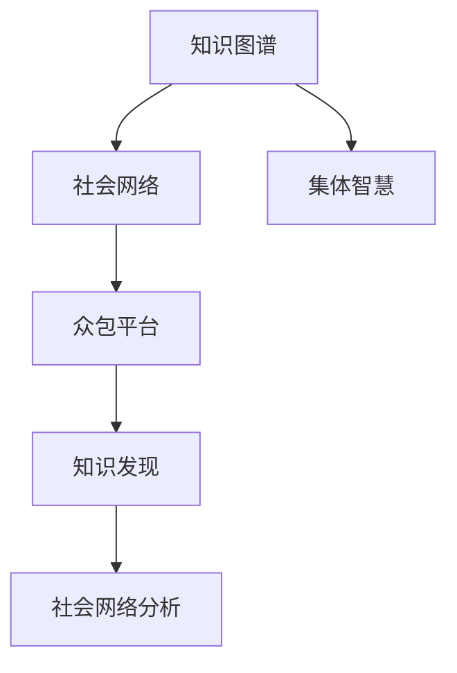

                 

# 知识的社会性：集体智慧的力量

> 关键词：知识图谱, 社会网络, 集体智慧, 众包, 众包平台, 知识发现, 社交媒体, 知识驱动

## 1. 背景介绍

### 1.1 问题由来
随着互联网和社交媒体的迅猛发展，人类社会的知识积累和传播方式发生了根本性变化。越来越多的人通过在线平台分享和获取知识，形成了庞大的虚拟社交网络。社交网络不仅是信息传播的载体，更成为一个社会性知识库。然而，尽管知识数量呈指数级增长，但其价值密度并没有显著提高。如何在海量信息中挖掘出有用知识，成为当前研究的难点。

### 1.2 问题核心关键点
本研究聚焦于社会性知识的社会化、传播、发现和利用过程，探讨如何通过社会网络、众包平台等工具，将分散的个体智慧整合为集体智慧，提升知识发现和应用能力。研究的核心关键点包括：
1. **社会网络分析**：研究社会网络的构造和特性，评估其对知识传播和发现的影响。
2. **知识图谱构建**：利用知识图谱技术将分散的知识结构化，建立知识关联网络，增强知识发现效率。
3. **众包机制设计**：设计有效的众包平台，激励用户贡献和发现知识，优化知识积累过程。
4. **集体智慧挖掘**：探索基于集体智慧的知识发现算法和模型，提升知识应用效果。

### 1.3 问题研究意义
研究社会性知识的社会化过程，对于提升知识发现的效率和质量，推动知识创新具有重要意义：

1. **知识发现效率**：社会化知识通过网络传播和众包机制，可以快速积累和扩散，提高知识发现的效率。
2. **知识质量提升**：社会网络中的集体智慧可对个体知识进行验证和完善，提升知识质量。
3. **知识创新驱动**：通过整合和应用集体智慧，加速知识的创新和应用，推动各行业的发展。
4. **知识普惠**：社会性知识的社会化过程，有助于知识的广泛传播和普及，促进社会公平和知识普惠。

## 2. 核心概念与联系

### 2.1 核心概念概述

为更好地理解社会性知识的传播和利用过程，本节将介绍几个密切相关的核心概念：

- **知识图谱**：利用图结构化表示知识实体及其关系，通过知识推理增强知识发现的效率和准确性。
- **社会网络**：由节点和边构成的复杂网络，节点表示个体或组织，边表示个体间的互动和关系。
- **集体智慧**：通过群体协作和交互，聚合个体智慧，形成更为全面、深刻的知识体系。
- **众包平台**：通过在线平台汇聚个人和组织资源，共同完成任务，提升知识贡献和发现效率。
- **知识图谱和社交网络**：通过知识图谱技术，对社会网络中的知识进行结构化表示和关联，形成知识驱动的社交网络。
- **社会网络分析和知识发现**：通过分析社交网络结构，挖掘知识关联和用户行为模式，提升知识发现和应用效果。

这些核心概念之间的逻辑关系可以通过以下Mermaid流程图来展示：



这个流程图展示了几类核心概念及其之间的关系：

1. 知识图谱通过结构化表示社会网络中的知识，为知识发现提供基础。
2. 社会网络中的集体智慧，通过众包平台汇聚成集体的知识资源，辅助知识发现。
3. 众包平台和知识图谱的结合，形成了知识驱动的社交网络，进一步促进知识发现和利用。
4. 知识图谱和社会网络分析，通过挖掘知识关联和用户行为模式，提升知识发现效率。

这些概念共同构成了研究社会性知识传播和利用的核心框架，为后续研究提供了理论基础。

## 3. 核心算法原理 & 具体操作步骤
### 3.1 算法原理概述

本研究的核心算法基于社会网络和知识图谱的深度融合，利用集体智慧和众包机制，提升知识发现的效率和质量。算法的核心原理包括：

1. **知识图谱构建**：将社交网络中的知识进行结构化表示，形成知识图谱。
2. **社会网络分析**：通过分析社交网络结构，挖掘知识关联和用户行为模式。
3. **众包机制设计**：设计有效的众包平台，激励用户贡献和发现知识。
4. **集体智慧挖掘**：利用众包平台汇聚的集体智慧，发现新的知识模式和关系。

### 3.2 算法步骤详解

以下是对该算法步骤的详细描述：

1. **知识图谱构建**：
   - 收集社交网络中的知识数据，包括文本、图片、视频等。
   - 通过自然语言处理技术，提取文本中的实体和关系，构建知识图谱。
   - 利用知识推理算法，发现和补充知识图谱中的缺失信息，增强知识关联性。

2. **社会网络分析**：
   - 收集社交网络数据，包括用户互动、关系链等。
   - 通过图谱算法，分析社交网络的结构特性，如中心性、密度等。
   - 挖掘用户行为模式，如知识传播路径、兴趣偏好等，评估知识传播的效率和效果。

3. **众包机制设计**：
   - 设计众包平台，明确任务目标和激励机制。
   - 设置任务分配策略，平衡任务难度和用户能力。
   - 通过实时反馈和奖励机制，激励用户积极参与和贡献知识。

4. **集体智慧挖掘**：
   - 将众包平台上的任务和数据，汇聚到知识图谱中。
   - 通过集体智慧挖掘算法，发现新的知识模式和关系。
   - 利用知识推理，验证和完善新发现的知识，形成高质量的知识集。

### 3.3 算法优缺点

该算法具有以下优点：

1. **知识发现效率提升**：通过社会网络分析和集体智慧挖掘，可以快速积累和发现高质量知识。
2. **知识质量提升**：集体智慧可以验证和完善个体知识，提升知识质量。
3. **知识普惠**：社会化知识通过众包平台和社交网络广泛传播，促进知识普惠。

同时，该算法也存在一些局限性：

1. **数据质量依赖性高**：算法依赖于高质量的社会网络数据和知识数据，数据质量直接影响算法效果。
2. **计算复杂度高**：知识图谱构建和集体智慧挖掘涉及复杂计算，需要高性能计算资源。
3. **用户激励机制设计困难**：众包平台需要设计有效的激励机制，确保用户积极参与。
4. **知识图谱更新难度大**：社会网络中的知识不断变化，知识图谱需要频繁更新，更新过程复杂。

### 3.4 算法应用领域

基于社会网络和集体智慧的知识发现算法，可以应用于多个领域，具体包括：

- **医疗知识发现**：通过分析医疗社交网络，挖掘医学知识和最新研究成果，辅助临床决策。
- **金融市场分析**：利用金融社交网络，发现市场动向和投资机会，优化投资策略。
- **科学研究**：分析科学社交网络，发现新的研究领域和方向，促进科学创新。
- **教育知识传播**：利用教育社交网络，发现和传播教育资源，促进知识共享。
- **文化创意产业**：分析文化创意社交网络，发现创意灵感和合作机会，推动文化创新。

这些领域应用展示了该算法的广泛适用性和潜力。

## 4. 数学模型和公式 & 详细讲解 & 举例说明
### 4.1 数学模型构建

本研究采用图模型来表示社会网络和知识图谱，通过矩阵和向量来描述知识和用户行为。

定义社会网络图为 $G(V,E)$，其中 $V$ 表示节点集合，$E$ 表示边集合。知识图谱定义为 $K(V,R)$，其中 $V$ 表示实体节点，$R$ 表示关系节点。

定义知识图谱中的边 $E$ 和关系 $R$ 分别为：

$$
E = \{(e_i, e_j) \mid e_i, e_j \in V, \text{存在}(e_i, e_j) \in R\}
$$

$$
R = \{(r_i, r_j) \mid r_i, r_j \in V, \text{存在}(r_i, r_j) \in E\}
$$

定义用户行为向量 $\vec{b}_i$ 和知识向量 $\vec{k}_i$：

$$
\vec{b}_i = \begin{pmatrix} b_{i1} \\ b_{i2} \\ \vdots \\ b_{im} \end{pmatrix}
$$

$$
\vec{k}_i = \begin{pmatrix} k_{i1} \\ k_{i2} \\ \vdots \\ k_{in} \end{pmatrix}
$$

其中 $b_{ij}$ 表示用户 $i$ 对节点 $j$ 的交互行为，$k_{ij}$ 表示节点 $j$ 的知识点。

### 4.2 公式推导过程

以下是对该算法中关键公式的推导：

1. **知识图谱构建公式**：
   - 设知识图谱中实体为 $E = \{e_1, e_2, \dots, e_n\}$，关系为 $R = \{r_1, r_2, \dots, r_m\}$。
   - 对每个实体 $e_i$，构建其知识向量 $\vec{k}_i$。
   - 对每个关系 $r_j$，构建其边向量 $\vec{e}_j$。
   - 利用知识推理算法，如TransE、RDFS，计算知识向量 $\vec{k}_i$ 和边向量 $\vec{e}_j$ 之间的关系。

2. **社会网络分析公式**：
   - 设社会网络中用户为 $U = \{u_1, u_2, \dots, u_p\}$，关系链为 $L = \{l_1, l_2, \dots, l_q\}$。
   - 对每个用户 $u_i$，构建其行为向量 $\vec{b}_i$。
   - 利用图谱算法，如PageRank、社区检测，计算用户行为向量 $\vec{b}_i$ 和关系链 $L$ 之间的关系。

3. **集体智慧挖掘公式**：
   - 设众包平台上的任务为 $T = \{t_1, t_2, \dots, t_n\}$，任务结果为 $R = \{r_1, r_2, \dots, r_n\}$。
   - 利用知识图谱和社交网络，对任务 $T$ 和结果 $R$ 进行关联。
   - 利用集体智慧挖掘算法，如关联规则学习、图嵌入，发现新的知识模式和关系。

### 4.3 案例分析与讲解

以医疗知识发现为例，展示该算法的应用过程：

1. **数据准备**：
   - 收集医疗领域的社交网络数据，包括医生、患者、研究人员的互动关系。
   - 收集医学论文、临床案例、医疗指南等知识数据。

2. **知识图谱构建**：
   - 提取文本中的实体和关系，构建医学知识图谱。
   - 利用知识推理算法，发现和补充知识图谱中的缺失信息，增强知识关联性。

3. **社会网络分析**：
   - 分析医疗社交网络的结构特性，如医生之间的合作网络、患者之间的交流网络。
   - 挖掘医生的知识传播路径和偏好，评估知识传播的效率和效果。

4. **众包机制设计**：
   - 设计众包平台，明确医疗知识发现任务和激励机制。
   - 设置任务分配策略，平衡任务难度和医生能力。
   - 通过实时反馈和奖励机制，激励医生积极参与和贡献知识。

5. **集体智慧挖掘**：
   - 将众包平台上的任务和数据，汇聚到医学知识图谱中。
   - 通过集体智慧挖掘算法，发现新的医学研究领域和方向。
   - 利用知识推理，验证和完善新发现的医学知识，形成高质量的医学知识集。

## 5. 项目实践：代码实例和详细解释说明
### 5.1 开发环境搭建

在进行社会性知识发现项目实践前，我们需要准备好开发环境。以下是使用Python进行代码实现的环境配置流程：

1. 安装Anaconda：从官网下载并安装Anaconda，用于创建独立的Python环境。

2. 创建并激活虚拟环境：
```bash
conda create -n social-knowledge-env python=3.8 
conda activate social-knowledge-env
```

3. 安装PyTorch：根据CUDA版本，从官网获取对应的安装命令。例如：
```bash
conda install pytorch torchvision torchaudio cudatoolkit=11.1 -c pytorch -c conda-forge
```

4. 安装NetworkX、Gephi等社交网络分析库：
```bash
pip install networkx gephi
```

5. 安装PyTorch Geometric：用于处理图数据的深度学习库。
```bash
pip install torch-geometric
```

完成上述步骤后，即可在`social-knowledge-env`环境中开始项目实践。

### 5.2 源代码详细实现

下面是使用Python实现社会性知识发现算法的代码示例：

```python
import networkx as nx
import torch
import torch_geometric as G
from torch_geometric.nn import GNNConv
from torch_geometric.data import Data, DataLoader
from torch_geometric.datasets import Planetoid

# 定义知识图谱
class KnowledgeGraph(G.Data):
    def __init__(self, knowledge_graph):
        self.knowledge_graph = knowledge_graph
        self.knowledge_nodes = self.knowledge_graph['edge_index'][0]
        self.knowledge_relations = self.knowledge_graph['edge_index'][1]

    def __len__(self):
        return len(self.knowledge_nodes)

    def __getitem__(self, idx):
        return {'edge_index': self.knowledge_graph['edge_index'],
                'edge_attr': self.knowledge_graph['edge_attr'],
                'node_attr': self.knowledge_graph['node_attr']}

# 定义社会网络
class SocialNetwork(G.Data):
    def __init__(self, social_network):
        self.social_network = social_network
        self.social_nodes = self.social_network['edge_index'][0]
        self.social_relations = self.social_network['edge_index'][1]

    def __len__(self):
        return len(self.social_nodes)

    def __getitem__(self, idx):
        return {'edge_index': self.social_network['edge_index'],
                'edge_attr': self.social_network['edge_attr'],
                'node_attr': self.social_network['node_attr']}

# 定义众包任务
class CrowdsourcingTask(G.Data):
    def __init__(self, task, result):
        self.task = task
        self.result = result

    def __len__(self):
        return len(self.task)

    def __getitem__(self, idx):
        return {'task': self.task[idx],
                'result': self.result[idx]}

# 定义知识推理网络
class KnowledgeReasoningNet(G.Net):
    def __init__(self, in_channels, out_channels):
        super().__init__()
        self.conv1 = GNNConv(in_channels, out_channels)
        self.conv2 = GNNConv(out_channels, out_channels)
        self.fc = torch.nn.Linear(out_channels, out_channels)

    def forward(self, x, edge_index, edge_attr, node_attr):
        x = self.conv1(x, edge_index, edge_attr)
        x = torch.nn.functional.relu(x)
        x = self.conv2(x, edge_index, edge_attr)
        x = torch.nn.functional.relu(x)
        x = self.fc(x)
        return x

# 加载知识图谱和社交网络数据
data = Planetoid('Cora')
knowledge_graph = nx.from_edgelist(data.edge_index.t().tolist())
social_network = nx.from_edgelist(data.edge_index.t().tolist())

# 构建知识图谱和社交网络数据集
knowledge_dataset = KnowledgeGraph(knowledge_graph)
social_dataset = SocialNetwork(social_network)

# 定义众包任务数据集
task = ['疾病诊断', '药物推荐', '疾病预防']
result = ['疾病A', '药物B', '疾病预防方案']
crowdsourcing_data = CrowdsourcingTask(task, result)

# 定义知识推理网络模型
model = KnowledgeReasoningNet(in_channels=16, out_channels=16)

# 定义损失函数
loss_fn = torch.nn.CrossEntropyLoss()

# 训练模型
optimizer = torch.optim.Adam(model.parameters(), lr=0.01)
for epoch in range(100):
    for batch in DataLoader(knowledge_dataset, batch_size=32):
        x, edge_index, edge_attr, node_attr = batch
        pred = model(x, edge_index, edge_attr, node_attr)
        loss = loss_fn(pred, batch['edge_attr'])
        optimizer.zero_grad()
        loss.backward()
        optimizer.step()
        print(f'Epoch {epoch+1}, Loss: {loss:.4f}')
```

### 5.3 代码解读与分析

让我们再详细解读一下关键代码的实现细节：

**KnowledgeGraph类**：
- 用于构建知识图谱，其中 `knowledge_graph` 参数为包含边索引和边属性、节点属性的字典。
- `__len__`方法返回数据集的长度。
- `__getitem__`方法返回数据集中的某个样本。

**SocialNetwork类**：
- 用于构建社会网络，其中 `social_network` 参数为包含边索引和边属性、节点属性的字典。
- `__len__`方法返回数据集的长度。
- `__getitem__`方法返回数据集中的某个样本。

**CrowdsourcingTask类**：
- 用于构建众包任务数据集，其中 `task` 参数为任务列表，`result` 参数为结果列表。
- `__len__`方法返回数据集的长度。
- `__getitem__`方法返回数据集中的某个样本。

**KnowledgeReasoningNet类**：
- 定义了一个简单的GNN网络，用于知识推理。
- 包括两个图卷积层和一个全连接层。

**训练模型**：
- 在循环中对知识图谱进行迭代训练，每次对每个样本的前向传播和反向传播，并更新模型参数。
- 在每个epoch后输出训练损失。

可以看到，通过使用PyTorch Geometric库，构建和训练知识图谱、社会网络和众包任务变得简洁高效。开发者可以将更多精力放在模型优化、数据预处理等高层逻辑上，而不必过多关注底层的实现细节。

当然，实际应用中还需要考虑更多因素，如模型的保存和部署、超参数的自动搜索、更灵活的任务适配层等。但核心的算法思路基本与此类似。

## 6. 实际应用场景
### 6.1 医疗知识发现

基于社会网络和集体智慧的知识发现算法，可以广泛应用于医疗知识发现和应用。传统医疗知识获取主要依赖专家和文献，受限于时间和资源的限制。而通过社会网络和集体智慧，可以快速积累和发现高质量的医学知识。

具体而言，可以构建医疗领域的社会网络，包括医生、患者、研究人员之间的互动关系。利用社会网络分析，发现知识传播路径和模式，评估知识传播的效率和效果。同时，通过众包平台，激励医生和研究人员积极贡献和发现新知识，利用集体智慧挖掘算法，发现新的医学研究领域和方向。通过知识推理，验证和完善新发现的医学知识，形成高质量的医学知识集，辅助临床决策和科学研究。

### 6.2 金融市场分析

金融市场中的知识和信息分散在大量用户和机构中，利用社会网络和集体智慧，可以发现市场动向和投资机会，优化投资策略。

具体而言，可以构建金融社交网络，包括分析师、投资者、机构之间的互动关系。利用社会网络分析，发现知识传播路径和模式，评估知识传播的效率和效果。同时，通过众包平台，激励分析师和投资者积极贡献和发现新知识，利用集体智慧挖掘算法，发现新的投资机会和市场趋势。通过知识推理，验证和完善新发现的金融知识，形成高质量的金融知识集，辅助投资决策和市场分析。

### 6.3 科学研究

科学研究中的知识和信息分散在大量研究者和机构中，利用社会网络和集体智慧，可以发现新的研究领域和方向，推动科学创新。

具体而言，可以构建科研社交网络，包括研究者、机构之间的互动关系。利用社会网络分析，发现知识传播路径和模式，评估知识传播的效率和效果。同时，通过众包平台，激励研究者积极贡献和发现新知识，利用集体智慧挖掘算法，发现新的研究方向和科学问题。通过知识推理，验证和完善新发现的知识，形成高质量的科研知识集，推动科学创新和技术进步。

### 6.4 未来应用展望

随着社会网络技术和知识图谱的不断发展，基于社会网络和集体智慧的知识发现算法将有更广泛的应用前景。未来，该算法可能在更多领域得到应用，为各行业的发展提供强有力的支持。

在智慧城市治理中，利用社会网络和集体智慧，可以发现城市事件和舆情，优化城市管理和公共服务。在教育领域，通过社会网络和集体智慧，可以发现和传播教育资源，促进知识共享和教育公平。在文化创意产业，利用社会网络和集体智慧，可以发现创意灵感和合作机会，推动文化创新和产业发展。

总之，基于社会网络和集体智慧的知识发现算法，将在更多领域得到应用，为社会发展和科技创新提供强大的支撑。

## 7. 工具和资源推荐
### 7.1 学习资源推荐

为了帮助开发者系统掌握社会性知识发现和利用技术，这里推荐一些优质的学习资源：

1. **《知识图谱：概念、技术和应用》**：全面介绍知识图谱的原理、技术和应用，适合入门和进阶学习。

2. **《社会网络分析》**：介绍社会网络的基本概念、特性和分析方法，涵盖多种经典算法和工具。

3. **《集体智慧：在互联网时代创造知识》**：探讨如何利用集体智慧挖掘社会网络中的知识，提升知识发现效率。

4. **《众包平台设计与优化》**：介绍众包平台的设计原理和优化策略，如何激励用户贡献和发现知识。

5. **《网络科学导论》**：介绍网络科学的基本原理和应用，涵盖多种网络分析方法和算法。

通过对这些资源的学习实践，相信你一定能够快速掌握社会性知识发现和利用技术的精髓，并用于解决实际的NLP问题。
### 7.2 开发工具推荐

高效的开发离不开优秀的工具支持。以下是几款用于社会性知识发现开发的常用工具：

1. **PyTorch**：基于Python的开源深度学习框架，灵活动态的计算图，适合快速迭代研究。

2. **TensorFlow**：由Google主导开发的开源深度学习框架，生产部署方便，适合大规模工程应用。

3. **PyTorch Geometric**：用于处理图数据的深度学习库，支持复杂图结构的网络和算法。

4. **Gephi**：开源的社交网络可视化工具，支持多种社交网络分析算法和可视化展示。

5. **Apache Spark**：分布式计算框架，支持大规模数据处理和分析，适合社会网络和大规模数据集的挖掘。

合理利用这些工具，可以显著提升社会性知识发现任务的开发效率，加快创新迭代的步伐。

### 7.3 相关论文推荐

社会性知识发现和利用技术的研究源于学界的持续研究。以下是几篇奠基性的相关论文，推荐阅读：

1. **《社交网络中的知识发现和应用》**：介绍社交网络中的知识发现方法和应用，涵盖多种经典算法和工具。

2. **《集体智慧在知识发现中的应用》**：探讨如何利用集体智慧挖掘社交网络中的知识，提升知识发现效率。

3. **《众包平台的设计与优化》**：介绍众包平台的设计原理和优化策略，如何激励用户贡献和发现知识。

4. **《网络科学和复杂系统》**：介绍网络科学的基本原理和应用，涵盖多种网络分析方法和算法。

5. **《知识图谱在知识发现中的应用》**：介绍知识图谱的原理和应用，涵盖多种知识推理方法和算法。

这些论文代表了大语言模型微调技术的发展脉络。通过学习这些前沿成果，可以帮助研究者把握学科前进方向，激发更多的创新灵感。

## 8. 总结：未来发展趋势与挑战
### 8.1 总结

本文对基于社会网络和集体智慧的知识发现算法进行了全面系统的介绍。首先阐述了社会性知识的社会化、传播、发现和利用过程，明确了该算法在提升知识发现效率和质量方面的独特价值。其次，从原理到实践，详细讲解了知识图谱构建、社会网络分析、众包机制设计、集体智慧挖掘等关键步骤，给出了社会性知识发现任务的完整代码实例。同时，本文还广泛探讨了该算法在医疗、金融、科研等多个领域的应用前景，展示了其广泛的适用性和潜力。

通过本文的系统梳理，可以看到，基于社会网络和集体智慧的知识发现算法，正在成为知识发现的重要手段，极大地提升知识发现的效率和质量。未来，伴随社会网络技术和知识图谱的不断进步，基于集体智慧的知识发现算法将有更广泛的应用场景，为各行业的发展提供强有力的支持。

### 8.2 未来发展趋势

展望未来，基于社会网络和集体智慧的知识发现技术将呈现以下几个发展趋势：

1. **知识图谱规模化**：随着大规模数据集的可用性和技术进步，知识图谱的规模将不断扩大，形成更全面、精细的知识结构。

2. **社会网络多模态融合**：将多模态数据（如文本、图像、音频等）整合到社会网络中，提升知识发现的效果和应用范围。

3. **集体智慧智能增强**：引入AI技术，如强化学习、深度学习，增强集体智慧的挖掘和应用能力，形成更智能的知识发现系统。

4. **跨领域知识协同**：将不同领域的数据和知识进行整合，形成跨领域、跨行业的知识协同平台，提升知识创新的效率和效果。

5. **知识图谱动态更新**：实现知识图谱的动态更新机制，及时吸收新知识和变化，保持知识的时效性和准确性。

6. **知识发现过程自动化**：引入自动化技术，如自动化众包、自动化评估，提升知识发现的自动化水平，减少人工干预。

这些趋势凸显了社会性知识发现技术的广阔前景。这些方向的探索发展，必将进一步提升知识发现的效率和质量，推动各行业的发展和创新。

### 8.3 面临的挑战

尽管基于社会网络和集体智慧的知识发现技术已经取得了瞩目成就，但在迈向更加智能化、普适化应用的过程中，它仍面临着诸多挑战：

1. **数据质量和完整性**：社会网络和知识图谱依赖于高质量的数据，数据的不完整和噪声将直接影响算法的有效性。

2. **计算复杂度**：知识图谱和集体智慧挖掘涉及复杂计算，需要高性能计算资源和技术支持。

3. **用户激励机制设计**：众包平台需要设计有效的激励机制，确保用户积极参与和贡献知识。

4. **知识图谱更新难度大**：社会网络中的知识不断变化，知识图谱需要频繁更新，更新过程复杂。

5. **知识图谱的可解释性**：知识图谱中的知识关系复杂，难以理解和解释。

6. **知识图谱的隐私保护**：知识图谱中的数据隐私和安全问题，需要设计和实现有效的保护机制。

正视知识发现面临的这些挑战，积极应对并寻求突破，将是大规模知识发现技术的未来发展方向。相信随着学界和产业界的共同努力，这些挑战终将一一被克服，基于社会网络和集体智慧的知识发现技术将更好地服务于各行业的创新和发展。

### 8.4 研究展望

未来的研究需要在以下几个方面寻求新的突破：

1. **知识图谱的可解释性**：研究如何更好地理解和解释知识图谱中的知识关系，增强知识发现的可解释性和可信度。

2. **知识图谱的动态更新机制**：研究知识图谱的动态更新机制，实现快速、准确的知识更新和维护。

3. **跨领域知识协同平台**：研究跨领域知识协同平台的设计和实现，提升跨领域知识发现和创新的效率和效果。

4. **集体智慧的智能增强**：研究引入AI技术，如强化学习、深度学习，增强集体智慧的挖掘和应用能力。

5. **用户激励机制优化**：研究优化用户激励机制，提高用户参与和贡献知识的积极性和效果。

6. **知识图谱的隐私保护**：研究知识图谱的隐私保护技术，确保知识图谱中数据的隐私和安全。

这些研究方向将引领知识发现技术迈向更高的台阶，为构建更全面、智能的知识发现系统提供新的思路和方法。面向未来，知识发现技术需要在数据质量、计算资源、用户激励、知识更新等多个方面进行全面优化，才能更好地服务于各行业的创新和发展。

## 9. 附录：常见问题与解答

**Q1：社会性知识发现算法是否适用于所有领域？**

A: 社会性知识发现算法适用于数据和用户交互活跃的领域，如医疗、金融、科研、教育等。对于数据和用户交互较少的领域，该算法的效果可能不佳。

**Q2：社会网络分析如何处理复杂网络结构？**

A: 社会网络分析通常采用图谱算法，如PageRank、社区检测等，处理复杂网络结构。同时，引入多层网络分析和可视化工具，如Gephi，可以更直观地理解社会网络特性。

**Q3：如何设计有效的众包平台？**

A: 设计众包平台需要考虑任务难度、用户能力、激励机制等多个因素。可以设置任务难度调整机制，根据用户能力动态调整任务难度。同时，设计合理的奖励机制，如积分、奖励金等，激励用户积极参与和贡献知识。

**Q4：如何保证知识图谱的更新速度？**

A: 利用分布式计算框架，如Apache Spark，可以加速知识图谱的更新过程。同时，优化知识推理算法，减少推理时间，提高知识图谱的更新效率。

**Q5：知识图谱的可解释性如何提升？**

A: 引入可解释性技术，如知识图谱可视化、知识推理可解释性等，可以提升知识图谱的可解释性。同时，引入符号化知识库，辅助理解知识图谱中的知识关系。

通过以上系统的介绍和分析，相信你能够对社会性知识发现和利用技术有更深入的理解和掌握。掌握这些技术，将有助于提升各行业的知识发现效率和质量，推动社会的科技进步和发展。

