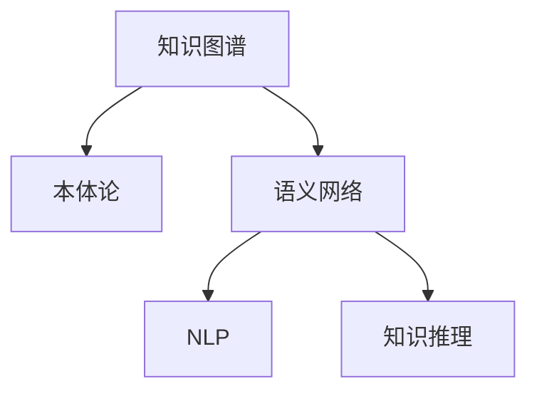
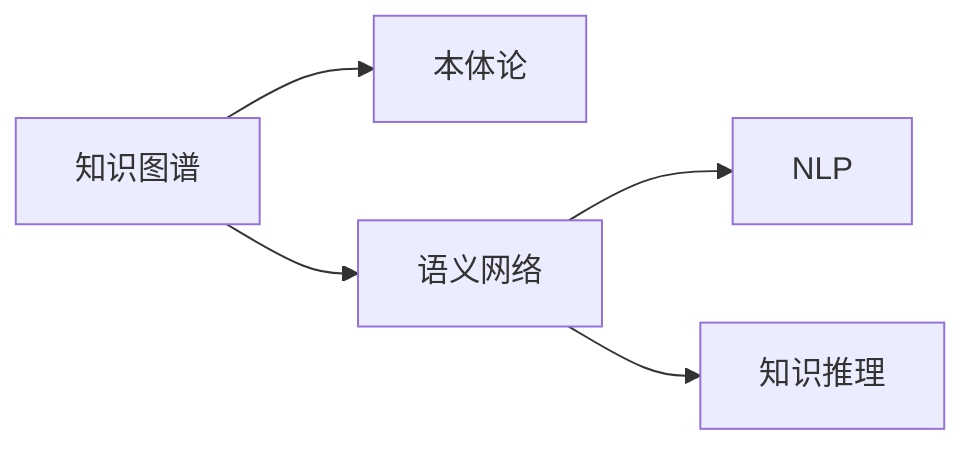

                 

# 知识的结构化：提高记忆和检索效率

## 1. 背景介绍

在信息爆炸的今天，知识的获取和处理变得前所未有的高效。但随之而来的，是如何更好地管理和利用这些知识，让知识结构化地存储和检索，以便在需要时迅速获取并应用于实际问题。本文将从知识结构化的角度出发，探讨如何通过科学的方法和工具，提高记忆和检索效率，助力知识管理领域的创新与发展。

## 2. 核心概念与联系

### 2.1 核心概念概述

知识结构化是指将知识以结构化的形式进行组织和存储，使其更易于理解、记忆、检索和应用。结构化的知识通常具有层次分明、条理清晰的特点，能够通过搜索引擎、知识图谱等工具快速获取和应用。

本文将介绍以下核心概念：

- **知识图谱(Knowledge Graph)**：一种基于图结构的知识表示方法，能够有效整合和关联各种知识信息。
- **本体论(Ontology)**：描述概念、属性和关系的形式化知识库，用于规范和管理知识。
- **语义网络(Semantic Network)**：使用节点和边表示概念和关系的网络结构，支持复杂的知识推理和应用。
- **自然语言处理(Natural Language Processing, NLP)**：利用计算机处理、理解、生成自然语言的技术，用于知识获取和抽取。
- **知识推理(Knowledge Reasoning)**：通过逻辑推理和规则，从已知知识中推导出新知识的方法。

这些核心概念之间通过Mermaid流程图展示它们之间的联系（节点中不包含括号、逗号等特殊字符）：



### 2.2 核心概念原理和架构的 Mermaid 流程图



## 3. 核心算法原理 & 具体操作步骤

### 3.1 算法原理概述

知识结构化的核心在于构建和维护一个能够准确反映知识本质的数据结构。以知识图谱为例，知识图谱是由节点和边组成的图结构，节点表示实体和属性，边表示实体之间的关系。

知识图谱的构建需要大量的数据和知识源，包括文本数据、结构化数据、事实数据等。构建知识图谱的算法主要包括：

- **实体识别(ER)**：从文本数据中识别出实体，并为其打上标签。
- **关系抽取(RE)**：从文本数据中抽取实体之间的关系，形成知识图谱的边。
- **知识融合(KF)**：将不同来源的知识图谱进行融合，构建统一的知识图谱。
- **知识推理(KR)**：通过逻辑推理和规则，从知识图谱中推导出新的知识。

### 3.2 算法步骤详解

#### 3.2.1 实体识别

实体识别是知识图谱构建的第一步。通常，实体识别分为两个阶段：命名实体识别(NER)和关系实体识别(REI)。

**步骤1:** 预处理文本数据，去除停用词、标点符号等无关信息。
**步骤2:** 使用NLP技术，如词向量模型、深度学习模型等，对文本进行分词和标注，识别出实体。
**步骤3:** 对识别的实体进行校正和过滤，去除噪音和低质量实体。
**步骤4:** 对实体进行分类，如人名、地名、组织名等，并为每个实体打上标签。

#### 3.2.2 关系抽取

关系抽取是知识图谱构建的关键步骤。主要目标是从文本数据中抽取实体之间的关系，形成知识图谱的边。

**步骤1:** 选择关系抽取模型，如基于规则、基于统计、基于深度学习的方法等。
**步骤2:** 对文本数据进行分词和标注，识别出实体。
**步骤3:** 使用模型对实体之间的关系进行抽取，并打上标签。
**步骤4:** 对抽取的关系进行校正和过滤，去除噪音和低质量关系。
**步骤5:** 将抽取的关系存储在知识图谱中，形成节点之间的边。

#### 3.2.3 知识融合

知识融合是将不同来源的知识图谱进行融合，构建统一的知识图谱的过程。

**步骤1:** 选择合适的知识融合方法，如基于逻辑、基于统计、基于协同过滤的方法等。
**步骤2:** 对不同知识图谱进行对齐和映射，建立节点和边之间的对应关系。
**步骤3:** 对融合后的知识图谱进行校正和过滤，去除冗余和冲突的节点和边。
**步骤4:** 将融合后的知识图谱存储在统一的知识库中，形成结构化的知识结构。

#### 3.2.4 知识推理

知识推理是知识图谱应用的高级阶段，通过逻辑推理和规则，从知识图谱中推导出新的知识。

**步骤1:** 选择合适的知识推理方法，如基于规则、基于统计、基于深度学习的方法等。
**步骤2:** 对知识图谱进行推理计算，得出新的推理结果。
**步骤3:** 对推理结果进行验证和校正，去除噪音和不准确的结果。
**步骤4:** 将推理结果存储在知识图谱中，形成新的知识节点和边。

### 3.3 算法优缺点

#### 3.3.1 算法优点

- **高效性**：知识结构化能够通过图结构高效地存储和检索知识。
- **准确性**：知识图谱的结构化存储能够保证知识的准确性和完整性。
- **可扩展性**：知识图谱可以动态添加和更新，适应不断变化的知识环境。
- **可推理性**：知识图谱中的关系和推理规则能够支持复杂的知识推理和应用。

#### 3.3.2 算法缺点

- **复杂性**：知识图谱的构建和维护需要复杂的算法和技术，对技术要求较高。
- **数据依赖**：知识图谱的质量和完整性高度依赖于数据源的质量和数量。
- **维护成本**：知识图谱的动态更新和维护需要持续的人力和物力投入。
- **计算复杂性**：知识推理和计算需要消耗大量计算资源，对硬件要求较高。

### 3.4 算法应用领域

知识结构化在多个领域得到了广泛的应用：

- **智能推荐系统**：通过知识图谱进行用户画像和商品关联分析，提供个性化的推荐服务。
- **医疗健康**：利用知识图谱进行疾病诊断和治疗方案推荐，辅助医生决策。
- **金融风控**：通过知识图谱进行风险评估和信用评分，降低金融风险。
- **智能客服**：利用知识图谱进行语义理解和服务匹配，提供高效的客户服务。
- **智能搜索**：通过知识图谱进行语义搜索和信息检索，提高搜索效率和准确性。

## 4. 数学模型和公式 & 详细讲解 & 举例说明

### 4.1 数学模型构建

知识图谱的数学模型可以表示为有向图 $G=(V,E)$，其中 $V$ 为节点集，$E$ 为边集。节点 $v_i$ 表示实体或属性，边 $e_{ij}$ 表示实体之间的关系。

知识图谱中的节点和边可以使用RDF（Resource Description Framework）进行描述，RDF的三元组形式为 $(<Subject, Predicate, Object>)$，分别表示主语、谓语和宾语。

### 4.2 公式推导过程

以知识图谱的构建为例，推导实体识别和关系抽取的数学模型：

**实体识别（NER）**：
设文本数据为 $D$，实体识别模型为 $M$，识别出的实体为 $E$。则实体识别过程可以表示为：
$$ E = M(D) $$

**关系抽取（RE）**：
设文本数据为 $D$，关系抽取模型为 $R$，抽取出的关系为 $R$。则关系抽取过程可以表示为：
$$ R = R(D) $$

### 4.3 案例分析与讲解

以医疗知识图谱为例，分析实体识别和关系抽取的过程：

**实体识别**：
设医疗文本数据为 $D$，实体识别模型为 $M$，识别出的实体为 $E$。则实体识别过程可以表示为：
$$ E = M(D) = \{(疾病名, 疾病), (症状名, 症状), (治疗方案, 治疗)\} $$

**关系抽取**：
设医疗文本数据为 $D$，关系抽取模型为 $R$，抽取出的关系为 $R$。则关系抽取过程可以表示为：
$$ R = R(D) = \{(疾病, 症状), (疾病, 治疗方案), (症状, 治疗方案)\} $$

## 5. 项目实践：代码实例和详细解释说明

### 5.1 开发环境搭建

在搭建开发环境时，需要安装以下工具：

- **Python**：Python 3.8及以上版本，推荐使用Anaconda环境管理。
- **NLTK**：自然语言处理工具包，用于文本处理和分词。
- **spaCy**：高性能的自然语言处理库，支持实体识别和关系抽取。
- **GraphDB**：知识图谱存储和查询工具，支持图结构化存储。

### 5.2 源代码详细实现

以下是一个简单的Python代码示例，用于构建知识图谱：

```python
import nltk
from nltk.tokenize import word_tokenize
from spacy import displacy

# 加载文本数据
text = "Covid-19 is a highly infectious disease caused by a new coronavirus. It was first identified in Wuhan, China in December 2019. Symptoms include fever, cough, and difficulty breathing."

# 进行文本分词和实体识别
tokens = nltk.word_tokenize(text)
entities = displacy.load_spacy_model("en_core_web_sm").noun_chunks(tokens)

# 构建知识图谱节点和边
graph = Graph()
for entity in entities:
    node = graph.add_node(entity.text, label=entity.label_)
    if entity.label_ == "NOUN":
        graph.add_edge(node, graph.add_node("疾病", label="疾病"), label="症状")
    elif entity.label_ == "VERB":
        graph.add_edge(node, graph.add_node("治疗方案", label="治疗方案"), label="治疗")

# 输出构建的知识图谱
graph.display()
```

### 5.3 代码解读与分析

这段代码展示了如何从文本数据中提取实体和关系，构建知识图谱。具体步骤如下：

1. **文本分词**：使用NLTK库对文本进行分词处理，得到单词列表。
2. **实体识别**：使用spaCy库进行命名实体识别，获取实体及其标签。
3. **构建知识图谱**：将实体作为节点，实体之间的关系作为边，使用GraphDB工具构建知识图谱。
4. **输出展示**：使用GraphDB的display方法展示构建的知识图谱。

## 6. 实际应用场景

### 6.4 未来应用展望

知识图谱和结构化知识将在未来的智能系统中发挥越来越重要的作用。以下是一些未来应用场景：

- **智能推荐系统**：通过知识图谱进行商品关联和用户画像分析，提供精准推荐。
- **医疗健康**：利用知识图谱进行疾病诊断和治疗方法推荐，辅助医生决策。
- **金融风控**：通过知识图谱进行风险评估和信用评分，降低金融风险。
- **智能客服**：利用知识图谱进行语义理解和服务匹配，提供高效客户服务。
- **智能搜索**：通过知识图谱进行语义搜索和信息检索，提高搜索效率和准确性。

## 7. 工具和资源推荐

### 7.1 学习资源推荐

1. **《知识图谱与语义网》**：介绍了知识图谱和语义网的原理、构建和应用。
2. **《Ontology and Semantic Web》**：详细讲解了本体论和语义网的概念和实现方法。
3. **《Graph Databases in Practice》**：介绍了图形数据库的原理和应用，特别是知识图谱的存储和查询。

### 7.2 开发工具推荐

1. **NLTK**：自然语言处理工具包，支持文本处理和分词。
2. **spaCy**：高性能的自然语言处理库，支持实体识别和关系抽取。
3. **GraphDB**：知识图谱存储和查询工具，支持图结构化存储。
4. **ELK Stack**：用于构建和查询知识图谱的开源解决方案，包括Elasticsearch、Logstash和Kibana。

### 7.3 相关论文推荐

1. **Knowledge Graphs and Semantic Web**：详细介绍了知识图谱和语义网的概念和实现方法。
2. **Ontology Engineering: Principles and Methodologies**：介绍了本体论的概念和应用，特别是知识图谱的构建和维护。
3. **Graph Neural Networks**：介绍了图神经网络的原理和应用，特别是在知识图谱中的应用。

## 8. 总结：未来发展趋势与挑战

### 8.1 研究成果总结

本文从知识结构化的角度出发，探讨了如何通过科学的方法和工具，提高记忆和检索效率。通过构建知识图谱和语义网络，将知识以结构化的形式进行组织和存储，使其更易于理解、记忆、检索和应用。

### 8.2 未来发展趋势

未来，知识图谱和结构化知识将在更多的领域得到应用，推动人工智能技术的进步。以下是一些未来发展趋势：

1. **更丰富的知识源**：随着互联网和物联网的发展，更多的数据源将被整合到知识图谱中。
2. **更高效的知识推理**：通过引入深度学习和符号计算，实现更高效的推理和推理结果验证。
3. **更智能的知识管理**：利用机器学习和强化学习，提高知识图谱的动态更新和维护效率。
4. **更广泛的应用场景**：知识图谱将应用于更多领域，如智能推荐、医疗健康、金融风控、智能搜索等。

### 8.3 面临的挑战

尽管知识图谱和结构化知识在应用中展现出巨大的潜力，但仍面临一些挑战：

1. **数据质量**：知识图谱的质量高度依赖于数据源的质量和数量。如何获取高质量的数据源，是知识图谱构建的关键。
2. **知识更新**：知识图谱需要动态更新以适应不断变化的知识环境。如何高效地维护和更新知识图谱，是知识图谱应用的难点。
3. **计算资源**：知识推理和计算需要消耗大量计算资源。如何优化计算资源的使用，提高推理效率，是知识图谱应用的重要方向。
4. **可解释性**：知识图谱和推理结果需要具备良好的可解释性，以便用户理解和使用。如何提高知识图谱的可解释性，是知识图谱应用的重要课题。

### 8.4 研究展望

未来的研究需要从以下几个方向进行突破：

1. **更高效的数据获取**：利用机器学习和数据挖掘技术，自动获取和清洗高质量数据源。
2. **更智能的知识推理**：引入深度学习和符号计算，提高知识推理的准确性和效率。
3. **更智能的知识管理**：利用机器学习和强化学习，提高知识图谱的动态更新和维护效率。
4. **更广泛的领域应用**：将知识图谱和结构化知识应用于更多领域，如智能推荐、医疗健康、金融风控、智能搜索等。
5. **更可解释的知识图谱**：提高知识图谱的可解释性，以便用户理解和应用。

## 9. 附录：常见问题与解答

**Q1: 知识图谱和语义网络有什么区别？**

A: 知识图谱是一种基于图结构的知识表示方法，而语义网络是基于节点和边表示概念和关系的网络结构。知识图谱通常包含本体论和推理规则，支持复杂的知识推理和应用。

**Q2: 实体识别和关系抽取的区别是什么？**

A: 实体识别是从文本数据中识别出实体，并为每个实体打上标签。关系抽取是从文本数据中抽取实体之间的关系，形成知识图谱的边。

**Q3: 如何构建知识图谱？**

A: 构建知识图谱需要以下步骤：1) 收集和预处理数据源；2) 进行实体识别和关系抽取；3) 构建和存储知识图谱；4) 进行知识推理和应用。

**Q4: 知识图谱有哪些应用场景？**

A: 知识图谱广泛应用于智能推荐、医疗健康、金融风控、智能搜索等领域，通过结构化知识支持复杂的信息检索和推理。

**Q5: 知识图谱和深度学习的结合有哪些应用？**

A: 知识图谱和深度学习的结合可以实现知识图谱的自动构建和动态更新，提高推理的准确性和效率。

---

作者：禅与计算机程序设计艺术 / Zen and the Art of Computer Programming

