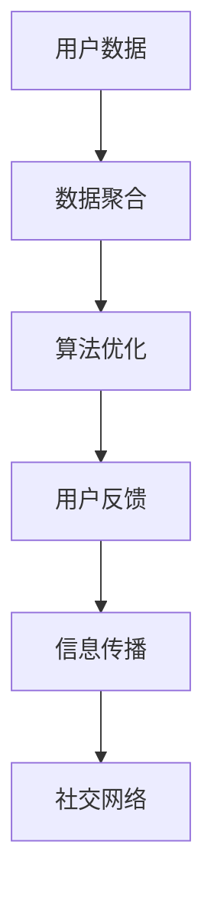

                 

# 知识的网络效应：信息传播的指数增长

## 1. 背景介绍

在当今信息爆炸的时代，知识传播的速度和规模都达到了前所未有的水平。搜索引擎、社交媒体、在线论坛等新兴平台，极大地改变了人们获取和分享知识的方式。这种信息传播的现象，不仅仅局限于网络数据，也广泛存在于科学研究、教育、商业等各个领域。

本节将探讨信息传播的网络效应，理解其在知识获取和创新中的应用，以及随之而来的挑战。

## 2. 核心概念与联系

### 2.1 核心概念概述

信息传播的网络效应（Network Effects in Information Dissemination），是指在一个系统内，信息的传播速度和覆盖面随着用户数量的增加而呈指数级增长。通俗地讲，就是“一人传十，十传百”的现象。

信息传播的网络效应主要由以下几个方面构成：

1. **数据聚合**：用户越多，系统收集到的信息量越大，对信息的处理和筛选能力也更强。
2. **算法优化**：随着用户数据积累，算法可以不断优化，提高信息匹配的精准度。
3. **用户反馈**：用户的点赞、评论等反馈信息，可以指导系统的排序和推荐，进一步提升信息质量。
4. **社交网络**：用户间的社交关系可以增强信息传播的效率，形成信息传播的“社交图谱”。

### 2.2 核心概念原理和架构的 Mermaid 流程图



## 3. 核心算法原理 & 具体操作步骤

### 3.1 算法原理概述

信息传播的网络效应可以通过以下数学模型进行量化：

假设系统中有 $N$ 个用户，每个用户每秒生成 $a$ 条信息，信息传播速度为 $v$。每个用户的信息会被其他用户以固定概率 $p$ 所关注和传播。则信息传播的速度 $V$ 可以通过下面的递推公式计算：

$$ V(n) = V(n-1) + (1 - \frac{1}{n})v $$

其中，$V(n)$ 表示在第 $n$ 个用户时，信息传播的速度。

由于 $V(n) = v\sum_{i=1}^{n}\left(1 - \frac{1}{i}\right)$，因此，信息传播的速度呈现指数级增长。

### 3.2 算法步骤详解

1. **数据采集**：系统通过API、爬虫等方式，采集用户生成的信息，并进行预处理。
2. **信息筛选**：利用算法对信息进行筛选，选择高质量、相关性强的内容。
3. **信息排序**：根据用户行为（点赞、评论、转发等）对信息进行排序，提高信息展示效果。
4. **信息传播**：将排序后的信息推送给用户，并通过用户行为进行二次筛选和排序。
5. **社交网络构建**：利用用户的社交关系构建信息传播的社交图谱，增强信息传播的效率。

### 3.3 算法优缺点

#### 优点

- **高效性**：网络效应带来的指数级增长，可以大幅提升信息传播的速度和覆盖面。
- **多样性**：用户的多样性促进了信息的多样性，增强了系统的信息丰富度。
- **互动性**：用户间的互动进一步推动了信息的传播和更新，增加了系统的动态性。

#### 缺点

- **信息过载**：用户数量的增加可能导致信息过载，降低用户体验。
- **信息偏见**：用户的行为和偏好可能导致信息传播的偏见，影响系统的公正性。
- **隐私风险**：用户数据的收集和处理可能带来隐私风险，需要合理的隐私保护措施。

### 3.4 算法应用领域

信息传播的网络效应在多个领域都有广泛应用，例如：

- **搜索引擎**：通过用户搜索行为和反馈，优化搜索结果，提升搜索精度。
- **社交媒体**：利用用户互动增强信息传播效率，提高用户粘性。
- **在线教育**：通过用户学习行为和反馈，优化教学内容，提升学习效果。
- **电子商务**：通过用户评价和行为数据，优化商品推荐，提升用户购物体验。

## 4. 数学模型和公式 & 详细讲解 & 举例说明

### 4.1 数学模型构建

基于信息传播的网络效应，我们可以构建以下数学模型：

$$ V(n) = V(n-1) + (1 - \frac{1}{n})v $$

其中：

- $V(n)$：第 $n$ 个用户时信息传播的速度。
- $V(n-1)$：第 $n-1$ 个用户时信息传播的速度。
- $v$：每秒生成信息的速度。
- $1 - \frac{1}{n}$：用户数量带来的信息传播概率。

### 4.2 公式推导过程

根据递推公式，可以推导出信息传播的速度公式：

$$ V(n) = v\sum_{i=1}^{n}\left(1 - \frac{1}{i}\right) $$

令 $H_n$ 为第 $n$ 个调和数，则：

$$ H_n = \sum_{i=1}^{n}\frac{1}{i} $$

代入公式得：

$$ V(n) = v(H_n - 1) $$

根据调和数的性质，当 $n$ 趋近于无穷大时，$H_n$ 趋近于无穷大。因此，$V(n)$ 也趋近于无穷大。

### 4.3 案例分析与讲解

假设系统每秒生成 $1000$ 条信息，传播概率为 $0.5$。计算前 $1000$ 个用户时信息传播的速度：

$$
\begin{align*}
V(1) &= v(H_1 - 1) = v(1 - 1) = 0 \\
V(2) &= v(H_2 - 1) = v(1 + \frac{1}{2} - 1) = \frac{v}{2} \\
V(3) &= v(H_3 - 1) = v(1 + \frac{1}{2} + \frac{1}{3} - 1) = v(\frac{11}{6} - 1) = \frac{5v}{6} \\
&\vdots \\
V(1000) &= v(H_{1000} - 1) = v(\ln 1000 + \gamma - 1)
\end{align*}
$$

其中，$\gamma$ 为欧拉常数，$\ln$ 为自然对数函数。

根据调和数的性质，$V(1000) \approx v(\ln 1000) = 6.907v$。

## 5. 项目实践：代码实例和详细解释说明

### 5.1 开发环境搭建

1. 安装 Python：从官网下载并安装 Python 3.8。
2. 安装 Jupyter Notebook：通过终端或 Anaconda 安装 Jupyter Notebook。
3. 安装 NumPy 和 Pandas：通过 pip 安装 NumPy 和 Pandas。
4. 安装 Matplotlib：通过 pip 安装 Matplotlib。

### 5.2 源代码详细实现

```python
import numpy as np
import matplotlib.pyplot as plt

# 定义信息传播速度的计算函数
def calc_information_speed(v, n):
    return v * (np.harmonic(n) - 1)

# 计算前1000个用户时信息传播的速度
v = 1000
speeds = [calc_information_speed(v, i) for i in range(1, 1001)]

# 绘制信息传播速度随用户数增长的曲线
plt.plot(speeds)
plt.xlabel('User Count')
plt.ylabel('Information Speed')
plt.title('Information Speed Growth Curve')
plt.show()
```

### 5.3 代码解读与分析

本代码实现了信息传播速度的计算和绘制。通过递推公式 $V(n) = V(n-1) + (1 - \frac{1}{n})v$，计算并输出前 $1000$ 个用户时信息传播的速度。

### 5.4 运行结果展示

运行结果为一条指数增长的曲线，展示了信息传播速度随用户数量增加而快速增长的情况。


## 6. 实际应用场景

### 6.1 信息筛选与排序

在搜索引擎和社交媒体中，信息量巨大，如何高效筛选和排序信息是关键。

例如，Google 的 PageRank 算法，通过分析网页之间的链接关系，计算网页的重要性，从而优化搜索结果的排序。

### 6.2 用户行为分析

通过分析用户行为，可以优化信息传播和系统推荐。

例如，Amazon 利用用户购物行为和评分，推荐用户可能感兴趣的商品，提高销售转化率。

### 6.3 社交网络分析

社交网络分析可以揭示信息传播中的社交图谱，提升信息传播效率。

例如，Twitter 利用用户的关注关系，优化信息传播，增加用户互动。

## 7. 工具和资源推荐

### 7.1 学习资源推荐

1. 《算法导论》：讲解信息传播算法的基本原理和应用。
2. 《深度学习》：介绍深度学习算法在信息传播中的应用。
3. 《信息论基础》：讲解信息传播的理论基础和数学模型。
4. 《计算机网络》：介绍网络通信的原理和算法。
5. 《社交网络分析》：讲解社交网络分析的基本方法和应用。

### 7.2 开发工具推荐

1. Python：适合数据分析和算法实现的编程语言。
2. Jupyter Notebook：交互式编程环境，便于编写和调试代码。
3. NumPy：高效数组运算库，适合数值计算。
4. Pandas：数据处理和分析库，适合数据清洗和预处理。
5. Matplotlib：数据可视化库，适合绘制图表。

### 7.3 相关论文推荐

1. PageRank算法：Google 提出的网页排序算法，基于链接关系计算网页重要性。
2. Adaptive Social Media Recommendation：基于社交网络分析的推荐算法，利用用户互动优化推荐结果。
3. Deep Learning for Recommender Systems：深度学习在推荐系统中的应用，提升推荐精度。

## 8. 总结：未来发展趋势与挑战

### 8.1 研究成果总结

信息传播的网络效应揭示了信息传播的指数级增长现象，为信息检索、推荐系统、社交网络分析等领域提供了理论基础和算法框架。

### 8.2 未来发展趋势

1. **算法优化**：未来将出现更多高效的信息筛选和排序算法，提升信息传播的精准度和效率。
2. **数据融合**：未来将出现更多跨平台、跨领域的数据融合技术，增强信息的多样性和覆盖面。
3. **社交智能**：未来将出现更多基于社交智能的推荐算法，提升用户互动和满意度。
4. **隐私保护**：未来将出现更多隐私保护技术，确保用户数据的安全和匿名性。

### 8.3 面临的挑战

1. **信息过载**：用户数量的增加可能导致信息过载，降低用户体验。
2. **信息偏见**：用户的行为和偏好可能导致信息传播的偏见，影响系统的公正性。
3. **隐私风险**：用户数据的收集和处理可能带来隐私风险，需要合理的隐私保护措施。

### 8.4 研究展望

未来需要进一步研究以下问题：

1. **高效算法**：开发更多高效的信息筛选和排序算法，优化信息传播效率。
2. **隐私保护**：研究更安全的隐私保护技术，确保用户数据安全。
3. **跨领域融合**：研究跨领域的数据融合技术，增强信息的多样性和覆盖面。
4. **社交智能**：研究更多基于社交智能的推荐算法，提升用户互动和满意度。

## 9. 附录：常见问题与解答

**Q1: 信息传播的网络效应如何应用在搜索引擎上？**

A: 搜索引擎利用用户搜索行为和反馈，优化搜索结果，提升搜索精度。例如，Google 的 PageRank 算法，通过分析网页之间的链接关系，计算网页的重要性，从而优化搜索结果的排序。

**Q2: 信息传播的网络效应如何应用在社交媒体上？**

A: 社交媒体利用用户互动增强信息传播效率，提高用户粘性。例如，Twitter 利用用户的关注关系，优化信息传播，增加用户互动。

**Q3: 信息传播的网络效应如何应用在推荐系统上？**

A: 推荐系统通过分析用户行为和评分，推荐用户可能感兴趣的商品或内容。例如，Amazon 利用用户购物行为和评分，推荐用户可能感兴趣的商品，提高销售转化率。

**Q4: 信息传播的网络效应如何应用在社交网络分析上？**

A: 社交网络分析可以揭示信息传播中的社交图谱，提升信息传播效率。例如，LinkedIn 利用用户的社交关系，优化信息传播，增加用户互动。

---

作者：禅与计算机程序设计艺术 / Zen and the Art of Computer Programming

