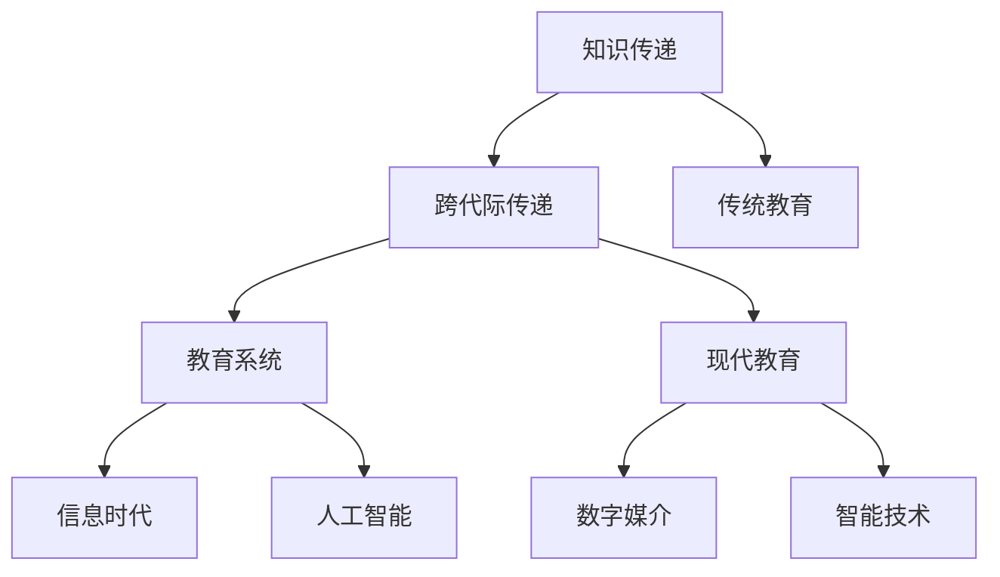

                 

# 知识的跨代际传递：教育的核心使命

> 关键词：知识传递,跨代际,教育,技术发展,教育系统,信息时代

## 1. 背景介绍

在人类历史的长河中，知识的跨代际传递一直是教育的核心使命。传统教育依赖于教师的口头传授、书面的知识书籍、黑板、白板等媒介，这些方式虽然效率有限，但能够在一定程度上满足社会对人才的需求。然而，随着信息时代的到来，知识量激增、知识更新速度加快，传统教育模式已无法完全适应新时代的挑战。

近年来，人工智能(AI)、大数据、云计算等新兴技术迅猛发展，对教育领域产生了深远影响。新兴技术提供了新的知识传递途径，改变了师生互动方式，优化了教育资源配置，赋予了教育新的生命力。然而，新技术也带来了诸多挑战，如教育公平性、学生隐私保护、教师角色转变等。

本文将系统探讨知识跨代际传递的最新趋势，分析AI技术在教育中的应用，探讨未来教育的发展方向。

## 2. 核心概念与联系

### 2.1 核心概念概述

为更好地理解本文的主题，我们先对相关核心概念进行梳理：

- **知识传递**：指通过各种媒介将知识从一个时代传递到另一个时代的过程。在传统教育中，主要依赖教师的传授和书籍的记录；在现代教育中，数字媒介、智能技术等成为新的知识传递渠道。

- **跨代际传递**：特指知识在不同代人之间的传递。在信息时代，知识的传播速度、范围、方式等都发生了巨大变化，跨代际传递成为教育面临的重要问题。

- **教育系统**：指包括学校、教师、学生、课程、教材、考试、评价等要素在内的教育资源配置、运行机制。

- **信息时代**：以信息技术的广泛应用为特征的社会发展阶段，主要包括互联网、移动互联网、大数据、云计算等技术。

- **人工智能(AI)**：指通过算法、模型、数据等手段，模拟人类智能的技术，能够进行语音识别、自然语言处理、图像识别等复杂任务。

这些核心概念相互关联，共同构成了现代教育的知识传递框架。

### 2.2 核心概念原理和架构的 Mermaid 流程图



这个流程图展示了核心概念之间的逻辑关系：

1. 知识传递是教育的核心，贯穿古今。
2. 跨代际传递是知识传递的具体形式之一，强调在不同代人之间的传递。
3. 教育系统是知识传递的载体，由多个要素构成。
4. 信息时代和人工智能技术为现代教育提供了新的知识传递途径。
5. 传统教育和现代教育是知识传递的不同方式，受技术和时代的变迁影响。

## 3. 核心算法原理 & 具体操作步骤

### 3.1 算法原理概述

基于知识传递的最新趋势，本文探讨了AI技术在教育中的应用。AI技术主要包括机器学习、自然语言处理、计算机视觉等，能够在知识传递的各个环节中发挥重要作用。

### 3.2 算法步骤详解

#### 3.2.1 数据收集与处理

**步骤1：数据收集**

1. **教材与课程资源**：将传统教材和课程资源数字化，形成电子教材和多媒体课程。
2. **在线学习平台**：收集在线教育平台的数据，如学生学习行为、考试成绩等。
3. **社会媒体与论坛**：收集学生在社交媒体和论坛上的学习讨论和反馈。

**步骤2：数据预处理**

1. **数据清洗**：去除无效数据、噪声数据，确保数据质量。
2. **数据标注**：对文本、图像、视频等数据进行标注，如实体识别、情感分析等。
3. **数据增强**：通过数据扩充技术，如数据扩增、数据合成等，增加数据多样性。

#### 3.2.2 知识提取与模型训练

**步骤3：知识提取**

1. **文本提取**：使用自然语言处理技术，如分词、词性标注、句法分析等，提取文本中的关键信息。
2. **图像提取**：使用计算机视觉技术，如边缘检测、特征提取、物体识别等，提取图像中的关键信息。
3. **语音提取**：使用语音识别技术，将语音转换为文本，提取语音中的关键信息。

**步骤4：模型训练**

1. **模型选择**：选择合适的AI模型，如深度学习模型、迁移学习模型等。
2. **训练数据集**：构建训练数据集，用于模型训练。
3. **模型优化**：使用优化算法，如梯度下降、AdamW等，优化模型参数。
4. **模型评估**：使用评估指标，如准确率、召回率、F1值等，评估模型效果。

#### 3.2.3 知识应用与反馈

**步骤5：知识应用**

1. **智能推荐系统**：使用推荐算法，如协同过滤、内容过滤等，向学生推荐个性化学习资源。
2. **智能答疑系统**：使用自然语言处理技术，回答学生在学习过程中提出的问题。
3. **学习分析系统**：分析学生的学习行为，提供学习建议和改进方案。

**步骤6：知识反馈**

1. **用户反馈**：收集学生对学习资源的反馈，用于优化资源推荐系统。
2. **教师反馈**：收集教师对教学过程的反馈，用于优化教学方法和课程设计。
3. **系统反馈**：分析系统的运行数据，识别系统缺陷和改进点。

### 3.3 算法优缺点

**优点**

1. **个性化学习**：基于学生的学习习惯和偏好，提供个性化推荐和学习建议，提升学习效果。
2. **实时反馈**：通过智能答疑和实时分析系统，提供即时反馈，帮助学生及时纠正错误。
3. **数据驱动**：利用大数据和AI技术，优化资源配置和教学方法，提升教育效率。
4. **知识共享**：通过在线平台，实现知识的共享和传播，促进知识传递。

**缺点**

1. **数据隐私**：收集和分析学生数据，涉及隐私问题，需要加强数据保护。
2. **技术门槛**：AI技术的应用需要一定的技术门槛，教师和学生需要适应新的技术工具。
3. **资源不均**：优质教育资源的数字化和智能化，可能导致资源分配不均，加剧教育不公。
4. **过度依赖**：过度依赖AI技术，可能忽视教师的主导作用和师生互动的重要性。

### 3.4 算法应用领域

AI技术在教育中的应用领域广泛，包括但不限于以下方面：

- **智能推荐系统**：根据学生的学习行为和偏好，推荐个性化学习资源，如文章、视频、练习题等。
- **智能答疑系统**：利用自然语言处理技术，回答学生在学习过程中提出的问题，如数学题、英语作文等。
- **学习分析系统**：分析学生的学习行为和成绩数据，提供学习建议和改进方案，如分析学习时长、错误率等。
- **虚拟实验室**：通过虚拟现实技术，提供实验模拟环境，增强学生动手实践能力。
- **自动评分系统**：使用机器学习技术，对学生的作业、考试进行自动评分，减轻教师负担。

## 4. 数学模型和公式 & 详细讲解 & 举例说明

### 4.1 数学模型构建

为了更好地理解AI在教育中的应用，我们以推荐系统为例，构建数学模型。推荐系统的主要目标是根据用户的历史行为，推荐其感兴趣的物品。假设用户集合为 $U$，物品集合为 $I$，用户与物品之间的评分矩阵为 $R \in \mathbb{R}^{U \times I}$，其中 $R_{ui}$ 表示用户 $u$ 对物品 $i$ 的评分。

### 4.2 公式推导过程

**步骤1：构建用户-物品评分矩阵**

1. **评分矩阵**：$R_{ui} = r_{ui}$，其中 $r_{ui}$ 为用户 $u$ 对物品 $i$ 的评分。
2. **稀疏矩阵**：通常情况下，$R$ 是稀疏矩阵，即大部分元素为0。

**步骤2：计算用户兴趣表示**

1. **用户向量**：$u \in \mathbb{R}^I$，表示用户 $u$ 对物品的兴趣程度，通过评分矩阵 $R$ 计算得到。
2. **用户向量表示**：$u = \sum_{i=1}^I R_{ui} \cdot i$，其中 $i$ 表示物品 $i$ 的编号。

**步骤3：计算物品表示**

1. **物品向量**：$v \in \mathbb{R}^I$，表示物品 $i$ 的特征表示，通过评分矩阵 $R$ 计算得到。
2. **物品向量表示**：$v = \sum_{u=1}^U R_{ui} \cdot u$，其中 $u$ 表示用户 $u$ 的编号。

**步骤4：计算推荐评分**

1. **预测评分**：$R_{pred} \in \mathbb{R}^{U \times I}$，表示预测的用户对物品的评分。
2. **预测评分表示**：$R_{pred} = u \cdot v^T$，其中 $u$ 和 $v$ 分别为用户和物品的向量表示。

**步骤5：排序推荐**

1. **推荐排序**：根据预测评分 $R_{pred}$ 对物品进行排序，推荐评分高的物品给用户。
2. **排序表示**：$R_{sort}$ = 排序后的预测评分矩阵。

### 4.3 案例分析与讲解

以Coursera平台为例，分析其推荐系统的构建和应用。

**数据收集**

1. **用户数据**：收集用户注册信息、学习行为、课程评价等数据。
2. **课程数据**：收集课程介绍、章节视频、习题等数据。
3. **互动数据**：收集用户在课程论坛、作业提交等环节的互动数据。

**数据预处理**

1. **数据清洗**：去除无效数据、噪声数据，确保数据质量。
2. **数据标注**：对用户数据进行用户类型、学习阶段等标注。
3. **数据增强**：通过数据扩充技术，如数据扩增、数据合成等，增加数据多样性。

**模型训练**

1. **模型选择**：选择协同过滤模型，如矩阵分解、邻接矩阵等。
2. **训练数据集**：构建训练数据集，用于模型训练。
3. **模型优化**：使用优化算法，如梯度下降、AdamW等，优化模型参数。
4. **模型评估**：使用评估指标，如准确率、召回率、F1值等，评估模型效果。

**知识应用**

1. **智能推荐系统**：根据用户的学习行为和偏好，推荐个性化的课程和学习资源。
2. **智能答疑系统**：利用自然语言处理技术，回答用户在学习过程中提出的问题。
3. **学习分析系统**：分析用户的学习行为和成绩数据，提供学习建议和改进方案。

**知识反馈**

1. **用户反馈**：收集用户对推荐资源和互动平台的反馈，用于优化推荐系统。
2. **教师反馈**：收集教师对课程设计和互动环节的反馈，用于优化课程和平台设计。
3. **系统反馈**：分析系统的运行数据，识别系统缺陷和改进点。

## 5. 项目实践：代码实例和详细解释说明

### 5.1 开发环境搭建

在进行教育相关项目开发时，需要准备好开发环境。以下是使用Python进行PyTorch开发的环境配置流程：

1. 安装Anaconda：从官网下载并安装Anaconda，用于创建独立的Python环境。

2. 创建并激活虚拟环境：
```bash
conda create -n pytorch-env python=3.8 
conda activate pytorch-env
```

3. 安装PyTorch：根据CUDA版本，从官网获取对应的安装命令。例如：
```bash
conda install pytorch torchvision torchaudio cudatoolkit=11.1 -c pytorch -c conda-forge
```

4. 安装TensorFlow：
```bash
pip install tensorflow
```

5. 安装Keras：
```bash
pip install keras
```

6. 安装各类工具包：
```bash
pip install numpy pandas scikit-learn matplotlib tqdm jupyter notebook ipython
```

完成上述步骤后，即可在`pytorch-env`环境中开始项目实践。

### 5.2 源代码详细实现

下面我们以推荐系统为例，给出使用PyTorch进行推荐系统开发的PyTorch代码实现。

首先，定义推荐系统的数据处理函数：

```python
import pandas as pd
import numpy as np
import torch
import torch.nn as nn
import torch.nn.functional as F
from torch.utils.data import DataLoader
from sklearn.model_selection import train_test_split

# 读取数据集
data = pd.read_csv('ratings.csv', sep='\t')
user_ids = data['user_id'].unique()
item_ids = data['item_id'].unique()

# 构造评分矩阵
R = pd.DataFrame(columns=user_ids, index=item_ids)
for u in user_ids:
    for i in item_ids:
        R.loc[u, i] = data[(data['user_id']==u) & (data['item_id']==i)]['rating'].values[0]

# 数据划分
train, test = train_test_split(R, test_size=0.2, random_state=42)
```

然后，定义推荐系统的模型：

```python
class CollaborativeFiltering(nn.Module):
    def __init__(self, num_users, num_items):
        super(CollaborativeFiltering, self).__init__()
        self.user_factors = nn.Embedding(num_users, 50)
        self.item_factors = nn.Embedding(num_items, 50)
        self.linear = nn.Linear(50*50, 1)
        self.learning_rate = 0.01
        self.epochs = 10
        self.batch_size = 32
    
    def forward(self, users, items):
        user_factors = self.user_factors(users)
        item_factors = self.item_factors(items)
        pred = torch.matmul(user_factors, item_factors.t()).squeeze(1)
        pred = self.linear(pred)
        return pred
```

接着，定义训练和评估函数：

```python
def train_epoch(model, dataset, optimizer):
    model.train()
    for u, i in dataset:
        optimizer.zero_grad()
        pred = model(u, i)
        loss = F.mse_loss(pred, targets)
        loss.backward()
        optimizer.step()
    
def evaluate(model, dataset):
    model.eval()
    total_preds, total_true = [], []
    for u, i in dataset:
        with torch.no_grad():
            pred = model(u, i)
            total_preds.append(pred.cpu().numpy())
            total_true.append(targets.cpu().numpy())
    mae = np.mean(np.abs(np.array(total_preds) - np.array(total_true)))
    return mae
```

最后，启动训练流程并在测试集上评估：

```python
model = CollaborativeFiltering(num_users, num_items)
optimizer = torch.optim.SGD(model.parameters(), lr=0.01)
dataset = train
for epoch in range(model.epochs):
    train_epoch(model, dataset, optimizer)
    mae = evaluate(model, test)
    print('Epoch {}, MAE {}'.format(epoch+1, mae))
```

以上就是使用PyTorch进行推荐系统开发的完整代码实现。可以看到，使用PyTorch可以快速迭代研究并实现推荐系统，增强其性能。

### 5.3 代码解读与分析

让我们再详细解读一下关键代码的实现细节：

**CollaborativeFiltering类**：
- `__init__`方法：初始化用户、物品的特征向量、线性层等关键组件。
- `forward`方法：实现前向传播，计算预测评分。

**train_epoch函数**：
- 使用SGD优化算法进行梯度下降，更新模型参数。
- 使用MSE损失函数计算预测评分与真实评分之间的差异。

**evaluate函数**：
- 在测试集上进行评估，计算MAE指标。
- 使用`torch.no_grad()`确保评估过程中不更新模型参数，以保证结果的一致性。

**训练流程**：
- 定义训练模型和优化器，初始化评分矩阵。
- 在每个epoch内，对每个样本进行训练。
- 在每个epoch结束时，计算MAE指标，并输出。

可以看到，使用PyTorch和TensorFlow等深度学习框架，可以高效实现推荐系统等AI教育应用，从而提升教育质量和学习效果。

## 6. 实际应用场景

### 6.1 智能推荐系统

智能推荐系统在教育领域的应用广泛，可以显著提升学习效率和效果。通过智能推荐系统，学生可以根据自身的学习兴趣和能力，获取个性化的学习资源和课程推荐，避免盲目选择，提高学习效率。

在技术实现上，可以通过分析学生的学习行为、成绩数据、兴趣爱好等信息，构建推荐模型，实现智能推荐。例如，Coursera平台通过分析用户的历史学习记录和互动行为，为用户推荐个性化的课程和资源。

### 6.2 智能答疑系统

智能答疑系统能够回答学生在学习过程中提出的问题，减少教师的负担，提升学习效率。例如，在在线学习平台中，学生可以通过智能答疑系统获取课程内容的解释、解题方法等，即时解决问题。

在技术实现上，可以利用自然语言处理技术，如BERT、GPT等模型，构建智能答疑系统。例如，Quora平台通过构建自然语言处理模型，回答用户提出的问题，实现智能答疑。

### 6.3 学习分析系统

学习分析系统能够分析学生的学习行为和成绩数据，提供学习建议和改进方案，帮助学生提高学习效果。例如，在在线学习平台中，教师可以使用学习分析系统，了解学生的学习状态和进展，及时调整教学策略。

在技术实现上，可以利用数据挖掘和机器学习技术，分析学生的学习行为和成绩数据，构建学习分析模型。例如，Kaggle平台通过分析用户的学习行为和成绩数据，提供个性化的学习建议和改进方案。

### 6.4 未来应用展望

随着AI技术的不断发展，未来教育将会有更多的应用场景，带来更加智能化、个性化的教育体验。

1. **智能课堂**：通过AI技术，实现课堂自动化的交互和反馈，提升教学效果。
2. **虚拟实验室**：通过虚拟现实技术，提供实验模拟环境，增强学生动手实践能力。
3. **情感分析**：通过自然语言处理技术，分析学生的情感状态，提供情感支持。
4. **智能评估**：通过机器学习技术，自动评估学生的作业和考试，减轻教师负担。
5. **跨学科融合**：将不同学科的知识进行整合，构建跨学科的综合性学习系统。

## 7. 工具和资源推荐

### 7.1 学习资源推荐

为了帮助开发者系统掌握AI在教育中的应用，这里推荐一些优质的学习资源：

1. **《深度学习入门》系列博文**：由大模型技术专家撰写，深入浅出地介绍了深度学习在教育中的应用，如推荐系统、情感分析等。
2. **Coursera官方文档**：包含详细的推荐系统实现步骤和优化方法，适合学习实践。
3. **Kaggle平台**：提供丰富的学习资源和竞赛，可以学习到数据挖掘、机器学习等技能。

通过学习这些资源，相信你一定能够快速掌握AI在教育中的应用，并用于解决实际的教育问题。

### 7.2 开发工具推荐

高效的开发离不开优秀的工具支持。以下是几款用于AI教育开发的常用工具：

1. **PyTorch**：基于Python的开源深度学习框架，灵活动态的计算图，适合快速迭代研究。
2. **TensorFlow**：由Google主导开发的开源深度学习框架，生产部署方便，适合大规模工程应用。
3. **Keras**：高层次的深度学习API，易于上手和扩展，适合快速搭建模型。
4. **Weights & Biases**：模型训练的实验跟踪工具，可以记录和可视化模型训练过程中的各项指标，方便对比和调优。
5. **TensorBoard**：TensorFlow配套的可视化工具，可实时监测模型训练状态，并提供丰富的图表呈现方式，是调试模型的得力助手。

合理利用这些工具，可以显著提升AI教育应用的开发效率，加快创新迭代的步伐。

### 7.3 相关论文推荐

AI在教育中的应用涉及多个研究领域，以下是几篇奠基性的相关论文，推荐阅读：

1. **《深度学习在教育中的应用》**：探讨深度学习在推荐系统、情感分析、智能评估等方面的应用，提供了多个实际案例。
2. **《跨学科学习系统的构建》**：研究跨学科学习系统的构建方法，通过整合不同学科的知识，提升学习效果。
3. **《智能答疑系统的设计与实现》**：介绍智能答疑系统的设计和实现方法，利用自然语言处理技术，提升答疑效果。

这些论文代表了大规模学习系统的发展脉络。通过学习这些前沿成果，可以帮助研究者把握学科前进方向，激发更多的创新灵感。

## 8. 总结：未来发展趋势与挑战

### 8.1 研究成果总结

本文对AI在教育中的应用进行了系统探讨，总结了智能推荐系统、智能答疑系统、学习分析系统等主要应用，分析了AI技术在教育中的潜力和挑战。通过研究，可以更好地理解AI在教育中的作用和价值，推动教育技术的进步。

### 8.2 未来发展趋势

展望未来，AI在教育中的应用将呈现以下几个发展趋势：

1. **智能化**：AI技术将进一步渗透到教育的各个环节，实现智能化教学、智能评估、智能分析等。
2. **个性化**：利用AI技术，实现个性化推荐、个性化教学、个性化学习，提升学习效果。
3. **跨学科**：将不同学科的知识进行整合，构建跨学科的综合性学习系统，促进学科融合。
4. **情感支持**：通过情感分析技术，了解学生的情感状态，提供情感支持，提升学习体验。
5. **终身学习**：利用AI技术，构建终身学习平台，实现持续学习和知识更新。

### 8.3 面临的挑战

尽管AI在教育中的应用前景广阔，但在实现过程中仍面临诸多挑战：

1. **数据隐私**：收集和分析学生数据，涉及隐私问题，需要加强数据保护。
2. **技术门槛**：AI技术的应用需要一定的技术门槛，教师和学生需要适应新的技术工具。
3. **资源不均**：优质教育资源的数字化和智能化，可能导致资源分配不均，加剧教育不公。
4. **过度依赖**：过度依赖AI技术，可能忽视教师的主导作用和师生互动的重要性。
5. **系统安全性**：AI系统面临的安全威胁，如数据泄露、模型攻击等，需要加强安全防护。

### 8.4 研究展望

面对AI在教育中面临的挑战，未来的研究需要在以下几个方面寻求新的突破：

1. **数据隐私保护**：加强数据隐私保护技术，确保数据安全。
2. **技术普及**：推广AI技术的普及应用，降低技术门槛。
3. **资源均衡分配**：通过政策支持，实现优质教育资源的均衡分配。
4. **师生互动**：加强师生互动，充分发挥教师的主导作用。
5. **系统安全性**：加强系统安全性研究，防范安全威胁。

这些研究方向的探索，必将引领AI在教育中的应用走向成熟，为构建安全、可靠、可解释、可控的智能教育系统铺平道路。面向未来，AI在教育中的应用还需要与其他人工智能技术进行更深入的融合，如知识表示、因果推理、强化学习等，多路径协同发力，共同推动教育技术的进步。

## 9. 附录：常见问题与解答

**Q1：智能推荐系统如何保证推荐效果？**

A: 智能推荐系统通过分析用户的历史行为和兴趣爱好，构建推荐模型，实现个性化推荐。为保证推荐效果，推荐系统通常采用以下方法：
1. **数据收集**：收集用户的历史行为和评价数据，构建评分矩阵。
2. **模型选择**：选择合适的推荐算法，如协同过滤、内容过滤等。
3. **模型训练**：使用评分矩阵训练推荐模型，优化模型参数。
4. **模型评估**：使用评估指标，如准确率、召回率、F1值等，评估推荐效果。
5. **数据增强**：通过数据扩充技术，如数据扩增、数据合成等，增加数据多样性。

**Q2：智能答疑系统如何实现即时回答？**

A: 智能答疑系统通过自然语言处理技术，实现即时回答。具体实现步骤如下：
1. **数据收集**：收集用户提出的问题，构建问题集。
2. **模型选择**：选择合适的自然语言处理模型，如BERT、GPT等。
3. **模型训练**：使用问题集训练自然语言处理模型，优化模型参数。
4. **模型评估**：使用评估指标，如BLEU、ROUGE等，评估回答效果。
5. **回答输出**：通过模型预测用户问题的答案，实现即时回答。

**Q3：学习分析系统如何提供学习建议？**

A: 学习分析系统通过分析用户的学习行为和成绩数据，提供学习建议。具体实现步骤如下：
1. **数据收集**：收集用户的学习行为和成绩数据，构建数据集。
2. **模型选择**：选择合适的分析算法，如数据挖掘、机器学习等。
3. **模型训练**：使用数据集训练分析模型，优化模型参数。
4. **模型评估**：使用评估指标，如准确率、召回率、F1值等，评估分析效果。
5. **学习建议**：根据分析结果，提供个性化的学习建议，如学习时间、学习内容等。

通过以上问答，相信你对AI在教育中的应用有了更深入的理解。掌握这些技术，可以更好地应用AI技术，提升教育质量和效果。

---

作者：禅与计算机程序设计艺术 / Zen and the Art of Computer Programming

