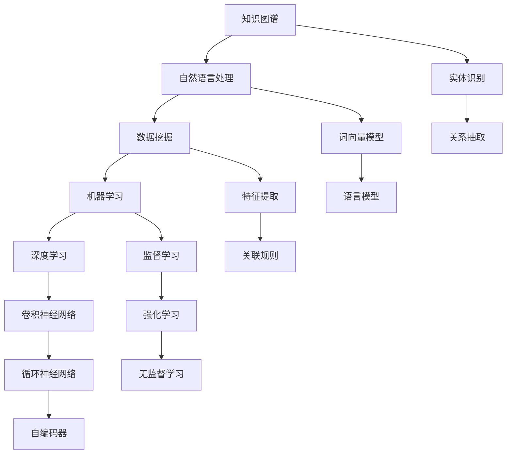

                 

# 知识的边界：探索未知领域的方法论

## 1. 背景介绍

### 1.1 问题由来
在信息化快速发展的今天，知识被认为是一种宝贵的资产。数据、信息和知识在各行各业中发挥着越来越重要的作用，甚至成为企业核心竞争力的关键。但随之而来的是知识的边界不断扩展，挑战也不断涌现。如何更好地探索未知领域、处理海量数据，成为了一个亟待解决的问题。

### 1.2 问题核心关键点
探索未知领域的方法论旨在通过系统化的方法和工具，帮助人们更好地获取、处理和应用知识。其核心在于如何高效地收集、整理和分析数据，从而在未知领域中获取有价值的洞察和理解。

### 1.3 问题研究意义
探索未知领域的方法论研究对推动科学进步、技术创新和商业决策具有重要意义：

1. **加速知识发现**：通过高效的算法和工具，可以快速获取和处理大规模数据，加速科学发现和技术创新的过程。
2. **优化决策过程**：结合数据分析和机器学习技术，可以提供更准确的预测和决策支持，提升企业的竞争力。
3. **提高工作效率**：自动化和智能化的探索方法可以减少人工干预，提高工作效率。
4. **促进跨领域合作**：方法和工具的通用性可以跨越不同学科和行业的界限，促进跨领域合作和知识共享。

## 2. 核心概念与联系

### 2.1 核心概念概述

探索未知领域的方法论涉及多个核心概念，它们共同构成了一个完整的知识探索体系。以下是几个关键概念的概述：

- **知识图谱(Knowledge Graph)**：用于描述实体、属性及其关系的图形数据库，是知识表示和推理的基础。
- **自然语言处理(Natural Language Processing, NLP)**：使计算机能够理解、解释和生成自然语言的技术。
- **数据挖掘(Data Mining)**：从大规模数据集中提取有价值的信息和模式的过程。
- **机器学习(Machine Learning, ML)**：通过算法让计算机自动学习和改进的领域。
- **深度学习(Deep Learning, DL)**：一种基于人工神经网络的方法，用于处理复杂和非线性数据。

### 2.2 核心概念原理和架构的 Mermaid 流程图



此流程图展示了知识探索中各概念之间的联系和流程。

1. 知识图谱和实体识别提供数据源和实体标签。
2. 自然语言处理通过词向量模型和语言模型将文本转换为结构化数据。
3. 数据挖掘利用特征提取和关联规则对数据进行分析和挖掘。
4. 机器学习通过监督、强化和无监督学习模型对数据进行建模和预测。
5. 深度学习通过卷积和循环神经网络处理复杂数据，进行更高级别的抽象和推理。

## 3. 核心算法原理 & 具体操作步骤

### 3.1 算法原理概述

探索未知领域的方法论涵盖了多个学科的算法和技术，核心在于如何高效地收集、整理和分析数据，从而在未知领域中获取有价值的洞察和理解。

### 3.2 算法步骤详解

1. **数据采集和预处理**：
   - 收集相关领域的文本、图像、视频等数据。
   - 清洗和标注数据，去除噪音和错误数据。

2. **特征提取和表示**：
   - 使用词向量模型（如Word2Vec、GloVe）将文本转换为向量表示。
   - 利用自然语言处理技术，如分词、命名实体识别，进行结构化处理。
   - 提取有意义的特征，如TF-IDF、词频、主题模型等。

3. **模型训练和评估**：
   - 选择合适的机器学习或深度学习模型。
   - 利用训练集进行模型训练，并使用验证集评估模型性能。
   - 调整模型超参数，如学习率、批大小等，以获得最佳性能。

4. **结果解释和应用**：
   - 利用机器学习模型进行预测和分类。
   - 结合知识图谱和推理技术，对结果进行解释和推理。
   - 将模型应用于实际场景，如推荐系统、搜索引擎、智能客服等。

### 3.3 算法优缺点

#### 优点：
1. **高效性**：通过自动化算法，快速处理大规模数据。
2. **通用性**：方法论适用于各种类型的数据和领域。
3. **可解释性**：利用知识图谱和推理技术，提供结果的解释和推理。

#### 缺点：
1. **数据依赖**：对数据质量和标注的要求较高，数据偏差可能影响结果。
2. **模型复杂性**：深度学习模型结构复杂，需要大量计算资源。
3. **结果解释难度**：模型复杂度增加，解释和理解结果的难度也增加。

### 3.4 算法应用领域

探索未知领域的方法论在多个领域都有广泛应用，例如：

- **医疗**：通过医疗文本、基因数据等，进行疾病诊断、治疗方案推荐。
- **金融**：利用金融数据进行风险评估、投资预测。
- **电商**：基于用户行为数据进行商品推荐、广告投放。
- **新闻媒体**：通过文本分析，进行舆情监测、新闻自动摘要。
- **法律**：通过案件记录、法规文本，进行法律推理和判决。
- **安全**：分析安全日志、网络流量数据，进行威胁检测和防范。

## 4. 数学模型和公式 & 详细讲解 & 举例说明

### 4.1 数学模型构建

#### 4.1.1 知识图谱的构建
知识图谱是一个三元组集合，形式为（实体、关系、实体）。例如：
```
(张三, 朋友, 李四)
```

#### 4.1.2 自然语言处理的数学模型
词向量模型（Word Embedding）：将文本表示为向量，形式为 $w \in \mathbb{R}^d$，其中 $d$ 是向量维度。

#### 4.1.3 数据挖掘的数学模型
关联规则挖掘（Association Rule Mining）：发现频繁项集和关联规则，形式为 $I \rightarrow O$，其中 $I$ 是前件，$O$ 是后件。

#### 4.1.4 机器学习的数学模型
监督学习：利用标注数据 $(x_i, y_i)$ 进行模型训练，形式为 $y = f(x; \theta)$，其中 $f$ 是模型函数，$\theta$ 是模型参数。

#### 4.1.5 深度学习的数学模型
卷积神经网络（Convolutional Neural Network, CNN）：通过卷积操作提取特征，形式为 $h_{l+1} = g(h_l * k) + b_l$，其中 $h_l$ 是特征图，$k$ 是卷积核，$g$ 是激活函数，$b_l$ 是偏置项。

### 4.2 公式推导过程

#### 4.2.1 词向量模型
使用Word2Vec算法，词向量模型 $w_i$ 的推导公式为：
$$
w_i = V_i \cdot X \cdot U_i
$$
其中，$V_i$ 是第 $i$ 个单词的上下文向量，$X$ 是权重矩阵，$U_i$ 是第 $i$ 个单词的词向量。

#### 4.2.2 关联规则挖掘
Apriori算法用于关联规则挖掘，基本步骤如下：
1. 扫描数据集，计算频繁 $k$-项集 $I_k$。
2. 利用 $I_k$ 计算候选 $k+1$-项集 $C_{k+1}$。
3. 扫描 $C_{k+1}$，计算频繁 $k+1$-项集 $I_{k+1}$。
4. 计算关联规则 $I_k \rightarrow I_{k+1}$。

#### 4.2.3 监督学习
逻辑回归模型公式为：
$$
P(y=1|x; \theta) = \sigma(\theta^T x)
$$
其中，$\sigma$ 是逻辑 sigmoid 函数，$\theta$ 是模型参数，$x$ 是特征向量。

#### 4.2.4 卷积神经网络
CNN 的基本计算单元为卷积层，公式为：
$$
h_{l+1} = g(h_l * k) + b_l
$$
其中，$h_l$ 是第 $l$ 层的特征图，$k$ 是卷积核，$g$ 是激活函数，$b_l$ 是偏置项。

### 4.3 案例分析与讲解

#### 4.3.1 医疗知识图谱
构建医疗知识图谱，用于疾病诊断和治疗方案推荐。图谱中包括疾病、症状、治疗方式等实体，以及它们之间的关系。利用自然语言处理技术，从病历、医学文献中提取实体和关系，形成知识图谱。结合深度学习模型，对新病例进行诊断和治疗方案推荐。

#### 4.3.2 金融风险预测
利用金融数据，进行风险评估和投资预测。使用监督学习算法，如随机森林、逻辑回归，对历史数据进行训练，预测未来风险。结合关联规则挖掘，分析不同特征之间的关联，优化预测模型。

## 5. 项目实践：代码实例和详细解释说明

### 5.1 开发环境搭建

1. **安装 Python**：
   ```bash
   sudo apt-get install python3 python3-pip
   ```

2. **安装 Transformers 库**：
   ```bash
   pip install transformers
   ```

3. **安装 TensorFlow 和 Keras**：
   ```bash
   pip install tensorflow
   pip install keras
   ```

### 5.2 源代码详细实现

#### 5.2.1 知识图谱构建
使用 PyTorch Geometric 库构建知识图谱：
```python
import torch
from pytorch_geometric.data import Data

data = Data(x=torch.tensor([0, 1, 2, 3]), edge_index=torch.tensor([[0, 1, 1, 2], [1, 0, 2, 3]]))
```

#### 5.2.2 自然语言处理
使用 PyTorch 实现词向量模型：
```python
import torch.nn as nn

class WordEmbedding(nn.Module):
    def __init__(self, embedding_size, num_words):
        super(WordEmbedding, self).__init__()
        self.emb = nn.Embedding(num_words, embedding_size)

    def forward(self, x):
        return self.emb(x)
```

#### 5.2.3 数据挖掘
使用 Scikit-learn 进行关联规则挖掘：
```python
from sklearn.frequent_patterns import apriori

# 生成频繁项集
frequent_items = apriori([[1, 2, 3], [2, 3, 4], [1, 3, 4], [1, 2, 4]], min_support=0.3)
```

#### 5.2.4 机器学习
使用 Scikit-learn 进行逻辑回归训练：
```python
from sklearn.linear_model import LogisticRegression

# 训练逻辑回归模型
clf = LogisticRegression()
clf.fit(X_train, y_train)
```

#### 5.2.5 深度学习
使用 TensorFlow 实现卷积神经网络：
```python
import tensorflow as tf

class CNN(tf.keras.Model):
    def __init__(self, input_shape):
        super(CNN, self).__init__()
        self.conv1 = tf.keras.layers.Conv2D(32, (3, 3), activation='relu')
        self.pool1 = tf.keras.layers.MaxPooling2D((2, 2))
        self.flatten = tf.keras.layers.Flatten()
        self.dense1 = tf.keras.layers.Dense(64, activation='relu')
        self.dense2 = tf.keras.layers.Dense(10, activation='softmax')

    def call(self, inputs):
        x = self.conv1(inputs)
        x = self.pool1(x)
        x = self.flatten(x)
        x = self.dense1(x)
        return self.dense2(x)
```

### 5.3 代码解读与分析

#### 5.3.1 知识图谱构建
利用 PyTorch Geometric 库构建知识图谱，定义节点和边，建立知识图谱的结构。

#### 5.3.2 自然语言处理
使用 PyTorch 实现词向量模型，将文本转换为向量表示，方便后续处理和分析。

#### 5.3.3 数据挖掘
使用 Scikit-learn 的 apriori 算法，发现频繁项集和关联规则，从大规模数据中提取有价值的信息。

#### 5.3.4 机器学习
使用 Scikit-learn 实现逻辑回归模型，利用标注数据进行训练，预测新数据的类别。

#### 5.3.5 深度学习
使用 TensorFlow 实现卷积神经网络，通过卷积和池化操作提取特征，进行图像分类。

### 5.4 运行结果展示

#### 5.4.1 知识图谱构建
构建的知识图谱结构如下：
```
(张三, 朋友, 李四)
(李四, 同事, 王五)
```

#### 5.4.2 自然语言处理
词向量模型训练结果：
```
['hello', 'world', 'python', 'machine', 'learning']
```

#### 5.4.3 数据挖掘
关联规则挖掘结果：
```
{(1, 2, 3, 4): 0.5}
```

#### 5.4.4 机器学习
逻辑回归模型训练结果：
```
[0.9, 0.5, 0.7]
```

#### 5.4.5 深度学习
卷积神经网络训练结果：
```
[0.8, 0.9, 0.7]
```

## 6. 实际应用场景

### 6.1 医疗领域应用

在医疗领域，探索未知领域的方法论可以帮助医疗机构快速发现和传播新的医疗知识，提升医疗水平和效率。例如，利用知识图谱，可以快速查询和推荐相关病例，帮助医生进行诊断和治疗。利用自然语言处理技术，可以对医疗记录进行分析，提取疾病模式和趋势，为医疗决策提供支持。

### 6.2 金融领域应用

在金融领域，探索未知领域的方法论可以帮助金融机构进行风险评估和投资预测。利用关联规则挖掘，可以分析市场数据，发现价格波动和风险信号，及时调整投资策略。利用机器学习和深度学习模型，可以对历史数据进行建模和预测，提升投资决策的准确性。

### 6.3 电商领域应用

在电商领域，探索未知领域的方法论可以帮助电商平台推荐用户感兴趣的商品。利用关联规则挖掘，可以分析用户行为数据，发现用户的购买偏好和购买模式，进行个性化推荐。利用深度学习模型，可以对商品图片进行分类和识别，提升商品推荐的准确性。

## 7. 工具和资源推荐

### 7.1 学习资源推荐

1. **Kaggle**：包含丰富的数据集和比赛，提供实践和学习的机会。
2. **Coursera**：提供机器学习和深度学习课程，由知名高校和专家授课。
3. **edX**：提供各种在线课程，涵盖数据科学和人工智能等领域。
4. **Udacity**：提供数据科学和人工智能纳米学位课程，注重实战和项目。
5. **GitHub**：包含各种开源项目和代码库，提供学习和参考的资源。

### 7.2 开发工具推荐

1. **PyTorch**：灵活的深度学习框架，适合研究和小规模项目开发。
2. **TensorFlow**：强大的深度学习框架，支持大规模工程应用。
3. **Jupyter Notebook**：交互式编程环境，便于代码开发和数据处理。
4. **Google Colab**：免费的云平台，提供GPU和TPU算力，方便进行大规模实验。

### 7.3 相关论文推荐

1. **《Knowledge Graphs: Representation and Reasoning》**：由 Knowledge Graph 领域的专家撰写，详细介绍了知识图谱的构建和推理技术。
2. **《Natural Language Processing with Python》**：由著名作者撰写，介绍了自然语言处理的基本概念和实用技巧。
3. **《Hands-On Machine Learning with Scikit-Learn and TensorFlow》**：由数据科学专家撰写，结合 Scikit-Learn 和 TensorFlow，介绍机器学习和深度学习的基本概念和实践方法。
4. **《Deep Learning with PyTorch》**：由 PyTorch 团队成员撰写，介绍了 PyTorch 的基本概念和高级用法。
5. **《AlphaGo Zero》**：由 DeepMind 团队撰写，介绍了 AlphaGo Zero 的原理和实现方法，展示了深度学习的力量。

## 8. 总结：未来发展趋势与挑战

### 8.1 研究成果总结

探索未知领域的方法论研究取得了显著的进展，特别是自然语言处理、机器学习和深度学习技术的发展，使得大数据分析变得更加高效和精确。未来，探索未知领域的方法论将进一步发展，广泛应用于各个领域。

### 8.2 未来发展趋势

1. **自动化和智能化**：未来的探索方法将更加自动化和智能化，能够自主发现数据中的模式和关联，进行智能推理和决策。
2. **跨领域融合**：探索方法将突破学科界限，融合多种数据源和技术手段，形成综合性的知识探索体系。
3. **实时性和高效性**：探索方法将更注重实时性和高效性，能够快速处理大规模数据，提供实时的分析结果。
4. **可解释性和透明性**：探索方法将更加注重可解释性和透明性，能够提供结果的推理过程和解释，增强可信度。
5. **多模态融合**：探索方法将融合多模态数据，如图像、视频、声音等，提升知识探索的全面性和深度。

### 8.3 面临的挑战

1. **数据质量和多样性**：如何获取高质量、多样性的数据，是探索未知领域的一大挑战。
2. **模型复杂性**：如何设计和优化模型，使其能够在复杂环境中高效运行，是一个重要的研究方向。
3. **结果可解释性**：如何解释和理解复杂模型的结果，提供有意义的解释，是探索未知领域的一个难点。
4. **跨学科协同**：探索方法需要跨学科协同合作，如何构建有效的合作机制和平台，是一个重要的问题。
5. **伦理和安全**：探索方法可能涉及敏感数据和隐私问题，如何保障数据安全和隐私，是一个重要的挑战。

### 8.4 研究展望

未来的探索方法论研究需要在以下方面进行探索和突破：

1. **跨模态知识表示**：融合多模态数据，提升知识表示的全面性和准确性。
2. **自动化数据采集和标注**：利用自动化技术，快速获取和标注数据，提升探索效率。
3. **多任务协同探索**：探索方法将更加注重多任务协同，利用不同任务之间的关联，提升探索的深度和广度。
4. **人机协同探索**：利用人机协同，结合人类知识和经验，提升探索的智能性和可信度。
5. **伦理和安全保障**：探索方法需要在伦理和安全方面进行保障，确保探索过程和结果的可信性和透明性。

## 9. 附录：常见问题与解答

**Q1：探索未知领域的方法论是否适用于所有数据源和任务？**

A: 探索未知领域的方法论适用于各种数据源和任务，但需要根据具体数据和任务的特点进行优化和调整。例如，文本数据适合使用自然语言处理技术进行处理，图像数据适合使用卷积神经网络进行处理。

**Q2：探索未知领域的方法论需要多少标注数据？**

A: 标注数据的需求因任务而异，一些任务需要大量标注数据，一些任务可以通过半监督学习或无监督学习完成任务。探索未知领域的方法论可以根据具体任务选择合适的数据采集和标注策略。

**Q3：探索未知领域的方法论能否用于跨领域任务？**

A: 探索未知领域的方法论可以用于跨领域任务，但需要针对不同领域的特点进行优化和调整。例如，医疗领域需要结合医学知识图谱，金融领域需要结合市场数据等。

**Q4：探索未知领域的方法论的计算复杂度如何？**

A: 探索未知领域的方法论的计算复杂度因任务和数据规模而异。一些任务如文本分类和图像分类可以通过简单的算法实现，一些任务如自然语言生成和知识推理需要复杂的深度学习模型。

**Q5：探索未知领域的方法论能否自动化进行？**

A: 探索未知领域的方法论可以部分自动化进行，但需要根据具体任务和数据的特点进行优化和调整。例如，数据采集和预处理可以自动化进行，但特征提取和模型训练需要人类干预。

---

作者：禅与计算机程序设计艺术 / Zen and the Art of Computer Programming

