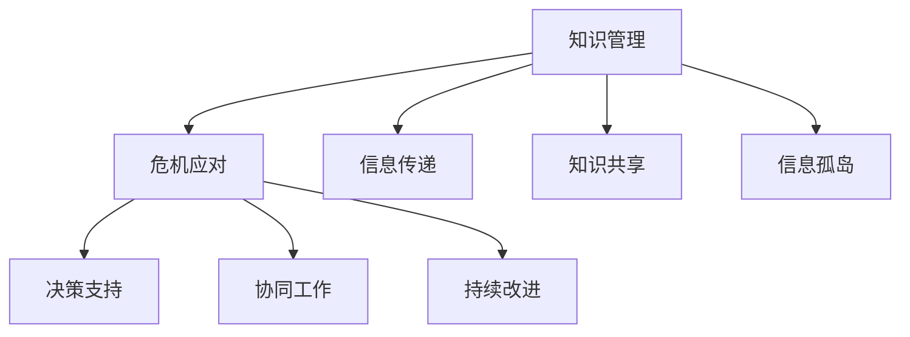

                 

# 知识管理在危机应对中的作用

## 1. 背景介绍

### 1.1 问题由来
在现代社会，组织和个人都面临着前所未有的复杂性和不确定性。无论是自然灾害、公共卫生危机、社会动荡还是技术故障，都可能给企业、政府和组织带来重大的运营和战略挑战。在这种背景下，知识管理（Knowledge Management, KM）成为了应对危机、提高组织韧性、提升应对能力的重要手段。

### 1.2 问题核心关键点
知识管理的核心在于通过系统化、结构化的方式，收集、存储、共享、利用各类知识，以支持组织决策、改进流程、创新产品和服务。在危机应对中，知识管理的作用体现在以下几个方面：

- **信息快速传递**：通过高效的沟通工具和协作平台，确保在危机中，关键信息能够迅速传递给相关人员。
- **决策支持**：利用历史案例、专家见解和实时数据分析，辅助组织做出快速、科学的决策。
- **协同工作**：通过知识共享和协作工具，促进跨部门、跨层级的协同作战，提高团队协作效率。
- **持续改进**：将危机应对过程中的学习经验转化为知识库，为未来的危机应对提供参考。

### 1.3 问题研究意义
深入研究知识管理在危机应对中的作用，对于提升组织的整体危机应对能力、促进业务连续性和提升员工满意度和参与度具有重要意义：

1. **增强组织韧性**：通过知识管理，组织可以快速整合资源，灵活应对不断变化的环境。
2. **优化决策质量**：科学的知识管理能提供全面的信息支持，减少决策失误。
3. **提升运营效率**：知识共享和协同工作可以大大缩短决策和执行时间。
4. **促进创新发展**：知识管理鼓励知识分享和创新，推动组织持续进步。

## 2. 核心概念与联系

### 2.1 核心概念概述

为了更好地理解知识管理在危机应对中的应用，我们先介绍几个核心概念：

- **知识管理（Knowledge Management, KM）**：通过组织策略和技术手段，将知识（包括显性知识和隐性知识）转化为可利用、可共享的知识资产，以支持组织目标的实现。

- **危机应对（Crisis Response）**：在面对突发事件或重大威胁时，组织通过快速响应、高效协调和持续改进，最大限度地减少损失、恢复秩序和保障业务连续性的过程。

- **信息孤岛（Information Silos）**：指组织内部不同部门或系统之间的信息无法互通，导致关键信息无法及时传递和共享的现象。

- **知识共享（Knowledge Sharing）**：通过各种机制和工具，促进组织内外知识的传递和利用，促进团队协作和知识创新。

- **协同工作（Collaborative Work）**：多个人或团队共同完成特定任务的过程，强调信息共享和紧密合作。

这些核心概念通过Mermaid流程图连接，如下所示：



这个流程图展示了知识管理在危机应对中的核心作用和关键环节，每个环节相互依赖，共同支撑组织的危机应对能力。

## 3. 核心算法原理 & 具体操作步骤
### 3.1 算法原理概述

在危机应对中，知识管理的算法原理主要体现在以下几个方面：

- **信息采集与集成**：通过自动化的信息采集工具，从内部系统、社交媒体、新闻网站等渠道获取相关信息，并进行整合。
- **知识存储与管理**：利用数据库、文档管理系统、知识图谱等工具，对收集到的知识进行存储和分类，确保其可检索性和可用性。
- **知识检索与检索**：通过搜索引擎、知识图谱等技术，快速定位和检索所需知识，支持决策和操作。
- **知识共享与协同**：通过协作平台、文档管理系统、即时通讯工具等，促进知识在组织内部的共享和利用。
- **知识应用与优化**：通过机器学习和数据分析技术，从历史数据中提取规律，优化决策和操作流程。

### 3.2 算法步骤详解

危机应对中的知识管理一般包括以下几个关键步骤：

**Step 1: 知识收集与整理**
- 确定危机应对的关键领域和知识需求，制定知识收集计划。
- 使用网络爬虫、API接口等技术手段，从不同渠道收集相关知识信息。
- 对收集到的信息进行清洗、筛选和分类，确保其准确性和相关性。

**Step 2: 知识存储与构建**
- 选择合适的知识管理系统，将清洗后的信息存储到系统中。
- 利用元数据标注信息，便于检索和共享。
- 构建知识图谱，将孤立的知识节点关联起来，形成知识网络。

**Step 3: 知识共享与协作**
- 搭建知识共享平台，支持文档上传、文档评论、即时通讯等功能。
- 通过RSS、API等手段，与外部系统集成，扩大知识共享的范围。
- 引入知识管理工具，如Confluence、SharePoint等，辅助团队协作。

**Step 4: 知识检索与利用**
- 使用搜索引擎、知识图谱等工具，快速定位相关知识。
- 设计知识检索界面，简化检索流程，提高操作效率。
- 利用知识图谱进行知识推理，辅助决策。

**Step 5: 知识应用与优化**
- 通过数据分析和机器学习技术，从历史数据中提取规律和模式。
- 利用预测模型，辅助决策和操作流程的优化。
- 定期更新知识库，确保知识的时效性和准确性。

### 3.3 算法优缺点

知识管理在危机应对中的优势主要包括：

- **信息集成**：通过集中式存储和管理，减少了信息孤岛现象，提高了信息传递的效率。
- **决策支持**：利用历史数据和专家见解，提供科学的决策支持。
- **协同工作**：促进跨部门、跨层级的协同作战，提高团队协作效率。
- **持续改进**：通过学习与反思，不断优化危机应对流程。

然而，知识管理也存在一些局限性：

- **高成本投入**：知识管理系统和工具的引入需要较高的成本和技术投入。
- **信息过载**：大量的数据和信息可能会造成信息过载，影响决策速度。
- **技术复杂性**：需要具备一定的技术能力才能有效使用知识管理工具。
- **知识共享障碍**：部分员工可能对知识共享持抵触态度，影响知识管理的实施效果。

### 3.4 算法应用领域

知识管理在危机应对中的应用领域非常广泛，涉及多个行业和组织类型。以下是几个典型的应用场景：

1. **企业危机管理**：包括自然灾害、技术故障、市场波动等。企业可以利用知识管理提高应急响应速度，减少损失。
2. **政府应急响应**：如自然灾害、公共卫生事件、恐怖袭击等。政府可以通过知识管理提升快速响应能力，保障公共安全。
3. **非营利组织**：如红十字会、世界卫生组织等。这些组织可以利用知识管理提升灾害救援、疫情控制等应急响应能力。
4. **军事应急响应**：如战争、恐怖袭击等。军事机构可以通过知识管理提升情报收集、决策支持等能力。

## 4. 数学模型和公式 & 详细讲解  
### 4.1 数学模型构建

在危机应对中，知识管理的数学模型可以形式化为：

$$
KM = \{F(I, P, S, O)\}
$$

其中：
- $I$ 表示信息采集，包括自动化的信息采集工具和人工录入。
- $P$ 表示知识存储，包括数据库、文档管理系统、知识图谱等。
- $S$ 表示知识共享，包括协作平台、文档管理系统、即时通讯工具等。
- $O$ 表示知识应用，包括搜索引擎、知识图谱、机器学习等。

### 4.2 公式推导过程

知识管理的核心在于信息的集成、存储、共享和利用。以自然灾害应急响应为例，其数学模型可以进一步细化为：

$$
R = f(D, T, E)
$$

其中：
- $R$ 表示应急响应效果，包括救援速度、人员物资调配等。
- $D$ 表示数据采集与处理，包括自动化信息采集、人工录入等。
- $T$ 表示知识存储与管理，包括数据库、文档管理系统、知识图谱等。
- $E$ 表示知识检索与利用，包括搜索引擎、知识图谱、机器学习等。

通过上述公式，可以看出，应急响应效果 $R$ 是数据采集与处理 $D$、知识存储与管理 $T$、知识检索与利用 $E$ 的综合结果。

### 4.3 案例分析与讲解

**案例：某公司自然灾害应急响应**

某公司在面临自然灾害时，通过知识管理提升了应急响应效果。具体步骤如下：

1. **信息采集与集成**：使用自动化信息采集工具，从新闻网站、社交媒体、政府部门等渠道获取实时信息，包括灾害类型、受影响区域、救援需求等。
2. **知识存储与构建**：利用知识图谱技术，将收集到的信息整理成知识节点，构建知识网络。例如，将受灾地区与救援资源进行关联，形成灾害应对图谱。
3. **知识共享与协作**：搭建协作平台，所有员工可以实时查看灾害信息、救援物资等数据。通过即时通讯工具，各团队可以快速沟通和协作。
4. **知识检索与利用**：设计灾害应对知识检索界面，员工可以根据灾害类型、受影响区域等条件，快速检索到相关知识。同时，利用历史数据和机器学习模型，预测灾害趋势和资源需求，辅助决策。
5. **知识应用与优化**：定期更新知识库，结合最新数据和信息，优化灾害应对流程。例如，根据历史数据，优化物资调配路径和救援队伍安排。

通过上述步骤，公司在自然灾害应急响应中表现出色，救援速度和资源利用效率显著提升。

## 5. 项目实践：代码实例和详细解释说明
### 5.1 开发环境搭建

在进行知识管理实践前，我们需要准备好开发环境。以下是使用Python进行知识管理开发的环境配置流程：

1. 安装Anaconda：从官网下载并安装Anaconda，用于创建独立的Python环境。

2. 创建并激活虚拟环境：
```bash
conda create -n km-env python=3.8 
conda activate km-env
```

3. 安装必要的Python库：
```bash
pip install pandas numpy requests scikit-learn tensorflow
```

4. 安装知识管理工具：
```bash
pip install confluence-sharepoint-rss
```

完成上述步骤后，即可在`km-env`环境中开始知识管理实践。

### 5.2 源代码详细实现

这里以某公司的自然灾害应急响应为例，给出使用Python进行知识管理的代码实现。

首先，定义信息采集函数：

```python
import requests
import json

def fetch_information(url):
    response = requests.get(url)
    if response.status_code == 200:
        return json.loads(response.text)
    else:
        return None
```

然后，定义知识存储与构建函数：

```python
import pandas as pd
import os

def store_knowledge(data, path):
    df = pd.DataFrame(data)
    df.to_csv(path, index=False)
```

接着，定义知识共享与协作函数：

```python
import confluence
import sharepoint
import rss

def share_knowledge(path):
    # 初始化Confluence和SharePoint客户端
    confluence_client = confluence.ConfluenceClient('https://confluence.example.com')
    sharepoint_client = sharepoint.SharePointClient('https://sharepoint.example.com')

    # 获取文档和列表
    document = confluence_client.get_document_by_id('DOC-123')
    list = sharepoint_client.get_list_by_id('LIST-456')

    # 上传文档和更新列表
    with open(path, 'r') as file:
        document.upload_file(file)
        list.update_items(json.load(file))

    # 订阅RSS源
    rss_client = rss.RSSClient('https://rss.example.com')
    rss_client.subscribe_rss_feed()

    # 发布更新
    rss_client.publish_update(document, list)
```

最后，定义知识检索与利用函数：

```python
import tensorflow as tf

def search_knowledge(query):
    # 使用TF-IDF算法计算文档相关性
    tfidf = tf.keras.preprocessing.text.TfidfVectorizer()
    tfidf_matrix = tfidf.fit_transform(['Document 1', 'Document 2', 'Document 3'])
    query_matrix = tfidf.transform([query])

    # 计算文档相似度
    cosine_similarity = tf.keras.metrics.CosineSimilarity()(query_matrix, tfidf_matrix)

    # 返回相似度最高的文档ID
    return cosine_similarity[0][0]
```

### 5.3 代码解读与分析

让我们再详细解读一下关键代码的实现细节：

**fetch_information函数**：
- 使用requests库发送HTTP请求，获取指定URL的数据。
- 如果请求成功，则将响应数据转换为JSON格式并返回。
- 如果请求失败，则返回None。

**store_knowledge函数**：
- 使用Pandas库将数据转换为DataFrame，并将其保存到CSV文件中。
- 通过指定文件路径，可以方便地管理知识库。

**share_knowledge函数**：
- 初始化Confluence和SharePoint客户端，分别用于文档管理和列表更新。
- 通过上传文档和更新列表，实现知识在Confluence和SharePoint之间的共享。
- 使用RSS客户端订阅最新的更新，并将更新发布到文档中。

**search_knowledge函数**：
- 使用TF-IDF算法计算文档与查询的相似度。
- 返回相似度最高的文档ID，辅助决策和操作。

## 6. 实际应用场景

### 6.1 智能应急指挥中心

在智能应急指挥中心中，知识管理可以帮助快速整合各类信息，辅助决策和指挥。例如，通过知识图谱技术，将地理位置、物资分布、灾害类型等信息关联起来，形成灾害应对图谱。指挥人员可以直观地查看受灾情况和救援需求，快速制定应对策略。

**案例：某城市地震应急指挥**

某城市地震应急指挥中心通过知识管理，提高了应急响应能力。具体步骤如下：

1. **信息采集与集成**：使用自动化信息采集工具，从地震监测系统、社交媒体、政府部门等渠道获取实时信息，包括地震位置、震级、受影响区域等。
2. **知识存储与构建**：利用知识图谱技术，将收集到的信息整理成知识节点，构建地震应对图谱。例如，将受灾地区与救援资源进行关联，形成地震应对图谱。
3. **知识共享与协作**：搭建协作平台，所有应急人员可以实时查看地震信息、救援物资等数据。通过即时通讯工具，各团队可以快速沟通和协作。
4. **知识检索与利用**：设计地震应对知识检索界面，应急人员可以根据地震位置、震级等条件，快速检索到相关知识。同时，利用历史数据和机器学习模型，预测地震趋势和资源需求，辅助决策。
5. **知识应用与优化**：定期更新知识库，结合最新数据和信息，优化地震应对流程。例如，根据历史数据，优化物资调配路径和救援队伍安排。

通过上述步骤，该城市在地震应急响应中表现出色，救援速度和资源利用效率显著提升。

### 6.2 社会治理与公共安全

在社会治理与公共安全领域，知识管理可以帮助政府部门快速响应各类突发事件，提升社会治理能力。例如，通过知识图谱技术，将犯罪案件、恐怖袭击、重大事故等信息关联起来，形成公共安全图谱。政府部门可以实时监控各类事件，及时采取应对措施。

**案例：某市公共安全应急响应**

某市通过知识管理，提高了公共安全应急响应能力。具体步骤如下：

1. **信息采集与集成**：使用自动化信息采集工具，从警方、消防、医院等部门获取各类事件信息，包括犯罪案件、恐怖袭击、重大事故等。
2. **知识存储与构建**：利用知识图谱技术，将收集到的信息整理成知识节点，构建公共安全图谱。例如，将犯罪案件与犯罪嫌疑人进行关联，形成犯罪应对图谱。
3. **知识共享与协作**：搭建协作平台，所有应急人员可以实时查看事件信息、救援物资等数据。通过即时通讯工具，各团队可以快速沟通和协作。
4. **知识检索与利用**：设计公共安全知识检索界面，应急人员可以根据事件类型、地点等条件，快速检索到相关知识。同时，利用历史数据和机器学习模型，预测事件趋势和资源需求，辅助决策。
5. **知识应用与优化**：定期更新知识库，结合最新数据和信息，优化公共安全应急响应流程。例如，根据历史数据，优化应急人员部署和资源调配。

通过上述步骤，该市政府在公共安全应急响应中表现出色，应急响应速度和效率显著提升。

## 7. 工具和资源推荐
### 7.1 学习资源推荐

为了帮助开发者系统掌握知识管理技术，这里推荐一些优质的学习资源：

1. **《知识管理的实践与挑战》系列博文**：由知识管理专家撰写，深入浅出地介绍了知识管理的原理、工具和实践，适合初学者和进阶学习者。
2. **MIT OpenCourseWare《Knowledge Management》课程**：麻省理工学院开设的知识管理课程，内容涵盖知识管理的理论基础和实践应用，是系统学习知识管理的好资源。
3. **《知识管理：理论与实践》书籍**：全面介绍了知识管理的理论、技术和应用，适合深入研究知识管理理论的读者。
4. **Confluence和SharePoint官方文档**：这两个知识管理工具的官方文档，详细介绍了其功能和使用技巧，是使用这些工具的好参考。
5. **Knowledge Hub开源项目**：一个用于企业知识管理的应用，提供了一系列知识管理工具和案例，适合学习和实践知识管理技术。

通过对这些资源的学习实践，相信你一定能够快速掌握知识管理的精髓，并将其应用于实际工作中。

### 7.2 开发工具推荐

高效的工具是知识管理实践的重要保障。以下是几款常用的知识管理开发工具：

1. **Confluence**：Atlassian公司推出的知识管理系统，支持文档上传、文档评论、知识检索等功能，广泛应用于企业知识管理。
2. **SharePoint**：微软推出的知识管理系统，支持文档管理、团队协作、知识共享等功能，广泛应用于企业文档管理和协同工作。
3. **RSS**：基于RSS协议的知识共享平台，支持订阅RSS源、发布更新等功能，广泛应用于组织知识共享和信息传播。
4. **TensorFlow**：谷歌推出的机器学习框架，支持构建各种类型的机器学习模型，适用于知识管理和数据分析。
5. **Pandas**：Python的Pandas库，支持数据清洗、数据存储、数据分析等功能，适用于知识管理的数据处理和存储。

合理利用这些工具，可以显著提升知识管理的效率和效果，促进组织知识的有效利用和共享。

### 7.3 相关论文推荐

知识管理领域的研究非常活跃，以下是几篇奠基性的相关论文，推荐阅读：

1. **Knowledge Management: Co-Creation, Collaboration and Community Building**：提出了知识管理的“社会性”和“协作性”，强调知识共享和社区建设的重要性。
2. **A Framework for Knowledge Sharing**：提出了一种基于角色和过程的知识共享框架，适用于不同类型的组织和知识类型。
3. **The Knowledge Management Cycle**：提出了知识管理循环模型，强调知识获取、存储、共享和应用的重要性。
4. **Semantic Web Technologies for Knowledge Management**：探讨了语义网技术在知识管理中的应用，强调知识表示和知识推理的重要性。
5. **Machine Learning for Knowledge Discovery**：探讨了机器学习在知识发现中的应用，强调从数据中提取隐性知识的重要性。

这些论文代表了大数据时代知识管理技术的发展方向，通过学习这些前沿成果，可以帮助研究者把握学科前进方向，激发更多的创新灵感。

## 8. 总结：未来发展趋势与挑战
### 8.1 总结

本文对知识管理在危机应对中的作用进行了全面系统的介绍。首先阐述了知识管理在现代组织和公共安全中的重要性，明确了其在危机应对中的独特价值。其次，从原理到实践，详细讲解了知识管理的算法原理和关键步骤，给出了知识管理任务开发的完整代码实例。同时，本文还广泛探讨了知识管理在应急指挥、公共安全等多个行业领域的应用前景，展示了知识管理技术的广阔前景。

通过本文的系统梳理，可以看到，知识管理技术在危机应对中发挥了重要作用，通过信息集成、协同工作和持续改进，提高了组织整体的应急响应能力。未来，伴随技术的不断进步和应用实践的积累，知识管理将更加智能化、自动化，为组织应对复杂环境提供更强大的支持。

### 8.2 未来发展趋势

展望未来，知识管理技术的发展将呈现以下几个趋势：

1. **智能化和自动化**：通过引入AI和机器学习技术，实现知识的自动采集、存储和共享，提升知识管理的效率和效果。
2. **跨领域应用**：知识管理将扩展到更多领域，如医疗、金融、教育等，帮助各行业应对复杂环境，提升业务能力。
3. **实时性和动态性**：通过实时数据流和动态更新，确保知识管理的及时性和时效性，适应快速变化的环境。
4. **多模态融合**：知识管理将融合文本、图像、视频等多模态信息，提升知识的全面性和丰富性。
5. **组织和文化**：知识管理不仅仅是技术手段，更是一种组织文化和理念，需要组织内部的支持和推动。

以上趋势凸显了知识管理技术的广阔前景和重要意义。这些方向的探索发展，将进一步提升知识管理的效果和价值，为组织应对复杂环境提供更强大的支持。

### 8.3 面临的挑战

尽管知识管理技术已经取得了显著进展，但在实践过程中仍面临诸多挑战：

1. **数据隐私和安全**：在知识共享和存储过程中，如何保护数据隐私和安全性，是一个重要的难题。
2. **数据质量和一致性**：知识库中的数据质量参差不齐，如何确保数据的一致性和准确性，需要不断优化数据采集和清洗流程。
3. **知识孤岛**：不同系统之间的数据无法互通，导致知识孤岛现象，需要跨系统集成和数据共享。
4. **知识更新和管理**：知识库需要定期更新和维护，确保知识的的时效性和准确性，需要大量的人力和时间投入。
5. **用户接受度**：部分员工可能对知识管理持抵触态度，需要加强培训和推广，提高知识管理的接受度和参与度。

### 8.4 研究展望

面对知识管理面临的挑战，未来的研究需要在以下几个方面寻求新的突破：

1. **数据隐私保护**：开发更加安全可靠的数据存储和共享技术，保护数据隐私和安全。
2. **数据质量提升**：引入自动化数据清洗和校验技术，提升数据质量和一致性。
3. **跨系统集成**：开发跨系统集成技术，消除知识孤岛现象，实现数据互通。
4. **知识管理自动化**：引入AI和机器学习技术，实现知识管理的自动化和智能化。
5. **用户参与度提升**：加强培训和推广，提高知识管理的接受度和参与度。

这些研究方向将为知识管理技术的发展提供新的思路和方法，促进知识管理技术的不断进步和应用实践的不断深化。总之，知识管理技术将在未来扮演越来越重要的角色，为组织应对复杂环境提供更强大的支持。

## 9. 附录：常见问题与解答

**Q1：知识管理在危机应对中的主要作用是什么？**

A: 知识管理在危机应对中的主要作用包括：
1. **信息快速传递**：通过高效的沟通工具和协作平台，确保关键信息能够迅速传递给相关人员。
2. **决策支持**：利用历史案例、专家见解和实时数据分析，辅助组织做出快速、科学的决策。
3. **协同工作**：通过知识共享和协作工具，促进跨部门、跨层级的协同作战，提高团队协作效率。
4. **持续改进**：将危机应对过程中的学习经验转化为知识库，为未来的危机应对提供参考。

**Q2：知识管理实施的关键环节是什么？**

A: 知识管理实施的关键环节包括：
1. **知识收集与整理**：确定关键领域和知识需求，从不同渠道获取相关信息，并进行清洗和分类。
2. **知识存储与构建**：选择合适的知识管理系统，将清洗后的信息存储和管理，构建知识网络。
3. **知识共享与协作**：搭建协作平台，支持文档上传、文档评论、即时通讯等，促进知识共享和利用。
4. **知识检索与利用**：设计知识检索界面，使用搜索引擎、知识图谱等工具，快速定位所需知识。
5. **知识应用与优化**：利用机器学习等技术，从历史数据中提取规律，优化决策和操作流程。

**Q3：知识管理在实施过程中需要注意哪些问题？**

A: 知识管理在实施过程中需要注意以下几个问题：
1. **数据隐私和安全**：确保数据隐私和安全性，防止泄露和滥用。
2. **数据质量和一致性**：提升数据质量和一致性，确保知识库的准确性和可靠性。
3. **知识孤岛**：消除知识孤岛现象，实现数据互通和共享。
4. **知识更新和管理**：定期更新和维护知识库，确保知识的时效性和准确性。
5. **用户接受度**：提高知识管理的接受度和参与度，加强培训和推广。

**Q4：知识管理在组织中的应用场景有哪些？**

A: 知识管理在组织中的应用场景包括：
1. **企业危机管理**：自然灾害、技术故障、市场波动等应急响应。
2. **政府应急响应**：自然灾害、公共卫生事件、恐怖袭击等应急响应。
3. **非营利组织**：红十字会、世界卫生组织等应急响应。
4. **军事应急响应**：战争、恐怖袭击等应急响应。

**Q5：知识管理技术的未来发展趋势有哪些？**

A: 知识管理技术的未来发展趋势包括：
1. **智能化和自动化**：通过引入AI和机器学习技术，实现知识的自动采集、存储和共享。
2. **跨领域应用**：扩展到医疗、金融、教育等更多领域，提升各行业的业务能力。
3. **实时性和动态性**：实现实时数据流和动态更新，提升知识管理的及时性和时效性。
4. **多模态融合**：融合文本、图像、视频等多模态信息，提升知识的全面性和丰富性。
5. **组织和文化**：强调知识管理不仅仅是技术手段，更是一种组织文化和理念，需要组织内部的支持和推动。

**Q6：知识管理在实施过程中可能面临哪些挑战？**

A: 知识管理在实施过程中可能面临以下挑战：
1. **数据隐私和安全**：如何保护数据隐私和安全性，防止泄露和滥用。
2. **数据质量和一致性**：如何提升数据质量和一致性，确保知识库的准确性和可靠性。
3. **知识孤岛**：如何消除知识孤岛现象，实现数据互通和共享。
4. **知识更新和管理**：如何定期更新和维护知识库，确保知识的时效性和准确性。
5. **用户接受度**：如何提高知识管理的接受度和参与度，加强培训和推广。

**Q7：知识管理在实际应用中如何降低实施成本？**

A: 知识管理在实际应用中可以通过以下方式降低实施成本：
1. **选择合适的知识管理工具**：选择功能强大且易于使用的知识管理工具，减少人工成本。
2. **自动化数据采集和清洗**：引入自动化数据采集和清洗技术，提高数据质量和效率。
3. **建立知识管理培训机制**：通过培训和推广，提高员工对知识管理的接受度和参与度，减少培训成本。
4. **分阶段实施**：分阶段实施知识管理项目，逐步推进，避免一次性投入过大。
5. **利用开源资源**：利用开源的知识管理工具和资源，降低初期成本。

通过合理规划和管理，可以显著降低知识管理的实施成本，提升知识管理的效益。

**Q8：知识管理在实施过程中如何确保知识的时效性？**

A: 知识管理在实施过程中可以通过以下方式确保知识的时效性：
1. **实时数据流**：引入实时数据流技术，确保知识库中的数据是最新的。
2. **定期更新**：定期更新知识库，确保知识的时效性和准确性。
3. **动态更新机制**：建立动态更新机制，及时更新知识库中的数据。
4. **版本控制**：引入版本控制技术，记录知识库的历史变化，方便回溯和查找。
5. **知识共享平台**：建立知识共享平台，方便员工及时获取最新的知识。

通过以上措施，可以确保知识管理的时效性，提升知识管理的效率和效果。

**Q9：知识管理在实施过程中如何提高用户接受度？**

A: 知识管理在实施过程中可以通过以下方式提高用户接受度：
1. **培训和推广**：加强培训和推广，提高员工对知识管理的认识和理解。
2. **引入激励机制**：建立激励机制，奖励积极参与知识管理的员工。
3. **用户体验优化**：优化知识管理工具的用户体验，提高使用便捷性和舒适度。
4. **领导支持**：争取领导的支持和参与，推动知识管理项目的实施和推广。
5. **员工参与**：鼓励员工参与知识管理的实施和优化，增强员工的主人翁意识。

通过以上措施，可以提升员工对知识管理的接受度和参与度，确保知识管理项目的顺利实施和持续改进。

---

作者：禅与计算机程序设计艺术 / Zen and the Art of Computer Programming

