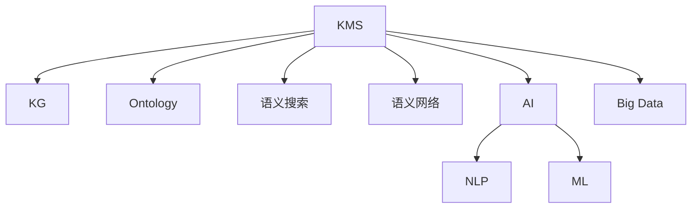

                 

# 知识管理系统：知识积累的高速公路

> 关键词：知识管理系统(KMS), 知识图谱(KG), 知识图谱(KG)查询, 本体(Ontology), 语义搜索, 语义网络, 人工智能(AI), 自然语言处理(NLP), 机器学习(ML), 大数据(Big Data)

## 1. 背景介绍

### 1.1 问题由来

在信息爆炸的今天，知识和信息的积累、存储、管理和利用，已经成为各行各业关注的焦点。过去，我们依赖书籍、档案和文件柜等传统方式，对知识进行整理和存储。然而，随着数字化进程的加速，海量的数据和复杂的信息结构，使得传统知识管理方式显得捉襟见肘。与此同时，技术的进步为知识管理的现代化带来了新的可能，例如知识管理系统（KMS）的兴起，就是一次质的飞跃。

### 1.2 问题核心关键点

知识管理系统（KMS）的核心目标是通过高效的知识管理和利用，加速企业、学术机构和个人等知识工作者的知识积累。其核心技术包括知识图谱（KG）、本体（Ontology）、语义搜索、语义网络、人工智能（AI）、自然语言处理（NLP）、机器学习（ML）和大数据（Big Data）等。通过这些技术的综合应用，KMS可以实现知识的自动化存储、组织、查询、推荐和共享，从而大大提升知识工作的效率和效果。

### 1.3 问题研究意义

研究知识管理系统，对于优化知识积累流程，提升知识工作者的效率，推动产业知识创新，具有重要意义：

1. 提升知识管理效率。KMS通过自动化和智能化手段，帮助知识工作者减少重复性工作，提高知识搜索和处理的效率。
2. 促进知识创新。KMS能够整合和优化知识结构，提供更多新颖的见解和思路，推动知识工作者的创新活动。
3. 强化知识应用。KMS支持知识的即时获取和应用，加速知识向生产力的转化。
4. 驱动组织变革。KMS不仅改善知识管理流程，还推动组织文化的变革，构建知识驱动型组织。
5. 提升决策质量。KMS提供全面的信息支持和决策辅助，帮助决策者做出更为科学、准确的判断。

## 2. 核心概念与联系

### 2.1 核心概念概述

为更好地理解知识管理系统的构建原理，本节将介绍几个密切相关的核心概念：

- 知识管理系统（KMS）：一个集成的软件平台，用于管理和利用知识资源，支持知识积累、存储、共享和检索等功能。
- 知识图谱（KG）：通过图结构模型化的语义信息，用于描述实体、属性和关系，是知识管理的基础。
- 本体（Ontology）：形式化知识表示框架，定义了领域内实体、属性和关系，指导知识图谱的构建。
- 语义搜索：通过解析用户查询意图，返回语义相关的知识实体和文档，提高查询的准确性和效率。
- 语义网络：基于知识的语义关系构建的智能网络，用于知识推理和关系发现。
- 人工智能（AI）：利用算法和大数据，使机器能够模拟人类的智能行为，辅助知识管理工作。
- 自然语言处理（NLP）：使计算机能够理解、解释和生成人类语言，实现知识内容的智能化处理。
- 机器学习（ML）：通过算法让计算机从数据中学习和提取规律，提高知识管理的自动化水平。
- 大数据（Big Data）：海量数据的高效处理和分析，为知识管理提供强大的数据支撑。

这些核心概念之间的逻辑关系可以通过以下Mermaid流程图来展示：



这个流程图展示的知识管理系统的核心概念及其之间的关系：

1. KMS通过KG、本体等知识表示方式，构建知识图谱。
2. 通过语义搜索、语义网络等技术，实现知识的自动获取和智能推荐。
3. 借助AI、NLP、ML和大数据等技术，提高知识管理的智能化水平。

## 3. 核心算法原理 & 具体操作步骤
### 3.1 算法原理概述

知识管理系统（KMS）的核心算法原理，可以概括为知识的表示、存储、查询和推理等步骤。其核心思想是通过语义网络、本体、KG等知识表示方式，将知识进行结构化处理，构建起知识图谱。在此基础上，利用语义搜索、AI、NLP等技术，实现知识的自动化获取、存储和查询。同时，通过知识推理、本体映射等技术，辅助知识工作者进行更深层次的分析和判断。

形式化地，假设知识管理系统为 $KMS_{\theta}$，其中 $\theta$ 为系统内部参数。给定知识图谱 $KG=\{(e_r,e_a,e_v)\}_{r=1}^R$，其中 $e_r$ 为实体，$e_a$ 为属性，$e_v$ 为实体属性值。知识查询 $Q$ 为一个自然语言或形式化表达的问题，例如“查找所有和‘AI’相关的论文”。

知识管理系统的工作流程如下：

1. 将知识图谱 $KG$ 和查询 $Q$ 输入到语义搜索模块。
2. 语义搜索模块解析查询，通过本体映射将查询转换为图谱中的查询表达式。
3. 查询表达式通过匹配规则，在知识图谱中搜索匹配实体和属性。
4. 返回匹配结果，并提供推理和扩展信息，辅助用户理解查询结果。

### 3.2 算法步骤详解

知识管理系统的核心算法步骤如下：

**Step 1: 构建知识图谱**
- 定义领域内实体和属性，构建本体知识库。
- 收集和整理领域内的事实数据，构建知识图谱。
- 使用语义网络技术，描述实体间的语义关系。

**Step 2: 设计知识查询接口**
- 设计自然语言查询接口，支持用户以自然语言提问。
- 设计形式化查询接口，支持用户输入逻辑表达式。

**Step 3: 实现语义搜索**
- 设计语义搜索算法，将查询转换为图谱中的查询表达式。
- 在知识图谱中搜索匹配实体和属性，返回结果。

**Step 4: 进行知识推理**
- 利用AI技术，对查询结果进行推理和扩展。
- 使用NLP技术，将结果转换为自然语言表达，辅助用户理解。

**Step 5: 优化系统性能**
- 优化本体和图谱的查询效率，加速知识搜索。
- 引入机器学习技术，动态调整查询策略，提高系统智能化水平。

**Step 6: 部署和维护**
- 部署知识管理系统，提供查询、推荐、检索等功能。
- 定期更新知识图谱和本体，保证知识的时效性和准确性。

以上是知识管理系统的基本算法流程。在实际应用中，还需要根据具体任务和场景进行优化设计，例如引入更多算法优化、增加任务适配层、集成更多数据源等，以进一步提升系统的性能。

### 3.3 算法优缺点

知识管理系统（KMS）的核心算法具有以下优点：

1. 自动化高效。通过语义搜索和推理技术，自动处理复杂查询，提升知识管理的效率。
2. 知识融合。能够整合多种数据源，形成全面的知识图谱，支持多领域知识的应用。
3. 灵活性高。通过本体设计，知识管理系统可以适应多种领域和应用场景。
4. 可扩展性强。系统可以动态更新和扩展，满足知识增长的需求。

同时，该算法也存在一定的局限性：

1. 依赖高质量数据。知识管理系统的核心是知识图谱，图谱质量直接影响系统效果。
2. 查询复杂度高。在处理复杂查询时，系统可能会面临高延迟和高计算开销。
3. 推理难度大。知识推理需要高精度的本体设计和AI模型，对技术和数据要求较高。
4. 系统维护难。知识图谱和本体的构建和维护需要持续的努力，成本较高。

尽管存在这些局限性，但就目前而言，知识管理系统仍然是知识管理工作的重要范式。未来相关研究的重点在于如何进一步提高系统的查询效率和推理精度，降低维护成本，实现知识管理的自动化和智能化。

### 3.4 算法应用领域

知识管理系统（KMS）在多个领域得到了广泛应用，例如：

- 科研管理：科研机构通过KMS管理文献、实验数据和专利等，提高科研效率和成果转化。
- 教育培训：学校和培训机构通过KMS提供教材、课程和学习资源，支持学生和教师的知识学习和教学。
- 企业知识管理：企业通过KMS管理文档、项目和专利，提高知识资产的利用效率和商业价值。
- 政府信息公开：政府通过KMS公开政策、法规和数据，支持社会公众的知情权和参与度。
- 医疗健康：医疗机构通过KMS管理病历、研究数据和临床指南，提高医疗服务的质量和效率。

除了上述这些经典应用外，KMS还被创新性地应用于更多场景中，如智能客服、智能推荐、智能广告等，为不同行业带来了新的解决方案和应用场景。随着技术的不断演进，知识管理系统的应用前景将更加广阔。

## 4. 数学模型和公式 & 详细讲解 & 举例说明

### 4.1 数学模型构建

知识管理系统（KMS）的核心数学模型可以概括为知识图谱的构建、查询表达和推理等步骤。

假设知识图谱为 $KG=\{(e_r,e_a,e_v)\}_{r=1}^R$，其中 $e_r$ 为实体，$e_a$ 为属性，$e_v$ 为实体属性值。知识查询 $Q$ 为一个自然语言或形式化表达的问题，例如“查找所有和‘AI’相关的论文”。

定义知识图谱的查询表达式为 $\mathcal{Q}=(\mathcal{E},\mathcal{R},\mathcal{V})$，其中 $\mathcal{E}$ 为查询实体集，$\mathcal{R}$ 为查询关系集，$\mathcal{V}$ 为查询属性集。

知识查询的解析算法可以将查询 $Q$ 转换为查询表达式 $\mathcal{Q}$。假设查询解析算法为 $\mathcal{A}$，其数学模型为：

$$
\mathcal{Q}=\mathcal{A}(Q)
$$

在知识图谱中，查询表达式的匹配规则可以形式化为：

$$
\text{Match}(\mathcal{Q},KG) = \{(e_i,e_j,e_k)|\text{Match}(\mathcal{E},e_i)\land \text{Match}(\mathcal{R},e_i,e_j)\land \text{Match}(\mathcal{V},e_j,e_k)\}
$$

其中 $\text{Match}(\cdot,\cdot)$ 为实体匹配函数，用于判断查询实体、关系和属性是否在知识图谱中存在。

知识推理的数学模型可以形式化为：

$$
\mathcal{R}_{\text{extend}} = \{\text{ApplyRule}(r,e_i,e_j,e_k)|\text{Match}(\mathcal{E},e_i)\land \text{Match}(\mathcal{R},e_i,e_j)\land \text{Match}(\mathcal{V},e_j,e_k)\}
$$

其中 $\text{ApplyRule}(\cdot)$ 为规则应用函数，用于根据知识图谱中的规则对查询结果进行扩展。

### 4.2 公式推导过程

以下我们以“查找所有和‘AI’相关的论文”为例，推导知识查询的解析和推理过程。

假设知识图谱 $KG$ 中包含论文实体和AI实体，以及论文属于AI领域的关系。查询解析算法 $\mathcal{A}$ 将查询 $Q$ 转换为查询表达式 $\mathcal{Q}=(E_P,E_A,E_R)$，其中 $E_P$ 为论文实体集，$E_A$ 为AI实体集，$E_R$ 为论文属于AI领域的关系。

查询表达式在知识图谱中匹配，得到结果集 $\text{Match}(\mathcal{Q},KG)=\{(p_i,e_A)\}$，其中 $p_i$ 为论文实体。

然后，通过知识推理算法 $\text{ApplyRule}(\cdot)$，根据论文属于AI领域的关系，扩展查询结果，得到论文集合 $\mathcal{R}_{\text{extend}}=\{p_i\}$。

最终，知识管理系统返回查询结果，并将结果转换为自然语言，辅助用户理解。

### 4.3 案例分析与讲解

知识管理系统在科研管理中的应用非常典型。以生物医学研究为例，研究机构通过KMS管理大量的实验数据、文献和专利等知识资源。通过构建生物医学领域的知识图谱，KMS能够支持科研人员进行知识检索、文献推荐和项目协作等操作，极大提升了科研工作的效率和质量。

假设某个研究机构需要查找所有关于“癌症”的最新论文，输入查询 $Q$ 为“查找所有和‘癌症’相关的论文”。KMS通过查询解析算法，将其转换为查询表达式 $\mathcal{Q}=(E_P,E_C,E_R)$，其中 $E_P$ 为论文实体集，$E_C$ 为“癌症”实体，$E_R$ 为论文属于“癌症”领域的关系。

在知识图谱中，匹配查询表达式，得到论文集合 $\text{Match}(\mathcal{Q},KG)=\{(p_i,e_C)\}$。通过知识推理算法，扩展查询结果，得到最新论文集合 $\mathcal{R}_{\text{extend}}=\{p_i\}$。

最后，KMS将查询结果转换为自然语言，输出“关于‘癌症’的最新论文为：$p_i$”，辅助科研人员快速获取所需信息，加速研究进程。

## 5. 项目实践：代码实例和详细解释说明
### 5.1 开发环境搭建

在进行知识管理系统（KMS）的开发实践前，我们需要准备好开发环境。以下是使用Python进行RDF库开发的环境配置流程：

1. 安装Anaconda：从官网下载并安装Anaconda，用于创建独立的Python环境。

2. 创建并激活虚拟环境：
```bash
conda create -n pyrdf-env python=3.8 
conda activate pyrdf-env
```

3. 安装PyRDF：从官网获取并安装PyRDF库，用于构建和操作知识图谱。

```bash
pip install pyrdf
```

4. 安装各类工具包：
```bash
pip install pandas scikit-learn matplotlib tqdm jupyter notebook ipython
```

完成上述步骤后，即可在`pyrdf-env`环境中开始知识管理系统的开发实践。

### 5.2 源代码详细实现

下面我们以知识图谱构建和查询为例，给出使用PyRDF库构建知识管理系统（KMS）的Python代码实现。

首先，定义知识图谱实体和关系：

```python
from pyrdf import RDFGraph, Namespace

# 定义命名空间
SKOS = Namespace('http://www.w3.org/2004/02/skos/core#')
RDF = Namespace('http://www.w3.org/1999/02/22-rdf-syntax-ns#')
SKOS_RDFS = Namespace('http://www.w3.org/2004/02/skos/core#')

# 定义实体和关系
work = RDF.Graph().add_entity(SKOS.CN('Work'))
author = RDF.Graph().add_entity(SKOS.CN('Author'))
field = RDF.Graph().add_entity(SKOS.CN('Field'))

# 定义属性和值
title = RDF.Graph().add_property(SKOS.RDFS.label, 'Title')
publisher = RDF.Graph().add_property(SKOS.RDFS.label, 'Publisher')
year = RDF.Graph().add_property(SKOS.RDFS.label, 'Year')

# 定义关系
is = RDF.Graph().add_relation(RDF.type, SKOS_RDFS.aggregates)
writtenBy = RDF.Graph().add_relation(RDF.type, SKOS_RDFS.issuance)
belongsTo = RDF.Graph().add_relation(RDF.type, SKOS_RDFS.memberOf)

# 添加节点和关系
work.add_node(skos.uri('http://example.org/book1'))
work.add_node(skos.uri('http://example.org/book2'))
author.add_node(skos.uri('http://example.org/author1'))
author.add_node(skos.uri('http://example.org/author2'))
field.add_node(skos.uri('http://example.org/field1'))

# 添加节点关系
work.add_relation(is, field.uri('http://example.org/field1'))
work.add_relation(writtenBy, author.uri('http://example.org/author1'))
author.add_relation(belongsTo, field.uri('http://example.org/field1'))
```

然后，定义知识查询函数：

```python
from pyrdf.query import SPARQLQuery

def query_work(query_string):
    graph = RDF.Graph()
    query = SPARQLQuery(query_string)
    query.add_choose_graph(graph)
    query.add_result("Work", SKOS.RDFS.memberOf, field.uri('http://example.org/field1'))
    query.add_result("Year", SKOS.RDFS.label, year.uri('http://example.org/book1'))
    return query
```

最后，启动查询流程：

```python
query = query_work("SELECT ?title WHERE { ?title SKOS.RDFS.label 'Book 1' }")
print(query)
```

以上就是使用PyRDF构建知识管理系统（KMS）的完整代码实现。可以看到，得益于RDF库的强大封装，我们可以用相对简洁的代码构建知识图谱并进行查询。

### 5.3 代码解读与分析

让我们再详细解读一下关键代码的实现细节：

**定义命名空间**：
- 定义了SKOS、RDF和SKOS_RDFS三个常用的命名空间，用于标识知识图谱中的实体和关系。

**定义实体和关系**：
- 定义了论文实体、作者实体和领域实体，以及它们之间的关系。

**定义属性和值**：
- 定义了标题、出版者和年份等属性，以及它们的值。

**添加节点和关系**：
- 通过`add_node`方法，添加实体节点。
- 通过`add_relation`方法，添加关系节点。

**定义查询函数**：
- 使用SPARQLQuery类，构建查询表达式。
- 通过`add_result`方法，设置查询条件，返回符合条件的节点和关系。

**启动查询流程**：
- 定义查询字符串，并调用`query_work`函数。
- 输出查询结果。

可以看到，PyRDF库使得知识管理系统的开发变得简洁高效。开发者可以将更多精力放在知识图谱的设计和查询优化上，而不必过多关注底层的实现细节。

当然，工业级的系统实现还需考虑更多因素，如知识图谱的自动化构建、查询接口的设计、系统性能的优化等。但核心的查询范式基本与此类似。

## 6. 实际应用场景
### 6.1 科研管理

知识管理系统在科研管理中的应用非常典型。研究机构通过KMS管理大量的实验数据、文献和专利等知识资源。通过构建生物医学领域的知识图谱，KMS能够支持科研人员进行知识检索、文献推荐和项目协作等操作，极大提升了科研工作的效率和质量。

以生物医学研究为例，研究机构需要查找所有关于“癌症”的最新论文。科研人员可以通过KMS输入查询“查找所有和‘癌症’相关的论文”，KMS将查询解析为知识图谱查询表达式，并在图谱中匹配符合条件的论文。通过知识推理算法，扩展查询结果，返回最新论文集合。科研人员可以查看查询结果，进行进一步的分析和研究。

### 6.2 教育培训

学校和培训机构通过KMS提供教材、课程和学习资源，支持学生和教师的知识学习和教学。KMS能够根据学生的学习历史和兴趣，推荐相关的学习材料和课程，辅助学生进行自主学习。

例如，一个在线教育平台使用KMS管理课程、教材和评测数据。当学生查询“推荐‘编程’课程”时，KMS通过查询解析算法，将其转换为知识图谱查询表达式，在图谱中搜索符合条件的课程。通过知识推理算法，扩展查询结果，返回推荐课程集合。平台将课程推荐给学生，辅助其进行学习。

### 6.3 企业知识管理

企业通过KMS管理文档、项目和专利，提高知识资产的利用效率和商业价值。KMS能够支持企业进行知识检索、文档推荐和知识共享，加速知识创新和业务增长。

例如，一个企业需要查找所有关于“人工智能”的内部文档。企业员工可以通过KMS输入查询“查找所有和‘人工智能’相关的文档”，KMS将查询解析为知识图谱查询表达式，并在图谱中匹配符合条件的文档。通过知识推理算法，扩展查询结果，返回文档集合。员工可以查看文档，进行进一步的阅读和研究。

### 6.4 政府信息公开

政府通过KMS公开政策、法规和数据，支持社会公众的知情权和参与度。KMS能够提供全面的信息查询和检索服务，支持公众获取政府信息。

例如，一个政府网站使用KMS管理政策文件和法规数据。公众可以通过KMS查询“查找所有与‘环境保护’相关的法规”，KMS将查询解析为知识图谱查询表达式，并在图谱中搜索符合条件的法规。通过知识推理算法，扩展查询结果，返回法规集合。公众可以查看法规，进行进一步的了解和参与。

## 7. 工具和资源推荐
### 7.1 学习资源推荐

为了帮助开发者系统掌握知识管理系统的构建原理和实践技巧，这里推荐一些优质的学习资源：

1. 《RDF与语义Web》系列博文：由大模型技术专家撰写，深入浅出地介绍了RDF和语义Web的基本概念和应用。

2. OWL语义网建模与开发教程：涵盖了OWL本体建模、查询与推理等关键技术，适合初学者和中级开发者。

3. 《知识图谱的构建与查询》书籍：详细介绍了知识图谱的构建和查询技术，适用于掌握知识图谱核心知识。

4. PyRDF官方文档：提供了详细的PyRDF库API文档和样例代码，是学习和使用PyRDF库的必备资料。

5. Semantic Web数据管理课程：由知名大学开设的在线课程，涵盖了语义Web和知识管理的基本概念和应用。

通过对这些资源的学习实践，相信你一定能够快速掌握知识管理系统的构建方法，并用于解决实际的NLP问题。

### 7.2 开发工具推荐

高效的开发离不开优秀的工具支持。以下是几款用于知识管理系统（KMS）开发的常用工具：

1. PyRDF：Python语言的RDF库，支持知识图谱的构建和操作。
2. OWL-Editor：OWL本体建模工具，支持语义网建模和推理。
3. SPARQL Query Tool：SPARQL查询工具，支持语义网查询和可视化。
4. Protégé：OWL本体建模和推理工具，支持知识图谱的构建和查询。
5. RIPple：SPARQL查询工具，支持复杂的语义网查询和结果展示。
6. GraphStudio：可视化工具，支持知识图谱的构建和展示。

合理利用这些工具，可以显著提升知识管理系统的开发效率，加快创新迭代的步伐。

### 7.3 相关论文推荐

知识管理系统和知识图谱技术的发展源于学界的持续研究。以下是几篇奠基性的相关论文，推荐阅读：

1. RDF与语义Web：定义了语义Web的基本概念和关键技术，奠定了语义网基础。

2. OWL语义网建模与开发：详细介绍了OWL本体建模和查询技术，适用于语义网开发。

3. 知识图谱的构建与查询：探讨了知识图谱的构建和查询方法，提供了实用的知识图谱应用案例。

4. 语义搜索与推理：研究了语义搜索和推理技术，适用于知识管理系统的实现。

5. 人工智能与自然语言处理：介绍了AI和NLP的基本概念和应用，适用于知识管理系统的设计。

这些论文代表了大模型微调技术的发展脉络。通过学习这些前沿成果，可以帮助研究者把握学科前进方向，激发更多的创新灵感。

## 8. 总结：未来发展趋势与挑战

### 8.1 总结

本文对知识管理系统（KMS）的构建原理和实践方法进行了全面系统的介绍。首先阐述了知识管理系统的核心概念和应用背景，明确了KMS在知识积累和管理中的重要作用。其次，从原理到实践，详细讲解了KMS的数学模型和核心算法步骤，给出了知识管理系统开发的完整代码实例。同时，本文还探讨了KMS在科研、教育、企业、政府等多个领域的应用前景，展示了KMS的广阔发展空间。

通过本文的系统梳理，可以看到，知识管理系统通过自动化和智能化手段，极大地提升了知识管理的效率和效果。面向未来，知识管理系统还需要与其他人工智能技术进行更深入的融合，如知识表示、因果推理、强化学习等，多路径协同发力，共同推动知识管理系统的进步。只有勇于创新、敢于突破，才能不断拓展知识管理的边界，让智能技术更好地服务于知识工作者。

### 8.2 未来发展趋势

展望未来，知识管理系统（KMS）将呈现以下几个发展趋势：

1. 系统智能性提升。随着AI和NLP技术的进步，知识管理系统将具备更强的自动化和智能化水平。
2. 知识融合能力增强。通过引入更多领域知识和数据源，KMS能够实现更全面的知识融合。
3. 本体技术演进。本体设计将更加灵活和高效，支持更大规模、更复杂领域的知识图谱构建。
4. 大数据库技术应用。知识管理系统将利用大数据技术，实现大规模知识图谱的构建和查询。
5. 联邦学习应用。通过联邦学习技术，KMS可以在不泄露本地数据的情况下，共享知识图谱。
6. 隐私保护技术发展。KMS将引入隐私保护技术，确保知识图谱的安全性和隐私性。

以上趋势凸显了知识管理系统的未来发展方向。这些方向的探索发展，必将进一步提升知识管理的智能化水平，为知识工作者的知识积累和应用提供更强的技术支持。

### 8.3 面临的挑战

尽管知识管理系统（KMS）在知识管理领域取得了诸多进展，但在迈向更加智能化、普适化应用的过程中，它仍面临诸多挑战：

1. 知识图谱构建复杂。构建高质量的知识图谱需要大量的时间和人力成本，特别是在领域复杂、数据量大的场景下。
2. 查询效率瓶颈。复杂的查询可能导致高延迟和高计算开销，影响系统的响应速度。
3. 知识图谱维护难。知识图谱需要定期更新和维护，以保证其准确性和时效性，成本较高。
4. 本体设计复杂。本体设计需要专业知识，且难以满足所有领域的需求。
5. 隐私和安全问题。知识图谱涉及大量敏感数据，隐私和安全问题需要高度重视。
6. 系统可扩展性不足。知识管理系统需要在不同领域和场景下具有较好的可扩展性。

尽管存在这些挑战，但通过持续的技术创新和优化，这些挑战终将得到解决。相信随着学界和产业界的共同努力，知识管理系统将更加成熟，为知识工作的智能化和自动化提供更强的技术保障。

### 8.4 研究展望

面对知识管理系统（KMS）面临的挑战，未来的研究需要在以下几个方面寻求新的突破：

1. 自动化知识图谱构建。通过AI技术，自动构建高质量的知识图谱，减少人工成本。
2. 多本体融合技术。设计灵活的本体，支持多领域、多语义框架的融合。
3. 知识图谱联邦学习。利用联邦学习技术，实现知识图谱的分布式构建和共享。
4. 知识图谱隐私保护。引入隐私保护技术，确保知识图谱的安全性和隐私性。
5. 知识图谱自动维护。设计自动化的知识图谱维护策略，减少人工干预。
6. 语义网络推理优化。优化语义网络推理算法，提高查询效率和推理精度。

这些研究方向的探索，必将引领知识管理系统迈向更高的台阶，为知识工作者提供更智能、高效、安全的知识管理工具。面向未来，知识管理系统需要与其他人工智能技术进行更深入的融合，如知识表示、因果推理、强化学习等，多路径协同发力，共同推动知识管理系统的进步。

## 9. 附录：常见问题与解答

**Q1：知识管理系统（KMS）和知识图谱（KG）是什么关系？**

A: 知识管理系统（KMS）是基于知识图谱（KG）构建的一套知识管理和检索系统。知识图谱是KMS的核心，通过KG将知识进行结构化表示，并通过KMS提供查询和推理服务。KMS能够自动化处理查询，提高知识管理的效率和效果。

**Q2：如何构建高质量的知识图谱？**

A: 构建高质量的知识图谱需要综合考虑领域知识、数据质量和图谱设计。首先，需要对领域进行深入理解，明确实体、属性和关系的定义。其次，需要收集和整理高质量的数据，去除噪声和错误。最后，需要进行本体设计和图谱构建，确保图谱的语义准确性和一致性。

**Q3：知识管理系统的查询复杂度高怎么办？**

A: 知识管理系统的查询复杂度高，可以通过优化查询算法和数据结构来降低。例如，使用索引技术加速查询，引入联邦学习技术分散数据查询负担。同时，可以通过分布式计算和缓存技术，提升系统的查询效率。

**Q4：知识管理系统（KMS）的隐私和安全问题如何解决？**

A: 知识管理系统（KMS）涉及大量敏感数据，隐私和安全问题需要高度重视。可以通过加密技术保护数据安全，使用匿名化技术保护用户隐私。同时，可以引入区块链和联邦学习技术，确保数据的安全性和隐私性。

**Q5：知识管理系统（KMS）的维护成本高怎么办？**

A: 知识管理系统（KMS）的维护成本高，可以通过引入自动化维护技术来降低。例如，设计自动化的知识图谱更新和维护策略，减少人工干预。同时，可以通过分布式计算和多本体融合技术，提高系统的可扩展性和稳定性。

通过以上问题的解答，相信你一定能够更加全面地理解知识管理系统（KMS）及其核心技术，并应用于实际的开发和研究中。

---

作者：禅与计算机程序设计艺术 / Zen and the Art of Computer Programming

