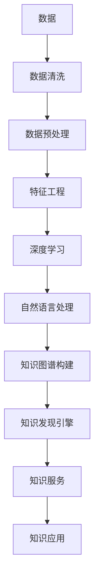

                 

# 知识管理革命：知识发现引擎的主导作用

## 1. 背景介绍

### 1.1 问题由来

在当今信息爆炸的时代，知识的获取、存储和应用已经成为一个关键难题。随着人类知识的持续积累，传统的数据仓库和文档管理系统已经难以应对日益增长的知识管理和共享需求。如何高效地发现、组织和利用海量知识，成为各大企业和组织亟需解决的重大问题。

在这样的背景下，知识发现引擎（Knowledge Discovery Engine, KDE）应运而生。它通过利用先进的算法和人工智能技术，从大规模数据中自动挖掘和组织知识，为决策者提供有力的支持。目前，KDE已经在学术界和企业界引起了广泛关注，成为知识管理领域的新热点。

### 1.2 问题核心关键点

KDE的核心目标在于：

- **自动挖掘知识**：通过机器学习和深度学习技术，从非结构化数据中自动发现和提取有价值的信息。
- **组织结构化知识**：将自动挖掘出来的知识结构化存储，方便检索和应用。
- **提供知识服务**：通过构建知识服务体系，使知识能够被广泛传播和使用，支持决策和创新。

实现这些目标，需要围绕数据、算法和知识三者进行系统化设计和优化。数据是知识的来源，算法是知识的挖掘和组织方式，而知识则是算法挖掘结果的呈现和应用。因此，构建有效的KDE需要同时关注这三个维度，形成一个完整的知识管理闭环。

## 2. 核心概念与联系

### 2.1 核心概念概述

为更好地理解KDE的核心概念，本节将介绍几个密切相关的核心概念：

- **知识发现引擎（KDE）**：基于先进算法和大数据技术，从大规模数据中自动发现和组织知识的系统。
- **数据挖掘**：通过统计学和机器学习技术，从数据中自动发现模式、规律和关联的过程。
- **深度学习**：一种基于神经网络的机器学习技术，能够处理大规模复杂数据，发现隐藏在数据中的高层次特征和结构。
- **自然语言处理（NLP）**：涉及计算机理解和生成自然语言的技术，是KDE中常用的知识挖掘手段之一。
- **知识图谱**：一种语义网络结构，用于表示实体、属性和关系，方便知识检索和推理。
- **元数据（Metadata）**：描述数据的数据，包括数据源、类型、质量和处理方式等信息，是构建知识库的重要支撑。

这些核心概念之间的逻辑关系可以通过以下Mermaid流程图来展示：



这个流程图展示了KDE的核心流程：

1. 原始数据通过清洗和预处理，转化为可用于机器学习的数据集。
2. 通过特征工程提取关键特征，并应用深度学习技术进行模型训练。
3. 利用自然语言处理技术，从文本数据中挖掘出结构化知识。
4. 构建知识图谱，用于表示和存储知识结构。
5. 通过知识发现引擎自动发现和组织知识。
6. 构建知识服务体系，提供知识查询和应用接口。
7. 知识服务被广泛应用于决策支持、业务智能等领域。

## 3. 核心算法原理 & 具体操作步骤

### 3.1 算法原理概述

KDE的核心算法原理主要包括以下几个方面：

1. **数据清洗和预处理**：清洗和预处理是KDE的第一步，通过去除噪声、缺失值和异常值，将原始数据转化为可用于机器学习的数据集。

2. **特征工程**：通过特征提取和降维技术，将高维数据转化为低维、易于处理的特征向量，从而提高模型的泛化能力。

3. **深度学习模型训练**：利用深度神经网络进行特征提取和模式识别，发现数据中的隐含规律和关联。

4. **自然语言处理**：通过文本挖掘技术，从非结构化文本数据中提取结构化信息，如实体、关系和情感等。

5. **知识图谱构建**：将从文本和数据中挖掘出来的实体、属性和关系，构建为语义网络结构，方便知识检索和推理。

6. **知识发现**：通过算法自动发现和组织知识，形成知识库和知识图谱，提供决策支持。

7. **知识服务**：将知识库封装为API和接口，供不同用户和系统使用，实现知识的广泛传播和应用。

### 3.2 算法步骤详解

以下是KDE的核心算法步骤详解：

**Step 1: 数据清洗和预处理**
- 去除重复数据和异常值
- 处理缺失数据和噪声
- 归一化和标准化数据
- 分词、去除停用词等文本预处理

**Step 2: 特征工程**
- 提取关键特征，如TF-IDF、词频、词向量等
- 进行特征降维，如主成分分析(PCA)、线性判别分析(LDA)等
- 使用领域知识进行特征筛选和优化

**Step 3: 深度学习模型训练**
- 构建深度神经网络模型，如卷积神经网络(CNN)、循环神经网络(RNN)、Transformer等
- 利用标注数据训练模型，最小化损失函数
- 使用正则化技术，如L2正则、Dropout等，防止过拟合

**Step 4: 自然语言处理**
- 分词、词性标注、命名实体识别等基础处理
- 关系抽取、情感分析、意图识别等高级处理
- 利用预训练模型，如BERT、GPT等，提取文本特征

**Step 5: 知识图谱构建**
- 从数据和文本中提取实体和关系
- 使用关系抽取和关系对齐技术，构建知识图谱
- 使用推理技术，如逻辑规则、图神经网络等，丰富知识图谱内容

**Step 6: 知识发现**
- 利用知识图谱进行语义相似度计算
- 通过聚类和分类算法，发现知识库中的模式和规律
- 使用图谱中的推理机制，发现实体间的隐含关系

**Step 7: 知识服务**
- 构建API接口，供不同系统和应用调用
- 提供知识查询和推理服务，支持决策支持
- 使用缓存和负载均衡技术，提高知识服务的响应速度

### 3.3 算法优缺点

KDE算法具有以下优点：
1. 自动发现和组织知识，减少人工干预，提高效率。
2. 利用深度学习和大数据技术，发现隐藏的知识模式和关联。
3. 能够处理大规模非结构化数据，如文本、图像等。
4. 知识图谱表示和推理，方便知识检索和应用。

同时，KDE算法也存在一些局限性：
1. 对数据质量要求高，需要高质量的标注数据和数据清洗。
2. 深度学习模型的计算资源需求高，需要高性能计算设备。
3. 知识图谱构建复杂，需要大量人工干预和规则编写。
4. 知识服务体系复杂，需要考虑多用户和多系统的协同。
5. 知识库的维护和更新需要持续投入。

尽管存在这些局限性，但KDE算法在处理大规模复杂数据和结构化知识方面具有独特的优势，是实现知识管理的重要工具。

### 3.4 算法应用领域

KDE算法已经在多个领域得到了广泛应用，包括但不限于：

- **金融风控**：通过自动挖掘和组织金融数据，构建风险评估模型，提高金融决策的准确性。
- **医疗健康**：从电子病历和医疗文献中挖掘知识，支持临床决策和医疗研究。
- **电商推荐**：从用户行为数据中挖掘出商品推荐策略，提升用户体验和销售效果。
- **智能客服**：构建知识库和推理系统，提高客服系统的自动化和智能化水平。
- **舆情分析**：从社交媒体和新闻报道中挖掘舆情信息，辅助舆情监控和公共政策决策。
- **供应链管理**：从订单和物流数据中挖掘供应链模式，优化供应链管理流程。
- **资源环境**：从环境监测数据中挖掘出资源利用和环境变化规律，支持资源管理和环境保护。

## 4. 数学模型和公式 & 详细讲解 & 举例说明

### 4.1 数学模型构建

本节将使用数学语言对KDE的核心算法进行严格刻画的数学模型构建。

记原始数据集为 $D=\{(x_i, y_i)\}_{i=1}^N$，其中 $x_i \in \mathbb{R}^d$ 为输入特征，$y_i \in \{1,2,\ldots,K\}$ 为标签。设数据清洗和预处理后的数据集为 $D'$，特征工程后的特征集为 $F$，深度学习模型的参数为 $\theta$，自然语言处理模型的参数为 $\phi$，知识图谱的节点集合为 $N$，关系集合为 $R$。

定义知识发现引擎的训练目标函数为：

$$
L(\theta, \phi, N, R) = \sum_{i=1}^N \ell(D', y_i) + \alpha \mathcal{L}(F, \theta) + \beta \mathcal{L}(N, \phi)
$$

其中 $\ell$ 为损失函数，$\mathcal{L}$ 为图谱构建和推理损失函数，$\alpha$ 和 $\beta$ 为正则化参数。

### 4.2 公式推导过程

以下我们以知识图谱构建和推理为例，推导其数学模型和公式。

假设知识图谱中的节点表示为 $N=\{n_1,n_2,\ldots,n_M\}$，关系表示为 $R=\{r_1,r_2,\ldots,r_N\}$，每个节点 $n_i$ 包含属性向量 $\mathbf{a}_i \in \mathbb{R}^{d_a}$，每个关系 $r_j$ 包含规则 $R_j$ 和条件 $C_j$。

定义节点之间的关系表示为 $E \in \{(n_i,n_j)|r_{i,j} \in R, n_i \in N, n_j \in N\}$，每个关系 $r_{i,j}$ 对应的条件 $C_{i,j}$ 为 $n_i$ 和 $n_j$ 的属性满足程度。

节点间的关系推理可以表示为如下逻辑推理过程：

$$
R(\mathbf{a}_i,\mathbf{a}_j) = \mathbf{u}^T \mathbf{a}_i \odot \mathbf{a}_j
$$

其中 $\mathbf{u}$ 为关系权重向量，$\odot$ 表示逐元素乘积。

根据以上逻辑推理公式，可以计算出每个节点的概率分布 $P(N)$，从而推导出知识图谱的语义相似度 $S(n_i,n_j)$。

### 4.3 案例分析与讲解

**案例：金融风控知识发现引擎**

在金融风控场景中，KDE可以自动从用户数据和金融交易数据中挖掘出风险模式和特征。具体步骤如下：

1. 数据清洗和预处理：去除异常值和噪声，归一化数据。

2. 特征工程：提取用户行为特征和交易特征，如信用记录、消费习惯、交易金额等。

3. 深度学习模型训练：使用CNN或RNN模型，从用户行为数据中学习风险模式。

4. 自然语言处理：从金融文献和新闻中提取风险词汇和事件，构建知识图谱。

5. 知识图谱构建：将提取的风险词汇和事件构建成节点，利用关系抽取技术，构建风险关系图谱。

6. 知识发现：利用图谱中的推理机制，发现潜在的高风险用户和交易行为。

7. 知识服务：构建API接口，提供风险评估和预警服务，支持决策支持。

## 5. 项目实践：代码实例和详细解释说明

### 5.1 开发环境搭建

在进行KDE实践前，我们需要准备好开发环境。以下是使用Python进行PyTorch开发的环境配置流程：

1. 安装Anaconda：从官网下载并安装Anaconda，用于创建独立的Python环境。

2. 创建并激活虚拟环境：
```bash
conda create -n kde-env python=3.8 
conda activate kde-env
```

3. 安装PyTorch：根据CUDA版本，从官网获取对应的安装命令。例如：
```bash
conda install pytorch torchvision torchaudio cudatoolkit=11.1 -c pytorch -c conda-forge
```

4. 安装Scikit-learn、Numpy、Pandas、Tqdm等工具包：
```bash
pip install scikit-learn numpy pandas tqdm jupyter notebook ipython
```

5. 安装深度学习框架：
```bash
pip install pytorch
```

完成上述步骤后，即可在`kde-env`环境中开始KDE实践。

### 5.2 源代码详细实现

下面我们以构建一个金融风控KDE为例，给出使用PyTorch进行知识图谱构建和推理的代码实现。

首先，定义知识图谱节点的类：

```python
import torch

class Node:
    def __init__(self, node_id, attribute):
        self.node_id = node_id
        self.attribute = attribute

    def __repr__(self):
        return f"Node({self.node_id}, {self.attribute})"
```

然后，定义知识图谱关系的类：

```python
class Relationship:
    def __init__(self, relationship_id, condition):
        self.relationship_id = relationship_id
        self.condition = condition

    def __repr__(self):
        return f"Relationship({self.relationship_id}, {self.condition})"
```

接着，定义知识图谱推理引擎的类：

```python
import torch.nn as nn

class KnowledgeGraph(nn.Module):
    def __init__(self, nodes, relationships):
        super(KnowledgeGraph, self).__init__()
        self.nodes = nodes
        self.relationships = relationships
        self.node_weights = nn.Parameter(torch.randn(len(nodes), len(nodes)))

    def forward(self, node_ids):
        node_scores = torch.zeros(len(nodes), len(nodes))
        for i in range(len(nodes)):
            for j in range(len(nodes)):
                if self.nodes[i].node_id != self.nodes[j].node_id:
                    relationship_score = self.node_weights[i, j]
                    condition_score = self._calculate_condition_score(i, j)
                    node_scores[i, j] = relationship_score * condition_score
        return node_scores

    def _calculate_condition_score(self, node_i, node_j):
        if self.relationships[0].condition(node_i, node_j):
            return 1.0
        else:
            return 0.0
```

最后，启动推理过程：

```python
# 定义节点和关系
node1 = Node(1, [1, 2, 3])
node2 = Node(2, [4, 5, 6])
relationship1 = Relationship(1, lambda node1, node2: node1.attribute[0] == node2.attribute[0])

# 构建知识图谱
kg = KnowledgeGraph([node1, node2], [relationship1])

# 推理计算
node_scores = kg(node1.node_id)
print(node_scores)
```

以上就是使用PyTorch构建知识图谱和进行推理的完整代码实现。可以看到，PyTorch提供了丰富的深度学习工具，方便构建和训练复杂的知识图谱模型。

### 5.3 代码解读与分析

让我们再详细解读一下关键代码的实现细节：

**Node和Relationship类**：
- `Node`类表示知识图谱中的节点，包含节点编号和属性。
- `Relationship`类表示知识图谱中的关系，包含关系编号和条件函数。

**KnowledgeGraph类**：
- 继承自PyTorch的`nn.Module`，方便定义和训练知识图谱模型。
- 包含节点、关系和节点权重矩阵，用于存储知识图谱的基本信息。
- `forward`方法计算节点间的条件得分和关系得分，并输出节点得分矩阵。

**节点得分矩阵计算**：
- 利用条件函数和关系权重，计算节点间的条件得分和关系得分，最终得到节点得分矩阵。

通过代码示例，我们可以看到，使用PyTorch构建知识图谱和进行推理非常简单，只需定义节点、关系和关系函数，并调用`KnowledgeGraph`类即可。PyTorch提供了丰富的深度学习库和工具，使得知识图谱的构建和推理变得更加高效和便捷。

## 6. 实际应用场景

### 6.1 智能客服系统

在智能客服系统中，KDE可以自动从历史客服数据中挖掘出常见问题及其解决方案，构建知识图谱，辅助客服机器人提供精准回复。具体步骤如下：

1. 数据清洗和预处理：去除异常值和噪声，归一化数据。

2. 特征工程：提取用户查询和问题关键词，构建特征向量。

3. 深度学习模型训练：使用RNN或Transformer模型，从历史对话中学习回复模式。

4. 自然语言处理：从客户查询中提取实体和意图，构建知识图谱。

5. 知识图谱构建：将提取的实体和意图构建成节点，利用关系抽取技术，构建问题-解决方案图谱。

6. 知识发现：利用图谱中的推理机制，发现常见问题及其解决方案。

7. 知识服务：构建API接口，提供自动回复和问题分类服务，支持客服系统。

### 6.2 医疗健康

在医疗健康领域，KDE可以从电子病历和医学文献中挖掘出疾病特征和治疗方案，构建知识图谱，支持临床决策和医疗研究。具体步骤如下：

1. 数据清洗和预处理：去除异常值和噪声，归一化数据。

2. 特征工程：提取疾病症状和诊断指标，构建特征向量。

3. 深度学习模型训练：使用CNN或RNN模型，从病历数据中学习疾病模式。

4. 自然语言处理：从医学文献中提取疾病名称和治疗方案，构建知识图谱。

5. 知识图谱构建：将提取的疾病名称和治疗方案构建成节点，利用关系抽取技术，构建疾病-治疗图谱。

6. 知识发现：利用图谱中的推理机制，发现潜在的高风险疾病和治疗方案。

7. 知识服务：构建API接口，提供疾病诊断和治疗建议，支持医疗决策。

### 6.3 电商推荐

在电商推荐系统，KDE可以从用户行为数据中挖掘出商品推荐策略，构建知识图谱，提升用户体验和销售效果。具体步骤如下：

1. 数据清洗和预处理：去除异常值和噪声，归一化数据。

2. 特征工程：提取用户行为特征和商品属性，构建特征向量。

3. 深度学习模型训练：使用CNN或RNN模型，从用户行为数据中学习推荐模式。

4. 自然语言处理：从商品描述中提取关键信息，构建知识图谱。

5. 知识图谱构建：将提取的商品信息和用户行为构建成节点，利用关系抽取技术，构建商品-用户关系图谱。

6. 知识发现：利用图谱中的推理机制，发现潜在的高价值用户和推荐商品。

7. 知识服务：构建API接口，提供推荐服务，支持电商系统。

## 7. 工具和资源推荐

### 7.1 学习资源推荐

为了帮助开发者系统掌握KDE的理论基础和实践技巧，这里推荐一些优质的学习资源：

1. 《深度学习》（Ian Goodfellow等著）：介绍深度学习的基本概念和算法，是KDE研究的重要基础。

2. 《自然语言处理综论》（Daniel Jurafsky等著）：系统讲解NLP技术，包括文本挖掘和知识抽取等。

3. 《知识图谱导论》（Leif A. Israel等著）：介绍知识图谱的基本概念和应用，是KDE研究的重要参考资料。

4. 《机器学习实战》（Peter Harrington著）：通过实际项目案例，介绍机器学习算法和应用。

5. 《人工智能基础》（陈云蓉等著）：介绍AI基础技术和应用，涵盖KDE、机器学习和深度学习等方向。

通过对这些资源的学习实践，相信你一定能够快速掌握KDE的理论基础和实践技巧，并用于解决实际的KDE问题。

### 7.2 开发工具推荐

高效的开发离不开优秀的工具支持。以下是几款用于KDE开发的常用工具：

1. PyTorch：基于Python的开源深度学习框架，灵活动态的计算图，适合快速迭代研究。

2. TensorFlow：由Google主导开发的开源深度学习框架，生产部署方便，适合大规模工程应用。

3. Scikit-learn：Python的机器学习库，提供了丰富的数据处理和模型训练工具。

4. Tqdm：进度条工具，可用于监控模型训练进度。

5. Jupyter Notebook：交互式编程环境，方便代码调试和结果展示。

6. Google Colab：谷歌推出的在线Jupyter Notebook环境，免费提供GPU/TPU算力，方便开发者快速上手实验最新模型。

合理利用这些工具，可以显著提升KDE任务的开发效率，加快创新迭代的步伐。

### 7.3 相关论文推荐

KDE技术的发展源于学界的持续研究。以下是几篇奠基性的相关论文，推荐阅读：

1. "Knowledge Discovery in Databases: An Introduction" (Jerry Kilian等著)：介绍KDE的基本概念和应用。

2. "Semantic Networks for Knowledge Discovery" (Richard F. Perkins等著)：介绍知识图谱的基本概念和构建方法。

3. "Structured Query Predicates in Knowledge Discovery" (Gillian G. Curry等著)：介绍结构化查询在知识发现中的应用。

4. "A Survey of Knowledge Discovery in Databases" (Vandana Tiwari等著)：综述KDE的研究进展和未来趋势。

5. "A Comparative Study of Knowledge Discovery Techniques" (Han-Wen Chiang等著)：比较不同KDE技术的效果和适用场景。

这些论文代表了大KDE研究的发展脉络。通过学习这些前沿成果，可以帮助研究者把握学科前进方向，激发更多的创新灵感。

## 8. 总结：未来发展趋势与挑战

### 8.1 总结

本文对KDE的核心算法和实践进行了全面系统的介绍。首先阐述了KDE的背景和核心目标，明确了其在知识管理中的独特价值。其次，从原理到实践，详细讲解了KDE的数学模型和算法步骤，给出了KDE任务开发的完整代码实例。同时，本文还广泛探讨了KDE在智能客服、医疗健康、电商推荐等领域的实际应用，展示了KDE范式的广阔前景。此外，本文精选了KDE技术的各类学习资源，力求为读者提供全方位的技术指引。

通过本文的系统梳理，可以看到，KDE技术正在成为知识管理领域的重要范式，极大地拓展了数据的利用范围和知识挖掘的深度。未来，伴随深度学习、自然语言处理和知识图谱等技术的不断进步，KDE必将在更广泛的应用领域大放异彩，深刻影响人类对知识的利用和传播。

### 8.2 未来发展趋势

展望未来，KDE技术将呈现以下几个发展趋势：

1. **自动构建知识图谱**：利用深度学习和大数据技术，自动从数据中挖掘实体、属性和关系，构建知识图谱，减少人工干预。

2. **跨领域知识融合**：将不同领域的知识图谱进行融合，构建更为全面和精确的知识库。

3. **知识图谱嵌入**：将知识图谱嵌入到深度学习模型中，提高模型的语义理解和推理能力。

4. **分布式知识图谱**：构建分布式知识图谱系统，支持大规模数据存储和推理。

5. **知识图谱动态更新**：利用在线学习技术，实时更新知识图谱，保持知识的时效性。

6. **知识图谱可视化**：利用可视化技术，展示知识图谱的结构和关系，便于用户理解和应用。

这些趋势凸显了KDE技术的广阔前景，未来KDE必将成为知识管理和应用的重要引擎，为各行各业提供强大的知识支撑。

### 8.3 面临的挑战

尽管KDE技术已经取得了重要进展，但在迈向更加智能化、普适化应用的过程中，仍面临诸多挑战：

1. **数据质量问题**：KDE需要高质量的数据作为输入，数据缺失、噪声和不一致性问题会影响挖掘结果。

2. **计算资源需求高**：深度学习模型和知识图谱构建需要高性能计算设备和大量内存，资源需求高。

3. **知识图谱构建复杂**：知识图谱需要大量的人工干预和规则编写，构建成本高。

4. **知识图谱维护困难**：知识图谱需要持续维护和更新，工作量巨大。

5. **跨领域知识融合难度大**：不同领域的知识图谱之间存在语义差异，跨领域融合难度大。

6. **知识图谱实时更新难度大**：知识图谱的动态更新需要高性能计算和高效算法，实现难度大。

这些挑战需要研究者不断探索和创新，才能克服技术瓶颈，实现KDE技术的广泛应用。

### 8.4 研究展望

面对KDE技术所面临的挑战，未来的研究需要在以下几个方面寻求新的突破：

1. **自动化构建知识图谱**：开发自动化构建知识图谱的工具，减少人工干预。

2. **跨领域知识融合**：开发跨领域知识图谱融合算法，提高知识图谱的全面性和精度。

3. **知识图谱嵌入**：开发知识图谱嵌入深度学习模型的方法，提高模型的语义理解和推理能力。

4. **分布式知识图谱**：开发分布式知识图谱系统，支持大规模数据存储和推理。

5. **知识图谱实时更新**：开发高性能的知识图谱动态更新算法，支持知识图谱的实时维护和更新。

6. **知识图谱可视化**：开发知识图谱可视化工具，帮助用户理解和使用知识图谱。

这些研究方向的探索，必将引领KDE技术迈向更高的台阶，为知识管理和应用带来新的突破。面向未来，KDE技术还需要与其他人工智能技术进行更深入的融合，如知识表示、因果推理、强化学习等，多路径协同发力，共同推动知识图谱技术的进步。只有勇于创新、敢于突破，才能不断拓展知识图谱的边界，让知识图谱技术更好地服务于知识管理和应用。

## 9. 附录：常见问题与解答

**Q1：KDE的核心目标是什么？**

A: KDE的核心目标是通过深度学习和大数据技术，从大规模数据中自动挖掘和组织知识，为决策者提供有力的支持。

**Q2：KDE和传统的数据挖掘方法有什么区别？**

A: KDE利用深度学习技术，从大规模数据中挖掘和组织知识，具有更高的自动化和智能性。相比传统的数据挖掘方法，KDE可以处理更复杂、更深层次的数据模式和关联。

**Q3：KDE的应用场景有哪些？**

A: KDE已经在金融风控、医疗健康、电商推荐、智能客服、舆情分析、供应链管理等多个领域得到了广泛应用。

**Q4：KDE的计算资源需求高，如何解决这一问题？**

A: 可以利用分布式计算、云计算等技术，将KDE的计算任务分散到多个节点上进行处理。同时，可以采用模型压缩、稀疏化存储等方法，优化模型的计算资源消耗。

**Q5：KDE面临哪些挑战？**

A: KDE面临的主要挑战包括数据质量问题、计算资源需求高、知识图谱构建复杂、跨领域知识融合难度大、知识图谱维护困难、实时更新难度大等。

**Q6：如何自动化构建知识图谱？**

A: 可以利用深度学习技术，从数据中自动挖掘实体、属性和关系，构建知识图谱。同时，可以开发自动化的知识图谱构建工具，减少人工干预。

通过这些常见问题的解答，相信你对KDE的核心目标、应用场景和挑战有了更全面的理解。希望本文能为KDE研究者和开发者提供有力的支持和指导，推动KDE技术的广泛应用和不断发展。

---

作者：禅与计算机程序设计艺术 / Zen and the Art of Computer Programming

