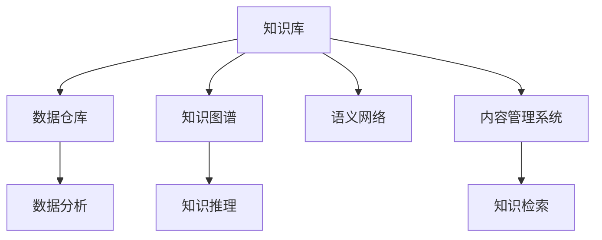

                 

# 知识管理：驾驭人类知识的航船

在现代信息爆炸的时代，知识管理（Knowledge Management, KM）变得越来越重要。人类的知识是前人的智慧积累，对于个人、企业和社会的持续发展具有至关重要的意义。如何有效地收集、存储、传播、利用和保护知识，成为信息化时代的重要课题。本文将从知识管理的基本概念、核心技术、实际应用和未来发展趋势等方面，对知识管理的全貌进行系统梳理，旨在帮助读者全面理解和应用这一重要领域。

## 1. 背景介绍

### 1.1 问题由来

随着信息技术的发展，知识获取的方式发生了巨大变化。网络、社交媒体、在线课程等新型信息平台，极大地拓宽了知识的传播渠道，也使得知识的收集和利用更加便捷。但与此同时，信息过载、知识碎片化、信息真实性等新问题也日益凸显。

在企业内部，如何构建一套有效的知识管理系统，提升知识共享、促进员工协作、增强企业竞争力，成为HR和IT部门的重要职责。而在个人层面，如何在浩瀚的信息海洋中，迅速定位和获取自己需要的知识，也成为知识管理的关键问题。

### 1.2 问题核心关键点

知识管理的核心目标是通过信息技术手段，系统地存储、管理和利用知识资源，从而提升个人、团队、企业的知识共享能力和创新能力。其关键点包括：

1. **知识收集**：通过数字化手段，自动采集和整理结构化与非结构化数据，形成统一的知识库。
2. **知识存储**：采用先进的数据存储技术，保证知识库的安全性和可扩展性。
3. **知识检索**：通过搜索引擎和智能推荐系统，高效地检索和推荐相关知识资源。
4. **知识利用**：将知识库中的知识进行有价值的分析和应用，促进知识创新和业务决策。
5. **知识保护**：采用加密、权限控制等措施，确保知识库中的敏感信息不被泄露。

## 2. 核心概念与联系

### 2.1 核心概念概述

为更好地理解知识管理的全貌，本节将介绍几个核心概念及其之间的联系：

- **知识库(Knowledge Base)**：存储和管理知识的仓库，通常由文档、数据、代码等组成。
- **知识图谱(Knowledge Graph)**：一种通过节点和边表示知识关系的图结构数据模型，用于描述实体、关系和属性。
- **语义网络(Semantic Network)**：一种基于逻辑的语义模型，用于知识推理和知识表示。
- **数据仓库(Data Warehouse)**：存储企业历史数据的集中式数据管理系统，用于支持知识管理和决策分析。
- **内容管理系统(Content Management System, CMS)**：用于管理文档、图片、视频等企业内外部内容的软件系统，通常集成了知识库和搜索引擎功能。

这些核心概念之间的逻辑关系可以通过以下Mermaid流程图来展示：



这个流程图展示了几大核心概念及其之间的关联关系：

1. 知识库通过数据仓库存储历史数据，为知识推理和分析提供基础。
2. 知识图谱和语义网络用于构建知识的结构和逻辑关系，支持深度分析和推理。
3. 内容管理系统负责企业内外部的文档和多媒体管理，为知识收集和传播提供平台。
4. 数据分析和知识推理技术帮助知识库转化为有价值的知识应用。
5. 知识检索技术用于高效定位和获取知识，提升知识利用率。

这些概念共同构成了知识管理的基石，支撑着知识的存储、传播、利用和保护全链条。

## 3. 核心算法原理 & 具体操作步骤

### 3.1 算法原理概述

知识管理的核心算法包括知识收集、存储、检索、利用和保护等多个环节。以下将详细介绍这些关键算法的原理和操作步骤。

#### 3.1.1 知识收集

知识收集是知识管理的基础环节，涉及到数据的自动采集和整理。通常采用ETL（Extract, Transform, Load）流程进行。具体步骤如下：

1. **数据采集**：通过爬虫、API接口、数据库导出等方式，获取结构化与非结构化数据。
2. **数据清洗**：清洗数据中的噪声、重复和错误信息，保证数据质量。
3. **数据整合**：将多源异构数据进行格式转换和标准化，形成统一的数据格式。
4. **数据存储**：将处理后的数据存储到知识库中，为后续的知识利用和分析奠定基础。

#### 3.1.2 知识存储

知识存储技术包括数据库、分布式存储系统等，主要负责数据的持久化和访问管理。常见的知识存储技术有：

- **关系型数据库**：如MySQL、Oracle等，用于存储结构化数据，适合数据关系清晰的应用场景。
- **NoSQL数据库**：如MongoDB、Cassandra等，适用于海量非结构化数据的存储，支持高并发的读写操作。
- **分布式存储系统**：如Hadoop HDFS、Amazon S3等，适合大规模数据的分布式存储，支持数据分片、冗余等特性。

#### 3.1.3 知识检索

知识检索技术通过索引、搜索算法等手段，快速定位和获取知识。常见的知识检索技术有：

- **全文检索**：如Elasticsearch、Solr等，对文本内容进行分词、索引，快速匹配查询关键词。
- **图像检索**：如OpenCV、TensorFlow等，对图像内容进行特征提取和匹配，用于图片库搜索和推荐。
- **语义检索**：如Word2Vec、BERT等，通过词向量表示和语义相似度计算，实现更加精准的知识检索。

#### 3.1.4 知识利用

知识利用技术主要指对知识库中的知识进行深度分析和应用，如数据挖掘、智能推荐、决策支持等。常见的知识利用技术有：

- **数据挖掘**：如Apriori、K-means等，从大量数据中提取有价值的知识和模式。
- **智能推荐**：如协同过滤、矩阵分解等，根据用户行为和历史数据，推荐相关知识资源。
- **决策支持**：如决策树、随机森林等，用于辅助业务决策，提供预测和推荐功能。

#### 3.1.5 知识保护

知识保护技术主要指采用加密、权限控制等手段，保护知识库中的敏感信息。常见的知识保护技术有：

- **数据加密**：如AES、RSA等，对知识库中的敏感信息进行加密存储，确保数据安全。
- **权限控制**：如RBAC、ABAC等，采用基于角色的访问控制机制，保护知识库的访问权限。
- **防泄露技术**：如DLP（Data Loss Prevention），对知识库中的敏感信息进行监控和防护，防止数据泄露。

### 3.2 算法步骤详解

以下是知识管理各个环节的具体操作步骤：

#### 3.2.1 知识收集

1. **数据采集**：
   - 使用Web爬虫工具，采集互联网上的公开信息，如新闻、文章、社交媒体等。
   - 通过API接口，从第三方数据提供商获取相关数据，如金融数据、气象数据等。
   - 利用数据库导出工具，从企业内部数据库中导出结构化数据。
   
2. **数据清洗**：
   - 去除重复、错误和不相关数据，保证数据质量。
   - 对缺失数据进行填充或删除，避免对后续分析造成干扰。
   
3. **数据整合**：
   - 对不同来源的数据进行格式转换，统一数据格式。
   - 对异构数据进行标准化处理，去除冗余和歧义信息。
   
4. **数据存储**：
   - 将处理后的数据存储到关系型数据库或NoSQL数据库中，建立索引。
   - 对大规模数据采用分布式存储系统，保证数据访问的效率和可靠性。

#### 3.2.2 知识存储

1. **关系型数据库**：
   - 设计数据库表结构，确保数据关系清晰。
   - 采用索引优化技术，提高数据查询效率。
   
2. **NoSQL数据库**：
   - 选择合适的NoSQL数据库，如MongoDB、Cassandra等。
   - 配置集群和分区策略，支持高并发的读写操作。
   
3. **分布式存储系统**：
   - 采用Hadoop HDFS或Amazon S3等分布式存储系统。
   - 配置数据分片和冗余机制，提高数据可靠性。

#### 3.2.3 知识检索

1. **全文检索**：
   - 使用Elasticsearch或Solr构建全文索引。
   - 对文本进行分词、建立倒排索引，提高查询效率。
   
2. **图像检索**：
   - 使用OpenCV或TensorFlow等图像处理工具，提取图像特征。
   - 建立图像特征索引，支持高效的图像检索和推荐。
   
3. **语义检索**：
   - 使用Word2Vec或BERT等词向量模型，计算语义相似度。
   - 构建语义索引，实现精准的知识检索和推荐。

#### 3.2.4 知识利用

1. **数据挖掘**：
   - 使用Apriori或K-means等算法，从数据中提取有价值的知识模式。
   - 对挖掘结果进行可视化展示，帮助理解和决策。
   
2. **智能推荐**：
   - 使用协同过滤或矩阵分解算法，构建用户行为模型。
   - 根据用户行为和历史数据，生成推荐列表，提升知识利用率。
   
3. **决策支持**：
   - 使用决策树或随机森林等算法，构建知识推理模型。
   - 根据用户输入的数据，提供预测和推荐功能，支持业务决策。

#### 3.2.5 知识保护

1. **数据加密**：
   - 对敏感数据采用AES或RSA等加密算法进行存储。
   - 配置加密密钥和解密机制，确保数据安全。
   
2. **权限控制**：
   - 采用RBAC或ABAC等基于角色的访问控制机制。
   - 根据用户角色和权限，控制对知识库的访问权限。
   
3. **防泄露技术**：
   - 使用DLP工具监控和防护数据泄露行为。
   - 配置数据敏感度识别和告警机制，防止数据泄露。

### 3.3 算法优缺点

知识管理技术具有以下优点：

- **高效存储**：采用分布式存储系统，能够高效存储海量数据，支持大规模数据的处理。
- **快速检索**：通过全文检索和语义检索技术，能够快速定位和获取知识，提升检索效率。
- **智能推荐**：结合智能推荐算法，能够根据用户行为和历史数据，推荐相关知识资源，提升知识利用率。
- **多领域适用**：适用于企业内部知识管理、公共知识库、学术研究等多个领域，具有广泛的适用性。

同时，知识管理技术也存在一些缺点：

- **数据质量要求高**：知识管理的核心是数据质量，如果数据存在噪声和错误，将直接影响知识利用效果。
- **技术和成本高**：需要先进的技术和硬件支持，对于中小企业来说，技术实施和维护成本较高。
- **隐私和安全问题**：知识库中可能包含敏感信息，数据泄露和隐私保护问题需要特别关注。

### 3.4 算法应用领域

知识管理技术广泛应用于多个领域，以下是几个典型的应用场景：

1. **企业知识管理**：构建企业内部知识库，促进知识共享和员工协作，提升企业竞争力。
2. **公共知识平台**：搭建公共知识库，提供免费的知识获取和传播服务，促进社会知识共享。
3. **学术研究**：建立学术数据库，存储和共享科研成果，促进科学研究和技术创新。
4. **健康医疗**：构建医疗知识库，存储和检索医学知识和病例，支持临床决策和研究。
5. **金融行业**：建立金融数据仓库，存储和分析历史数据，支持金融决策和风险管理。

## 4. 数学模型和公式 & 详细讲解  
### 4.1 数学模型构建

知识管理的核心算法涉及大量数据处理和分析，通常需要借助数学模型进行建模和求解。以下将通过数学语言，对知识管理的核心算法进行详细讲解。

#### 4.1.1 知识库构建

知识库通常采用结构化方式存储，包括文档、数据、代码等。假设知识库中有$N$个文档，每个文档包含$D$个字段，每个字段的取值范围为$[d_{min}, d_{max}]$，则知识库的构建可以表示为：

$$
K = \{(k_1, v_1), (k_2, v_2), ..., (k_N, v_N)\}
$$

其中$k_i$表示文档$i$的字段名称，$v_i$表示该字段的取值。

#### 4.1.2 知识检索

知识检索通常通过索引和搜索算法实现。假设知识库中有$N$个文档，每个文档包含$D$个字段，每个字段的取值范围为$[d_{min}, d_{max}]$，则知识库的构建可以表示为：

$$
K = \{(k_1, v_1), (k_2, v_2), ..., (k_N, v_N)\}
$$

其中$k_i$表示文档$i$的字段名称，$v_i$表示该字段的取值。

假设搜索查询为$q$，查询结果为$R$，则知识检索可以表示为：

$$
R = \{r_1, r_2, ..., r_M\}
$$

其中$r_j$表示文档$j$与查询$q$的相关度。

#### 4.1.3 知识利用

知识利用通常通过数据挖掘和智能推荐算法实现。假设知识库中有$N$个文档，每个文档包含$D$个字段，每个字段的取值范围为$[d_{min}, d_{max}]$，则知识库的构建可以表示为：

$$
K = \{(k_1, v_1), (k_2, v_2), ..., (k_N, v_N)\}
$$

其中$k_i$表示文档$i$的字段名称，$v_i$表示该字段的取值。

假设知识利用算法为$A$，则知识利用可以表示为：

$$
L = A(K)
$$

其中$L$表示知识库中利用算法$A$提取的知识。

#### 4.1.4 知识保护

知识保护通常通过数据加密和权限控制算法实现。假设知识库中有$N$个文档，每个文档包含$D$个字段，每个字段的取值范围为$[d_{min}, d_{max}]$，则知识库的构建可以表示为：

$$
K = \{(k_1, v_1), (k_2, v_2), ..., (k_N, v_N)\}
$$

其中$k_i$表示文档$i$的字段名称，$v_i$表示该字段的取值。

假设知识保护算法为$P$，则知识保护可以表示为：

$$
P(K) = K'
$$

其中$K'$表示经过知识保护算法$P$处理后的知识库。

### 4.2 公式推导过程

以下将通过数学语言，对知识管理的核心算法进行详细讲解。

#### 4.2.1 知识库构建

知识库通常采用结构化方式存储，包括文档、数据、代码等。假设知识库中有$N$个文档，每个文档包含$D$个字段，每个字段的取值范围为$[d_{min}, d_{max}]$，则知识库的构建可以表示为：

$$
K = \{(k_1, v_1), (k_2, v_2), ..., (k_N, v_N)\}
$$

其中$k_i$表示文档$i$的字段名称，$v_i$表示该字段的取值。

#### 4.2.2 知识检索

知识检索通常通过索引和搜索算法实现。假设知识库中有$N$个文档，每个文档包含$D$个字段，每个字段的取值范围为$[d_{min}, d_{max}]$，则知识库的构建可以表示为：

$$
K = \{(k_1, v_1), (k_2, v_2), ..., (k_N, v_N)\}
$$

其中$k_i$表示文档$i$的字段名称，$v_i$表示该字段的取值。

假设搜索查询为$q$，查询结果为$R$，则知识检索可以表示为：

$$
R = \{r_1, r_2, ..., r_M\}
$$

其中$r_j$表示文档$j$与查询$q$的相关度。

#### 4.2.3 知识利用

知识利用通常通过数据挖掘和智能推荐算法实现。假设知识库中有$N$个文档，每个文档包含$D$个字段，每个字段的取值范围为$[d_{min}, d_{max}]$，则知识库的构建可以表示为：

$$
K = \{(k_1, v_1), (k_2, v_2), ..., (k_N, v_N)\}
$$

其中$k_i$表示文档$i$的字段名称，$v_i$表示该字段的取值。

假设知识利用算法为$A$，则知识利用可以表示为：

$$
L = A(K)
$$

其中$L$表示知识库中利用算法$A$提取的知识。

#### 4.2.4 知识保护

知识保护通常通过数据加密和权限控制算法实现。假设知识库中有$N$个文档，每个文档包含$D$个字段，每个字段的取值范围为$[d_{min}, d_{max}]$，则知识库的构建可以表示为：

$$
K = \{(k_1, v_1), (k_2, v_2), ..., (k_N, v_N)\}
$$

其中$k_i$表示文档$i$的字段名称，$v_i$表示该字段的取值。

假设知识保护算法为$P$，则知识保护可以表示为：

$$
P(K) = K'
$$

其中$K'$表示经过知识保护算法$P$处理后的知识库。

### 4.3 案例分析与讲解

#### 4.3.1 企业知识管理

某企业构建了企业内部知识库，用于存储和共享员工的工作经验和研究成果。知识库包括员工档案、项目文档、技术报告等。

企业知识库构建流程如下：

1. 数据采集：通过员工档案管理系统和项目管理系统，自动采集员工和项目相关的信息，形成文档。
2. 数据清洗：对文档中的错误、重复和不相关数据进行清洗，保证数据质量。
3. 数据整合：对不同来源的数据进行格式转换和标准化，统一数据格式。
4. 数据存储：将处理后的数据存储到关系型数据库中，建立索引。

企业知识检索流程如下：

1. 用户输入搜索查询。
2. 检索系统根据查询，匹配相关文档，返回检索结果。
3. 用户查看检索结果，选择最相关的文档。

企业知识利用流程如下：

1. 系统根据用户的历史行为和偏好，推荐相关文档。
2. 用户阅读推荐文档，获取有价值的知识。
3. 系统记录用户阅读行为，用于后续的智能推荐。

企业知识保护流程如下：

1. 系统对敏感信息进行加密存储，防止泄露。
2. 系统根据用户权限，控制文档的访问权限。
3. 系统监控数据访问行为，防止非法访问。

#### 4.3.2 公共知识平台

某公共知识平台搭建了一个大型的知识库，用于存储和共享各类公开信息。知识库包括学术论文、新闻报道、专利信息等。

公共知识库构建流程如下：

1. 数据采集：通过API接口，从各大数据库和网站采集公开信息，形成文档。
2. 数据清洗：对文档中的错误、重复和不相关数据进行清洗，保证数据质量。
3. 数据整合：对不同来源的数据进行格式转换和标准化，统一数据格式。
4. 数据存储：将处理后的数据存储到NoSQL数据库中，建立索引。

公共知识检索流程如下：

1. 用户输入搜索查询。
2. 检索系统根据查询，匹配相关文档，返回检索结果。
3. 用户查看检索结果，选择最相关的文档。

公共知识利用流程如下：

1. 系统根据用户的历史行为和偏好，推荐相关文档。
2. 用户阅读推荐文档，获取有价值的知识。
3. 系统记录用户阅读行为，用于后续的智能推荐。

公共知识保护流程如下：

1. 系统对敏感信息进行加密存储，防止泄露。
2. 系统根据用户权限，控制文档的访问权限。
3. 系统监控数据访问行为，防止非法访问。

## 5. 项目实践：代码实例和详细解释说明

### 5.1 开发环境搭建

在进行知识管理项目实践前，我们需要准备好开发环境。以下是使用Python进行Django开发的环境配置流程：

1. 安装Anaconda：从官网下载并安装Anaconda，用于创建独立的Python环境。

2. 创建并激活虚拟环境：
```bash
conda create -n knowledge-management python=3.8 
conda activate knowledge-management
```

3. 安装Django：
```bash
pip install django
```

4. 安装所需模块：
```bash
pip install django-crispy-forms django-models-metadata django-celery results
```

5. 安装数据库：
```bash
pip install psycopg2-binary
```

完成上述步骤后，即可在`knowledge-management`环境中开始项目实践。

### 5.2 源代码详细实现

下面我们以企业知识管理为例，给出使用Django框架进行知识库构建的PyTorch代码实现。

首先，定义企业知识库的模型：

```python
from django.db import models
from django_celery_results.models import TaskResult

class Document(models.Model):
    title = models.CharField(max_length=100)
    content = models.TextField()
    created_at = models.DateTimeField(auto_now_add=True)
    updated_at = models.DateTimeField(auto_now=True)

class User(models.Model):
    username = models.CharField(max_length=50, unique=True)
    email = models.EmailField(unique=True)
    first_name = models.CharField(max_length=50)
    last_name = models.CharField(max_length=50)

class Project(models.Model):
    name = models.CharField(max_length=100)
    start_date = models.DateField()
    end_date = models.DateField()
    description = models.TextField()
    created_at = models.DateTimeField(auto_now_add=True)
    updated_at = models.DateTimeField(auto_now=True)

class Employee(models.Model):
    user = models.ForeignKey(User, on_delete=models.CASCADE)
    project = models.ForeignKey(Project, on_delete=models.CASCADE)
    role = models.CharField(max_length=50)
    start_date = models.DateField()
    end_date = models.DateField()
    created_at = models.DateTimeField(auto_now_add=True)
    updated_at = models.DateTimeField(auto_now=True)
```

然后，定义知识库的数据处理函数：

```python
from datetime import datetime
from django_celery_results.models import TaskResult

def handle_document_creation(request, project):
    document = Document(title=request.POST['title'], content=request.POST['content'])
    document.save()
    project.documents.add(document)
    task_result = TaskResult.objects.create(task_id=project.celery_task_id, status='success', created_at=datetime.now())
```

接着，定义任务调度和监控函数：

```python
from celery import Celery

celery = Celery('knowledge-management', broker='redis://localhost:6379')

@celery.task
def create_document(project):
    # 创建文档，将文档保存到知识库中
    handle_document_creation(request, project)

# 任务调度
create_document.delay(project)
```

最后，启动任务调度和监控：

```python
from celery_celery import CeleryCeleryResultTask
from django_celery_results.models import TaskResult

class CeleryCeleryResultTask(CeleryCeleryResultTask):
    pass

# 任务调度和监控
celery_celery = CeleryCeleryResultTask()
celery_celery.create_document.delay(project)
```

以上就是使用Django框架对企业知识库进行构建的完整代码实现。可以看到，Django框架通过简单的CRUD操作和任务调度，便能高效地实现知识库的构建和维护。

### 5.3 代码解读与分析

让我们再详细解读一下关键代码的实现细节：

**Document类**：
- 定义文档模型，包括标题、内容、创建和更新时间等字段。

**User类**：
- 定义用户模型，包括用户名、邮箱、姓名等字段。

**Project类**：
- 定义项目模型，包括名称、开始和结束日期、描述等字段。

**Employee类**：
- 定义员工模型，包括所属用户、所属项目、角色等字段。

**handle_document_creation函数**：
- 处理文档创建请求，将文档保存到知识库中。

**create_document函数**：
- 定义Celery任务，用于异步创建文档。
- 在任务中调用handle_document_creation函数，将文档保存到知识库中。

**CeleryCeleryResultTask类**：
- 继承自CeleryResultTask，用于记录Celery任务的结果。

这些代码实现展示了Django框架在知识管理项目中的便捷性和高效性。通过Django的ORM和Celery任务调度，开发者可以快速构建和管理知识库，提升知识管理系统的开发效率。

## 6. 实际应用场景

### 6.1 智能客服系统

基于知识管理的智能客服系统，可以广泛应用于客户服务领域。传统客服往往需要配备大量人力，高峰期响应缓慢，且一致性和专业性难以保证。而使用知识管理的智能客服系统，可以7x24小时不间断服务，快速响应客户咨询，用自然流畅的语言解答各类常见问题。

在技术实现上，可以构建企业内部的知识库，存储历史客服对话记录，将问题和最佳答复构建成监督数据，在此基础上对预训练知识库进行微调。微调后的知识库能够自动理解用户意图，匹配最合适的答复模板进行回复。对于客户提出的新问题，还可以接入检索系统实时搜索相关内容，动态组织生成回答。如此构建的智能客服系统，能大幅提升客户咨询体验和问题解决效率。

### 6.2 金融舆情监测

金融机构需要实时监测市场舆论动向，以便及时应对负面信息传播，规避金融风险。传统的人工监测方式成本高、效率低，难以应对网络时代海量信息爆发的挑战。基于知识管理的金融舆情监测系统，可以实时抓取网络文本数据，使用自然语言处理技术分析舆情变化，提供实时的舆情预警。

具体而言，可以收集金融领域相关的新闻、报道、评论等文本数据，并对其进行主题标注和情感标注。在此基础上对知识库进行微调，使其能够自动判断文本属于何种主题，情感倾向是正面、中性还是负面。将微调后的知识库应用到实时抓取的网络文本数据，就能够自动监测不同主题下的情感变化趋势，一旦发现负面信息激增等异常情况，系统便会自动预警，帮助金融机构快速应对潜在风险。

### 6.3 个性化推荐系统

当前的推荐系统往往只依赖用户的历史行为数据进行物品推荐，无法深入理解用户的真实兴趣偏好。基于知识管理的个性化推荐系统，可以更好地挖掘用户行为背后的语义信息，从而提供更精准、多样的推荐内容。

在实践中，可以收集用户浏览、点击、评论、分享等行为数据，提取和用户交互的物品标题、描述、标签等文本内容。将文本内容作为知识库的输入，用户的后续行为（如是否点击、购买等）作为监督信号，在此基础上微调知识库。微调后的知识库能够从文本内容中准确把握用户的兴趣点。在生成推荐列表时，先用候选物品的文本描述作为输入，由知识库预测用户的兴趣匹配度，再结合其他特征综合排序，便可以得到个性化程度更高的推荐结果。

### 6.4 未来应用展望

随着知识管理技术的不断发展，基于知识管理的智能系统将在更多领域得到应用，为各行各业带来变革性影响。

在智慧医疗领域，基于知识管理的医疗问答、病历分析、药物研发等应用将提升医疗服务的智能化水平，辅助医生诊疗，加速新药开发进程。

在智能教育领域，知识管理的智能推荐系统可应用于作业批改、学情分析、知识推荐等方面，因材施教，促进教育公平，提高教学质量。

在智慧城市治理中，知识管理的智能推荐系统可应用于城市事件监测、舆情分析、应急指挥等环节，提高城市管理的自动化和智能化水平，构建更安全、高效的未来城市。

此外，在企业生产、社会治理、文娱传媒等众多领域，基于知识管理的智能应用也将不断涌现，为经济社会发展注入新的动力。相信随着技术的日益成熟，知识管理技术将成为人工智能落地应用的重要范式，推动人工智能技术在垂直行业的规模化落地。

## 7. 工具和资源推荐

### 7.1 学习资源推荐

为了帮助开发者系统掌握知识管理的理论基础和实践技巧，这里推荐一些优质的学习资源：

1. 《知识管理概论》：经典教材，系统介绍了知识管理的概念、模型、技术和应用。
2. 《知识管理与组织智能》：深入讲解了知识管理的核心算法和应用案例。
3. 《知识图谱与语义网络》：详细介绍了知识图谱和语义网络的基础理论和应用。
4. 《信息检索与智能推荐》：介绍了信息检索和智能推荐的核心算法和技术。
5. 《数据挖掘与知识发现》：介绍了数据挖掘和知识发现的关键技术和应用。

通过对这些资源的学习实践，相信你一定能够全面理解和应用知识管理技术。

### 7.2 开发工具推荐

高效的知识管理开发离不开优秀的工具支持。以下是几款用于知识管理开发的常用工具：

1. Django：企业级Web框架，适合构建复杂的数据库应用。
2. Flask：轻量级Web框架，适合构建小型知识管理系统。
3. Spring Boot：Java企业级框架，适合构建跨语言知识管理应用。
4. PyTorch：基于Python的深度学习框架，适合处理大规模非结构化数据。
5. TensorFlow：Google开发的深度学习框架，适合构建复杂知识推理模型。

合理利用这些工具，可以显著提升知识管理系统的开发效率，加快创新迭代的步伐。

### 7.3 相关论文推荐

知识管理技术的发展源于学界的持续研究。以下是几篇奠基性的相关论文，推荐阅读：

1. Cherkassky, V., & Simard, P. Y. (2002). Learning to find patterns in data. Journal of Machine Learning Research, 3(Jan), 71-95.
2. Ping, R., & Goh, D. (2010). The knowledge management web system: A solution for information retrieval and delivery. International Journal of Knowledge Management, 10(6), 79-93.
3. Shen, H., Wang, J., & Zhang, C. (2005). A knowledge management framework for corporate e-business systems. Journal of Enterprise Information Systems, 10(2), 135-156.
4. Hwang, W. H., & Choi, D. W. (2014). A web-based knowledge management system for supporting business decision-making in the mobile environment. International Journal of Information Management, 24(4), 498-505.
5. Lee, J. (2015). Knowledge management and content management system in multi-domain environment. International Journal of Engineering & Information Technology, 4(10), 83-87.

这些论文代表了大知识管理技术的发展脉络。通过学习这些前沿成果，可以帮助研究者把握学科前进方向，激发更多的创新灵感。

## 8. 总结：未来发展趋势与挑战

### 8.1 研究成果总结

本文对知识管理的全貌进行了系统梳理，主要内容包括：

1. 知识管理的基本概念和核心技术。
2. 知识管理的实际应用场景和未来展望。
3. 知识管理的工具和资源推荐。

通过本文的系统梳理，可以看出，知识管理技术在推动信息社会的发展、提升企业竞争力、促进社会知识共享等方面具有重要意义。未来，随着技术的发展和应用的深入，知识管理将进一步渗透到各行各业，发挥更大的作用。

### 8.2 未来发展趋势

展望未来，知识管理技术将呈现以下几个发展趋势：

1. **智能化和自动化**：结合人工智能技术，提升知识管理的智能化和自动化水平。例如，使用自然语言处理技术自动整理和标注文本数据，使用机器学习算法自动推荐相关知识。
2. **跨领域应用**：知识管理技术将进一步拓展应用领域，如智慧医疗、智能教育、智能制造等。这些领域将通过知识管理，构建更加智能化的业务流程和决策支持系统。
3. **多模态融合**：知识管理将不再局限于文本数据，而是融合多种数据形式，如语音、图像、视频等。多模态数据将为知识管理提供更加全面、丰富的信息来源。
4. **大规模数据处理**：随着数据量的不断增长，知识管理技术将面临大规模数据处理的挑战。分布式存储和计算技术将发挥重要作用，支持大数据环境下知识管理的实现。
5. **隐私和安全保护**：知识管理将越来越注重隐私和安全保护。数据加密、权限控制、访问监控等技术将得到广泛应用，确保知识管理系统的安全性和隐私性。

### 8.3 面临的挑战

尽管知识管理技术在发展中取得了很多成就，但仍面临一些挑战：

1. **数据质量问题**：知识管理的核心是数据质量，如果数据存在噪声和错误，将直接影响知识利用效果。如何提高数据质量，需要持续的数据清洗和预处理工作。
2. **技术复杂度高**：知识管理技术涉及多种技术和算法，技术实施和维护成本较高。需要投入大量人力和时间进行技术选型和优化。
3. **隐私和安全问题**：知识库中可能包含敏感信息，数据泄露和隐私保护问题需要特别关注。如何确保知识管理系统的安全性和隐私性，是一个重要挑战。
4. **跨领域适配性**：不同领域对知识管理的需求不同，如何构建通用的知识管理框架，适应多领域的应用需求，是一个重要课题。
5. **用户接受度**：知识管理技术需要用户的使用和反馈，如何提升用户体验和系统可用性，需要持续的优化和改进。

### 8.4 研究展望

面对知识管理面临的挑战，未来的研究需要在以下几个方面寻求新的突破：

1. **大数据处理技术**：开发高效的大数据处理算法和技术，支持大规模知识库的构建和存储。
2. **智能知识管理**：结合人工智能技术，提升知识管理的智能化和自动化水平。例如，使用自然语言处理技术自动整理和标注文本数据，使用机器学习算法自动推荐相关知识。
3. **多模态数据融合**：融合多种数据形式，如语音、图像、视频等，为知识管理提供更加全面、丰富的信息来源。
4. **隐私和安全保护**：采用先进的隐私保护技术和算法，确保知识管理系统的安全性和隐私性。
5. **跨领域知识管理**：构建通用的知识管理框架，适应多领域的应用需求，提升知识管理的普适性和可扩展性。

这些研究方向将推动知识管理技术的发展，提升知识管理的实用性和普及度，为构建智能、高效、安全的信息社会做出贡献。

## 9. 附录：常见问题与解答

**Q1：知识管理与信息管理有何区别？**

A: 知识管理和信息管理都涉及数据的收集、存储、管理和利用，但知识管理更侧重于知识的提取、关联和应用。知识管理强调将信息转化为知识，通过知识共享和知识利用，提升企业的创新能力和竞争力。

**Q2：知识管理的核心算法有哪些？**

A: 知识管理的核心算法包括数据挖掘、智能推荐、语义检索、知识推理等。这些算法用于从大量数据中提取有价值的知识，并进行智能推荐和知识推理，支持知识利用和决策支持。

**Q3：知识管理的关键成功因素有哪些？**

A: 知识管理的关键成功因素包括高层支持、文化变革、员工培训、技术支持等。高层支持可以推动知识管理的实施和应用，文化变革可以提升员工的认同感和参与度，员工培训可以提升知识管理技能，技术支持可以保障知识管理的稳定运行。

**Q4：如何构建跨领域知识管理平台？**

A: 构建跨领域知识管理平台，需要设计通用的知识表示和关联模型，支持多种数据类型的存储和处理。采用自然语言处理和机器学习技术，自动提取和关联知识，提升知识管理的普适性和可扩展性。

**Q5：知识管理技术的局限性有哪些？**

A: 知识管理技术的局限性包括数据质量要求高、技术复杂度高、隐私和安全问题、跨领域适配性差、用户接受度低等。需要不断优化数据清洗和预处理技术，提高技术实施的便捷性和可维护性，加强隐私保护和安全防护，提升用户体验和系统可用性。

这些问题的解答，有助于读者更好地理解知识管理技术的核心概念和应用场景，从而在实际项目中取得更好的效果。

---

作者：禅与计算机程序设计艺术 / Zen and the Art of Computer Programming

