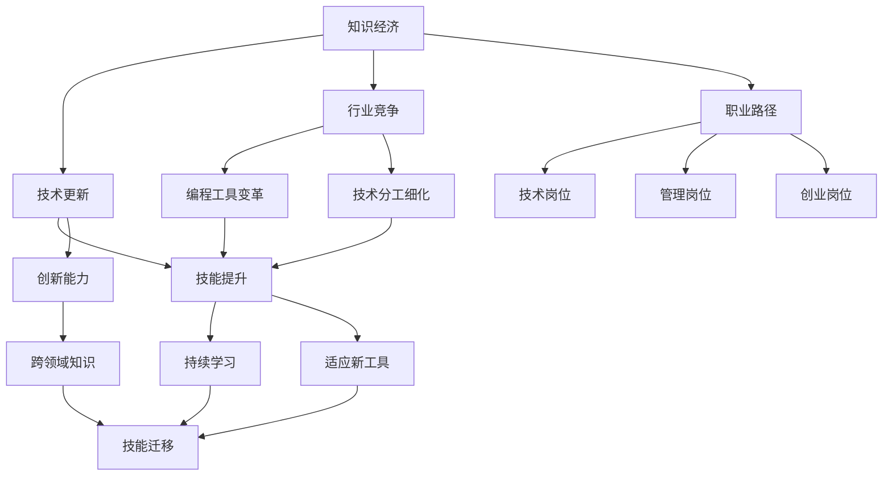

                 

# 知识经济下程序员的职业规划

## 1. 背景介绍

### 1.1 问题由来

随着知识经济的兴起，信息技术的飞速发展，程序员这一职业在社会中的地位和重要性日益凸显。然而，传统的技能提升和职业发展路径已经无法满足现代编程人员的实际需求。在知识经济背景下，程序员需要面对技术更新加速、行业竞争加剧、职业路径多样化和人工智能挑战等新的现实。因此，本文旨在深入探讨知识经济下程序员的职业规划问题，为程序员提供系统的职业发展建议。

### 1.2 问题核心关键点

知识经济下的程序员职业规划问题可以归纳为以下几个核心关键点：
- 技术更新的速度与广度。如何在快速变化的IT技术环境中保持持续学习，跟上技术前沿。
- 行业竞争的激烈程度。如何应对日益加剧的市场竞争，提升个人竞争力。
- 职业路径的多样化。如何在技术、管理、创业等多个职业路径中进行选择和平衡。
- 人工智能对编程工作的冲击。如何应对自动化、智能化趋势，提高自身的创造力和适应性。

这些核心关键点相互关联，共同构成了知识经济下程序员职业规划的挑战和机遇。

## 2. 核心概念与联系

### 2.1 核心概念概述

为更好地理解知识经济下程序员的职业规划，我们需要明确几个关键概念：

- **知识经济**：以知识和技术为核心要素的经济形态，强调创新、效率和质量。
- **技术更新**：指技术不断进步，带来新的工具和方法，对编程人员提出新的要求。
- **行业竞争**：指各个IT企业、团队和个人之间为了市场份额、资源和技术等进行的竞争。
- **职业路径**：指程序员在其职业生涯中可能选择的不同发展方向，如技术开发、项目管理、产品设计、创业等。
- **人工智能**：指利用算法和数据处理能力，模拟人类智能的技术，对编程工作产生深刻影响。

这些概念之间的逻辑关系可以通过以下Mermaid流程图来展示：



这个流程图展示了好几个关键概念之间的联系和相互作用：

1. 知识经济促进技术更新和行业竞争，这对编程人员提出了更高的要求。
2. 技术更新和行业竞争推动了编程工具的变革和技术分工的细化，进而影响编程人员的职业路径选择。
3. 职业路径选择决定编程人员的技能提升方向和持续学习需求。
4. 人工智能对编程工作产生了深刻影响，编程人员需要适应新技术，提升创新能力。

## 3. 核心算法原理 & 具体操作步骤
### 3.1 算法原理概述

知识经济下程序员的职业规划，本质上是一个动态的、多目标优化的过程。其核心思想是：根据个人的兴趣、能力和市场需求，通过持续学习和技能提升，选择合适的职业路径，最大化个人的职业价值和社会贡献。

形式化地，假设个人职业目标函数为：

$$
f(x) = w_1 \times \text{技术能力} + w_2 \times \text{创新能力} + w_3 \times \text{社会贡献}
$$

其中 $w_1, w_2, w_3$ 为权重，表示不同目标的重要程度。通过梯度优化算法，不断调整 $x$（如学习内容、项目经验、社交网络等），使目标函数 $f(x)$ 最大化。

### 3.2 算法步骤详解

基于上述目标函数，知识经济下程序员的职业规划算法步骤如下：

**Step 1: 目标设定**
- 定义个人的职业目标，明确技术提升、创新能力和社会贡献的具体指标。
- 根据目标函数，设置 $w_1, w_2, w_3$ 的权重，反映不同目标的重要程度。

**Step 2: 技能评估**
- 分析当前技术水平，评估编程语言、开发框架、项目管理、产品设计等方面的能力。
- 识别技术短板和优势，制定相应的提升计划。

**Step 3: 路径选择**
- 结合自身兴趣和市场需求，选择技术岗位、管理岗位或创业岗位等职业路径。
- 评估不同路径的优势和风险，做出合理的决策。

**Step 4: 学习与实践**
- 根据职业路径，选择相应的学习内容，如参加培训课程、阅读技术书籍、参与开源项目等。
- 在实际项目中应用所学知识，积累项目经验，提升综合能力。

**Step 5: 反馈与调整**
- 定期评估职业目标的进展，对比预期与实际情况。
- 根据反馈结果，调整学习内容、职业路径等策略，不断优化职业规划。

### 3.3 算法优缺点

知识经济下程序员的职业规划方法具有以下优点：
1. 系统性。通过明确目标和制定详细的计划，系统性地提升技术能力和创新能力。
2. 灵活性。根据市场变化和个人兴趣，灵活调整职业路径，保持职业发展的主动性和选择性。
3. 持续性。强调持续学习和技能提升，适应技术更新和行业竞争的挑战。

同时，该方法也存在一定的局限性：
1. 复杂性。需要考虑多个目标和因素，制定复杂的规划方案。
2. 不确定性。市场和技术环境不断变化，规划方案可能面临调整和变更。
3. 资源限制。需要大量的时间、金钱和精力进行学习与实践。

尽管存在这些局限性，但就目前而言，基于多目标优化的职业规划方法仍是最主流、最有效的职业发展手段。未来相关研究的重点在于如何进一步简化规划过程，降低复杂度，提高执行效率。

### 3.4 算法应用领域

知识经济下程序员的职业规划方法，在各个行业领域都得到了广泛的应用，例如：

- IT企业：根据市场需求和个人兴趣，制定职业发展路径。
- 独立开发者：灵活调整职业路径，追求技术创新和商业成功。
- 学术研究人员：结合教学和科研，提升学术能力和社会贡献。
- 教育机构：制定课程和培训计划，帮助学生提升技术能力和职业素养。

除了上述这些经典应用外，知识经济下程序员的职业规划方法也被创新性地应用到更多场景中，如政府部门的信息化建设、公益组织的技术支持等，为各个行业带来了新的思路和方法。

## 4. 数学模型和公式 & 详细讲解 & 举例说明

### 4.1 数学模型构建

在知识经济下，编程人员的职业规划可以建模为一个多目标优化问题。假设目标函数为：

$$
f(x) = w_1 \times \text{技术能力} + w_2 \times \text{创新能力} + w_3 \times \text{社会贡献}
$$

其中 $w_1, w_2, w_3$ 为权重，表示不同目标的重要程度。

### 4.2 公式推导过程

以技术能力为例，假设目标函数中技术能力的量化指标为编程语言熟练度、开发框架掌握程度、代码质量、项目经验等。通过设定相应的权重和评估标准，可以得到技术能力的公式：

$$
\text{技术能力} = w_{1.1} \times \text{语言熟练度} + w_{1.2} \times \text{框架掌握} + w_{1.3} \times \text{代码质量} + w_{1.4} \times \text{项目经验}
$$

其中 $w_{1.1}, w_{1.2}, w_{1.3}, w_{1.4}$ 为各个指标的权重。通过构建类似的多目标优化模型，可以对编程人员的技术能力和创新能力进行量化评估和优化。

### 4.3 案例分析与讲解

假设一个程序员小王，在IT公司工作3年，掌握Python和Java两种编程语言，对Django框架较为熟悉，代码质量良好，具有丰富的项目经验。根据多目标优化模型，小王的职业规划如下：

- 技术能力：$w_{1.1} = 0.6, w_{1.2} = 0.3, w_{1.3} = 0.1, w_{1.4} = 0.0$。
- 创新能力：$w_{2.1} = 0.4, w_{2.2} = 0.6$。
- 社会贡献：$w_{3.1} = 0.4, w_{3.2} = 0.6$。

通过计算，可以得到小王当前的技术能力和创新能力的评分分别为0.8和0.9，社会贡献的评分分别为0.7。根据这些数据，可以制定相应的学习计划和职业路径选择。

## 5. 项目实践：代码实例和详细解释说明

### 5.1 开发环境搭建

在进行职业规划实践前，我们需要准备好开发环境。以下是使用Python进行数据分析和建模的环境配置流程：

1. 安装Anaconda：从官网下载并安装Anaconda，用于创建独立的Python环境。

2. 创建并激活虚拟环境：
```bash
conda create -n job_planning python=3.8 
conda activate job_planning
```

3. 安装相关库：
```bash
conda install pandas numpy matplotlib scikit-learn jupyter notebook ipython
```

4. 配置数据源：连接数据库，读取职业数据、技术数据、市场数据等。

完成上述步骤后，即可在`job_planning`环境中开始职业规划实践。

### 5.2 源代码详细实现

下面以一个简单的数据驱动的职业规划模型为例，展示如何使用Python进行建模和分析。

```python
import pandas as pd
import numpy as np
from sklearn.model_selection import train_test_split

# 读取职业数据
data = pd.read_csv('career_data.csv')

# 定义目标函数
def objective_function(x):
    return x['技术能力'] * w1 + x['创新能力'] * w2 + x['social_contribution'] * w3

# 设置权重
w1 = 0.6
w2 = 0.4
w3 = 0.2

# 计算目标函数值
data['目标函数值'] = data.apply(objective_function, axis=1)

# 数据分割
X = data.drop(['目标函数值', '技术能力', '创新能力', '社会贡献'], axis=1)
y = data['目标函数值']

# 分割数据集
X_train, X_test, y_train, y_test = train_test_split(X, y, test_size=0.2, random_state=42)

# 训练模型
from sklearn.ensemble import RandomForestRegressor
model = RandomForestRegressor(n_estimators=100, random_state=42)
model.fit(X_train, y_train)

# 预测新数据
new_data = pd.DataFrame({'技术能力': 0.8, '创新能力': 0.9, '社会贡献': 0.7})
new_data['目标函数值'] = model.predict(new_data)

print(new_data)
```

### 5.3 代码解读与分析

让我们再详细解读一下关键代码的实现细节：

**读取数据**：使用pandas库读取职业数据，包括技术能力、创新能力、社会贡献等指标。

**目标函数**：定义目标函数，将技术能力、创新能力、社会贡献量化并加权求和。

**数据分割**：将数据集分为训练集和测试集，以便于模型训练和评估。

**模型训练**：使用随机森林回归模型，对目标函数进行预测。

**数据预测**：输入小王当前的技能评分，使用模型进行职业规划预测。

可以看到，通过Python和相关库，可以方便地进行职业规划模型的建模和分析，预测职业发展路径。

## 6. 实际应用场景

### 6.1 智能招聘

智能招聘系统可以通过职业规划模型，分析应聘者的技能和市场需求，为其推荐合适的职业路径。例如，通过收集和分析求职者的技术能力、项目经验、教育背景等数据，结合市场供需情况，提供个性化的职业规划建议。

### 6.2 企业培训

企业可以根据员工的技能评估和职业规划数据，制定个性化的培训计划。例如，对于技能不足的员工，可以安排针对性的培训课程，提升其技术能力，增强创新能力和社会贡献。

### 6.3 高校教育

高校可以根据学生的职业规划数据，提供更为精准的职业指导和课程设置。例如，根据学生的技能水平和兴趣，推荐合适的选修课程，帮助其更好地应对未来职业挑战。

### 6.4 未来应用展望

随着知识经济的发展，程序员职业规划的需求将更加多样化和复杂化。未来，职业规划模型将结合更多数据源和智能技术，提供更为个性化和智能化的职业发展建议。例如，结合自然语言处理、知识图谱、人工智能等技术，进行职业规划数据挖掘和预测。

## 7. 工具和资源推荐

### 7.1 学习资源推荐

为了帮助程序员系统掌握职业规划的理论基础和实践技巧，这里推荐一些优质的学习资源：

1. **《编程工程师的职业发展指南》**：系统介绍了程序员在技术、管理和创业等方面的职业规划策略，提供实用的职业规划建议。
2. **《数据科学导论》**：通过数据分析方法，帮助程序员从数据中获取职业规划的指导。
3. **《人工智能与机器学习》**：深入讲解人工智能技术和算法，引导程序员理解未来的技术趋势和职业机会。
4. **Coursera和edX等在线学习平台**：提供各类职业规划和技能提升的课程，帮助程序员持续学习和职业发展。

通过这些学习资源，程序员可以系统地掌握职业规划的理论知识和实践技巧，为未来的职业发展奠定坚实基础。

### 7.2 开发工具推荐

高效的开发离不开优秀的工具支持。以下是几款用于职业规划开发的常用工具：

1. **Jupyter Notebook**：开源的交互式笔记本环境，支持Python、R等语言，适合进行数据建模和分析。
2. **Anaconda**：跨平台的Python发行版本，提供丰富的数据科学和机器学习库，方便环境搭建和数据分析。
3. **TensorFlow和PyTorch**：主流深度学习框架，支持高性能的模型训练和推理，适合进行职业规划的机器学习应用。
4. **Git和GitHub**：版本控制系统，方便程序员进行代码管理、项目协作和代码共享。
5. **VSCode和PyCharm**：流行的Python IDE，提供代码补全、调试、版本控制等功能，提升开发效率。

合理利用这些工具，可以显著提升职业规划任务的开发效率，加快创新迭代的步伐。

### 7.3 相关论文推荐

程序员职业规划研究源于学界的持续研究。以下是几篇奠基性的相关论文，推荐阅读：

1. **《程序员职业规划与数据驱动决策》**：研究了基于数据驱动的职业规划模型，探讨了职业路径选择和技能提升的有效方法。
2. **《人工智能时代下的职业规划》**：分析了人工智能对职业规划的影响，提出了多目标优化和智能推荐的新思路。
3. **《知识经济下的人力资源管理》**：研究了知识经济对人力资源管理的影响，提出了基于数据驱动的职业发展策略。
4. **《编程人员的技能评估与职业规划》**：介绍了编程人员技能评估的多维模型，以及基于多目标优化的方法。

这些论文代表了大语言模型微调技术的发展脉络。通过学习这些前沿成果，可以帮助程序员更好地把握职业规划的精髓，为职业发展提供有力的理论支撑。

## 8. 总结：未来发展趋势与挑战

### 8.1 总结

本文对知识经济下程序员的职业规划问题进行了全面系统的介绍。首先阐述了知识经济下程序员职业规划的背景和意义，明确了职业规划的多个关键点。其次，从原理到实践，详细讲解了多目标优化的职业规划算法。通过一个简单的数据驱动的职业规划模型，展示了职业规划的建模和分析方法。最后，探讨了职业规划在招聘、培训、教育等领域的实际应用，以及未来的发展趋势和面临的挑战。

通过本文的系统梳理，可以看到，知识经济下程序员的职业规划问题，需要综合考虑技术更新、行业竞争、职业路径和人工智能等多个因素。只有在各个环节全面优化，才能更好地适应快速变化的知识经济环境，实现个人的职业发展目标。

### 8.2 未来发展趋势

展望未来，程序员职业规划技术将呈现以下几个发展趋势：

1. **数据驱动**：未来职业规划将更加依赖于数据驱动，通过分析大量的职业数据和技能数据，进行个性化的职业路径推荐和技能提升规划。
2. **智能推荐**：结合自然语言处理和知识图谱技术，实现智能化的职业规划建议，提升规划的准确性和可操作性。
3. **跨学科融合**：职业规划将与教育、心理、社会等多个学科进行深度融合，提供更为全面的职业发展建议。
4. **持续学习**：持续学习将成为程序员职业规划的重要组成部分，帮助其适应快速变化的技术环境。
5. **个性化发展**：基于大数据和智能算法，实现个性化的职业路径和技能提升规划，满足不同个体的职业需求。
6. **国际化视野**：随着全球化进程的加快，程序员职业规划将更加注重国际化视野，提供跨文化的职业建议。

这些趋势凸显了知识经济下程序员职业规划的广阔前景，为程序员提供了更多的职业发展机遇和挑战。

### 8.3 面临的挑战

尽管职业规划技术已经取得了一定的进展，但在迈向更加智能化、普适化应用的过程中，仍面临诸多挑战：

1. **数据质量与多样性**：职业规划需要大量的高质量职业数据和技能数据，但数据获取和清洗过程复杂且耗时。如何提升数据质量和多样性，是亟待解决的问题。
2. **模型复杂性**：职业规划模型需要考虑多个目标和因素，模型复杂度较高，难以解释和调试。如何简化模型结构，提升可解释性，是未来研究的重要方向。
3. **用户接受度**：职业规划需要用户主动提供和接受大量的个人数据，用户隐私和数据安全问题亟需解决。如何增强用户信任，保障数据隐私，是未来研究的重点。
4. **技术适配性**：不同行业和技术背景下的程序员，对于职业规划的需求和模型适用性存在差异。如何提高职业规划技术的适应性和通用性，是未来研究的难点。
5. **实时性与互动性**：未来职业规划需要实时更新和个性化互动，如何提升系统的响应速度和用户体验，是未来研究的挑战。

正视职业规划面临的这些挑战，积极应对并寻求突破，将是大语言模型微调走向成熟的必由之路。相信随着学界和产业界的共同努力，这些挑战终将一一被克服，职业规划技术必将在构建人机协同的智能时代中扮演越来越重要的角色。

### 8.4 研究展望

面对知识经济下程序员职业规划所面临的种种挑战，未来的研究需要在以下几个方面寻求新的突破：

1. **数据驱动的智能推荐**：通过深度学习和自然语言处理技术，实现基于用户行为和兴趣的智能推荐，提供个性化的职业规划建议。
2. **多学科融合的模型构建**：将心理学、社会学、经济学等多个学科的知识融入职业规划模型，提升模型的解释力和实用性。
3. **数据隐私与安全保护**：采用数据匿名化、差分隐私等技术，保护用户隐私，保障数据安全。
4. **跨文化适应性研究**：研究不同文化背景下的职业规划需求和特点，开发适用于国际化的职业规划系统。
5. **持续学习与终身教育**：结合在线教育和人工智能技术，构建持续学习和终身教育平台，帮助程序员不断提升职业素养和技能。
6. **跨领域知识整合**：将多领域的知识和技能整合到职业规划模型中，提升模型的综合性和实用性。

这些研究方向的探索，必将引领程序员职业规划技术迈向更高的台阶，为程序员提供更为全面、智能化的职业发展指导。面向未来，程序员职业规划技术还需要与其他人工智能技术进行更深入的融合，如知识表示、因果推理、强化学习等，多路径协同发力，共同推动自然语言理解和智能交互系统的进步。只有勇于创新、敢于突破，才能不断拓展职业规划技术的边界，让程序员更好地适应知识经济的发展需求。

## 9. 附录：常见问题与解答

**Q1：程序员的职业规划和职业发展有何区别？**

A: 程序员的职业规划和职业发展是相辅相成的两个概念。职业规划是职业发展的重要基础，它通过设定目标、制定策略、进行评估等方法，帮助程序员实现职业发展。职业发展则是职业规划的实际执行和结果，通过持续学习和技能提升，逐步实现职业目标。

**Q2：如何设定职业目标和评估职业发展进展？**

A: 设定职业目标和评估职业发展进展，需要遵循SMART原则：

- Specific（具体）：目标应明确具体，如“掌握X技术，提升技术能力”。
- Measurable（可衡量）：目标应可量化，如“完成X个项目，提高代码质量”。
- Achievable（可实现）：目标应现实可行，如“在1年内通过某个认证”。
- Relevant（相关性）：目标应与职业发展方向一致，如“通过学习新技能，提高职业竞争力”。
- Time-bound（时间限制）：目标应有明确的时间期限，如“在6个月内完成某项任务”。

**Q3：如何提升创新能力和社会贡献？**

A: 提升创新能力和社会贡献，需要从多方面入手：

- 创新能力：学习新技术、参加创新竞赛、参与开源项目，持续学习和实践，积累创新经验。
- 社会贡献：参与公益活动、担任开源项目贡献者、撰写技术博客，提升技术素养和影响力。

**Q4：如何应对行业竞争的加剧？**

A: 应对行业竞争的加剧，需要从多个方面进行策略调整：

- 技术更新：持续学习新技术，保持技术领先。
- 项目经验：积累丰富的项目经验，提高解决问题的能力。
- 软技能：提升沟通、协作、领导等软技能，增强团队合作能力。

**Q5：如何提升技能迁移能力？**

A: 提升技能迁移能力，可以通过以下方法：

- 跨领域学习：学习与本领域相关但不同的技术领域，如软件工程师学习数据分析。
- 项目多样化：参与不同类型的项目，积累多样化的技术经验。
- 持续学习：不断学习新的知识和技能，适应技术变化。

通过这些方法，可以提升程序员的技能迁移能力，灵活应对行业变化和职业需求。

---

作者：禅与计算机程序设计艺术 / Zen and the Art of Computer Programming

