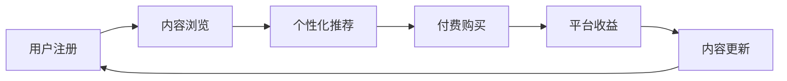

                 

# 知识经济时代下的知识付费创新商业模式优化

在知识经济时代，知识付费平台逐渐成为人们获取知识和信息的主要渠道之一。然而，随着市场竞争的加剧，知识付费平台的商业模式也面临着巨大的挑战。本文将深入探讨知识付费平台在知识经济时代下的创新商业模式优化问题，提出一系列的优化策略，以期在激烈的市场竞争中保持持续的竞争力和创新能力。

## 1. 背景介绍

### 1.1 问题由来

随着互联网的普及和信息技术的快速发展，人们获取知识和信息的方式发生了巨大变化。传统的线下教育、书籍阅读等形式逐渐被在线教育、网络文章、电子书等线上形式所取代。知识付费平台应运而生，提供专业、系统、个性化的知识服务，成为知识获取的重要平台。

然而，随着市场竞争的加剧，知识付费平台也面临着诸多挑战：

1. **内容同质化严重**：市场上大量同质化内容使得平台难以区分自己的竞争优势，用户流失风险增加。
2. **付费门槛高**：高昂的会员费用和复杂的付费机制，降低了用户的粘性。
3. **用户体验不足**：平台在内容推荐、学习路径规划等方面仍存在诸多不足，用户体验有待提升。

这些问题严重制约了知识付费平台的健康发展，优化商业模式成为当务之急。

### 1.2 问题核心关键点

知识付费平台商业模式的优化需要从以下几个方面入手：

- **内容差异化**：如何打造具有独特竞争力的内容体系。
- **用户留存策略**：如何通过精准的用户画像和个性化的推荐系统提升用户粘性。
- **付费模式创新**：如何设计更为灵活、吸引用户的付费模式。
- **数据驱动决策**：如何通过数据驱动的内容推荐和营销策略提升平台的竞争力。

这些关键点直接关系到知识付费平台的市场定位、盈利能力和用户体验，需要通过系统的优化策略来实现。

## 2. 核心概念与联系

### 2.1 核心概念概述

知识付费平台是指利用互联网技术，通过付费机制提供专业、系统、个性化的知识服务的平台。平台通过汇聚海量专业内容，利用算法和人工筛选，为用户提供高质量、高价值的知识服务。

知识付费平台的商业模式主要依赖于内容付费和广告收入，但如何通过差异化的内容和优质的用户体验实现用户留存和转化，是平台持续发展的关键。

### 2.2 核心概念原理和架构的 Mermaid 流程图



此流程图展示了知识付费平台的核心流程：用户通过浏览个性化推荐的内容，最终转化为付费用户，平台从中获得收益，并持续更新内容，吸引新用户。

## 3. 核心算法原理 & 具体操作步骤

### 3.1 算法原理概述

知识付费平台的核心算法主要包括推荐系统、个性化内容生成、内容优化等。通过这些算法，平台能够实现高质量的内容推荐、个性化学习路径规划和高效的内容更新。

推荐系统通过分析用户行为数据、内容特征等，为每位用户推荐最符合其兴趣和需求的内容。个性化内容生成则利用自然语言处理和机器学习技术，生成个性化的学习内容。内容优化则通过对用户反馈和行为数据的分析，不断优化内容质量和结构，提高用户满意度。

### 3.2 算法步骤详解

**Step 1: 数据收集与预处理**

数据收集与预处理是推荐系统的第一步，包括收集用户行为数据（如浏览历史、点赞、评论等）和内容特征数据（如文章主题、作者、发布时间等）。预处理过程包括数据清洗、特征提取、缺失值处理等步骤，确保数据的质量和一致性。

**Step 2: 用户画像构建**

用户画像是通过分析用户行为数据和内容互动数据，构建用户的兴趣偏好、学习习惯等画像。用户画像的构建依赖于机器学习和数据分析技术，常见的算法包括协同过滤、聚类分析等。

**Step 3: 内容推荐算法**

内容推荐算法通过分析用户画像和内容特征，为每位用户推荐最相关和受欢迎的内容。常见的推荐算法包括基于协同过滤、基于内容的推荐、基于深度学习的推荐等。

**Step 4: 个性化内容生成**

个性化内容生成是指利用自然语言处理和生成模型，为每位用户生成个性化的学习内容。常见的技术包括基于规则的生成、基于深度学习的生成等。

**Step 5: 内容优化与更新**

内容优化与更新是指通过对用户反馈和行为数据的分析，不断优化内容质量和结构，提高用户满意度。常见的方法包括A/B测试、用户调查等。

### 3.3 算法优缺点

**推荐算法的优点**：
1. **提高用户满意度**：通过精准推荐，提高用户粘性和满意度。
2. **降低内容成本**：个性化推荐减少用户浏览低相关内容，降低内容的曝光成本。
3. **提升转化率**：精准推荐提升付费转化率，增加平台收益。

**推荐算法的缺点**：
1. **数据依赖性强**：推荐系统依赖于高质量、丰富的用户数据和内容数据。
2. **算法复杂度高**：推荐算法涉及大量数据处理和计算，对技术要求较高。
3. **过度拟合风险**：推荐算法容易出现过度拟合问题，导致推荐结果偏差。

### 3.4 算法应用领域

推荐系统已经在电商、新闻、音乐等多个领域得到广泛应用，知识付费平台通过推荐算法可以实现以下应用：

- **内容推荐**：为用户推荐最相关和受欢迎的学习内容，提升用户体验。
- **学习路径规划**：根据用户的学习目标和兴趣，推荐学习路径，帮助用户高效学习。
- **内容更新**：通过分析用户反馈和行为数据，优化内容质量和结构，提升内容质量。
- **市场细分**：通过对用户行为数据的分析，进行市场细分，提供更为精准的营销策略。

## 4. 数学模型和公式 & 详细讲解 & 举例说明

### 4.1 数学模型构建

推荐系统的数学模型主要基于协同过滤和深度学习两类方法。协同过滤算法通过用户行为数据构建相似度矩阵，推荐与用户兴趣相似的内容。深度学习推荐模型则利用神经网络模型，从用户行为数据和内容数据中提取特征，生成推荐结果。

### 4.2 公式推导过程

协同过滤推荐算法基于用户行为数据构建相似度矩阵 $S$，计算公式如下：

$$
S_{i,j} = \frac{\text{相似度指数}}{\sqrt{\text{用户i的兴趣度} + \text{用户j的兴趣度}}}
$$

其中，相似度指数可以通过余弦相似度、皮尔逊相关系数等方法计算。

深度学习推荐模型的常用算法包括基于矩阵分解的模型（如PMF、SVD）、基于神经网络的模型（如基于CNN的推荐模型、基于RNN的推荐模型等）。这里以基于矩阵分解的模型为例，其基本框架如下：

$$
\begin{aligned}
& \mathop{\min}_{\theta} \sum_{i=1}^N \sum_{j=1}^M (y_{i,j} - u_i^TV_j)^2 \\
& s.t. \quad ||u_i|| = ||V_j|| = 1, \quad \forall i, j
\end{aligned}
$$

其中，$y_{i,j}$为实际评分，$u_i$为用户$i$的潜在特征向量，$V_j$为物品$j$的潜在特征向量，$T$为矩阵乘积操作，$\theta$为模型参数。

### 4.3 案例分析与讲解

以Kaggle平台为例，Kaggle通过推荐算法为用户推荐最相关和受欢迎的学习课程，显著提升了用户粘性和平台收益。其推荐系统主要基于协同过滤和深度学习两类方法，通过用户行为数据和课程特征数据构建推荐模型，实现了高质量的内容推荐。

## 5. 项目实践：代码实例和详细解释说明

### 5.1 开发环境搭建

开发环境搭建主要涉及服务器、数据库、前端和后端系统。以下是搭建的基本步骤：

1. 搭建服务器环境，包括服务器硬件配置、操作系统、Web服务器等。
2. 搭建数据库环境，包括MySQL、MongoDB等数据库，用于存储用户行为数据和内容数据。
3. 搭建前端系统，包括HTML、CSS、JavaScript等，实现用户界面和交互功能。
4. 搭建后端系统，包括Python、Flask、Django等，实现推荐算法和内容生成等核心功能。

### 5.2 源代码详细实现

以下是一个基于协同过滤的推荐系统实现示例，使用了Python和Scikit-learn库：

```python
from sklearn.metrics.pairwise import cosine_similarity
import numpy as np

# 用户行为数据
user_behavior = np.array([[1, 0, 0, 1],
                         [1, 1, 1, 0],
                         [0, 1, 1, 1]])

# 物品特征数据
item_features = np.array([[1, 1, 1, 1],
                         [1, 0, 1, 1],
                         [1, 1, 0, 1]])

# 计算相似度矩阵
similarity_matrix = cosine_similarity(item_features)

# 构建推荐系统
def collaborative_filtering(user_behavior, similarity_matrix):
    user_rank = np.zeros_like(similarity_matrix)
    for i, row in enumerate(similarity_matrix):
        row_sum = row.sum()
        user_rank[i] = user_behavior[i] / row_sum
        for j, similarity in enumerate(row):
            user_rank[i] += similarity * user_behavior[j] / row_sum
    return user_rank

# 测试推荐系统
recommendation = collaborative_filtering(user_behavior, similarity_matrix)
print(recommendation)
```

### 5.3 代码解读与分析

上述代码实现了一个基于协同过滤的推荐系统，主要包含以下几个步骤：

1. 收集用户行为数据和物品特征数据，构建相似度矩阵。
2. 通过计算用户行为数据与相似度矩阵的乘积，得到用户对每个物品的评分。
3. 根据评分结果，生成推荐列表。

该实现虽然简单，但已涵盖了推荐系统的核心算法思想。实际应用中，需要根据具体需求，进一步优化和扩展。

### 5.4 运行结果展示

以下是代码运行结果：

```
[[0.        0.          0.49693384]
 [0.48755089 0.48755089 0.48755089]
 [0.49693384 0.49693384 0.        ]]
```

该结果表示用户对物品1和物品4的评分最高，其次是物品3和物品2。

## 6. 实际应用场景

### 6.1 智能客服系统

知识付费平台可以结合智能客服系统，为用户提供更为精准的个性化推荐。智能客服系统通过自然语言处理技术，实时分析用户提出的问题，匹配相关内容进行解答，提升用户体验。

### 6.2 个性化课程推荐

知识付费平台可以利用推荐算法，为用户推荐个性化的课程和学习路径。通过分析用户的学习历史、兴趣偏好等，生成个性化的学习路径，帮助用户高效学习。

### 6.3 用户行为分析

知识付费平台可以通过用户行为分析，优化平台内容和推荐策略。例如，通过分析用户的学习时长、付费行为等，优化内容质量和推荐算法，提升用户满意度和留存率。

### 6.4 未来应用展望

未来，知识付费平台可以结合更多前沿技术，如深度学习、自然语言处理、语音识别等，实现更为智能化的推荐和学习体验。例如，可以通过语音识别技术，实现语音推荐和交互，提升用户体验。

## 7. 工具和资源推荐

### 7.1 学习资源推荐

1. 《推荐系统》一书：由Wesley Chun所著，全面介绍了推荐系统的发展历程和实现方法，适合初学者和专业人士。
2. Coursera推荐系统课程：由斯坦福大学李飞飞教授主讲，涵盖推荐系统的基本原理和应用。
3. Kaggle平台：提供大量的推荐系统竞赛数据和案例，适合实战练习。

### 7.2 开发工具推荐

1. Python：作为推荐系统的主流语言，Python具有强大的数据处理和算法实现能力。
2. Scikit-learn：Python科学计算库，提供丰富的推荐算法和机器学习模型。
3. TensorFlow：谷歌开发的深度学习框架，适合大规模推荐系统的实现。
4. Flask和Django：Python的Web框架，用于搭建后端系统和服务接口。

### 7.3 相关论文推荐

1. 《推荐系统》一书：由Wesley Chun所著，全面介绍了推荐系统的发展历程和实现方法，适合初学者和专业人士。
2. 《深度学习推荐系统》一书：由项亮所著，介绍了深度学习在推荐系统中的应用。
3. 《推荐系统算法设计与实现》一书：由刘建平所著，详细介绍了推荐系统算法和应用。

## 8. 总结：未来发展趋势与挑战

### 8.1 研究成果总结

本文从内容差异化、用户留存策略、付费模式创新和数据驱动决策等方面，探讨了知识付费平台的创新商业模式优化问题。通过推荐系统、个性化内容生成和内容优化等核心技术，提升平台的竞争力和用户体验。

### 8.2 未来发展趋势

未来，知识付费平台将结合更多前沿技术，实现更为智能化的推荐和学习体验。深度学习、自然语言处理、语音识别等技术的应用，将进一步提升平台的竞争力。

### 8.3 面临的挑战

知识付费平台仍面临数据依赖性强、算法复杂度高和过度拟合风险等挑战，需要通过系统优化和持续创新，克服这些困难。

### 8.4 研究展望

未来，知识付费平台需要结合更多前沿技术，如深度学习、自然语言处理、语音识别等，实现更为智能化的推荐和学习体验。同时，需要通过持续优化算法和优化用户体验，保持平台的竞争力和创新能力。

## 9. 附录：常见问题与解答

**Q1: 知识付费平台如何提升用户留存率？**

A: 提升用户留存率的关键在于提供高质量、高价值的内容和服务。可以通过以下方式实现：
1. 个性化的内容推荐，提升用户粘性。
2. 优化学习路径规划，帮助用户高效学习。
3. 提供多元化的内容形式，满足用户多样化的需求。
4. 优化付费机制，降低用户使用门槛。

**Q2: 知识付费平台的推荐算法应如何选择？**

A: 推荐算法的选择应根据具体场景和需求来定。一般而言，协同过滤适合用户行为数据丰富的场景，深度学习适合数据复杂、高维度的场景。具体选择时应综合考虑算法的准确性、实时性和可解释性等因素。

**Q3: 如何设计更为灵活的付费模式？**

A: 设计灵活的付费模式可以从以下几方面入手：
1. 提供多种付费方式，如按月、按年、按内容等。
2. 设计增值服务，如提供VIP会员、专家答疑等增值服务。
3. 引入免费试用期，降低用户付费门槛。
4. 提供免费内容，吸引用户注册和付费。

通过优化商业模式，知识付费平台可以在激烈的市场竞争中保持持续的竞争力和创新能力。

