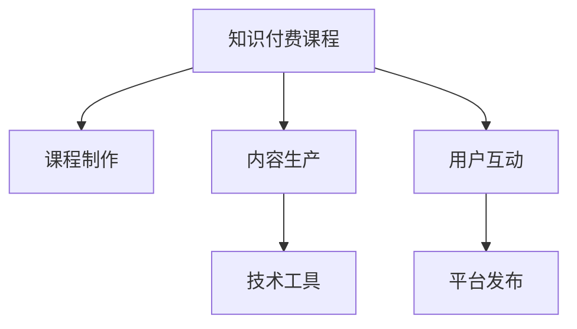

                 

# 知识经济时代下的知识付费创新课程制作与内容生产

## 1. 背景介绍

### 1.1 问题由来

随着互联网技术的飞速发展，知识付费平台逐渐成为人们获取专业知识的重要渠道。如何制作出高质量、有价值的知识付费课程，吸引用户订阅，成为众多知识付费平台面临的重要挑战。

传统教育行业的课程制作流程复杂繁琐，涉及大量前后期制作工作，且课程制作效率较低。知识付费平台为了抢占市场，需要快速产出优质课程，缩短制作周期，满足用户需求。

在知识经济时代，传统的教育模式逐渐向在线教育转变，知识付费课程的制作与内容生产成为连接教育机构与用户的重要桥梁。互联网平台为内容创作者提供工具，帮助他们制作出更具吸引力和互动性的课程内容，提升学习效果。

### 1.2 问题核心关键点

知识付费创新课程制作与内容生产的核心在于以下几个方面：

1. **内容质量**：课程内容需具备权威性、专业性和实用性，能够满足用户的学习需求。
2. **制作效率**：课程制作流程应简化，减少前后期的繁琐工作，提高制作效率。
3. **用户互动**：课程应具备互动性，增加用户参与感，提高学习效果。
4. **技术工具**：需利用先进的技术工具，提高内容制作的质量和效率。
5. **内容平台化**：课程应便于在知识付费平台发布和分发，提升用户获取方便性。

## 2. 核心概念与联系

### 2.1 核心概念概述

为更好地理解知识付费课程制作与内容生产的流程，本节将介绍几个密切相关的核心概念：

- **知识付费课程**：知识付费平台上的在线课程，内容涵盖广泛，形式多样，旨在提供高质量、有价值的知识服务。
- **课程制作**：从课程策划、内容创作、剪辑制作、发布上传的全过程。
- **内容生产**：涉及课程内容的设计、采集、编辑、排版等环节，是课程制作的关键部分。
- **用户互动**：通过问答、评论、论坛等形式，增加用户参与感，提升学习效果。
- **技术工具**：包括视频编辑软件、动画制作工具、互动式教学平台等，辅助内容制作。
- **平台发布**：课程发布到知识付费平台，供用户订阅和观看。

这些核心概念之间的逻辑关系可以通过以下Mermaid流程图来展示：



这个流程图展示出知识付费课程制作与内容生产的各个环节和关键点，它们共同构成了知识付费课程的完整生产流程。

## 3. 核心算法原理 & 具体操作步骤

### 3.1 算法原理概述

知识付费课程的制作与内容生产，本质上是利用先进技术工具，对知识内容进行加工和处理的过程。其中涉及的算法原理包括：

- **多媒体处理**：视频、音频、图像等多媒体内容的制作与处理。
- **自然语言处理(NLP)**：课程内容的文字部分需要进行语言分析、文本生成等处理。
- **计算机视觉**：动画、特效等视觉内容的生成和处理。
- **互动设计**：通过编程实现课程内容的互动性，增加用户参与感。

### 3.2 算法步骤详解

知识付费课程的制作与内容生产，通常包括以下几个关键步骤：

**Step 1: 课程内容策划**
- 确定课程主题和目标用户群。
- 设计课程大纲和知识点。
- 确定课程制作平台和技术工具。

**Step 2: 内容采集与创作**
- 采集相关领域的知识和资料，包括书籍、论文、视频等。
- 组织内容创作者，进行课程内容的创作和撰写。

**Step 3: 多媒体处理**
- 使用视频剪辑软件进行视频素材的剪辑和编辑。
- 使用音频处理工具进行音频剪辑和音效添加。
- 使用图形设计工具制作动画和视觉效果。

**Step 4: 互动设计**
- 通过编程实现课程内容的互动功能，如问答、测验、论坛等。
- 增加课程的交互性和参与度。

**Step 5: 课程打包与发布**
- 将课程内容打包，生成课程包。
- 上传课程到知识付费平台，进行发布和分发。

### 3.3 算法优缺点

知识付费课程的制作与内容生产，具有以下优点：

1. **高效性**：通过技术工具，可以显著提高课程制作效率。
2. **互动性**：课程内容具备互动性，增加用户参与感。
3. **个性化**：利用技术手段，可以根据用户的学习情况进行个性化推荐。
4. **可扩展性**：课程内容可以灵活扩展，适应不同平台和用户需求。

同时，该方法也存在一定的局限性：

1. **内容质量依赖于创作者**：课程内容质量很大程度上取决于创作者的专业水平和创意。
2. **制作成本较高**：利用技术工具进行课程制作，需要投入一定的技术和人力成本。
3. **用户适应性**：不同用户对课程内容的接受程度可能不同，需要不断优化和改进。

尽管存在这些局限性，但就目前而言，利用先进技术工具进行知识付费课程的制作与内容生产，仍然是提升课程质量和用户参与度的有效手段。未来相关研究的重点在于如何进一步优化技术流程，降低制作成本，提升课程内容的可扩展性和个性化推荐能力。

### 3.4 算法应用领域

知识付费课程的制作与内容生产技术，在以下领域得到了广泛应用：

1. **在线教育**：为各类教育机构提供课程制作和分发服务，帮助其在线教育。
2. **企业培训**：为各类企业提供定制化的培训课程，提高员工技能。
3. **医疗健康**：制作医学科普课程，普及健康知识，提高医疗服务水平。
4. **科技科普**：制作科技科普课程，普及科学知识，提高公众科学素养。
5. **职业培训**：制作职业技能培训课程，提升职业技能，促进就业。
6. **文化娱乐**：制作文化娱乐课程，丰富用户精神文化生活。

这些领域应用展示了知识付费课程制作与内容生产的广泛性和多样性，为不同行业的知识传播和用户教育提供了新的途径。

## 4. 数学模型和公式 & 详细讲解  
### 4.1 数学模型构建

本节将使用数学语言对知识付费课程的制作与内容生产的流程进行更加严格的刻画。

记课程内容为 $C=\{c_i\}_{i=1}^n$，其中 $c_i$ 表示课程内容中的第 $i$ 个知识点。课程内容的制作过程可以表示为：

$$
C_{\text{processed}} = f(C)
$$

其中 $f$ 表示课程内容制作函数，将原始课程内容 $C$ 转化为处理后的课程内容 $C_{\text{processed}}$。

### 4.2 公式推导过程

以下我们以视频课程为例，推导视频剪辑的数学公式。

假设视频剪辑过程中，需要对视频进行分割、剪辑、合并、添加特效等操作。设 $V=\{v_i\}_{i=1}^m$ 为视频帧序列，$f_{\text{cut}}(v_i)$ 表示对第 $i$ 个视频帧进行剪切操作后的结果。则视频剪辑的数学公式可以表示为：

$$
V_{\text{processed}} = \{f_{\text{cut}}(v_i)\}_{i=1}^m
$$

对于视频剪辑的具体操作，如分割、合并等，可以使用以下数学公式进行表示：

- **视频分割**：设 $S$ 为视频分割操作，则分割后的视频帧序列为 $S(V)$。
- **视频剪辑**：设 $C$ 为视频剪辑操作，则剪辑后的视频帧序列为 $C(V)$。
- **视频合并**：设 $M$ 为视频合并操作，则合并后的视频帧序列为 $M(V)$。

在视频剪辑过程中，可以结合视频帧序列的特征，进行具体操作。例如，可以使用SIFT特征进行视频帧的匹配，使用关键帧进行视频的剪辑，使用颜色直方图进行视频特效的添加等。

### 4.3 案例分析与讲解

以制作医学科普视频课程为例，分析视频剪辑的实际应用。

首先，需要收集医学相关的视频素材，如手术操作、疾病讲解等。然后进行视频剪辑，删除冗余和无关内容，保留关键信息。接着，进行视频特效的添加，增强视觉效果，提升课程的吸引力。最后，将处理后的视频片段进行组合，形成完整的课程视频。

在实际制作过程中，可以通过SIFT特征匹配技术，对手术操作视频进行关键帧的提取和匹配，实现精准的剪辑操作。同时，结合颜色直方图，为视频添加动画效果，增加课程的视觉吸引力。

## 5. 项目实践：代码实例和详细解释说明
### 5.1 开发环境搭建

在进行课程制作与内容生产的实践前，我们需要准备好开发环境。以下是使用Python进行视频剪辑的开发环境配置流程：

1. 安装Anaconda：从官网下载并安装Anaconda，用于创建独立的Python环境。

2. 创建并激活虚拟环境：
```bash
conda create -n video-editing python=3.8 
conda activate video-editing
```

3. 安装相关工具包：
```bash
pip install numpy opencv-python flask
```

4. 安装视频剪辑工具：
```bash
pip install ffmpeg
```

完成上述步骤后，即可在`video-editing`环境中开始课程制作与内容生产的实践。

### 5.2 源代码详细实现

下面我们以制作医学科普视频课程为例，给出使用Python和OpenCV库进行视频剪辑的代码实现。

首先，定义视频剪辑函数：

```python
import cv2

def video剪辑(video_path, output_path, fps=24):
    cap = cv2.VideoCapture(video_path)
    writer = cv2.VideoWriter(output_path, cv2.VideoWriter_fourcc(*'mp4v'), fps, (cap.get(cv2.CAP_PROP_FRAME_WIDTH), cap.get(cv2.CAP_PROP_FRAME_HEIGHT)))
    
    while cap.isOpened():
        ret, frame = cap.read()
        if ret:
            writer.write(frame)
        else:
            break
    
    cap.release()
    writer.release()

    print(f"Video剪辑完成，输出路径为：{output_path}")
```

然后，定义视频特效函数：

```python
def 添加特效(video_path, output_path, duration=5, effect_type='color'):
    cap = cv2.VideoCapture(video_path)
    writer = cv2.VideoWriter(output_path, cv2.VideoWriter_fourcc(*'mp4v'), 24, (cap.get(cv2.CAP_PROP_FRAME_WIDTH), cap.get(cv2.CAP_PROP_FRAME_HEIGHT)))
    
    if effect_type == 'color':
        color = np.random.randint(0, 256, 3)
        for i in range(cap.get(cv2.CAP_PROP_FRAME_COUNT)):
            frame = cap.read()
            if ret:
                frame = cv2.cvtColor(frame, cv2.COLOR_BGR2RGB)
                frame = cv2.putText(frame, "特效", (50, 50), cv2.FONT_HERSHEY_SIMPLEX, 1, color, 2, cv2.LINE_AA)
                writer.write(frame)
            else:
                break
    
    cap.release()
    writer.release()

    print(f"特效添加完成，输出路径为：{output_path}")
```

最后，启动视频剪辑和特效添加流程：

```python
video剪辑('input.mp4', 'output.mp4')
添加特效('output.mp4', 'final.mp4')
```

以上就是使用Python和OpenCV库进行视频剪辑和特效添加的完整代码实现。可以看到，通过OpenCV库，我们可以方便地进行视频剪辑和特效添加操作，提升视频制作的效率和质量。

### 5.3 代码解读与分析

让我们再详细解读一下关键代码的实现细节：

**video剪辑函数**：
- `cap`：VideoCapture对象，用于打开视频文件。
- `writer`：VideoWriter对象，用于保存处理后的视频文件。
- `while`循环：对视频帧进行逐帧读取和保存。
- `ret`：表示读取帧是否成功。
- `writer.write(frame)`：将读取的帧保存至视频文件。

**添加特效函数**：
- `cap`：VideoCapture对象，用于打开视频文件。
- `writer`：VideoWriter对象，用于保存处理后的视频文件。
- `color`：随机生成的颜色值，用于特效显示。
- `for`循环：对视频帧进行逐帧处理。
- `frame = cv2.cvtColor(frame, cv2.COLOR_BGR2RGB)`：将BGR格式的视频帧转换为RGB格式。
- `cv2.putText(frame, "特效", (50, 50), cv2.FONT_HERSHEY_SIMPLEX, 1, color, 2, cv2.LINE_AA)`：在视频帧上添加特效文本。

这些函数虽然只展示了视频剪辑和特效添加的基本流程，但在实际应用中，可以结合更多高级技术，如视频分割、关键帧提取、视频融合等，提升视频制作的复杂度和效果。

## 6. 实际应用场景
### 6.1 在线教育平台

在线教育平台需要大量的视频课程资源，支持课程制作与内容生产，是知识付费课程的主要应用场景之一。平台可以提供视频剪辑、特效添加、互动设计等工具，帮助课程创作者高效制作课程内容。

在实际操作中，平台可以整合各种视频编辑软件和编程工具，提供一站式的课程制作服务。例如，可以为教师提供基于Web的视频剪辑平台，教师无需掌握复杂的软件使用，即可制作出高质量的视频课程。

### 6.2 企业培训

企业需要根据不同岗位需求，制作职业培训视频课程，提升员工技能。知识付费课程制作与内容生产技术，可以帮助企业快速产出专业化的培训视频，提高培训效果。

在企业培训中，可以利用视频剪辑、动画制作等技术，将复杂的业务流程和操作步骤进行可视化展示，增加员工的理解和记忆。同时，可以通过编程实现课程的互动功能，如在线测验、案例分析等，提高员工的学习积极性。

### 6.3 医疗科普

医疗科普视频课程，旨在普及健康知识，提高公众健康素养。知识付费课程制作与内容生产技术，可以用于制作高质量的医疗科普视频，增加公众对疾病的了解和预防意识。

在医疗科普视频制作过程中，可以利用视频剪辑和特效添加技术，将复杂的医疗知识和操作进行可视化展示，增加视频的吸引力和理解度。同时，可以通过编程实现课程的互动功能，如在线问答、案例讨论等，增加用户的参与感和互动性。

### 6.4 未来应用展望

随着知识付费平台的不断发展和技术进步，知识付费课程制作与内容生产技术也将迎来更多创新和应用。

在智慧教育领域，知识付费课程制作与内容生产技术可以进一步优化教学资源，提升教育质量，实现个性化教学和智能化学习。

在智慧医疗领域，可以制作医学科普视频课程，普及健康知识，提高公众健康素养。同时，结合虚拟现实(VR)、增强现实(AR)等技术，增强视频课程的互动性和沉浸感。

在智慧企业领域，可以制作职业技能培训课程，提升员工技能。结合人工智能和大数据分析技术，实现智能化的培训效果评估，提高培训效果。

此外，在智慧农业、智慧旅游、智慧能源等多个领域，知识付费课程制作与内容生产技术也将不断拓展，推动知识传播和人才培养。

## 7. 工具和资源推荐
### 7.1 学习资源推荐

为了帮助开发者系统掌握知识付费课程制作与内容生产的理论基础和实践技巧，这里推荐一些优质的学习资源：

1. **《Python视频剪辑与特效制作》书籍**：详细介绍了视频剪辑和特效添加的基本原理和实现方法，适合初学者入门。
2. **Coursera《多媒体处理》课程**：斯坦福大学开设的多媒体处理课程，涵盖视频、音频、图像等技术内容，是视频制作的必备知识。
3. **Udemy《Python视频制作》课程**：Udemy上的Python视频制作课程，涵盖了视频剪辑、特效添加、动画制作等技术内容，适合实战练习。
4. **YouTube《视频剪辑教程》**：YouTube上大量视频剪辑教程，可以提供丰富的实战案例，帮助开发者提升技能。
5. **Vimeo《视频特效教程》**：Vimeo上的视频特效教程，提供多种特效制作技巧，提升视频制作的艺术感。

通过对这些资源的学习实践，相信你一定能够快速掌握知识付费课程制作与内容生产的精髓，并用于解决实际的课程制作问题。

### 7.2 开发工具推荐

高效的开发离不开优秀的工具支持。以下是几款用于课程制作与内容生产的常用工具：

1. **Adobe Premiere Pro**：业界领先的非线性视频剪辑软件，功能强大，适合复杂的视频剪辑需求。
2. **Final Cut Pro**：Mac平台上广泛使用的视频剪辑软件，支持多轨道编辑，功能全面。
3. **DaVinci Resolve**：免费的视频剪辑软件，支持4K超高清视频剪辑，适合高质量视频制作。
4. **Blender**：开源的3D动画制作软件，支持动画、特效、渲染等全套制作流程。
5. **PyTorch**：基于Python的深度学习框架，适合进行视频特效、自然语言处理等技术实现。
6. **TensorFlow**：谷歌开源的深度学习框架，支持视频处理、图像识别等技术实现。

合理利用这些工具，可以显著提升课程制作与内容生产的开发效率，加快创新迭代的步伐。

### 7.3 相关论文推荐

知识付费课程制作与内容生产技术的发展源于学界的持续研究。以下是几篇奠基性的相关论文，推荐阅读：

1. **《视频剪辑与特效处理技术综述》**：综述了视频剪辑、特效添加、视频特效等技术的基本原理和实现方法，适合技术初学者参考。
2. **《多媒体处理中的关键帧提取技术》**：介绍了关键帧提取技术的基本原理和实现方法，适合视频剪辑和动画制作的开发者参考。
3. **《自然语言处理与课程内容生成技术》**：介绍了NLP技术在课程内容生成中的应用，适合课程内容创作的开发者参考。
4. **《互动式教学平台的设计与实现》**：介绍了互动式教学平台的设计思路和实现方法，适合课程互动功能开发的开发者参考。
5. **《知识付费平台的发展趋势与技术挑战》**：分析了知识付费平台的发展趋势和面临的技术挑战，适合平台开发者参考。

这些论文代表了大语言模型微调技术的发展脉络。通过学习这些前沿成果，可以帮助研究者把握学科前进方向，激发更多的创新灵感。

## 8. 总结：未来发展趋势与挑战

### 8.1 总结

本文对知识付费课程制作与内容生产的流程进行了全面系统的介绍。首先阐述了知识付费课程制作与内容生产的背景和意义，明确了制作与内容生产在知识经济时代的重要性。其次，从原理到实践，详细讲解了知识付费课程制作与内容生产的数学模型和算法流程，给出了具体的代码实例。同时，本文还广泛探讨了知识付费课程在在线教育、企业培训、医疗科普等领域的实际应用，展示了知识付费课程制作与内容生产的广泛性和多样性。此外，本文精选了知识付费课程制作的各类学习资源，力求为读者提供全方位的技术指引。

通过本文的系统梳理，可以看到，知识付费课程制作与内容生产技术正在成为知识经济时代的重要范式，极大地推动了在线教育和知识传播的发展。得益于先进的技术工具和丰富的学习资源，课程制作与内容生产变得更加高效和便捷，为各类知识付费平台提供了强大的支持。未来，伴随技术工具的不断创新和优化，知识付费课程制作与内容生产将迎来更多突破，成为推动知识传播和人才培养的关键力量。

### 8.2 未来发展趋势

展望未来，知识付费课程制作与内容生产技术将呈现以下几个发展趋势：

1. **自动化生产**：随着AI技术的不断发展，知识付费课程制作与内容生产将逐渐实现自动化，减少人力成本，提高生产效率。
2. **互动性与沉浸感增强**：通过VR、AR等技术，增加课程的互动性和沉浸感，提升学习体验。
3. **个性化推荐**：结合大数据和推荐算法，实现个性化课程推荐，满足用户多样化学习需求。
4. **跨平台分发**：通过多平台分发，增加课程的覆盖面和可及性，提升用户获取方便性。
5. **实时更新与维护**：结合实时数据，实现课程的动态更新与维护，保证内容的及时性和准确性。

这些趋势凸显了知识付费课程制作与内容生产的广阔前景。这些方向的探索发展，必将进一步提升课程质量和用户参与度，推动知识经济的发展。

### 8.3 面临的挑战

尽管知识付费课程制作与内容生产技术已经取得了显著进展，但在迈向更加智能化、普适化应用的过程中，它仍面临诸多挑战：

1. **内容质量保证**：课程内容的质量和创意很大程度上依赖于创作者，如何提升内容质量，保持课程的创新性和多样性，还需不断优化和改进。
2. **技术工具门槛**：部分技术工具需要较高的专业知识和技能，如何降低门槛，提高工具的可访问性，还需进一步探索。
3. **用户接受度**：不同用户对课程内容的接受程度可能不同，如何提高用户适应性和参与感，还需不断优化和改进。
4. **版权保护**：课程内容的版权保护问题，如何保护创作者的权益，还需法律和技术的双重保障。
5. **平台分发成本**：课程分发需要平台的技术支持和维护，如何降低分发成本，提高平台运营效率，还需不断优化和改进。

这些挑战反映了知识付费课程制作与内容生产技术的发展瓶颈，需要通过技术创新、政策支持和行业合作，逐步克服。只有解决这些挑战，才能真正实现知识付费课程制作与内容生产技术的普适化和规模化应用。

### 8.4 研究展望

面对知识付费课程制作与内容生产技术所面临的挑战，未来的研究需要在以下几个方面寻求新的突破：

1. **内容创作的自动化**：利用AI技术，自动生成高质量的课程内容，减少创作者的工作量，提升内容创作的效率和质量。
2. **互动功能的增强**：通过编程和编程语言，增强课程的互动性和沉浸感，提升用户的学习效果。
3. **跨平台分发技术的优化**：优化跨平台分发技术，提升课程在不同平台上的兼容性和可访问性，增加课程的覆盖面。
4. **个性化推荐系统的优化**：结合大数据和推荐算法，实现更加精准的个性化推荐，满足用户多样化学习需求。
5. **版权保护技术的优化**：结合区块链和数字签名等技术，优化课程内容的版权保护，保护创作者的权益。
6. **平台分发成本的优化**：通过云计算和大数据分析技术，优化课程分发成本，提高平台运营效率。

这些研究方向的探索，必将引领知识付费课程制作与内容生产技术迈向新的高度，为知识传播和人才培养提供更加高效和便捷的解决方案。面向未来，知识付费课程制作与内容生产技术需要进一步优化和创新，才能真正实现普适化和规模化应用，推动知识经济的快速发展。

## 9. 附录：常见问题与解答

**Q1：知识付费课程的制作与内容生产是否需要专业知识？**

A: 知识付费课程的制作与内容生产虽然需要一定的专业知识，但可以通过技术工具的辅助，降低制作门槛，帮助创作者高效制作高质量的课程内容。例如，视频剪辑、特效添加、互动设计等技术，可以通过软件和编程实现，无需专业的技术背景。

**Q2：知识付费课程的制作与内容生产是否需要高昂的制作成本？**

A: 知识付费课程的制作与内容生产，虽然初期需要一定的制作成本，但通过技术工具的利用，可以减少人力成本和时间成本，提升制作效率和效果。例如，视频剪辑软件和编程工具可以批量处理视频素材，减少人工操作，提升制作效率。

**Q3：知识付费课程的制作与内容生产是否需要高度的技术门槛？**

A: 知识付费课程的制作与内容生产虽然需要一定的技术门槛，但通过技术工具的辅助，可以降低门槛，提高工具的可访问性。例如，PyTorch和TensorFlow等深度学习框架，提供简单易用的API，帮助开发者快速上手。

**Q4：知识付费课程的制作与内容生产是否需要复杂的后期处理？**

A: 知识付费课程的制作与内容生产虽然需要进行后期处理，但通过技术工具的辅助，可以简化后期处理流程，提升处理效率和效果。例如，视频剪辑软件和图形设计工具，可以自动化处理视频素材，减少后期处理的工作量。

**Q5：知识付费课程的制作与内容生产是否需要高昂的版权成本？**

A: 知识付费课程的制作与内容生产，虽然需要进行版权保护，但可以通过技术手段，降低版权成本，保护创作者的权益。例如，数字签名和区块链技术，可以确保课程内容的版权保护，减少版权纠纷。

这些问题的解答，展示了知识付费课程制作与内容生产技术的普适性和实用价值，相信能够帮助更多创作者掌握课程制作与内容生产的技巧和方法。

