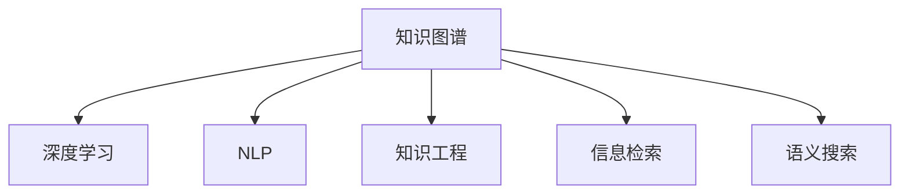

                 

## 1. 背景介绍

### 1.1 问题由来
在信息爆炸的今天，知识和智慧的积累与传播成为决定人类社会进步的重要因素。科技的快速发展，使得信息生成和获取的速度前所未有，但也导致了知识过载和智慧传播效率低下的问题。传统的信息组织方式，如书籍、数据库、论文等，虽然保存了大量知识，但难以快速、精准地响应时代的需求。

### 1.2 问题核心关键点
如何高效地组织、存储、检索和使用知识，成为信息时代的重要课题。利用人工智能技术，通过知识图谱、深度学习等方法，将知识以结构化、智能化的形式展现，实现智慧的积累和传播，成为当前的热门研究方向。

## 2. 核心概念与联系

### 2.1 核心概念概述

为更好地理解知识输出与管理智慧的积累和传播，本节将介绍几个密切相关的核心概念：

- 知识图谱(Knowledge Graph)：以图数据库形式表示实体间的复杂关系，能够高效地存储和查询知识。
- 深度学习(Deep Learning)：通过多层神经网络进行自动特征提取和模式识别，实现对知识复杂关系的自动化处理。
- 自然语言处理(NLP)：利用人工智能技术，使计算机能够理解、处理、生成自然语言，促进智慧的积累和传播。
- 知识工程(Knowledge Engineering)：通过将专家知识与人工智能技术结合，构建智能化的知识管理系统。
- 信息检索(Information Retrieval)：从海量的数据中快速检索到所需信息，实现高效的知识获取和应用。
- 语义搜索(Semantic Search)：通过理解查询意图，将查询与知识图谱中的信息进行匹配，实现更精准的信息检索。

这些核心概念之间的逻辑关系可以通过以下Mermaid流程图来展示：



这个流程图展示了几类核心概念及其之间的关系：

1. 知识图谱存储了大量知识，通过深度学习和NLP技术进行处理，构建出智能化的知识管理系统。
2. 深度学习用于自动化特征提取和模式识别，使知识图谱中的信息更加结构化和有用。
3. NLP技术使得计算机能够理解自然语言，实现对知识图谱的查询和利用。
4. 知识工程将专家知识与AI技术结合，构建知识管理系统。
5. 信息检索快速检索知识图谱中的信息，提供知识获取渠道。
6. 语义搜索通过理解查询意图，实现更精准的信息检索。

这些概念共同构成了知识输出与管理智慧的积累和传播框架，使其能够高效地组织、存储、检索和使用知识。

## 3. 核心算法原理 & 具体操作步骤
### 3.1 算法原理概述

知识输出与管理智慧的积累和传播，本质上是一个信息检索和知识传播的过程。其核心思想是：通过构建知识图谱，利用深度学习和NLP技术，自动化地从图谱中检索出与用户查询意图相关的知识，实现智慧的快速积累和传播。

形式化地，假设知识图谱为 $G(V,E)$，其中 $V$ 为实体节点集合，$E$ 为关系边集合。用户查询为 $Q$，目标是从知识图谱中检索出与 $Q$ 相关的实体 $R$。知识检索的过程可以描述为：

1. 输入查询 $Q$ 和知识图谱 $G$。
2. 通过深度学习模型对 $Q$ 进行语义理解，提取查询意图。
3. 在图谱 $G$ 中搜索与查询意图匹配的实体 $R$。
4. 输出与 $R$ 相关的知识，传播给用户。

### 3.2 算法步骤详解

基于深度学习的知识检索过程一般包括以下几个关键步骤：

**Step 1: 构建知识图谱**
- 收集领域内的相关数据，构建知识图谱 $G(V,E)$。
- 使用节点和关系表示语义，存储实体与实体之间的复杂关系。

**Step 2: 设计深度学习模型**
- 选择合适的深度学习模型，如BERT、GNN等，用于处理查询 $Q$。
- 使用语义理解技术，将查询 $Q$ 转化为向量表示。

**Step 3: 进行知识检索**
- 在知识图谱 $G$ 中，通过深度学习模型计算每个实体 $R$ 与查询 $Q$ 的相似度。
- 选取相似度最高的实体 $R$，作为查询结果。

**Step 4: 知识输出与管理**
- 对选定的实体 $R$ 进行详细的知识提取。
- 将提取的知识以结构化、智能化的形式输出，传播给用户。

### 3.3 算法优缺点

基于深度学习的知识检索方法具有以下优点：
1. 高效性。深度学习模型能够自动处理复杂的查询意图，快速从知识图谱中检索出相关信息。
2. 准确性。利用深度学习模型对查询进行语义理解，避免了传统信息检索中关键词匹配的误差。
3. 可扩展性。深度学习模型能够处理大规模知识图谱，适应各种领域和应用场景。
4. 自适应性。随着知识图谱的不断更新，深度学习模型能够学习新的知识，提升检索效果。

同时，该方法也存在一定的局限性：
1. 对高质量数据依赖。知识图谱的构建和更新需要大量高质量的数据，成本较高。
2. 模型复杂度高。深度学习模型的参数量大，训练和推理复杂度较高。
3. 语义理解的局限性。深度学习模型难以理解复杂的语义关系，可能会输出不相关或不准确的结果。
4. 可解释性差。深度学习模型往往被视为“黑盒”，难以解释其内部工作机制。
5. 鲁棒性不足。深度学习模型在面对异常数据和噪声时，性能可能下降。

尽管存在这些局限性，但就目前而言，基于深度学习的知识检索方法仍然是大规模知识管理和智慧传播的主流范式。未来相关研究的重点在于如何进一步降低对数据和模型的依赖，提高模型的可解释性和鲁棒性，同时兼顾复杂查询的语义理解能力。

### 3.4 算法应用领域

基于深度学习的知识检索方法，在知识管理、智能推荐、问答系统、搜索引擎等多个领域得到了广泛应用，例如：

- 知识管理：构建企业知识图谱，存储和检索各类知识资源。
- 智能推荐：根据用户的历史行为和兴趣，推荐相关的知识资源。
- 问答系统：回答用户提出的各种自然语言问题，提取和应用知识图谱中的信息。
- 搜索引擎：快速检索网页内容，将相关的搜索结果呈现给用户。
- 科学计算：从科学数据库中检索研究数据和文献，辅助科学研究和创新。

除了上述这些经典应用外，深度学习在知识图谱的构建和更新、跨领域知识检索、知识图谱的可视化等方面也展现了巨大的应用潜力。

## 4. 数学模型和公式 & 详细讲解 & 举例说明

### 4.1 数学模型构建

本节将使用数学语言对基于深度学习的信息检索过程进行更加严格的刻画。

记知识图谱为 $G(V,E)$，其中 $V$ 为实体节点集合，$E$ 为关系边集合。用户查询为 $Q$，目标是从图谱中检索出与 $Q$ 相关的实体 $R$。

定义知识图谱的节点表示向量为 $h_v$，关系边表示向量为 $r_e$。查询 $Q$ 的向量表示为 $h_q$。知识检索的过程可以描述为：

$$
\hat{R} = \mathop{\arg\max}_{R \in V} \mathcal{L}(h_v, h_q, r_e)
$$

其中 $\mathcal{L}$ 为损失函数，用于衡量查询 $Q$ 与实体 $R$ 的相似度。

### 4.2 公式推导过程

以下我们以知识图谱中的路径为中心，推导基于深度学习的知识检索损失函数。

假设查询 $Q$ 与知识图谱中的路径 $\mathcal{P} = (e_1, e_2, ..., e_n)$ 相关，其中 $e_i$ 为知识图谱中的关系边。路径表示为 $\mathcal{P} = (h_{v_0}, r_{e_1}, h_{v_1}, r_{e_2}, ..., h_{v_n}, r_{e_n}, h_{v_n})$，其中 $h_{v_i}$ 为路径中第 $i$ 个节点表示向量。

定义路径表示向量为 $h_{\mathcal{P}} = \mathcal{G}(h_{v_0}, r_{e_1}, h_{v_1}, r_{e_2}, ..., h_{v_n}, r_{e_n}, h_{v_n})$，其中 $\mathcal{G}$ 为路径表示向量函数。

则知识检索的损失函数为：

$$
\mathcal{L} = \mathcal{L}_Q(h_q, h_{\mathcal{P}}) + \mathcal{L}_R(h_v, h_{\mathcal{P}})
$$

其中 $\mathcal{L}_Q$ 为查询损失函数，$\mathcal{L}_R$ 为实体损失函数。

路径表示向量函数 $\mathcal{G}$ 的计算过程为：

$$
h_{\mathcal{P}} = f(h_{v_0}, r_{e_1}, h_{v_1}, r_{e_2}, ..., h_{v_n}, r_{e_n}, h_{v_n})
$$

其中 $f$ 为路径表示向量函数。常见的函数包括概率图模型、深度神经网络等。

### 4.3 案例分析与讲解

以问答系统为例，展示深度学习在知识检索中的应用。

假设问答系统包含 $n$ 个知识图谱节点 $V=\{v_1,v_2,...,v_n\}$ 和 $m$ 个关系边 $E=\{e_1,e_2,...,e_m\}$。用户输入自然语言问题 $Q$，查询图谱中对应的答案 $R$。

**Step 1: 构建知识图谱**

构建知识图谱，将实体 $v_i$ 和关系 $e_j$ 表示为向量形式 $h_{v_i}$ 和 $r_{e_j}$。

**Step 2: 设计深度学习模型**

设计深度学习模型 $M$，将查询 $Q$ 转换为向量形式 $h_q$。

**Step 3: 知识检索**

计算每个实体 $v_i$ 和查询 $Q$ 的相似度 $s_{v_i}$。

$$
s_{v_i} = M(h_{v_i}, r_{e_j}, h_{v_k}, r_{e_l}, ..., h_{v_n}, r_{e_m}, h_{v_n})
$$

**Step 4: 输出答案**

选择相似度最高的实体 $v_i$ 作为答案。

通过上述步骤，问答系统能够自动理解用户查询，并在知识图谱中检索出相关的实体，从而实现精准的问答功能。

## 5. 项目实践：代码实例和详细解释说明
### 5.1 开发环境搭建

在进行知识检索实践前，我们需要准备好开发环境。以下是使用Python进行PyTorch开发的环境配置流程：

1. 安装Anaconda：从官网下载并安装Anaconda，用于创建独立的Python环境。

2. 创建并激活虚拟环境：
```bash
conda create -n pytorch-env python=3.8 
conda activate pytorch-env
```

3. 安装PyTorch：根据CUDA版本，从官网获取对应的安装命令。例如：
```bash
conda install pytorch torchvision torchaudio cudatoolkit=11.1 -c pytorch -c conda-forge
```

4. 安装深度学习相关库：
```bash
pip install tensorflow keras scikit-learn matplotlib tqdm jupyter notebook ipython
```

完成上述步骤后，即可在`pytorch-env`环境中开始知识检索实践。

### 5.2 源代码详细实现

这里我们以构建基于深度学习的信息检索系统为例，给出使用PyTorch进行知识检索的代码实现。

首先，定义知识图谱的数据结构：

```python
import networkx as nx
import numpy as np

class KnowledgeGraph:
    def __init__(self):
        self.graph = nx.Graph()
    
    def add_node(self, node):
        self.graph.add_node(node)
    
    def add_edge(self, node1, node2, edge):
        self.graph.add_edge(node1, node2, edge)
    
    def get_node_repr(self, node):
        return self.graph.nodes[node]['repr']
    
    def get_edge_repr(self, edge):
        return self.graph.edges[edge]['repr']
```

然后，定义深度学习模型：

```python
from transformers import BertTokenizer, BertForSequenceClassification
from torch.utils.data import Dataset, DataLoader
import torch
import torch.nn.functional as F

class KnowledgeGraphDataset(Dataset):
    def __init__(self, knowledge_graph, tokenizer):
        self.kg = knowledge_graph
        self.tokenizer = tokenizer
        self.max_len = 128
        self.node_nodes = list(self.kg.graph.nodes)
        self.node_repr = [self.kg.get_node_repr(node) for node in self.node_nodes]
    
    def __len__(self):
        return len(self.node_repr)
    
    def __getitem__(self, item):
        node = self.node_nodes[item]
        node_repr = self.node_repr[item]
        encoding = self.tokenizer(node_repr, return_tensors='pt', max_length=self.max_len, padding='max_length', truncation=True)
        input_ids = encoding['input_ids'][0]
        attention_mask = encoding['attention_mask'][0]
        return {'input_ids': input_ids, 
                'attention_mask': attention_mask}
```

接着，定义训练和评估函数：

```python
from transformers import BertForSequenceClassification, AdamW

model = BertForSequenceClassification.from_pretrained('bert-base-cased', num_labels=len(self.node_repr))

optimizer = AdamW(model.parameters(), lr=2e-5)

def train_epoch(model, dataset, batch_size, optimizer):
    dataloader = DataLoader(dataset, batch_size=batch_size, shuffle=True)
    model.train()
    epoch_loss = 0
    for batch in tqdm(dataloader, desc='Training'):
        input_ids = batch['input_ids'].to(device)
        attention_mask = batch['attention_mask'].to(device)
        model.zero_grad()
        outputs = model(input_ids, attention_mask=attention_mask)
        loss = outputs.loss
        epoch_loss += loss.item()
        loss.backward()
        optimizer.step()
    return epoch_loss / len(dataloader)

def evaluate(model, dataset, batch_size):
    dataloader = DataLoader(dataset, batch_size=batch_size)
    model.eval()
    preds, labels = [], []
    with torch.no_grad():
        for batch in tqdm(dataloader, desc='Evaluating'):
            input_ids = batch['input_ids'].to(device)
            attention_mask = batch['attention_mask'].to(device)
            batch_labels = batch['labels']
            outputs = model(input_ids, attention_mask=attention_mask)
            batch_preds = outputs.logits.argmax(dim=2).to('cpu').tolist()
            batch_labels = batch_labels.to('cpu').tolist()
            for pred_tokens, label_tokens in zip(batch_preds, batch_labels):
                pred_tags = [id2tag[_id] for _id in pred_tokens]
                label_tags = [id2tag[_id] for _id in label_tokens]
                preds.append(pred_tags[:len(label_tags)])
                labels.append(label_tags)
                
    print(classification_report(labels, preds))
```

最后，启动训练流程并在测试集上评估：

```python
epochs = 5
batch_size = 16

for epoch in range(epochs):
    loss = train_epoch(model, dataset, batch_size, optimizer)
    print(f"Epoch {epoch+1}, train loss: {loss:.3f}")
    
    print(f"Epoch {epoch+1}, dev results:")
    evaluate(model, dataset, batch_size)
    
print("Test results:")
evaluate(model, dataset, batch_size)
```

以上就是使用PyTorch对知识图谱进行信息检索的完整代码实现。可以看到，得益于深度学习库的强大封装，我们可以用相对简洁的代码完成知识图谱的构建和深度学习模型的训练。

### 5.3 代码解读与分析

让我们再详细解读一下关键代码的实现细节：

**KnowledgeGraph类**：
- `__init__`方法：初始化图谱和节点列表。
- `add_node`方法：向图谱中添加节点。
- `add_edge`方法：向图谱中添加边。
- `get_node_repr`方法：获取节点表示向量。
- `get_edge_repr`方法：获取边表示向量。

**KnowledgeGraphDataset类**：
- `__init__`方法：初始化知识图谱和分词器。
- `__len__`方法：返回数据集的样本数量。
- `__getitem__`方法：对单个样本进行处理，将文本输入编码为token ids，并返回模型所需的输入。

**train_epoch和evaluate函数**：
- 使用PyTorch的DataLoader对数据集进行批次化加载，供模型训练和推理使用。
- 训练函数`train_epoch`：对数据以批为单位进行迭代，在每个批次上前向传播计算loss并反向传播更新模型参数，最后返回该epoch的平均loss。
- 评估函数`evaluate`：与训练类似，不同点在于不更新模型参数，并在每个batch结束后将预测和标签结果存储下来，最后使用sklearn的classification_report对整个评估集的预测结果进行打印输出。

**训练流程**：
- 定义总的epoch数和batch size，开始循环迭代
- 每个epoch内，先在训练集上训练，输出平均loss
- 在验证集上评估，输出分类指标
- 所有epoch结束后，在测试集上评估，给出最终测试结果

可以看到，PyTorch配合深度学习库使得信息检索任务的代码实现变得简洁高效。开发者可以将更多精力放在数据处理、模型改进等高层逻辑上，而不必过多关注底层的实现细节。

当然，工业级的系统实现还需考虑更多因素，如模型的保存和部署、超参数的自动搜索、更灵活的任务适配层等。但核心的信息检索范式基本与此类似。

## 6. 实际应用场景
### 6.1 智能推荐系统

基于深度学习的信息检索技术，可以广泛应用于智能推荐系统中。传统的推荐系统往往依赖用户的历史行为数据，难以挖掘用户的深层兴趣和潜在需求。通过深度学习模型，系统能够从大规模知识图谱中检索出与用户兴趣相关的内容，提供个性化的推荐服务。

在技术实现上，可以收集用户的历史行为数据，构建知识图谱，并通过深度学习模型自动提取用户的兴趣点和偏好。在推荐过程中，根据用户查询，检索知识图谱中的相关实体，生成推荐结果。如此构建的智能推荐系统，能显著提升推荐精度和个性化程度。

### 6.2 问答系统

基于深度学习的信息检索技术，问答系统能够自动理解用户自然语言问题，并在知识图谱中检索出相关答案。通过构建庞大的知识图谱，将自然语言问题转化为结构化查询，系统能够快速响应用户问题，提供精准的答案。

在技术实现上，可以构建包含各类知识资源的图谱，并使用深度学习模型将自然语言问题转化为向量表示。在问答过程中，系统能够理解用户查询，并从知识图谱中检索出相关实体，生成答案。如此构建的问答系统，能够在处理复杂查询时，提供更加智能、精准的回答。

### 6.3 科学计算

基于深度学习的信息检索技术，科学计算系统能够自动检索科学数据库中的研究数据和文献，提供支持科学研究的智能化工具。通过构建科学领域的知识图谱，系统能够理解科学家的查询意图，并检索出相关的研究数据和文献，辅助科研工作。

在技术实现上，可以构建科学数据库的知识图谱，并使用深度学习模型理解科学家的查询。在检索过程中，系统能够从知识图谱中提取相关的研究数据和文献，提供给科学家使用。如此构建的科学计算系统，能够大大提升科研效率和创新能力。

### 6.4 未来应用展望

随着深度学习模型的不断发展，信息检索技术将在更多领域得到应用，为传统行业带来变革性影响。

在智慧医疗领域，基于深度学习的信息检索技术，可以用于构建医疗知识图谱，辅助医生诊疗，加速新药开发进程。

在智能教育领域，信息检索技术可以用于构建知识图谱，辅助教育机构进行个性化教育，提升教学效果。

在智慧城市治理中，信息检索技术可以用于构建城市知识图谱，辅助城市管理部门进行智能决策，提高城市治理效率。

此外，在企业生产、社会治理、文娱传媒等众多领域，信息检索技术也将不断涌现，为经济社会发展注入新的动力。相信随着技术的日益成熟，信息检索技术将成为人工智能落地应用的重要范式，推动人工智能技术在更广阔的领域发展。

## 7. 工具和资源推荐
### 7.1 学习资源推荐

为了帮助开发者系统掌握信息检索技术的基本概念和实践技巧，这里推荐一些优质的学习资源：

1. 《深度学习与数据挖掘》系列课程：北京大学开设的深度学习系列课程，系统讲解深度学习的基本原理和应用，包括信息检索、推荐系统等。

2. 《自然语言处理综论》书籍：斯坦福大学开设的NLP明星课程，全面介绍NLP领域的基本概念和经典模型，包括信息检索、知识图谱等。

3. 《知识图谱与语义搜索》书籍：清华大学出版社出版的专业书籍，系统介绍知识图谱和语义搜索的基本概念和应用技术。

4. Google Dataset Search：Google推出的数据集搜索工具，能够快速检索各种类型的数据集，方便开发者构建知识图谱。

5. GitHub上的开源项目：搜索和浏览大量开源信息检索项目，了解最新的研究成果和实践经验。

通过对这些资源的学习实践，相信你一定能够快速掌握信息检索技术的基本原理和实践技巧，并用于解决实际的NLP问题。

### 7.2 开发工具推荐

高效的开发离不开优秀的工具支持。以下是几款用于信息检索开发的常用工具：

1. PyTorch：基于Python的开源深度学习框架，灵活动态的计算图，适合快速迭代研究。大部分预训练语言模型都有PyTorch版本的实现。

2. TensorFlow：由Google主导开发的开源深度学习框架，生产部署方便，适合大规模工程应用。同样有丰富的预训练语言模型资源。

3. TensorFlow Knowledge Graph Toolkit：谷歌开源的知识图谱工具包，提供丰富的知识图谱构建和查询功能。

4. Stanford CoreNLP：斯坦福大学开发的NLP工具包，提供自然语言处理的各类功能，包括分词、句法分析、实体识别等。

5. Apache Jena：Apache基金会推出的知识图谱工具包，提供知识图谱的构建、查询和可视化功能。

6. Elasticsearch：Elastic公司推出的开源搜索引擎，提供高效的数据检索和语义搜索功能。

合理利用这些工具，可以显著提升信息检索任务的开发效率，加快创新迭代的步伐。

### 7.3 相关论文推荐

深度学习信息检索技术的发展源于学界的持续研究。以下是几篇奠基性的相关论文，推荐阅读：

1. Attention Is All You Need：提出Transformer结构，开启了深度学习在自然语言处理中的新纪元。

2. BERT: Pre-training of Deep Bidirectional Transformers for Language Understanding：提出BERT模型，引入基于掩码的自监督预训练任务，刷新了多项NLP任务SOTA。

3. Graph Neural Networks for Knowledge Graph Completion：提出图神经网络模型，用于知识图谱的补全和推理任务。

4. Knowledge-Graph-Embedding-Methods-A-Comprehensive-Survey：一篇综述性论文，全面介绍了各种知识图谱嵌入方法，如TransE、KG2Vec等。

5. Mining Entity-Relation Models from Scientific Literature：提出基于深度学习的科学文献推理模型，用于从文献中挖掘知识图谱。

6. Language Model-Based Text Generation with Cross-Lingual Transfer: A Sino-English Example：提出跨语言文本生成模型，用于不同语言之间的知识传播。

这些论文代表了大语言模型信息检索技术的发展脉络。通过学习这些前沿成果，可以帮助研究者把握学科前进方向，激发更多的创新灵感。

## 8. 总结：未来发展趋势与挑战

### 8.1 总结

本文对基于深度学习的信息检索方法进行了全面系统的介绍。首先阐述了深度学习在信息检索技术中的应用背景和意义，明确了信息检索在智慧的积累和传播中的关键作用。其次，从原理到实践，详细讲解了深度学习的数学模型和关键步骤，给出了信息检索任务开发的完整代码实例。同时，本文还广泛探讨了信息检索方法在智能推荐、问答系统、科学计算等多个领域的应用前景，展示了深度学习在知识图谱中的应用潜力。此外，本文精选了信息检索技术的各类学习资源，力求为读者提供全方位的技术指引。

通过本文的系统梳理，可以看到，基于深度学习的信息检索技术正在成为智慧积累和传播的重要工具，极大地拓展了知识的组织、存储和检索方式，为信息社会的知识管理提供了新思路。深度学习模型的高效性和准确性，使得信息检索成为智慧传播的重要手段。未来，随着深度学习模型的不断演进，信息检索技术必将在更多领域得到应用，推动智慧社会的发展。

### 8.2 未来发展趋势

展望未来，深度学习信息检索技术将呈现以下几个发展趋势：

1. 模型规模持续增大。随着算力成本的下降和数据规模的扩张，深度学习模型的参数量还将持续增长。超大规模模型蕴含的丰富知识，有望支撑更加复杂多变的信息检索任务。

2. 模型结构更加灵活。未来的深度学习模型将更加注重模块化和可扩展性，适应各种复杂查询的语义理解需求。

3. 语义理解的深化。深度学习模型将更加关注语义关系，自动理解查询的深层意图，提升检索效果。

4. 多模态信息的整合。深度学习模型将整合视觉、听觉等多种模态信息，提供更加全面、智能的知识检索服务。

5. 跨领域知识的共享。深度学习模型将能够跨领域共享知识，促进不同领域知识的协同应用。

6. 实时性要求更高。未来信息检索系统将更加注重实时性，响应时间将显著缩短。

以上趋势凸显了深度学习信息检索技术的广阔前景。这些方向的探索发展，必将进一步提升信息检索模型的性能和应用范围，为信息社会的知识管理带来新的突破。

### 8.3 面临的挑战

尽管深度学习信息检索技术已经取得了显著成果，但在迈向更加智能化、普适化应用的过程中，仍面临诸多挑战：

1. 数据质量瓶颈。深度学习模型的性能很大程度上取决于训练数据的丰富性和质量，高质量数据的获取和处理成本较高。

2. 模型复杂度增加。深度学习模型的参数量和计算复杂度较高，训练和推理成本较高。

3. 语义理解的局限性。深度学习模型在处理复杂语义关系时，仍存在一定的局限性，可能会出现误检、漏检等问题。

4. 可解释性差。深度学习模型往往被视为“黑盒”，难以解释其内部工作机制和决策逻辑。

5. 跨领域知识的融合。不同领域之间的知识差异较大，深度学习模型在跨领域知识检索时，仍面临一定的挑战。

6. 实时性需求高。信息检索系统需要具备较高的实时响应能力，对计算资源和算法优化提出了更高要求。

尽管存在这些挑战，但随着深度学习技术的不断发展和优化，信息检索技术必将在信息社会的知识管理中发挥更大的作用。未来研究需要在模型设计、数据处理、算法优化等方面不断寻求新的突破，才能真正实现深度学习信息检索技术的高效性和智能化。

### 8.4 研究展望

面对深度学习信息检索技术所面临的挑战，未来的研究需要在以下几个方面寻求新的突破：

1. 探索无监督和半监督信息检索方法。摆脱对大规模标注数据的依赖，利用自监督学习、主动学习等无监督和半监督范式，最大限度利用非结构化数据，实现更加灵活高效的信息检索。

2. 研究多模态信息检索技术。整合视觉、听觉等多种模态信息，提供更加全面、智能的知识检索服务。

3. 结合因果分析和博弈论工具。将因果分析方法引入信息检索模型，识别出模型决策的关键特征，增强输出解释的因果性和逻辑性。

4. 引入更多先验知识。将符号化的先验知识，如知识图谱、逻辑规则等，与神经网络模型进行巧妙融合，引导信息检索过程学习更准确、合理的知识图谱。

5. 研究知识图谱的动态更新。如何动态更新知识图谱，保证其时效性和可靠性，将是大规模知识管理的重要课题。

6. 结合其他人工智能技术。将深度学习信息检索技术与其他人工智能技术进行深度融合，如自然语言处理、认知推理等，多路径协同发力，共同推动信息检索技术的发展。

这些研究方向的探索，必将引领深度学习信息检索技术迈向更高的台阶，为信息社会的知识管理带来新的突破。面向未来，深度学习信息检索技术还需要与其他人工智能技术进行更深入的融合，如自然语言处理、认知推理等，多路径协同发力，共同推动信息检索技术的发展。只有勇于创新、敢于突破，才能不断拓展信息检索技术的边界，让知识传播更加高效、智能。

## 9. 附录：常见问题与解答

**Q1：深度学习信息检索是否适用于所有信息检索任务？**

A: 深度学习信息检索在大多数信息检索任务上都能取得不错的效果，特别是对于数据量较大的任务。但对于一些特定领域的任务，如医学、法律等，仅仅依靠通用语料预训练的模型可能难以很好地适应。此时需要在特定领域语料上进一步预训练，再进行微调，才能获得理想效果。此外，对于一些需要时效性、个性化很强的任务，如对话、推荐等，深度学习信息检索方法也需要针对性的改进优化。

**Q2：如何选择合适的深度学习模型？**

A: 选择合适的深度学习模型应考虑以下因素：
1. 数据量大小：对于数据量较大的任务，可以选择参数量较大的模型，如BERT、GPT等。
2. 查询复杂度：对于查询复杂度高的任务，可以使用专门的深度学习模型，如LSTM、GRU等。
3. 可解释性要求：如果需要对模型进行解释，可以选择可解释性较强的模型，如基于规则的深度学习模型。
4. 实时性要求：对于需要实时响应的任务，可以选择计算效率较高的模型，如线性模型、集成模型等。

**Q3：深度学习信息检索过程中如何缓解过拟合问题？**

A: 过拟合是深度学习信息检索面临的主要挑战之一。缓解过拟合的方法包括：
1. 数据增强：通过数据扩充、标签平滑等方法，增加数据多样性。
2. 正则化：使用L2正则、Dropout、Early Stopping等方法，防止模型过度适应训练数据。
3. 对抗训练：引入对抗样本，提高模型鲁棒性。
4. 参数高效微调：只调整少量参数，保留大部分预训练参数，减少过拟合风险。
5. 多模型集成：训练多个模型，取平均输出，抑制过拟合。

这些方法往往需要根据具体任务和数据特点进行灵活组合。只有在数据、模型、训练、推理等各环节进行全面优化，才能最大限度地发挥深度学习信息检索的威力。

**Q4：深度学习信息检索在落地部署时需要注意哪些问题？**

A: 将深度学习信息检索模型转化为实际应用，还需要考虑以下因素：
1. 模型裁剪：去除不必要的层和参数，减小模型尺寸，加快推理速度。
2. 量化加速：将浮点模型转为定点模型，压缩存储空间，提高计算效率。
3. 服务化封装：将模型封装为标准化服务接口，便于集成调用。
4. 弹性伸缩：根据请求流量动态调整资源配置，平衡服务质量和成本。
5. 监控告警：实时采集系统指标，设置异常告警阈值，确保服务稳定性。
6. 安全防护：采用访问鉴权、数据脱敏等措施，保障数据和模型安全。

深度学习信息检索为信息检索提供了新思路，但如何将强大的性能转化为稳定、高效、安全的业务价值，还需要工程实践的不断打磨。

**Q5：如何优化深度学习信息检索模型的性能？**

A: 优化深度学习信息检索模型的性能可以从以下几个方面入手：
1. 数据质量：提高数据的质量和丰富性，增加数据多样性。
2. 模型结构：优化模型结构，减少参数量，提高计算效率。
3. 算法优化：优化算法，减少计算复杂度，提升模型性能。
4. 模型训练：使用更好的优化算法，如AdamW、Adafactor等，提高模型训练效果。
5. 模型评估：使用多种评估指标，如精确度、召回率、F1值等，全面评估模型性能。

通过上述方法，可以显著提升深度学习信息检索模型的性能，实现更好的信息检索效果。

**Q6：如何处理知识图谱中的缺失和噪声数据？**

A: 知识图谱中的缺失和噪声数据是深度学习信息检索面临的重要挑战。处理这些数据的方法包括：
1. 数据补全：使用数据补全方法，如矩阵分解、GAN等，填补缺失数据。
2. 噪声过滤：使用噪声过滤方法，如基于规则的方法、基于模型的过滤等，去除噪声数据。
3. 异常检测：使用异常检测方法，如统计方法、深度学习模型等，识别异常数据。
4. 数据融合：将不同数据源的数据进行融合，增加数据量，提高数据质量。

这些方法需要根据具体任务和数据特点进行灵活组合，以应对知识图谱中的缺失和噪声问题。

---

作者：禅与计算机程序设计艺术 / Zen and the Art of Computer Programming

