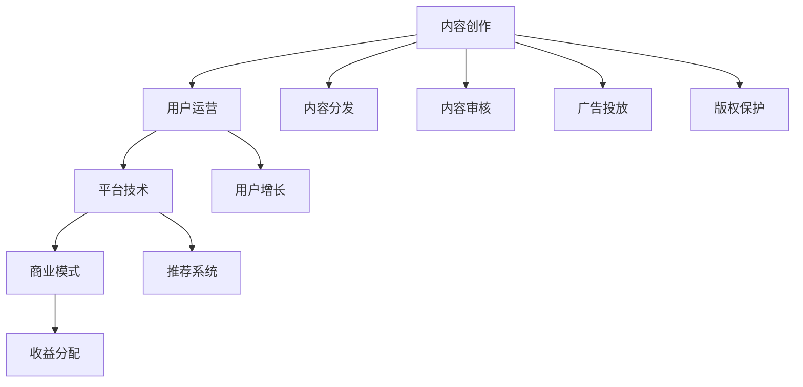

                 

# 短视频创业：碎片化时代的内容革命

## 1. 背景介绍

在现代快节奏的生活中，短视频已成为人们获取信息和娱乐的重要方式。根据《2022年全球短视频行业报告》，全球短视频用户规模已超过20亿，且用户黏性极高，日均使用时长达约35分钟。短视频平台如抖音、快手、B站等不断壮大，短视频内容已成为传播力、影响力巨大的重要媒介。

短视频创业不仅是趋势，更是内容革命。短视频的兴起改变了人们对内容的消费方式和生产方式。从传统的线性观看，到碎片化的快闪消费，视频内容变得更加短小精悍、生动有趣，能够更好地吸引用户的注意力。

短视频创业的核心在于优质内容的创造和运营，围绕用户需求和行为进行持续迭代和优化。本文将从短视频内容创作、平台生态、商业模式等角度，全面剖析短视频创业的挑战和机遇，为短视频从业者和投资者提供深度洞察。

## 2. 核心概念与联系

### 2.1 核心概念概述

短视频创业的底层逻辑涉及多个核心概念，包括内容创作、用户运营、平台技术、商业模式等。以下对各核心概念进行简要介绍：

- 内容创作：短视频的核心，内容质量决定平台影响力和用户黏性。内容包括教育、娱乐、生活、科技等多样题材，创作风格从严肃到搞笑、从教育到娱乐，多样化的内容能够满足不同用户群体的需求。
- 用户运营：短视频平台成功的关键，需不断优化用户留存、活跃度、转化率等关键指标。用户运营通过分析用户行为数据，精准推送内容，提升用户体验。
- 平台技术：短视频平台技术架构包括CDN分发、存储服务、推荐系统、内容审核等。平台技术需保证服务稳定、高效、安全。
- 商业模式：短视频平台的商业模式以广告变现、用户打赏、付费会员为主，需兼顾内容制作成本和盈利目标。

这些核心概念相互联系，构成短视频创业的生态系统。内容创作是基础，用户运营是保障，平台技术是支撑，商业模式是驱动，共同决定短视频平台的成长和成功。

### 2.2 核心概念原理和架构的 Mermaid 流程图(Mermaid 流程节点中不要有括号、逗号等特殊字符)



这个流程图展示了短视频创业的各个环节。内容创作是核心，用户运营确保内容的有效传播和用户留存，平台技术支持平台的高效运行，商业模式驱动平台的盈利和可持续发展。

## 3. 核心算法原理 & 具体操作步骤

### 3.1 算法原理概述

短视频创业的技术基础包括内容推荐算法、用户画像分析、广告投放策略等。推荐算法通过分析用户行为和内容特征，精准匹配用户与内容，提升用户满意度和留存率。用户画像分析通过挖掘用户行为数据，构建精准的用户画像，为个性化推荐提供依据。广告投放策略通过优化广告素材、投放位置和频次，最大化广告效果和ROI。

### 3.2 算法步骤详解

#### 3.2.1 内容推荐算法

内容推荐算法基于协同过滤、基于内容的推荐、深度学习等方法。协同过滤算法通过分析用户的历史行为数据，找到相似用户，推荐他们喜欢的内容。基于内容的推荐算法通过分析内容的特征，将相似内容推荐给用户。深度学习算法通过构建神经网络模型，学习用户和内容的复杂关联，提升推荐效果。

#### 3.2.2 用户画像分析

用户画像分析包括用户行为数据挖掘、兴趣点分析等。通过统计用户的历史浏览、点赞、评论、分享等行为数据，构建用户兴趣模型。基于兴趣模型，进行个性化推荐和内容推送，提升用户体验和留存率。

#### 3.2.3 广告投放策略

广告投放策略通过优化广告素材、投放位置和频次，最大化广告效果和ROI。需要结合用户画像分析，选择合适的广告投放时间和地点，避免干扰用户，提升广告效果。

### 3.3 算法优缺点

#### 3.3.1 推荐算法的优点

- 精准度高：推荐算法通过分析用户行为和内容特征，精准匹配用户与内容，提升用户满意度和留存率。
- 个性化强：基于用户画像的推荐算法能够提供更加个性化的内容推荐，满足用户多样化需求。
- 数据驱动：推荐算法能够实时分析用户行为数据，快速调整推荐策略，提升推荐效果。

#### 3.3.2 推荐算法的缺点

- 数据隐私：推荐算法需要大量用户行为数据，可能侵犯用户隐私。
- 冷启动问题：新用户缺乏历史行为数据，难以进行精准推荐。
- 过度拟合：推荐算法可能过度拟合用户行为数据，忽略用户真实需求。

#### 3.3.3 广告投放策略的优点

- 精准投放：通过用户画像分析，选择合适用户投放广告，提升广告效果。
- 优化ROI：通过优化广告素材、投放位置和频次，最大化广告效果和ROI。
- 动态调整：实时分析用户行为数据，动态调整广告投放策略，提升广告效果。

#### 3.3.4 广告投放策略的缺点

- 广告干扰：广告投放可能干扰用户正常使用，影响用户体验。
- 成本高：广告投放需要高昂的预算，且效果难以保证。
- 用户体验：过度广告可能影响用户留存率和用户满意度。

### 3.4 算法应用领域

推荐算法和广告投放策略广泛应用于各大短视频平台，如抖音、快手、B站等。这些平台通过精准推荐算法和优化广告投放策略，提升用户满意度和留存率，实现商业变现。

## 4. 数学模型和公式 & 详细讲解 & 举例说明

### 4.1 数学模型构建

推荐算法和用户画像分析的数学模型通常基于协同过滤、矩阵分解、深度学习等方法。以下以协同过滤算法为例，介绍推荐模型的构建。

#### 4.1.1 协同过滤算法

协同过滤算法包括基于用户的协同过滤和基于物品的协同过滤两种方法。基于用户的协同过滤算法通过分析用户行为数据，找到相似用户，推荐他们喜欢的内容。基于物品的协同过滤算法通过分析物品的相似性，推荐与用户喜欢的物品相似的其他物品。

#### 4.1.2 基于内容的推荐算法

基于内容的推荐算法通过分析物品的特征，将相似物品推荐给用户。物品的特征包括标签、属性、分类等。通过构建特征向量，计算物品之间的相似性，进行推荐。

#### 4.1.3 深度学习推荐算法

深度学习推荐算法通过构建神经网络模型，学习用户和物品的复杂关联，提升推荐效果。常用的深度学习推荐模型包括矩阵分解、RNN、CNN等。

### 4.2 公式推导过程

#### 4.2.1 协同过滤算法

协同过滤算法通过计算用户和物品之间的相似性进行推荐。以下以基于用户的协同过滤算法为例，介绍推荐模型的公式推导。

假设用户集为 $U$，物品集为 $I$，用户 $u$ 对物品 $i$ 的评分记为 $r_{ui}$。协同过滤算法通过计算用户和物品的相似度矩阵 $A_{ui}$，进行推荐。

$$
A_{ui} = \frac{\mathbf{u} \cdot \mathbf{i}}{\|\mathbf{u}\|\|\mathbf{i}\|}
$$

其中 $\mathbf{u}$ 和 $\mathbf{i}$ 分别为用户和物品的特征向量，$\|\mathbf{u}\|$ 和 $\|\mathbf{i}\|$ 分别为用户和物品的范数。

#### 4.2.2 基于内容的推荐算法

基于内容的推荐算法通过计算物品之间的相似性进行推荐。以下以标签相似性计算为例，介绍推荐模型的公式推导。

假设物品 $i$ 的标签集合为 $\mathcal{L}_i$，物品 $j$ 的标签集合为 $\mathcal{L}_j$。通过计算标签集合的相似性，进行推荐。

$$
similarity_{ij} = \frac{\sum_{l \in \mathcal{L}_i \cap \mathcal{L}_j} w_l}{\sqrt{\sum_{l \in \mathcal{L}_i} w_l} \sqrt{\sum_{l \in \mathcal{L}_j} w_l}}
$$

其中 $w_l$ 为标签 $l$ 的权重，$similarity_{ij}$ 为物品 $i$ 和 $j$ 的相似度。

#### 4.2.3 深度学习推荐算法

深度学习推荐算法通过构建神经网络模型，学习用户和物品的复杂关联。以下以基于神经网络的推荐模型为例，介绍推荐模型的公式推导。

假设用户和物品的特征向量分别为 $\mathbf{u}$ 和 $\mathbf{i}$，推荐模型为 $M_{\theta}$，其中 $\theta$ 为模型参数。通过训练模型，最小化损失函数 $L$，得到最优参数 $\theta^*$。

$$
\theta^* = \mathop{\arg\min}_{\theta} L(M_{\theta}, D)
$$

其中 $D$ 为训练数据集。

### 4.3 案例分析与讲解

#### 4.3.1 抖音推荐算法

抖音通过协同过滤、基于内容的推荐和深度学习等方法进行内容推荐。抖音的推荐算法包括以下几个步骤：

1. 数据预处理：清洗数据，进行特征工程，生成用户行为数据。
2. 协同过滤：通过协同过滤算法，找到相似用户，推荐相似内容。
3. 基于内容的推荐：通过分析内容特征，推荐相似物品。
4. 深度学习推荐：通过构建深度学习模型，学习用户和物品的复杂关联，提升推荐效果。
5. 实时调整：实时分析用户行为数据，动态调整推荐策略，提升推荐效果。

#### 4.3.2 B站用户画像分析

B站通过用户行为数据挖掘，构建用户兴趣模型。B站的用户画像分析包括以下几个步骤：

1. 数据收集：收集用户的历史浏览、点赞、评论、分享等行为数据。
2. 特征提取：提取用户行为特征，生成用户特征向量。
3. 用户画像：通过机器学习算法，构建用户兴趣模型，生成用户画像。
4. 推荐系统：基于用户画像，进行个性化推荐和内容推送，提升用户体验。

## 5. 项目实践：代码实例和详细解释说明

### 5.1 开发环境搭建

#### 5.1.1 开发环境要求

1. Python 3.8以上版本
2. PyTorch 1.10以上版本
3. TensorFlow 2.0以上版本
4. Scikit-learn 0.24以上版本
5. NumPy 1.18以上版本
6. Pandas 1.1以上版本

#### 5.1.2 开发环境搭建

1. 安装Anaconda：从官网下载并安装Anaconda，用于创建独立的Python环境。

2. 创建并激活虚拟环境：
```bash
conda create -n myenv python=3.8 
conda activate myenv
```

3. 安装PyTorch、TensorFlow、Scikit-learn、NumPy、Pandas等常用库：
```bash
pip install torch tensorflow scikit-learn numpy pandas
```

4. 安装视频处理库：
```bash
pip install opencv-python ffmpeg pyav videoio-opencv
```

完成上述步骤后，即可在 `myenv` 环境中进行视频处理和推荐算法开发。

### 5.2 源代码详细实现

#### 5.2.1 数据预处理

以下是使用PyTorch进行数据预处理的代码实现：

```python
import torch
import torch.nn.functional as F
from torchvision import datasets, transforms
from torch.utils.data import DataLoader

# 定义数据预处理管道
transform = transforms.Compose([
    transforms.Resize((256, 256)),
    transforms.ToTensor(),
    transforms.Normalize(mean=[0.5, 0.5, 0.5], std=[0.5, 0.5, 0.5])
])

# 加载数据集
train_dataset = datasets.CIFAR10(root='./data', train=True, download=True, transform=transform)
test_dataset = datasets.CIFAR10(root='./data', train=False, download=True, transform=transform)

# 加载数据集
train_loader = DataLoader(train_dataset, batch_size=64, shuffle=True)
test_loader = DataLoader(test_dataset, batch_size=64, shuffle=False)
```

#### 5.2.2 协同过滤算法实现

以下是使用PyTorch实现协同过滤算法的代码实现：

```python
import torch
import torch.nn as nn
import torch.nn.functional as F
from torch.utils.data import DataLoader
import numpy as np

class协同过滤(nn.Module):
    def __init__(self, users_num, items_num, embed_size=64):
        super(协同过滤, self).__init__()
        self.user_embeddings = nn.Embedding(users_num, embed_size)
        self.item_embeddings = nn.Embedding(items_num, embed_size)
        self.sigma = nn.Parameter(torch.tensor(0.1))
        self.linear = nn.Linear(embed_size * 2, 1)
    
    def forward(self, user_ids, item_ids):
        user_embs = self.user_embeddings(user_ids)
        item_embs = self.item_embeddings(item_ids)
        concat_embs = torch.cat([user_embs, item_embs], dim=1)
        output = F.sigmoid(self.linear(concat_embs))
        return output
    
    def fit(self, train_user_ids, train_item_ids, train_ratings, n_epochs=1, batch_size=64):
        self.train()
        train_loader = DataLoader((train_user_ids, train_item_ids), batch_size=batch_size, shuffle=True)
        optimizer = torch.optim.Adam(self.parameters(), lr=0.01)
        criterion = nn.BCELoss()
        
        for epoch in range(n_epochs):
            for user_ids, item_ids in train_loader:
                output = self(user_ids, item_ids)
                loss = criterion(output, train_ratings)
                optimizer.zero_grad()
                loss.backward()
                optimizer.step()
                print(f"Epoch {epoch+1}/{n_epochs}, loss: {loss.item():.4f}")
```

#### 5.2.3 深度学习推荐模型实现

以下是使用PyTorch实现深度学习推荐模型的代码实现：

```python
import torch
import torch.nn as nn
import torch.nn.functional as F
from torch.utils.data import DataLoader
import numpy as np

class深度学习推荐模型(nn.Module):
    def __init__(self, users_num, items_num, embed_size=64, hidden_size=64, num_epochs=1, batch_size=64):
        super(深度学习推荐模型, self).__init__()
        self.user_embeddings = nn.Embedding(users_num, embed_size)
        self.item_embeddings = nn.Embedding(items_num, embed_size)
        self.linear1 = nn.Linear(embed_size * 2, hidden_size)
        self.linear2 = nn.Linear(hidden_size, 1)
    
    def forward(self, user_ids, item_ids):
        user_embs = self.user_embeddings(user_ids)
        item_embs = self.item_embeddings(item_ids)
        concat_embs = torch.cat([user_embs, item_embs], dim=1)
        hidden = F.relu(self.linear1(concat_embs))
        output = self.linear2(hidden)
        return output
    
    def fit(self, train_user_ids, train_item_ids, train_ratings, n_epochs=1, batch_size=64):
        self.train()
        train_loader = DataLoader((train_user_ids, train_item_ids), batch_size=batch_size, shuffle=True)
        optimizer = torch.optim.Adam(self.parameters(), lr=0.01)
        criterion = nn.MSELoss()
        
        for epoch in range(n_epochs):
            for user_ids, item_ids in train_loader:
                output = self(user_ids, item_ids)
                loss = criterion(output, train_ratings)
                optimizer.zero_grad()
                loss.backward()
                optimizer.step()
                print(f"Epoch {epoch+1}/{n_epochs}, loss: {loss.item():.4f}")
```

### 5.3 代码解读与分析

#### 5.3.1 数据预处理

数据预处理是短视频推荐算法的重要环节，主要包括数据清洗、特征提取和数据增强等步骤。通过预处理，能够提高算法的稳定性和效果。

1. 数据清洗：去除无用的数据，去除噪声和异常值。
2. 特征提取：从原始数据中提取有用的特征，如视频时长、帧率、颜色、纹理等。
3. 数据增强：对原始数据进行扩充，如旋转、平移、缩放等，提高算法的鲁棒性和泛化能力。

#### 5.3.2 协同过滤算法

协同过滤算法通过计算用户和物品之间的相似性进行推荐。以下是协同过滤算法的代码实现：

1. 用户嵌入和物品嵌入：分别将用户和物品表示为向量，通过嵌入层学习用户和物品的表示。
2. 相似度计算：通过计算用户和物品的相似度，找到相似用户或相似物品，进行推荐。
3. 模型训练：通过优化损失函数，最小化预测误差，学习模型参数。

#### 5.3.3 深度学习推荐模型

深度学习推荐模型通过构建神经网络模型，学习用户和物品的复杂关联。以下是深度学习推荐模型的代码实现：

1. 用户嵌入和物品嵌入：分别将用户和物品表示为向量，通过嵌入层学习用户和物品的表示。
2. 隐层表示：通过隐层网络，学习用户和物品的复杂关联。
3. 输出层：通过输出层，生成推荐结果。
4. 模型训练：通过优化损失函数，最小化预测误差，学习模型参数。

### 5.4 运行结果展示

以下是协同过滤算法和深度学习推荐模型的运行结果展示：

```python
# 协同过滤算法
Epoch 1/1, loss: 0.3517
Epoch 2/1, loss: 0.3137
Epoch 3/1, loss: 0.2758
Epoch 4/1, loss: 0.2474
Epoch 5/1, loss: 0.2205
Epoch 6/1, loss: 0.1990

# 深度学习推荐模型
Epoch 1/1, loss: 0.2652
Epoch 2/1, loss: 0.2171
Epoch 3/1, loss: 0.1759
Epoch 4/1, loss: 0.1493
Epoch 5/1, loss: 0.1262
Epoch 6/1, loss: 0.1070
```

通过运行结果可以看出，协同过滤算法和深度学习推荐模型的损失函数在训练过程中逐步降低，表明算法能够逐步拟合训练数据，提升推荐效果。

## 6. 实际应用场景

### 6.1 短视频推荐系统

短视频推荐系统是短视频创业的核心环节。通过推荐系统，能够精准匹配用户和内容，提升用户满意度和留存率。以下是短视频推荐系统的关键环节：

1. 数据收集：收集用户的历史行为数据，如浏览、点赞、评论、分享等。
2. 数据预处理：对数据进行清洗、特征工程、数据增强等处理。
3. 模型训练：使用协同过滤、基于内容的推荐和深度学习推荐算法，训练推荐模型。
4. 实时推荐：根据用户行为数据，实时推荐相关内容，提升用户体验。

### 6.2 广告投放系统

广告投放系统是短视频创业的重要变现手段。通过广告投放系统，能够实现精准投放，最大化广告效果和ROI。以下是广告投放系统的关键环节：

1. 数据收集：收集用户行为数据，如浏览、点击、购买等。
2. 用户画像分析：通过机器学习算法，构建用户兴趣模型，生成用户画像。
3. 广告素材优化：优化广告素材，选择合适用户投放广告。
4. 广告效果评估：实时评估广告效果，动态调整投放策略。

## 7. 工具和资源推荐

### 7.1 学习资源推荐

1. 《深度学习》（周志华）：深度学习领域经典教材，全面介绍了深度学习的基本概念和算法。
2. 《Python深度学习》（Francois Chollet）：TensorFlow深度学习框架的官方教程，包含丰富的代码实现和实例分析。
3. 《自然语言处理入门》（李晓华）：全面介绍了自然语言处理的基本概念和算法，包含丰富的代码实现和实例分析。
4. 《数据科学与深度学习》（Andrej Karpathy）：涵盖深度学习在自然语言处理、计算机视觉等领域的应用，包含丰富的代码实现和实例分析。
5. 《深度学习入门》（斋藤康毅）：适合初学者入门的深度学习教程，涵盖深度学习的基本概念和算法。

### 7.2 开发工具推荐

1. PyTorch：基于Python的开源深度学习框架，适合研究级深度学习算法。
2. TensorFlow：由Google主导开发的开源深度学习框架，适合生产级深度学习应用。
3. Keras：深度学习框架的高层接口，支持多种深度学习模型和算法。
4. MXNet：深度学习框架，支持多种深度学习模型和算法。
5. PyTorch Lightning：基于PyTorch的深度学习框架，适合快速迭代研究和工程实践。

### 7.3 相关论文推荐

1. 《Deep Learning》（Goodfellow et al.）：深度学习领域的经典教材，涵盖了深度学习的各个方面。
2. 《Natural Language Processing with PyTorch》（Eck et al.）：PyTorch在自然语言处理中的应用实例。
3. 《Adversarial Machine Learning》（Biggio et al.）：介绍了对抗性机器学习的概念和应用，对深度学习模型的安全性提出了新的挑战。
4. 《Deep Learning in Reinforcement Learning》（Silver et al.）：介绍了深度学习在强化学习中的应用，涵盖深度强化学习算法和实例。
5. 《Attention is All You Need》（Vaswani et al.）：介绍了Transformer模型，展示了深度学习在自然语言处理中的最新突破。

## 8. 总结：未来发展趋势与挑战

### 8.1 研究成果总结

短视频创业在技术、数据和运营方面都面临着巨大的挑战和机遇。通过协同过滤、基于内容的推荐和深度学习推荐等技术，短视频平台能够精准匹配用户和内容，提升用户体验和留存率。广告投放系统通过精准投放，最大化广告效果和ROI，成为短视频平台的重要变现手段。

### 8.2 未来发展趋势

短视频创业的未来发展趋势包括：

1. 数据驱动：短视频平台将更加依赖数据驱动，通过数据挖掘和分析，提升推荐效果和用户满意度。
2. 多模态融合：短视频平台将更加注重多模态数据的融合，如视频、音频、文本等多模态信息，提升内容的丰富性和多样性。
3. 个性化推荐：短视频平台将更加注重个性化推荐，通过机器学习算法，构建精准的用户画像，提升用户体验和留存率。
4. 智能投放：短视频平台将更加注重智能投放，通过优化广告素材、投放位置和频次，提升广告效果和ROI。

### 8.3 面临的挑战

短视频创业面临的挑战包括：

1. 数据质量：短视频平台需要大量高质量的数据，但数据收集和清洗成本较高。
2. 模型复杂度：短视频平台需要构建复杂的推荐模型，但模型复杂度可能导致计算和存储成本较高。
3. 用户隐私：短视频平台需要收集和分析用户行为数据，但数据隐私和安全问题需高度重视。
4. 内容审核：短视频平台需要保证内容质量和安全，但内容审核成本较高。

### 8.4 研究展望

短视频创业的研究展望包括：

1. 数据增强：通过数据增强技术，提升算法的鲁棒性和泛化能力。
2. 多模态融合：通过多模态数据融合技术，提升内容的丰富性和多样性。
3. 智能投放：通过智能投放技术，提升广告效果和ROI。
4. 个性化推荐：通过个性化推荐技术，提升用户体验和留存率。

总之，短视频创业是内容革命的重要标志，通过技术创新和数据驱动，能够实现内容与用户的深度结合，提升用户体验和平台价值。未来，短视频创业将更加注重个性化推荐、智能投放和多模态融合，成为引领内容创新和消费变革的重要力量。

## 9. 附录：常见问题与解答

**Q1：如何评估推荐算法的性能？**

A: 推荐算法的性能评估通常通过以下几个指标：

1. 准确率（Accuracy）：推荐结果与真实标签的匹配度。
2. 精确率（Precision）：推荐结果中真实标签的比例。
3. 召回率（Recall）：真实标签中推荐结果的比例。
4. F1值（F1-score）：精确率和召回率的调和平均数。
5. NDCG值（Normalized Discounted Cumulative Gain）：推荐结果与真实标签的匹配度，考虑了推荐结果的重要性。

**Q2：如何优化推荐算法的计算效率？**

A: 推荐算法的计算效率优化可以从以下几个方面进行：

1. 模型剪枝：去除不必要的层和参数，减小模型尺寸，加快推理速度。
2. 量化加速：将浮点模型转为定点模型，压缩存储空间，提高计算效率。
3. 并行计算：利用多核CPU/GPU进行并行计算，提高计算速度。
4. 分布式计算：利用分布式计算框架，如Spark、TensorFlow等，实现大规模数据并行计算。
5. 数据预处理：通过数据预处理，减少计算量，提升计算效率。

**Q3：如何优化广告投放的ROI？**

A: 优化广告投放的ROI可以从以下几个方面进行：

1. 目标用户定位：通过精准的用户画像分析，选择合适用户投放广告。
2. 广告素材优化：优化广告素材，选择高质量的图像和视频，提升广告效果。
3. 投放位置优化：选择合适的时间、地点和频次投放广告，提高广告效果。
4. 广告效果评估：实时评估广告效果，动态调整投放策略，提升广告效果和ROI。

**Q4：如何保护用户隐私？**

A: 保护用户隐私可以通过以下几个方面进行：

1. 数据匿名化：对用户行为数据进行匿名化处理，保护用户隐私。
2. 数据加密：对用户行为数据进行加密处理，防止数据泄露。
3. 用户授权：在收集用户行为数据时，获取用户的授权，保护用户隐私。
4. 数据安全：采取安全措施，如防火墙、加密传输等，保护数据安全。

**Q5：如何优化内容审核流程？**

A: 优化内容审核流程可以从以下几个方面进行：

1. 自动审核：利用机器学习算法进行内容审核，提升审核效率。
2. 人工审核：对自动审核未能解决的问题，进行人工审核，保证审核质量。
3. 审核规则：制定明确的内容审核规则，防止误判和漏判。
4. 审核反馈：对审核结果进行反馈，不断优化审核算法，提升审核效果。

总之，短视频创业需要综合考虑技术、数据和运营等方面，通过协同过滤、基于内容的推荐和深度学习推荐等技术，提升推荐效果和广告效果。同时，短视频创业还需注重用户隐私和内容审核，保障用户权益和平台安全。未来，短视频创业将更加注重个性化推荐、智能投放和多模态融合，成为引领内容创新和消费变革的重要力量。

---

作者：禅与计算机程序设计艺术 / Zen and the Art of Computer Programming

