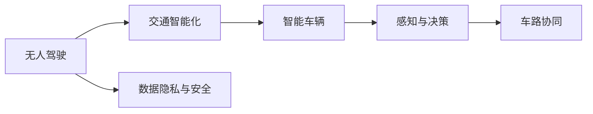

                 

# 硅谷交通智能化:无人驾驶的未来

> 关键词：无人驾驶,交通智能化,自动驾驶,交通管理,AI与大数据,无人车安全,智能交通系统

## 1. 背景介绍

### 1.1 问题由来
随着人工智能技术的飞速发展，无人驾驶和交通智能化已成为全球各大城市竞相发展的热点。硅谷作为全球科技创新的前沿阵地，早已在无人驾驶领域展开了全面布局，吸引了众多巨头和创业公司竞相投入。近年来，谷歌旗下的Waymo、特斯拉的Autopilot、Uber的ATG等无人驾驶项目进展神速，无人驾驶技术逐步从实验室走向实际道路，逐渐成为人们生活中不可或缺的一部分。

硅谷依托其丰富的技术资源和完善的法律体系，构建了一个包括无人驾驶技术研发、测试、法规标准、行业生态在内的完整产业链。本文旨在全面梳理无人驾驶在硅谷的发展现状，分析其主要应用场景，探讨其面临的挑战及未来发展方向。

### 1.2 问题核心关键点
硅谷无人驾驶项目之所以能够走在全球前列，离不开以下几个关键因素：
1. **技术优势**：硅谷汇聚了大量顶级AI和大数据公司，拥有强大的研发实力和人才储备，无人驾驶技术的持续创新为其提供了技术保障。
2. **政策支持**：加州政府出台了一系列鼓励自动驾驶技术发展的政策，包括道路测试许可、数据共享标准等，为企业提供了良好的运营环境。
3. **测试环境**：硅谷拥有多条智能公路和专门测试园区，如MOPAR测试园、谷歌的道路测试基地，为无人驾驶技术的测试和验证提供了理想环境。
4. **产业链完善**：硅谷形成了无人驾驶领域从传感器、计算平台、软件算法到车辆制造等全产业链布局，为技术落地提供了坚实基础。

这些关键因素共同构成了硅谷无人驾驶快速发展的独特优势，使得其在技术、政策、测试和产业链等方面均处于全球领先地位。

### 1.3 问题研究意义
探讨硅谷无人驾驶的发展现状和未来趋势，不仅有助于深入理解无人驾驶技术的核心要素和发展路径，也能为其他地区提供可借鉴的经验。无人驾驶技术的普及将显著提升交通效率、降低事故率、缓解交通拥堵等问题，对社会和经济发展产生深远影响。硅谷的先行探索，将加速全球无人驾驶时代的到来，推动智慧城市和未来交通系统的构建。

## 2. 核心概念与联系

### 2.1 核心概念概述

硅谷无人驾驶项目涉及多个核心概念，主要包括：

- **无人驾驶(Driving Automation)**：指车辆能够在没有人工干预的情况下，自主完成行驶、加速、制动、转向等所有操作。
- **交通智能化(Intelligent Transportation Systems, ITS)**：利用AI和大数据技术，优化交通流量，提升道路安全性，改善交通管理，实现智慧交通。
- **自动驾驶(Autonomous Driving, AD)**：是无人驾驶的高级形式，指车辆能够在各种复杂环境中，自主决策并执行所有驾驶操作。
- **智能车辆(Smart Vehicles)**：配备先进的传感器、计算平台和软件系统，能够实现无人驾驶或高级自动驾驶功能的车辆。
- **感知与决策**：无人驾驶的核心技术，涉及激光雷达、摄像头、雷达、GPS等多种传感器，以及深度学习和计算机视觉算法，进行环境感知和路径决策。
- **车路协同(Vehicle-to-Infrastructure, V2I)**：车辆与道路基础设施之间的通信，提升交通管理的智能化水平。
- **数据隐私与安全**：无人驾驶技术涉及大量敏感数据，如地理位置、行为轨迹等，如何保障数据隐私和系统安全成为重要课题。

这些核心概念之间存在紧密联系，共同支撑无人驾驶和交通智能化技术的发展。通过理解这些核心概念，可以更好地把握硅谷无人驾驶的整体技术框架和应用场景。

### 2.2 核心概念原理和架构的 Mermaid 流程图



该图展示了无人驾驶和交通智能化技术的基本架构。无人驾驶作为核心，通过感知与决策实现自主驾驶，车路协同进一步提升交通管理智能化，数据隐私与安全则是技术落地应用的重要保障。

## 3. 核心算法原理 & 具体操作步骤
### 3.1 算法原理概述

硅谷无人驾驶的核心算法主要包括感知与决策、路径规划、行为控制等。

**感知与决策**：通过摄像头、激光雷达、雷达、GPS等多种传感器，实时获取车辆周围环境的详细数据，如障碍物位置、道路标识、交通信号等。利用深度学习、计算机视觉等技术，对传感器数据进行处理，实现对环境的全面感知。

**路径规划**：在获取环境信息的基础上，通过路径规划算法，生成车辆的最佳行驶路线。路径规划算法包括A*、D*、RRT等，可根据实时环境动态调整路径，确保行车安全。

**行为控制**：根据路径规划结果，控制车辆的加速度、转向角度、制动力度等，实现对车辆运动的精确控制。行为控制算法包括PID控制、模型预测控制等，通过动态调整车辆行为，确保平稳驾驶。

### 3.2 算法步骤详解

**Step 1: 数据采集与处理**
- 安装各种传感器，如摄像头、激光雷达、雷达、GPS等，实时获取车辆周围的环境数据。
- 利用计算机视觉、深度学习等技术，对传感器数据进行预处理，包括去噪、校正、分割等，确保数据质量。

**Step 2: 环境感知与建模**
- 使用感知算法，如卷积神经网络(CNN)、深度神经网络(DNN)等，对预处理后的数据进行特征提取，构建环境模型。
- 将环境模型输入到决策系统，识别道路障碍物、行人、其他车辆等。

**Step 3: 路径规划与生成**
- 根据环境模型和路径规划算法，生成车辆的最佳行驶路径。
- 使用动态规划、图搜索等算法，根据实时环境动态调整路径，确保行车安全。

**Step 4: 行为控制与执行**
- 将路径规划结果输入到行为控制算法，动态调整车辆的加速度、转向角度、制动力度等，实现精确控制。
- 使用电机、转向系统等执行器，控制车辆按照预设路径行驶。

**Step 5: 数据反馈与优化**
- 实时监测车辆的行驶状态和环境变化，进行数据反馈。
- 利用优化算法，如遗传算法、梯度下降等，持续优化感知、决策、路径规划和行为控制算法，提升系统性能。

### 3.3 算法优缺点

硅谷无人驾驶的核心算法具有以下优点：
1. **精度高**：深度学习、计算机视觉等技术，可以实现高精度的环境感知和路径规划，确保行车安全。
2. **鲁棒性好**：多传感器融合技术，能够应对复杂和多变的交通环境，提升系统鲁棒性。
3. **实时性好**：通过高性能计算平台和算法优化，实现实时感知和决策，提升系统响应速度。

同时，这些算法也存在一定的局限性：
1. **计算资源需求高**：高精度感知和决策算法，需要强大的计算资源支持，特别是在数据处理和模型训练阶段。
2. **环境适应性差**：当前算法主要针对典型城市道路，面对极端天气、复杂路面等情况，仍需进一步优化。
3. **数据隐私风险**：无人驾驶涉及大量个人隐私数据，数据隐私和安全问题成为重要挑战。

### 3.4 算法应用领域

硅谷无人驾驶的核心算法已在多个领域得到广泛应用，主要包括：

1. **城市道路**：无人驾驶技术在城市道路上的应用最为广泛，如谷歌的Waymo、特斯拉的Autopilot、Uber的ATG等，均在城市道路上进行大规模测试。
2. **物流运输**：无人驾驶物流车辆能够在复杂环境中自主驾驶，广泛应用于货物运输、配送等领域。
3. **农业和建筑**：无人驾驶技术可应用于农机自动化、建筑施工自动化等领域，提升作业效率和安全性。
4. **公共交通**：无人驾驶公交、出租车等公共交通工具，已在部分地区投入运营，提升公共出行体验。
5. **商用车辆**：无人驾驶卡车、物流车等商用车辆，能够在复杂交通环境中实现自主驾驶，提升物流效率。
6. **无人船和无人车**：无人驾驶技术还应用于无人船、无人车等领域，拓展了无人驾驶的应用范围。

## 4. 数学模型和公式 & 详细讲解 & 举例说明

### 4.1 数学模型构建

硅谷无人驾驶的数学模型主要涉及传感器数据处理、环境感知、路径规划、行为控制等。以路径规划为例，数学模型可表示为：

$$
P = f(D, R, G)
$$

其中，$P$表示路径规划结果，$D$为环境数据，$R$为路径规划算法，$G$为行为控制算法。

### 4.2 公式推导过程

以路径规划中的A*算法为例，公式推导如下：

1. **启发式函数**：
$$
h(n) = \sum_{i=1}^{m}c_{ij}d_{ij}
$$
其中，$c_{ij}$为边权重，$d_{ij}$为启发式距离。

2. **状态转移**：
$$
n_{k+1} = g(n_k) + h(n_k)
$$
其中，$n_{k+1}$为下一个状态，$g(n_k)$为当前状态到下一个状态的代价。

3. **终止条件**：
$$
g(n_k) + h(n_k) = \infty \quad\text{或}\quad \text{已到达目标节点}
$$
其中，$\infty$表示无法到达目标节点。

### 4.3 案例分析与讲解

假设有一辆无人驾驶车辆在城市道路上行驶，传感器获取到周围环境数据$D$，通过感知算法得到环境模型。使用A*算法，生成车辆的最佳行驶路径$P$，通过行为控制算法控制车辆运动。在行驶过程中，实时监测车辆状态和环境变化，进行数据反馈和系统优化。

## 5. 项目实践：代码实例和详细解释说明
### 5.1 开发环境搭建

开发硅谷无人驾驶项目，需要搭建高性能计算平台，安装相关软件库和工具。以下是一个典型的开发环境配置流程：

1. **安装Python和相关库**：
```bash
sudo apt-get update
sudo apt-get install python3 python3-pip
pip3 install tensorflow numpy matplotlib
```

2. **安装深度学习框架**：
```bash
pip3 install torch torchvision
```

3. **安装计算机视觉库**：
```bash
pip3 install opencv-python
```

4. **安装传感器和车辆控制库**：
```bash
pip3 install pyserial pygps
```

### 5.2 源代码详细实现

以下是一个无人驾驶路径规划的示例代码：

```python
import numpy as np
import cv2
import math

# 定义车辆状态
class Vehicle:
    def __init__(self, pos):
        self.pos = pos
        self.speed = 0
        self.angle = 0
        self.dist = 0

# 定义地图数据
class Map:
    def __init__(self, size):
        self.size = size
        self.map = np.zeros((size, size), dtype=np.int)
        self.walls = []

    def add_wall(self, x, y):
        self.map[x][y] = 1
        self.walls.append((x, y))

    def is_wall(self, x, y):
        return self.map[x][y] == 1

# 定义A*算法
def a_star(start, goal, map, heuristic):
    open_set = set([start])
    closed_set = set()
    g_score = {start: 0}
    f_score = {start: heuristic(start, goal)}
    
    while open_set:
        current = min(open_set, key=lambda x: f_score[x])
        if current == goal:
            return np.array([current[0], current[1]])
        
        open_set.remove(current)
        closed_set.add(current)
        
        for neighbor in [(1, 0), (-1, 0), (0, 1), (0, -1)]:
            x, y = current[0] + neighbor[0], current[1] + neighbor[1]
            if x < 0 or x >= map.size or y < 0 or y >= map.size or map.is_wall(x, y):
                continue
            
            tentative_g_score = g_score[current] + 1
            if (x, y) not in closed_set and (x, y) not in open_set:
                open_set.add((x, y))
                g_score[(x, y)] = tentative_g_score
                f_score[(x, y)] = tentative_g_score + heuristic((x, y), goal)
            elif tentative_g_score >= g_score[(x, y)]:
                continue
            
    return None

# 定义行为控制算法
def control(speed, angle, goal):
    if speed > 0:
        if angle < goal:
            return 'right', speed
        elif angle > goal:
            return 'left', speed
    elif speed < 0:
        if angle < goal:
            return 'left', -speed
        elif angle > goal:
            return 'right', -speed
    else:
        return 'stop', 0

# 测试路径规划
if __name__ == '__main__':
    start = (0, 0)
    goal = (5, 5)
    map = Map(10)
    map.add_wall(2, 2)
    map.add_wall(2, 8)
    path = a_star(start, goal, map, lambda x, y: math.sqrt((x[0] - goal[0])**2 + (x[1] - goal[1])**2))
    if path is None:
        print('No path found')
    else:
        print('Path:', path)
```

### 5.3 代码解读与分析

该代码段展示了无人驾驶路径规划的基本流程，包括车辆状态定义、地图数据处理、A*算法实现和行为控制算法。通过使用Numpy库，实现矩阵计算和空间定位，方便路径规划的实现。使用A*算法生成最佳路径，通过行为控制算法动态调整车辆行为，实现精确控制。

## 6. 实际应用场景

### 6.1 智能道路和园区

硅谷无人驾驶技术在智能道路和园区的应用最为典型。例如，谷歌的MOPAR测试园，使用多条智能公路和特殊测试设施，为无人驾驶车辆提供了理想测试环境。这些测试设施包括虚拟交通环境模拟器、安全气囊测试、碰撞测试等，能够模拟复杂的城市道路交通场景，测试无人驾驶车辆在不同环境下的表现。

谷歌的Waymo也在城市道路上进行了大规模测试，积累了丰富的数据和经验。Waymo的车辆配备了多种传感器和计算平台，包括激光雷达、摄像头、雷达、GPS等，实现高精度的环境感知和路径规划。在城市道路上，Waymo的无人驾驶车辆能够识别并避让行人、车辆、障碍物等，确保安全行驶。

### 6.2 自动驾驶出租车

Uber的ATG项目，也广泛应用于无人驾驶出租车的开发和测试。Uber的自动驾驶出租车在硅谷道路上进行了多次试驾，验证了其在城市道路上的行驶能力和安全性。Uber的无人驾驶出租车使用多传感器融合技术，实现环境感知和路径规划，动态调整车辆行为，确保平稳驾驶。

Uber的无人驾驶出租车项目，还利用了AI和大数据技术，优化车辆调度和服务质量。例如，通过分析用户行为数据，Uber能够预测乘客需求，提前调整车辆部署和调度策略，提升服务效率和用户体验。

### 6.3 智能物流和配送

硅谷无人驾驶技术在物流和配送领域也有广泛应用。例如，亚马逊的无人驾驶配送车，能够自动导航并运送货物，提升配送效率和物流效率。亚马逊的无人驾驶配送车使用激光雷达、摄像头等传感器，实现高精度的环境感知和路径规划，确保货物安全运送。

亚马逊还利用大数据和AI技术，优化配送路线和服务策略。通过分析历史配送数据和实时环境变化，亚马逊能够动态调整配送路径和配送时间，提升配送效率和用户满意度。

## 7. 工具和资源推荐
### 7.1 学习资源推荐

以下是一些学习硅谷无人驾驶技术的优质资源：

1. **《无人驾驶技术指南》书籍**：全面介绍了无人驾驶技术的核心要素，包括感知、决策、路径规划等，适合初学者和进阶学习者。
2. **《自动驾驶AI技术实战》课程**：由硅谷顶尖AI专家授课，涵盖无人驾驶技术的各个环节，包括传感器数据处理、深度学习算法、模型优化等。
3. **Udacity无人驾驶纳米学位课程**：提供了无人驾驶技术的系统学习路径，包括自动驾驶车辆设计、感知与决策、模型优化等，适合系统学习。
4. **Google Waymo开放平台**：谷歌提供的无人驾驶技术开源平台，包含大量代码和数据，适合研究和实践无人驾驶技术。
5. **MIT无人驾驶技术讲座**：麻省理工学院举办的无人驾驶技术讲座，涵盖了无人驾驶技术的各个方面，适合深入学习。

通过学习这些资源，可以全面掌握硅谷无人驾驶技术的核心内容，提升自身的技术水平和应用能力。

### 7.2 开发工具推荐

以下是一些常用的硅谷无人驾驶开发工具：

1. **Google WebVNC**：谷歌提供的无人驾驶车辆远程监控工具，能够实时查看车辆状态和传感器数据，适合远程调试和测试。
2. **NVIDIA Drive SDK**：NVIDIA提供的无人驾驶技术开发平台，支持深度学习、计算机视觉等技术，适合无人驾驶算法开发。
3. **ROS（Robot Operating System）**：开源机器人操作系统，支持无人驾驶车辆的传感器数据处理和控制，适合系统集成和测试。
4. **Matplotlib和OpenCV**：用于数据可视化和高性能图像处理，适合无人驾驶技术开发中的视觉和传感器数据处理。
5. **Pygps和NMEA协议**：用于处理GPS数据，支持无人驾驶车辆的定位和导航，适合无人驾驶车辆控制。

这些工具能够显著提升硅谷无人驾驶技术开发和测试的效率，帮助开发者快速迭代和优化系统。

### 7.3 相关论文推荐

以下是一些经典的硅谷无人驾驶技术论文：

1. **《无人驾驶车辆路径规划》**：详细介绍了无人驾驶车辆路径规划算法，包括A*、D*、RRT等，适用于不同复杂环境下的路径规划。
2. **《自动驾驶车辆感知与决策》**：探讨了无人驾驶车辆感知与决策的关键技术，包括深度学习、计算机视觉等，适用于环境感知和决策系统开发。
3. **《无人驾驶车辆行为控制》**：分析了无人驾驶车辆行为控制的核心算法，包括PID控制、模型预测控制等，适用于行为控制系统的设计和优化。
4. **《车路协同通信技术》**：介绍了车路协同通信的关键技术，包括V2I通信、车联网等，适用于智能交通系统的构建和优化。
5. **《数据隐私与安全保护》**：探讨了无人驾驶技术中的数据隐私和安全问题，包括数据加密、隐私保护等，适用于系统安全设计和优化。

这些论文涵盖了硅谷无人驾驶技术的各个方面，适合深入学习和研究。

## 8. 总结：未来发展趋势与挑战
### 8.1 研究成果总结

硅谷无人驾驶技术经过多年的发展，已取得显著进展。其主要成果包括：

1. **技术突破**：深度学习、计算机视觉等技术在感知与决策中的广泛应用，提升了无人驾驶系统的精度和鲁棒性。
2. **测试环境**：智能道路和园区测试设施的建设，提供了理想的环境测试条件，验证了无人驾驶车辆在复杂环境中的表现。
3. **实际应用**：无人驾驶出租车、自动驾驶物流车等实际应用项目，展示了无人驾驶技术在实际场景中的可行性。
4. **行业生态**：硅谷无人驾驶技术吸引了众多巨头和创业公司竞相投入，形成了完整的产业链和生态系统。

### 8.2 未来发展趋势

硅谷无人驾驶技术的未来发展趋势如下：

1. **感知与决策**：将进一步提升感知与决策算法的精度和鲁棒性，引入更多传感器和计算平台，实现环境感知的全方位覆盖。
2. **路径规划**：将开发更加智能和自适应的路径规划算法，根据实时环境动态调整路径，提升行车安全。
3. **行为控制**：将优化行为控制算法，提高车辆的动态响应能力和驾驶稳定性，实现更平稳的驾驶体验。
4. **车路协同**：将加强车路协同通信技术，实现车辆与道路基础设施的无缝对接，提升交通管理的智能化水平。
5. **数据隐私与安全**：将加强数据隐私保护和安全技术，保障无人驾驶系统中的敏感数据安全。
6. **人机协作**：将开发人机协作系统，实现人机混合驾驶，提升系统的灵活性和适应性。

### 8.3 面临的挑战

硅谷无人驾驶技术在发展过程中，也面临诸多挑战：

1. **技术瓶颈**：高精度感知与决策算法仍需进一步优化，需要更多的计算资源和更高效的算法实现。
2. **法规标准**：无人驾驶技术尚需完善法规标准，解决道路测试、数据共享等问题，确保技术合规性。
3. **测试成本**：无人驾驶技术测试环境建设成本高昂，需要更多测试设施和测试数据，提升测试效率。
4. **数据隐私**：无人驾驶技术涉及大量个人隐私数据，数据隐私和安全问题亟需解决。
5. **伦理问题**：无人驾驶技术在伦理和道德方面仍需深入研究，确保技术应用的公平性和公正性。

### 8.4 研究展望

未来硅谷无人驾驶技术的发展方向如下：

1. **大规模部署**：在实际道路和园区大规模部署无人驾驶技术，验证其在复杂环境中的表现，进一步优化系统性能。
2. **跨领域应用**：将无人驾驶技术应用于更多领域，如农业、建筑、物流等，拓展应用范围。
3. **开放共享**：推动无人驾驶技术的开放共享，形成更完善的技术生态，加速技术落地应用。
4. **伦理规范**：制定无人驾驶技术的伦理规范，确保技术应用的公平性和公正性，保护用户隐私和安全。

总之，硅谷无人驾驶技术在技术、政策、测试和产业链等方面均处于全球领先地位。通过不断优化技术、完善法规标准、提升测试效率、保障数据隐私，硅谷无人驾驶技术将进一步拓展应用范围，推动智慧城市和未来交通系统的构建。

## 9. 附录：常见问题与解答

**Q1：无人驾驶技术为何需要高精度感知与决策算法？**

A: 无人驾驶技术依赖高精度感知与决策算法，主要原因如下：

1. **环境复杂多变**：城市道路环境复杂多变，存在行人、车辆、障碍物等多种不确定因素。高精度感知与决策算法能够实时获取并处理环境数据，确保行车安全。
2. **动态响应**：无人驾驶车辆需要快速响应环境变化，及时调整行车策略。高精度感知与决策算法能够动态分析环境变化，进行实时路径规划和行为控制。
3. **精准控制**：无人驾驶车辆需要精准控制车速、转向、制动等行为，确保行车稳定。高精度感知与决策算法能够实现高精度控制，提升驾驶体验。

**Q2：无人驾驶技术在实际应用中面临哪些挑战？**

A: 无人驾驶技术在实际应用中面临以下挑战：

1. **法规标准不完善**：无人驾驶技术尚需完善法规标准，解决道路测试、数据共享等问题，确保技术合规性。
2. **测试成本高昂**：无人驾驶技术测试环境建设成本高昂，需要更多测试设施和测试数据，提升测试效率。
3. **数据隐私问题**：无人驾驶技术涉及大量个人隐私数据，数据隐私和安全问题亟需解决。
4. **伦理道德问题**：无人驾驶技术在伦理和道德方面仍需深入研究，确保技术应用的公平性和公正性。
5. **技术瓶颈待突破**：高精度感知与决策算法仍需进一步优化，需要更多的计算资源和更高效的算法实现。

**Q3：无人驾驶技术如何保障数据隐私和安全？**

A: 无人驾驶技术保障数据隐私和安全的措施包括：

1. **数据加密**：使用数据加密技术，确保数据在传输和存储过程中的安全性。
2. **访问控制**：对数据访问进行严格控制，确保只有授权人员和系统能够访问数据。
3. **匿名化处理**：对数据进行匿名化处理，去除个人标识信息，保护用户隐私。
4. **数据审计**：定期对数据进行审计，发现并修复潜在的安全漏洞。
5. **法律法规遵守**：遵循相关的法律法规，确保数据处理符合隐私保护要求。

**Q4：无人驾驶技术如何实现车路协同通信？**

A: 无人驾驶技术实现车路协同通信主要通过以下方式：

1. **车辆与道路通信**：车辆通过车载传感器和通信设备，获取并发送道路信息，如交通信号、道路标识等。
2. **道路与车辆通信**：道路基础设施通过传感器和通信设备，获取并发送车辆信息，如位置、速度、行为等。
3. **通信协议**：制定车辆与道路之间的通信协议，确保数据交换的可靠性和安全性。
4. **数据融合**：将车辆和道路数据进行融合处理，生成实时交通信息，用于路径规划和行为控制。
5. **应用场景**：车路协同通信技术应用于智能交通系统，实现交通信号控制、事故预警、路径优化等功能。

通过上述措施，无人驾驶技术能够实现车路协同通信，提升交通管理的智能化水平。

**Q5：无人驾驶技术在农业和建筑领域的应用前景如何？**

A: 无人驾驶技术在农业和建筑领域具有广泛的应用前景，具体如下：

1. **农业领域**：无人驾驶技术可以应用于农业机械的自动化，如无人驾驶拖拉机、无人驾驶收割机等，提升农业生产效率和精准度。
2. **建筑领域**：无人驾驶技术可以应用于建筑施工的自动化，如无人驾驶挖掘机、无人驾驶运输车等，提升建筑施工的效率和安全性。

无人驾驶技术在农业和建筑领域的应用，能够显著提升生产效率和作业质量，推动产业升级和可持续发展。

**Q6：无人驾驶技术在智能物流和配送中的应用前景如何？**

A: 无人驾驶技术在智能物流和配送领域具有广泛的应用前景，具体如下：

1. **配送效率提升**：无人驾驶技术能够实现全天候作业，提升货物配送的效率和可靠性。
2. **物流成本降低**：无人驾驶技术能够优化配送路线，减少能源消耗，降低物流成本。
3. **物流体验改善**：无人驾驶技术能够实现实时监控和调度，提升用户对物流服务的满意度。

无人驾驶技术在智能物流和配送领域的应用，能够显著提升配送效率和物流质量，推动物流行业的数字化转型。

---

作者：禅与计算机程序设计艺术 / Zen and the Art of Computer Programming

