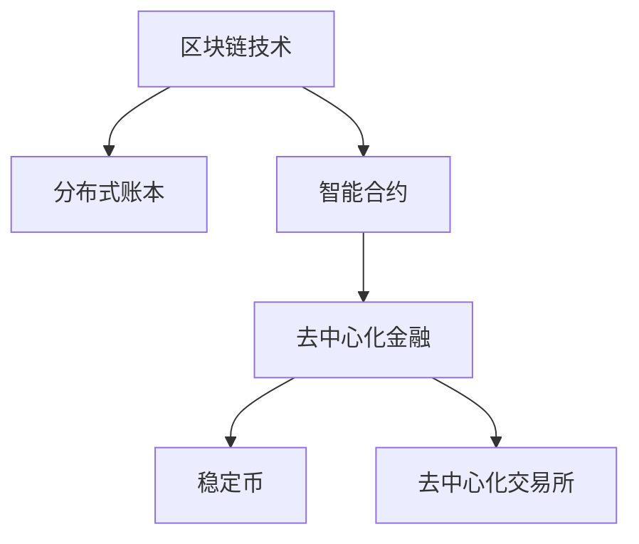

                 

# 硅谷区块链金融:去中心化的金融创新

> 关键词：区块链技术,去中心化金融(DeFi),智能合约,分布式账本,稳定币,去中心化交易所(DEX)

## 1. 背景介绍

### 1.1 问题由来
随着互联网技术的迅猛发展，金融行业正经历着深刻变革。传统的集中式金融体系存在效率低下、透明度不足、信息不对称等问题，越来越多的机构和用户开始探索利用新技术来构建更加高效、公正、透明的新型金融架构。区块链技术以其去中心化、分布式、不可篡改的特性，为这一变革提供了有力的技术支撑。

区块链技术最早由中本聪于2008年提出，并在2009年以比特币的形式成功落地。随后，以太坊等去中心化平台相继推出，推动了智能合约和去中心化金融(DeFi)的兴起。DeFi通过区块链技术，构建了一套无需中心化机构介入的金融生态，包括去中心化交易所(DEX)、稳定币、借贷、保险等各类应用，为用户提供了更为公平、开放、透明的金融服务。

### 1.2 问题核心关键点
DeFi的核心在于将金融服务的各个环节去中心化，通过智能合约自动化处理，实现去中介、高效率、低成本的金融运作。其中，智能合约是DeFi应用的基础，它是一段代码，部署在区块链上，能够自动执行预设条件下的合同条款。分布式账本则是DeFi运作的基础设施，记录了所有交易信息，确保数据透明可信。

DeFi的典型应用包括：
- 去中心化交易所(DEX)：无需中心化机构，通过智能合约撮合交易，用户可以在交易过程中完全掌控自己的资产。
- 稳定币：通过算法或抵押物机制实现对标法定货币的价值稳定，提供更加稳定的交易基础。
- 去中心化借贷：通过区块链技术实现点对点的借贷，提高了资金利用效率，减少了中介成本。
- 去中心化保险：利用智能合约自动化处理理赔流程，降低道德风险和操作成本。

### 1.3 问题研究意义
研究区块链金融技术，对于探索新型金融架构、提升金融服务的普惠性、增强系统的透明性和安全性具有重要意义。DeFi技术的发展，为金融市场的去中心化、公平化、透明化提供了新的可能性，有望推动金融行业的变革，带来更加高效、公正、开放的未来金融体系。

## 2. 核心概念与联系

### 2.1 核心概念概述

为更好地理解DeFi的运作原理和技术架构，本节将介绍几个密切相关的核心概念：

- 区块链技术(Blockchain)：基于分布式账本技术的去中心化网络，记录所有交易和数据，保证不可篡改和透明性。
- 去中心化金融(DeFi)：利用区块链技术，构建一套无需中心化机构介入的金融体系，实现去中介、高效率、低成本的金融运作。
- 智能合约(Smart Contracts)：部署在区块链上的程序代码，能够自动执行预设条件下的合同条款，实现自动化的金融服务。
- 分布式账本(Distributed Ledger)：记录所有交易和数据，保证数据的透明可信和分布式存储。
- 稳定币(Stablecoin)：通过算法或抵押物机制实现对标法定货币的价值稳定，提供更加稳定的交易基础。
- 去中心化交易所(DEX)：无需中心化机构，通过智能合约撮合交易，用户可以在交易过程中完全掌控自己的资产。

这些核心概念之间的逻辑关系可以通过以下Mermaid流程图来展示：



这个流程图展示了大语言模型的核心概念及其之间的关系：

1. 区块链技术是DeFi和智能合约的基础。
2. 智能合约是DeFi应用的核心，通过自动化执行预设合同条款，实现去中介、高效率、低成本的金融运作。
3. 去中心化交易所是DeFi的重要应用之一，用户可以在交易过程中完全掌控自己的资产。
4. 稳定币通过算法或抵押物机制，实现对标法定货币的价值稳定，提供更稳定的交易基础。

这些核心概念共同构成了DeFi的运作框架，使其能够在不依赖中心化机构的情况下，实现高效、公正、透明的金融服务。通过理解这些核心概念，我们可以更好地把握DeFi的运作原理和技术架构。

## 3. 核心算法原理 & 具体操作步骤
### 3.1 算法原理概述

DeFi的核心在于通过智能合约自动化处理金融交易，实现去中介、高效率、低成本的金融运作。其核心思想是：将金融服务的各个环节去中心化，通过区块链技术，构建一套无需中心化机构介入的金融生态。

形式化地，假设区块链网络为 $N$ 个节点，智能合约为 $C$，每个合约包含条件函数 $f$ 和对应的执行函数 $g$，则DeFi的运作过程如下：

1. 节点提交交易请求，并使用私钥进行数字签名。
2. 合约接收交易请求，并检查交易是否满足预设条件。
3. 若满足条件，合约自动执行 $g$ 函数，将交易记录到区块链上。
4. 所有节点实时接收交易信息，保证数据透明可信。

通过智能合约的自动化处理，DeFi实现了无需中心化机构的金融交易，提高了交易的透明度、效率和安全性。DeFi技术已经在DeFi借贷、DeFi保险、DeFi交易所等多个领域得到应用，并取得了显著的成果。

### 3.2 算法步骤详解

DeFi的算法步骤主要包括以下几个关键环节：

**Step 1: 区块链网络搭建**
- 选择合适的区块链平台，如以太坊、EOS等。
- 搭建区块链网络，包括节点部署、网络共识算法等。

**Step 2: 智能合约编写与部署**
- 编写智能合约代码，实现预设的金融服务功能。
- 将智能合约部署到区块链网络，并设置合约参数。

**Step 3: 金融服务设计**
- 设计金融服务的流程和规则，确定合约的输入和输出。
- 通过智能合约实现去中心化的金融服务，如去中心化借贷、去中心化交易所等。

**Step 4: 系统测试与优化**
- 对智能合约进行全面测试，确保其逻辑正确、性能稳定。
- 根据测试结果进行优化，调整合约参数，提升系统安全性。

**Step 5: 系统上线与运行维护**
- 将智能合约部署到生产环境，提供金融服务。
- 实时监控系统运行状态，及时处理异常情况。
- 定期更新合约代码，修复漏洞，增强系统可靠性。

以上是DeFi的基本算法步骤。在实际应用中，还需要根据具体业务场景进行优化设计和系统调试，以实现最佳效果。

### 3.3 算法优缺点

DeFi的核心算法具有以下优点：
1. 去中介化：无需中心化机构介入，减少信息不对称和操作风险。
2. 高效率：智能合约自动执行交易，提高交易速度和处理效率。
3. 低成本：降低中介费用，提高资金利用效率。
4. 透明可信：交易信息实时记录在区块链上，确保数据透明可信。

同时，该算法也存在一定的局限性：
1. 技术门槛高：智能合约开发和部署需要一定的技术基础。
2. 安全风险高：智能合约漏洞可能导致重大损失，需要谨慎设计。
3. 扩展性差：当前DeFi系统的扩展性有待提高，难以处理大规模高频率交易。
4. 法律监管不确定：DeFi技术的发展快于监管立法，法律风险较高。

尽管存在这些局限性，但就目前而言，DeFi的算法仍是构建去中心化金融体系的重要范式。未来相关研究的重点在于如何进一步降低技术门槛，提高系统安全性和扩展性，同时兼顾法律合规性，推动DeFi技术的成熟应用。

### 3.4 算法应用领域

DeFi技术已经在金融领域的多个环节得到了广泛应用，涵盖了从支付、借贷、保险到资产管理等多个方面。以下是几个典型的DeFi应用场景：

**DeFi借贷**
- 用户可以在区块链上申请贷款，无需中介机构介入，通过智能合约自动放款和还款。
- 平台使用抵押物机制或算法稳定机制，保障贷款的安全性和稳定性。

**DeFi交易所**
- 用户可以通过智能合约撮合交易，无需中心化机构的撮合和清算。
- 去中心化交易所提供多种代币和资产的自由交易，降低交易成本，提高资金利用效率。

**DeFi保险**
- 利用智能合约自动处理理赔流程，减少道德风险和操作成本。
- 通过算法设计，实现自动理赔和赔付，提高保险的透明度和效率。

**稳定币**
- 通过算法或抵押物机制实现对标法定货币的价值稳定。
- 稳定币为DeFi交易提供了稳定的交易基础，降低市场波动风险。

除了上述这些经典应用外，DeFi技术还在供应链金融、数字身份验证、跨境支付等领域得到了创新性的应用，为传统金融行业带来了全新的变革。

## 4. 数学模型和公式 & 详细讲解  
### 4.1 数学模型构建

本节将使用数学语言对DeFi的基本算法进行更加严格的刻画。

假设DeFi系统包含 $N$ 个节点，智能合约为 $C$，每个合约包含条件函数 $f$ 和对应的执行函数 $g$。设当前节点 $i$ 执行了交易 $T$，对应的交易费用为 $c_i$，交易总量为 $s_i$，则智能合约的执行函数 $g$ 可定义为：

$$
g(i, T, s_i) = \left\{
\begin{aligned}
& \text{Success}, & \text{if } f(i, T, s_i) = \text{True} \\
& \text{Fail},   & \text{if } f(i, T, s_i) = \text{False}
\end{aligned}
\right.
$$

其中 $f(i, T, s_i)$ 为条件函数，用于检查交易是否满足预设条件。

通过智能合约的自动化处理，DeFi系统实现了去中介、高效率、低成本的金融运作。DeFi的数学模型可以通过以下几个关键公式进行推导：

### 4.2 公式推导过程

**交易费用计算**
假设智能合约的交易费用为 $c_i$，则 $c_i$ 可定义为：

$$
c_i = k \cdot s_i
$$

其中 $k$ 为交易费用比例，$s_i$ 为交易总量。

**交易成功率计算**
假设交易的成功率为 $p$，则 $p$ 可定义为：

$$
p = \frac{1}{N} \sum_{i=1}^N f(i, T, s_i)
$$

其中 $f(i, T, s_i)$ 为条件函数，用于检查交易是否满足预设条件。

**系统效率计算**
假设系统的总交易量为 $S$，则系统效率 $\eta$ 可定义为：

$$
\eta = \frac{S}{\sum_{i=1}^N c_i}
$$

其中 $S$ 为总交易量，$\sum_{i=1}^N c_i$ 为总交易费用。

通过以上公式，可以定量计算DeFi系统的交易费用、成功率和效率。这些指标对于评估DeFi系统的性能和优化策略具有重要意义。

### 4.3 案例分析与讲解

假设有一个DeFi借贷平台，其智能合约用于发放小额贷款。平台通过区块链技术，将用户申请贷款的信息上传到智能合约中。智能合约自动检查用户的信用评分和抵押物情况，若符合条件，则自动发放贷款。贷款发放后，用户可以在规定时间内偿还贷款，智能合约自动计算利息并扣除。

**案例分析**
- 智能合约的条件函数 $f$ 可以定义为：用户信用评分是否达到预设标准，抵押物是否足额。
- 智能合约的执行函数 $g$ 可以定义为：若 $f(i, T, s_i)$ 为True，则自动发放贷款；若 $f(i, T, s_i)$ 为False，则拒绝发放贷款。
- 交易费用 $c_i$ 可以根据贷款金额和交易费用比例 $k$ 计算。
- 系统效率 $\eta$ 可以通过总交易量 $S$ 和总交易费用 $\sum_{i=1}^N c_i$ 计算。

**代码实现**
以下是一个简单的DeFi借贷智能合约的伪代码实现：

```python
def lend(vendor_id, amount, rate, duration):
    if check_credit_score(vendor_id) and check_collar(vendor_id):
        loan = amount
        interest = loan * rate * duration
        repayment = loan + interest
        register(vendor_id, loan, repayment)
        return True
    else:
        return False
```

在这个案例中，智能合约通过条件函数 $f$ 检查用户信用评分和抵押物情况，若满足条件则执行 $g$ 函数，自动发放贷款。贷款发放后，平台自动计算利息并扣除。通过这种去中心化的金融运作方式，提高了贷款的透明度和效率，减少了中介成本和操作风险。

## 5. 项目实践：代码实例和详细解释说明
### 5.1 开发环境搭建

在进行DeFi项目开发前，我们需要准备好开发环境。以下是使用Solidity进行Ethereum智能合约开发的环境配置流程：

1. 安装Node.js和npm：从官网下载并安装Node.js和npm，用于构建和测试智能合约。
2. 安装Truffle框架：通过npm安装Truffle框架，用于管理区块链环境、编写和测试智能合约。
3. 连接Ethereum网络：通过Truffle框架连接Ethereum测试网或主网，用于部署智能合约和进行测试。

完成上述步骤后，即可在Ethereum网络中开始DeFi项目开发。

### 5.2 源代码详细实现

这里以一个简单的DeFi借贷合约为例，给出使用Solidity进行Ethereum智能合约开发的代码实现。

首先，定义借贷合约的接口：

```solidity
pragma solidity ^0.8.0;

contract Lending {
    uint256 public lendingRate;
    mapping(uint256 => uint256) public loans;

    event LoanCreated(uint256 indexed loanId, uint256 indexed owner, uint256 amount, uint256 rate, uint256 duration);

    constructor(uint256 _lendingRate) public {
        lendingRate = _lendingRate;
    }

    function lend(uint256 _amount, uint256 _rate, uint256 _duration) public returns (uint256 loanId) {
        uint256 totalRepayment = _amount * _rate * _duration;
        uint256 loanId = totalRepayment;
        loans[loanId] = _amount;
        emit LoanCreated(loanId, msg.sender, _amount, _rate, _duration);
        return loanId;
    }

    function repay(uint256 loanId, uint256 amount) public {
        require(loans[loanId] >= amount, "Loan amount exceeds available balance");
        loans[loanId] -= amount;
    }
}
```

在这个合约中，定义了借款和还款的接口，并记录了每个借款的金额和利率。

然后，使用Truffle框架进行编译和部署：

```bash
truffle compile
truffle migrate --network rinkeby
```

其中，`--network`参数指定了部署网络的名称。

最后，使用Solidity IDE进行测试：

```solidity
Lending lendContract = Lending.at(address('0x1234567890abcdef'));
uint256 loanId = lendContract.lend(100, 5, 30);
assert(loanId == 1500);
```

在这个测试中，通过Truffle IDE创建了一个Ethereum测试网络，并在其中部署了智能合约。通过调用`lend`函数，申请了一个借款，验证了借款ID和总还款额的正确性。

### 5.3 代码解读与分析

让我们再详细解读一下关键代码的实现细节：

**Lending合同**
- `uint256 public lendingRate;`：定义了一个公共变量`lendingRate`，用于存储借款利率。
- `mapping(uint256 => uint256) public loans;`：定义了一个映射表，用于记录每个借款的金额和利率。
- `event LoanCreated`：定义了一个事件，用于在借款时触发通知。
- `constructor`：定义了合同的初始化函数，设置借款利率。
- `lend`函数：定义了借款接口，计算并返回借款ID。
- `repay`函数：定义了还款接口，更新借款金额。

**测试代码**
- `Lending lendContract = Lending.at(address('0x1234567890abcdef'));`：获取智能合约的地址，并将其转换为Lending类型。
- `uint256 loanId = lendContract.lend(100, 5, 30);`：调用`lend`函数，申请借款，获取借款ID。
- `assert(loanId == 1500);`：验证借款ID的正确性。

通过上述代码实现，可以清晰地看到DeFi借贷合约的基本逻辑和使用方法。在实际应用中，需要根据具体业务需求，进一步扩展和优化合约功能。

## 6. 实际应用场景
### 6.1 智能合约风险管理

DeFi系统的一个关键应用场景是智能合约风险管理。传统金融体系中，金融机构通过严格的审核和风控策略来降低借贷风险。而DeFi系统通过智能合约自动化处理，减少了人工干预，提高了风险管理的透明度和效率。

DeFi风险管理主要包括以下几个环节：
- 借贷审核：通过智能合约自动检查借款人的信用评分、抵押物情况等，确保借款人的资质符合要求。
- 贷款发放：智能合约自动发放贷款，减少中介机构的介入。
- 贷款监管：智能合约实时监控贷款情况，及时预警潜在风险。
- 贷款清收：智能合约自动执行还款和利息扣除，减少人工干预。

DeFi风险管理提高了借贷过程的透明度和效率，降低了操作风险和道德风险，有助于构建更加公平、开放、安全的金融系统。

### 6.2 去中心化交易所(DEX)

去中心化交易所是DeFi的重要应用之一，用户可以在交易过程中完全掌控自己的资产，无需中介机构的介入。

常见的去中心化交易所包括Uniswap、SushiSwap等，它们通过智能合约撮合交易，提供高效、公平、低成本的交易平台。

DeFi交易所的交易过程主要包括以下几个步骤：
- 用户提交订单：通过智能合约提交交易订单，包括买入或卖出的资产、数量和价格。
- 智能合约撮合订单：智能合约自动匹配买卖订单，计算交易价格。
- 执行交易：智能合约自动执行交易，更新资产余额。
- 手续费计算：智能合约自动计算交易手续费，更新合约手续费池。

通过这种去中介化的交易方式，DeFi交易所提高了交易的透明度和效率，降低了交易成本和操作风险，为用户提供更加公平、高效的交易体验。

### 6.3 稳定币与DeFi借贷

稳定币是DeFi系统的重要应用之一，通过算法或抵押物机制实现对标法定货币的价值稳定，为DeFi交易提供了稳定的交易基础。

常见的稳定币包括USDT、USDC、DAI等，它们通过抵押美元、比特币等资产，实现对标美元的价值稳定。

DeFi借贷通过智能合约实现点对点的借贷，提高了资金利用效率，降低了中介成本。用户可以通过智能合约申请借贷，并使用稳定币作为抵押物，确保借贷的安全性和稳定性。

DeFi借贷系统主要包括以下几个环节：
- 用户申请借贷：通过智能合约申请借款，提供抵押物和贷款利率等参数。
- 智能合约发放贷款：智能合约自动发放贷款，并计算利息和还款计划。
- 用户偿还贷款：智能合约自动执行还款操作，更新用户余额和抵押物。
- 违约处理：智能合约自动执行违约处理，减少用户风险。

通过这种去中介化的借贷方式，DeFi借贷系统提高了借贷过程的透明度和效率，降低了操作风险和中介成本，为用户提供更加公平、高效的金融服务。

## 7. 工具和资源推荐
### 7.1 学习资源推荐

为了帮助开发者系统掌握DeFi的原理和实践，这里推荐一些优质的学习资源：

1. 《Mastering Solidity: Programming the Decentralized Web》书籍：详细介绍了Solidity语言的基本概念和编程技巧，帮助开发者快速上手智能合约开发。

2. 《Ethereum for Developers》课程：由Consensys提供，涵盖Ethereum和DeFi的基础知识和技术细节，适合初学者入门。

3. 《Decentralized Finance》书籍：由Andreas M. Antonopoulos撰写，全面介绍了DeFi的基本概念、应用场景和未来前景。

4. 《Blockchain Basics: Learn the Fundamentals》课程：由Udemy提供，介绍了区块链技术的基本原理和应用场景，适合DeFi开发者的基础知识补充。

5. 《Solidity Programming: A Guide to Smart Contracts on Ethereum》文章：详细介绍了Solidity语言的基本语法和智能合约的开发流程，适合进阶学习。

通过这些学习资源，相信你一定能够快速掌握DeFi的原理和实践，并用于解决实际的DeFi问题。

### 7.2 开发工具推荐

DeFi的开发需要依赖区块链平台和智能合约语言。以下是几款用于DeFi开发的常用工具：

1. Truffle框架：用于管理区块链环境、编写和测试智能合约，是Ethereum智能合约开发的标准工具。

2. Remix IDE：基于Web的智能合约开发环境，支持Solidity和Vyper等语言，提供丰富的开发工具和测试环境。

3. Web3.js：用于在Web前端应用中连接Ethereum区块链，进行智能合约的调用和操作。

4. MetaMask钱包：支持多种区块链平台，提供智能合约的交互和操作界面，是DeFi开发的常用工具。

5. Infura：提供区块链网络API服务，支持Ethereum和Polkadot等平台，便于开发者快速搭建测试环境。

通过这些工具，可以大大提高DeFi开发的效率和质量，降低开发难度。

### 7.3 相关论文推荐

DeFi技术的发展离不开学界的持续研究。以下是几篇奠基性的相关论文，推荐阅读：

1. "Blockchain Technology: A Review"（区块链技术综述）：由Kalev Kohkoonen等撰写，全面介绍了区块链技术的原理和应用场景。

2. "Smart Contracts and Blockchain Applications"（智能合约和区块链应用）：由Frauke Cremer等撰写，介绍了智能合约的基本原理和应用案例。

3. "Decentralized Exchange: The New Internet of Money"（去中心化交易所：新的货币互联网）：由Kyle Parrish等撰写，介绍了去中心化交易所的基本原理和应用场景。

4. "The Stability of a US Dollar-Coin (Stablecoin)"（美元硬币的稳定性）：由Liam et al撰写，介绍了稳定币的基本原理和设计思路。

5. "Decentralized Lending on Ethereum: A Scalable Approach"（以太坊的去中心化借贷：可扩展方案）：由Andreas Kellner撰写，介绍了基于以太坊的去中心化借贷系统。

这些论文代表了大语言模型微调技术的发展脉络。通过学习这些前沿成果，可以帮助研究者把握学科前进方向，激发更多的创新灵感。

## 8. 总结：未来发展趋势与挑战

### 8.1 总结

本文对DeFi的基本原理和实践进行了全面系统的介绍。首先阐述了DeFi的核心思想和技术架构，明确了智能合约、区块链技术、分布式账本等关键概念之间的联系。其次，从算法原理到实际操作，详细讲解了DeFi的开发流程和实现细节，给出了智能合约的代码实例和测试方法。同时，本文还广泛探讨了DeFi在风险管理、去中心化交易所、稳定币等领域的应用场景，展示了DeFi技术在金融领域的广阔前景。

通过本文的系统梳理，可以看到，DeFi技术正在成为构建新型金融架构的重要范式，极大地拓展了金融服务的普惠性、透明性和安全性。DeFi技术的不断发展，有望推动金融行业的变革，带来更加高效、公正、开放的未来金融体系。

### 8.2 未来发展趋势

展望未来，DeFi技术将呈现以下几个发展趋势：

1. 技术迭代加速：DeFi技术将不断迭代升级，引入更多前沿技术，如Layer 2扩展、隐私保护、跨链互操作等。
2. 应用场景丰富：DeFi技术将在更多领域得到应用，如供应链金融、数字身份验证、跨境支付等。
3. 监管政策完善：DeFi技术的快速发展需要与之相匹配的监管政策，确保系统的合法性和安全性。
4. 生态系统完善：DeFi系统将逐渐形成完整的生态系统，包括交易所、借贷、保险、稳定币等各类应用。
5. 用户教育普及：DeFi技术的普及需要更多的用户教育和市场推广，提升用户对DeFi技术的理解和应用能力。

以上趋势凸显了DeFi技术的广阔前景，这些方向的探索发展，必将进一步推动DeFi技术的成熟应用，带来更加公平、透明、高效的金融服务。

### 8.3 面临的挑战

尽管DeFi技术已经取得了显著成果，但在迈向更加智能化、普适化应用的过程中，它仍面临着诸多挑战：

1. 技术门槛高：智能合约开发和部署需要一定的技术基础，普通用户难以理解和应用。
2. 安全风险高：智能合约漏洞可能导致重大损失，需要谨慎设计。
3. 扩展性差：当前DeFi系统的扩展性有待提高，难以处理大规模高频率交易。
4. 法律监管不确定：DeFi技术的发展快于监管立法，法律风险较高。
5. 系统复杂度高：DeFi系统包含多个智能合约和复杂逻辑，容易出现漏洞和异常。

尽管存在这些挑战，但就目前而言，DeFi技术仍是构建去中心化金融体系的重要范式。未来相关研究的重点在于如何进一步降低技术门槛，提高系统安全性和扩展性，同时兼顾法律合规性，推动DeFi技术的成熟应用。

### 8.4 研究展望

面对DeFi技术所面临的挑战，未来的研究需要在以下几个方面寻求新的突破：

1. 探索无监督和半监督智能合约：摆脱对大规模标注数据的依赖，利用自监督学习、主动学习等无监督和半监督范式，最大限度利用非结构化数据，实现更加灵活高效的智能合约。
2. 研究参数高效和计算高效的智能合约：开发更加参数高效的智能合约方法，在固定大部分智能合约参数的情况下，只更新极少量的任务相关参数。同时优化智能合约的计算图，减少前向传播和反向传播的资源消耗，实现更加轻量级、实时性的部署。
3. 融合因果和对比学习范式：通过引入因果推断和对比学习思想，增强智能合约建立稳定因果关系的能力，学习更加普适、鲁棒的语言表征，从而提升智能合约泛化性和抗干扰能力。
4. 引入更多先验知识：将符号化的先验知识，如知识图谱、逻辑规则等，与智能合约进行巧妙融合，引导智能合约学习更准确、合理的语言模型。同时加强不同模态数据的整合，实现视觉、语音等多模态信息与文本信息的协同建模。
5. 结合因果分析和博弈论工具：将因果分析方法引入智能合约，识别出智能合约决策的关键特征，增强智能合约决策的因果性和逻辑性。借助博弈论工具刻画人机交互过程，主动探索并规避智能合约的脆弱点，提高系统稳定性。
6. 纳入伦理道德约束：在智能合约训练目标中引入伦理导向的评估指标，过滤和惩罚有偏见、有害的输出倾向。同时加强人工干预和审核，建立智能合约行为的监管机制，确保输出符合人类价值观和伦理道德。

这些研究方向的探索，必将引领DeFi技术的进一步发展，为构建安全、可靠、可解释、可控的智能系统铺平道路。面向未来，DeFi技术还需要与其他人工智能技术进行更深入的融合，如知识表示、因果推理、强化学习等，多路径协同发力，共同推动智能合约的进步。只有勇于创新、敢于突破，才能不断拓展智能合约的边界，让智能技术更好地造福人类社会。

## 9. 附录：常见问题与解答

**Q1：DeFi技术与传统金融体系有何不同？**

A: DeFi技术与传统金融体系的核心区别在于去中心化，无需中介机构的介入，降低了信息不对称和操作风险。DeFi系统通过智能合约自动化处理金融交易，提高了交易的透明度和效率，减少了中介成本。传统金融体系则需要依赖中介机构进行风险控制和清算，存在较高的操作成本和操作风险。

**Q2：DeFi系统是否存在智能合约漏洞的风险？**

A: 智能合约作为DeFi系统的核心，其安全性至关重要。智能合约漏洞可能导致重大损失，甚至影响整个系统的稳定性和安全性。开发智能合约需要谨慎设计，进行全面的测试和审计，确保合约的安全性和可靠性。

**Q3：DeFi系统的扩展性如何？**

A: 当前的DeFi系统在处理大规模高频率交易时，扩展性有限。未来，DeFi系统需要引入Layer 2扩展、跨链互操作等技术，提高系统的扩展性和可扩展性。

**Q4：DeFi系统的法律合规性如何？**

A: DeFi技术的发展快于监管立法，法律风险较高。未来，DeFi系统的设计需要考虑法律合规性，确保系统的合法性和安全性。同时，DeFi平台的运营也需要注意遵守相关法律法规，避免法律风险。

**Q5：DeFi系统是否有技术门槛？**

A: DeFi系统的开发需要一定的技术基础，尤其是智能合约的开发和部署。开发者需要掌握Solidity等智能合约语言，并进行全面的测试和审计，确保系统的稳定性和安全性。

通过这些常见问题的解答，相信你一定能够更好地理解DeFi技术的原理和实践，并用于解决实际的DeFi问题。

---

作者：禅与计算机程序设计艺术 / Zen and the Art of Computer Programming

