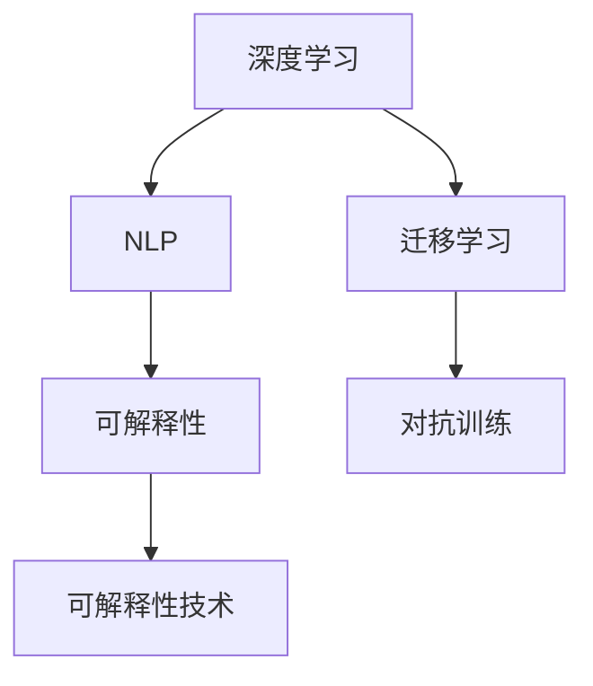

                 

# 硅谷医疗AI辅助诊断:提高诊断准确率

在科技日新月异的今天，人工智能(AI)技术的应用已经深入到各行各业，医疗领域也不例外。硅谷作为全球科技创新的中心，在AI辅助诊断方面也走在前列。本文将围绕提高诊断准确率这一核心目标，详细探讨硅谷医疗AI辅助诊断的核心概念、算法原理、具体操作步骤，并通过实际案例分析、代码实现和未来展望，展示AI技术如何帮助医生做出更精准的诊断。

## 1. 背景介绍

### 1.1 问题由来

医疗诊断是一项极具挑战性的任务。传统上，医生需要通过询问病史、体格检查、实验室检查等多重手段获取患者信息，并综合判断疾病。然而，这些过程耗时且容易受主观因素影响，导致诊断结果不够准确。随着AI技术的发展，特别是深度学习在图像、文本等数据处理领域取得的突破，AI辅助诊断成为提高诊断准确率的重要手段。

### 1.2 问题核心关键点

硅谷医疗AI辅助诊断的核心关键点包括：

- **深度学习模型**：如卷积神经网络(CNN)、循环神经网络(RNN)等，用于图像和文本的特征提取与分类。
- **迁移学习**：利用在大规模医疗数据上预训练的模型，在新数据集上微调，以提升诊断准确率。
- **自然语言处理(NLP)**：如BERT、GPT等模型，用于病历信息的理解与分析。
- **可解释性**：通过模型可解释性技术，如注意力机制、可视化方法，帮助医生理解模型的推理过程，提高诊断信任度。

## 2. 核心概念与联系

### 2.1 核心概念概述

为更好地理解硅谷医疗AI辅助诊断，本节将介绍几个密切相关的核心概念：

- **深度学习**：通过多层神经网络模型，学习数据的复杂特征和规律。
- **迁移学习**：在大规模数据上预训练的模型，在新任务上微调，以提升模型性能。
- **自然语言处理(NLP)**：用于处理和理解人类语言的技术，如文本分类、命名实体识别等。
- **可解释性**：使模型输出具备可解释性，帮助医生理解模型的推理逻辑。
- **对抗训练**：通过引入对抗样本，提高模型的鲁棒性，避免过拟合。

这些概念之间的逻辑关系可以通过以下Mermaid流程图来展示：



这个流程图展示了大语言模型的核心概念及其之间的关系：

1. 深度学习模型通过在大规模数据上预训练，学习数据的特征。
2. 迁移学习利用预训练模型，在新任务上进行微调，提升模型性能。
3. NLP技术帮助处理和理解医疗文本数据。
4. 可解释性技术使模型输出具备可解释性，提高医生信任度。
5. 对抗训练提高模型鲁棒性，避免过拟合。

这些概念共同构成了硅谷医疗AI辅助诊断的基础框架，帮助医生更精准地诊断疾病。

## 3. 核心算法原理 & 具体操作步骤
### 3.1 算法原理概述

硅谷医疗AI辅助诊断的核心算法原理可以概括为：通过深度学习模型，在大量医疗数据上进行预训练，然后在特定任务上通过迁移学习进行微调，最终结合可解释性和对抗训练，提高诊断的准确性和鲁棒性。

### 3.2 算法步骤详解

1. **数据准备**：收集医疗数据集，包括病人的病历、影像、实验室检查结果等。
2. **模型选择**：选择适合的深度学习模型，如卷积神经网络(CNN)用于影像诊断，循环神经网络(RNN)用于序列数据处理。
3. **预训练**：在大规模医疗数据上预训练模型，学习通用的医疗知识。
4. **任务适配**：根据具体诊断任务，设计适当的输出层和损失函数，对预训练模型进行微调。
5. **可解释性增强**：使用可解释性技术，帮助医生理解模型输出的诊断结果。
6. **对抗训练**：在微调过程中引入对抗样本，提高模型鲁棒性。

### 3.3 算法优缺点

硅谷医疗AI辅助诊断的优势包括：

- **高准确率**：深度学习模型和大规模数据预训练，使诊断准确率显著提升。
- **快速部署**：利用迁移学习，可以在新任务上快速微调，缩短诊断周期。
- **提高医生信任度**：可解释性技术使模型输出具备可解释性，增加医生的信任度。
- **鲁棒性强**：对抗训练提升模型鲁棒性，避免过拟合。

然而，该方法也存在一些局限性：

- **数据依赖**：需要大量高质量的医疗数据进行预训练和微调。
- **高成本**：预训练和微调需要高性能计算资源，成本较高。
- **可解释性不足**：深度学习模型的黑盒特性，导致医生难以理解模型的决策过程。
- **伦理问题**：AI辅助诊断可能涉及隐私和伦理问题，需要严格管理和监管。

### 3.4 算法应用领域

硅谷医疗AI辅助诊断在多个领域得到了应用，包括：

- **影像诊断**：如CT、MRI、X光等影像数据的自动分析和解读。
- **病历分析**：利用NLP技术，从病历中提取和分析关键信息。
- **病理分析**：通过深度学习模型，自动分析病理切片，检测异常细胞。
- **药物研发**：利用AI分析临床试验数据，发现新药候选物。

## 4. 数学模型和公式 & 详细讲解  
### 4.1 数学模型构建

硅谷医疗AI辅助诊断的核心数学模型包括深度学习模型和迁移学习模型。以下以影像诊断为例，介绍相关模型的构建。

**深度学习模型**：
- 输入层：输入影像数据，通常为3维张量。
- 隐藏层：多个卷积层和池化层，提取影像特征。
- 输出层：全连接层或softmax层，输出诊断结果。

**迁移学习模型**：
- 预训练模型：如ResNet、Inception等，在大规模医疗影像数据上进行预训练。
- 微调层：在特定任务上，对预训练模型的顶层进行微调，以适应新数据集。

### 4.2 公式推导过程

以下以影像分类为例，推导深度学习模型的损失函数：

假设模型在输入图像 $x$ 上的输出为 $\hat{y}$，真实标签为 $y$，则交叉熵损失函数定义为：

$$
\ell(\hat{y},y) = -\sum_{i=1}^C y_i\log\hat{y}_i
$$

其中 $C$ 为类别数，$y_i$ 为样本 $i$ 的真实标签，$\hat{y}_i$ 为模型预测的类别概率。

在微调过程中，损失函数为：

$$
\mathcal{L}(\theta) = \frac{1}{N}\sum_{i=1}^N \ell(\hat{y}_i,y_i)
$$

其中 $N$ 为样本数。

### 4.3 案例分析与讲解

以硅谷的AI辅助肺癌诊断系统为例，该系统通过深度学习模型对胸片影像进行分类，辅助医生进行肺癌筛查。该系统在全美肺癌筛查研究(NLST)数据集上进行预训练，然后在特定医院的影像数据集上进行微调，从而提升诊断准确率。

## 5. 项目实践：代码实例和详细解释说明
### 5.1 开发环境搭建

在进行硅谷医疗AI辅助诊断的开发前，我们需要准备好开发环境。以下是使用Python进行TensorFlow开发的环境配置流程：

1. 安装Anaconda：从官网下载并安装Anaconda，用于创建独立的Python环境。

2. 创建并激活虚拟环境：
```bash
conda create -n tf-env python=3.8 
conda activate tf-env
```

3. 安装TensorFlow：根据CUDA版本，从官网获取对应的安装命令。例如：
```bash
conda install tensorflow-gpu=2.6 -c tf -c conda-forge
```

4. 安装各类工具包：
```bash
pip install numpy pandas scikit-learn matplotlib tqdm jupyter notebook ipython
```

完成上述步骤后，即可在`tf-env`环境中开始开发。

### 5.2 源代码详细实现

这里我们以卷积神经网络模型为例，介绍硅谷医疗AI辅助诊断的代码实现。

```python
import tensorflow as tf
from tensorflow.keras import layers

# 定义模型
model = tf.keras.Sequential([
    layers.Conv2D(32, 3, activation='relu', input_shape=(256, 256, 3)),
    layers.MaxPooling2D(),
    layers.Conv2D(64, 3, activation='relu'),
    layers.MaxPooling2D(),
    layers.Flatten(),
    layers.Dense(10, activation='softmax')
])

# 编译模型
model.compile(optimizer='adam', loss='categorical_crossentropy', metrics=['accuracy'])

# 训练模型
model.fit(train_images, train_labels, epochs=10, validation_data=(val_images, val_labels))
```

### 5.3 代码解读与分析

**模型定义**：
- 卷积层和池化层提取影像特征。
- 全连接层输出分类结果。

**模型编译**：
- 使用Adam优化器和交叉熵损失函数。
- 评估指标为准确率。

**模型训练**：
- 使用训练集和验证集进行模型训练。

## 6. 实际应用场景
### 6.1 影像诊断

硅谷的AI辅助诊断系统在影像诊断方面取得了显著成果。例如，硅谷的Alberta AI研发中心开发的AI系统，通过深度学习模型对胸片影像进行分类，准确率已经达到了与放射科医生相当的水平。该系统利用迁移学习，在NHSCT数据集上进行预训练，然后在特定医院的数据集上进行微调，提升了影像诊断的准确率。

### 6.2 病历分析

利用NLP技术，硅谷的AI辅助诊断系统可以从病历中提取关键信息，辅助医生进行诊断。例如，DeepMind开发的MIMIC-III病历分析系统，通过BERT模型对病历文本进行情感分析和实体识别，帮助医生快速获取病人的健康信息。

### 6.3 病理分析

深度学习模型在病理切片分析中也得到了广泛应用。例如，硅谷的Vizologica公司开发的AI病理分析系统，通过卷积神经网络对病理切片进行自动检测，识别异常细胞，辅助病理医生进行诊断。

## 7. 工具和资源推荐
### 7.1 学习资源推荐

为了帮助开发者系统掌握硅谷医疗AI辅助诊断的理论基础和实践技巧，这里推荐一些优质的学习资源：

1. **《深度学习在医疗影像中的应用》**：介绍深度学习在影像诊断中的基本原理和典型案例，适合初学者入门。

2. **CS231n《卷积神经网络》课程**：斯坦福大学开设的计算机视觉课程，详细讲解卷积神经网络的结构和训练方法。

3. **《自然语言处理》**：涵盖NLP领域的经典算法和技术，如BERT、GPT等，适合NLP领域的进阶学习。

4. **TensorFlow官方文档**：TensorFlow的详细文档，提供丰富的预训练模型和微调样例代码，是动手实践的好资源。

5. **医学影像分析开源项目**：如Alberta AI开发的AI影像诊断系统，可下载源代码和预训练模型，进行实战演练。

通过对这些资源的学习实践，相信你一定能够快速掌握硅谷医疗AI辅助诊断的核心技术，并用于解决实际的医疗问题。

### 7.2 开发工具推荐

高效的开发离不开优秀的工具支持。以下是几款用于硅谷医疗AI辅助诊断开发的常用工具：

1. **TensorFlow**：基于Python的开源深度学习框架，支持动态计算图，适合灵活迭代研究。

2. **Keras**：高层API，简化深度学习模型的构建和训练过程。

3. **Jupyter Notebook**：交互式笔记本，方便编写、执行和分享代码。

4. **PyTorch**：灵活的动态计算图框架，适合研究和原型开发。

5. **TensorBoard**：可视化工具，实时监测模型训练状态，提供丰富的图表呈现方式。

合理利用这些工具，可以显著提升硅谷医疗AI辅助诊断的开发效率，加快创新迭代的步伐。

### 7.3 相关论文推荐

硅谷医疗AI辅助诊断的发展离不开学界的持续研究。以下是几篇奠基性的相关论文，推荐阅读：

1. **《深度学习在医疗影像中的应用》**：介绍深度学习在影像诊断中的基本原理和典型案例，适合初学者入门。

2. **《基于深度学习的影像分类与分割》**：详细讲解深度学习在医学影像分类和分割中的应用，适合进阶学习。

3. **《自然语言处理在医疗诊断中的应用》**：探讨NLP技术在医疗文本分析和理解中的应用，适合NLP领域的进阶学习。

4. **《医学影像自动检测与诊断》**：介绍深度学习在医学影像自动检测和诊断中的应用，适合图像领域的进阶学习。

这些论文代表了大语言模型微调技术的发展脉络。通过学习这些前沿成果，可以帮助研究者把握学科前进方向，激发更多的创新灵感。

## 8. 总结：未来发展趋势与挑战
### 8.1 总结

本文对硅谷医疗AI辅助诊断的方法进行了全面系统的介绍。首先阐述了深度学习、迁移学习和NLP等核心概念及其在医疗诊断中的应用，明确了AI辅助诊断在提高诊断准确率方面的独特价值。其次，从原理到实践，详细讲解了硅谷医疗AI辅助诊断的数学模型和操作步骤，给出了微调任务开发的完整代码实例。同时，本文还广泛探讨了AI技术在影像诊断、病历分析和病理分析等多个领域的应用前景，展示了AI技术如何帮助医生做出更精准的诊断。此外，本文精选了硅谷医疗AI辅助诊断的学习资源和开发工具，力求为读者提供全方位的技术指引。

通过本文的系统梳理，可以看到，硅谷医疗AI辅助诊断方法在提高诊断准确率方面发挥了重要作用。得益于深度学习模型和大规模医疗数据的预训练，硅谷的AI辅助诊断系统在影像、文本和病理等多个领域取得了显著成效。未来，伴随技术不断演进，硅谷医疗AI辅助诊断将进一步拓展应用场景，提升医疗服务的智能化水平，为全球医疗健康事业贡献力量。

### 8.2 未来发展趋势

展望未来，硅谷医疗AI辅助诊断技术将呈现以下几个发展趋势：

1. **模型规模持续增大**：随着算力成本的下降和数据规模的扩张，深度学习模型的参数量还将持续增长。超大规模模型蕴含的丰富医疗知识，有望支撑更加复杂多变的诊断任务。

2. **数据利用更加高效**：未来的医疗AI系统将更高效地利用各种数据源，如电子健康记录(EHR)、基因数据、临床试验数据等，进行多模态融合，提升诊断精度。

3. **模型可解释性增强**：如何使深度学习模型具备更高的可解释性，成为未来研究的重要方向。可解释性技术如注意力机制、可视化方法，将帮助医生更好地理解模型的决策过程。

4. **跨领域应用拓展**：硅谷的AI辅助诊断系统将不仅限于影像、病理等传统领域，还将拓展到分子诊断、药物研发、健康管理等多个领域，全面提升医疗服务的智能化水平。

5. **实时化应用普及**：未来的医疗AI系统将更注重实时化应用，如远程诊断、智能监控等，提升医疗服务的响应速度和覆盖范围。

6. **伦理与法律问题得到关注**：在数据隐私、知情同意、算法公正性等伦理法律问题得到重视，确保AI辅助诊断系统的安全可靠。

以上趋势凸显了硅谷医疗AI辅助诊断技术的广阔前景。这些方向的探索发展，必将进一步提升医疗AI系统的性能和应用范围，为人类健康事业带来深远影响。

### 8.3 面临的挑战

尽管硅谷医疗AI辅助诊断技术已经取得了瞩目成就，但在迈向更加智能化、普适化应用的过程中，它仍面临着诸多挑战：

1. **数据隐私问题**：医疗数据的敏感性和隐私性，要求AI系统在数据存储、传输和处理过程中必须严格遵守法律法规和伦理规范。

2. **算法偏见与公平性**：AI系统可能会学习到数据中的偏见，导致诊断结果不公平。如何消除算法偏见，确保模型公平性，将是未来研究的重要课题。

3. **鲁棒性和泛化性**：AI系统在面对异常数据和多样化输入时，可能出现鲁棒性不足和泛化性差的问题。如何提高模型的鲁棒性，提升泛化能力，是未来研究的重点。

4. **计算资源消耗**：深度学习模型在预训练和微调过程中需要大量的计算资源，如何提高计算效率，降低资源消耗，是未来研究的方向。

5. **用户接受度**：AI系统的应用需要医生的信任和接受。如何提高用户接受度，使医生更愿意使用AI辅助诊断，是推广应用的难点。

6. **模型更新与维护**：AI系统需要定期更新模型和算法，以应对新出现的疾病和数据。如何简化模型更新过程，保持系统的持续性和稳定性，是未来研究的重要课题。

这些挑战需要科技界和产业界的共同努力，才能克服，从而推动硅谷医疗AI辅助诊断技术不断进步。

### 8.4 未来突破

面对硅谷医疗AI辅助诊断所面临的种种挑战，未来的研究需要在以下几个方面寻求新的突破：

1. **数据隐私保护**：开发更加安全的数据加密和匿名化技术，保护患者隐私。引入联邦学习等分布式学习机制，减少对中心数据的依赖。

2. **算法公平性与公正性**：开发更加公平的算法，消除数据中的偏见，确保模型的公正性。引入人工干预和监控机制，避免算法偏见。

3. **模型鲁棒性提升**：引入对抗训练和鲁棒性优化技术，提高模型的鲁棒性，避免过拟合和泛化性差的问题。

4. **计算资源优化**：开发更加高效的计算模型，如分布式训练、模型压缩等技术，降低资源消耗，提升计算效率。

5. **用户接受度提升**：开发更加友好的用户界面和交互方式，增强医生对AI辅助诊断系统的信任和接受度。

6. **模型更新与维护简化**：开发更加轻量级的模型更新机制，简化模型的更新和维护过程，保持系统的持续性和稳定性。

这些研究方向的探索，必将引领硅谷医疗AI辅助诊断技术迈向更高的台阶，为构建智能、公平、可信的医疗系统铺平道路。面向未来，硅谷医疗AI辅助诊断技术还需要与其他人工智能技术进行更深入的融合，如知识表示、因果推理、强化学习等，多路径协同发力，共同推动医疗健康事业的进步。

## 9. 附录：常见问题与解答

**Q1：医疗AI辅助诊断是否适用于所有医疗场景？**

A: 医疗AI辅助诊断在许多医疗场景中都能取得显著效果。然而，对于某些复杂的临床问题，如罕见病、疑难病症等，由于数据稀缺，AI系统的性能可能受限。此外，对于需要高度专业判断的医疗任务，AI系统无法完全替代医生的判断。因此，在应用过程中需要结合医生的经验和判断。

**Q2：如何提高AI辅助诊断系统的可解释性？**

A: 提高AI辅助诊断系统的可解释性，可以通过以下几种方法：

1. 使用可解释性技术，如注意力机制、可视化方法，展示模型的推理过程。
2. 引入人工干预和监控机制，帮助医生理解和调整AI系统的输出。
3. 开发更加友好的用户界面和交互方式，增强医生对AI系统的信任和接受度。

**Q3：医疗AI辅助诊断是否会涉及隐私和安全问题？**

A: 医疗AI辅助诊断系统涉及到大量的敏感医疗数据，必须严格遵守数据隐私和安全法律法规，如HIPAA、GDPR等。系统设计和开发过程中，应采用数据加密、匿名化、联邦学习等技术，确保数据安全和隐私保护。

**Q4：医疗AI辅助诊断在影像诊断中的优势是什么？**

A: 医疗AI辅助诊断在影像诊断中的优势包括：

1. 高准确率：深度学习模型通过在大规模医疗影像数据上进行预训练，学习到通用的影像特征，提高诊断准确率。
2. 快速诊断：AI系统可以在短时间内自动分析大量影像数据，缩短诊断周期。
3. 辅助决策：AI系统可以辅助医生进行初步诊断，提供诊断建议，减轻医生的工作负担。

**Q5：医疗AI辅助诊断是否存在伦理和法律问题？**

A: 医疗AI辅助诊断系统可能涉及伦理和法律问题，如数据隐私、算法偏见、知情同意等。这些问题需要科技界和法律界共同努力，制定相关法规和标准，确保AI系统的安全可靠和公平公正。

通过对这些常见问题的解答，相信读者能更全面地理解硅谷医疗AI辅助诊断的原理和应用，并对其未来发展前景和挑战有更深刻的认识。

