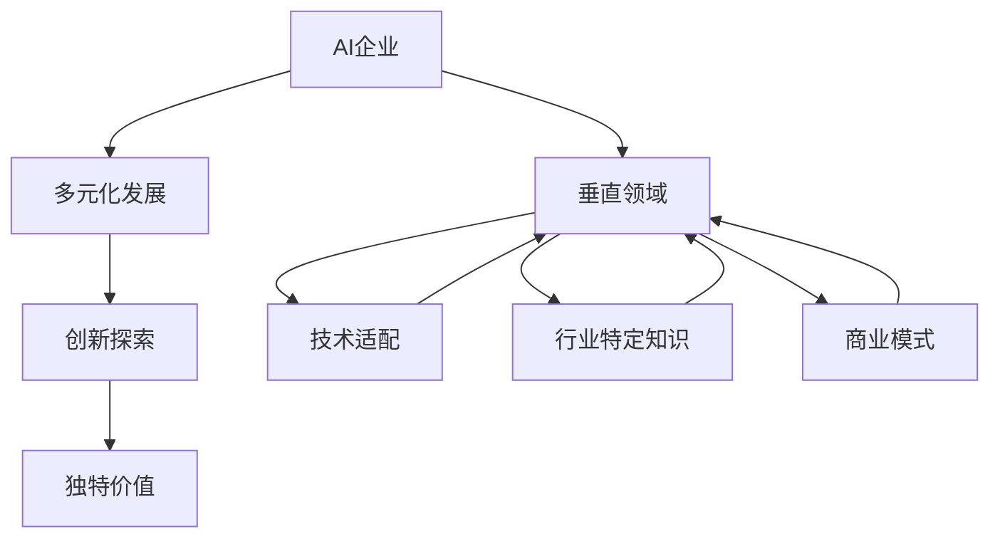

                 

# 硅谷多元化发展：AI企业创新探索垂直领域独特价值

> 关键词：硅谷、AI企业、垂直领域、多元化发展、创新探索、独特价值

## 1. 背景介绍

### 1.1 问题由来
硅谷，作为全球科技创新的中心，一直以来都是各类高科技企业和创新理念的试验田。特别是在人工智能（AI）领域，硅谷的企业们不仅在深度学习、计算机视觉、自然语言处理等传统领域取得突破，也开始探索AI在垂直领域的应用，寻求独特的商业价值和社会价值。

近年来，随着AI技术的快速发展和跨界融合的趋势，许多AI企业在垂直领域的探索也取得了显著成果。例如，AI在医疗、金融、教育、交通、能源等多个行业的应用，不仅提高了各行业的生产效率，还创造了巨大的经济效益和社会效益。本文将重点探讨硅谷AI企业如何通过探索垂直领域，实现多元化和创新发展，并探索其独特的商业价值。

### 1.2 问题核心关键点
硅谷AI企业在垂直领域的探索过程中，主要聚焦于以下几个核心关键点：

- **技术适配与优化**：AI技术在垂直领域的应用需要根据具体的行业需求进行适配和优化，如算法调优、数据处理等。
- **行业特定知识与数据**：AI技术需要与垂直领域的知识体系、数据集结合，才能发挥最大效用。
- **商业模式的创新**：如何基于AI技术开发新的商业模式，以及如何实现商业的可持续性，是AI企业探索垂直领域的重要挑战。
- **伦理与法律问题**：AI技术在垂直领域的应用可能涉及隐私、安全、伦理等复杂问题，如何在合规框架内创新应用，是企业的重大课题。

## 2. 核心概念与联系

### 2.1 核心概念概述

为更好地理解硅谷AI企业在垂直领域的多元化探索，本节将介绍几个关键概念及其联系：

- **AI企业**：指在AI领域进行技术研发、产品开发和市场应用的企业，包括初创公司、大中型企业、研究机构等。
- **垂直领域**：指AI技术在不同行业中的应用领域，如医疗、金融、教育、交通、能源等。
- **多元化发展**：指AI企业通过在多个垂直领域进行探索和布局，实现技术的广泛应用和商业价值的最大化。
- **创新探索**：指AI企业在垂直领域中，通过技术创新和业务模式创新，寻找新的增长点和发展机会。
- **独特价值**：指AI企业在垂直领域中，通过技术适配、行业知识结合等手段，创造的独特商业价值和社会价值。

这些概念之间的逻辑关系可以通过以下Mermaid流程图来展示：



这个流程图展示了AI企业在垂直领域的多元化探索过程：AI企业基于AI技术，结合垂直领域的特定需求，进行技术适配和行业知识结合，最终实现创新探索，创造独特价值。

## 3. 核心算法原理 & 具体操作步骤
### 3.1 算法原理概述

硅谷AI企业在垂直领域的探索，主要通过在AI模型的基础上进行微调和优化，以适应垂直领域的需求。其核心思想是：在预训练的通用AI模型基础上，通过微调和优化，使其在特定垂直领域具备更好的表现。

形式化地，假设预训练的通用AI模型为 $M_{\theta}$，其中 $\theta$ 为预训练得到的模型参数。给定垂直领域 $T$ 的行业数据集 $D=\{(x_i, y_i)\}_{i=1}^N$，模型适配的过程就是寻找新的模型参数 $\hat{\theta}$，使得模型在垂直领域 $T$ 上的表现最优：

$$
\hat{\theta}=\mathop{\arg\min}_{\theta} \mathcal{L}(M_{\theta},D)
$$

其中 $\mathcal{L}$ 为针对垂直领域 $T$ 设计的损失函数，用于衡量模型预测输出与真实标签之间的差异。常见的损失函数包括交叉熵损失、均方误差损失等。

### 3.2 算法步骤详解

基于AI模型的微调和优化，一般包括以下几个关键步骤：

**Step 1: 准备垂直领域数据集**
- 收集垂直领域 $T$ 的行业数据集 $D=\{(x_i, y_i)\}_{i=1}^N$，进行清洗和标注，准备微调的数据集。

**Step 2: 适配模型架构**
- 根据垂直领域 $T$ 的特性，对预训练模型的架构进行适配。如在医疗领域，可以引入医疗影像处理模块；在金融领域，可以加入交易数据处理模块。

**Step 3: 设置微调超参数**
- 选择合适的优化算法及其参数，如 Adam、SGD 等，设置学习率、批大小、迭代轮数等。
- 设置正则化技术及强度，包括权重衰减、Dropout、Early Stopping 等。
- 确定冻结预训练参数的策略，如仅微调顶层，或全部参数都参与微调。

**Step 4: 执行微调**
- 将训练集数据分批次输入模型，前向传播计算损失函数。
- 反向传播计算参数梯度，根据设定的优化算法和学习率更新模型参数。
- 周期性在验证集上评估模型性能，根据性能指标决定是否触发 Early Stopping。
- 重复上述步骤直至满足预设的迭代轮数或 Early Stopping 条件。

**Step 5: 部署与优化**
- 在测试集上评估微调后模型的性能，对比微调前后的精度提升。
- 使用微调后的模型对新数据进行推理预测，集成到实际的应用系统中。
- 根据实际应用反馈，持续改进模型，优化算法参数，提升模型表现。

以上是基于AI模型的微调和优化的一般流程。在实际应用中，还需要针对具体垂直领域的特性，对微调过程的各个环节进行优化设计，如改进训练目标函数，引入更多的正则化技术，搜索最优的超参数组合等，以进一步提升模型性能。

### 3.3 算法优缺点

基于AI模型的微调和优化方法具有以下优点：

- **适应性强**：AI模型具有高度的泛化能力，能够适应不同垂直领域的需求。
- **参数高效**：通过微调和优化，可以只调整少量的模型参数，减少计算资源消耗。
- **效果显著**：在垂直领域的数据集上，微调和优化后的模型往往能够显著提升性能。

同时，该方法也存在一定的局限性：

- **依赖标注数据**：微调和优化依赖于高质量的标注数据，获取数据的成本较高。
- **模型鲁棒性有限**：微调和优化后的模型可能对域外数据表现不佳，泛化能力有限。
- **可解释性不足**：微调和优化后的模型往往缺乏可解释性，难以理解其内部工作机制。

尽管存在这些局限性，但就目前而言，基于AI模型的微调和优化方法仍是最主流范式之一。未来相关研究的重点在于如何进一步降低对标注数据的依赖，提高模型的泛化能力和可解释性，同时兼顾商业价值和社会价值的双重目标。

### 3.4 算法应用领域

基于AI模型的微调和优化方法在硅谷的AI企业中得到了广泛应用，覆盖了医疗、金融、教育、交通、能源等多个垂直领域，例如：

- **医疗领域**：AI企业通过微调和优化，开发了基于医学影像和病历的诊断系统，提升了医生的诊断效率和准确性。
- **金融领域**：AI企业利用微调和优化后的模型，开发了智能投顾、风险评估、欺诈检测等应用，提升了金融机构的运营效率和风险控制能力。
- **教育领域**：AI企业通过微调和优化，开发了个性化学习推荐系统、智能批改系统等应用，提升了教育资源的利用效率和教学质量。
- **交通领域**：AI企业利用微调和优化后的模型，开发了自动驾驶、智能调度、交通预测等应用，提升了城市交通管理水平。
- **能源领域**：AI企业通过微调和优化，开发了能源需求预测、智能电网调度等应用，提升了能源利用效率和经济效益。

这些应用案例展示了AI模型在垂直领域的多元化探索，推动了各行业的数字化转型升级，为未来智能化社会的构建奠定了坚实基础。

## 4. 数学模型和公式 & 详细讲解  
### 4.1 数学模型构建

本节将使用数学语言对硅谷AI企业在垂直领域的微调和优化过程进行更加严格的刻画。

记预训练的通用AI模型为 $M_{\theta}:\mathcal{X} \rightarrow \mathcal{Y}$，其中 $\mathcal{X}$ 为输入空间，$\mathcal{Y}$ 为输出空间，$\theta \in \mathbb{R}^d$ 为模型参数。假设垂直领域 $T$ 的训练集为 $D=\{(x_i,y_i)\}_{i=1}^N$，其中 $x_i \in \mathcal{X}$ 为输入，$y_i \in \mathcal{Y}$ 为标签。

定义模型 $M_{\theta}$ 在垂直领域 $T$ 上的损失函数为 $\ell(M_{\theta}(x),y)$，则在数据集 $D$ 上的经验风险为：

$$
\mathcal{L}(\theta) = \frac{1}{N} \sum_{i=1}^N \ell(M_{\theta}(x_i),y_i)
$$

微调的优化目标是最小化经验风险，即找到最优参数：

$$
\theta^* = \mathop{\arg\min}_{\theta} \mathcal{L}(\theta)
$$

在实践中，我们通常使用基于梯度的优化算法（如SGD、Adam等）来近似求解上述最优化问题。设 $\eta$ 为学习率，$\lambda$ 为正则化系数，则参数的更新公式为：

$$
\theta \leftarrow \theta - \eta \nabla_{\theta}\mathcal{L}(\theta) - \eta\lambda\theta
$$

其中 $\nabla_{\theta}\mathcal{L}(\theta)$ 为损失函数对参数 $\theta$ 的梯度，可通过反向传播算法高效计算。

### 4.2 公式推导过程

以下我们以医疗领域的影像诊断为例，推导微调和优化损失函数的梯度计算公式。

假设预训练的通用AI模型 $M_{\theta}$ 输入为医疗影像 $x$，输出为诊断结果 $y \in \{0,1\}$，表示患者是否患有某种疾病。则二分类交叉熵损失函数定义为：

$$
\ell(M_{\theta}(x),y) = -[y\log \hat{y} + (1-y)\log (1-\hat{y})]
$$

将其代入经验风险公式，得：

$$
\mathcal{L}(\theta) = -\frac{1}{N}\sum_{i=1}^N [y_i\log M_{\theta}(x_i)+(1-y_i)\log(1-M_{\theta}(x_i))]
$$

根据链式法则，损失函数对参数 $\theta_k$ 的梯度为：

$$
\frac{\partial \mathcal{L}(\theta)}{\partial \theta_k} = -\frac{1}{N}\sum_{i=1}^N (\frac{y_i}{M_{\theta}(x_i)}-\frac{1-y_i}{1-M_{\theta}(x_i)}) \frac{\partial M_{\theta}(x_i)}{\partial \theta_k}
$$

其中 $\frac{\partial M_{\theta}(x_i)}{\partial \theta_k}$ 可进一步递归展开，利用自动微分技术完成计算。

在得到损失函数的梯度后，即可带入参数更新公式，完成模型的迭代优化。重复上述过程直至收敛，最终得到在垂直领域 $T$ 上的最优模型参数 $\theta^*$。

## 5. 项目实践：代码实例和详细解释说明
### 5.1 开发环境搭建

在进行微调实践前，我们需要准备好开发环境。以下是使用Python进行PyTorch开发的环境配置流程：

1. 安装Anaconda：从官网下载并安装Anaconda，用于创建独立的Python环境。

2. 创建并激活虚拟环境：
```bash
conda create -n pytorch-env python=3.8 
conda activate pytorch-env
```

3. 安装PyTorch：根据CUDA版本，从官网获取对应的安装命令。例如：
```bash
conda install pytorch torchvision torchaudio cudatoolkit=11.1 -c pytorch -c conda-forge
```

4. 安装各类工具包：
```bash
pip install numpy pandas scikit-learn matplotlib tqdm jupyter notebook ipython
```

完成上述步骤后，即可在`pytorch-env`环境中开始微调实践。

### 5.2 源代码详细实现

下面我们以医疗影像诊断为例，给出使用Transformers库对BERT模型进行微调的PyTorch代码实现。

首先，定义医疗影像数据处理函数：

```python
from transformers import BertTokenizer
from torch.utils.data import Dataset
import torch

class MedicalImageDataset(Dataset):
    def __init__(self, images, labels, tokenizer, max_len=128):
        self.images = images
        self.labels = labels
        self.tokenizer = tokenizer
        self.max_len = max_len
        
    def __len__(self):
        return len(self.images)
    
    def __getitem__(self, item):
        image = self.images[item]
        label = self.labels[item]
        
        encoding = self.tokenizer(image, return_tensors='pt', max_length=self.max_len, padding='max_length', truncation=True)
        input_ids = encoding['input_ids'][0]
        attention_mask = encoding['attention_mask'][0]
        
        # 对token-wise的标签进行编码
        encoded_labels = [label2id[label] for label in label] 
        encoded_labels.extend([label2id['O']] * (self.max_len - len(encoded_labels)))
        labels = torch.tensor(encoded_labels, dtype=torch.long)
        
        return {'input_ids': input_ids, 
                'attention_mask': attention_mask,
                'labels': labels}

# 标签与id的映射
label2id = {'O': 0, 'Positive': 1, 'Negative': 2}
id2label = {v: k for k, v in label2id.items()}

# 创建dataset
tokenizer = BertTokenizer.from_pretrained('bert-base-cased')

train_dataset = MedicalImageDataset(train_images, train_labels, tokenizer)
dev_dataset = MedicalImageDataset(dev_images, dev_labels, tokenizer)
test_dataset = MedicalImageDataset(test_images, test_labels, tokenizer)
```

然后，定义模型和优化器：

```python
from transformers import BertForTokenClassification, AdamW

model = BertForTokenClassification.from_pretrained('bert-base-cased', num_labels=len(label2id))

optimizer = AdamW(model.parameters(), lr=2e-5)
```

接着，定义训练和评估函数：

```python
from torch.utils.data import DataLoader
from tqdm import tqdm
from sklearn.metrics import classification_report

device = torch.device('cuda') if torch.cuda.is_available() else torch.device('cpu')
model.to(device)

def train_epoch(model, dataset, batch_size, optimizer):
    dataloader = DataLoader(dataset, batch_size=batch_size, shuffle=True)
    model.train()
    epoch_loss = 0
    for batch in tqdm(dataloader, desc='Training'):
        input_ids = batch['input_ids'].to(device)
        attention_mask = batch['attention_mask'].to(device)
        labels = batch['labels'].to(device)
        model.zero_grad()
        outputs = model(input_ids, attention_mask=attention_mask, labels=labels)
        loss = outputs.loss
        epoch_loss += loss.item()
        loss.backward()
        optimizer.step()
    return epoch_loss / len(dataloader)

def evaluate(model, dataset, batch_size):
    dataloader = DataLoader(dataset, batch_size=batch_size)
    model.eval()
    preds, labels = [], []
    with torch.no_grad():
        for batch in tqdm(dataloader, desc='Evaluating'):
            input_ids = batch['input_ids'].to(device)
            attention_mask = batch['attention_mask'].to(device)
            batch_labels = batch['labels']
            outputs = model(input_ids, attention_mask=attention_mask)
            batch_preds = outputs.logits.argmax(dim=2).to('cpu').tolist()
            batch_labels = batch_labels.to('cpu').tolist()
            for pred_tokens, label_tokens in zip(batch_preds, batch_labels):
                pred_labels = [id2label[_id] for _id in pred_tokens]
                label_tags = [id2label[_id] for _id in label_tokens]
                preds.append(pred_labels[:len(label_tokens)])
                labels.append(label_tags)
                
    print(classification_report(labels, preds))
```

最后，启动训练流程并在测试集上评估：

```python
epochs = 5
batch_size = 16

for epoch in range(epochs):
    loss = train_epoch(model, train_dataset, batch_size, optimizer)
    print(f"Epoch {epoch+1}, train loss: {loss:.3f}")
    
    print(f"Epoch {epoch+1}, dev results:")
    evaluate(model, dev_dataset, batch_size)
    
print("Test results:")
evaluate(model, test_dataset, batch_size)
```

以上就是使用PyTorch对BERT进行医疗影像诊断任务微调的完整代码实现。可以看到，得益于Transformers库的强大封装，我们可以用相对简洁的代码完成BERT模型的加载和微调。

### 5.3 代码解读与分析

让我们再详细解读一下关键代码的实现细节：

**MedicalImageDataset类**：
- `__init__`方法：初始化医疗影像、标签、分词器等关键组件。
- `__len__`方法：返回数据集的样本数量。
- `__getitem__`方法：对单个样本进行处理，将影像输入编码为token ids，将标签编码为数字，并对其进行定长padding，最终返回模型所需的输入。

**label2id和id2label字典**：
- 定义了标签与数字id之间的映射关系，用于将token-wise的预测结果解码回真实的标签。

**训练和评估函数**：
- 使用PyTorch的DataLoader对数据集进行批次化加载，供模型训练和推理使用。
- 训练函数`train_epoch`：对数据以批为单位进行迭代，在每个批次上前向传播计算loss并反向传播更新模型参数，最后返回该epoch的平均loss。
- 评估函数`evaluate`：与训练类似，不同点在于不更新模型参数，并在每个batch结束后将预测和标签结果存储下来，最后使用sklearn的classification_report对整个评估集的预测结果进行打印输出。

**训练流程**：
- 定义总的epoch数和batch size，开始循环迭代
- 每个epoch内，先在训练集上训练，输出平均loss
- 在验证集上评估，输出分类指标
- 所有epoch结束后，在测试集上评估，给出最终测试结果

可以看到，PyTorch配合Transformers库使得BERT微调的代码实现变得简洁高效。开发者可以将更多精力放在数据处理、模型改进等高层逻辑上，而不必过多关注底层的实现细节。

当然，工业级的系统实现还需考虑更多因素，如模型的保存和部署、超参数的自动搜索、更灵活的任务适配层等。但核心的微调范式基本与此类似。

## 6. 实际应用场景
### 6.1 医疗领域

基于大语言模型微调的影像诊断技术，已经在医疗领域得到了广泛应用。传统医疗影像诊断往往依赖于医生多年积累的经验，耗费时间和人力。而使用微调后的影像诊断模型，可以快速、准确地进行疾病诊断，极大地提高了医疗效率。

在技术实现上，可以收集医院的历史影像和病历数据，将影像与疾病标签构建成监督数据，在此基础上对预训练模型进行微调。微调后的影像诊断模型能够自动识别医学影像中的病变区域，判断疾病类型，辅助医生做出诊断。对于新的影像数据，模型还能实时输出诊断结果，为医生提供参考，提升诊断准确性和效率。

### 6.2 金融领域

AI在金融领域的应用主要集中在风险评估、智能投顾、欺诈检测等方面。微调后的模型可以通过对金融数据的分析，预测市场趋势，评估金融风险，提供智能投资建议。

具体而言，可以收集金融领域的历史交易数据、新闻资讯等，对微调模型进行训练，使其能够识别出潜在的欺诈行为，预测股票市场的涨跌，评估金融产品的风险。通过微调模型对金融数据的深度分析和智能推理，金融机构能够更准确地识别风险，优化投资策略，提高资产收益。

### 6.3 教育领域

AI在教育领域的应用主要集中在个性化学习推荐、智能批改、语言学习辅助等方面。微调后的模型可以基于学生的学习行为和成绩，推荐适合的教材和习题，提供个性化的学习建议，帮助学生提高学习效率。

具体而言，可以收集学生的学习记录、答题数据等，对微调模型进行训练，使其能够识别学生的学习风格和偏好，推荐适合的教材和习题。同时，通过微调模型对学生答题的自动批改，教师能够节省大量批改时间，提高教学质量。通过语音识别、自然语言处理等技术，微调模型还能提供语言学习的辅助，帮助学生提高口语、听力等能力。

### 6.4 未来应用展望

随着AI技术的持续演进，基于微调的大语言模型将在更多垂直领域得到应用，推动各行业的数字化转型升级，为未来的智能化社会奠定基础。

在智慧医疗领域，微调后的影像诊断模型将进一步提升医疗服务的智能化水平，辅助医生诊疗，加速新药开发进程。

在智能教育领域，微调技术将开发出更加智能、个性化的学习推荐系统，提升教育资源的利用效率和教学质量。

在智慧城市治理中，微调模型将应用于城市事件监测、舆情分析、应急指挥等环节，提高城市管理的自动化和智能化水平，构建更安全、高效的未来城市。

此外，在企业生产、社会治理、文娱传媒等众多领域，基于大语言模型微调的人工智能应用也将不断涌现，为经济社会发展注入新的动力。相信随着技术的日益成熟，微调方法将成为人工智能落地应用的重要范式，推动人工智能技术向更广阔的领域加速渗透。

## 7. 工具和资源推荐
### 7.1 学习资源推荐

为了帮助开发者系统掌握硅谷AI企业在垂直领域的多元化探索，这里推荐一些优质的学习资源：

1. 《Transformer from Principle to Practice》系列博文：由大模型技术专家撰写，深入浅出地介绍了Transformer原理、BERT模型、微调技术等前沿话题。

2. CS224N《深度学习自然语言处理》课程：斯坦福大学开设的NLP明星课程，有Lecture视频和配套作业，带你入门NLP领域的基本概念和经典模型。

3. 《Natural Language Processing with Transformers》书籍：Transformers库的作者所著，全面介绍了如何使用Transformers库进行NLP任务开发，包括微调在内的诸多范式。

4. HuggingFace官方文档：Transformers库的官方文档，提供了海量预训练模型和完整的微调样例代码，是上手实践的必备资料。

5. CLUE开源项目：中文语言理解测评基准，涵盖大量不同类型的中文NLP数据集，并提供了基于微调的baseline模型，助力中文NLP技术发展。

通过对这些资源的学习实践，相信你一定能够快速掌握硅谷AI企业在垂直领域的多元化探索，并用于解决实际的NLP问题。
###  7.2 开发工具推荐

高效的开发离不开优秀的工具支持。以下是几款用于硅谷AI企业垂直领域探索的常用工具：

1. PyTorch：基于Python的开源深度学习框架，灵活动态的计算图，适合快速迭代研究。大部分预训练语言模型都有PyTorch版本的实现。

2. TensorFlow：由Google主导开发的开源深度学习框架，生产部署方便，适合大规模工程应用。同样有丰富的预训练语言模型资源。

3. Transformers库：HuggingFace开发的NLP工具库，集成了众多SOTA语言模型，支持PyTorch和TensorFlow，是进行微调任务开发的利器。

4. Weights & Biases：模型训练的实验跟踪工具，可以记录和可视化模型训练过程中的各项指标，方便对比和调优。与主流深度学习框架无缝集成。

5. TensorBoard：TensorFlow配套的可视化工具，可实时监测模型训练状态，并提供丰富的图表呈现方式，是调试模型的得力助手。

6. Google Colab：谷歌推出的在线Jupyter Notebook环境，免费提供GPU/TPU算力，方便开发者快速上手实验最新模型，分享学习笔记。

合理利用这些工具，可以显著提升硅谷AI企业垂直领域探索的开发效率，加快创新迭代的步伐。

### 7.3 相关论文推荐

硅谷AI企业在垂直领域的探索源于学界的持续研究。以下是几篇奠基性的相关论文，推荐阅读：

1. Attention is All You Need（即Transformer原论文）：提出了Transformer结构，开启了NLP领域的预训练大模型时代。

2. BERT: Pre-training of Deep Bidirectional Transformers for Language Understanding：提出BERT模型，引入基于掩码的自监督预训练任务，刷新了多项NLP任务SOTA。

3. Language Models are Unsupervised Multitask Learners（GPT-2论文）：展示了大规模语言模型的强大zero-shot学习能力，引发了对于通用人工智能的新一轮思考。

4. Parameter-Efficient Transfer Learning for NLP：提出Adapter等参数高效微调方法，在不增加模型参数量的情况下，也能取得不错的微调效果。

5. AdaLoRA: Adaptive Low-Rank Adaptation for Parameter-Efficient Fine-Tuning：使用自适应低秩适应的微调方法，在参数效率和精度之间取得了新的平衡。

6. Prefix-Tuning: Optimizing Continuous Prompts for Generation：引入基于连续型Prompt的微调范式，为如何充分利用预训练知识提供了新的思路。

这些论文代表了大语言模型微调技术的发展脉络。通过学习这些前沿成果，可以帮助研究者把握学科前进方向，激发更多的创新灵感。

## 8. 总结：未来发展趋势与挑战

### 8.1 总结

本文对硅谷AI企业在垂直领域的多元化探索进行了全面系统的介绍。首先阐述了硅谷AI企业在垂直领域探索的背景和意义，明确了AI技术在各行业中的应用价值和商业价值。其次，从原理到实践，详细讲解了基于AI模型的微调和优化过程，给出了微调任务开发的完整代码实例。同时，本文还探讨了AI在医疗、金融、教育、交通、能源等多个垂直领域的应用前景，展示了AI企业探索垂直领域的多元化和创新发展。

通过本文的系统梳理，可以看到，基于AI模型的微调和优化方法在硅谷AI企业的垂直领域探索中，取得了显著的效果，推动了各行业的数字化转型升级，为未来智能化社会的构建奠定了基础。未来，伴随AI技术的持续演进，基于微调的方法将成为各行业应用AI的重要范式，推动AI技术向更广阔的领域加速渗透。

### 8.2 未来发展趋势

展望未来，硅谷AI企业在垂直领域的探索将呈现以下几个发展趋势：

1. **技术深度增强**：随着深度学习技术的不断进步，AI模型在垂直领域的应用将更加深入和精确，能够处理更为复杂和多变的数据。
2. **模型规模增大**：随着算力资源的不断提升，预训练模型的参数量将继续增大，能够处理更大规模的数据集和更复杂的任务。
3. **应用场景拓展**：AI技术将在更多垂直领域得到应用，如医疗、金融、教育、交通、能源等，推动各行业的数字化转型升级。
4. **跨领域融合**：AI技术将与其他技术（如物联网、区块链、人工智能等）进行更深入的融合，推动跨领域应用和创新。
5. **商业价值提升**：基于AI模型的微调和优化将创造更多的商业价值和社会价值，推动各行业的市场竞争和创新发展。
6. **伦理和社会责任**：随着AI技术的应用普及，如何在保障商业价值的同时，兼顾伦理和社会责任，将是未来的重要课题。

以上趋势凸显了硅谷AI企业在垂直领域的多元化探索的广阔前景。这些方向的探索发展，必将进一步提升AI技术在各行业的性能和应用范围，为未来智能化社会的构建提供新的动力。

### 8.3 面临的挑战

尽管硅谷AI企业在垂直领域的探索已经取得了显著成果，但在迈向更加智能化、普适化应用的过程中，仍面临诸多挑战：

1. **数据获取难度大**：不同垂直领域的数据获取难度大，数据质量和多样性有限，制约了AI技术的应用效果。
2. **模型泛化能力有限**：AI模型在垂直领域的应用，可能对域外数据表现不佳，泛化能力有限。
3. **隐私和安全问题**：AI技术在垂直领域的应用涉及大量敏感数据，隐私和安全问题尤为突出，如何保障数据安全，将是未来的重要课题。
4. **商业化难度大**：AI技术在垂直领域的应用需要考虑商业模式的设计和实施，如何在技术创新和商业模式之间找到平衡，将是未来的重要挑战。
5. **伦理和社会责任**：AI技术在垂直领域的应用可能带来伦理和社会责任问题，如何在技术创新和伦理规范之间找到平衡，将是未来的重要课题。

尽管存在这些挑战，但硅谷AI企业通过持续的技术创新和商业模式创新，正在不断突破这些难题，推动AI技术在垂直领域的广泛应用。

### 8.4 研究展望

未来的研究需要在以下几个方面寻求新的突破：

1. **数据获取和处理**：开发更加高效、自动化的数据采集和处理技术，获取更多高质量的垂直领域数据。
2. **模型泛化能力提升**：研究如何提高AI模型在垂直领域的应用泛化能力，使其能够在不同数据集和环境下表现稳定。
3. **隐私和安全保护**：开发更加安全的AI技术，保护用户隐私，保障数据安全。
4. **商业化路径优化**：研究如何优化AI技术的商业模式，使其能够在垂直领域实现商业化应用，推动行业创新发展。
5. **伦理和社会责任**：研究和制定AI技术的伦理和社会责任规范，确保AI技术在各行业应用中的公平、透明和可持续性。

通过这些研究方向的探索，相信硅谷AI企业在垂直领域的探索将进一步深化，推动AI技术在各行业的广泛应用，为未来智能化社会的构建提供新的动力。

## 9. 附录：常见问题与解答

**Q1：硅谷AI企业在垂直领域探索的优势在哪里？**

A: 硅谷AI企业在垂直领域探索的优势主要体现在以下几个方面：

1. **技术领先**：硅谷聚集了大量顶尖的AI研究机构和科技企业，具备强大的技术研发能力，能够快速推动AI技术的创新和应用。
2. **数据丰富**：硅谷拥有丰富的数据资源，包括社交媒体数据、医疗数据、金融数据等，为AI技术的开发和应用提供了充足的素材。
3. **市场需求大**：硅谷各行业对AI技术的需求强烈，AI企业能够在不同领域中找到新的应用场景和商业机会。
4. **人才汇聚**：硅谷汇聚了大量的AI人才，包括科学家、工程师、产品经理等，能够推动AI技术的广泛应用和商业化。
5. **投资环境好**：硅谷拥有大量的风险投资机构，为AI企业的创新和发展提供了充足的资金支持。

这些优势使得硅谷AI企业在垂直领域的探索中，能够快速实现技术的突破和商业价值的最大化。

**Q2：AI企业在垂直领域探索时，如何保证数据的质量和多样性？**

A: AI企业在垂直领域探索时，保证数据的质量和多样性至关重要。以下是一些常用的方法：

1. **数据采集**：使用多种数据来源，包括公共数据集、行业数据、用户生成内容等，获取多维度、多类型的数据。
2. **数据清洗**：对数据进行预处理和清洗，去除噪声和异常值，提高数据质量。
3. **数据增强**：通过数据增强技术，如回译、数据合成、数据扩充等，增加数据多样性。
4. **数据标注**：对数据进行人工标注，确保数据标签的准确性和一致性。
5. **数据集平衡**：保证数据集中各类样本的平衡，避免数据偏斜导致的模型偏差。
6. **数据联邦**：采用数据联邦技术，在保证数据隐私的前提下，进行数据共享和协同训练，提高数据多样性和质量。

通过这些方法，AI企业能够获取高质量、多样性的数据，为模型训练和优化提供坚实的基础。

**Q3：AI企业在垂直领域探索时，如何平衡技术创新和商业模式？**

A: AI企业在垂直领域探索时，技术创新和商业模式之间需要找到平衡。以下是一些常用的方法：

1. **技术驱动**：以技术创新为核心，推动AI技术的深度应用和商业化。技术创新为商业模式提供支持，使企业能够获得竞争优势。
2. **市场需求导向**：根据市场需求设计商业模式，确保技术应用能够满足用户需求，提升用户满意度。市场需求为导向，可以更好地推动技术创新和商业化。
3. **合作伙伴关系**：与行业合作伙伴建立合作关系，共同推动技术应用和商业化。通过合作伙伴，企业可以获取更多的资源和支持，快速进入市场。
4. **风险控制**：合理控制风险，确保商业模式可持续。商业模式的成功需要考虑技术风险、市场风险、法律风险等，风险控制是成功的重要保障。
5. **用户反馈**：收集用户反馈，不断改进技术应用和商业模式。用户反馈是技术创新的重要来源，也是商业模式改进的依据。

通过这些方法，AI企业能够在技术创新和商业模式之间找到平衡，实现技术突破和商业价值的最大化。

**Q4：AI企业在垂直领域探索时，如何确保数据隐私和安全？**

A: AI企业在垂直领域探索时，数据隐私和安全是至关重要的。以下是一些常用的方法：

1. **数据匿名化**：对数据进行匿名化处理，去除敏感信息，确保数据隐私。
2. **数据加密**：对数据进行加密处理，防止数据泄露和篡改。
3. **访问控制**：采用访问控制技术，限制数据的访问权限，确保数据安全。
4. **隐私保护算法**：采用隐私保护算法，如差分隐私、联邦学习等，保护用户隐私。
5. **合规性检查**：遵守相关法律法规，确保数据使用的合规性。
6. **审计和监控**：建立审计和监控机制，实时监测数据使用情况，及时发现和处理安全问题。

通过这些方法，AI企业能够在保障数据隐私和安全的条件下，进行数据处理和模型训练，推动AI技术在垂直领域的广泛应用。

**Q5：AI企业在垂直领域探索时，如何提升模型的泛化能力？**

A: AI企业在垂直领域探索时，提升模型的泛化能力是确保技术应用成功的重要前提。以下是一些常用的方法：

1. **数据多样化**：收集多样化的数据，涵盖不同场景、不同类型的数据，提升模型的泛化能力。
2. **模型复杂度控制**：控制模型的复杂度，避免模型过拟合，提高模型的泛化能力。
3. **正则化技术**：采用正则化技术，如L2正则、Dropout等，防止模型过拟合，提高模型的泛化能力。
4. **迁移学习**：将模型在多个垂直领域中进行迁移学习，提升模型的泛化能力。
5. **对抗训练**：采用对抗训练技术，提高模型对噪声和异常数据的鲁棒性，提升模型的泛化能力。
6. **模型集成**：采用模型集成技术，通过组合多个模型，提升模型的泛化能力。

通过这些方法，AI企业能够提升模型在垂直领域的泛化能力，确保模型在不同数据集和环境下的稳定表现。

---

作者：禅与计算机程序设计艺术 / Zen and the Art of Computer Programming

