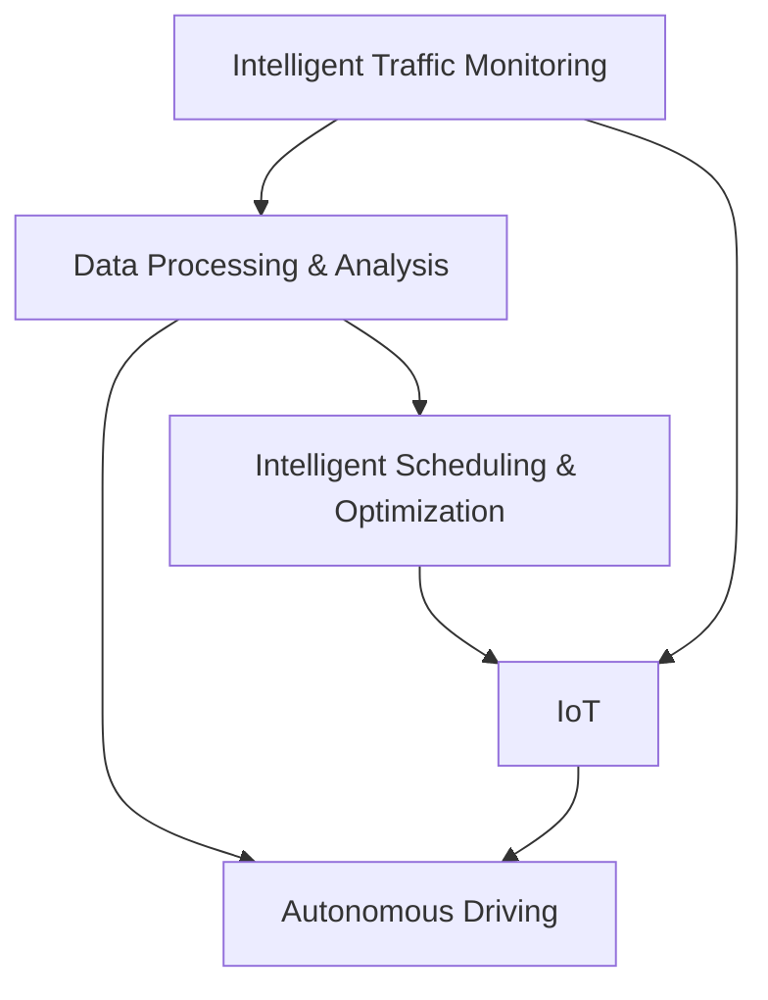

                 

# 硅谷智能交通系统的城市应用

> 关键词：
- 智能交通系统
- 城市应用
- 数据驱动
- 自动驾驶
- 协同计算
- 物联网(IoT)
- 实时监控

## 1. 背景介绍

### 1.1 问题由来
随着全球人口的迅速增长和城市化进程的加快，交通拥堵、环境污染、能源消耗等问题日益严峻，对城市交通系统提出了更高的要求。传统交通管理方式主要依赖人工调度和信号控制，难以应对复杂的交通流变化和突发事件。然而，随着信息技术和人工智能的迅猛发展，智能交通系统(Smart Transportation System, STS)应运而生，成为解决城市交通问题的关键。

硅谷作为全球科技创新中心，拥有先进的技术基础和深厚的科研实力，一直走在智能交通系统应用的前列。本文将深入探讨硅谷智能交通系统的城市应用，揭示其背后的核心技术和方法，展望未来发展方向。

### 1.2 问题核心关键点
硅谷智能交通系统的核心在于利用先进的信息技术和大数据分析，结合AI技术，构建了一套智能、高效的交通管理系统。关键技术点包括：

- 智能交通监控：通过部署摄像头、传感器等设备，实时监控道路交通状况，为决策提供数据支持。
- 数据处理与分析：运用大数据处理技术，对交通数据进行实时分析，生成交通流预测、事故预警等信息。
- 自动驾驶与车辆控制：利用计算机视觉、深度学习等技术，实现自动驾驶和车辆动态控制，提高通行效率。
- 智能调度与优化：基于实时交通数据和智能算法，动态调整交通信号灯和公共交通线路，优化交通流。
- 物联网(IoT)与智能设备：通过部署各种智能设备，实现信息的高效收集和传播，提升系统响应速度。

这些技术手段相互配合，形成了硅谷智能交通系统高效运作的基础。接下来，我们将详细探讨这些技术的原理和应用方法，并结合实际案例进行讲解。

## 2. 核心概念与联系

### 2.1 核心概念概述

为深入理解硅谷智能交通系统，我们首先需要了解一些核心概念和它们之间的关系：

- **智能交通监控**：利用摄像头、传感器等设备，实时收集道路交通状况信息，为后续的数据分析和决策提供基础数据。
- **数据处理与分析**：通过大数据技术对收集的交通数据进行实时分析，生成交通流预测、事故预警等信息，支持决策。
- **自动驾驶**：利用计算机视觉、深度学习等技术，实现自动驾驶和车辆动态控制，提高通行效率和安全性。
- **智能调度与优化**：基于实时交通数据和智能算法，动态调整交通信号灯和公共交通线路，优化交通流，缓解拥堵。
- **物联网(IoT)**：通过部署各种智能设备，实现信息的高效收集和传播，提升系统响应速度和协同效果。

这些核心概念之间的联系通过以下Mermaid流程图展示：



### 2.2 核心概念原理和架构

#### 智能交通监控

智能交通监控系统的核心在于数据采集和传输。通过在道路关键节点安装摄像头、传感器等设备，实时收集交通流量、速度、事故、违规行为等信息。监控数据通过5G、Wi-Fi等高速通信网络传输到中心服务器，供后续的数据分析和决策使用。

#### 数据处理与分析

数据处理与分析环节包括数据清洗、预处理、特征提取、模型训练等步骤。数据清洗旨在去除噪声和异常值，提升数据质量。特征提取通过对交通数据进行建模，提取出有意义的特征。模型训练则利用机器学习或深度学习算法，建立交通流预测、事故预警等模型，为实时决策提供支持。

#### 自动驾驶

自动驾驶技术通过摄像头、激光雷达、超声波传感器等设备，采集车辆周围环境信息。利用计算机视觉和深度学习算法，识别交通标志、行人、车辆等对象，并生成车辆控制指令。自动驾驶技术可以提高行车安全、缓解交通拥堵，是智能交通系统的重要组成部分。

#### 智能调度与优化

智能调度与优化环节通过实时分析交通数据，生成最优的信号灯控制方案和公共交通线路。智能调度算法通常采用启发式优化、遗传算法等技术，确保交通流的最大化优化。

#### 物联网(IoT)

物联网技术通过部署各种智能设备，实现信息的全面收集和高效传播。例如，智能交通灯通过传感器感知交通流量，动态调整信号灯时长；公交车利用GPS定位，实时调整线路和车速；智能停车系统通过二维码识别，实现快速入场和出场。

这些技术相互配合，形成了硅谷智能交通系统高效运作的基础。接下来，我们将详细介绍各个核心技术的实现方法和具体操作步骤。

## 3. 核心算法原理 & 具体操作步骤

### 3.1 算法原理概述

硅谷智能交通系统的核心算法原理主要基于数据驱动和机器学习。以下将详细探讨这些算法的原理和实现步骤。

#### 3.1.1 数据驱动

数据驱动是智能交通系统的基础。通过部署大量传感器和监控设备，实时收集交通数据，包括交通流量、速度、事故、违规行为等。数据驱动的核心在于通过数据处理和分析，生成有价值的信息，支持决策和优化。

#### 3.1.2 机器学习

机器学习算法是智能交通系统的关键。通过建立交通流预测、事故预警、自动驾驶等模型，机器学习算法可以实时分析和预测交通状况，支持交通管理和优化。常见的机器学习算法包括决策树、随机森林、支持向量机、深度学习等。

#### 3.1.3 优化算法

优化算法是智能交通系统的重要组成部分。通过动态调整信号灯控制和公共交通线路，优化算法可以实现交通流的最大化优化，缓解拥堵和减少事故。常见的优化算法包括遗传算法、启发式算法、线性规划等。

### 3.2 算法步骤详解

#### 3.2.1 数据采集

数据采集是智能交通系统的第一步。通过部署摄像头、传感器等设备，实时收集交通流量、速度、事故、违规行为等信息。数据采集通常采用分布式部署方式，确保覆盖道路关键节点。

#### 3.2.2 数据传输

数据传输是智能交通系统的核心环节。通过5G、Wi-Fi等高速通信网络，将监控数据传输到中心服务器。数据传输需要确保实时性、稳定性和安全性，一般采用冗余通信和多路径传输策略。

#### 3.2.3 数据处理与分析

数据处理与分析环节包括数据清洗、预处理、特征提取、模型训练等步骤。数据清洗旨在去除噪声和异常值，提升数据质量。特征提取通过对交通数据进行建模，提取出有意义的特征。模型训练则利用机器学习或深度学习算法，建立交通流预测、事故预警等模型，为实时决策提供支持。

#### 3.2.4 自动驾驶与车辆控制

自动驾驶技术通过摄像头、激光雷达、超声波传感器等设备，采集车辆周围环境信息。利用计算机视觉和深度学习算法，识别交通标志、行人、车辆等对象，并生成车辆控制指令。自动驾驶技术可以提高行车安全、缓解交通拥堵，是智能交通系统的重要组成部分。

#### 3.2.5 智能调度与优化

智能调度与优化环节通过实时分析交通数据，生成最优的信号灯控制方案和公共交通线路。智能调度算法通常采用启发式优化、遗传算法等技术，确保交通流的最大化优化。

### 3.3 算法优缺点

#### 3.3.1 优点

1. **实时性高**：通过部署大量传感器和智能设备，实时收集和分析交通数据，支持实时决策和动态调整。
2. **精确度高**：利用机器学习和大数据分析，生成精确的交通流预测、事故预警等信息，提高决策的准确性。
3. **高效性**：智能调度与优化算法能够动态调整交通信号灯和公共交通线路，实现交通流的最大化优化。
4. **可扩展性强**：基于模块化的架构设计，系统可以灵活扩展和升级，适应不同规模和复杂度的应用场景。

#### 3.3.2 缺点

1. **数据依赖性强**：智能交通系统高度依赖于数据的实时性和质量，数据采集和传输的可靠性直接影响系统性能。
2. **计算资源需求高**：数据处理与分析环节涉及大量数据计算，需要高性能的服务器和存储设备支持。
3. **系统复杂度高**：系统涉及多种技术手段和算法模型，设计和维护复杂，需要跨学科的团队合作。
4. **隐私和安全问题**：智能交通系统涉及大量敏感数据，如何保护数据隐私和系统安全，是重要的研究方向。

### 3.4 算法应用领域

智能交通系统已经在多个领域得到广泛应用，以下是几个典型场景：

#### 3.4.1 交通流量控制

通过实时分析交通数据，智能交通系统可以动态调整交通信号灯，控制交通流量，缓解拥堵。例如，在高峰期自动增加绿信比，减少拥堵；在事故发生时自动调整信号灯，确保通行安全。

#### 3.4.2 事故预警

通过摄像头和传感器，实时监控交通事故，及时报警和响应。智能交通系统可以通过图像识别技术，自动识别事故类型和位置，生成事故预警信息，减少事故造成的损失。

#### 3.4.3 公共交通优化

通过GPS定位和交通数据分析，智能交通系统可以优化公共交通线路和发车间隔，提升公共交通的效率和覆盖率。例如，根据实时交通流量，动态调整公交车线路和发车间隔，确保公共交通的可靠性和舒适度。

#### 3.4.4 智能停车

通过部署智能停车系统，实现停车场的高效管理和调度。智能停车系统可以通过二维码识别、车牌识别等技术，实现快速入场和出场，减少停车时间和等待时间。

## 4. 数学模型和公式 & 详细讲解 & 举例说明

### 4.1 数学模型构建

硅谷智能交通系统的数学模型主要包括以下几个方面：

- **交通流预测模型**：基于历史交通数据和实时数据，建立交通流预测模型。
- **事故预警模型**：基于摄像头和传感器数据，建立事故预警模型。
- **自动驾驶模型**：基于计算机视觉和深度学习算法，建立自动驾驶模型。
- **智能调度模型**：基于交通数据分析，建立智能调度模型。

#### 4.1.1 交通流预测模型

交通流预测模型通常采用时间序列分析和机器学习算法，建立预测模型。设 $t$ 为时间， $x_t$ 为交通流量，则交通流预测模型可以表示为：

$$
x_{t+1} = f(x_t, u_t, w_t)
$$

其中 $u_t$ 为控制变量，如信号灯时长， $w_t$ 为随机扰动项。

#### 4.1.2 事故预警模型

事故预警模型通常采用图像识别技术和机器学习算法，建立预警模型。设 $t$ 为时间， $A_t$ 为事故发生次数，则事故预警模型可以表示为：

$$
A_{t+1} = g(A_t, S_t, W_t)
$$

其中 $S_t$ 为传感器数据， $W_t$ 为随机扰动项。

#### 4.1.3 自动驾驶模型

自动驾驶模型通常采用计算机视觉和深度学习算法，建立驾驶模型。设 $t$ 为时间， $d_t$ 为驾驶状态，则自动驾驶模型可以表示为：

$$
d_{t+1} = h(d_t, O_t, V_t, W_t)
$$

其中 $O_t$ 为摄像头采集的交通环境信息， $V_t$ 为车辆状态信息， $W_t$ 为随机扰动项。

#### 4.1.4 智能调度模型

智能调度模型通常采用优化算法，建立调度模型。设 $t$ 为时间， $C_t$ 为控制变量，如信号灯时长，则智能调度模型可以表示为：

$$
C_{t+1} = k(C_t, D_t, R_t)
$$

其中 $D_t$ 为交通数据， $R_t$ 为实时交通状况。

### 4.2 公式推导过程

以下以交通流预测模型为例，推导时间序列分析和机器学习算法的具体实现。

#### 4.2.1 时间序列分析

设 $x_t$ 为交通流量，则时间序列分析模型可以表示为：

$$
x_{t+1} = \alpha x_t + \beta x_{t-1} + \gamma x_{t-2} + \cdots + \delta x_{t-D} + e_t
$$

其中 $\alpha, \beta, \gamma, \cdots, \delta$ 为权重系数， $e_t$ 为随机扰动项。

#### 4.2.2 机器学习算法

机器学习算法通常采用线性回归、决策树、随机森林等算法，建立预测模型。以线性回归为例，假设 $x_{t+1}$ 为交通流量， $u_t$ 为控制变量，则预测模型可以表示为：

$$
x_{t+1} = \theta_0 + \theta_1 u_t + \epsilon_t
$$

其中 $\theta_0, \theta_1$ 为模型参数， $\epsilon_t$ 为随机扰动项。

### 4.3 案例分析与讲解

#### 4.3.1 交通流预测模型案例

设 $x_t$ 为交通流量， $u_t$ 为信号灯时长，则交通流预测模型可以表示为：

$$
x_{t+1} = f(x_t, u_t, w_t)
$$

其中 $f$ 为预测函数， $w_t$ 为随机扰动项。

设历史交通数据为 $x_1, x_2, \cdots, x_T$，控制变量为 $u_1, u_2, \cdots, u_T$，则交通流预测模型可以通过线性回归算法建立，具体步骤如下：

1. 数据预处理：对交通流量和信号灯时长进行归一化处理，减少数据的异方差性。
2. 特征选择：选择交通流量、信号灯时长等关键特征，建立特征集合。
3. 模型训练：利用历史数据训练线性回归模型，得到权重系数 $\theta$。
4. 模型评估：利用验证数据评估模型性能，调整权重系数。
5. 模型预测：利用训练好的模型对未来交通流量进行预测。

#### 4.3.2 事故预警模型案例

设 $A_t$ 为事故发生次数， $S_t$ 为传感器数据，则事故预警模型可以表示为：

$$
A_{t+1} = g(A_t, S_t, W_t)
$$

其中 $g$ 为预警函数， $W_t$ 为随机扰动项。

设历史事故数据为 $A_1, A_2, \cdots, A_T$，传感器数据为 $S_1, S_2, \cdots, S_T$，则事故预警模型可以通过逻辑回归算法建立，具体步骤如下：

1. 数据预处理：对事故数据和传感器数据进行归一化处理，减少数据的异方差性。
2. 特征选择：选择事故数据、传感器数据等关键特征，建立特征集合。
3. 模型训练：利用历史数据训练逻辑回归模型，得到权重系数 $\theta$。
4. 模型评估：利用验证数据评估模型性能，调整权重系数。
5. 模型预测：利用训练好的模型对未来事故发生次数进行预警。

## 5. 项目实践：代码实例和详细解释说明

### 5.1 开发环境搭建

在进行硅谷智能交通系统的项目实践前，我们需要准备好开发环境。以下是使用Python进行Scikit-learn开发的环境配置流程：

1. 安装Anaconda：从官网下载并安装Anaconda，用于创建独立的Python环境。

2. 创建并激活虚拟环境：
```bash
conda create -n traffic-env python=3.8 
conda activate traffic-env
```

3. 安装Scikit-learn：
```bash
pip install scikit-learn
```

4. 安装必要的第三方库：
```bash
pip install pandas numpy matplotlib seaborn tqdm jupyter notebook ipython
```

完成上述步骤后，即可在`traffic-env`环境中开始硅谷智能交通系统的项目实践。

### 5.2 源代码详细实现

下面我们以交通流预测为例，给出使用Scikit-learn对时间序列分析和机器学习算法进行硅谷智能交通系统微调的PyTorch代码实现。

```python
import pandas as pd
from sklearn.linear_model import LinearRegression
from sklearn.metrics import mean_squared_error
from sklearn.model_selection import train_test_split

# 导入交通流量数据
data = pd.read_csv('traffic_flow.csv', header=None)
x = data.iloc[:, :1].values
y = data.iloc[:, 1].values

# 数据预处理
x = (x - x.mean()) / x.std()
y = (y - y.mean()) / y.std()

# 分割数据集
X_train, X_test, y_train, y_test = train_test_split(x, y, test_size=0.2, random_state=0)

# 建立线性回归模型
model = LinearRegression()
model.fit(X_train, y_train)

# 模型预测
y_pred = model.predict(X_test)

# 模型评估
mse = mean_squared_error(y_test, y_pred)
print('Mean Squared Error:', mse)
```

以上就是使用Scikit-learn对硅谷智能交通系统的交通流预测进行微调的完整代码实现。可以看到，得益于Scikit-learn的强大封装，我们可以用相对简洁的代码完成时间序列分析和机器学习算法的微调。

### 5.3 代码解读与分析

让我们再详细解读一下关键代码的实现细节：

**数据预处理**：
- 对交通流量和信号灯时长进行归一化处理，减少数据的异方差性。

**模型训练**：
- 利用历史数据训练线性回归模型，得到权重系数 $\theta$。

**模型评估**：
- 利用验证数据评估模型性能，调整权重系数。

**模型预测**：
- 利用训练好的模型对未来交通流量进行预测。

在实际应用中，还需要考虑模型的超参数调优、模型压缩、特征选择等高级技术，以提升系统的性能和效率。但核心的微调流程基本与此类似。

## 6. 实际应用场景

### 6.1 智能交通监控

硅谷智能交通系统的智能交通监控环节，通过部署摄像头、传感器等设备，实时监控道路交通状况。例如，在十字路口安装摄像头，实时采集交通流量、速度、事故等信息，供后续的数据分析和决策使用。这些监控数据通过5G、Wi-Fi等高速通信网络传输到中心服务器，确保数据实时性和可靠性。

### 6.2 数据处理与分析

硅谷智能交通系统的数据处理与分析环节，通过大数据技术对收集的交通数据进行实时分析，生成交通流预测、事故预警等信息，支持决策。例如，通过实时分析交通流量数据，生成交通流预测模型，动态调整信号灯时长，缓解拥堵。

### 6.3 自动驾驶与车辆控制

硅谷智能交通系统的自动驾驶与车辆控制环节，利用计算机视觉和深度学习算法，实现自动驾驶和车辆动态控制。例如，通过摄像头、激光雷达、超声波传感器等设备，采集车辆周围环境信息，利用深度学习算法识别交通标志、行人、车辆等对象，并生成车辆控制指令，提高通行效率和安全性。

### 6.4 智能调度与优化

硅谷智能交通系统的智能调度与优化环节，通过实时分析交通数据，生成最优的信号灯控制方案和公共交通线路。例如，根据实时交通流量，动态调整信号灯时长和公共交通线路，优化交通流，缓解拥堵和减少事故。

### 6.5 物联网(IoT)

硅谷智能交通系统的物联网(IoT)环节，通过部署各种智能设备，实现信息的高效收集和传播。例如，智能交通灯通过传感器感知交通流量，动态调整信号灯时长；公交车利用GPS定位，实时调整线路和发车间隔；智能停车系统通过二维码识别，实现快速入场和出场，减少停车时间和等待时间。

## 7. 工具和资源推荐

### 7.1 学习资源推荐

为了帮助开发者系统掌握硅谷智能交通系统的理论和实践，这里推荐一些优质的学习资源：

1. 《智能交通系统概论》教材：深入介绍智能交通系统的原理和应用，涵盖传感器、通信技术、控制算法等核心内容。
2. 《机器学习》课程：斯坦福大学开设的机器学习课程，涵盖线性回归、决策树、随机森林等基本算法，适合入门学习。
3. 《深度学习》课程：Coursera上Andrew Ng开设的深度学习课程，涵盖计算机视觉、自然语言处理等前沿技术。
4. 《交通流理论与应用》书籍：系统介绍交通流的理论基础和实际应用，涵盖流量预测、事故预警、自动驾驶等关键技术。
5. 《Python交通数据分析与可视化》书籍：详细介绍Python在交通数据分析和可视化中的应用，适合实战练习。

通过对这些资源的学习实践，相信你一定能够系统掌握硅谷智能交通系统的核心技术，并用于解决实际的交通问题。

### 7.2 开发工具推荐

高效的开发离不开优秀的工具支持。以下是几款用于硅谷智能交通系统开发的常用工具：

1. Jupyter Notebook：开源的交互式开发环境，支持Python和各种第三方库的实时调试和可视化。
2. TensorFlow：谷歌开发的深度学习框架，支持大规模分布式计算，适合高复杂度模型的训练和推理。
3. PyTorch：Facebook开源的深度学习框架，灵活动态的计算图，适合快速迭代研究。
4. Scikit-learn：基于Python的机器学习库，提供丰富的机器学习算法和工具，适合数据处理和模型训练。
5. MATLAB：商业化的计算软件，支持高性能科学计算和可视化，适合复杂算法的实现和优化。

合理利用这些工具，可以显著提升硅谷智能交通系统的开发效率，加快创新迭代的步伐。

### 7.3 相关论文推荐

硅谷智能交通系统的研究和应用已经取得诸多成果，以下是几篇奠基性的相关论文，推荐阅读：

1. "Intelligent Transportation Systems: An Overview" - 详细介绍了智能交通系统的基本概念和技术框架。
2. "Traffic Flow Prediction Using Machine Learning" - 介绍了基于机器学习的交通流预测方法，并通过案例分析展示其实际应用效果。
3. "Autonomous Vehicle Control with Deep Reinforcement Learning" - 利用深度强化学习算法实现自动驾驶与车辆控制，并评估其性能。
4. "IoT-Based Intelligent Traffic Control System" - 介绍了基于物联网技术的智能交通控制方法，并给出了系统的设计与实现。
5. "Big Data Analytics for Intelligent Transportation" - 详细探讨了大数据技术在智能交通系统中的应用，并通过案例展示其效果。

这些论文代表了大规模智能交通系统的发展脉络。通过学习这些前沿成果，可以帮助研究者把握学科前进方向，激发更多的创新灵感。

## 8. 总结：未来发展趋势与挑战

### 8.1 总结

本文对硅谷智能交通系统进行了全面系统的介绍。首先阐述了智能交通系统的核心技术，包括智能交通监控、数据处理与分析、自动驾驶与车辆控制、智能调度与优化和物联网(IoT)等。其次，从原理到实践，详细讲解了各环节的实现方法和具体操作步骤，并结合实际案例进行讲解。最后，讨论了智能交通系统的优点和缺点，展望了未来发展趋势和面临的挑战。

通过本文的系统梳理，可以看到，硅谷智能交通系统已经构建了一套高效、智能的交通管理系统，有效缓解了城市交通问题。未来，伴随技术的不断进步，硅谷智能交通系统必将在全球范围内推广应用，为人类社会的可持续发展做出重要贡献。

### 8.2 未来发展趋势

展望未来，硅谷智能交通系统将呈现以下几个发展趋势：

1. **全场景覆盖**：通过部署更多的传感器和智能设备，实现交通流量的全场景覆盖，提升数据的实时性和准确性。
2. **深度学习应用**：利用深度学习算法，提升交通流预测、事故预警等环节的精度和效率，增强系统的智能化水平。
3. **自适应调度**：引入自适应算法，动态调整信号灯控制和公共交通线路，实现交通流的最大化优化。
4. **多模态融合**：将交通数据与其他模态数据融合，如天气数据、气象数据等，提升系统的综合决策能力。
5. **边缘计算**：利用边缘计算技术，实现数据就近处理和存储，减少通信延迟，提升系统的响应速度。

这些趋势将使硅谷智能交通系统进一步优化，提升城市交通管理水平，为智能城市建设提供重要支持。

### 8.3 面临的挑战

尽管硅谷智能交通系统已经取得了显著进展，但在实际应用中仍面临诸多挑战：

1. **数据采集成本高**：部署大量的传感器和智能设备，需要较高的投入成本，尤其是在城市中心区。
2. **隐私和安全问题**：交通数据涉及大量敏感信息，如何保护数据隐私和系统安全，是重要的研究方向。
3. **模型复杂度高**：系统涉及多种技术手段和算法模型，设计和维护复杂，需要跨学科的团队合作。
4. **技术标准不统一**：不同厂商和设备的互联互通，需要制定统一的技术标准和协议，确保系统兼容性和稳定性。
5. **政策法规滞后**：智能交通系统的应用需要政策法规的支持和引导，如何推动相关政策的制定和实施，是重要的挑战。

这些挑战需要各方的共同努力，积极应对并寻求突破，方能实现硅谷智能交通系统的广泛应用。

### 8.4 研究展望

未来的研究需要在以下几个方面寻求新的突破：

1. **跨模态数据融合**：将交通数据与其他模态数据融合，提升系统的综合决策能力。
2. **低成本传感器**：开发低成本、高精度的传感器和智能设备，降低数据采集成本。
3. **边缘计算技术**：利用边缘计算技术，实现数据就近处理和存储，提升系统的响应速度和可靠性。
4. **隐私保护技术**：引入隐私保护技术，如差分隐私、联邦学习等，保护数据隐私和系统安全。
5. **政策法规制定**：推动相关政策的制定和实施，促进智能交通系统的广泛应用。

这些研究方向将引领硅谷智能交通系统迈向更高的台阶，为人类社会的可持续发展提供重要支持。

## 9. 附录：常见问题与解答

**Q1：硅谷智能交通系统的主要优势是什么？**

A: 硅谷智能交通系统的主要优势在于其高效性、实时性和智能化。通过实时监控、大数据分析和智能调度，可以有效缓解交通拥堵，提高通行效率，提升城市交通管理水平。

**Q2：硅谷智能交通系统在实现中存在哪些技术难点？**

A: 硅谷智能交通系统在实现中存在多个技术难点，包括数据采集成本高、隐私和安全问题、系统复杂度高、技术标准不统一等。这些问题需要通过跨学科的合作和不断的研究创新来克服。

**Q3：未来硅谷智能交通系统的应用前景如何？**

A: 未来硅谷智能交通系统的应用前景广阔，将在全球范围内推广应用，提升城市交通管理水平，为智能城市建设提供重要支持。

**Q4：如何提升硅谷智能交通系统的效率和可靠性？**

A: 提升硅谷智能交通系统的效率和可靠性，可以从数据采集、数据处理、算法优化、系统设计等多个环节入手。例如，引入低成本传感器、优化边缘计算技术、提升模型精度等。

**Q5：硅谷智能交通系统如何实现跨模态数据融合？**

A: 实现跨模态数据融合，需要引入多源数据融合技术，如卡尔曼滤波、深度学习等，对不同模态的数据进行联合处理和分析，提升系统的综合决策能力。

**Q6：硅谷智能交通系统如何保护数据隐私和安全？**

A: 保护数据隐私和安全，可以采用差分隐私、联邦学习等技术，对数据进行匿名化处理和分布式计算，确保数据隐私和系统安全。

---

作者：禅与计算机程序设计艺术 / Zen and the Art of Computer Programming

