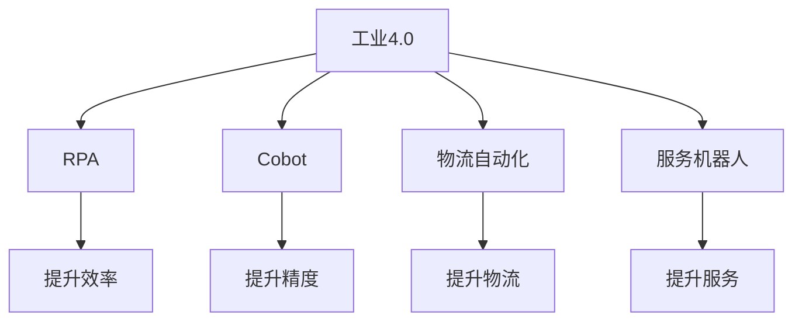

                 

# 硅谷机器人服务业的发展趋势

> 关键词：机器人服务业, 人工智能, 自动化, 工业4.0, 机器人流程自动化(RPA), 协作机器人, 物流自动化

## 1. 背景介绍

### 1.1 问题由来
随着科技的快速进步，特别是人工智能和机器学习技术的突飞猛进，硅谷的科技巨头们纷纷将机器人服务业作为下一阶段的战略重点。亚马逊、谷歌、苹果、微软等公司都在积极布局机器人产业，希望通过机器人来改变生产流程、提升服务效率、降低人力成本。

### 1.2 问题核心关键点
机器人服务业涵盖了从工业自动化到服务机器人（如无人机、配送机器人）等多个领域。其核心关键点包括：

- 机器人流程自动化（RPA）：通过软件机器人代替人工完成重复性、高危和高强度的任务，提高工作效率。
- 协作机器人：在生产线上与人类工人协作，执行复杂、高精度的工作。
- 物流自动化：通过机器人完成仓库管理、配送等工作，提升物流效率。
- 服务机器人：在医疗、教育、客服等行业提供自动化服务，提升用户体验。

这些技术不仅能改善企业的生产效率和经营质量，还将对社会和经济带来深远影响。

### 1.3 问题研究意义
研究硅谷机器人服务业的发展趋势，对于把握未来科技发展方向、推动产业升级、改善社会福祉具有重要意义：

1. **提升生产效率**：机器人可以24小时不间断工作，大幅提升生产效率，降低人力成本。
2. **改善工作环境**：机器人从事高危、高强度工作，能够保护员工安全，改善工作环境。
3. **促进社会创新**：机器人技术推动了工业4.0的发展，催生了新的产业模式和商业模式。
4. **增强服务质量**：在医疗、教育等行业，机器人提供精准、及时的服务，提升用户体验。
5. **推动经济增长**：机器人服务业将带动上下游产业链的发展，增加就业机会，促进经济增长。

本文将从多个维度深入分析硅谷机器人服务业的发展趋势，为行业从业者、投资者和政策制定者提供参考。

## 2. 核心概念与联系

### 2.1 核心概念概述

为更好地理解硅谷机器人服务业的发展趋势，本节将介绍几个关键概念：

- **工业4.0**：指通过信息技术和自动化技术，实现工厂的数字化、网络化、智能化和自动化，提升生产效率和质量。
- **机器人流程自动化（RPA）**：使用软件机器人自动执行重复性任务，提高工作效率和准确性。
- **协作机器人（Collaborative Robotics, Cobot）**：在工业生产线上与人类工人协作完成复杂任务，提高生产精度和灵活性。
- **物流自动化**：通过机器人完成仓库管理、运输和配送等工作，提升物流效率和准确性。
- **服务机器人**：在医疗、教育、客服等领域提供自动化服务，提升服务效率和质量。

这些概念之间的逻辑关系可以通过以下Mermaid流程图来展示：



这个流程图展示了一些核心概念及其之间的联系：

1. 工业4.0是大背景，驱动了RPA、Cobot、物流自动化和服务机器人等技术的发展。
2. RPA、Cobot、物流自动化和服务机器人分别在各自领域提升效率、精度、物流效率和服务质量。
3. 这些技术共同推动了制造业、服务业等领域的数字化转型，提高了整体经济效率。

## 3. 核心算法原理 & 具体操作步骤
### 3.1 算法原理概述

硅谷机器人服务业的发展，本质上是一个技术创新和商业应用结合的过程。其核心算法原理包括：

- **机器学习**：用于训练机器人执行任务的模型，如路径规划、目标检测、语音识别等。
- **自然语言处理（NLP）**：使机器人能够理解并执行基于自然语言的任务，如客服、教育等。
- **计算机视觉**：使机器人能够通过图像识别和处理，执行视觉导向的任务，如仓库管理、医疗影像分析等。
- **控制系统设计**：用于设计和实现机器人与环境、设备的交互，如机器人路径规划、运动控制等。

这些技术共同构成了硅谷机器人服务业的核心算法框架，推动了机器人在各个领域的广泛应用。

### 3.2 算法步骤详解

硅谷机器人服务业的发展步骤包括：

1. **需求分析**：根据企业或行业需求，确定机器人可以执行的具体任务。
2. **技术选型**：选择合适的机器人平台、硬件和软件解决方案。
3. **系统设计**：设计机器人的硬件配置、软件架构和功能模块。
4. **模型训练**：使用机器学习算法训练机器人执行任务的模型。
5. **系统集成**：将机器人与企业的现有系统进行集成，实现数据共享和协同工作。
6. **系统测试和优化**：在实际场景中测试机器人系统，根据反馈进行优化和调整。
7. **部署和维护**：将机器人系统部署到生产环境中，进行持续监控和维护。

### 3.3 算法优缺点

硅谷机器人服务业的技术和应用存在以下优缺点：

#### 优点
1. **提高生产效率**：机器人可以24小时不间断工作，减少停机时间和人工成本，提高生产效率。
2. **提升服务质量**：机器人能够执行高精度、高一致性的任务，提升服务质量。
3. **改善工作环境**：机器人从事高危、高强度工作，保护员工安全，改善工作环境。
4. **推动自动化升级**：机器人技术推动了工业4.0的发展，促进产业升级。
5. **降低运营成本**：机器人替代人工处理复杂任务，降低了企业的运营成本。

#### 缺点
1. **初始投资高**：机器人的购买、部署和维护成本较高，对中小企业可能构成负担。
2. **技术复杂性**：机器人系统的设计和集成需要较高的技术门槛，对技术人才的需求大。
3. **数据隐私和安全**：机器人处理大量数据，需要严格的隐私保护和安全措施。
4. **工作取代风险**：机器人自动化可能导致部分岗位被取代，引发就业和社会问题。

### 3.4 算法应用领域

硅谷机器人服务业的应用领域广泛，主要包括：

- **制造业**：自动化生产线的协作机器人、零件搬运机器人、焊接机器人等。
- **医疗行业**：手术机器人、药物分拣机器人、患者护理机器人等。
- **物流行业**：仓库自动化、配送机器人、货物搬运机器人等。
- **服务业**：客服机器人、教育机器人、餐饮配送机器人等。

这些应用领域涵盖了从生产制造到日常生活各个方面，展现了机器人服务业的广阔前景。

## 4. 数学模型和公式 & 详细讲解 & 举例说明

### 4.1 数学模型构建

本节将使用数学语言对硅谷机器人服务业的发展进行严格建模。

假设企业有N个机器人，每个机器人在任务执行中面临的随机因素为X，机器人的执行精度为Y，任务的成功概率为P。则数学模型可以表示为：

$$ P = f(X, Y) $$

其中，f为机器学习模型，X和Y为输入数据，P为输出结果。

### 4.2 公式推导过程

根据上式，我们可以推导出：

1. 当输入数据X为任务描述时，机器人执行精度Y可以通过训练好的模型预测。
2. 当输入数据X为机器人传感器数据时，机器人的执行效果P可以直接通过传感器数据计算得到。
3. 当输入数据X为环境数据时，机器人的任务成功率P可以通过传感器和执行模型的结合得到。

### 4.3 案例分析与讲解

假设某公司生产线上需要安装协作机器人来执行装配任务。每个机器人的执行时间、装配精度和环境因素均可能影响任务的完成情况。

1. **模型训练**：使用历史装配数据训练机器学习模型，预测每个机器人的装配精度。
2. **传感器数据**：安装机器人传感器，实时监测装配环境的温度、湿度、光照等参数，作为模型的输入。
3. **任务执行**：机器人根据传感器数据和模型预测结果，执行装配任务，并在完成后反馈结果。

通过以上步骤，机器人能够高效、准确地完成装配任务，同时系统能够不断学习优化，提升整体生产效率。

## 5. 项目实践：代码实例和详细解释说明
### 5.1 开发环境搭建

在进行机器人服务业项目实践前，我们需要准备好开发环境。以下是使用Python进行PyTorch开发的环境配置流程：

1. 安装Anaconda：从官网下载并安装Anaconda，用于创建独立的Python环境。

2. 创建并激活虚拟环境：
```bash
conda create -n pytorch-env python=3.8 
conda activate pytorch-env
```

3. 安装PyTorch：根据CUDA版本，从官网获取对应的安装命令。例如：
```bash
conda install pytorch torchvision torchaudio cudatoolkit=11.1 -c pytorch -c conda-forge
```

4. 安装各类工具包：
```bash
pip install numpy pandas scikit-learn matplotlib tqdm jupyter notebook ipython
```

完成上述步骤后，即可在`pytorch-env`环境中开始项目实践。

### 5.2 源代码详细实现

这里我们以协作机器人路径规划为例，给出使用PyTorch进行路径规划的PyTorch代码实现。

首先，定义路径规划问题的数学模型：

```python
import torch
import torch.nn as nn
import torch.optim as optim

class PathPlanningModel(nn.Module):
    def __init__(self, input_dim, output_dim):
        super(PathPlanningModel, self).__init__()
        self.fc1 = nn.Linear(input_dim, 128)
        self.fc2 = nn.Linear(128, 64)
        self.fc3 = nn.Linear(64, output_dim)
        
    def forward(self, x):
        x = torch.relu(self.fc1(x))
        x = torch.relu(self.fc2(x))
        x = self.fc3(x)
        return x
```

然后，定义训练数据和标签：

```python
x_train = torch.randn(100, 8)  # 输入数据
y_train = torch.randn(100, 4)  # 目标数据
```

接着，定义损失函数和优化器：

```python
criterion = nn.MSELoss()
optimizer = optim.Adam(model.parameters(), lr=0.001)
```

最后，执行训练流程：

```python
for epoch in range(100):
    optimizer.zero_grad()
    y_pred = model(x_train)
    loss = criterion(y_pred, y_train)
    loss.backward()
    optimizer.step()
    print(f'Epoch {epoch+1}, Loss: {loss.item()}')
```

### 5.3 代码解读与分析

让我们再详细解读一下关键代码的实现细节：

**PathPlanningModel类**：
- `__init__`方法：初始化模型参数，包括三个全连接层。
- `forward`方法：定义前向传播计算过程，经过三次线性变换后输出结果。

**训练数据和标签**：
- `x_train`：定义随机生成的输入数据，维度为(100, 8)。
- `y_train`：定义随机生成的目标数据，维度为(100, 4)。

**损失函数和优化器**：
- `criterion`：定义均方误差损失函数，用于衡量模型预测和真实标签之间的差异。
- `optimizer`：定义Adam优化器，学习率为0.001。

**训练流程**：
- `optimizer.zero_grad()`：清空优化器梯度。
- `y_pred = model(x_train)`：模型前向传播计算预测结果。
- `loss = criterion(y_pred, y_train)`：计算损失函数值。
- `loss.backward()`：反向传播计算梯度。
- `optimizer.step()`：更新模型参数。

以上代码展示了如何使用PyTorch进行协作机器人路径规划的简单实现。在实际项目中，还需要考虑更多的场景和因素，如传感器数据的处理、机器人运动模型的建立等。

## 6. 实际应用场景
### 6.1 工业自动化

在制造业中，协作机器人被广泛应用于自动化生产线上。通过对生产数据和机器人传感器数据的分析，协作机器人可以自动规划最优路径，完成复杂装配任务，提高生产效率和精度。

例如，某汽车工厂使用协作机器人进行发动机装配。机器人通过实时监测传感器数据，自动调整装配参数，确保每台发动机的高精度装配。同时，机器人系统能够不断学习优化，提升整体装配质量。

### 6.2 医疗机器人

在医疗领域，机器人被用于手术、药物分拣、患者护理等任务。通过与医生的协作，机器人能够执行高精度、高安全性手术，提高患者康复效果。

例如，某医院使用手术机器人辅助医生进行微创手术。机器人通过传感器实时监测患者生理指标和手术进程，自动调整手术参数，确保手术精准无误。同时，机器人系统能够记录手术数据，帮助医生进行术后分析和教学。

### 6.3 物流自动化

在物流行业，机器人被用于仓库管理、配送等任务。通过对仓库数据和机器人传感器数据的分析，机器人能够自动规划货物搬运路径，提高物流效率和准确性。

例如，某电商公司使用配送机器人进行仓储管理。机器人通过实时监测传感器数据，自动规划最优路径，完成货物的入库和出库，减少人工操作，提高仓储效率。同时，机器人系统能够记录物流数据，优化仓储管理策略。

### 6.4 服务业机器人

在服务业中，机器人被用于客服、教育、餐饮等任务。通过与用户的互动，机器人能够提供个性化服务，提升用户体验。

例如，某银行使用客服机器人进行客户咨询。机器人通过自然语言处理技术，理解用户的问题，自动提供精准的解决方案，减少等待时间和人工成本。同时，机器人系统能够记录用户咨询数据，优化客服策略。

### 6.5 未来应用展望

随着科技的不断进步，硅谷机器人服务业将迎来更多创新和发展：

1. **智能协同**：未来机器人将更加智能化，能够自主规划任务、与人类协作，提升整体效率。
2. **多模态融合**：机器人将融合视觉、听觉、触觉等多模态信息，提升环境感知能力。
3. **人机交互**：未来机器人将具备更自然的人机交互方式，如语音识别、自然语言生成等，提升用户体验。
4. **自主决策**：未来机器人将具备自主决策能力，能够在复杂场景中自主选择最优路径和任务。
5. **跨领域应用**：机器人将广泛应用于更多领域，如农业、环保、公共安全等，推动各行各业数字化转型。

## 7. 工具和资源推荐
### 7.1 学习资源推荐

为了帮助开发者系统掌握机器人服务业的发展，这里推荐一些优质的学习资源：

1. **《机器人学》课程**：斯坦福大学开设的机器人学课程，介绍了机器人系统设计、控制和应用。
2. **《工业机器人与自动化》书籍**：详细介绍了工业机器人的应用和设计原理。
3. **《机器人编程与控制》书籍**：介绍了机器人编程技术和控制算法。
4. **ROS（Robot Operating System）**：开源机器人操作系统，提供了丰富的机器人开发工具和资源。
5. **Udacity机器人编程纳米学位**：提供机器人编程和控制实战课程，实践性强。

通过对这些资源的学习实践，相信你一定能够快速掌握机器人服务业的精髓，并用于解决实际的机器人应用问题。

### 7.2 开发工具推荐

高效的开发离不开优秀的工具支持。以下是几款用于机器人服务业开发的常用工具：

1. **ROS**：开源机器人操作系统，提供了丰富的机器人开发工具和资源。
2. **Gazebo**：虚拟仿真平台，用于模拟和测试机器人系统。
3. **Rviz**：机器人可视化工具，用于实时监控机器人状态。
4. **Kinect**：人体姿态传感器，用于机器人人机交互。
5. **TensorFlow**：深度学习框架，用于机器人路径规划和决策。

合理利用这些工具，可以显著提升机器人服务业的开发效率，加快创新迭代的步伐。

### 7.3 相关论文推荐

机器人服务业的发展得益于众多学者的不断探索和研究。以下是几篇奠基性的相关论文，推荐阅读：

1. **"Robot Motion Planning: A Survey"**：介绍了机器人路径规划算法，涵盖了多种路径规划方法。
2. **"Human-Robot Collaboration"**：介绍了人机协作的原理和应用，研究了人机协同系统的设计。
3. **"Autonomous Mobile Robots: The Case of DARPA's Urban Challenge"**：介绍了自动驾驶机器人的发展历程和应用前景。
4. **"Robotics in Healthcare: A Review"**：介绍了机器人医疗应用，涵盖了手术、药物分拣、患者护理等多个方面。
5. **"Robotics in Manufacturing: Trends and Challenges"**：介绍了工业机器人的应用现状和未来发展趋势。

这些论文代表了大规模机器人服务业的发展脉络。通过学习这些前沿成果，可以帮助研究者把握学科前进方向，激发更多的创新灵感。

## 8. 总结：未来发展趋势与挑战
### 8.1 总结

本文对硅谷机器人服务业的发展进行了全面系统的介绍。首先阐述了机器人服务业的发展背景和重要意义，明确了机器人在工业自动化、医疗、物流、服务业等领域的广泛应用前景。其次，从原理到实践，详细讲解了机器人的核心算法和操作步骤，给出了机器人路径规划的完整代码实现。同时，本文还广泛探讨了机器人服务业在各个行业领域的应用前景，展示了机器人服务业的广阔前景。

通过本文的系统梳理，可以看到，硅谷机器人服务业已经取得了显著的进展，正在不断拓展其应用边界，推动各行各业的数字化转型。未来，伴随机器人技术的持续演进，硅谷机器人服务业必将在更多领域大放异彩。

### 8.2 未来发展趋势

展望未来，硅谷机器人服务业的发展趋势包括：

1. **技术进步**：机器学习、自然语言处理、计算机视觉等技术将进一步提升机器人系统的智能化水平。
2. **产业融合**：机器人技术将与其他新兴技术，如区块链、物联网等进行融合，提升整体系统性能。
3. **人机协同**：未来机器人将更加智能化，能够自主规划任务、与人类协作，提升整体效率。
4. **多模态融合**：机器人将融合视觉、听觉、触觉等多模态信息，提升环境感知能力。
5. **跨领域应用**：机器人将广泛应用于更多领域，如农业、环保、公共安全等，推动各行各业数字化转型。

以上趋势凸显了硅谷机器人服务业的技术潜力和市场前景。这些方向的探索发展，必将进一步提升机器人系统的性能和应用范围，为各行各业带来深刻变革。

### 8.3 面临的挑战

尽管硅谷机器人服务业已经取得了瞩目成就，但在迈向更加智能化、普适化应用的过程中，它仍面临着诸多挑战：

1. **成本高昂**：机器人的购买、部署和维护成本较高，对中小企业可能构成负担。
2. **技术门槛高**：机器人系统的设计和集成需要较高的技术门槛，对技术人才的需求大。
3. **数据隐私和安全**：机器人处理大量数据，需要严格的隐私保护和安全措施。
4. **工作取代风险**：机器人自动化可能导致部分岗位被取代，引发就业和社会问题。
5. **法规和伦理**：机器人的应用需要符合法律法规，同时需考虑伦理问题，如责任归属、隐私保护等。

### 8.4 研究展望

面对硅谷机器人服务业面临的挑战，未来的研究需要在以下几个方面寻求新的突破：

1. **降低成本**：开发低成本、高效能的机器人平台，降低中小企业使用门槛。
2. **提升技术门槛**：开发易于使用的机器人开发工具和框架，降低技术门槛，吸引更多开发者参与。
3. **保障隐私和安全**：设计数据隐私保护和安全的机制，确保数据不被滥用。
4. **解决就业问题**：开发机器人辅助工具，帮助被取代的员工转型，避免社会问题。
5. **完善法规和伦理**：制定和完善机器人应用的法律法规和伦理标准，确保机器人应用的安全性和合法性。

这些研究方向的探索，必将引领硅谷机器人服务业走向成熟，推动机器人技术在更广泛领域的应用，为人类社会带来深刻变革。

## 9. 附录：常见问题与解答

**Q1：机器人服务业是否适用于所有行业？**

A: 机器人服务业在制造业、医疗、物流、服务业等许多领域都有广泛的应用前景。但对于一些特定行业，如农业、艺术、手工艺等，机器人的应用可能面临技术上的困难和现实上的限制。

**Q2：机器人自动化是否会取代人类工作？**

A: 机器人自动化确实可能导致部分岗位被取代，但同时也会创造新的就业机会。例如，机器人维护、编程、数据处理等工作需求增加。企业可以通过培训和转型，帮助被取代的员工适应新的工作环境。

**Q3：机器人系统如何进行数据隐私保护？**

A: 机器人系统需要设计数据隐私保护机制，确保数据不被滥用。可以通过数据匿名化、访问控制、加密传输等措施，保护用户隐私。

**Q4：机器人系统如何提高人机协同效率？**

A: 机器人系统需要与人类协同工作，可以通过设计合理的交互界面、智能助手、自主决策机制等，提高人机协同效率。同时，机器人需要具备一定的自主决策能力，能够根据环境变化自主调整任务执行。

**Q5：机器人系统如何进行自我维护？**

A: 机器人系统需要进行自我维护，定期检查传感器、执行器等关键部件，发现故障及时修复。可以通过设计自诊断系统、远程监控等措施，实现机器人系统的自我维护。

---

作者：禅与计算机程序设计艺术 / Zen and the Art of Computer Programming

