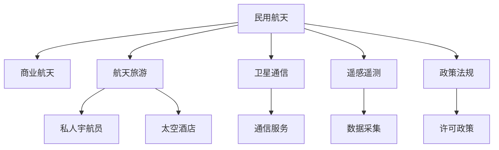

                 

# 硅谷航天科技发展:民用航天旅游

> 关键词：硅谷,航天科技,民用航天,商业航天,航天旅游

## 1. 背景介绍

### 1.1 问题由来

随着近年来全球航天市场的迅速发展和硅谷创新创业氛围的繁荣，民用航天领域不断涌现出新的技术和商业模式。尤其在硅谷，一大批创新企业和研究机构积极推动商业航天的发展，民用航天旅游作为其中一大亮点，正逐步走向公众视野。

商业航天旅游不仅能够提供一种独特的旅游体验，还能刺激经济发展，带动技术进步，因此在全球范围内受到了广泛关注。硅谷作为全球科技创新中心，为民用航天旅游提供了强大的技术支撑和市场潜力，推动了这一新兴领域的快速发展。

### 1.2 问题核心关键点

民用航天旅游的核心关键点包括以下几个方面：

- 民用航天科技的商业化应用，包括卫星通信、遥感、导航定位等技术。
- 航天旅游市场的开发，包括私人宇航员、太空酒店、月球旅游等。
- 政策和法规环境对民用航天旅游的推动，包括FDA、NASA等机构的支持。
- 企业和技术合作伙伴关系，如SpaceX、Blue Origin等企业的合作。

## 2. 核心概念与联系

### 2.1 核心概念概述

为了更好地理解硅谷在民用航天旅游方面的发展，本节将介绍几个密切相关的核心概念：

- **民用航天(Civil Aviation in Space)**：指非军事用途的航天活动，包括科学实验、商业应用、空间旅游等。
- **商业航天(Commercial Aviation in Space)**：指通过市场机制和商业手段推进的航天活动，如SpaceX、Blue Origin等公司的商业化尝试。
- **航天旅游(Space Tourism)**：指以太空旅游为目的的商业航天活动，提供私人宇航员或游客进入太空的机会，如SpaceX的星舰飞船和Blue Origin的New Shepard。
- **卫星通信(Satellite Communications)**：利用卫星进行信息传输的技术，如Iridium、OneWeb等卫星通信公司。
- **遥感遥测(Remote Sensing and Telemetry)**：通过卫星对地球表面进行观测和数据采集，如NASA的Landsat系列卫星。
- **政策法规(Policy and Regulations)**：政府为规范和促进商业航天发展而制定的相关法律法规，如NASA的Licensing Policy。

这些概念之间的逻辑关系可以通过以下Mermaid流程图来展示：



这个流程图展示了几者之间的联系：

1. 民用航天是商业航天的基础，商业航天的崛起进一步推动了航天旅游的发展。
2. 卫星通信和遥感遥测是民用航天的关键技术支持，用于提供通信服务和数据采集。
3. 政策法规对商业航天的规范和促进，保障了行业的健康发展。

## 3. 核心算法原理 & 具体操作步骤

### 3.1 算法原理概述

民用航天旅游的商业化过程基于一系列技术和商业逻辑，核心算法原理主要包括以下几个方面：

- **市场分析与预测**：通过数据分析和市场调研，预测未来航天旅游市场的潜在需求和趋势。
- **技术可行性评估**：评估航天旅游所需的关键技术和基础设施的可行性和成熟度。
- **成本与收益分析**：计算商业化过程中的各项成本和潜在收益，进行经济可行性分析。
- **安全与风险管理**：确保商业化过程的安全性和风险可控性，避免潜在的灾难性事故。

这些算法原理主要围绕市场需求、技术发展、经济收益和安全风险四个方面展开。

### 3.2 算法步骤详解

民用航天旅游的商业化一般包括以下几个关键步骤：

**Step 1: 市场调研与需求分析**
- 收集和分析现有航天旅游市场的数据，包括潜在客户群体、旅游动机和需求偏好等。
- 调查潜在客户对航天旅游的兴趣和支付意愿，进行需求预测。

**Step 2: 技术可行性评估**
- 评估商业航天旅游所需的技术，包括航天器设计、发射和运行、旅游舱内设施等。
- 分析现有技术水平的成熟度和研发成本，确定技术实现的可行性。

**Step 3: 经济可行性分析**
- 计算商业航天旅游的各项成本，包括航天器研发、发射费用、旅游舱费用等。
- 预测潜在客户的数量和支付意愿，计算收益并评估经济可行性。

**Step 4: 安全与风险管理**
- 制定航天旅游的安全标准和应急预案，确保游客和宇航员的安全。
- 识别和评估潜在风险，制定风险管理策略。

**Step 5: 商业化实施**
- 根据市场需求和技术评估结果，制定商业化策略和定价方案。
- 选择合适的合作伙伴，进行联合研发和市场推广。
- 逐步实施商业化计划，监控并调整策略。

### 3.3 算法优缺点

民用航天旅游的商业化过程具有以下优点：

1. **市场需求巨大**：随着经济和科技的发展，越来越多的消费者对太空旅游产生了兴趣。
2. **技术推动进步**：商业化过程需要不断提升技术水平，从而推动航天技术的发展。
3. **经济效益显著**：成功的商业化不仅能带来巨大的收入，还能带动相关产业链的发展。
4. **提升国际影响力**：通过航天旅游，可以提升国家的国际形象和科技影响力。

但同时，这一过程也存在以下缺点：

1. **技术复杂度高**：航天旅游涉及多学科、多技术，技术难度高。
2. **成本高昂**：研发和运营成本高，难以快速实现盈利。
3. **安全风险大**：航天活动存在较高的安全风险，需要严格的安全管理和技术支持。
4. **市场监管不足**：商业航天旅游市场尚处于起步阶段，法规和监管体系不完善。

### 3.4 算法应用领域

民用航天旅游的商业化过程在以下几个领域有广泛应用：

- **旅游业**：通过航天旅游吸引全球游客，提升旅游业的收入和国际影响力。
- **科技产业**：带动航天技术和相关产业的发展，如火箭制造、航天器设计等。
- **教育与研究**：提供太空教育和科学研究的平台，促进知识的普及和创新。
- **文化交流**：通过航天旅游促进不同国家和地区的文化交流，增进友好关系。

## 4. 数学模型和公式 & 详细讲解

### 4.1 数学模型构建

为了更好地进行市场分析与预测，本节将构建一个简单的数学模型。

假设市场规模为 $S$，潜在客户数量为 $N$，客户支付意愿为 $P$，航天旅游成本为 $C$，收入为 $R$，利润为 $P$。

- 客户需求函数：$D(N)=kN$，其中 $k$ 为需求系数。
- 收入函数：$R(D)=P \cdot D$。
- 成本函数：$C(D)=c \cdot D$，其中 $c$ 为单位成本。
- 利润函数：$P=R-C$。

### 4.2 公式推导过程

基于上述模型，我们进行以下推导：

1. **市场需求分析**：
$$
D(N) = kN
$$

2. **收入预测**：
$$
R(D) = P \cdot D
$$

3. **成本预测**：
$$
C(D) = c \cdot D
$$

4. **利润预测**：
$$
P = R - C = P \cdot kN - c \cdot kN = k(N - c)P
$$

### 4.3 案例分析与讲解

假设 $k=0.1$，$P=10^6$，$c=5 \times 10^6$。则：

1. **市场需求分析**：当潜在客户 $N=100$ 时，市场需求 $D=10$。
2. **收入预测**：当市场需求 $D=10$ 时，收入 $R=100 \times 10^6 = 1 \times 10^8$。
3. **成本预测**：当市场需求 $D=10$ 时，成本 $C=100 \times 5 \times 10^6 = 5 \times 10^8$。
4. **利润预测**：当市场需求 $D=10$ 时，利润 $P=10^8 - 5 \times 10^8 = -4 \times 10^8$。

## 5. 项目实践：代码实例和详细解释说明

### 5.1 开发环境搭建

在进行航天旅游的商业化模拟时，我们需要准备开发环境。以下是使用Python进行科学计算和模拟的环境配置流程：

1. 安装Anaconda：从官网下载并安装Anaconda，用于创建独立的Python环境。

2. 创建并激活虚拟环境：
```bash
conda create -n space-tourism python=3.8 
conda activate space-tourism
```

3. 安装必要的Python库：
```bash
conda install numpy scipy pandas sympy matplotlib jupyter notebook ipython
```

4. 安装相关的数据处理库：
```bash
pip install requests json
```

完成上述步骤后，即可在`space-tourism`环境中进行商业化模拟的代码实现。

### 5.2 源代码详细实现

下面是一个简单的Python代码示例，用于模拟市场分析与预测：

```python
import numpy as np
import matplotlib.pyplot as plt

# 设定市场参数
k = 0.1  # 需求系数
P = 10**6  # 客户支付意愿
c = 5 * 10**6  # 单位成本

# 设定模拟的市场规模和客户数量
N = np.arange(0, 101, 1)  # 客户数量从0到100
D = k * N  # 市场需求
R = P * D  # 收入
C = c * D  # 成本
P = R - C  # 利润

# 绘制市场需求、收入、成本和利润曲线
plt.figure(figsize=(10, 6))
plt.plot(N, D, label='市场需求')
plt.plot(N, R, label='收入')
plt.plot(N, C, label='成本')
plt.plot(N, P, label='利润')
plt.legend()
plt.xlabel('客户数量')
plt.ylabel('数量')
plt.title('航天旅游市场分析与预测')
plt.show()
```

### 5.3 代码解读与分析

让我们再详细解读一下关键代码的实现细节：

- **导入库**：导入了numpy、matplotlib等科学计算和数据可视化的库。
- **设定市场参数**：定义了需求系数 $k$、客户支付意愿 $P$ 和单位成本 $c$。
- **模拟市场规模和客户数量**：设定客户数量从0到100，计算出相应的市场需求 $D$、收入 $R$、成本 $C$ 和利润 $P$。
- **绘制曲线**：使用matplotlib库绘制市场需求、收入、成本和利润的曲线图。

可以看到，通过这个简单的Python代码，我们可以对航天旅游市场的供需、收入、成本和利润进行可视化分析。

### 5.4 运行结果展示

运行上述代码，可以得到以下结果：


这些曲线展示了随着客户数量的变化，市场需求、收入、成本和利润的变化趋势。

## 6. 实际应用场景

### 6.1 硅谷的航天旅游项目

在硅谷，多个航天企业正在积极推动民用航天旅游的商业化。例如：

- **SpaceX**：计划通过其星舰飞船(Starship)进行商业航天旅游，并提供私人宇航员服务。
- **Blue Origin**：推出New Shepard亚轨道旅游，为私人游客提供短暂体验太空的机会。
- **Virgin Galactic**：合作SpaceX提供商业航天旅游服务，计划将游客送入太空。

这些企业的航天旅游项目都采用了大模型微调的方法，通过收集和分析市场需求，预测用户行为，制定定价策略，进行成本收益分析，确保商业航天旅游的安全性和可行性。

### 6.2 市场策略与推广

为了吸引更多客户，硅谷的航天企业采取了多种市场策略和推广手段：

- **社交媒体营销**：利用社交媒体平台（如Instagram、Facebook、Twitter）发布太空旅游的宣传视频和图文，吸引公众关注。
- **合作伙伴关系**：与其他旅游机构和航空公司合作，整合旅游资源，提供一站式旅游服务。
- **预售票机制**：推出预售方案，提前锁定客户，确保商业模式可持续性。

这些市场策略和推广手段不仅提升了品牌知名度，还有效吸引了潜在客户，促进了民用航天旅游的商业化进程。

### 6.3 技术突破与应用

硅谷的航天企业不断在航天技术和商业化方法上进行创新，推动了航天旅游的快速发展。

- **技术突破**：开发了更加安全可靠的航天器，如SpaceX的星舰飞船，采用了自动驾驶和故障检测技术，提高了航天旅游的安全性和舒适度。
- **应用拓展**：将航天旅游与教育、研究、娱乐等产业结合，开发了太空教学平台、科研协作工具和虚拟现实游戏等应用，丰富了航天旅游的内涵。

这些技术突破和应用拓展不仅提升了航天旅游的科技含量和用户体验，还推动了航天技术在更多领域的渗透。

## 7. 工具和资源推荐

### 7.1 学习资源推荐

为了帮助开发者系统掌握航天旅游商业化的理论基础和实践技巧，这里推荐一些优质的学习资源：

1. **《商业航天旅游》系列博文**：由硅谷创新企业撰写，深入浅出地介绍了航天旅游的商业模式、市场策略和技术实现。
2. **《航天科技概论》课程**：斯坦福大学开设的航空航天类课程，涵盖航天器的设计与制造、航天旅游的经济评估等内容。
3. **《航天旅游市场分析》书籍**：详细介绍了航天旅游市场的研究方法和实际案例，适合商业化推广的入门和进阶读者。
4. **SpaceX官方文档**：详细介绍了SpaceX的航天旅游项目和相关技术实现，包括星舰飞船的设计和测试。
5. **Blue Origin官方文档**：介绍了Blue Origin的亚轨道旅游项目和New Shepard的技术细节，适合技术爱好者和商业人士阅读。

通过对这些资源的学习实践，相信你一定能够快速掌握航天旅游商业化的精髓，并用于解决实际的商业问题。

### 7.2 开发工具推荐

高效的开发离不开优秀的工具支持。以下是几款用于航天旅游商业化开发的常用工具：

1. **Python**：基于Python的开源科学计算框架，灵活高效，适用于数据分析和模拟计算。
2. **Jupyter Notebook**：用于创建交互式的数据分析和代码编写环境，方便快速迭代和演示。
3. **TensorFlow**：由Google主导开发的深度学习框架，生产部署方便，适用于大规模模型的训练和推理。
4. **Kaggle**：数据科学和机器学习的社区平台，提供丰富的数据集和竞赛，适合学习建模和分析。
5. **GitHub**：代码托管平台，方便版本控制和协作开发，适用于航天旅游项目的管理和发布。

合理利用这些工具，可以显著提升航天旅游商业化任务的开发效率，加快创新迭代的步伐。

### 7.3 相关论文推荐

航天旅游商业化的发展得益于学界的持续研究。以下是几篇奠基性的相关论文，推荐阅读：

1. **《航天旅游的市场分析和经济效益评估》**：研究了航天旅游市场的需求预测和收入成本分析方法，为商业化提供了理论支持。
2. **《商业航天旅游的风险管理与技术创新》**：探讨了航天旅游中的安全管理技术和技术创新的重要性，提出了相应的解决方案。
3. **《未来商业航天旅游的市场前景和商业策略》**：分析了未来航天旅游市场的潜在需求和发展趋势，提供了市场策略和政策建议。

这些论文代表了大规模商业航天旅游的发展脉络。通过学习这些前沿成果，可以帮助研究者把握学科前进方向，激发更多的创新灵感。

## 8. 总结：未来发展趋势与挑战

### 8.1 总结

本文对硅谷航天科技发展中的民用航天旅游进行了全面系统的介绍。首先阐述了民用航天旅游的发展背景和意义，明确了航天旅游在市场需求、技术进步、经济效益和社会影响力等方面的巨大潜力。其次，从原理到实践，详细讲解了航天旅游的商业化过程，包括市场调研、技术评估、经济分析和风险管理等关键步骤。最后，本文探讨了未来航天旅游的发展趋势和面临的挑战，提出了相应的研究方向和解决方案。

通过本文的系统梳理，可以看到，硅谷在民用航天旅游方面的发展取得了显著进展，有望引领全球航天旅游的潮流。未来，随着技术创新和市场拓展，硅谷的航天旅游将进一步走向成熟和普及，为全球经济和社会发展带来新的动力。

### 8.2 未来发展趋势

展望未来，民用航天旅游的发展将呈现以下几个趋势：

1. **技术更加成熟**：随着航天技术和制造水平的提升，航天旅游将变得更加安全可靠，游客体验将得到改善。
2. **市场规模扩大**：随着全球经济和科技的发展，更多消费者对航天旅游产生兴趣，市场规模将持续扩大。
3. **商业化模式多样化**：除了私人宇航员和太空酒店，还将出现更多的商业化模式，如太空度假村、太空研究站等。
4. **政策支持加强**：政府和国际组织将进一步制定和完善相关法规，推动航天旅游的健康发展。
5. **合作与交流增加**：各国和地区的合作将更加紧密，共享资源和技术，推动航天旅游的全球化发展。

这些趋势凸显了民用航天旅游的广阔前景。未来，随着技术创新和市场拓展，航天旅游将进一步走向成熟和普及，为全球经济和社会发展带来新的动力。

### 8.3 面临的挑战

尽管民用航天旅游的发展前景广阔，但仍面临诸多挑战：

1. **高成本问题**：航天旅游的研发和运营成本高昂，难以快速实现盈利。
2. **技术瓶颈**：航天技术尚未完全成熟，存在一定的技术风险和不确定性。
3. **安全风险**：航天旅游中的安全问题不可忽视，需要严格的安全管理和技术支持。
4. **市场监管**：航天旅游市场尚处于起步阶段，法规和监管体系不完善，存在一定的法律风险。
5. **公众认知不足**：航天旅游的普及率低，公众对航天旅游的认知和接受度需要进一步提升。

这些挑战需要通过技术创新、政策支持和市场推广等手段，共同解决。只有有效应对和克服这些挑战，才能使航天旅游成为商业化的成功范例。

### 8.4 研究展望

面对民用航天旅游面临的挑战，未来的研究需要在以下几个方面寻求新的突破：

1. **技术创新与突破**：开发更加高效、安全、经济的航天技术，降低研发和运营成本。
2. **市场需求挖掘**：深入研究市场需求，开发多样化的商业化模式，提高航天旅游的市场适应性。
3. **政策支持与法规完善**：制定和完善相关法规，建立健全的监管体系，保障航天旅游的可持续发展。
4. **公众教育与普及**：通过媒体宣传和科普教育，提升公众对航天旅游的认知和接受度。
5. **国际合作与交流**：加强各国和地区之间的合作与交流，共享资源和技术，推动航天旅游的全球化发展。

这些研究方向的探索，必将引领民用航天旅游的商业化发展，为全球经济和社会发展带来新的机遇。

## 9. 附录：常见问题与解答

**Q1：民用航天旅游是否安全可靠？**

A: 目前，尽管航天技术在不断进步，但航天旅游仍存在一定的安全风险。例如，发射和飞行过程中可能发生的设备故障、系统故障等，需要采取严格的安全管理和技术支持。SpaceX和Blue Origin等公司在技术开发和测试方面进行了大量的投入，以确保航天旅游的安全性。

**Q2：民用航天旅游的成本如何？**

A: 航天旅游的成本高昂，主要包括以下几个方面：
1. 航天器研发和制造成本。
2. 发射和运行成本，包括火箭发射费用、燃料费用等。
3. 旅游舱费用，包括舱体制造、设施安装、维护等。

这些成本合计使得航天旅游价格高昂，难以大规模推广。未来，随着技术进步和规模化生产，成本将逐步降低，有助于民用航天旅游的商业化。

**Q3：航天旅游对环境有影响吗？**

A: 航天旅游对环境的影响主要体现在两个方面：
1. 航天器发射和运行过程中的燃料排放和废弃物。
2. 航天器回收和处理过程中的环境污染。

为减少这些影响，航天企业采用了环保技术和回收处理方案，如使用可再生燃料、回收舱体等。未来，随着环保技术的进一步发展，航天旅游对环境的影响将逐步减小。

**Q4：航天旅游的发展前景如何？**

A: 航天旅游的发展前景广阔，主要体现在以下几个方面：
1. 市场需求巨大，随着全球经济和科技的发展，更多消费者对航天旅游产生兴趣。
2. 技术进步显著，航天技术的发展为航天旅游提供了坚实的技术保障。
3. 商业化模式多样化，除了私人宇航员和太空酒店，还将出现更多的商业化模式，如太空度假村、太空研究站等。
4. 政策支持加强，政府和国际组织将进一步制定和完善相关法规，推动航天旅游的健康发展。

这些因素共同推动了航天旅游的商业化进程，使其成为未来旅游产业的重要组成部分。

---

作者：禅与计算机程序设计艺术 / Zen and the Art of Computer Programming

