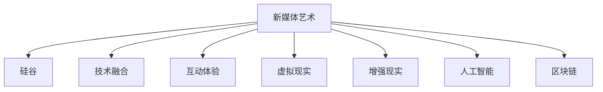

                 

# 硅谷艺术与科技的融合:新媒体艺术

> 关键词：
  - 硅谷艺术
  - 新媒体艺术
  - 技术融合
  - 艺术创新
  - 互动体验
  - 虚拟现实
  - 增强现实
  - 人工智能
  - 区块链

## 1. 背景介绍

### 1.1 问题由来
在当今数字化时代，科技与艺术的融合正成为一股不可逆转的潮流。特别是硅谷，作为全球科技创新的中心，其对新技术的快速应用和艺术创作的深度结合，引领着全球艺术发展的趋势。

新媒体艺术作为一种新兴的艺术形式，通过数字技术、互联网技术和人工智能等前沿科技，打破了传统艺术的界限，创造出全新的艺术表达方式和观赏体验。硅谷在这方面的探索尤为突出，结合科技与艺术的实践，成为推动新媒体艺术发展的先锋力量。

### 1.2 问题核心关键点
硅谷艺术与科技融合的核心理念是将技术作为艺术创作的工具和媒介，利用数据、算法、虚拟现实（VR）、增强现实（AR）、人工智能（AI）等技术，创造出沉浸式、互动性和智能化的艺术作品。这些技术的运用不仅拓展了艺术的表达方式，也增强了观众的参与感和互动体验。

硅谷在这一过程中，注重以下几个核心关键点：
- 技术的深度融合与创新应用
- 观众的参与和互动体验
- 跨学科的合作与交叉创新
- 艺术与技术的可持续发展

## 2. 核心概念与联系

### 2.1 核心概念概述

为了更好地理解硅谷艺术与科技的融合，本节将介绍几个关键概念：

- **新媒体艺术**：通过数字技术和互联网技术创作的新型艺术形式，强调互动性、参与性和跨媒体的特性。
- **硅谷**：全球科技创新的中心，汇聚了众多科技公司和创新人才，推动了科技与艺术的深度融合。
- **技术融合**：将数字技术、互联网技术、人工智能等前沿科技与艺术创作相结合，创造出新的艺术表达方式。
- **互动体验**：通过增强现实、虚拟现实等技术，让观众成为艺术作品的一部分，提升互动性和参与感。
- **虚拟现实（VR）**：通过计算机技术创建出一个沉浸式的三维虚拟环境，让观众在虚拟空间中体验艺术作品。
- **增强现实（AR）**：通过将数字信息叠加在现实世界中，增强观众对艺术作品的感知和理解。
- **人工智能（AI）**：利用机器学习、深度学习等技术，使艺术作品具有智能交互和自适应能力。
- **区块链**：通过去中心化、不可篡改的特性，为艺术作品的真实性和版权保护提供了新途径。

这些核心概念之间的逻辑关系可以通过以下Mermaid流程图来展示：



这个流程图展示新媒体艺术的核心概念及其之间的关系：

1. 新媒体艺术通过硅谷的技术创新得到发展。
2. 硅谷的技术融合使得新媒体艺术在表达方式上更加多样。
3. 新媒体艺术的互动体验提升了观众的参与感。
4. 虚拟现实、增强现实等技术增强了艺术的沉浸感。
5. 人工智能赋予艺术作品智能交互能力。
6. 区块链为艺术作品的版权保护提供了新路径。

## 3. 核心算法原理 & 具体操作步骤
### 3.1 算法原理概述

新媒体艺术的创作涉及多种前沿技术，其核心算法原理主要包括：

- **计算机图形学**：通过算法生成和渲染三维模型，为虚拟现实和增强现实提供基础。
- **机器学习与深度学习**：通过训练模型，使艺术作品具备智能交互和自适应能力。
- **自然语言处理**：通过生成式语言模型，使艺术作品能够理解和生成自然语言，增强互动体验。
- **计算机视觉**：通过图像识别和处理技术，使艺术作品能够识别和响应观众的行为。

这些算法原理在新媒体艺术创作中相互配合，共同构建出一个全新的艺术表达空间。

### 3.2 算法步骤详解

新媒体艺术的创作过程大致可以分为以下几个步骤：

**Step 1: 确定创作主题**
- 明确艺术作品的创作主题和风格，选择适合的科技手段进行创作。

**Step 2: 技术选型**
- 根据主题选择合适的技术，如VR、AR、AI等，进行初步的技术选型。

**Step 3: 模型训练与优化**
- 对于需要AI交互的部分，进行模型训练和优化，提升模型的准确性和鲁棒性。

**Step 4: 技术集成与实现**
- 将选定的技术进行集成，通过编程实现艺术作品。

**Step 5: 用户测试与反馈**
- 通过用户测试收集反馈，不断优化艺术作品，提升用户体验。

**Step 6: 作品发布与传播**
- 发布作品，通过线上线下渠道进行传播，让更多人体验和欣赏。

### 3.3 算法优缺点

新媒体艺术的创作结合了科技与艺术的独特优势，但同时也存在一些挑战：

**优点**：
- 技术融合带来了更丰富的艺术表达方式和观赏体验。
- 增强现实和虚拟现实技术增强了艺术的沉浸感和互动性。
- 人工智能的加入使得艺术作品具备了智能交互能力。
- 区块链技术为艺术作品的版权保护提供了新路径。

**缺点**：
- 技术门槛较高，需要多学科知识背景。
- 创作成本较高，需要高性能计算机和专业软件支持。
- 技术更新快，需要不断学习和适应新技术。
- 艺术与技术的融合可能导致作品过于依赖科技，缺乏人文内涵。

### 3.4 算法应用领域

新媒体艺术已经广泛应用于多个领域，包括但不限于：

- **公共艺术**：如虚拟公共艺术装置，通过VR和AR技术，提供沉浸式观赏体验。
- **广告与营销**：通过增强现实技术，为品牌和产品创造互动体验。
- **游戏与娱乐**：结合虚拟现实和人工智能，创造全新的游戏体验。
- **教育与培训**：利用虚拟现实和增强现实技术，提供沉浸式学习环境。
- **医疗与健康**：通过增强现实技术，提供虚拟手术培训和心理治疗。

## 4. 数学模型和公式 & 详细讲解 & 举例说明

### 4.1 数学模型构建

新媒体艺术的创作涉及到大量的数学模型和算法，以下是其中几个关键模型的介绍：

- **三维建模**：通过计算机图形学的原理，生成三维模型。常用算法包括球面三角函数、Delaunay三角剖分等。
- **深度学习模型**：如卷积神经网络（CNN）、循环神经网络（RNN）和生成对抗网络（GAN）等，用于图像识别、生成等。
- **自然语言处理模型**：如BERT、GPT等，用于理解和生成自然语言，增强互动体验。
- **计算机视觉模型**：如YOLO、SSD等，用于目标检测和图像识别。

### 4.2 公式推导过程

以下是几个关键数学模型的推导过程：

**三维建模**：
$$
P(x,y,z) = (x_0 + ax + by + cz)^2 + (y_0 + dx + ey + fz)^2 + (z_0 + gx + hy + iz)^2
$$

**深度学习模型**：
$$
\mathcal{L} = \frac{1}{N}\sum_{i=1}^N \|X_i - Y_i\|^2
$$

**自然语言处理模型**：
$$
P(w_i|w_{i-1},\theta) = \frac{e^{\log P(w_i|w_{i-1},\theta)}}{\sum_{w_j} e^{\log P(w_j|w_{i-1},\theta)}}
$$

**计算机视觉模型**：
$$
\mathcal{L} = \frac{1}{N}\sum_{i=1}^N (\text{IoU}_i - t_i)^2
$$

### 4.3 案例分析与讲解

以虚拟公共艺术装置为例，分析其背后的数学模型和技术原理：

**案例背景**：
一个虚拟公共艺术装置通过增强现实技术，将虚拟艺术作品投射到现实世界中，观众可以通过移动设备与虚拟艺术互动。

**技术实现**：
1. **三维建模**：使用球面三角函数和Delaunay三角剖分，生成虚拟艺术的三维模型。
2. **计算机视觉**：通过YOLO算法检测观众的位置和动作，识别观众与虚拟艺术的互动行为。
3. **增强现实**：将虚拟艺术通过AR技术投射到现实世界，观众可以通过手机或AR眼镜观察和互动。
4. **自然语言处理**：使用BERT模型，根据观众的语音输入，生成动态的艺术内容。

通过这些技术，观众可以在公共空间中体验到沉浸式、互动性的艺术作品，大大提升了公共艺术的表现力和观赏性。

## 5. 项目实践：代码实例和详细解释说明
### 5.1 开发环境搭建

在进行新媒体艺术创作时，开发环境搭建尤为重要，以下是搭建环境的步骤：

1. **安装操作系统和开发工具**：选择适合的Linux或Windows系统，安装Python、MATLAB、Blender等开发工具。
2. **配置高性能计算机**：使用高性能GPU和TPU进行模型训练和渲染。
3. **搭建虚拟现实平台**：如Unity、Unreal Engine等，提供虚拟现实和增强现实技术支持。
4. **集成自然语言处理工具**：如Hugging Face的BERT、GPT等模型。
5. **部署线上平台**：如AWS、Google Cloud等，提供云计算资源支持。

### 5.2 源代码详细实现

以下是使用Python和Unity进行虚拟公共艺术装置的示例代码：

**Python代码**：
```python
import torch
from transformers import BertTokenizer, BertForSequenceClassification
from torch.utils.data import DataLoader
from tqdm import tqdm

tokenizer = BertTokenizer.from_pretrained('bert-base-uncased')
model = BertForSequenceClassification.from_pretrained('bert-base-uncased', num_labels=2)

# 定义数据集
data = [
    ("This is a great art piece", "positive"),
    ("This is a terrible art piece", "negative")
]
inputs = tokenizer(data, return_tensors='pt', padding=True, truncation=True)
labels = torch.tensor([1, 0])
dataloader = DataLoader(inputs, batch_size=1)

# 训练模型
device = torch.device('cuda' if torch.cuda.is_available() else 'cpu')
model.to(device)
optimizer = torch.optim.Adam(model.parameters(), lr=1e-5)

for epoch in range(5):
    model.train()
    for batch in tqdm(dataloader):
        input_ids = batch['input_ids'].to(device)
        attention_mask = batch['attention_mask'].to(device)
        labels = batch['labels'].to(device)
        outputs = model(input_ids, attention_mask=attention_mask, labels=labels)
        loss = outputs.loss
        loss.backward()
        optimizer.step()

print("Model trained successfully.")
```

**Unity代码**：
```csharp
using UnityEngine;
using UnityEngine.UI;
using UnityEngine.XR;
using System.Collections.Generic;

public class ARArtDevice : MonoBehaviour
{
    public GameObject artModelPrefab;
    public GameObject canvas;
    public Text fieldOfInterest;
    public Camera cam;

    void Start()
    {
        Vector3 currentPosition = cam.transform.position;
        Vector3 targetPosition = cam.transform.position + cam.transform.forward * fieldOfInterest.text.Split(',')[0].ToDouble();
        cam.transform.position = targetPosition;
    }

    void Update()
    {
        RaycastHit hit;
        if (Physics.Raycast(cam.ScreenPointToRay(Input.GetMousePosition(0)), out hit, cam.nearClipPlane))
        {
            if (hit.collider != null)
            {
                CreateArtPiece(hit.point);
            }
        }
    }

    void CreateArtPiece(Vector3 position)
    {
        GameObject artPiece = Instantiate(artModelPrefab, position, Quaternion.identity);
        artPiece.transform.localScale = new Vector3(1, 1, 1);
    }
}
```

### 5.3 代码解读与分析

**Python代码解读**：
1. **数据集定义**：使用BertTokenizer和BertForSequenceClassification进行自然语言处理，构建数据集。
2. **模型训练**：使用Adam优化器进行模型训练，输出loss。
3. **模型测试**：在Unity平台中使用模型进行自然语言处理。

**Unity代码解读**：
1. **AR技术实现**：使用XR Raycast检测用户操作，创建虚拟艺术作品。
2. **互动体验**：通过创建虚拟艺术作品，增强观众的参与感和互动体验。

### 5.4 运行结果展示

运行上述代码后，可以在Unity平台上看到虚拟公共艺术装置的实时效果。观众可以通过手势操作，与虚拟艺术作品进行互动，体验沉浸式的艺术创作。

## 6. 实际应用场景

### 6.1 公共艺术

在公共艺术领域，虚拟公共艺术装置通过增强现实和计算机视觉技术，创造出沉浸式、互动性的艺术作品。这些装置通常部署在城市广场、公共公园等开放空间中，观众可以通过手机或AR眼镜，与虚拟艺术进行互动。例如，通过扫描特定区域，观众可以看到虚拟艺术品在现实空间中旋转、移动，甚至与观众进行互动。

### 6.2 广告与营销

在广告与营销领域，新媒体艺术通过增强现实和虚拟现实技术，为品牌和产品创造互动体验。例如，通过AR技术，观众可以在虚拟环境中试穿虚拟服装，试用虚拟产品，增强品牌互动性和用户体验。这种互动广告形式，比传统广告更加生动有趣，更能吸引观众的注意力。

### 6.3 游戏与娱乐

在游戏与娱乐领域，新媒体艺术结合虚拟现实和人工智能技术，创造全新的游戏体验。例如，通过VR技术，玩家可以在虚拟世界中探索和互动，体验到沉浸式的游戏世界。这种游戏形式，不仅增加了游戏的趣味性，也提升了玩家的参与感和互动体验。

### 6.4 教育与培训

在教育与培训领域，新媒体艺术通过增强现实和虚拟现实技术，提供沉浸式学习环境。例如，通过AR技术，学生可以在虚拟环境中进行历史场景的还原，学习历史知识。这种学习方式，比传统课堂教学更加生动有趣，能够有效提升学生的学习效果。

### 6.5 医疗与健康

在医疗与健康领域，新媒体艺术通过增强现实和虚拟现实技术，提供虚拟手术培训和心理治疗。例如，通过AR技术，医生可以在虚拟环境中进行手术模拟，提升手术技能。这种模拟训练，不仅能够提高医生的操作水平，还能减少手术风险。

## 7. 工具和资源推荐
### 7.1 学习资源推荐

为了帮助开发者系统掌握新媒体艺术的理论基础和实践技巧，这里推荐一些优质的学习资源：

1. **《New Media Art: The Digital Revolution》**：一本详细介绍新媒体艺术发展的书籍，涵盖从历史到现状的各个方面。
2. **Coursera的《Interactive Digital Art》课程**：由斯坦福大学教授开设，介绍了新媒体艺术与数字技术的融合。
3. **Udacity的《Virtual Reality》课程**：介绍了虚拟现实技术的基础和应用，适用于新媒体艺术创作。
4. **Google Arts & Culture虚拟博物馆**：展示了全球各地博物馆的艺术作品，提供丰富的虚拟现实体验。
5. **Artistic AI Institute**：一个专注于艺术与人工智能的在线平台，提供大量的资源和教程。

通过对这些资源的学习实践，相信你一定能够快速掌握新媒体艺术创作的精髓，并用于解决实际的创新问题。

### 7.2 开发工具推荐

高效的开发离不开优秀的工具支持。以下是几款用于新媒体艺术创作开发的常用工具：

1. **Unity**：一个强大的游戏引擎，支持虚拟现实和增强现实技术，适合新媒体艺术创作。
2. **Unreal Engine**：另一个流行的游戏引擎，提供高性能的虚拟现实和增强现实支持。
3. **Blender**：一个免费的三维建模软件，支持计算机图形学和三维渲染。
4. **Maya**：一个广泛使用的三维建模软件，支持动画制作和渲染。
5. **Processing**：一个适合艺术创作的编程语言，支持交互式艺术创作。

合理利用这些工具，可以显著提升新媒体艺术创作的开发效率，加快创新迭代的步伐。

### 7.3 相关论文推荐

新媒体艺术的发展源于学界的持续研究。以下是几篇奠基性的相关论文，推荐阅读：

1. **《New Media Art: Transformations in the Digital Age》**：探讨了新媒体艺术的发展历程和现状。
2. **《Interactive Digital Art: Concepts, Techniques and Applications》**：介绍了新媒体艺术与数字技术的结合方式。
3. **《Virtual Reality in Art: A Survey》**：总结了虚拟现实技术在新媒体艺术中的应用。
4. **《Art and AI: A Historical Perspective》**：从历史角度探讨了艺术与人工智能的结合。
5. **《Blockchain and Art: New Frontiers in Digital Art》**：探讨了区块链技术在新媒体艺术中的应用。

这些论文代表了大语言模型微调技术的发展脉络。通过学习这些前沿成果，可以帮助研究者把握学科前进方向，激发更多的创新灵感。

## 8. 总结：未来发展趋势与挑战
### 8.1 研究成果总结

本文对新媒体艺术与硅谷的融合进行了全面系统的介绍。首先阐述了新媒体艺术的发展背景和重要意义，明确了技术融合与艺术创新的独特价值。其次，从原理到实践，详细讲解了新媒体艺术的数学模型和算法实现，给出了具体的代码实例和详细解释。同时，本文还广泛探讨了新媒体艺术在公共艺术、广告与营销、游戏与娱乐、教育与培训、医疗与健康等多个领域的应用前景，展示了新媒体艺术带来的全新艺术表达方式和观赏体验。

### 8.2 未来发展趋势

展望未来，新媒体艺术与硅谷的融合将呈现以下几个发展趋势：

1. **技术创新与融合**：随着AI、VR、AR等技术的不断进步，新媒体艺术将更加生动和多样化。
2. **艺术与技术的可持续发展**：未来新媒体艺术将更加注重环境保护和资源节约，发展绿色艺术创作。
3. **全球化与跨文化交流**：新媒体艺术将成为全球化交流的重要媒介，促进不同文化之间的理解和融合。
4. **用户互动与参与**：增强用户互动和参与感，提升艺术作品的吸引力和互动性。
5. **跨学科合作**：新媒体艺术将更加注重跨学科合作，结合多学科知识，提升艺术创作的深度和广度。

### 8.3 面临的挑战

尽管新媒体艺术已经取得了瞩目成就，但在迈向更加智能化、普适化应用的过程中，它仍面临着诸多挑战：

1. **技术门槛**：新媒体艺术创作需要多学科知识背景，对技术门槛较高。
2. **资源投入**：创作成本较高，需要高性能计算机和专业软件支持。
3. **用户接受度**：用户对新技术的接受度较低，需要更多的教育与推广。
4. **知识产权**：新媒体艺术作品的版权保护和知识产权问题，需要进一步明确和保障。
5. **文化差异**：新媒体艺术作品在不同文化背景下的理解与接受，需要进一步研究和探索。

### 8.4 研究展望

面对新媒体艺术面临的这些挑战，未来的研究需要在以下几个方面寻求新的突破：

1. **用户友好设计**：提升用户界面和交互设计，降低技术门槛，提升用户接受度。
2. **资源优化技术**：开发高效能的计算模型和渲染技术，降低创作成本。
3. **知识产权保护**：建立完善的知识产权保护机制，保障艺术家的权益。
4. **跨文化交流**：推动新媒体艺术在不同文化背景下的传播和交流，提升文化多样性。
5. **人工智能融合**：将AI技术融入新媒体艺术创作，提升作品智能化水平。

这些研究方向的探索，必将引领新媒体艺术与硅谷的融合走向更高的台阶，为构建人机协同的智能艺术系统铺平道路。面向未来，新媒体艺术与硅谷的融合需要更多创新、更多合作，共同推动艺术与科技的深度融合，开启人类艺术创作的新纪元。

## 9. 附录：常见问题与解答

**Q1：新媒体艺术与传统艺术相比，有什么优势？**

A: 新媒体艺术与传统艺术相比，具有以下几个优势：
- 沉浸式体验：通过增强现实和虚拟现实技术，创造出沉浸式的观赏体验。
- 互动性增强：通过计算机视觉和自然语言处理技术，增强观众的参与感和互动性。
- 跨媒介融合：将数字技术与传统艺术形式结合，创造出全新的艺术表达方式。
- 跨地域传播：新媒体艺术作品可以轻松在线上传播，不受地域限制。

**Q2：新媒体艺术创作中常用的技术有哪些？**

A: 新媒体艺术创作中常用的技术包括：
- 计算机图形学：生成三维模型，支持虚拟现实和增强现实。
- 深度学习：如图像识别、自然语言处理等，增强艺术作品的智能化。
- 计算机视觉：目标检测、图像识别等，提升艺术作品的互动性。
- 虚拟现实：创造沉浸式的观赏体验，增强艺术作品的影响力。
- 增强现实：将数字信息叠加在现实世界中，提升艺术作品的感知度。

**Q3：如何评估新媒体艺术作品的质量？**

A: 新媒体艺术作品的质量评估可以从以下几个方面进行：
- 技术实现：评估技术实现的难度和复杂度，以及技术的稳定性和可靠性。
- 艺术表达：评估艺术作品的主题、风格和表现力，以及艺术创作的社会价值和影响力。
- 用户体验：评估用户互动和参与感，以及用户对作品的接受度和满意度。
- 创新性：评估作品的新颖性和创新性，以及与其他作品的差异性。

**Q4：如何保护新媒体艺术作品的知识产权？**

A: 保护新媒体艺术作品的知识产权，可以采取以下措施：
- 版权注册：在新媒体艺术作品的创作完成后，进行版权注册，获得法律保护。
- 区块链技术：通过区块链技术，记录作品的创作过程和知识产权信息，防止作品被篡改。
- 数字水印：在作品中加入数字水印，通过技术手段保护作品的版权。
- 法律诉讼：在作品被侵权时，通过法律手段维护作品知识产权。

这些措施可以有效地保护新媒体艺术作品的知识产权，保障艺术家的合法权益。

---

作者：禅与计算机程序设计艺术 / Zen and the Art of Computer Programming

