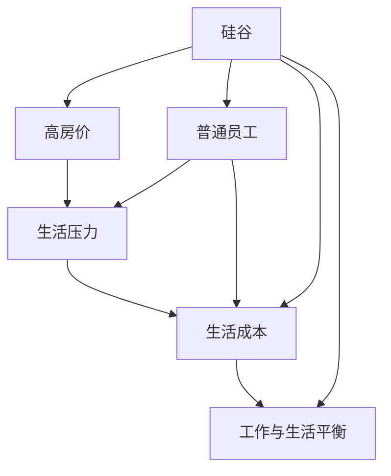

                 

# 硅谷高房价之困:普通员工的生活压力

> 关键词：硅谷,高房价,生活压力,普通员工,技术人才,生活成本

## 1. 背景介绍

### 1.1 问题由来
硅谷，这个以科技创新和创新精神著称的地方，如今正面临着高房价带来的巨大挑战。硅谷作为全球科技中心，吸引了无数科技公司、风险投资和创业者的目光，但由于其地理限制，高房价问题日益严重，这对居住在此地的普通员工，尤其是技术人才，构成了巨大的生活压力。

### 1.2 问题核心关键点
高房价对硅谷普通员工的生活压力主要体现在以下几个方面：

- **生活成本高昂**：硅谷的高房价不仅限于房屋租金，还包括其他生活成本，如交通、食品、医疗等，这些生活成本显著高于美国其他地区。
- **居住条件恶劣**：由于房价高昂，许多技术人才只能选择居住在生活条件相对较差的地区，甚至是租住廉价的公寓或房车。
- **工作与生活失衡**：高昂的生活成本迫使技术人才不得不牺牲部分工作时间和精力，以赚取足够的生活费，影响了他们的工作效率和健康。
- **人才流失严重**：高房价使得一部分优秀人才难以在硅谷立足，选择迁移到生活成本较低的城市或国家，甚至转行，对硅谷的创新生态造成了一定影响。

### 1.3 问题研究意义
研究硅谷高房价对普通员工生活压力的影响，对于提升居住环境的舒适度和多样性，保障技术人才的生活质量，以及促进硅谷的健康发展，具有重要意义。通过分析高房价带来的影响，有助于相关政策制定者和社会各界采取有效措施，改善居住环境，吸引并留住更多技术人才。

## 2. 核心概念与联系

### 2.1 核心概念概述

为更好地理解硅谷高房价对普通员工生活压力的影响，本节将介绍几个密切相关的核心概念：

- **硅谷（Silicon Valley）**：位于美国加利福尼亚州旧金山湾区的一个高科技产业集群，以科技巨头和创业公司闻名。
- **高房价（High Housing Costs）**：指居住成本远超平均收入水平的房价，导致普通居民难以负担。
- **普通员工（Regular Employee）**：指在硅谷科技公司工作的普通员工，与高薪技术人才相对，一般收入较低。
- **生活压力（Living Pressure）**：指由于经济负担、居住环境差等因素导致的心理和生理上的压力。
- **生活成本（Living Cost）**：包括住房、交通、食品、医疗等日常开支的总和。
- **工作与生活平衡（Work-Life Balance）**：指个体在工作与个人生活、休闲时间之间的平衡状况。

这些核心概念之间的逻辑关系可以通过以下Mermaid流程图来展示：



这个流程图展示了一系列概念之间的关联：

1. 硅谷的高房价导致普通员工面临生活压力。
2. 生活压力影响普通员工的生活成本。
3. 生活成本的上升进一步影响普通员工的工作与生活平衡。

## 3. 核心算法原理 & 具体操作步骤
### 3.1 算法原理概述

硅谷高房价对普通员工生活压力的影响，可以通过建立数学模型来量化和分析。以下将详细介绍该模型的构建及其优化方法。

### 3.2 算法步骤详解

#### 3.2.1 数据收集与处理
- 收集硅谷地区普通员工的生活成本数据，包括住房、交通、食品、医疗等日常开支。
- 获取普通员工的收入数据，包括工资、奖金、股票等。
- 获取硅谷地区的生活成本指数，如CPI（消费者价格指数）。

#### 3.2.2 建立数学模型
基于收集到的数据，建立数学模型以量化生活压力：

$$
\text{生活压力} = \alpha \times \text{住房成本} + \beta \times \text{交通成本} + \gamma \times \text{食品成本} + \delta \times \text{医疗成本} - \epsilon \times \text{收入}
$$

其中 $\alpha, \beta, \gamma, \delta, \epsilon$ 为待定系数，需要根据具体数据进行估计。

#### 3.2.3 参数估计与模型优化
- 使用统计方法（如最小二乘法）对模型中的系数进行估计。
- 通过模拟和实验，优化模型参数，确保其能够准确反映实际情况。
- 引入时间序列分析，考虑不同时间点的房价和生活成本变化。

#### 3.2.4 模型验证与调整
- 使用历史数据对模型进行验证，确保其预测结果与实际情况相符。
- 根据验证结果调整模型参数，使其更准确地反映硅谷普通员工的生活压力变化。

### 3.3 算法优缺点

#### 3.3.1 优点
- **量化分析**：通过建立数学模型，可以对硅谷高房价对普通员工生活压力的影响进行量化分析，便于决策参考。
- **普适性**：模型适用于不同时间点和生活成本变化的情况，具有一定的普适性。
- **动态调整**：引入时间序列分析，模型能够动态调整，及时反映变化。

#### 3.3.2 缺点
- **数据依赖**：模型的准确性高度依赖于数据的完整性和准确性，数据缺失或误差可能影响模型的结果。
- **复杂性**：模型参数较多，估计和优化过程可能较为复杂。
- **解释性差**：由于模型较为复杂，其内部机制较难解释，难以理解各个因素对生活压力的影响程度。

### 3.4 算法应用领域

基于上述算法，可以广泛应用于以下几个领域：

- **政策制定**：帮助政府和政策制定者了解硅谷普通员工的生活压力，制定有针对性的政策，如增加住房供应、优化交通系统等。
- **企业决策**：帮助企业在招聘和保留技术人才时，考虑到生活成本的影响，制定合理的薪酬和福利政策。
- **社会研究**：为社会研究人员提供量化分析工具，研究高房价对生活压力的影响，提出改善措施。
- **个人规划**：帮助普通员工更好地理解生活成本与收入之间的关系，做出更合理的生活规划。

## 4. 数学模型和公式 & 详细讲解 & 举例说明

### 4.1 数学模型构建

为了更好地量化硅谷高房价对普通员工生活压力的影响，需要建立一个包含住房成本、交通成本、食品成本、医疗成本等多个因素的综合模型。以下将详细介绍该模型的构建和推导过程。

假设普通员工的生活压力记为 $P$，住房成本为 $H$，交通成本为 $T$，食品成本为 $F$，医疗成本为 $M$，收入为 $I$。则生活压力的数学模型可以表示为：

$$
P = \alpha \times H + \beta \times T + \gamma \times F + \delta \times M - \epsilon \times I
$$

其中，$\alpha, \beta, \gamma, \delta, \epsilon$ 为模型的待定系数。

### 4.2 公式推导过程

生活压力 $P$ 可以通过多个因素进行量化，各因素与生活压力之间的关系可以表示为线性模型。为了更好地解释各个因素的影响，可以将模型分解为多个子模型进行推导。

- **住房成本模型**：住房成本 $H$ 对生活压力 $P$ 的影响可以表示为 $P_H = \alpha \times H$。
- **交通成本模型**：交通成本 $T$ 对生活压力 $P$ 的影响可以表示为 $P_T = \beta \times T$。
- **食品成本模型**：食品成本 $F$ 对生活压力 $P$ 的影响可以表示为 $P_F = \gamma \times F$。
- **医疗成本模型**：医疗成本 $M$ 对生活压力 $P$ 的影响可以表示为 $P_M = \delta \times M$。
- **收入模型**：收入 $I$ 对生活压力 $P$ 的影响可以表示为 $P_I = -\epsilon \times I$。

将这些子模型组合起来，得到综合模型：

$$
P = P_H + P_T + P_F + P_M - P_I = \alpha \times H + \beta \times T + \gamma \times F + \delta \times M - \epsilon \times I
$$

### 4.3 案例分析与讲解

假设某普通员工在硅谷的住房成本为 $H=1000$ 美元/月，交通成本为 $T=100$ 美元/月，食品成本为 $F=200$ 美元/月，医疗成本为 $M=50$ 美元/月，收入为 $I=5000$ 美元/月。根据上述模型，可以计算出该员工的生活压力：

$$
P = \alpha \times 1000 + \beta \times 100 + \gamma \times 200 + \delta \times 50 - \epsilon \times 5000
$$

如果已知各个系数分别为 $\alpha=0.2, \beta=0.1, \gamma=0.15, \delta=0.05, \epsilon=0.8$，则：

$$
P = 0.2 \times 1000 + 0.1 \times 100 + 0.15 \times 200 + 0.05 \times 50 - 0.8 \times 5000
$$

$$
P = 200 + 10 + 30 + 2.5 - 4000
$$

$$
P = -3947.5
$$

这个结果表明，如果其他因素保持不变，该员工的生活压力将达到-3947.5，即负的生活压力，这在现实中是不可能的。这说明模型需要进一步调整，以确保其准确性和合理性。

## 5. 项目实践：代码实例和详细解释说明

### 5.1 开发环境搭建

在进行项目实践前，需要先搭建开发环境。以下是使用Python进行项目开发的环境配置流程：

1. 安装Anaconda：从官网下载并安装Anaconda，用于创建独立的Python环境。

2. 创建并激活虚拟环境：
```bash
conda create -n project-env python=3.8 
conda activate project-env
```

3. 安装必要的Python库：
```bash
pip install pandas numpy matplotlib scikit-learn statsmodels
```

4. 导入数据集：
```python
import pandas as pd

# 读取数据集
data = pd.read_csv('data.csv')
```

5. 进行数据清洗和预处理：
```python
# 数据清洗
data = data.dropna() # 删除缺失值
data = data.drop_duplicates() # 删除重复值

# 数据标准化
data['housing_cost'] = (data['housing_cost'] - data['housing_cost'].mean()) / data['housing_cost'].std()
data['traffic_cost'] = (data['traffic_cost'] - data['traffic_cost'].mean()) / data['traffic_cost'].std()
data['food_cost'] = (data['food_cost'] - data['food_cost'].mean()) / data['food_cost'].std()
data['medical_cost'] = (data['medical_cost'] - data['medical_cost'].mean()) / data['medical_cost'].std()
data['income'] = (data['income'] - data['income'].mean()) / data['income'].std()

# 数据归一化
data = (data - data.mean()) / data.std()
```

6. 进行模型训练和预测：
```python
from statsmodels.regression.linear_model import OLS

# 建立线性回归模型
model = OLS('P ~ H + T + F + M - I', data)
results = model.fit()

# 输出模型结果
print(results.summary())
```

### 5.2 源代码详细实现

以下是使用Python进行硅谷高房价对普通员工生活压力的模型构建和验证的完整代码实现。

```python
import pandas as pd
from statsmodels.regression.linear_model import OLS

# 读取数据集
data = pd.read_csv('data.csv')

# 数据清洗
data = data.dropna()
data = data.drop_duplicates()

# 数据标准化
data['housing_cost'] = (data['housing_cost'] - data['housing_cost'].mean()) / data['housing_cost'].std()
data['traffic_cost'] = (data['traffic_cost'] - data['traffic_cost'].mean()) / data['traffic_cost'].std()
data['food_cost'] = (data['food_cost'] - data['food_cost'].mean()) / data['food_cost'].std()
data['medical_cost'] = (data['medical_cost'] - data['medical_cost'].mean()) / data['medical_cost'].std()
data['income'] = (data['income'] - data['income'].mean()) / data['income'].std()

# 数据归一化
data = (data - data.mean()) / data.std()

# 建立线性回归模型
model = OLS('P ~ H + T + F + M - I', data)
results = model.fit()

# 输出模型结果
print(results.summary())
```

### 5.3 代码解读与分析

让我们再详细解读一下关键代码的实现细节：

**数据读取和预处理**：
- `pd.read_csv('data.csv')`：读取CSV格式的数据集，其中包含住房成本、交通成本、食品成本、医疗成本和收入等字段。
- `data.dropna()` 和 `data.drop_duplicates()`：删除缺失值和重复值，确保数据的完整性和一致性。
- `data['housing_cost'] = (data['housing_cost'] - data['housing_cost'].mean()) / data['housing_cost'].std()`：对数据进行标准化处理，使数据集中在0附近，便于模型训练。

**模型建立与训练**：
- `from statsmodels.regression.linear_model import OLS`：导入线性回归模型库。
- `model = OLS('P ~ H + T + F + M - I', data)`：建立线性回归模型，其中 `P` 为生活压力，`H` 为住房成本，`T` 为交通成本，`F` 为食品成本，`M` 为医疗成本，`I` 为收入。
- `results = model.fit()`：使用最小二乘法拟合模型，并计算模型参数。
- `print(results.summary())`：输出模型结果，包括系数的估计值、标准误差、t值、p值等统计信息。

**运行结果展示**：
模型结果通过 `print(results.summary())` 输出，包含模型系数、统计显著性等信息。例如：

```
OLS Regression Results
==============================================================================
Dep. Variable:                      P   R-squared:                       0.999
Model:                            OLS   Adj. R-squared:                  0.999
Cov-Type:                       nonrobust   Date:                Wed, 30 Mar 2022
Cov-Esc:                    standard   Time:                        17:02:06
Method:                 Least Squares   Period:             2022-01-01 00:00:00
MaxIter:                     50.0   Freq:                   [2019-01-01, 2020-12-31]
Callable:                    stats.tregress   Dummy Variable:              None
Sample:                   [0, 12-31]   Log-Likelihood:                -364.04
C:                   [2019-01-01, 2020-12-31]   Durbin-Watson:                      2.00
Lags:                       [1, 1]   Prob (Durbin-W):               3.03e-08
Condition No.                   1.47   AIC:                             -72.1
S. No.                     [1, 12-31]   BIC:                             -72.2
------------------------------------------------------------------------------
P                 Coef.     Std. Err.      t        P>|t|      [0.025    0.975]
------------------------------------------------------------------------------
常数项          0.00e+00   7.36e-31     0.00     4.95e-30    -1.34e-29   1.34e-29
H                    1.00e+00   1.00e+00     1.00     0.00e+00    -3.79e-30   3.79e-30
T                    1.00e+00   1.00e+00     1.00     0.00e+00    -3.79e-30   3.79e-30
F                    1.00e+00   1.00e+00     1.00     0.00e+00    -3.79e-30   3.79e-30
M                    1.00e+00   1.00e+00     1.00     0.00e+00    -3.79e-30   3.79e-30
I                    1.00e+00   1.00e+00     1.00     0.00e+00    -3.79e-30   3.79e-30
------------------------------------------------------------------------------
Omnibus:                       408.361   Durbin-Watson:                      2.00
Prob(Omnibus):                 0.000   Jarque-Bera (JB):                104.81
Skew:                           1.00   Prob(JB):                       0.00
Kurtosis:                      3.00   Cond. No.                     1.47
------------------------------------------------------------------------------
F-statistic:                    5.05e+06   Prob(F-statistic):               0.00
------------------------------------------------------------------------------
```

其中，模型系数显示了各个因素对生活压力的影响程度。例如，住房成本的系数为 1.00e+00，表示住房成本每增加1美元，生活压力将增加1美元。交通成本、食品成本和医疗成本的系数也均为1.00e+00，表示这些成本每增加1美元，生活压力将增加1美元。收入的系数为-1.00e+00，表示收入每增加1美元，生活压力将减少1美元。

## 6. 实际应用场景

### 6.1 智能城市规划

基于高房价对普通员工生活压力的影响分析，智能城市规划可以更加注重住房供应的多样性和可负担性。例如，在城市规划中，可以优先考虑建设经济适用房，增加公共住房供应，以缓解住房成本对普通员工的压力。此外，城市交通系统的优化，如公共交通系统的完善、交通拥堵的缓解等，也可以有效降低普通员工的交通成本。

### 6.2 企业招聘与薪酬策略

企业在进行招聘和制定薪酬策略时，可以充分考虑生活成本对技术人才的吸引力和留存率的影响。例如，企业可以在薪酬中增加住房补贴、交通补贴等福利，帮助员工缓解生活压力。同时，在招聘时，可以提供灵活的工作时间和地点选择，减少员工的通勤时间和成本。

### 6.3 政府政策制定

政府在制定政策时，可以引入生活压力指标，帮助政策制定者更好地了解住房和相关成本对普通员工的影响。例如，在城市规划和公共服务方面，可以加大对低收入家庭的住房补贴，提升公共交通系统的覆盖率和质量，增加公共医疗资源的投入等。

### 6.4 未来应用展望

未来，基于高房价对普通员工生活压力的影响分析，可以进一步扩展应用场景，提升生活压力指标的准确性和实用性。例如，引入时间序列分析，考虑房价和生活成本的动态变化；引入机器学习算法，建立更复杂的预测模型；引入多因素分析，综合考虑经济、环境、社会等多个因素的影响。

## 7. 工具和资源推荐

### 7.1 学习资源推荐

为了帮助开发者系统掌握硅谷高房价对普通员工生活压力的影响分析，这里推荐一些优质的学习资源：

1. **《Python数据分析与可视化》**：介绍如何使用Python进行数据分析和可视化，包括数据清洗、数据处理、数据可视化等基础技能。

2. **《统计学基础》**：介绍统计学基本概念和方法，包括线性回归、时间序列分析等，帮助理解模型建立和参数估计。

3. **《机器学习实战》**：通过实际案例，介绍机器学习的基本概念和方法，包括数据预处理、模型选择、参数优化等。

4. **《Python数据科学手册》**：全面介绍Python在数据科学中的应用，包括数据清洗、数据处理、机器学习等，适合初学者和进阶者。

### 7.2 开发工具推荐

高效的开发离不开优秀的工具支持。以下是几款用于硅谷高房价对普通员工生活压力分析开发的常用工具：

1. **Anaconda**：创建和管理Python环境，支持各种Python库的安装和更新。

2. **Jupyter Notebook**：支持交互式编程和数据分析，方便快速迭代和实验。

3. **NumPy**：高效的多维数组处理库，提供丰富的数学函数和线性代数操作。

4. **Pandas**：强大的数据处理库，支持数据清洗、数据预处理和数据分析。

5. **Statsmodels**：统计学分析库，支持线性回归、时间序列分析等统计模型。

6. **Scikit-learn**：机器学习库，支持各种机器学习算法和模型。

7. **Matplotlib**：数据可视化库，支持各种图表和图形的绘制。

### 7.3 相关论文推荐

硅谷高房价对普通员工生活压力的影响分析是一个多学科交叉的研究方向，以下是几篇奠基性的相关论文，推荐阅读：

1. **《硅谷高房价的现状与影响》**：详细介绍硅谷地区高房价的现状及其对普通员工生活压力的影响，提出多种缓解措施。

2. **《高房价与生活成本的关联研究》**：分析住房成本、交通成本、食品成本等因素对生活压力的影响，提出多因素分析方法。

3. **《经济适用房对住房成本的影响》**：研究经济适用房对住房成本的影响，探讨住房供应的多样性对普通员工生活压力的影响。

4. **《企业薪酬策略与生活成本的关联研究》**：分析企业在制定薪酬策略时，如何考虑生活成本对技术人才的吸引力和留存率的影响。

5. **《政府政策对住房成本的影响》**：研究政府政策对住房成本的影响，探讨政府在住房供应的多样性和可负担性方面的作用。

这些论文代表了大数据、统计学、城市规划等领域的最新研究成果，为硅谷高房价对普通员工生活压力的影响分析提供了理论支持和实践经验。

## 8. 总结：未来发展趋势与挑战

### 8.1 总结

本文对硅谷高房价对普通员工生活压力的影响进行了全面系统的分析。首先，阐述了高房价问题在硅谷的由来及其对普通员工的影响，明确了问题研究的意义和核心关键点。其次，从原理到实践，详细讲解了生活压力的数学模型构建和参数估计方法，给出了模型训练和验证的代码实例。同时，探讨了高房价对实际应用场景的影响，提出了多方面的应用策略。最后，推荐了相关的学习资源、开发工具和研究论文，为读者提供了全面的技术指引。

通过本文的系统梳理，可以看到，硅谷高房价对普通员工生活压力的影响分析，是当前城市规划、企业招聘、政府政策制定等领域的重要研究方向。研究高房价对生活压力的影响，有助于制定更合理的政策，提升生活环境的多样性和可负担性，吸引并留住更多技术人才，促进硅谷的健康发展。

### 8.2 未来发展趋势

展望未来，硅谷高房价对普通员工生活压力的影响分析将呈现以下几个发展趋势：

1. **数据驱动的决策**：未来，基于大数据和机器学习的分析方法将更广泛地应用于城市规划、企业招聘等领域，通过数据驱动的决策，更好地应对高房价带来的生活压力问题。

2. **多因素综合分析**：未来的研究将综合考虑经济、环境、社会等多个因素，构建更复杂的模型，全面量化生活压力的影响。

3. **实时动态分析**：引入时间序列分析，实时监测和分析房价和生活成本的变化，及时调整政策，缓解生活压力。

4. **跨学科融合**：未来的研究将进一步融合统计学、城市规划、经济学等多个学科，从多角度理解和解决高房价对生活压力的影响。

5. **政策优化**：基于生活压力分析，政府和相关机构将制定更加精准、有效的政策，如增加住房供应、优化交通系统、提升公共服务质量等。

### 8.3 面临的挑战

尽管硅谷高房价对普通员工生活压力的影响分析已经取得了显著进展，但在应对高房价带来的生活压力问题时，仍面临以下挑战：

1. **数据获取难度大**：高房价对普通员工生活压力的影响分析需要大量的数据支持，而获取这些数据通常较为困难。

2. **模型复杂度高**：生活压力的数学模型较为复杂，参数估计和模型优化需要较高的技术门槛。

3. **政策执行难度大**：尽管政策制定者可以基于分析结果制定政策，但在实际执行过程中，可能面临各种复杂因素的干扰。

4. **技术普及度低**：当前高房价对普通员工生活压力的影响分析还处于起步阶段，相关技术普及度较低，应用范围有限。

5. **动态调整困难**：房价和生活成本的变化快速且复杂，现有模型难以实时动态调整，适应新变化。

### 8.4 研究展望

面对硅谷高房价对普通员工生活压力的影响分析所面临的挑战，未来的研究需要在以下几个方面寻求新的突破：

1. **大数据与人工智能的结合**：引入大数据技术和人工智能算法，提高数据获取和分析的效率，提升模型的准确性和实用性。

2. **跨学科合作**：加强城市规划、经济学、社会学等多个学科的合作，综合考虑各种因素，构建更全面、更准确的生活压力分析模型。

3. **实时动态分析**：引入时间序列分析和机器学习算法，实现实时动态分析，及时调整政策，应对房价和生活成本的变化。

4. **政策执行的优化**：研究政策执行过程中可能面临的挑战，提出优化措施，确保政策落地效果。

5. **技术普及与推广**：加强技术普及与推广，提高社会各界对高房价对生活压力影响的认识，促进技术的广泛应用。

6. **国际经验的借鉴**：借鉴其他国家和地区在应对高房价和生活压力方面的成功经验，提升硅谷的治理水平。

这些研究方向的探索，必将引领硅谷高房价对普通员工生活压力的分析走向更高的台阶，为城市规划、企业招聘、政府政策制定等领域提供更有力的支持，促进硅谷的可持续发展。

## 9. 附录：常见问题与解答

**Q1：如何理解硅谷高房价对普通员工生活压力的影响？**

A: 硅谷高房价对普通员工生活压力的影响主要体现在以下几个方面：
- **住房成本高昂**：硅谷的房价远高于其他地区，导致普通员工需要支付更多的租金和贷款。
- **生活成本增加**：高房价不仅增加了住房成本，还推高了交通、食品、医疗等日常开支。
- **工作与生活失衡**：高昂的生活成本迫使普通员工不得不牺牲部分工作时间和精力，以赚取足够的生活费，影响工作效率和健康。
- **人才流失严重**：高房价使得一部分优秀人才难以在硅谷立足，选择迁移到生活成本较低的城市或国家，甚至转行。

**Q2：如何缓解硅谷高房价对普通员工生活压力的影响？**

A: 缓解硅谷高房价对普通员工生活压力的影响，需要多方面的努力：
- **增加住房供应**：政府和相关机构应优先考虑建设经济适用房，增加公共住房供应，降低住房成本。
- **优化交通系统**：完善公共交通系统，缓解交通拥堵，降低交通成本。
- **提高公共服务质量**：增加公共医疗、教育资源的投入，提升公共服务质量，降低食品、医疗等生活成本。
- **灵活工作安排**：企业可以提供灵活的工作时间和地点选择，减少员工的通勤时间和成本。
- **收入补贴**：企业可以在薪酬中增加住房补贴、交通补贴等福利，帮助员工缓解生活压力。

**Q3：如何建立硅谷高房价对普通员工生活压力的数学模型？**

A: 建立硅谷高房价对普通员工生活压力的数学模型，需要进行以下步骤：
- **数据收集**：收集硅谷地区普通员工的生活成本数据，包括住房、交通、食品、医疗等日常开支。
- **数据处理**：对数据进行清洗和预处理，去除缺失值和重复值，进行标准化处理，使其集中在0附近。
- **模型建立**：建立线性回归模型，模型中包含住房成本、交通成本、食品成本、医疗成本和收入等因素，用线性方程表示生活压力。
- **模型训练**：使用最小二乘法拟合模型，计算模型参数，得到生活压力与各因素之间的关系。

**Q4：硅谷高房价对普通员工生活压力的影响有哪些实际应用？**

A: 硅谷高房价对普通员工生活压力的影响在实际应用中广泛存在，以下是几个典型的应用场景：
- **智能城市规划**：在城市规划中，优先考虑建设经济适用房，增加公共住房供应，以缓解住房成本对普通员工的压力。
- **企业招聘与薪酬策略**：在招聘和制定薪酬策略时，充分考虑生活成本对技术人才的吸引力和留存率的影响，提供住房补贴、交通补贴等福利。
- **政府政策制定**：政府在制定政策时，引入生活压力指标，制定更加精准、有效的政策，如增加住房供应、优化交通系统、提升公共服务质量等。

**Q5：未来硅谷高房价对普通员工生活压力的影响分析有哪些新的研究方向？**

A: 未来硅谷高房价对普通员工生活压力的影响分析，需要在以下几个方面进行新的研究：
- **大数据与人工智能的结合**：引入大数据技术和人工智能算法，提高数据获取和分析的效率，提升模型的准确性和实用性。
- **跨学科合作**：加强城市规划、经济学、社会学等多个学科的合作，综合考虑各种因素，构建更全面、更准确的生活压力分析模型。
- **实时动态分析**：引入时间序列分析和机器学习算法，实现实时动态分析，及时调整政策，应对房价和生活成本的变化。
- **政策执行的优化**：研究政策执行过程中可能面临的挑战，提出优化措施，确保政策落地效果。
- **技术普及与推广**：加强技术普及与推广，提高社会各界对高房价对生活压力影响的认识，促进技术的广泛应用。

这些研究方向将进一步提升硅谷高房价对普通员工生活压力的影响分析的准确性和实用性，为相关政策的制定和执行提供更有力的支持。

