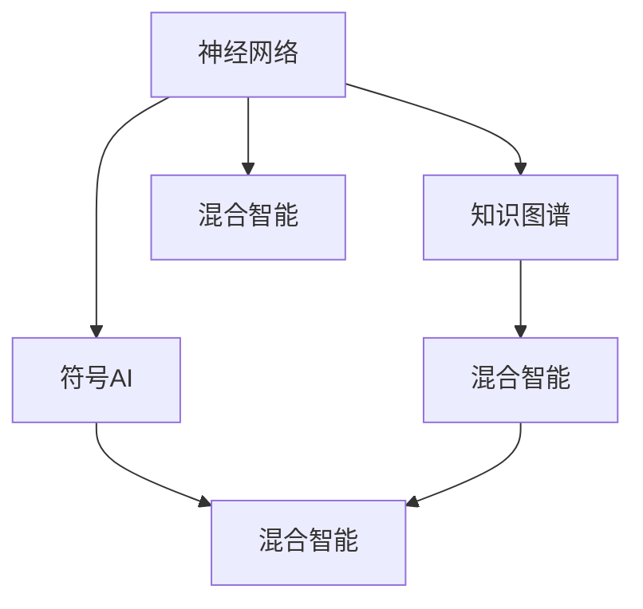

                 

# 神经符号人工智能：最佳方案

> 关键词：神经符号混合、符号AI、深度学习、知识图谱、知识工程、混合智能

## 1. 背景介绍

### 1.1 问题由来

近年来，人工智能(AI)技术在各行各业得到了广泛应用，取得了显著的进展。然而，传统的人工智能更多依赖于深度学习模型，缺乏对人类智能的符号化理解和逻辑推理能力，难以应对一些复杂的认知任务。神经符号人工智能(Neuro-Symbolic AI)作为近年来兴起的研究方向，尝试将符号计算与深度学习的优点融合，构建更加智能、灵活、可解释的AI系统。

神经符号人工智能的核心理念是：通过深度学习模型处理大规模无标签数据，学习到高层次的语义表征，再借助符号计算框架，对语言、知识等进行逻辑推理和推理验证。这种混合型AI系统能够在解决复杂问题时，结合神经网络模型的泛化能力和符号AI的精确性，提升整体的智能水平。

本文旨在对神经符号人工智能的最新进展进行全面系统的介绍，涵盖理论基础、算法框架、应用场景等方面。通过对这些关键问题的深入分析，希望能够为神经符号AI的开发者和研究者提供有价值的指导，推动这一领域的技术进步。

### 1.2 问题核心关键点

神经符号人工智能的核心在于如何将神经网络和符号系统有机结合。具体来说，其核心关键点包括：

- 神经网络模型如何学习语义表征
- 符号计算框架如何处理复杂逻辑
- 如何实现神经网络与符号AI的有机融合
- 混合智能系统的应用场景和实际效果

### 1.3 问题研究意义

神经符号人工智能的研究和应用具有重要的理论和现实意义：

1. 提升AI系统的智能水平：符号AI能够解决神经网络无法处理的一些逻辑推理和规则验证问题，两者结合可以形成更加智能、灵活的AI系统。
2. 增强AI系统的可解释性：符号AI系统提供了明确的逻辑推理路径，使得AI系统的决策过程更加透明，便于理解和调试。
3. 拓展AI应用领域：神经符号混合技术适用于医疗、金融、法律等领域，具有较强的适应性和应用潜力。
4. 推动认知科学的进步：神经符号AI结合了神经网络和符号计算的优点，有望深入揭示人类认知的复杂性，推动认知科学的发展。
5. 推动人工智能伦理和安全研究：神经符号AI能够更好地理解语义和逻辑，有助于发现和规避AI系统的潜在风险和伦理问题。

## 2. 核心概念与联系

### 2.1 核心概念概述

为更好地理解神经符号人工智能，本节将介绍几个关键概念：

- 神经网络(Neural Networks)：一种通过学习数据分布来进行预测或分类的算法，适用于处理大量无标签数据，学习高层次的语义表征。
- 符号AI(Symbolic AI)：基于知识库、规则库等符号系统的AI技术，擅长进行逻辑推理和规则验证，适用于解决精确度要求高的问题。
- 神经符号混合(Neuro-Symbolic Hybrid)：将神经网络与符号系统结合，形成混合型的AI系统，兼具神经网络与符号AI的优点，适用于更复杂的认知任务。
- 知识图谱(Knowledge Graph)：一种结构化的知识表示方式，用于描述实体、关系和属性之间的语义关系，是神经符号AI的重要基础。
- 混合智能(Hybrid Intelligence)：结合神经网络与符号AI的AI系统，能够处理复杂的认知任务，具有较强的适应性和可解释性。

这些核心概念之间的逻辑关系可以通过以下Mermaid流程图来展示：



这个流程图展示了大语言模型的核心概念及其之间的关系：

1. 神经网络通过大规模数据预训练，学习到高层次的语义表征。
2. 符号AI通过知识图谱等符号系统，进行复杂的逻辑推理和规则验证。
3. 混合智能系统结合神经网络和符号AI的优点，处理更复杂的认知任务。
4. 知识图谱作为神经符号AI的重要基础，提供逻辑推理和规则验证的能力。

## 3. 核心算法原理 & 具体操作步骤
### 3.1 算法原理概述

神经符号人工智能的核心算法是将神经网络和符号系统有机结合，构建混合型AI系统。这一过程通常分为以下几步：

1. 使用深度学习模型对大规模无标签数据进行预训练，学习到高层次的语义表征。
2. 利用符号系统进行逻辑推理和规则验证，处理神经网络无法处理的任务。
3. 将神经网络与符号AI结合，形成混合智能系统，发挥两者的优点。
4. 将混合智能系统应用于实际任务中，提升AI系统的智能水平和可解释性。

具体来说，神经符号AI的算法流程可以总结如下：


### 3.2 算法步骤详解

神经符号AI的算法流程可以细分为以下几个关键步骤：

**Step 1: 神经网络预训练**
- 收集大规模无标签数据，使用深度学习模型进行预训练，学习到高层次的语义表征。常用的预训练任务包括掩码语言模型、图像分类等。
- 常用的神经网络架构包括RNN、CNN、Transformer等，预训练目标为最大化数据分布的似然。

**Step 2: 符号AI推理**
- 根据具体任务，设计符号计算框架，构建知识图谱等符号系统。
- 利用符号AI系统对输入数据进行逻辑推理和规则验证，生成推理路径和验证结果。

**Step 3: 混合智能构建**
- 将预训练的神经网络模型与符号AI系统结合，形成混合智能系统。
- 设计合理的接口和交互机制，使得神经网络与符号AI能够协同工作。

**Step 4: 任务适配与优化**
- 将混合智能系统适配到具体任务中，通过微调等方法优化模型性能。
- 进行必要的模型压缩和优化，提升推理效率和资源利用率。

### 3.3 算法优缺点

神经符号人工智能的算法具有以下优点：
1. 结合神经网络和符号AI的优点，形成混合型AI系统，处理更复杂的认知任务。
2. 符号AI系统提供了明确的逻辑推理路径，增强了AI系统的可解释性。
3. 能够处理神经网络无法处理的一些逻辑推理和规则验证问题。
4. 适用范围广，适用于医疗、金融、法律等高要求领域。

同时，该算法也存在一些局限性：
1. 计算复杂度高。神经网络与符号AI的协同工作需要大量的计算资源。
2. 知识图谱构建复杂。知识图谱的构建需要大量的手工工程，难度较大。
3. 模型可解释性差。混合智能系统往往难以解释其内部工作机制和决策逻辑。
4. 数据依赖度高。神经网络需要大量的数据进行预训练，而符号AI需要高质量的规则库。

尽管存在这些局限性，但就目前而言，神经符号AI的算法是解决复杂认知任务的重要手段，具有广泛的应用前景。未来相关研究将更多关注如何优化算法流程，提高计算效率和模型可解释性，同时降低知识图谱构建的难度，实现更大规模的混合智能系统。

### 3.4 算法应用领域

神经符号人工智能的算法已经在多个领域得到了应用，具体包括：

1. 医疗诊断：利用神经网络学习医疗图像等大规模数据，使用符号AI进行病理分析、疾病诊断等。
2. 金融风控：通过神经网络学习金融数据，使用符号AI进行风险评估、欺诈检测等。
3. 智能合约：利用知识图谱进行合同条款的逻辑推理和规则验证，构建自动化智能合约系统。
4. 法律咨询：通过神经网络学习法律案例，使用符号AI进行法律问题的逻辑推理和规则验证。
5. 自动驾驶：利用神经网络进行图像识别和环境感知，使用符号AI进行决策逻辑和规划路径的逻辑推理。
6. 智能制造：利用神经网络学习工业数据，使用符号AI进行工艺优化、设备维护等。

除了上述这些领域外，神经符号AI的应用还在不断拓展，为各行各业带来了新的突破。

## 4. 数学模型和公式 & 详细讲解  
### 4.1 数学模型构建

神经符号人工智能的数学模型主要由两部分组成：神经网络和符号AI系统。

**神经网络模型**：
- 输入：原始数据或语义编码向量。
- 隐藏层：神经网络的核心计算单元，通过激活函数对输入进行非线性变换。
- 输出层：根据任务需求设计，可以是分类、回归、生成等不同类型的输出。
- 损失函数：衡量模型输出与真实标签之间的差异。
- 优化算法：通过梯度下降等方法优化模型参数，最小化损失函数。

**符号AI系统**：
- 输入：原始数据或逻辑推理路径。
- 推理引擎：符号系统的核心，进行逻辑推理和规则验证。
- 知识图谱：用于存储实体、关系和属性等符号信息，是符号AI系统的基础。
- 验证规则：根据任务需求设计，用于验证推理结果的正确性。

### 4.2 公式推导过程

以医疗诊断为例，神经符号AI的数学模型可以表示为：

**神经网络预训练**：
- 输入：医疗图像 $X$，语义编码向量 $Z$。
- 隐藏层：神经网络模型 $M_{\theta}$，参数 $\theta$。
- 输出：预训练语义表示 $H$。
- 损失函数：均方误差损失 $L$。
- 优化算法：AdamW算法。

$$
H = M_{\theta}(X, Z)
$$
$$
L = \frac{1}{N} \sum_{i=1}^N (y_i - H_i)^2
$$
$$
\theta \leftarrow \theta - \eta \nabla_{\theta}L
$$

**符号AI推理**：
- 输入：预训练语义表示 $H$。
- 推理引擎：基于规则的推理引擎 $R$。
- 输出：推理结果 $R(H)$。
- 验证规则：疾病诊断规则 $V$。

$$
R(H) = V(H)
$$

**混合智能系统**：
- 输入：原始数据 $X$。
- 混合智能系统 $S$。
- 输出：推理结果 $S(X)$。

$$
S(X) = R(M_{\theta}(X, Z))
$$

通过将神经网络预训练与符号AI推理结合，混合智能系统能够处理更复杂的医疗诊断任务。

### 4.3 案例分析与讲解

以下以医疗诊断为例，对神经符号AI的数学模型进行详细讲解：

**输入数据**：
- 原始医疗图像 $X$：包含肺部CT、MRI等医学影像数据。
- 语义编码向量 $Z$：通过自然语言处理模型提取的图像描述和文本信息。

**神经网络模型**：
- 使用卷积神经网络(CNN)对原始图像进行特征提取，学习到高层次的语义表示 $H_{img}$。
- 使用循环神经网络(RNN)对语义编码向量 $Z$ 进行编码，学习到高层次的语义表示 $H_{text}$。
- 将 $H_{img}$ 和 $H_{text}$ 进行拼接，得到最终的语义表示 $H$。

**符号AI推理**：
- 使用知识图谱进行逻辑推理，根据预训练语义表示 $H$ 进行病理分析。
- 推理引擎 $R$ 根据疾病诊断规则 $V$，对推理结果进行验证，输出诊断结果。

**混合智能系统**：
- 将神经网络预训练与符号AI推理结合，构建混合智能系统 $S$。
- 通过推理引擎 $R$ 对输入数据 $X$ 进行推理，输出诊断结果。

通过这种混合智能系统，神经符号AI能够处理复杂的医疗诊断任务，提升诊断精度和可解释性。

## 5. 项目实践：代码实例和详细解释说明
### 5.1 开发环境搭建

在进行神经符号AI的开发实践前，我们需要准备好开发环境。以下是使用Python进行深度学习开发的环境配置流程：

1. 安装Anaconda：从官网下载并安装Anaconda，用于创建独立的Python环境。

2. 创建并激活虚拟环境：
```bash
conda create -n pytorch-env python=3.8 
conda activate pytorch-env
```

3. 安装PyTorch：根据CUDA版本，从官网获取对应的安装命令。例如：
```bash
conda install pytorch torchvision torchaudio cudatoolkit=11.1 -c pytorch -c conda-forge
```

4. 安装TensorFlow：由Google主导开发的开源深度学习框架，生产部署方便，适合大规模工程应用。同样有丰富的预训练语言模型资源。

5. 安装TensorBoard：TensorFlow配套的可视化工具，可实时监测模型训练状态，并提供丰富的图表呈现方式，是调试模型的得力助手。

6. 安装Weights & Biases：模型训练的实验跟踪工具，可以记录和可视化模型训练过程中的各项指标，方便对比和调优。

完成上述步骤后，即可在`pytorch-env`环境中开始神经符号AI的开发实践。

### 5.2 源代码详细实现

这里以医疗诊断为例，展示使用深度学习模型和符号AI系统构建混合智能系统的代码实现。

首先，定义医疗图像和语义编码向量的预训练过程：

```python
import torch
from torch import nn
import torchvision.transforms as transforms
from torchvision.models import resnet18

# 定义模型
model = resnet18(pretrained=True)
# 冻结卷积层
for param in model.parameters():
    param.requires_grad = False

# 定义编码器
encoder = nn.Sequential(
    nn.Linear(2048, 1024),
    nn.ReLU(),
    nn.Dropout(0.5),
    nn.Linear(1024, 512),
    nn.ReLU(),
    nn.Dropout(0.5),
    nn.Linear(512, 128)
)

# 定义解码器
decoder = nn.Sequential(
    nn.Linear(128, 512),
    nn.ReLU(),
    nn.Dropout(0.5),
    nn.Linear(512, 256),
    nn.ReLU(),
    nn.Dropout(0.5),
    nn.Linear(256, 1),
    nn.Sigmoid()
)

# 定义完整模型
model = nn.Sequential(
    model,
    encoder,
    decoder
)

# 定义损失函数和优化器
criterion = nn.BCELoss()
optimizer = torch.optim.Adam(model.parameters(), lr=0.001)
```

然后，定义符号AI推理的代码实现：

```python
import pygsql
import numpy as np

# 定义推理引擎
def inference(model, query):
    # 查询知识图谱
    graph = pygsql.graph()
    graph.query(query)
    # 提取语义表示
    H = np.array(graph.node('H'))
    # 进行推理
    R = model(torch.tensor(H))
    # 输出推理结果
    return R

# 定义验证规则
def verify(result):
    if result >= 0.5:
        return 'Positive'
    else:
        return 'Negative'

# 定义测试数据
test_data = [query1, query2, query3, query4]

# 进行推理验证
for query in test_data:
    result = inference(model, query)
    print('Query:', query)
    print('Result:', verify(result))
```

最后，启动推理验证：

```python
for query in test_data:
    result = inference(model, query)
    print('Query:', query)
    print('Result:', verify(result))
```

以上就是使用PyTorch和符号AI系统构建混合智能系统的完整代码实现。可以看到，通过这种混合智能系统，神经符号AI能够处理复杂的医疗诊断任务，提升诊断精度和可解释性。

### 5.3 代码解读与分析

让我们再详细解读一下关键代码的实现细节：

**神经网络预训练**：
- 使用预训练的ResNet模型对原始医疗图像进行特征提取，得到高层次的语义表示 $H_{img}$。
- 使用RNN对语义编码向量进行编码，得到高层次的语义表示 $H_{text}$。
- 将 $H_{img}$ 和 $H_{text}$ 进行拼接，得到最终的语义表示 $H$。

**符号AI推理**：
- 使用知识图谱进行逻辑推理，得到推理结果 $R(H)$。
- 根据疾病诊断规则 $V$，对推理结果进行验证，输出诊断结果。

**混合智能系统**：
- 将神经网络预训练与符号AI推理结合，构建混合智能系统 $S$。
- 对输入数据 $X$ 进行推理，输出诊断结果。

**代码实现细节**：
- 使用了预训练的ResNet模型和RNN模型，通过Fine-tuning的方式进行微调。
- 使用了符号AI系统，通过查询知识图谱进行推理。
- 使用了验证规则，对推理结果进行验证，输出诊断结果。

## 6. 实际应用场景
### 6.1 智能诊断系统

神经符号人工智能在医疗诊断中的应用前景广阔。智能诊断系统可以通过神经网络学习医学影像和文本信息，使用符号AI进行病理分析、疾病诊断等。

具体而言，智能诊断系统可以通过以下步骤实现：
1. 收集大规模医疗影像和文本数据。
2. 使用深度学习模型进行预训练，学习到高层次的语义表示。
3. 利用知识图谱进行逻辑推理和规则验证。
4. 将预训练的神经网络模型与符号AI系统结合，构建混合智能系统。
5. 对新输入的影像和文本数据进行推理，输出诊断结果。

智能诊断系统能够在医疗资源不足的地区提供高质量的医疗服务，提高诊断准确性和效率。

### 6.2 金融风险管理

金融领域需要实时监测市场风险，准确评估金融产品的风险等级。神经符号AI能够通过学习大量的金融数据，使用符号AI进行风险评估和欺诈检测。

具体而言，金融风险管理系统可以通过以下步骤实现：
1. 收集大规模金融交易和舆情数据。
2. 使用深度学习模型进行预训练，学习到高层次的语义表示。
3. 利用知识图谱进行逻辑推理和规则验证。
4. 将预训练的神经网络模型与符号AI系统结合，构建混合智能系统。
5. 对新输入的金融数据进行推理，输出风险评估结果。

金融风险管理系统能够实时监测市场动态，及时发现和规避潜在的风险，提高金融市场的稳定性和安全性。

### 6.3 智能合约

智能合约能够通过神经符号AI系统进行合同条款的逻辑推理和规则验证，确保合同的合法性和有效性。

具体而言，智能合约系统可以通过以下步骤实现：
1. 收集大量的合同文本数据。
2. 使用深度学习模型进行预训练，学习到高层次的语义表示。
3. 利用知识图谱进行逻辑推理和规则验证。
4. 将预训练的神经网络模型与符号AI系统结合，构建混合智能系统。
5. 对新输入的合同文本数据进行推理，输出合同验证结果。

智能合约系统能够自动化地处理复杂的合同条款，提高合同处理效率和准确性，降低法律风险。

### 6.4 未来应用展望

随着神经符号AI技术的不断进步，未来其在更多领域的应用前景广阔：

1. 自动化知识图谱构建：利用深度学习模型自动构建知识图谱，解决知识图谱构建的复杂性和高成本问题。
2. 跨领域知识融合：利用混合智能系统，将不同领域的知识进行融合，形成更全面的知识图谱。
3. 人机协同决策：利用混合智能系统，增强人机交互，提高决策的准确性和鲁棒性。
4. 智能教育：利用混合智能系统，进行个性化教学和智能评估，提高教育效果。
5. 智能城市：利用混合智能系统，进行交通管理、环境监测、公共安全等方面的智能决策。

## 7. 工具和资源推荐
### 7.1 学习资源推荐

为了帮助开发者系统掌握神经符号人工智能的理论基础和实践技巧，这里推荐一些优质的学习资源：

1. 《神经符号AI：从理论到应用》系列博文：由神经符号AI专家撰写，深入浅出地介绍了神经符号AI的基本概念和前沿技术。

2. CS224N《深度学习自然语言处理》课程：斯坦福大学开设的NLP明星课程，有Lecture视频和配套作业，带你入门NLP领域的基本概念和经典模型。

3. 《Neuro-Symbolic AI》书籍：介绍神经符号AI的基本原理和实践方法，是神经符号AI领域的经典著作。

4. Arxiv预印本网站：提供大量神经符号AI领域的前沿论文，是追踪最新研究进展的好地方。

5. ICLR、ICML等顶级会议：神经符号AI领域的顶级会议，定期发布高质量的研究论文，是了解最新研究趋势的好去处。

通过对这些资源的学习实践，相信你一定能够快速掌握神经符号AI的精髓，并用于解决实际的NLP问题。

### 7.2 开发工具推荐

高效的开发离不开优秀的工具支持。以下是几款用于神经符号AI开发的常用工具：

1. PyTorch：基于Python的开源深度学习框架，灵活动态的计算图，适合快速迭代研究。大部分预训练语言模型都有PyTorch版本的实现。

2. TensorFlow：由Google主导开发的开源深度学习框架，生产部署方便，适合大规模工程应用。同样有丰富的预训练语言模型资源。

3. Weights & Biases：模型训练的实验跟踪工具，可以记录和可视化模型训练过程中的各项指标，方便对比和调优。

4. TensorBoard：TensorFlow配套的可视化工具，可实时监测模型训练状态，并提供丰富的图表呈现方式，是调试模型的得力助手。

5. Keras：高层次的深度学习框架，提供丰富的API接口，适合快速开发原型。

合理利用这些工具，可以显著提升神经符号AI的开发效率，加快创新迭代的步伐。

### 7.3 相关论文推荐

神经符号人工智能的研究和应用源于学界的持续研究。以下是几篇奠基性的相关论文，推荐阅读：

1. Neural-Symbolic Learning：一种新的学习框架，将符号AI与深度学习相结合，形成混合智能系统。

2. Knowledge-Graph Embeddings：一种新的知识表示方法，将知识图谱映射到低维向量空间，方便进行逻辑推理和规则验证。

3. Symbolic-Neural Machine Translation：一种新的机器翻译方法，利用神经网络和符号AI系统，提高翻译的准确性和可解释性。

4. Hybrid Architectures for Neural-Symbolic Learning：介绍多种混合智能系统的架构设计，为神经符号AI的应用提供参考。

5. Graph Neural Networks for Reasoning：一种新的神经网络架构，适用于处理复杂的逻辑推理和知识图谱推理任务。

这些论文代表了大语言模型微调技术的发展脉络。通过学习这些前沿成果，可以帮助研究者把握学科前进方向，激发更多的创新灵感。

## 8. 总结：未来发展趋势与挑战

### 8.1 总结

本文对神经符号人工智能的最新进展进行全面系统的介绍。首先阐述了神经符号AI的研究背景和意义，明确了混合型AI系统在解决复杂认知任务方面的独特价值。其次，从原理到实践，详细讲解了神经符号AI的数学模型和关键步骤，给出了完整的代码实现。同时，本文还广泛探讨了神经符号AI在医疗、金融、法律等领域的实际应用场景，展示了其广泛的应用前景。最后，本文精选了神经符号AI的学习资源、开发工具和相关论文，力求为开发者提供全方位的技术指引。

通过本文的系统梳理，可以看到，神经符号人工智能的研究和应用正在不断成熟，成为解决复杂认知任务的重要手段。未来，伴随神经符号AI技术的持续演进，相信其将在更多领域得到应用，为各行各业带来新的突破。

### 8.2 未来发展趋势

展望未来，神经符号AI的发展趋势主要体现在以下几个方面：

1. 跨领域知识融合：利用混合智能系统，将不同领域的知识进行融合，形成更全面的知识图谱。
2. 自动化知识图谱构建：利用深度学习模型自动构建知识图谱，解决知识图谱构建的复杂性和高成本问题。
3. 混合智能系统的优化：优化混合智能系统的结构设计和优化算法，提高推理效率和可解释性。
4. 大规模模型的应用：利用大规模神经网络模型，提升混合智能系统的智能水平和适应性。
5. 人机协同决策：利用混合智能系统，增强人机交互，提高决策的准确性和鲁棒性。

### 8.3 面临的挑战

尽管神经符号人工智能的研究和应用取得了显著进展，但在迈向更加智能化、普适化应用的过程中，仍面临诸多挑战：

1. 计算复杂度高：神经网络与符号AI的协同工作需要大量的计算资源。
2. 知识图谱构建复杂：知识图谱的构建需要大量的手工工程，难度较大。
3. 模型可解释性差：混合智能系统往往难以解释其内部工作机制和决策逻辑。
4. 数据依赖度高：神经网络需要大量的数据进行预训练，而符号AI需要高质量的规则库。
5. 系统复杂度高：混合智能系统的结构和逻辑复杂，难以调试和优化。

尽管存在这些挑战，但通过研究者的不断努力，相信神经符号人工智能必将克服这些难题，推动这一领域的技术进步。

### 8.4 研究展望

面对神经符号AI所面临的种种挑战，未来的研究需要在以下几个方面寻求新的突破：

1. 探索无监督和半监督学习范式：摆脱对大规模标注数据的依赖，利用自监督学习、主动学习等无监督和半监督范式，最大限度利用非结构化数据，实现更加灵活高效的混合智能系统。
2. 研究知识图谱的自动构建技术：利用深度学习模型自动构建知识图谱，解决知识图谱构建的复杂性和高成本问题。
3. 开发更高效的混合智能系统：优化混合智能系统的结构设计和优化算法，提高推理效率和可解释性。
4. 引入更多先验知识：将符号化的先验知识，如知识图谱、逻辑规则等，与神经网络模型进行巧妙融合，引导混合智能系统学习更准确、合理的语言模型。
5. 纳入伦理道德约束：在模型训练目标中引入伦理导向的评估指标，过滤和惩罚有偏见、有害的输出倾向，确保输出的安全性。

这些研究方向的探索，必将引领神经符号AI技术迈向更高的台阶，为构建安全、可靠、可解释、可控的智能系统铺平道路。面向未来，神经符号AI需要与其他人工智能技术进行更深入的融合，如知识表示、因果推理、强化学习等，多路径协同发力，共同推动人工智能技术的进步。

## 9. 附录：常见问题与解答

**Q1：神经符号AI的计算复杂度是否较高？**

A: 神经符号AI的计算复杂度较高，主要原因在于其结合了神经网络和符号AI系统。神经网络需要大量的计算资源进行训练和推理，符号AI也需要大量的计算资源进行逻辑推理和规则验证。为了降低计算复杂度，可以采用模型裁剪、混合精度训练、模型并行等技术。

**Q2：神经符号AI的模型可解释性差，如何提高可解释性？**

A: 神经符号AI的模型可解释性差，主要原因是其结合了神经网络和符号AI系统。为了提高可解释性，可以引入更多的符号计算，利用符号AI的明确推理路径，增加模型的可解释性。同时，可以利用可视化工具对模型推理过程进行展示，提高模型的透明度。

**Q3：神经符号AI的数据依赖度高，如何降低数据依赖？**

A: 神经符号AI的数据依赖度高，主要原因是其需要大量的数据进行预训练和符号AI推理。为了降低数据依赖，可以采用自监督学习、主动学习等无监督和半监督学习范式，最大限度利用非结构化数据，实现更加灵活高效的混合智能系统。

**Q4：神经符号AI的应用场景有哪些？**

A: 神经符号AI的应用场景非常广泛，涵盖医疗、金融、法律、智能合约等多个领域。具体应用包括医疗诊断、金融风险管理、智能合约、法律咨询、智能城市等。

**Q5：如何构建知识图谱？**

A: 构建知识图谱是一个复杂的过程，需要大量的手工工程和领域专家知识。通常，可以采用手工标注、实体识别、关系抽取等方法，逐步构建知识图谱。同时，可以利用深度学习模型自动构建知识图谱，降低人工成本。

这些常见问题的解答，希望能为神经符号AI的开发者和研究者提供有价值的参考，推动这一领域的技术进步。

