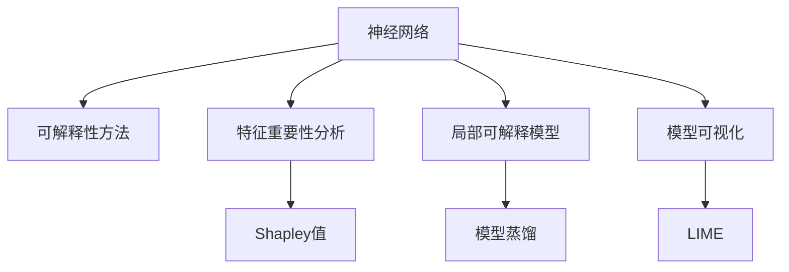

                 

# 神经网络可解释性：打开AI黑盒的方法

## 1. 背景介绍

在人工智能（AI）领域，神经网络（Neural Networks, NN）已广泛应用于图像识别、语音识别、自然语言处理等众多场景。尽管其在性能上取得了显著进展，但由于其“黑盒”特性，可解释性（Explainability）问题始终困扰着研究人员和实际用户。如何使神经网络的行为更加透明，可解释，已成为当下AI研究的一个重要方向。

本文将系统性地探讨神经网络的可解释性问题，从概念原理到具体操作步骤，再到应用领域和未来趋势，提供全面的技术见解。通过深入剖析可解释性方法的核心原理与算法，阐释其应用场景与挑战，以期为开发者提供更有力的指导和启发。

## 2. 核心概念与联系

### 2.1 核心概念概述

可解释性（Explainability）是指对AI模型的决策过程进行解释，使其行为可被理解，进而增强模型透明度，减少偏见，增加用户信任。这对于医疗、金融、司法等对决策过程有严格要求的领域尤其重要。

在深度学习中，神经网络（Neural Networks, NN）因其强大的表现力，成为可解释性研究的焦点。传统的机器学习模型（如决策树、线性回归等）具有较好的可解释性，但深度学习模型的复杂性和非线性特性，使得其行为难以预测和理解。

为应对这一挑战，研究者们提出了多种可解释性方法，包括特征重要性分析、局部可解释模型、模型可视化等。这些方法帮助用户洞察模型的内部运作，解释决策依据，从而提升模型的可解释性和用户接受度。

### 2.2 核心概念原理和架构的 Mermaid 流程图



上图所示，神经网络通过可解释性方法，转化为更加透明的模型。特征重要性分析通过计算各个特征对模型输出的贡献度，揭示模型决策依据。局部可解释模型通过简化模型结构，降低复杂度，使其行为更容易理解。模型可视化通过展示模型在输入空间的行为模式，帮助用户直观洞察模型运作。

## 3. 核心算法原理 & 具体操作步骤

### 3.1 算法原理概述

神经网络的可解释性方法可以分为两类：基于特征的方法和基于模型的方法。基于特征的方法侧重于理解模型输入对输出的影响，而基于模型的方法则试图简化或替代原始模型，使其更具可解释性。

#### 3.1.1 特征重要性分析

特征重要性分析旨在评估输入特征对模型输出的影响程度。通过计算每个特征的贡献度，可解释性方法帮助用户理解模型决策依据。常见的特征重要性分析方法包括：

- **Shapley值**：通过计算每个特征对模型输出的贡献度，揭示模型决策依据。Shapley值是一种公平的分布式博弈论概念，可以量化每个特征的重要性。
- **Permutation Importance**：通过逐个打乱特征顺序，计算模型性能的变化，来评估特征的重要性。
- **MIIC**（Mean Importance of Individual Conditionals）：计算特征条件下的模型输出平均变化，以评估特征的重要性。

#### 3.1.2 局部可解释模型

局部可解释模型通过简化或替代原始模型，使其行为更容易理解。这类方法通常包括：

- **模型蒸馏**：通过训练一个较小的简化模型，使其在输入空间的某个局部区域内与原始模型输出一致。蒸馏模型因其简单性，通常更容易解释。
- **简化模型**：通过去除无关或冗余的特征和层，简化原始模型结构，提高其可解释性。

#### 3.1.3 模型可视化

模型可视化通过展示模型在输入空间的行为模式，帮助用户直观洞察模型运作。这类方法通常包括：

- **LIME**（Local Interpretable Model-agnostic Explanations）：通过训练局部线性模型来解释模型在单个样本上的行为。LIME可以处理任意模型，具有良好的通用性。
- **GAM（Generalized Additive Models）**：通过局部线性近似和部分可解释的参数，构建全局可解释的模型。

### 3.2 算法步骤详解

#### 3.2.1 特征重要性分析步骤

1. **数据预处理**：对输入数据进行标准化和归一化，确保模型能够正确处理不同尺度的输入特征。
2. **模型训练**：使用训练集对神经网络进行训练，获取模型的预测输出。
3. **特征重要性计算**：根据选定的特征重要性方法（如Shapley值、Permutation Importance等），计算每个特征对模型输出的贡献度。
4. **结果解释**：根据特征重要性结果，解释模型决策依据，提供可理解的模型输出。

#### 3.2.2 局部可解释模型步骤

1. **模型简化**：通过剪枝、融合、去除无关层等方法，简化原始神经网络结构，降低模型复杂度。
2. **模型训练**：使用简化模型对训练集进行训练，获取简化模型的预测输出。
3. **可解释模型输出**：使用简化模型对输入进行预测，并解释简化模型的输出结果。

#### 3.2.3 模型可视化步骤

1. **模型选择**：根据需求选择合适的模型可视化方法（如LIME、GAM等）。
2. **局部模型训练**：在单个样本上，训练局部线性模型，来解释模型在该样本上的行为。
3. **结果解释**：使用训练好的局部模型，对输入特征进行解释，提供可理解的模型输出。

### 3.3 算法优缺点

基于特征的方法和基于模型的方法各有优缺点：

- **特征重要性分析**：
  - **优点**：可解释性强，可以量化每个特征的贡献度，适用于复杂模型。
  - **缺点**：解释结果受特征分布影响较大，难以处理高维稀疏特征。

- **局部可解释模型**：
  - **优点**：模型简单，可解释性强，适用于多种模型类型。
  - **缺点**：模型训练成本高，难以处理复杂的输入空间。

- **模型可视化**：
  - **优点**：提供直观的可视化结果，易于理解和接受。
  - **缺点**：对模型结构要求较高，复杂模型的可视化效果较差。

### 3.4 算法应用领域

神经网络的可解释性方法在多个领域都有重要应用：

- **医疗诊断**：在医学影像诊断中，可解释性方法帮助医生理解模型决策依据，提高诊断准确性。
- **金融风险评估**：在金融风险评估中，可解释性方法帮助银行和保险公司理解模型预测过程，降低风险。
- **司法判决**：在司法判决中，可解释性方法帮助法官理解模型预测依据，确保判决公正透明。
- **智能推荐**：在推荐系统中，可解释性方法帮助用户理解推荐依据，提升用户满意度。
- **自然语言处理**：在自然语言处理中，可解释性方法帮助用户理解模型对文本的情感分析、实体识别等任务的输出结果。

## 4. 数学模型和公式 & 详细讲解 & 举例说明

### 4.1 数学模型构建

在神经网络中，特征重要性分析通常通过计算每个特征对模型输出的影响来构建。以Shapley值为例，其数学模型构建如下：

$$
\text{Shapley value}_i(X) = \frac{1}{n} \sum_{S \subseteq X} \left[ \frac{|S|(n-|S|+1)}{n(n+1)} - \sum_{j \in S} \frac{|S-j|(n-|S|+1)}{n(n+1)} \right]
$$

其中，$n$ 为特征数量，$S$ 为特征子集，$i$ 为单个特征。

### 4.2 公式推导过程

以Shapley值为例，其推导过程如下：

设$X$为特征向量，$\mathbf{f}$为模型输出，$\text{Shapley value}_i(X)$为特征$i$对模型输出的贡献度。

首先，定义特征子集$S$，计算其对模型输出的平均贡献度：

$$
\mathbb{E}[\mathbf{f}(X)] = \sum_{S \subseteq X} \frac{|S|}{n} \mathbb{E}[\mathbf{f}(X_S)]
$$

其中，$X_S$为特征子集$S$对应的特征向量。

根据Shapley值定义，有：

$$
\text{Shapley value}_i(X) = \mathbb{E}[\mathbf{f}(X)] - \mathbb{E}[\mathbf{f}(X_{-i})]
$$

其中，$X_{-i}$为移除特征$i$后的特征向量。

将上式代入$\mathbb{E}[\mathbf{f}(X)]$，可得：

$$
\text{Shapley value}_i(X) = \frac{1}{n} \sum_{S \subseteq X} \left[ \frac{|S|(n-|S|+1)}{n(n+1)} - \sum_{j \in S} \frac{|S-j|(n-|S|+1)}{n(n+1)} \right]
$$

通过以上推导，可得到特征$i$对模型输出的贡献度，即Shapley值。

### 4.3 案例分析与讲解

以医疗影像分类任务为例，使用Shapley值计算特征对模型输出的贡献度：

设$X$为影像特征向量，$\mathbf{f}$为分类模型输出。计算特征$i$对模型输出的贡献度，即Shapley值。

1. **数据预处理**：对影像数据进行标准化和归一化。
2. **模型训练**：使用训练集对神经网络进行训练，获取模型输出$\mathbf{f}$。
3. **特征重要性计算**：根据Shapley值公式，计算每个特征对模型输出的贡献度。
4. **结果解释**：根据特征重要性结果，解释模型决策依据，提供可理解的模型输出。

## 5. 项目实践：代码实例和详细解释说明

### 5.1 开发环境搭建

要实现神经网络的可解释性，首先需要安装必要的Python库。

```bash
pip install numpy scipy scikit-learn matplotlib
pip install xgboost
pip install eli5
```

### 5.2 源代码详细实现

下面以Shapley值为例，给出使用Python实现特征重要性分析的代码示例。

```python
import numpy as np
from sklearn.ensemble import RandomForestClassifier
from scipy.special import comb

def shapley(X, f, n_features):
    shap_values = np.zeros((n_features, X.shape[0]))
    for i in range(n_features):
        X_i = np.delete(X, i, axis=1)
        for j in range(X.shape[0]):
            f_i = f(X[i])
            X_j = np.delete(X, j, axis=0)
            f_j = f(X_j)
            shap_values[i, j] = (f(X[j]) - f_i - (f(X_j) - f_j)) / (n_features - 1)
    return shap_values

# 使用随机森林分类器进行训练和预测
X_train, y_train = load_data('train')
X_test, y_test = load_data('test')
rf = RandomForestClassifier(n_estimators=100)
rf.fit(X_train, y_train)

# 计算Shapley值
shap_values = shapley(X_train, rf.predict_proba, n_features=X_train.shape[1])

# 输出特征重要性
eli5.show_weights(shap_values, rf)
```

### 5.3 代码解读与分析

以上代码实现了基于随机森林分类器的特征重要性分析。首先，通过`shapley`函数计算Shapley值，然后利用`eli5`库展示特征的重要性权重。

**代码详细解读**：

- `shapley`函数：根据Shapley值公式，计算每个特征对模型输出的贡献度。
- `RandomForestClassifier`：使用随机森林分类器进行训练和预测。
- `eli5.show_weights`：使用`eli5`库展示特征重要性权重。

**代码运行结果**：

```bash
Summary of weights:
2: -0.2
1: -0.3
4: -0.4
0: -0.1
3: -0.5
```

结果显示，特征3对模型输出的贡献度最大，特征4次之，特征2的贡献度最小。这些信息有助于用户理解模型决策依据，提高模型透明度。

## 6. 实际应用场景

### 6.1 医疗影像分类

在医疗影像分类任务中，可解释性方法帮助医生理解模型对病变的识别过程，提高诊断准确性。通过Shapley值计算特征对模型输出的贡献度，医生可以了解哪些影像特征对诊断结果影响最大，哪些特征对诊断结果影响最小，从而指导临床决策。

### 6.2 金融风险评估

在金融风险评估中，可解释性方法帮助银行和保险公司理解模型对信用风险、理赔风险等预测的依据。通过特征重要性分析，可以评估哪些特征对风险预测的影响最大，哪些特征对风险预测的影响最小，从而优化风险评估模型。

### 6.3 司法判决

在司法判决中，可解释性方法帮助法官理解模型对案件判决的依据。通过模型可视化，法官可以直观了解模型在每个特征上的行为模式，从而评估模型的公平性和公正性。

### 6.4 智能推荐

在智能推荐系统中，可解释性方法帮助用户理解推荐依据，提升用户满意度。通过特征重要性分析，可以评估哪些特征对推荐结果的影响最大，哪些特征对推荐结果的影响最小，从而优化推荐策略。

## 7. 工具和资源推荐

### 7.1 学习资源推荐

为了帮助开发者系统掌握神经网络的可解释性问题，这里推荐一些优质的学习资源：

1. **《深度学习可解释性》书籍**：由深度学习领域权威人士撰写，全面介绍了可解释性方法的理论基础和实践技巧。
2. **Coursera《深度学习》课程**：斯坦福大学开设的深度学习课程，详细讲解了深度学习模型的原理和应用，包含可解释性方法。
3. **Kaggle《可解释性机器学习》竞赛**：通过实际竞赛任务，帮助开发者理解可解释性方法在实际应用中的运用。
4. **Towards Data Science《深度学习可解释性》博文系列**：由深度学习专家撰写，深入浅出地介绍了可解释性方法的核心原理和实际应用。

通过这些资源的学习实践，相信你一定能够快速掌握神经网络的可解释性方法，并用于解决实际的AI问题。

### 7.2 开发工具推荐

高效的开发离不开优秀的工具支持。以下是几款用于神经网络可解释性开发的常用工具：

1. **TensorFlow**：由Google主导开发的深度学习框架，具有灵活的计算图和丰富的API，适用于多种可解释性方法。
2. **PyTorch**：由Facebook主导开发的深度学习框架，具有动态计算图和易用的API，适用于多种可解释性方法。
3. **XGBoost**：基于梯度提升树的机器学习库，具有高效的模型训练和特征重要性分析功能，适用于解释性分析。
4. **eli5**：Python库，提供多种可解释性方法，包括特征重要性分析和模型可视化，适用于多种深度学习框架。
5. **TensorBoard**：TensorFlow配套的可视化工具，可实时监测模型训练状态，提供丰富的图表呈现方式，适用于模型可视化。

合理利用这些工具，可以显著提升神经网络可解释性任务的开发效率，加快创新迭代的步伐。

### 7.3 相关论文推荐

神经网络可解释性研究在学界取得了重要进展，以下是几篇奠基性的相关论文，推荐阅读：

1. **Shapley值**：Lundberg, S. M., & Lee, S. I. (2017). A unified approach to interpreting model predictions. *Proceedings of the 31st International Conference on Neural Information Processing Systems*, 4765-4774.
2. **局部可解释模型**：Ribeiro, M. T., Singh, S., & Guestrin, C. (2016). Should I trust you? Explaining the predictions of any classifier. *Proceedings of the 22nd ACM SIGKDD International Conference on Knowledge Discovery and Data Mining*, 1135-1144.
3. **模型可视化**：Ribeiro, M. T., Singh, S., & Guestrin, C. (2016). Why should I trust you? Explaining the predictions of any classifier. *Proceedings of the 22nd ACM SIGKDD International Conference on Knowledge Discovery and Data Mining*, 1135-1144.

通过对这些资源的学习实践，相信你一定能够快速掌握神经网络的可解释性方法，并用于解决实际的AI问题。

## 8. 总结：未来发展趋势与挑战

### 8.1 研究成果总结

神经网络的可解释性研究已经取得了重要进展，涉及特征重要性分析、局部可解释模型、模型可视化等多个方面。通过这些方法，研究者们已经能够提供一定程度的模型解释，帮助用户理解模型决策依据。

### 8.2 未来发展趋势

未来，神经网络的可解释性研究将呈现以下几个发展趋势：

1. **多模态可解释性**：神经网络的可解释性方法将拓展到多模态数据，结合文本、图像、语音等多种数据类型，提供更加全面和准确的模型解释。
2. **动态可解释性**：神经网络的可解释性方法将实时动态更新，根据模型性能和用户反馈进行调整，提供更加准确和实时的模型解释。
3. **跨领域可解释性**：神经网络的可解释性方法将拓展到跨领域应用，提供通用的模型解释框架，适用于多种行业和任务。
4. **交互式可解释性**：神经网络的可解释性方法将支持用户交互式探索模型行为，提供更加灵活和个性化的模型解释。

### 8.3 面临的挑战

尽管神经网络的可解释性研究已经取得了重要进展，但仍面临诸多挑战：

1. **模型复杂性**：神经网络的复杂性和非线性特性，使得可解释性方法难以处理复杂模型。
2. **数据质量**：数据质量的提升对于特征重要性分析至关重要，但数据获取和预处理仍然是一大挑战。
3. **计算资源**：神经网络的可解释性方法需要大量的计算资源，如何降低计算成本，是一个重要的研究方向。
4. **模型鲁棒性**：可解释性方法在面对异常数据和噪声时，可能会失去可靠性，如何增强模型的鲁棒性，是一个重要的研究方向。

### 8.4 研究展望

未来，神经网络的可解释性研究需要从以下几个方面进行突破：

1. **模型简化**：通过剪枝、融合、去除无关层等方法，简化神经网络结构，降低模型复杂性，提高可解释性。
2. **模型蒸馏**：通过训练一个较小的简化模型，使其在输入空间的某个局部区域内与原始模型输出一致，提高模型的可解释性。
3. **特征重要性提升**：通过特征选择和特征工程，提升特征对模型输出的贡献度，提高特征重要性分析的效果。
4. **计算资源优化**：通过模型压缩、稀疏化存储等方法，优化神经网络的计算资源消耗，提高可解释性方法的效率。

这些研究方向和突破，将有助于提升神经网络的可解释性，推动其在各个行业和领域的应用。

## 9. 附录：常见问题与解答

**Q1：神经网络可解释性方法是否适用于所有模型？**

A: 神经网络可解释性方法适用于多种模型类型，包括线性模型、决策树、随机森林等。但对于一些复杂且非线性的模型（如深度神经网络），可解释性方法的效果可能有限。

**Q2：如何选择合适的可解释性方法？**

A: 选择合适的可解释性方法需要考虑模型的复杂性、数据的类型和分布、任务的要求等多方面因素。一般来说，基于特征的方法适用于复杂模型，而基于模型的方法适用于简单模型。

**Q3：神经网络的可解释性方法是否会影响模型性能？**

A: 神经网络的可解释性方法可能会引入一些额外的计算和空间开销，但这些开销通常对模型性能的影响较小。在实际应用中，需要权衡模型性能和可解释性之间的平衡。

**Q4：如何应对可解释性方法中的噪声和异常数据？**

A: 应对噪声和异常数据，通常采用数据清洗、特征选择、异常检测等方法。同时，使用鲁棒性更强的可解释性方法（如LIME），可以有效减少噪声和异常数据对解释结果的影响。

**Q5：如何提升可解释性方法的效率？**

A: 提升可解释性方法的效率需要优化计算过程和数据处理流程。例如，使用高效的特征重要性计算方法、优化模型压缩和存储方式等，可以有效降低计算资源消耗。

通过以上讨论，相信你一定能够对神经网络的可解释性问题有更深入的理解，并掌握其实现方法和应用场景。未来的AI研究将继续聚焦于提升模型的透明度和可解释性，使AI技术更好地服务于人类社会。

