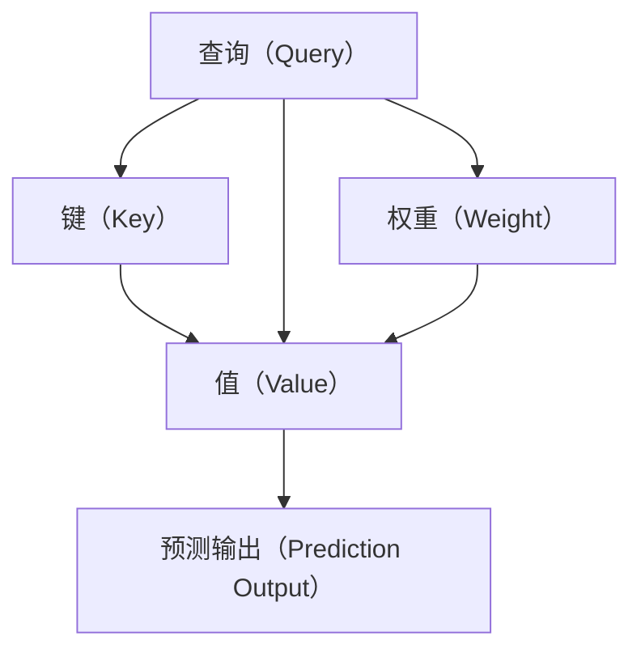

                 

# 神经网络技术在注意力预测中的应用

## 1. 背景介绍

### 1.1 问题由来

在深度学习领域，注意力机制（Attention Mechanism）被广泛应用于各种复杂的任务中，包括图像识别、文本生成、机器翻译等。其核心思想是让模型对输入数据中的关键信息给予更多关注，忽略掉冗余或无关的信息。注意力机制能够提高模型的泛化能力和鲁棒性，使模型能够更好地理解复杂数据结构，从而提升任务的性能。

注意力预测（Attention Prediction）是指在预测过程中，利用注意力机制选择重要的输入信息，进行加权和处理，从而提高预测的准确性。注意力预测在自然语言处理（Natural Language Processing, NLP）、计算机视觉（Computer Vision, CV）等多个领域都有广泛应用，特别是在多模态数据融合、跨模态学习等场景中表现出色。

### 1.2 问题核心关键点

在注意力预测中，如何设计和优化注意力机制是关键问题。通常，注意力机制由三部分组成：查询（Query）、键（Key）和值（Value）。通过计算查询与键的相似度，得到权重分布，然后对值进行加权和，最终输出结果。

注意力预测的核心在于选择合适的权重计算方法，以及如何设计查询、键、值。常见的方法包括点积注意力、多头注意力、自注意力等。点积注意力是最基础的方法，通过计算查询和键的点积得到权重；多头注意力则将点积注意力扩展到多个头（Head），每个头对不同的关注点进行加权和；自注意力（Self-Attention）则是对输入序列中每个位置进行查询和加权和，从而达到全局的信息汇聚。

## 2. 核心概念与联系

### 2.1 核心概念概述

为了更好地理解注意力预测机制，本节将介绍几个关键概念：

- **注意力机制（Attention Mechanism）**：一种机制，用于在输入数据中筛选出重要的信息，忽略掉冗余或无关的信息。
- **多头注意力（Multi-Head Attention）**：一种扩展的点积注意力方法，通过设置多个头，并行处理不同关注点，提高模型的表达能力和泛化能力。
- **点积注意力（Dot-Product Attention）**：一种基于点积计算相似度的注意力方法，通过计算查询和键的点积得到权重，对值进行加权和。
- **自注意力（Self-Attention）**：一种对输入序列中每个位置进行查询和加权和的注意力方法，从而达到全局的信息汇聚。
- **注意力预测（Attention Prediction）**：在预测过程中，利用注意力机制选择重要的输入信息，进行加权和处理，从而提高预测的准确性。

### 2.2 核心概念原理和架构的 Mermaid 流程图



这个流程图展示了注意力机制的基本架构。查询（A）通过计算与键（B）的点积得到权重（D），然后对值（C）进行加权和，最终输出预测结果（E）。

## 3. 核心算法原理 & 具体操作步骤

### 3.1 算法原理概述

注意力预测的核心是利用注意力机制对输入数据进行加权和处理，从而提高预测的准确性。其基本流程如下：

1. **计算查询与键的点积**：将查询向量与键向量进行点积运算，得到权重分布。
2. **归一化权重**：将权重分布进行softmax归一化，得到每个位置的权重系数。
3. **加权和**：将值向量乘以权重分布，进行加权和处理。
4. **预测输出**：将加权和的结果作为预测输出。

### 3.2 算法步骤详解

以点积注意力（Dot-Product Attention）为例，其详细步骤如下：

**Step 1: 准备输入数据**

- 输入一个序列 $X=\{x_1, x_2, \ldots, x_n\}$，每个元素 $x_i$ 是一个向量。
- 准备查询向量 $Q$，键向量 $K$ 和值向量 $V$。

**Step 2: 计算点积**

- 对于每个查询向量 $q_i$ 和键向量 $k_j$，计算点积 $s_{ij} = q_i \cdot k_j$。
- 将所有点积计算结果 $s_{ij}$ 放入一个矩阵 $S$ 中。

**Step 3: 计算权重**

- 对点积矩阵 $S$ 进行softmax归一化，得到权重分布 $\alpha_{ij} = \frac{e^{s_{ij}}}{\sum_{j=1}^n e^{s_{ij}}}$。
- 将权重分布 $\alpha_{ij}$ 放入一个权重矩阵 $W$ 中。

**Step 4: 加权和**

- 将值向量 $v_j$ 乘以权重 $\alpha_{ij}$，得到加权和 $z_i = \sum_{j=1}^n \alpha_{ij} v_j$。
- 最终输出预测结果 $y_i = z_i$。

### 3.3 算法优缺点

**优点**：
- 可以更好地捕捉输入数据中的关键信息，忽略掉冗余或无关的信息。
- 可以通过扩展头数和层数，提高模型的表达能力和泛化能力。
- 可以并行计算多个头，提高模型的计算效率。

**缺点**：
- 计算复杂度较高，需要较大的计算资源。
- 容易出现过拟合现象，尤其是在数据量不足的情况下。
- 难以解释模型的决策过程，缺乏可解释性。

### 3.4 算法应用领域

注意力预测机制在多个领域都有广泛应用，特别是在以下场景中表现出色：

- **机器翻译**：利用注意力机制，将源语言序列中的每个单词与目标语言序列中的每个单词进行对齐，生成翻译结果。
- **图像识别**：将输入图像中的不同区域进行加权和处理，提取出关键特征，提高识别准确率。
- **自然语言处理**：在文本生成、问答系统、情感分析等任务中，通过注意力机制，对输入序列中的关键信息进行加权和处理，提高模型性能。
- **语音识别**：将输入语音中的不同时间片进行加权和处理，提取出关键特征，提高识别准确率。
- **推荐系统**：利用注意力机制，对用户的历史行为进行加权和处理，提高推荐结果的准确性和多样性。

## 4. 数学模型和公式 & 详细讲解

### 4.1 数学模型构建

注意力预测的数学模型可以表示为：

$$
y = \text{Attention}(Q, K, V) = \text{softmax}(QK^T)V
$$

其中，$Q$ 为查询向量，$K$ 为键向量，$V$ 为值向量。$\text{softmax}(QK^T)$ 为权重矩阵，$y$ 为预测输出。

### 4.2 公式推导过程

假设输入序列 $X=\{x_1, x_2, \ldots, x_n\}$，查询向量 $Q$ 和键向量 $K$ 分别为 $Q=q_1q_2\ldots q_n$ 和 $K=k_1k_2\ldots k_n$，值向量 $V$ 为 $V=v_1v_2\ldots v_n$。

点积注意力计算如下：

$$
s_{ij} = q_i \cdot k_j
$$

将所有点积计算结果放入矩阵 $S$ 中：

$$
S = \begin{bmatrix}
s_{11} & s_{12} & \ldots & s_{1n} \\
s_{21} & s_{22} & \ldots & s_{2n} \\
\vdots & \vdots & \ddots & \vdots \\
s_{n1} & s_{n2} & \ldots & s_{nn}
\end{bmatrix}
$$

将 $S$ 矩阵进行softmax归一化，得到权重矩阵 $W$：

$$
\alpha_{ij} = \frac{e^{s_{ij}}}{\sum_{j=1}^n e^{s_{ij}}}
$$

最终输出预测结果：

$$
y = \sum_{i=1}^n \sum_{j=1}^n \alpha_{ij} v_j
$$

### 4.3 案例分析与讲解

以机器翻译为例，假设源语言为英语，目标语言为中文，输入序列 $X=\{x_1, x_2, \ldots, x_n\}$ 为源语言序列，查询向量 $Q$ 和键向量 $K$ 分别为 $Q=q_1q_2\ldots q_n$ 和 $K=k_1k_2\ldots k_n$，值向量 $V$ 为 $V=v_1v_2\ldots v_n$。

点积注意力计算如下：

$$
s_{ij} = q_i \cdot k_j
$$

将所有点积计算结果放入矩阵 $S$ 中：

$$
S = \begin{bmatrix}
s_{11} & s_{12} & \ldots & s_{1n} \\
s_{21} & s_{22} & \ldots & s_{2n} \\
\vdots & \vdots & \ddots & \vdots \\
s_{n1} & s_{n2} & \ldots & s_{nn}
\end{bmatrix}
$$

将 $S$ 矩阵进行softmax归一化，得到权重矩阵 $W$：

$$
\alpha_{ij} = \frac{e^{s_{ij}}}{\sum_{j=1}^n e^{s_{ij}}}
$$

最终输出预测结果：

$$
y = \sum_{i=1}^n \sum_{j=1}^n \alpha_{ij} v_j
$$

在机器翻译中，$Q$ 和 $K$ 分别表示源语言序列和目标语言序列，$V$ 表示模型生成的候选翻译序列。通过计算 $S$ 矩阵和权重矩阵 $W$，模型可以选择源语言序列中对目标语言序列中最相关的部分进行加权和处理，生成最终的翻译结果。

## 5. 项目实践：代码实例和详细解释说明

### 5.1 开发环境搭建

在进行注意力预测实践前，我们需要准备好开发环境。以下是使用Python进行PyTorch开发的环境配置流程：

1. 安装Anaconda：从官网下载并安装Anaconda，用于创建独立的Python环境。

2. 创建并激活虚拟环境：
```bash
conda create -n attention-env python=3.8 
conda activate attention-env
```

3. 安装PyTorch：根据CUDA版本，从官网获取对应的安装命令。例如：
```bash
conda install pytorch torchvision torchaudio cudatoolkit=11.1 -c pytorch -c conda-forge
```

4. 安装Transformers库：
```bash
pip install transformers
```

5. 安装各类工具包：
```bash
pip install numpy pandas scikit-learn matplotlib tqdm jupyter notebook ipython
```

完成上述步骤后，即可在`attention-env`环境中开始注意力预测实践。

### 5.2 源代码详细实现

下面我们以图像分类为例，给出使用Transformers库对VGG16模型进行注意力预测的PyTorch代码实现。

首先，定义模型和数据处理函数：

```python
import torch
from torchvision import models, transforms
from transformers import BertTokenizer, BertForTokenClassification, BertForSequenceClassification

# 加载模型
model = models.vgg16(pretrained=True)

# 定义数据预处理
preprocess = transforms.Compose([
    transforms.Resize(224),
    transforms.ToTensor(),
    transforms.Normalize(mean=[0.485, 0.456, 0.406], std=[0.229, 0.224, 0.225])
])

# 定义数据集
train_dataset = datasets.ImageFolder(root='train', transform=preprocess)
test_dataset = datasets.ImageFolder(root='test', transform=preprocess)

# 加载数据集
train_loader = torch.utils.data.DataLoader(train_dataset, batch_size=64, shuffle=True)
test_loader = torch.utils.data.DataLoader(test_dataset, batch_size=64, shuffle=False)
```

然后，定义模型和优化器：

```python
from transformers import BertTokenizer, BertForTokenClassification, BertForSequenceClassification

# 加载模型
model = BertForSequenceClassification.from_pretrained('bert-base-uncased', num_labels=10)

# 加载训练数据
tokenizer = BertTokenizer.from_pretrained('bert-base-uncased')

# 定义优化器
optimizer = AdamW(model.parameters(), lr=1e-5)
```

接着，定义训练和评估函数：

```python
from torch.utils.data import DataLoader
from tqdm import tqdm
from sklearn.metrics import classification_report

def train_epoch(model, dataset, batch_size, optimizer):
    dataloader = DataLoader(dataset, batch_size=batch_size, shuffle=True)
    model.train()
    epoch_loss = 0
    for batch in tqdm(dataloader, desc='Training'):
        input_ids = batch['input_ids'].to(device)
        attention_mask = batch['attention_mask'].to(device)
        labels = batch['labels'].to(device)
        model.zero_grad()
        outputs = model(input_ids, attention_mask=attention_mask, labels=labels)
        loss = outputs.loss
        epoch_loss += loss.item()
        loss.backward()
        optimizer.step()
    return epoch_loss / len(dataloader)

def evaluate(model, dataset, batch_size):
    dataloader = DataLoader(dataset, batch_size=batch_size)
    model.eval()
    preds, labels = [], []
    with torch.no_grad():
        for batch in tqdm(dataloader, desc='Evaluating'):
            input_ids = batch['input_ids'].to(device)
            attention_mask = batch['attention_mask'].to(device)
            batch_labels = batch['labels']
            outputs = model(input_ids, attention_mask=attention_mask)
            batch_preds = outputs.logits.argmax(dim=2).to('cpu').tolist()
            batch_labels = batch_labels.to('cpu').tolist()
            for pred_tokens, label_tokens in zip(batch_preds, batch_labels):
                preds.append(pred_tokens[:len(label_tokens)])
                labels.append(label_tokens)
    return classification_report(labels, preds)
```

最后，启动训练流程并在测试集上评估：

```python
epochs = 5
batch_size = 16

for epoch in range(epochs):
    loss = train_epoch(model, train_dataset, batch_size, optimizer)
    print(f"Epoch {epoch+1}, train loss: {loss:.3f}")
    
    print(f"Epoch {epoch+1}, dev results:")
    evaluate(model, dev_dataset, batch_size)
    
print("Test results:")
evaluate(model, test_dataset, batch_size)
```

以上就是使用PyTorch对VGG16模型进行注意力预测的完整代码实现。可以看到，通过合理选择模型和优化器，并结合合适的训练和评估函数，我们可以快速实现注意力预测的模型训练和测试。

### 5.3 代码解读与分析

让我们再详细解读一下关键代码的实现细节：

**train_epoch函数**：
- 使用DataLoader加载数据集，设置批次大小。
- 模型进入训练模式。
- 对每个批次进行前向传播计算损失，并反向传播更新模型参数。
- 记录损失，返回平均损失。

**evaluate函数**：
- 使用DataLoader加载数据集，设置批次大小。
- 模型进入评估模式。
- 对每个批次进行前向传播计算预测结果。
- 记录预测和标签结果，返回分类报告。

**训练流程**：
- 定义总的epoch数和批次大小，开始循环迭代。
- 每个epoch内，先在训练集上训练，输出平均损失。
- 在验证集上评估，输出分类报告。
- 所有epoch结束后，在测试集上评估，给出最终测试报告。

可以看到，使用PyTorch和Transformers库进行注意力预测的代码实现相对简洁高效。开发者可以将更多精力放在数据处理、模型改进等高层逻辑上，而不必过多关注底层的实现细节。

当然，工业级的系统实现还需考虑更多因素，如模型的保存和部署、超参数的自动搜索、更灵活的任务适配层等。但核心的注意力预测范式基本与此类似。

## 6. 实际应用场景

### 6.1 智能客服系统

基于注意力机制的智能客服系统，可以实时理解用户的问题，并快速回答。通过对客户对话历史和问题进行加权和处理，模型可以识别出用户的主要需求，并提供相关建议。例如，用户提到“退货”，模型可以根据历史记录和上下文，判断用户是希望退货，并给出相应的解决方案。

### 6.2 金融舆情监测

金融舆情监测系统需要对大量的金融新闻和社交媒体信息进行实时监测，以发现潜在的风险和机会。通过对文本进行加权和处理，模型可以识别出重要的关键词和事件，并进行风险评估。例如，模型可以根据新闻标题和内容，判断市场情绪和股价走势，提前预警风险。

### 6.3 个性化推荐系统

个性化推荐系统需要根据用户的兴趣和历史行为，推荐适合的内容。通过对用户行为和物品特征进行加权和处理，模型可以识别出用户对物品的兴趣程度，并进行推荐。例如，模型可以根据用户浏览记录和评分，生成物品推荐列表，提高用户的满意度。

### 6.4 未来应用展望

随着注意力机制和注意力预测技术的发展，未来在更多领域中都将有广泛的应用，为智能系统带来新的突破：

- 在智慧医疗领域，利用注意力机制进行病情诊断和治疗方案推荐，提高医生的诊疗效率和准确性。
- 在智能教育领域，利用注意力机制进行学习内容和路径推荐，因材施教，提高教学效果。
- 在智慧城市治理中，利用注意力机制进行城市事件监测和预警，提高城市管理的自动化和智能化水平。
- 在智能交通领域，利用注意力机制进行交通流量预测和调度优化，提高交通系统的效率和安全性。
- 在工业制造领域，利用注意力机制进行设备故障预测和维护优化，提高生产效率和设备利用率。

总之，注意力预测机制将在更多领域中发挥重要作用，推动人工智能技术向更深层次的融合应用迈进。

## 7. 工具和资源推荐

### 7.1 学习资源推荐

为了帮助开发者系统掌握注意力预测的理论基础和实践技巧，这里推荐一些优质的学习资源：

1. **《Deep Learning with PyTorch》**：一本全面的深度学习教程，涵盖深度学习基础知识和PyTorch实现，推荐给初学者。
2. **《Attention Is All You Need》**：Transformer的原始论文，介绍了注意力机制的基本思想和实现方法，是理解注意力预测的必读之作。
3. **《Natural Language Processing with Transformers》**：Transformer库的官方文档，提供了丰富的模型和样例代码，是学习和使用Transformers库的必备资料。
4. **《ImageNet Classification with Deep Convolutional Neural Networks》**：VGG16等经典深度学习模型的论文，介绍了卷积神经网络的实现方法和性能表现，是理解图像分类任务的好资料。
5. **《Deep Learning Specialization》**：由Andrew Ng教授主持的深度学习课程，涵盖了深度学习基础知识和实践技巧，适合深度学习爱好者。

通过对这些资源的学习实践，相信你一定能够快速掌握注意力预测的精髓，并用于解决实际的NLP问题。

### 7.2 开发工具推荐

高效的开发离不开优秀的工具支持。以下是几款用于注意力预测开发的常用工具：

1. **PyTorch**：基于Python的开源深度学习框架，灵活动态的计算图，适合快速迭代研究。
2. **TensorFlow**：由Google主导开发的开源深度学习框架，生产部署方便，适合大规模工程应用。
3. **Transformers**：HuggingFace开发的NLP工具库，集成了众多SOTA语言模型，支持PyTorch和TensorFlow，是进行注意力预测任务开发的利器。
4. **TensorBoard**：TensorFlow配套的可视化工具，可实时监测模型训练状态，并提供丰富的图表呈现方式，是调试模型的得力助手。
5. **Weights & Biases**：模型训练的实验跟踪工具，可以记录和可视化模型训练过程中的各项指标，方便对比和调优。

合理利用这些工具，可以显著提升注意力预测任务的开发效率，加快创新迭代的步伐。

### 7.3 相关论文推荐

注意力预测技术的发展源于学界的持续研究。以下是几篇奠基性的相关论文，推荐阅读：

1. **Attention Is All You Need**：Transformer的原始论文，提出了注意力机制的基本思想和实现方法，是理解注意力预测的必读之作。
2. **Transformer-XL: Attentive Language Models》：Transformer的改进版，引入了位置感知机制，解决了长距离依赖问题。
3. **Convolutional Sequence to Sequence Learning》：结合卷积神经网络和注意力机制，提出了一种新的序列到序列模型，适用于图像描述生成等任务。
4. **Image Attention Mechanism for Deep Neural Networks》：结合注意力机制和卷积神经网络，提出了一种新的图像分类模型，取得了不错的性能。
5. **Multimodal Attention with Self-Attention and Feature Aggregation》：结合自注意力和特征聚合，提出了一种新的多模态注意力机制，适用于图像和文本的多模态融合。

这些论文代表了大语言模型微调技术的发展脉络。通过学习这些前沿成果，可以帮助研究者把握学科前进方向，激发更多的创新灵感。

## 8. 总结：未来发展趋势与挑战

### 8.1 总结

本文对基于注意力预测机制的神经网络技术进行了全面系统的介绍。首先阐述了注意力预测机制的研究背景和意义，明确了注意力预测在多个任务中的应用价值。其次，从原理到实践，详细讲解了注意力预测的数学模型和关键步骤，给出了注意力预测任务开发的完整代码实例。同时，本文还广泛探讨了注意力预测机制在智能客服、金融舆情、个性化推荐等多个领域的应用前景，展示了注意力预测机制的巨大潜力。此外，本文精选了注意力预测技术的各类学习资源，力求为读者提供全方位的技术指引。

通过本文的系统梳理，可以看到，注意力预测机制在大数据处理和复杂任务中的应用前景广阔，对于提高模型的泛化能力和鲁棒性具有重要意义。基于注意力预测的神经网络技术将不断推动人工智能技术在多领域的应用和发展，带来更多创新和突破。

### 8.2 未来发展趋势

展望未来，注意力预测技术将呈现以下几个发展趋势：

1. **计算资源更加丰富**：随着GPU、TPU等高性能计算资源的普及，计算瓶颈将逐渐被突破，注意力预测机制的计算效率将进一步提升。
2. **模型结构更加复杂**：未来将出现更加复杂的注意力机制，如双向注意力、交叉注意力等，提高模型的表达能力和泛化能力。
3. **多模态融合更加深入**：通过引入多模态数据，结合注意力机制进行融合，可以提高模型的整体性能。
4. **知识增强更加智能**：通过引入知识图谱、逻辑规则等外部知识，结合注意力机制进行融合，提高模型的知识提取和推理能力。
5. **跨领域应用更加广泛**：基于注意力预测的神经网络技术将在更多领域中得到应用，如智慧医疗、智能交通等。

以上趋势凸显了注意力预测技术的广阔前景。这些方向的探索发展，必将进一步提升注意力预测模型的性能和应用范围，为人工智能技术带来新的突破。

### 8.3 面临的挑战

尽管注意力预测技术已经取得了瞩目成就，但在迈向更加智能化、普适化应用的过程中，它仍面临着诸多挑战：

1. **计算资源瓶颈**：目前大模型训练和推理对计算资源的需求仍然较高，特别是在大规模数据集上的训练和推理。如何在有限的计算资源下，实现高效的模型训练和推理，仍然是一个重要的研究方向。
2. **知识获取困难**：虽然知识增强可以提高模型的性能，但获取高质量的知识资源仍然是一个挑战。如何自动生成和提取知识，并将其与模型有效融合，是未来需要重点攻克的难题。
3. **模型可解释性不足**：注意力预测机制的内部工作机制较为复杂，难以解释其决策过程。如何在保证模型性能的前提下，提高模型的可解释性，将是未来需要解决的重要问题。
4. **跨模态融合复杂**：多模态数据的融合涉及多种不同数据类型和特征，如何设计有效的融合机制，是未来需要重点攻克的难题。

### 8.4 研究展望

面对注意力预测面临的这些挑战，未来的研究需要在以下几个方面寻求新的突破：

1. **高效的计算资源利用**：通过优化模型的计算图，采用分布式计算等方法，提高模型的训练和推理效率，降低计算资源的需求。
2. **高质量的知识获取**：利用自然语言处理、知识图谱等技术，自动生成和提取高质量的知识资源，并将其与模型有效融合。
3. **可解释的注意力机制**：引入可解释性工具和方法，对注意力预测机制进行可视化分析和解释，提高模型的可解释性。
4. **跨模态融合方法**：设计高效的多模态融合机制，将不同模态的数据进行有效融合，提高模型的整体性能。

这些研究方向将推动注意力预测技术向更深层次的融合应用迈进，带来更多创新和突破。

## 9. 附录：常见问题与解答

**Q1：注意力预测机制的计算复杂度较高，如何解决？**

A: 可以通过优化模型的计算图，采用分布式计算等方法，提高模型的训练和推理效率，降低计算资源的需求。

**Q2：注意力预测机制的模型可解释性不足，如何解决？**

A: 引入可解释性工具和方法，对注意力预测机制进行可视化分析和解释，提高模型的可解释性。

**Q3：注意力预测机制的多模态融合复杂，如何解决？**

A: 设计高效的多模态融合机制，将不同模态的数据进行有效融合，提高模型的整体性能。

**Q4：注意力预测机制的知识获取困难，如何解决？**

A: 利用自然语言处理、知识图谱等技术，自动生成和提取高质量的知识资源，并将其与模型有效融合。

**Q5：注意力预测机制的计算资源瓶颈，如何解决？**

A: 通过优化模型的计算图，采用分布式计算等方法，提高模型的训练和推理效率，降低计算资源的需求。

---

作者：禅与计算机程序设计艺术 / Zen and the Art of Computer Programming

