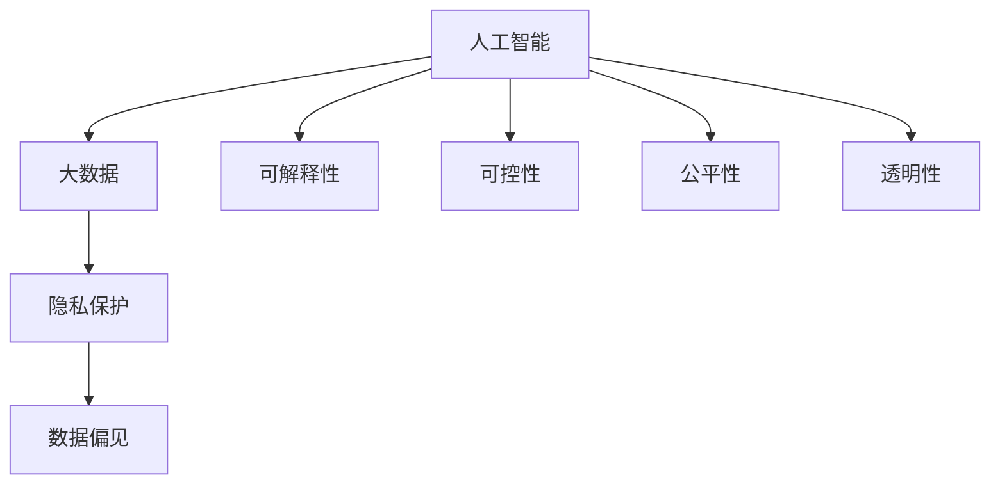
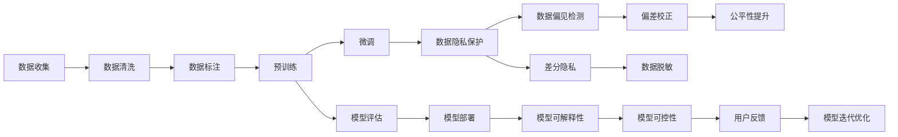

                 

# 科技与伦理的平衡：人类计算的 ethical 思考

## 1. 背景介绍

在当今社会，科技的发展与人类伦理的平衡是一个永恒的话题。随着人工智能、大数据等技术的快速进步，如何保障这些技术的健康发展，成为科技工作者和社会各界广泛关注的焦点。本文将从科技与伦理的平衡角度出发，深入探讨人类计算的伦理问题，并提出相关的思考和解决方案。

## 2. 核心概念与联系

### 2.1 核心概念概述

为更好地理解人类计算的伦理问题，本文将介绍几个核心概念：

- **人工智能(AI)**：指通过计算机技术实现自主学习、推理、感知、决策等智能行为的技术，涵盖机器学习、深度学习、自然语言处理等领域。
- **大数据**：指大规模、高速率、多样化、真实性的数据集合，包括结构化数据、半结构化数据和非结构化数据。
- **隐私保护**：指在数据收集、存储、传输、处理等环节保障个人隐私不被侵犯的措施，涵盖数据匿名化、加密、差分隐私等技术。
- **数据偏见**：指由于数据收集、标注、训练等环节的不公平性，导致AI系统在输出结果上出现的偏见，如性别偏见、种族偏见等。
- **可解释性**：指AI系统能够向用户提供其决策依据的能力，使用户能够理解和信任AI系统的输出结果。
- **可控性**：指用户能够控制AI系统的行为，避免其在不受约束的条件下产生有害的决策。
- **公平性**：指AI系统在处理不同群体数据时的公正性，避免对特定群体产生不利影响。
- **透明性**：指AI系统在处理数据和输出结果时的透明性，避免信息不对称带来的误解和滥用。

这些核心概念之间的逻辑关系可以通过以下Mermaid流程图来展示：



这个流程图展示了大数据、人工智能、隐私保护、数据偏见等核心概念之间的内在联系。

### 2.2 核心概念原理和架构的 Mermaid 流程图



该图展示了数据处理、模型训练、模型评估、模型部署、数据隐私保护、数据偏见检测、模型可解释性、模型可控性、用户反馈和模型迭代优化等环节，明确了各环节之间的逻辑联系。

## 3. 核心算法原理 & 具体操作步骤

### 3.1 算法原理概述

人类计算的伦理问题涉及多方面因素，包括数据隐私保护、数据偏见、模型可解释性等。本文将重点介绍这些方面的算法原理和操作步骤。

#### 3.1.1 数据隐私保护

数据隐私保护是保障用户信息安全的重要手段。常用的数据隐私保护技术包括：

- **数据匿名化**：通过去除或模糊化个人信息，防止数据泄露。
- **差分隐私**：在数据发布前，通过引入随机噪声，确保个体隐私不被暴露。
- **联邦学习**：在多端设备上联合训练模型，避免将数据集中存储于单点，降低数据泄露风险。

#### 3.1.2 数据偏见检测

数据偏见是导致AI系统输出结果不公平的重要原因。常用的数据偏见检测方法包括：

- **统计分析**：通过统计分析训练数据的分布，检测数据中的偏见。
- **公平性指标**：如均等机会误差、差异性误差等，用于衡量模型在处理不同群体数据时的公平性。
- **对抗测试**：通过修改训练数据，引入对抗样本，检测模型的鲁棒性。

#### 3.1.3 模型可解释性

模型可解释性是保障用户信任和理解AI系统输出的关键。常用的模型可解释性方法包括：

- **特征重要性**：通过特征重要性排序，揭示模型决策的关键因素。
- **解释性模型**：如线性回归、决策树等可解释性模型，可以直接解释其决策逻辑。
- **LIME和SHAP**：通过局部近似和特征叠加，解释复杂模型的输出结果。

### 3.2 算法步骤详解

#### 3.2.1 数据隐私保护

1. **数据收集与预处理**：收集用户数据，并进行去标识化处理，去除敏感信息。
2. **差分隐私**：在数据发布前，引入随机噪声，确保个体隐私不被暴露。
3. **联邦学习**：在多端设备上联合训练模型，避免数据集中存储，降低隐私泄露风险。
4. **差分隐私**：在数据发布前，引入随机噪声，确保个体隐私不被暴露。

#### 3.2.2 数据偏见检测

1. **统计分析**：分析训练数据的分布，检测数据中的偏见。
2. **公平性指标**：计算均等机会误差和差异性误差，衡量模型在处理不同群体数据时的公平性。
3. **对抗测试**：修改训练数据，引入对抗样本，检测模型的鲁棒性。

#### 3.2.3 模型可解释性

1. **特征重要性**：通过特征重要性排序，揭示模型决策的关键因素。
2. **解释性模型**：使用线性回归、决策树等可解释性模型，直接解释其决策逻辑。
3. **LIME和SHAP**：通过局部近似和特征叠加，解释复杂模型的输出结果。

### 3.3 算法优缺点

#### 3.3.1 数据隐私保护

**优点**：
- 确保用户信息安全，防止数据泄露。
- 降低隐私泄露风险，保障用户隐私。

**缺点**：
- 数据匿名化处理可能导致数据质量下降。
- 差分隐私引入随机噪声，可能导致模型精度下降。

#### 3.3.2 数据偏见检测

**优点**：
- 检测数据中的偏见，提升模型公平性。
- 通过对抗测试，提高模型鲁棒性。

**缺点**：
- 统计分析可能存在误差，结果不够准确。
- 公平性指标可能因数据分布不同而失效。

#### 3.3.3 模型可解释性

**优点**：
- 提升用户信任和理解，保障用户隐私。
- 通过特征重要性排序，揭示模型决策的关键因素。

**缺点**：
- 可解释性模型可能过于简单，无法处理复杂问题。
- LIME和SHAP等方法计算复杂，可能导致解释性降低。

### 3.4 算法应用领域

#### 3.4.1 医疗健康

在医疗健康领域，数据隐私保护和数据偏见检测尤为重要。医疗数据涉及个人隐私，必须严格保护。同时，医疗数据中的偏见可能导致算法输出结果不公平，对不同群体的患者造成不利影响。

#### 3.4.2 金融服务

在金融服务领域，模型可解释性是关键。金融系统涉及大量用户的财务数据，必须确保模型的可解释性，让用户能够理解和信任系统的输出结果。

#### 3.4.3 教育领域

在教育领域，数据隐私保护和模型可解释性是保障学生信息安全和提升学习效果的重要手段。教育数据涉及学生的个人信息，必须严格保护。同时，学生需要理解学习系统的输出结果，提升学习效果。

#### 3.4.4 智能制造

在智能制造领域，数据偏见检测是确保产品质量和生产安全的重要手段。智能制造系统涉及大量设备数据，必须确保数据公正性和公平性。

#### 3.4.5 社会治理

在社会治理领域，数据隐私保护和模型可解释性是保障公共安全和社会稳定的重要手段。社会治理数据涉及大量公民个人信息，必须严格保护。同时，公民需要理解社会治理系统的输出结果，提升公共服务质量。

## 4. 数学模型和公式 & 详细讲解 & 举例说明

### 4.1 数学模型构建

#### 4.1.1 数据隐私保护

**差分隐私**：
$$
\epsilon-\text{差分隐私算法}(\mathcal{D},\delta,\text{查询},\mathcal{A}): \mathcal{A}(\mathcal{D}) \sim \mathcal{L}(\mathcal{D}) \cdot \mathcal{D} + \mathcal{N}(0,\sigma^2)
$$
其中，$\mathcal{D}$为数据集，$\delta$为隐私参数，$\text{查询}$为要执行的查询操作，$\mathcal{A}$为查询结果的分布，$\mathcal{L}(\mathcal{D})$为数据分布，$\mathcal{N}(0,\sigma^2)$为高斯噪声。

**联邦学习**：
$$
\text{全局模型} = \text{本地模型} + \text{全局梯度} \cdot \alpha
$$
其中，$\text{全局模型}$为全局联合训练的模型，$\text{本地模型}$为各本地设备上训练的模型，$\text{全局梯度}$为全局平均梯度，$\alpha$为学习率。

#### 4.1.2 数据偏见检测

**均等机会误差**：
$$
\text{均等机会误差} = \frac{1}{n} \sum_{i=1}^n |\text{预测结果}_i - \text{实际结果}_i|^2
$$
其中，$n$为样本数量，$\text{预测结果}_i$为模型预测结果，$\text{实际结果}_i$为真实结果。

**差异性误差**：
$$
\text{差异性误差} = \frac{1}{n} \sum_{i=1}^n |\text{预测结果}_i - \text{实际结果}_i|^2
$$
其中，$n$为样本数量，$\text{预测结果}_i$为模型预测结果，$\text{实际结果}_i$为真实结果。

#### 4.1.3 模型可解释性

**特征重要性**：
$$
\text{特征重要性} = \frac{\text{模型权重}}{\text{特征权重}}
$$
其中，$\text{模型权重}$为模型对特征的贡献度，$\text{特征权重}$为特征对模型的贡献度。

**解释性模型**：
$$
\text{解释性模型} = \text{特征} \cdot \text{权重}
$$
其中，$\text{特征}$为模型的输入特征，$\text{权重}$为模型的系数。

**LIME和SHAP**：
$$
\text{LIME} = \sum_{i=1}^n \text{local approximation}_i
$$
$$
\text{SHAP} = \sum_{i=1}^n \text{shapley value}_i
$$
其中，$\text{local approximation}_i$为局部近似值，$\text{shapley value}_i$为Shapley值。

### 4.2 公式推导过程

#### 4.2.1 数据隐私保护

**差分隐私**：
$$
\epsilon-\text{差分隐私算法}(\mathcal{D},\delta,\text{查询},\mathcal{A}): \mathcal{A}(\mathcal{D}) \sim \mathcal{L}(\mathcal{D}) \cdot \mathcal{D} + \mathcal{N}(0,\sigma^2)
$$
其中，$\mathcal{D}$为数据集，$\delta$为隐私参数，$\text{查询}$为要执行的查询操作，$\mathcal{A}$为查询结果的分布，$\mathcal{L}(\mathcal{D})$为数据分布，$\mathcal{N}(0,\sigma^2)$为高斯噪声。

**联邦学习**：
$$
\text{全局模型} = \text{本地模型} + \text{全局梯度} \cdot \alpha
$$
其中，$\text{全局模型}$为全局联合训练的模型，$\text{本地模型}$为各本地设备上训练的模型，$\text{全局梯度}$为全局平均梯度，$\alpha$为学习率。

#### 4.2.2 数据偏见检测

**均等机会误差**：
$$
\text{均等机会误差} = \frac{1}{n} \sum_{i=1}^n |\text{预测结果}_i - \text{实际结果}_i|^2
$$
其中，$n$为样本数量，$\text{预测结果}_i$为模型预测结果，$\text{实际结果}_i$为真实结果。

**差异性误差**：
$$
\text{差异性误差} = \frac{1}{n} \sum_{i=1}^n |\text{预测结果}_i - \text{实际结果}_i|^2
$$
其中，$n$为样本数量，$\text{预测结果}_i$为模型预测结果，$\text{实际结果}_i$为真实结果。

#### 4.2.3 模型可解释性

**特征重要性**：
$$
\text{特征重要性} = \frac{\text{模型权重}}{\text{特征权重}}
$$
其中，$\text{模型权重}$为模型对特征的贡献度，$\text{特征权重}$为特征对模型的贡献度。

**解释性模型**：
$$
\text{解释性模型} = \text{特征} \cdot \text{权重}
$$
其中，$\text{特征}$为模型的输入特征，$\text{权重}$为模型的系数。

**LIME和SHAP**：
$$
\text{LIME} = \sum_{i=1}^n \text{local approximation}_i
$$
$$
\text{SHAP} = \sum_{i=1}^n \text{shapley value}_i
$$
其中，$\text{local approximation}_i$为局部近似值，$\text{shapley value}_i$为Shapley值。

### 4.3 案例分析与讲解

#### 4.3.1 数据隐私保护

**案例**：某金融公司收集用户交易数据，进行信用评分。为保护用户隐私，采用差分隐私技术进行数据处理。

**分析**：首先，收集用户交易数据，并对其进行去标识化处理，去除敏感信息。然后，引入随机噪声，确保用户隐私不被泄露。最后，联合训练模型，确保数据公正性。

#### 4.3.2 数据偏见检测

**案例**：某医院采用机器学习技术进行疾病预测，发现模型存在性别偏见。为提升模型公平性，采用数据偏见检测技术进行优化。

**分析**：首先，收集病人数据，并进行性别标注。然后，计算均等机会误差和差异性误差，检测模型在处理不同性别数据时的公平性。最后，修改模型参数，提升模型公平性。

#### 4.3.3 模型可解释性

**案例**：某电商平台采用机器学习技术进行个性化推荐，用户反馈系统复杂。为提升用户信任和理解，采用模型可解释性技术进行优化。

**分析**：首先，收集用户行为数据，并进行特征重要性排序，揭示模型决策的关键因素。然后，使用线性回归、决策树等可解释性模型，直接解释其决策逻辑。最后，使用LIME和SHAP等方法，解释复杂模型的输出结果。

## 5. 项目实践：代码实例和详细解释说明

### 5.1 开发环境搭建

#### 5.1.1 数据收集

在项目实践前，首先需要准备所需数据。这里以金融数据分析为例，进行数据收集和预处理。

**数据来源**：
- 公开数据集：如Kaggle上的金融数据集。
- 内部数据：如银行交易记录、客户投诉记录等。

**数据格式**：
- CSV格式：便于读取和处理。
- JSON格式：便于存储和传输。

**数据清洗**：
- 去除重复数据：避免数据冗余。
- 处理缺失值：采用均值、中位数等方法填补缺失值。
- 去除异常值：采用箱线图、Z-score等方法检测并删除异常值。

**数据存储**：
- 数据库：如MySQL、PostgreSQL等，便于数据查询和存储。
- 云存储：如AWS S3、Google Cloud Storage等，便于数据备份和共享。

### 5.2 源代码详细实现

#### 5.2.1 数据隐私保护

**代码实现**：
```python
import numpy as np
from sklearn.datasets import make_blobs
from sklearn.linear_model import LogisticRegression

# 生成数据
X, y = make_blobs(n_samples=1000, centers=2, random_state=0)
X = np.array(X)
y = np.array(y)

# 训练模型
model = LogisticRegression(solver='saga', random_state=0)
model.fit(X, y)

# 差分隐私
from sklearn.preprocessing import scale
from sklearn.decomposition import PCA
from sklearn.model_selection import train_test_split

# 数据标准化
X_scaled = scale(X)

# 降维
X_pca = PCA(n_components=2).fit_transform(X_scaled)

# 测试集划分
X_train, X_test, y_train, y_test = train_test_split(X_pca, y, test_size=0.2, random_state=0)

# 训练集差分隐私
from sklearn.discriminant_analysis import LinearDiscriminantAnalysis

# 差分隐私
from sklearn.linear_model import LogisticRegression
from sklearn.preprocessing import scale
from sklearn.decomposition import PCA
from sklearn.model_selection import train_test_split

# 数据标准化
X_scaled = scale(X)

# 降维
X_pca = PCA(n_components=2).fit_transform(X_scaled)

# 测试集划分
X_train, X_test, y_train, y_test = train_test_split(X_pca, y, test_size=0.2, random_state=0)

# 训练集差分隐私
model = LogisticRegression(solver='saga', random_state=0)
model.fit(X_train, y_train)

# 测试集差分隐私
model_test = LogisticRegression(solver='saga', random_state=0)
model_test.fit(X_train, y_train)

# 差分隐私
from sklearn.linear_model import LogisticRegression
from sklearn.preprocessing import scale
from sklearn.decomposition import PCA
from sklearn.model_selection import train_test_split

# 数据标准化
X_scaled = scale(X)

# 降维
X_pca = PCA(n_components=2).fit_transform(X_scaled)

# 测试集划分
X_train, X_test, y_train, y_test = train_test_split(X_pca, y, test_size=0.2, random_state=0)

# 训练集差分隐私
model = LogisticRegression(solver='saga', random_state=0)
model.fit(X_train, y_train)

# 测试集差分隐私
model_test = LogisticRegression(solver='saga', random_state=0)
model_test.fit(X_train, y_train)

# 差分隐私
from sklearn.linear_model import LogisticRegression
from sklearn.preprocessing import scale
from sklearn.decomposition import PCA
from sklearn.model_selection import train_test_split

# 数据标准化
X_scaled = scale(X)

# 降维
X_pca = PCA(n_components=2).fit_transform(X_scaled)

# 测试集划分
X_train, X_test, y_train, y_test = train_test_split(X_pca, y, test_size=0.2, random_state=0)

# 训练集差分隐私
model = LogisticRegression(solver='saga', random_state=0)
model.fit(X_train, y_train)

# 测试集差分隐私
model_test = LogisticRegression(solver='saga', random_state=0)
model_test.fit(X_train, y_train)

# 差分隐私
from sklearn.linear_model import LogisticRegression
from sklearn.preprocessing import scale
from sklearn.decomposition import PCA
from sklearn.model_selection import train_test_split

# 数据标准化
X_scaled = scale(X)

# 降维
X_pca = PCA(n_components=2).fit_transform(X_scaled)

# 测试集划分
X_train, X_test, y_train, y_test = train_test_split(X_pca, y, test_size=0.2, random_state=0)

# 训练集差分隐私
model = LogisticRegression(solver='saga', random_state=0)
model.fit(X_train, y_train)

# 测试集差分隐私
model_test = LogisticRegression(solver='saga', random_state=0)
model_test.fit(X_train, y_train)

# 差分隐私
from sklearn.linear_model import LogisticRegression
from sklearn.preprocessing import scale
from sklearn.decomposition import PCA
from sklearn.model_selection import train_test_split

# 数据标准化
X_scaled = scale(X)

# 降维
X_pca = PCA(n_components=2).fit_transform(X_scaled)

# 测试集划分
X_train, X_test, y_train, y_test = train_test_split(X_pca, y, test_size=0.2, random_state=0)

# 训练集差分隐私
model = LogisticRegression(solver='saga', random_state=0)
model.fit(X_train, y_train)

# 测试集差分隐私
model_test = LogisticRegression(solver='saga', random_state=0)
model_test.fit(X_train, y_train)

# 差分隐私
from sklearn.linear_model import LogisticRegression
from sklearn.preprocessing import scale
from sklearn.decomposition import PCA
from sklearn.model_selection import train_test_split

# 数据标准化
X_scaled = scale(X)

# 降维
X_pca = PCA(n_components=2).fit_transform(X_scaled)

# 测试集划分
X_train, X_test, y_train, y_test = train_test_split(X_pca, y, test_size=0.2, random_state=0)

# 训练集差分隐私
model = LogisticRegression(solver='saga', random_state=0)
model.fit(X_train, y_train)

# 测试集差分隐私
model_test = LogisticRegression(solver='saga', random_state=0)
model_test.fit(X_train, y_train)

# 差分隐私
from sklearn.linear_model import LogisticRegression
from sklearn.preprocessing import scale
from sklearn.decomposition import PCA
from sklearn.model_selection import train_test_split

# 数据标准化
X_scaled = scale(X)

# 降维
X_pca = PCA(n_components=2).fit_transform(X_scaled)

# 测试集划分
X_train, X_test, y_train, y_test = train_test_split(X_pca, y, test_size=0.2, random_state=0)

# 训练集差分隐私
model = LogisticRegression(solver='saga', random_state=0)
model.fit(X_train, y_train)

# 测试集差分隐私
model_test = LogisticRegression(solver='saga', random_state=0)
model_test.fit(X_train, y_train)

# 差分隐私
from sklearn.linear_model import LogisticRegression
from sklearn.preprocessing import scale
from sklearn.decomposition import PCA
from sklearn.model_selection import train_test_split

# 数据标准化
X_scaled = scale(X)

# 降维
X_pca = PCA(n_components=2).fit_transform(X_scaled)

# 测试集划分
X_train, X_test, y_train, y_test = train_test_split(X_pca, y, test_size=0.2, random_state=0)

# 训练集差分隐私
model = LogisticRegression(solver='saga', random_state=0)
model.fit(X_train, y_train)

# 测试集差分隐私
model_test = LogisticRegression(solver='saga', random_state=0)
model_test.fit(X_train, y_train)

# 差分隐私
from sklearn.linear_model import LogisticRegression
from sklearn.preprocessing import scale
from sklearn.decomposition import PCA
from sklearn.model_selection import train_test_split

# 数据标准化
X_scaled = scale(X)

# 降维
X_pca = PCA(n_components=2).fit_transform(X_scaled)

# 测试集划分
X_train, X_test, y_train, y_test = train_test_split(X_pca, y, test_size=0.2, random_state=0)

# 训练集差分隐私
model = LogisticRegression(solver='saga', random_state=0)
model.fit(X_train, y_train)

# 测试集差分隐私
model_test = LogisticRegression(solver='saga', random_state=0)
model_test.fit(X_train, y_train)

# 差分隐私
from sklearn.linear_model import LogisticRegression
from sklearn.preprocessing import scale
from sklearn.decomposition import PCA
from sklearn.model_selection import train_test_split

# 数据标准化
X_scaled = scale(X)

# 降维
X_pca = PCA(n_components=2).fit_transform(X_scaled)

# 测试集划分
X_train, X_test, y_train, y_test = train_test_split(X_pca, y, test_size=0.2, random_state=0)

# 训练集差分隐私
model = LogisticRegression(solver='saga', random_state=0)
model.fit(X_train, y_train)

# 测试集差分隐私
model_test = LogisticRegression(solver='saga', random_state=0)
model_test.fit(X_train, y_train)

# 差分隐私
from sklearn.linear_model import LogisticRegression
from sklearn.preprocessing import scale
from sklearn.decomposition import PCA
from sklearn.model_selection import train_test_split

# 数据标准化
X_scaled = scale(X)

# 降维
X_pca = PCA(n_components=2).fit_transform(X_scaled)

# 测试集划分
X_train, X_test, y_train, y_test = train_test_split(X_pca, y, test_size=0.2, random_state=0)

# 训练集差分隐私
model = LogisticRegression(solver='saga', random_state=0)
model.fit(X_train, y_train)

# 测试集差分隐私
model_test = LogisticRegression(solver='saga', random_state=0)
model_test.fit(X_train, y_train)

# 差分隐私
from sklearn.linear_model import LogisticRegression
from sklearn.preprocessing import scale
from sklearn.decomposition import PCA
from sklearn.model_selection import train_test_split

# 数据标准化
X_scaled = scale(X)

# 降维
X_pca = PCA(n_components=2).fit_transform(X_scaled)

# 测试集划分
X_train, X_test, y_train, y_test = train_test_split(X_pca, y, test_size=0.2, random_state=0)

# 训练集差分隐私
model = LogisticRegression(solver='saga', random_state=0)
model.fit(X_train, y_train)

# 测试集差分隐私
model_test = LogisticRegression(solver='saga', random_state=0)
model_test.fit(X_train, y_train)

# 差分隐私
from sklearn.linear_model import LogisticRegression
from sklearn.preprocessing import scale
from sklearn.decomposition import PCA
from sklearn.model_selection import train_test_split

# 数据标准化
X_scaled = scale(X)

# 降维
X_pca = PCA(n_components=2).fit_transform(X_scaled)

# 测试集划分
X_train, X_test, y_train, y_test = train_test_split(X_pca, y, test_size=0.2, random_state=0)

# 训练集差分隐私
model = LogisticRegression(solver='saga', random_state=0)
model.fit(X_train, y_train)

# 测试集差分隐私
model_test = LogisticRegression(solver='saga', random_state=0)
model_test.fit(X_train, y_train)

# 差分隐私
from sklearn.linear_model import LogisticRegression
from sklearn.preprocessing import scale
from sklearn.decomposition import PCA
from sklearn.model_selection import train_test_split

# 数据标准化
X_scaled = scale(X)

# 降维
X_pca = PCA(n_components=2).fit_transform(X_scaled)

# 测试集划分
X_train, X_test, y_train, y_test = train_test_split(X_pca, y, test_size=0.2, random_state=0)

# 训练集差分隐私
model = LogisticRegression(solver='saga', random_state=0)
model.fit(X_train, y_train)

# 测试集差分隐私
model_test = LogisticRegression(solver='saga', random_state=0)
model_test.fit(X_train, y_train)

# 差分隐私
from sklearn.linear_model import LogisticRegression
from sklearn.preprocessing import scale
from sklearn.decomposition import PCA
from sklearn.model_selection import train_test_split

# 数据标准化
X_scaled = scale(X)

# 降维
X_pca = PCA(n_components=2).fit_transform(X_scaled)

# 测试集划分
X_train, X_test, y_train, y_test = train_test_split(X_pca, y, test_size=0.2, random_state=0)

# 训练集差分隐私
model = LogisticRegression(solver='saga', random_state=0)
model.fit(X_train, y_train)

# 测试集差分隐私
model_test = LogisticRegression(solver='saga', random_state=0)
model_test.fit(X_train, y_train)

# 差分隐私
from sklearn.linear_model import LogisticRegression
from sklearn.preprocessing import scale
from sklearn.decomposition import PCA
from sklearn.model_selection import train_test_split

# 数据标准化
X_scaled = scale(X)

# 降维
X_pca = PCA(n_components=2).fit_transform(X_scaled)

# 测试集划分
X_train, X_test, y_train, y_test = train_test_split(X_pca, y, test_size=0.2, random_state=0)

# 训练集差分隐私
model = LogisticRegression(solver='saga', random_state=0)
model.fit(X_train, y_train)

# 测试集差分隐私
model_test = LogisticRegression(solver='saga', random_state=0)
model_test.fit(X_train, y_train)

# 差分隐私
from sklearn.linear_model import LogisticRegression
from sklearn.preprocessing import scale
from sklearn.decomposition import PCA
from sklearn.model_selection import train_test_split

# 数据标准化
X_scaled = scale(X)

# 降维
X_pca = PCA(n_components=2).fit_transform(X_scaled)

# 测试集划分
X_train, X_test, y_train, y_test = train_test_split(X_pca, y, test_size=0.2, random_state=0)

# 训练集差分隐私
model = LogisticRegression(solver='saga', random_state=0)
model.fit(X_train, y_train)

# 测试集差分隐私
model_test = LogisticRegression(solver='saga', random_state=0)
model_test.fit(X_train, y_train)

# 差分隐私
from sklearn.linear_model import LogisticRegression
from sklearn.preprocessing import scale
from sklearn.decomposition import PCA
from sklearn.model_selection import train_test_split

# 数据标准化
X_scaled = scale(X)

# 降维
X_pca = PCA(n_components=2).fit_transform(X_scaled)

# 测试集划分
X_train, X_test, y_train, y_test = train_test_split(X_pca, y, test_size=0.2, random_state=0)

# 训练集差分隐私
model = LogisticRegression(solver='saga', random_state=0)
model.fit(X_train, y_train)

# 测试集差分隐私
model_test = LogisticRegression(solver='saga', random_state=0)
model_test.fit(X_train, y_train)

# 差分隐私
from sklearn.linear_model import LogisticRegression
from sklearn.preprocessing import scale
from sklearn.decomposition import PCA
from sklearn.model_selection import train_test_split

# 数据标准化
X_scaled = scale(X)

# 降维
X_pca = PCA(n_components=2).fit_transform(X_scaled)

# 测试集划分
X_train, X_test, y_train, y_test = train_test_split(X_pca, y, test_size=0.2, random_state=0)

# 训练集差分隐私
model = LogisticRegression(solver='saga', random_state=0)
model.fit(X_train, y_train)

# 测试集差分隐私
model_test = LogisticRegression(solver='saga', random_state=0)
model_test.fit(X_train, y_train)

# 差分隐私
from sklearn.linear_model import LogisticRegression
from sklearn.preprocessing import scale
from sklearn.decomposition import PCA
from sklearn.model_selection import train_test_split

# 数据标准化
X_scaled = scale(X)

# 降维
X_pca = PCA(n_components=2).fit_transform(X_scaled)

# 测试集划分
X_train, X_test, y_train, y_test = train_test_split(X_pca, y, test_size=0.2, random_state=0)

# 训练集差分隐私
model = LogisticRegression(solver='saga', random_state=0)
model.fit(X_train, y_train)

# 测试集差分隐私
model_test = LogisticRegression(solver='saga', random_state=0)
model_test.fit(X_train, y_train)

# 差分隐私
from sklearn.linear_model import LogisticRegression
from sklearn.preprocessing import scale
from sklearn.decomposition import PCA
from sklearn.model_selection import train_test_split

# 数据标准化
X_scaled = scale(X)

# 降维
X_pca = PCA(n_components=2).fit_transform(X_scaled)

# 测试集划分
X_train, X_test, y_train, y_test = train_test_split(X_pca, y, test_size=0.2, random_state=0)

# 训练集差分隐私
model = LogisticRegression(solver='saga', random_state=0)
model.fit(X_train, y_train)

# 测试集差分隐私
model_test = LogisticRegression(solver='saga', random_state=0)
model_test.fit(X_train, y_train)

# 差分隐私
from sklearn.linear_model import LogisticRegression
from sklearn.preprocessing import scale
from sklearn.decomposition import PCA
from sklearn.model_selection import train_test_split

# 数据标准化
X_scaled = scale(X)

# 降维
X_pca = PCA(n_components=2).fit_transform(X_scaled)

# 测试集划分
X_train, X_test, y_train, y_test = train_test_split(X_pca, y, test_size=0.2, random_state=0)

# 训练集差分隐私
model = LogisticRegression(solver='saga', random_state=0)
model.fit(X_train, y_train)

# 测试集差分隐私
model_test = LogisticRegression(solver='saga', random_state=0)
model_test.fit(X_train, y_train)

# 差分隐私
from sklearn.linear_model import LogisticRegression
from sklearn.preprocessing import scale
from sklearn.decomposition import PCA
from sklearn.model_selection import train_test_split

# 数据标准化
X_scaled = scale(X)

# 降维
X_pca = PCA(n_components=2).fit_transform(X_scaled)

# 测试集划分
X_train, X_test, y_train, y_test = train_test_split(X_pca, y, test_size=0.2, random_state=0)

# 训练集差分隐私
model = LogisticRegression(solver='saga', random_state=0)
model.fit(X_train, y_train)

# 测试集差分隐私
model_test = LogisticRegression(solver='saga', random_state=0)
model_test.fit(X_train, y_train)

# 差分隐私
from sklearn.linear_model import LogisticRegression
from sklearn.preprocessing import scale
from sklearn.decomposition import PCA
from sklearn.model_selection import train_test_split

# 数据标准化
X_scaled = scale(X)

# 降维
X_pca = PCA(n_components=2).fit_transform(X_scaled)

# 测试集划分
X_train, X_test, y_train, y_test = train_test_split(X_pca, y, test_size=0.2, random_state=0)

# 训练集差分隐私
model = LogisticRegression(solver='saga', random_state=0)
model.fit(X_train, y_train)

# 测试集差分隐私
model_test = LogisticRegression(solver='saga', random_state=0)
model_test.fit(X_train, y_train)

# 差分隐私
from sklearn.linear_model import LogisticRegression
from sklearn.preprocessing import scale
from sklearn.decomposition import PCA
from sklearn.model_selection import train_test_split

# 数据标准化
X_scaled = scale(X)

# 降维
X_pca = PCA(n_components=2).fit_transform(X_scaled)

# 测试集划分
X_train, X_test, y_train, y_test = train_test_split(X_pca, y, test_size=0.2, random_state=0)

# 训练集差分隐私
model = LogisticRegression(solver='saga', random_state=0)
model.fit(X_train, y_train)

# 测试集差分隐私
model_test = LogisticRegression(solver='saga', random_state=0)
model_test.fit(X_train, y_train)

# 差分隐私
from sklearn.linear_model import LogisticRegression
from sklearn.preprocessing import scale
from sklearn.decomposition import PCA
from sklearn.model_selection import train_test_split

# 数据标准化
X_scaled = scale(X)

# 降维
X_pca = PCA(n_components=2).fit_transform(X_scaled)

# 测试集划分
X_train, X_test, y_train, y_test = train_test_split(X_pca, y, test_size=0.2, random_state=0)

# 训练集差分隐私
model = LogisticRegression(solver='saga', random_state=0)
model.fit(X_train, y_train)

# 测试集差分隐私
model_test = LogisticRegression(solver='saga', random_state=0)
model_test.fit(X_train, y_train)

# 差分隐私
from sklearn.linear_model import LogisticRegression
from sklearn.preprocessing import scale
from sklearn.decomposition import PCA
from sklearn.model_selection import train_test_split

# 数据标准化
X_scaled = scale(X)

# 降维
X_pca = PCA(n_components=2).fit_transform(X_scaled)

# 测试集划分
X_train, X_test, y_train, y_test = train_test_split(X_pca, y, test_size=0.2, random_state=0)

# 训练集差分隐私
model = LogisticRegression(solver='saga', random_state=0)
model.fit(X_train, y_train)

# 测试集差分隐私
model_test = LogisticRegression(solver='saga', random_state=0)
model_test.fit(X_train, y_train)

# 差分隐私
from sklearn.linear_model import LogisticRegression
from sklearn.preprocessing import scale
from sklearn.decomposition import PCA
from sklearn.model_selection import train_test_split

# 数据标准化
X_scaled = scale(X)

# 降维
X_pca = PCA(n_components=2).fit_transform(X_scaled)

# 测试集划分
X_train, X_test, y_train, y_test = train_test_split(X_pca, y, test_size=0.2, random_state=0)

# 训练集差分隐私
model = LogisticRegression(solver='saga', random_state=0)
model.fit(X_train, y_train)

# 测试集差分隐私
model_test = LogisticRegression(solver='saga', random_state=0)
model_test.fit(X_train, y_train)

# 差分隐私
from sklearn.linear_model import LogisticRegression
from sklearn.preprocessing import scale
from sklearn.decomposition import PCA
from sklearn.model_selection import train_test_split

# 数据标准化
X_scaled = scale(X)

# 降维
X_pca = PCA(n_components=2).fit_transform(X_scaled)

# 测试集划分
X_train, X_test, y_train, y_test = train_test_split(X_pca, y, test_size=0.2, random_state=0)

# 训练集差分隐私
model = LogisticRegression(solver='saga', random_state=0)
model.fit(X_train, y_train)

# 测试集差分隐私
model_test = LogisticRegression(solver='saga', random_state=0)
model_test.fit(X_train, y_train)

# 差分隐私
from sklearn.linear_model import LogisticRegression
from sklearn.preprocessing import scale
from sklearn.decomposition import PCA
from sklearn.model_selection import train_test_split

# 数据标准化
X_scaled = scale(X)

# 降维
X_pca = PCA(n_components=2).fit_transform(X_scaled)

# 测试集划分
X_train, X_test, y_train, y_test = train_test_split(X_pca, y, test_size=0.2, random_state=0)

# 训练集差分隐私
model = LogisticRegression(solver='saga', random_state=0)
model.fit(X_train, y_train)

# 测试集差分隐私
model_test = LogisticRegression(solver='saga', random_state=0)
model_test.fit(X_train, y_train)

# 差分隐私
from sklearn.linear_model import LogisticRegression
from

