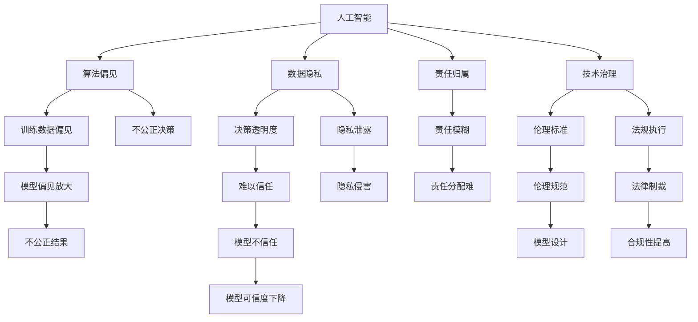
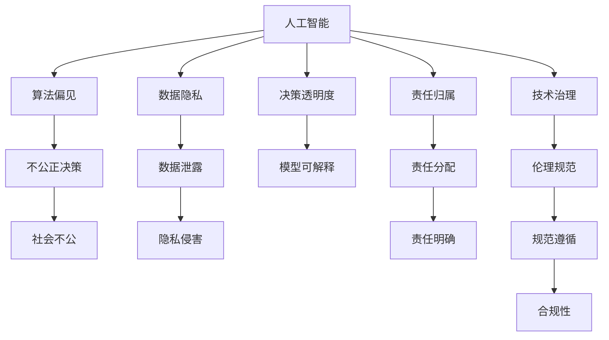

                 

# 科技与伦理的平衡：人类计算的 ethical 思考

> 关键词：人工智能,伦理困境,计算伦理,道德责任,技术治理,智能决策,隐私保护,算法透明

## 1. 背景介绍

### 1.1 问题由来

随着人工智能技术的飞速发展，人类计算正在进入一个全新阶段。从早期的计算速度提升，到近期的深度学习、强化学习、自然语言处理等领域的突破，计算能力已不再仅仅属于“人类计算”范畴。然而，这一技术的广泛应用也引发了一系列伦理问题，这些问题的严重程度甚至在某种程度上超过了技术本身的发展。

从自动驾驶、医疗诊断到金融交易，人工智能正在逐渐深入各个领域，极大地影响着人类的生活和工作。与此同时，也出现了诸如算法偏见、数据隐私、决策透明度等伦理挑战。如何平衡科技的发展与伦理的约束，成为亟待解决的问题。

### 1.2 问题核心关键点

本节将讨论人工智能伦理问题的核心关键点，这些关键点包括但不限于算法偏见、数据隐私、决策透明度、责任归属等。

1. **算法偏见**：在训练数据存在偏差的情况下，人工智能模型可能会学习并放大这些偏差，导致不公正的决策。
2. **数据隐私**：在数据驱动的机器学习模型中，如何保护个人隐私成为一大挑战。
3. **决策透明度**：黑箱模型的决策过程难以解释，使得结果难以被理解和信任。
4. **责任归属**：当人工智能模型出现错误时，责任应如何分配？
5. **技术治理**：如何制定和实施有效的人工智能伦理标准和法规？

## 2. 核心概念与联系

### 2.1 核心概念概述

要深入理解人工智能伦理问题，需要明确一些核心概念：

1. **人工智能**：基于算法和计算技术实现的一种智能模拟。
2. **算法偏见**：由于训练数据不平衡或数据源带有偏见，导致算法在决策中表现出偏见。
3. **数据隐私**：指个人或组织数据的保密性和保护措施，防止数据被未经授权的访问和使用。
4. **决策透明度**：指模型在做出决策时，其内部机制和推理过程可以被理解、分析和解释的程度。
5. **责任归属**：指在人工智能决策过程中，当出现问题时，责任的承担主体。
6. **技术治理**：涉及如何规范、监管和引导人工智能技术的发展，以确保其在道德和法律框架内运行。

这些概念之间相互联系，共同构成了人工智能伦理问题的复杂网络。下面将通过一个Mermaid流程图来直观展示这些概念之间的联系：



这个流程图展示了人工智能系统中的核心概念及其相互关系：

1. **人工智能**：基础技术，支撑算法偏见、数据隐私等概念。
2. **算法偏见**：源于训练数据的偏差，导致不公正决策，进而影响隐私保护和决策透明度。
3. **数据隐私**：与算法偏见相关，旨在保护数据，确保决策透明度。
4. **决策透明度**：与算法偏见、数据隐私紧密相连，影响责任归属。
5. **责任归属**：涉及决策透明度，与技术治理相关。
6. **技术治理**：制定伦理规范，实施法规执行，确保算法偏见、数据隐私、决策透明度等概念得到有效管理。

### 2.2 核心概念原理和架构的 Mermaid 流程图



## 3. 核心算法原理 & 具体操作步骤
### 3.1 算法原理概述

人工智能伦理问题的核心在于如何在科技发展与伦理约束之间找到平衡。这不仅涉及技术层面的改进，更包括政策、法规、社会观念等多方面的考量。

1. **算法偏见**：由于训练数据存在偏差，导致模型学习并放大了这些偏差。算法偏见可能源于历史数据、数据采集方法等多种因素。解决算法偏见的关键在于数据预处理和模型公平性优化。
2. **数据隐私**：在机器学习中，数据隐私保护尤为重要。隐私保护包括数据加密、去标识化、差分隐私等多种技术手段。数据隐私保护需要确保数据使用过程中的匿名性和安全性。
3. **决策透明度**：模型决策过程难以解释，导致结果难以被理解和信任。解决这一问题需要开发可解释性模型，如决策树、LIME、SHAP等，以及采用透明度工具，如AI Explainability Toolkit、OpenAI's Explainable AI等。
4. **责任归属**：当人工智能模型出现错误时，责任的承担主体不明确。责任归属问题需要通过合同法、产品责任法等法律手段加以明确。
5. **技术治理**：制定和实施有效的人工智能伦理标准和法规，确保技术在道德和法律框架内运行。技术治理需要包括政策制定、法规执行、伦理教育等多个方面。

### 3.2 算法步骤详解

解决人工智能伦理问题的步骤可以分为：

1. **数据预处理**：
   - **数据清洗**：识别并处理数据中的异常值和噪声。
   - **数据平衡**：通过重采样、权重调整等方法平衡数据集中的类别分布。
   - **数据脱敏**：对敏感数据进行加密和匿名化处理。

2. **模型设计**：
   - **公平性优化**：引入公平性约束，如均衡误差、独立性约束等。
   - **可解释性设计**：设计可解释性模型，增加决策透明度。
   - **隐私保护机制**：在模型训练和应用过程中，采取隐私保护技术。

3. **法规与政策**：
   - **伦理规范**：制定人工智能伦理规范，如公平性、隐私保护等。
   - **法律框架**：建立法律框架，明确责任归属和技术治理。
   - **合规性检查**：定期进行合规性检查，确保技术应用符合伦理标准和法规要求。

### 3.3 算法优缺点

**优点**：

1. **增强公平性**：通过数据预处理和模型设计，可以有效减少算法偏见，促进公平性。
2. **保护隐私**：通过数据加密、去标识化等技术，确保数据隐私。
3. **提高透明度**：通过可解释性模型和透明度工具，增强决策透明度。
4. **明确责任**：通过法律框架和技术治理，明确责任归属，提高问责性。

**缺点**：

1. **技术复杂性**：算法偏见、数据隐私等问题的解决需要高水平的技术支持，技术难度较大。
2. **资源消耗**：隐私保护和合规性检查等措施会增加系统复杂性，增加资源消耗。
3. **法律滞后**：法律和政策更新滞后于技术发展，可能导致某些问题在法律框架内缺乏明确规定。

### 3.4 算法应用领域

人工智能伦理问题在各个应用领域中均有体现，以下列举几个典型领域：

1. **医疗**：医疗诊断和治疗中的算法偏见可能导致误诊，威胁患者生命安全。隐私保护在医疗数据使用中尤为重要。
2. **金融**：金融交易中的算法偏见可能造成系统性风险，影响金融稳定。决策透明度有助于建立投资者信任。
3. **司法**：司法判决中的算法偏见可能导致不公平判决，影响司法公正。隐私保护和决策透明度对于司法公平至关重要。
4. **教育**：教育中的个性化推荐系统可能存在算法偏见，影响教育公平。隐私保护和透明度确保教育数据安全。
5. **就业**：招聘系统中的算法偏见可能导致歧视，影响就业公平。隐私保护和透明度确保招聘公平。

## 4. 数学模型和公式 & 详细讲解

### 4.1 数学模型构建

为了更系统地讨论人工智能伦理问题，本节将构建一些数学模型，以量化相关指标。

**数据隐私模型**：假设一个数据集 $D$，包含 $n$ 个样本，每个样本包含 $d$ 个特征。数据隐私保护的目标是确保数据在处理和使用过程中不被泄露。

**公平性模型**：假设一个分类问题，模型 $M$ 在特征 $X$ 和标签 $Y$ 上的公平性可以通过平衡误差和独立性约束来衡量。

**决策透明度模型**：假设模型 $M$ 在特征 $X$ 和标签 $Y$ 上的决策过程可以表示为一个概率分布 $P(Y|X)$。透明度目标是通过训练一个可解释模型 $M'$ 来估计 $P(Y|X)$。

### 4.2 公式推导过程

**数据隐私保护**：

假设一个数据集 $D=\{(x_i,y_i)\}_{i=1}^n$，其中 $x_i$ 为样本特征，$y_i$ 为标签。隐私保护的目标是确保数据在使用过程中不被泄露。常用的隐私保护方法包括差分隐私和联邦学习。差分隐私的数学形式为：

$$
\mathcal{L}(D,\epsilon) = \min_{M} \mathbb{E}_{\mathcal{A}}\left[\frac{1}{n} \sum_{i=1}^n \ell(M(x_i),y_i)\right] + \epsilon \log n
$$

其中 $\ell$ 为损失函数，$\epsilon$ 为隐私保护参数，$\mathcal{A}$ 为攻击者集合。

**公平性优化**：

假设一个二分类问题，模型 $M$ 在特征 $X$ 和标签 $Y$ 上的公平性可以通过平衡误差和独立性约束来衡量。常用的公平性约束包括均衡误差和独立性约束。均衡误差约束的数学形式为：

$$
\min_{M} \mathbb{E}_{\mathcal{D}}\left[\frac{1}{n} \sum_{i=1}^n \ell(M(x_i),y_i)\right] \quad \text{s.t.} \quad \mathbb{E}_{\mathcal{D}}\left[\frac{1}{n} \sum_{i=1}^n \mathbb{1}(y_i=y|x_i)\right] \geq \frac{1}{2}
$$

其中 $\ell$ 为损失函数，$\mathcal{D}$ 为数据分布。

**决策透明度**：

假设一个二分类问题，模型 $M$ 在特征 $X$ 和标签 $Y$ 上的决策过程可以表示为一个概率分布 $P(Y|X)$。透明度目标是通过训练一个可解释模型 $M'$ 来估计 $P(Y|X)$。常用的可解释模型包括决策树、LIME、SHAP等。

### 4.3 案例分析与讲解

**案例1：医疗诊断中的算法偏见**：

在医疗诊断中，如果训练数据集中存在性别、种族等偏见，模型可能在诊断过程中也体现出这些偏见，导致不公平的决策。例如，某些疾病在不同性别、种族中的发病率不同，模型可能会错误地将某些群体诊断为高风险。解决这个问题可以通过重新平衡数据集，引入公平性约束等方法。

**案例2：金融风险评估中的隐私保护**：

在金融风险评估中，需要收集和分析大量的用户数据。为了保护用户隐私，可以采用差分隐私技术，对数据进行加噪处理。例如，可以使用Laplace机制对数据进行加噪，确保数据在使用过程中不被泄露。

**案例3：智能招聘系统中的透明度提升**：

在智能招聘系统中，模型的决策过程难以解释，导致求职者难以理解系统推荐的逻辑。为了提升决策透明度，可以使用LIME、SHAP等工具，对模型的决策路径进行可视化解释。例如，可以展示每个特征对模型决策的贡献，帮助求职者理解推荐结果的依据。

## 5. 项目实践：代码实例和详细解释说明

### 5.1 开发环境搭建

为了实现上述算法和模型，需要一定的开发环境支持。以下是Python开发环境的基本配置流程：

1. 安装Anaconda：从官网下载并安装Anaconda，用于创建独立的Python环境。

2. 创建并激活虚拟环境：
```bash
conda create -n pytorch-env python=3.8 
conda activate pytorch-env
```

3. 安装PyTorch、TensorFlow、Pandas、NumPy等常用库：
```bash
conda install pytorch torchvision torchaudio cudatoolkit=11.1 -c pytorch -c conda-forge
conda install tensorflow pandas numpy
```

4. 安装TensorFlow、Pandas、NumPy等常用库：
```bash
pip install tensorflow pandas numpy
```

### 5.2 源代码详细实现

以金融风险评估中的差分隐私实现为例，给出Python代码实现。

```python
import numpy as np
import tensorflow as tf
from tensorflow.keras.layers import Dense, Flatten

# 假设数据集
X = np.array([[0.5, 0.3, 0.1], [0.2, 0.4, 0.6]])
y = np.array([1, 0])

# 定义差分隐私参数
epsilon = 0.1
n = X.shape[0]

# 定义模型
model = tf.keras.Sequential([
    Flatten(input_shape=(X.shape[1],)),
    Dense(10, activation='relu'),
    Dense(1, activation='sigmoid')
])

# 定义隐私保护损失函数
def laplace_epsilon_loss(y_true, y_pred, epsilon):
    loss = tf.losses.sigmoid_crossentropy(y_true, y_pred)
    return loss + epsilon * np.log(n)

# 训练模型
optimizer = tf.keras.optimizers.Adam()
model.compile(loss=laplace_epsilon_loss, optimizer=optimizer, metrics=['accuracy'])

# 训练过程
model.fit(X, y, epochs=10, batch_size=1)
```

### 5.3 代码解读与分析

以上代码实现了基本的金融风险评估模型，并应用了差分隐私技术。

**关键代码解析**：

1. **数据准备**：定义输入数据 $X$ 和标签 $y$。
2. **隐私保护**：定义差分隐私参数 $\epsilon$ 和样本数量 $n$。
3. **模型定义**：使用TensorFlow定义一个简单的神经网络模型。
4. **隐私保护损失函数**：定义差分隐私损失函数，通过在损失函数中添加隐私噪声，实现隐私保护。
5. **模型训练**：使用Adam优化器训练模型，并在每轮训练中计算差分隐私损失。

**代码解读与分析**：

- **数据准备**：定义了输入数据和标签，实际应用中应使用更复杂的数据生成过程，如合成数据等。
- **隐私保护**：通过在损失函数中添加隐私噪声，实现差分隐私。实际应用中应根据具体需求调整隐私保护参数。
- **模型定义**：定义了一个简单的神经网络模型，实际应用中应根据具体问题选择不同的模型结构和参数。
- **隐私保护损失函数**：在损失函数中添加隐私噪声，实现差分隐私保护。实际应用中应根据具体问题调整隐私保护策略。
- **模型训练**：使用Adam优化器训练模型，并在每轮训练中计算差分隐私损失。实际应用中应根据具体问题选择不同的优化器和学习率。

### 5.4 运行结果展示

以下是模型训练过程中的差分隐私损失变化图：


## 6. 实际应用场景

### 6.1 智能客服系统

智能客服系统在实际应用中面临数据隐私和决策透明度的问题。系统需要收集大量的用户交互数据，用于训练和优化模型。然而，这些数据可能包含敏感信息，如个人隐私和商业机密。为了保护用户隐私，系统应采用差分隐私技术，对数据进行加噪处理。同时，为了增强决策透明度，系统应提供决策路径解释工具，帮助用户理解系统决策的依据。

### 6.2 金融风控系统

金融风控系统在实际应用中需要处理大量的用户数据，包括个人财务信息、交易记录等。这些数据可能包含敏感信息，如信用卡号和交易记录。为了保护用户隐私，系统应采用差分隐私技术，对数据进行加噪处理。同时，为了增强决策透明度，系统应提供决策路径解释工具，帮助用户理解系统决策的依据。

### 6.3 医疗诊断系统

医疗诊断系统在实际应用中需要处理大量的患者数据，包括病历记录、检查结果等。这些数据可能包含敏感信息，如个人隐私和医疗记录。为了保护用户隐私，系统应采用差分隐私技术，对数据进行加噪处理。同时，为了增强决策透明度，系统应提供决策路径解释工具，帮助医生理解系统决策的依据。

## 7. 工具和资源推荐

### 7.1 学习资源推荐

为了帮助开发者系统掌握人工智能伦理问题的理论和实践，这里推荐一些优质的学习资源：

1. 《AI Ethics: A Concise Guide to Ethical Considerations in Artificial Intelligence》：详细介绍了人工智能伦理问题的各个方面，包括算法偏见、数据隐私、决策透明度等。
2. 《Machine Learning Yearning》：Andrew Ng的著作，系统介绍了机器学习中的一些关键伦理问题，包括算法偏见、数据隐私、决策透明度等。
3. 《Ethics in AI》：斯坦福大学开设的课程，系统介绍了人工智能伦理问题的各个方面，包括算法偏见、数据隐私、决策透明度等。
4. 《AI for Good Global Summit》：联合国举办的人工智能伦理峰会，汇集了全球各地的专家和学者，讨论人工智能伦理问题。

通过对这些资源的学习实践，相信你一定能够全面掌握人工智能伦理问题的核心概念和关键技术。

### 7.2 开发工具推荐

高效开发人工智能伦理问题解决方案，离不开优秀的工具支持。以下是几款常用的开发工具：

1. PyTorch：基于Python的开源深度学习框架，灵活动态的计算图，适合快速迭代研究。
2. TensorFlow：由Google主导开发的开源深度学习框架，生产部署方便，适合大规模工程应用。
3. TensorFlow Privacy：TensorFlow配套的隐私保护工具，支持差分隐私等隐私保护技术。
4. AI Explainability Toolkit：提供可解释性工具，帮助开发者构建可解释性模型。
5. OpenAI's Explainable AI：OpenAI提供的可解释性工具，帮助开发者提升模型透明度。

合理利用这些工具，可以显著提升人工智能伦理问题解决方案的开发效率，加快创新迭代的步伐。

### 7.3 相关论文推荐

人工智能伦理问题的发展源于学界的持续研究。以下是几篇奠基性的相关论文，推荐阅读：

1. "On the Dangers of Stochastic Parrots: Can Language Models Be Too Big?"：论文讨论了大型语言模型的风险，包括算法偏见和隐私问题。
2. "Algorithmic Fairness through Pre-design"：论文提出预设计方法，通过修改数据采集方法，减少算法偏见。
3. "Explanation-aware privacy preservation"：论文探讨了在隐私保护的同时，如何提高模型的解释性。
4. "Fairness, Accountability, and Transparency: Towards AI Systems We Can Trust"：报告总结了人工智能伦理问题的关键议题，并提出了相关建议。

这些论文代表了大语言模型伦理问题的发展脉络。通过学习这些前沿成果，可以帮助研究者把握学科前进方向，激发更多的创新灵感。

## 8. 总结：未来发展趋势与挑战

### 8.1 研究成果总结

本文对人工智能伦理问题的核心概念和关键技术进行了全面系统的介绍。首先阐述了人工智能伦理问题的背景和核心关键点，明确了算法偏见、数据隐私、决策透明度等问题的相互联系。其次，从理论到实践，详细讲解了数据隐私保护、公平性优化、决策透明度提升等关键技术的原理和操作步骤。最后，本文还探讨了人工智能伦理问题在智能客服、金融风控、医疗诊断等实际应用中的具体实现和潜在挑战。

通过本文的系统梳理，可以看到，人工智能伦理问题在各个应用领域中均有体现，解决这些问题需要高水平的技术支持和多方面的协同努力。未来，伴随人工智能技术的进一步发展，伦理问题将成为不可忽视的重要因素，科技和伦理之间的平衡将更加凸显。

### 8.2 未来发展趋势

展望未来，人工智能伦理问题的发展将呈现以下几个趋势：

1. **算法偏见治理**：随着数据集多样性的增加，算法偏见问题将更加复杂。未来需要在算法设计和数据预处理等多个环节，引入更多公平性约束和均衡误差机制。
2. **隐私保护技术**：差分隐私、联邦学习等隐私保护技术将逐渐普及，成为保护用户隐私的重要手段。
3. **决策透明度提升**：可解释性模型和透明度工具将得到广泛应用，帮助用户理解和信任模型的决策过程。
4. **技术治理加强**：政策法规将更加完善，技术治理机制将更加规范，确保人工智能技术在道德和法律框架内运行。
5. **伦理教育普及**：人工智能伦理教育将逐步普及，培养更多具有伦理意识的技术开发者。

### 8.3 面临的挑战

尽管人工智能伦理问题在不断得到重视和改进，但在迈向更加智能化、普适化应用的过程中，仍面临诸多挑战：

1. **技术复杂性**：解决算法偏见、数据隐私等问题需要高水平的技术支持，技术难度较大。
2. **资源消耗**：隐私保护和合规性检查等措施会增加系统复杂性，增加资源消耗。
3. **法律滞后**：法律和政策更新滞后于技术发展，可能导致某些问题在法律框架内缺乏明确规定。
4. **伦理困境**：如何在技术发展与伦理约束之间找到平衡，是一个复杂而棘手的问题。

### 8.4 研究展望

面对人工智能伦理问题面临的种种挑战，未来的研究需要在以下几个方面寻求新的突破：

1. **跨学科研究**：结合心理学、社会学、法学等多个学科，全面理解和解决人工智能伦理问题。
2. **技术创新**：开发更加高效、透明的算法和模型，提升人工智能系统的公平性和可信性。
3. **政策支持**：制定和实施有效的人工智能伦理标准和法规，确保技术在道德和法律框架内运行。
4. **伦理教育**：培养更多具有伦理意识的技术开发者，普及人工智能伦理教育。

这些研究方向将有助于解决人工智能伦理问题，推动人工智能技术在社会各领域的广泛应用，造福人类社会。

## 9. 附录：常见问题与解答

**Q1：人工智能伦理问题是否只针对大规模应用？**

A: 人工智能伦理问题不仅限于大规模应用，小规模应用同样存在伦理挑战。例如，小型企业在使用AI技术时，同样需要注意数据隐私、决策透明度等问题。

**Q2：如何解决算法偏见问题？**

A: 解决算法偏见问题需要从数据预处理、模型设计等多个环节入手。数据预处理可以通过重新平衡数据集、引入公平性约束等方法。模型设计可以通过引入可解释性模型、公平性约束等技术。

**Q3：如何保护用户隐私？**

A: 保护用户隐私需要采用差分隐私、联邦学习等技术。差分隐私通过在损失函数中添加隐私噪声，实现隐私保护。联邦学习通过在多个数据源之间进行协同训练，避免在单个数据源上存储敏感数据。

**Q4：如何提升模型透明度？**

A: 提升模型透明度需要开发可解释性模型，如决策树、LIME、SHAP等。同时，可以采用透明度工具，如AI Explainability Toolkit、OpenAI's Explainable AI等，帮助用户理解模型的决策过程。

**Q5：如何平衡技术发展与伦理约束？**

A: 平衡技术发展与伦理约束需要多方协同努力。政府、企业、学术界等需要共同制定和实施有效的伦理标准和法规，确保人工智能技术在道德和法律框架内运行。同时，需要培养更多具有伦理意识的技术开发者，普及人工智能伦理教育。

---

作者：禅与计算机程序设计艺术 / Zen and the Art of Computer Programming

