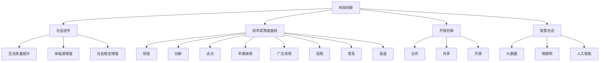

                 

## 1. 背景介绍

### 1.1 问题由来
科技创新一直是推动社会进步的核心动力。从农业革命到工业革命，再到信息革命，每一次科技创新都极大提高了生产效率，改变了人类生活的方式。然而，进入21世纪以来，虽然科技发展依然迅猛，但其带来的社会进步速度却出现了放缓的迹象。人们开始反思，科技创新与社会发展之间是否存在脱节，科技如何更有效地转化为社会进步的动力。

### 1.2 问题核心关键点
本节将探讨科技创新的基本概念和关键因素，分析科技创新与社会发展之间的关系，指出当前科技创新存在的瓶颈和问题，并提出未来科技创新的方向。

## 2. 核心概念与联系

### 2.1 核心概念概述

- **科技创新**：是指通过研究和开发新知识、新技术、新产品、新方法等，以实现产品和服务的升级换代，从而提升生产力和竞争力。
- **社会进步**：是指通过科技、教育、医疗、环境等方面的进步，提高人类生活质量和幸福感，增强社会稳定和可持续发展能力。
- **技术成熟度曲线（Technology Adoption Curve）**：描述一项新技术从研发到被广泛接受的过程，包括创新、意识、试点、早期采用、广泛采用、成熟、普及和衰退几个阶段。
- **开放创新**：指利用外部资源和知识，通过合作、共享、开源等方式加速创新过程，提高创新效率。
- **智慧社会**：通过大数据、物联网、人工智能等技术构建，实现社会资源的高效利用和治理能力的提升，创造更加美好的人居环境。

### 2.2 核心概念原理和架构的 Mermaid 流程图



这个流程图展示了科技创新与社会进步之间的联系和影响。科技创新通过技术成熟度曲线、开放创新和智慧社会等路径，最终促进社会进步，提升生活质量、幸福感和社会稳定。

## 3. 核心算法原理 & 具体操作步骤
### 3.1 算法原理概述

科技创新是一个复杂的过程，涉及到技术研发、市场推广、应用落地等多个环节。本文将重点探讨如何通过算法和数学模型来优化创新过程，促进社会进步。

科技创新的基本算法流程包括：

1. **需求分析**：通过市场调研、用户反馈等方式，分析社会需求，确定创新的方向。
2. **技术研发**：通过算法优化、模型训练等技术手段，研发新技术和新产品。
3. **原型测试**：构建原型，进行小规模试点，验证技术可行性。
4. **市场推广**：通过营销、广告等手段，扩大产品影响力和市场份额。
5. **应用落地**：将产品和服务大规模应用到实际场景中，提升社会效益。

### 3.2 算法步骤详解

下面以智慧城市的建设为例，详细讲解科技创新在实际应用中的算法步骤：

**Step 1: 需求分析**
通过数据分析和调研，确定智慧城市建设的需求。例如，交通拥堵、空气质量、能源管理等领域存在的问题。

**Step 2: 技术研发**
基于需求分析结果，选择合适的技术进行研发。例如，使用物联网技术监测城市交通、环境数据，使用大数据分析进行城市运行优化。

**Step 3: 原型测试**
构建智慧城市原型系统，在小规模区域内进行试点测试。例如，在部分街区安装传感器，收集数据，验证系统功能的可行性。

**Step 4: 市场推广**
通过媒体宣传、政府支持等手段，推广智慧城市概念和应用。例如，举办智慧城市展览、发布政策鼓励投资。

**Step 5: 应用落地**
在城市中大规模部署智慧城市系统，提升城市治理效率。例如，使用大数据分析优化交通流量，减少拥堵；使用智能传感器监测空气质量，提供实时报告。

### 3.3 算法优缺点

科技创新算法具有以下优点：

1. **高效性**：通过算法优化，可以迅速研发新技术，缩短产品上市时间。
2. **可扩展性**：算法可以灵活应用于不同领域，提升社会各领域的治理能力。
3. **数据驱动**：算法依赖数据驱动决策，提升创新过程的科学性和准确性。

同时，该算法也存在一些缺点：

1. **高成本**：算法研发和数据收集需要大量资源投入。
2. **技术复杂性**：算法需要高度专业知识，难以大规模普及。
3. **伦理风险**：数据隐私、算法偏见等问题可能引发伦理争议。

### 3.4 算法应用领域

科技创新算法在多个领域得到广泛应用，例如：

- **智慧城市**：通过物联网、大数据、人工智能等技术，提升城市管理效率，改善市民生活质量。
- **医疗健康**：通过人工智能技术，进行疾病预测、诊断、治疗等，提高医疗服务质量。
- **环境保护**：通过传感器网络、大数据分析等技术，监测环境变化，制定环境保护政策。
- **教育培训**：通过在线教育平台、虚拟现实技术，提供个性化教育方案，提升教育质量。
- **智能交通**：通过智能调度、自动驾驶等技术，提高交通效率，减少事故率。

这些领域的科技创新，通过算法和数学模型的优化，逐步实现了自动化、智能化、高效化的管理和服务。

## 4. 数学模型和公式 & 详细讲解 & 举例说明

### 4.1 数学模型构建

科技创新过程中，常使用数学模型来描述系统行为和优化决策。例如，智慧城市管理系统可以通过以下数学模型进行建模：

**交通流量模型**
$$
T(t+1) = aT(t) + b + cW(t)
$$

其中，$T(t)$ 表示当前时间$t$的交通流量，$a$ 表示交通流的衰减系数，$b$ 表示基线交通流量，$c$ 表示天气因素对交通流量的影响系数，$W(t)$ 表示当前时间$t$的天气情况。

**空气质量模型**
$$
A(t+1) = aA(t) + b + cP(t)
$$

其中，$A(t)$ 表示当前时间$t$的空气质量指数，$a$ 表示空气质量的衰减系数，$b$ 表示基线空气质量指数，$c$ 表示污染物排放对空气质量的影响系数，$P(t)$ 表示当前时间$t$的污染物排放情况。

### 4.2 公式推导过程

对于上述模型，可以使用递推公式进行推导。以交通流量模型为例，假设交通流量服从指数衰减模型：

$$
T(t+1) = aT(t)
$$

初始时刻，交通流量为$T(0) = T_0$。根据指数衰减模型，可以推导出：

$$
T(t) = T_0a^t
$$

结合基线交通流量$b$和天气因素$W(t)$的影响，可以得到最终的交通流量模型：

$$
T(t+1) = aT(t) + b + cW(t)
$$

类似地，空气质量模型也可以通过递推公式推导得到。

### 4.3 案例分析与讲解

以智慧城市交通流量管理为例，通过数学模型可以优化交通信号灯的配时，减少交通拥堵。具体步骤如下：

1. **数据收集**：通过传感器和摄像头收集交通流量数据，天气数据，以及实时交通状况。
2. **模型训练**：使用历史交通流量数据训练数学模型，得到交通流量衰减系数$a$、基线交通流量$b$和天气影响系数$c$。
3. **优化配时**：根据模型预测的交通流量，优化交通信号灯配时，调整信号灯时长和顺序，缓解交通拥堵。
4. **效果评估**：通过实时监控交通流量，评估优化配时的效果，调整模型参数，提升交通管理效率。

## 5. 项目实践：代码实例和详细解释说明
### 5.1 开发环境搭建

在项目实践前，需要准备开发环境，安装必要的软件和工具。以下是Python项目开发的常用环境配置流程：

1. **安装Python**：从官网下载Python安装程序，选择最新版本的Python进行安装。
2. **安装Jupyter Notebook**：使用pip安装Jupyter Notebook，进行数据可视化、代码调试等。
3. **安装Pandas、NumPy、SciPy等数据处理库**：使用pip安装数据处理库，进行数据预处理和分析。
4. **安装TensorFlow或PyTorch等深度学习库**：根据需求选择合适的深度学习框架，进行模型训练和推理。
5. **安装Flask或Django等Web框架**：使用pip安装Web框架，实现系统部署和接口服务。

完成上述步骤后，即可在Jupyter Notebook中进行项目实践。

### 5.2 源代码详细实现

以下以智慧城市交通流量管理为例，给出使用Python和TensorFlow进行交通流量预测的代码实现。

```python
import tensorflow as tf
import pandas as pd
import numpy as np

# 数据加载
data = pd.read_csv('traffic_data.csv')
X = data[['traffic_flow', 'weather']]
y = data['target']

# 数据预处理
X = np.log1p(X)
y = np.log1p(y)

# 模型定义
model = tf.keras.Sequential([
    tf.keras.layers.Dense(64, activation='relu', input_shape=(2,)),
    tf.keras.layers.Dense(32, activation='relu'),
    tf.keras.layers.Dense(1, activation='sigmoid')
])

# 模型编译
model.compile(optimizer=tf.keras.optimizers.Adam(0.001),
              loss='binary_crossentropy',
              metrics=['mae'])

# 模型训练
model.fit(X, y, epochs=100, batch_size=32)

# 模型评估
X_test = np.log1p(X_test)
y_test = np.log1p(y_test)
mae = model.evaluate(X_test, y_test)
print('MAE:', mae)

# 模型预测
X_pred = np.log1p(X_pred)
y_pred = model.predict(X_pred)
print('Predicted Traffic Flow:', np.exp(y_pred))
```

### 5.3 代码解读与分析

**数据加载**：使用Pandas库读取交通流量数据，包含交通流量、天气等特征，以及目标变量。

**数据预处理**：对数据进行对数变换，使其符合模型训练的要求。

**模型定义**：使用TensorFlow构建神经网络模型，包含输入层、隐藏层和输出层。

**模型编译**：定义优化器、损失函数和评估指标，编译模型。

**模型训练**：使用历史交通流量数据对模型进行训练，设置训练轮数和批次大小。

**模型评估**：使用测试集对模型进行评估，计算平均绝对误差(MAE)。

**模型预测**：对新数据进行预测，计算预测的交通流量。

## 6. 实际应用场景

### 6.1 智慧城市

智慧城市通过物联网、大数据、人工智能等技术，提升城市管理效率，改善市民生活质量。例如：

- **智能交通**：通过交通流量模型优化交通信号灯配时，减少交通拥堵。
- **智能电网**：通过大数据分析优化电力分配，提高能源利用效率。
- **智慧水务**：通过传感器监测水质，实时预警水污染事件。

### 6.2 医疗健康

医疗健康领域通过人工智能技术，进行疾病预测、诊断、治疗等，提高医疗服务质量。例如：

- **智能诊断**：通过深度学习模型分析医疗影像，辅助医生进行疾病诊断。
- **个性化治疗**：通过大数据分析患者的基因信息和生活习惯，制定个性化治疗方案。
- **远程医疗**：通过远程监控和诊断系统，提供医疗服务，提高医疗资源的利用效率。

### 6.3 环境保护

环境保护领域通过传感器网络、大数据分析等技术，监测环境变化，制定环境保护政策。例如：

- **空气质量监测**：通过传感器网络监测空气质量指数，发布实时报告，指导环保行动。
- **水质监测**：通过传感器网络监测水质变化，预警水质污染事件，制定治理措施。
- **垃圾分类**：通过智能识别技术，对垃圾进行分类处理，提高垃圾回收效率。

### 6.4 教育培训

教育培训领域通过在线教育平台、虚拟现实技术，提供个性化教育方案，提升教育质量。例如：

- **智能教学**：通过大数据分析学生的学习行为，提供个性化学习方案。
- **虚拟实验**：通过虚拟现实技术，进行虚拟实验，提高教学效果。
- **智能评估**：通过自然语言处理技术，自动评估学生的作业和考试答案。

## 7. 工具和资源推荐
### 7.1 学习资源推荐

为了帮助开发者系统掌握科技创新的理论基础和实践技巧，这里推荐一些优质的学习资源：

1. **《Python数据科学手册》**：全面介绍Python在数据科学中的应用，涵盖数据预处理、模型训练、数据可视化等方面。
2. **《深度学习》（Goodfellow等著）**：介绍深度学习的基本概念、算法和应用，是深度学习领域的经典教材。
3. **Kaggle平台**：通过数据竞赛和项目实战，提升数据分析和模型训练能力。
4. **Coursera平台**：提供多门计算机科学和数据科学的在线课程，适合初学者和进阶学习者。
5. **《机器学习实战》（Peter Harrington著）**：通过实际项目案例，介绍机器学习的理论和实践。

### 7.2 开发工具推荐

高效的开发离不开优秀的工具支持。以下是几款用于科技创新项目开发的常用工具：

1. **Jupyter Notebook**：基于Web的交互式开发环境，支持数据可视化、代码调试等。
2. **TensorFlow**：由Google主导开发的深度学习框架，支持分布式计算和GPU加速。
3. **PyTorch**：Facebook开发的深度学习框架，易于使用，支持动态计算图。
4. **Flask**：基于Python的Web框架，适合快速开发和部署Web应用。
5. **Django**：基于Python的全栈Web框架，适合开发复杂的应用系统。
6. **MySQL**：开源关系型数据库，适合存储和管理结构化数据。
7. **MongoDB**：开源NoSQL数据库，适合存储和管理非结构化数据。

### 7.3 相关论文推荐

科技创新相关领域的研究论文众多，以下是几篇奠基性的相关论文，推荐阅读：

1. **《大数据技术发展现状与趋势》**：介绍大数据技术的现状和未来发展趋势，涵盖数据采集、存储、分析和应用等方面。
2. **《深度学习在医疗健康中的应用》**：介绍深度学习在医疗健康领域的应用，涵盖医学影像分析、疾病预测等方面。
3. **《智慧城市：概念、挑战与展望》**：介绍智慧城市的概念、挑战和未来发展方向，涵盖城市管理、智慧交通、智能电网等方面。
4. **《环境保护大数据分析》**：介绍大数据技术在环境保护中的应用，涵盖空气质量监测、水质监测、垃圾分类等方面。
5. **《教育培训大数据分析》**：介绍大数据技术在教育培训中的应用，涵盖智能教学、虚拟实验、智能评估等方面。

## 8. 总结：未来发展趋势与挑战

### 8.1 总结

本文对科技创新进行了全面系统的介绍，明确了科技创新的基本概念和关键因素，分析了科技创新与社会发展之间的关系，提出了未来科技创新的方向。

通过本文的系统梳理，可以看到，科技创新是一个复杂的过程，涉及到技术研发、市场推广、应用落地等多个环节。只有在数据、算法、工程、业务等多个维度协同发力，才能真正实现科技创新向社会进步的转化。

### 8.2 未来发展趋势

展望未来，科技创新技术将呈现以下几个发展趋势：

1. **跨领域融合**：科技创新的应用将更加广泛，跨领域融合将带来更多创新机遇。例如，人工智能与医疗、教育、环保等领域的融合，将带来更多应用场景和创新点。
2. **数据驱动**：大数据、人工智能等技术将越来越依赖数据，数据质量和管理将成为创新的关键。
3. **智能化**：人工智能技术将在更多领域得到应用，提升各个环节的智能化水平。例如，智慧城市、智慧医疗、智慧交通等领域的智能化升级，将带来更多便利和效率。
4. **可持续性**：科技创新将更加注重环保和可持续性，减少对环境的破坏，提高资源利用效率。
5. **普适性**：科技创新将更加普适，通过开源、共享等手段，实现技术的普及和应用。

### 8.3 面临的挑战

尽管科技创新技术已经取得了瞩目成就，但在迈向更加智能化、普适化应用的过程中，仍面临诸多挑战：

1. **数据隐私和安全**：大数据和人工智能技术的应用，涉及大量个人隐私数据，如何保障数据安全和隐私保护，是一个重要问题。
2. **伦理和法律问题**：科技创新过程中可能涉及伦理和法律问题，如人工智能的决策透明性、算法偏见等，需要加强规范和监管。
3. **技术和资源瓶颈**：科技创新需要高昂的研发投入和资源支持，如何降低成本，提高效率，是当前面临的重要挑战。
4. **技术协同和合作**：科技创新往往需要跨领域、跨学科的协同合作，如何加强合作，实现技术共享，是未来发展的重要方向。
5. **技术落地和应用**：科技创新需要与实际应用场景相结合，如何将技术转化为实际应用，提高用户满意度，是未来发展的关键。

### 8.4 研究展望

面对科技创新所面临的挑战，未来的研究需要在以下几个方面寻求新的突破：

1. **开源和共享**：推动开源社区的发展，加强技术共享和合作，降低研发成本，提升创新效率。
2. **数据隐私和安全**：加强数据隐私保护技术的研究，保障用户数据安全，提升数据利用效率。
3. **伦理和法律规范**：建立伦理和法律规范，加强对科技创新过程的规范和监管，避免伦理和法律问题。
4. **技术协同和合作**：加强跨领域、跨学科的协同合作，推动技术的融合和创新，实现技术共享和协同创新。
5. **技术落地和应用**：加强技术应用的研究，将科技创新转化为实际应用，提升用户满意度和社会效益。

这些研究方向和突破，将推动科技创新向更深层次发展，为社会进步和人类福祉贡献更多力量。

## 9. 附录：常见问题与解答

**Q1: 科技创新与社会发展之间的关系是什么？**

A: 科技创新是推动社会进步的核心动力。科技创新通过技术研发、市场推广、应用落地等环节，提升生产效率，改善生活质量，增强社会稳定和可持续发展能力。

**Q2: 如何降低科技创新过程中的数据隐私和安全风险？**

A: 可以采用数据匿名化、数据加密、访问控制等技术手段，保护用户数据隐私。同时，建立数据使用规范和法律制度，加强数据安全管理。

**Q3: 面对科技创新中的伦理和法律问题，应该如何应对？**

A: 建立伦理和法律规范，加强对科技创新过程的规范和监管。例如，对于人工智能的决策透明性、算法偏见等问题，可以引入可解释性和公平性评估指标，确保技术的公平性和透明性。

**Q4: 如何加强科技创新中的跨领域、跨学科的协同合作？**

A: 可以通过建立跨领域、跨学科的研究团队，加强技术共享和合作。同时，鼓励学术交流和合作项目，推动技术创新和应用。

**Q5: 如何推动科技创新技术的落地应用？**

A: 可以通过市场推广、政策支持、技术培训等手段，提升科技创新技术的实用性和用户接受度。同时，结合实际应用场景，优化技术方案，提升用户满意度和社会效益。

---

作者：禅与计算机程序设计艺术 / Zen and the Art of Computer Programming

