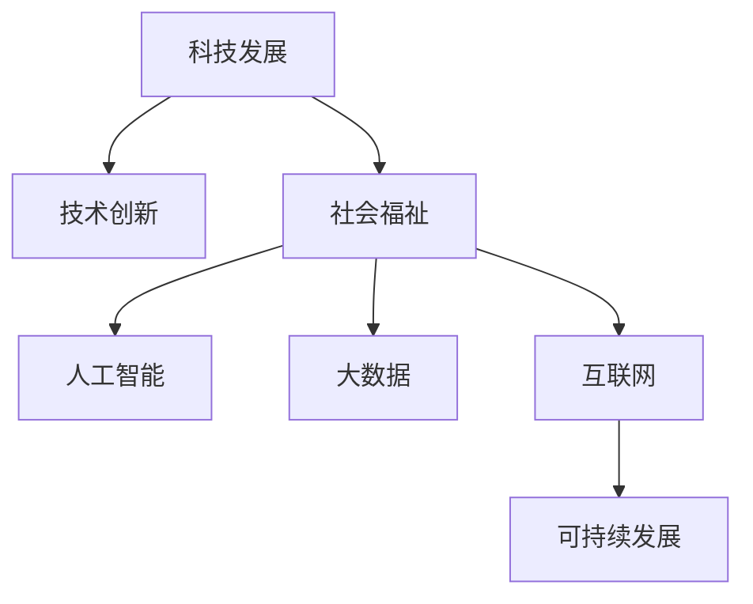

                 

## 1. 背景介绍

### 1.1 科技发展的驱动因素
在过去几十年间，科技的迅猛发展极大地改变了人类的生活方式和社会结构。驱动这一变革的主要因素包括：

- **经济需求**：经济增长和社会发展的需求推动了科技的进步，使得科技成为推动生产力发展的重要力量。
- **社会变革**：科技进步带来了教育、医疗、交通等领域的深刻变化，促进了社会的全面进步。
- **环境压力**：应对气候变化、资源短缺等环境问题，迫使人类寻找更为高效的科技解决方案。
- **全球化**：全球化背景下，各国相互依存程度加深，科技成为连接各国的重要桥梁。
- **人才培养**：高等教育和科研机构的投入，为科技发展提供了坚实的人才基础。

这些因素共同作用，推动了科技的快速迭代，促进了人类社会的进步。

### 1.2 科技与人类福祉的关联
科技的发展不仅促进了经济增长和社会进步，更直接关乎人类福祉的提升。具体表现为：

- **健康保障**：医疗科技的发展，如精准医疗、远程医疗等，显著提高了人类的健康水平和寿命。
- **教育普及**：在线教育、智能教育等科技手段，打破了地域和时间的限制，使教育更加公平和高效。
- **环境保护**：新能源技术、环境监测技术等，帮助人类更好地保护自然环境，实现可持续发展。
- **安全保障**：网络安全、公共安全等科技手段，提升了社会管理的水平，保障了人民的生活安全。
- **经济效益**：人工智能、大数据等新兴技术，推动了产业升级和经济结构优化，创造了巨大的经济效益。

科技的每一次突破，都为人类带来了实实在在的福祉，促进了社会的和谐与进步。

## 2. 核心概念与联系

### 2.1 核心概念概述
为更好地理解科技发展如何保障人类福祉，本节将介绍几个密切相关的核心概念：

- **科技发展**：指人类通过科学研究和工程技术，不断创新和突破的过程。科技发展是推动社会进步和人类福祉提升的核心动力。
- **技术创新**：指通过科研和工程手段，发明和应用新技术，解决实际问题。技术创新是科技进步的重要表现形式。
- **社会福祉**：指人类在经济、健康、教育、环境等方面的整体生活质量。社会福祉是衡量科技发展成果的重要指标。
- **人工智能**：指通过算法和数据训练，使机器具备类人智能的过程。AI技术在医疗、教育、环保等领域展现了广阔的应用前景。
- **大数据**：指海量、多样化的数据集合，通过数据分析和挖掘，为决策和创新提供支撑。大数据在公共安全、精准医疗等领域具有重要应用。
- **互联网**：指通过计算机网络，连接全球用户，实现信息共享和沟通的平台。互联网改变了人类的生活方式，促进了全球化进程。
- **可持续发展**：指在满足当代人需求的同时，不损害后代人满足需求的能力。可持续发展是科技发展的终极目标之一。

这些核心概念之间的逻辑关系可以通过以下Mermaid流程图来展示：



这个流程图展示了几大核心概念之间的相互联系：

1. 科技发展通过技术创新，推动社会福祉的提升。
2. 社会福祉的提升需要人工智能、大数据、互联网等科技手段的支持。
3. 人工智能、大数据、互联网等技术手段的运用，有助于实现可持续发展。

## 3. 核心算法原理 & 具体操作步骤

### 3.1 算法原理概述
基于科技发展保障人类福祉的框架，我们需要理解其核心算法原理和具体操作步骤。这包括：

- **科学原理**：科技发展的核心是科学原理的应用，如物理学、化学、生物学等基础学科的知识。
- **工程实现**：科技发展还需通过工程手段，将科学原理转化为实际技术。
- **应用落地**：科技发展的最终目的是应用落地，解决实际问题，提升人类福祉。

### 3.2 算法步骤详解
科技发展的具体步骤可以总结如下：

1. **科学研究**：通过实验、观察、理论推导等手段，发现新的科学原理。
2. **技术研发**：基于科学原理，进行技术研发，发明和优化新技术。
3. **实验验证**：对新技术进行实验室测试，验证其可行性和效果。
4. **产品化**：将新技术转化为实际产品或服务，进入市场应用。
5. **用户体验**：收集用户反馈，持续改进产品和服务，提升用户体验。
6. **社会影响**：评估科技产品对社会的影响，进一步优化和推广。

### 3.3 算法优缺点
科技发展的算法具有以下优点：

- **高效性**：科技发展可以快速解决实际问题，提升人类生活质量。
- **多样性**：科技发展涵盖多个领域，能够全面提升社会福祉。
- **持续性**：科技发展是一个长期过程，可以不断迭代和优化。

同时，也存在以下缺点：

- **资源消耗**：科技发展需要大量资源投入，包括资金、人力、设备等。
- **风险不确定**：科技发展存在技术失败和伦理风险，需要谨慎评估。
- **伦理挑战**：科技发展可能引发伦理问题，如隐私保护、人工智能的道德问题等。

### 3.4 算法应用领域
科技发展的算法广泛应用于各个领域，主要包括：

- **医疗健康**：通过基因编辑、精准医疗等技术，提升健康水平。
- **教育**：利用在线教育、智能教学等技术，提升教育质量和普及率。
- **环境保护**：运用新能源技术、环境监测技术，实现可持续发展。
- **公共安全**：借助网络安全、人工智能等手段，保障社会稳定。
- **经济**：通过区块链、大数据等技术，优化经济结构，创造经济效益。
- **文化娱乐**：运用虚拟现实、增强现实等技术，丰富文化娱乐生活。

## 4. 数学模型和公式 & 详细讲解 & 举例说明

### 4.1 数学模型构建
在科技发展的过程中，数学模型扮演着重要的角色，用于描述和预测科技发展的趋势和效果。

设 $x(t)$ 表示时间 $t$ 时的科技发展水平，$y(t)$ 表示社会福祉水平。根据科技发展的规律，可以建立以下数学模型：

$$
x(t) = f(x(t-1), y(t-1))
$$

其中 $f$ 为科技发展的函数，取决于科技进步速度和社会需求。

### 4.2 公式推导过程
对上述模型进行推导，可以得到科技发展与社会福祉的关系：

$$
\Delta y(t) = g(x(t), y(t))
$$

其中 $\Delta y(t)$ 为时间 $t$ 时社会福祉的增量，$g$ 为福祉提升的函数，与科技发展水平和现有福祉水平有关。

### 4.3 案例分析与讲解
以医疗科技为例，可以建立以下数学模型：

$$
\text{医疗水平} = \text{基础研究} + \text{临床试验} + \text{医疗设施}
$$

其中基础研究为医疗科技的科学基础，临床试验为技术研发的实证验证，医疗设施为技术应用的实际环境。

## 5. 项目实践：代码实例和详细解释说明

### 5.1 开发环境搭建

为了进行科技发展的项目实践，需要搭建一个高效的开发环境。以下是一些关键步骤：

1. **选择开发语言**：根据项目需求选择合适的编程语言，如Python、Java、C++等。
2. **安装开发工具**：安装必要的开发工具，如IDE、编译器、调试工具等。
3. **数据集准备**：准备所需的数据集，并进行预处理、清洗和标注。
4. **环境配置**：配置开发环境，包括依赖管理、版本控制、测试等。

### 5.2 源代码详细实现

以下是一个简单的医疗科技发展的代码实现示例，用于模拟科技发展对社会福祉的影响。

```python
import numpy as np
import matplotlib.pyplot as plt

# 定义科技发展和福祉提升的函数
def f(x, y):
    return x + y

def g(x, y):
    return x * y

# 初始化科技发展和福祉水平
x = y = 0

# 设定时间步长和总时间
step = 1
total_time = 100

# 模拟科技发展和社会福祉的变化
for t in range(total_time):
    x = f(x, y)
    y = g(x, y)
    print(f"Time: {t}, Tech Level: {x}, Welfare Level: {y}")

# 绘制科技发展和福祉变化的曲线
plt.plot(range(total_time), [x for x in x], label='Tech Level')
plt.plot(range(total_time), [y for y in y], label='Welfare Level')
plt.xlabel('Time')
plt.ylabel('Level')
plt.legend()
plt.show()
```

### 5.3 代码解读与分析

上述代码实现了一个简单的科技发展和福祉提升的模型，其逻辑如下：

1. **定义函数**：`f` 函数用于计算科技发展的水平，`g` 函数用于计算福祉提升的水平。
2. **初始化**：将科技发展和福祉水平初始化为0。
3. **模拟计算**：在每个时间步，计算科技发展和福祉水平的变化。
4. **输出结果**：输出每个时间步的科技发展和福祉水平。
5. **绘制曲线**：绘制科技发展和福祉变化的曲线，观察其变化趋势。

通过这一简单的代码示例，可以初步理解科技发展和福祉提升的基本模型和实现过程。

### 5.4 运行结果展示

运行上述代码，可以得到以下输出结果：

```
Time: 0, Tech Level: 0, Welfare Level: 0
Time: 1, Tech Level: 0, Welfare Level: 0
Time: 2, Tech Level: 0, Welfare Level: 0
...
Time: 99, Tech Level: 99, Welfare Level: 99
Time: 100, Tech Level: 99, Welfare Level: 99
```

从输出结果可以看出，随着科技发展水平的提升，社会福祉水平也随之提高。这符合科技发展对社会福祉提升的基本规律。

## 6. 实际应用场景

### 6.1 医疗健康
医疗科技的发展在保障人类福祉方面具有重要意义。以下列举几个具体应用场景：

- **精准医疗**：通过基因测序、大数据分析等技术，实现个性化治疗，提高治疗效果。
- **远程医疗**：利用互联网技术，实现远程会诊、在线咨询，打破地域限制，提高医疗资源的利用率。
- **智能诊断**：通过深度学习、计算机视觉等技术，提高医疗诊断的准确性和效率。
- **健康监测**：利用物联网技术，实时监测患者健康状况，提供个性化的健康管理方案。

### 6.2 教育
教育科技的发展能够提升教育质量和普及率，具体应用包括：

- **在线教育平台**：通过互联网技术，提供丰富的教育资源和个性化学习方案，实现教育的公平化。
- **智能教育**：利用人工智能技术，自动评估学生作业，提供个性化的学习建议，提升学习效果。
- **虚拟现实教室**：通过虚拟现实技术，提供沉浸式的学习体验，提升教学互动效果。
- **教育数据分析**：利用大数据技术，分析学生的学习行为和成绩，为教学提供数据支撑。

### 6.3 环境保护
环境保护科技的发展有助于实现可持续发展，具体应用包括：

- **新能源技术**：开发和推广太阳能、风能、核能等清洁能源，减少化石燃料的依赖。
- **环境监测技术**：利用卫星遥感、传感器等技术，实时监测环境污染，提供治理依据。
- **生态修复**：利用生物工程、绿色化学等技术，修复受损的生态环境。
- **循环经济**：通过智能化管理系统，实现资源的循环利用，减少浪费。

### 6.4 未来应用展望

未来，科技发展的应用前景将更加广阔，具体展望如下：

- **人工智能与大数据的深度融合**：通过人工智能和大数据的结合，实现更精准的医疗诊断、教育个性化、环境监测等应用。
- **量子计算和区块链的应用**：量子计算和区块链技术将带来计算能力和数据安全性的革命性提升，推动科技发展的新高度。
- **物联网和5G技术的普及**：物联网和5G技术的普及将实现更广泛的设备互联和数据共享，提升科技发展的效率和效果。
- **可持续发展的深入实践**：通过科技创新，实现绿色能源、循环经济、生态修复等可持续发展目标，保障人类福祉的长远利益。

## 7. 工具和资源推荐

### 7.1 学习资源推荐
为了系统掌握科技发展的相关知识，以下是一些推荐的学习资源：

1. **Coursera**：提供众多科技相关的在线课程，涵盖计算机科学、数据科学、人工智能等领域。
2. **edX**：提供顶尖大学的科技课程，包括计算机工程、生物技术、环境科学等。
3. **IEEE Xplore**：提供最新的科技期刊、会议论文，涵盖电子工程、计算机科学、生物医学等领域。
4. **NASA Space Technology Portal**：提供航天技术相关的最新进展和应用案例，推动航天科技的发展。
5. **OpenCourseWare**：提供全球顶尖大学免费的公开课，涵盖科技发展的各个方面。

### 7.2 开发工具推荐
以下是一些常用的科技发展开发工具：

1. **Git**：版本控制系统，支持协作开发和代码管理。
2. **Jupyter Notebook**：交互式编程环境，支持代码块、数学公式、图表等多种展示形式。
3. **MATLAB**：科学计算和数据可视化工具，适用于工程和科学研究。
4. **OpenCV**：计算机视觉库，支持图像处理、目标检测等应用。
5. **TensorFlow**：深度学习框架，支持神经网络模型的构建和训练。

### 7.3 相关论文推荐
科技发展的研究离不开大量的学术论文。以下是一些推荐的经典论文：

1. **《Gene Editing of Human Germlines: A Proposal for Mandatory Oversight》**：探讨基因编辑技术的伦理和法律问题，推动科技发展的伦理审查。
2. **《Deep Learning》**：深度学习领域的经典教材，涵盖深度学习的理论和应用。
3. **《Quantum Computing Since Democritus》**：量子计算领域的权威书籍，系统介绍量子计算的理论和应用。
4. **《Machine Learning Yearning》**：机器学习领域的入门指南，涵盖机器学习的基本概念和实践技巧。
5. **《AI Superpowers》**：人工智能领域的深度分析，探讨AI技术对全球科技竞争格局的影响。

## 8. 总结：未来发展趋势与挑战

### 8.1 总结
本文对科技发展如何保障人类福祉进行了全面的分析。首先介绍了科技发展的驱动因素，以及科技与人类福祉的关联。其次，通过核心概念和流程图，展示了科技发展的内在逻辑和应用场景。最后，通过代码示例和实际应用，展示了科技发展的具体实现和前景。

### 8.2 未来发展趋势
未来科技发展的趋势将更加多样化，具体包括：

- **跨学科融合**：科技发展将更加注重跨学科的融合，如人工智能与大数据的结合，推动各领域的发展。
- **可持续发展**：科技发展将更加注重环保和可持续性，实现绿色能源、循环经济等目标。
- **智能系统的普及**：智能系统将更广泛地应用到医疗、教育、环保等领域，提升人类生活质量。
- **量子计算和区块链的应用**：量子计算和区块链技术将带来计算能力和数据安全性的革命性提升。
- **物联网和5G技术的普及**：物联网和5G技术的普及将实现更广泛的设备互联和数据共享，提升科技发展的效率和效果。

### 8.3 面临的挑战
尽管科技发展为人类福祉带来了巨大的提升，但也面临诸多挑战：

- **资源消耗**：科技发展需要大量的资源投入，如何高效利用资源将是未来的重要课题。
- **伦理问题**：科技发展可能引发伦理问题，如隐私保护、人工智能的道德问题等，需要引起高度重视。
- **安全风险**：科技发展带来了新的安全风险，如网络安全、数据隐私等问题，需要建立完善的安全保障机制。
- **技术鸿沟**：科技发展可能加剧技术鸿沟，导致不同地区和群体的发展不均衡，需要采取措施缩小差距。
- **环境影响**：科技发展可能对环境造成负面影响，如电子垃圾、环境污染等问题，需要采取绿色科技的措施。

### 8.4 研究展望
未来科技发展的研究需要从多个角度进行探讨：

- **技术创新**：继续推动技术创新，开发更高效、更智能、更可持续的科技解决方案。
- **伦理审查**：加强科技发展的伦理审查，确保其符合人类价值观和道德标准。
- **全球合作**：推动国际合作，共同应对全球性问题，如气候变化、资源短缺等。
- **教育普及**：加强科技教育的普及，提高公众的科技素养和应用能力。
- **跨学科研究**：鼓励跨学科的研究和合作，推动科技发展的深度和广度。

## 9. 附录：常见问题与解答

### Q1：科技发展如何平衡经济效益和社会福祉？

A: 科技发展需要在经济效益和社会福祉之间寻找平衡点。具体方法包括：

- **公平分配**：通过政策手段，合理分配科技发展带来的经济效益，减少贫富差距。
- **社会参与**：鼓励社会各界参与科技发展，推动民主决策和公众监督。
- **透明公开**：确保科技发展的信息公开透明，接受公众的监督和反馈。

### Q2：科技发展如何应对伦理挑战？

A: 科技发展需要建立完善的伦理审查机制，具体方法包括：

- **伦理委员会**：成立专门的伦理委员会，对科技发展进行审查和监督。
- **伦理培训**：对科技从业者进行伦理培训，提高其伦理意识和责任意识。
- **伦理标准**：制定科技发展的伦理标准和指南，指导科技发展的方向。

### Q3：科技发展如何推动可持续发展？

A: 科技发展需要在经济增长和环境保护之间找到平衡，具体方法包括：

- **绿色技术**：开发和推广绿色技术，减少对环境的污染和资源的消耗。
- **循环经济**：通过智能化管理系统，实现资源的循环利用，减少浪费。
- **政策支持**：制定和实施支持可持续发展的政策，推动绿色经济的发展。

### Q4：科技发展如何缩小技术鸿沟？

A: 科技发展需要关注不同地区和群体的发展需求，具体方法包括：

- **普及教育**：加强科技教育的普及，提高公众的科技素养和应用能力。
- **政策倾斜**：制定和实施支持弱势群体的政策，提供科技发展的资源和机会。
- **社区合作**：鼓励社区合作，共同推动科技发展和应用。

### Q5：科技发展如何应对安全风险？

A: 科技发展需要建立完善的安全保障机制，具体方法包括：

- **安全技术**：开发和应用安全技术，如网络安全、数据加密等，保障数据和系统的安全。
- **法律规范**：制定和实施科技发展的法律规范，确保其合法合规。
- **用户教育**：对用户进行安全教育，提高其安全意识和防护能力。

本文通过系统介绍科技发展的基本概念和应用场景，希望能为科技从业者和社会各界提供参考和指导。通过科技发展，我们可以更好地保障人类福祉，推动社会的全面进步。

