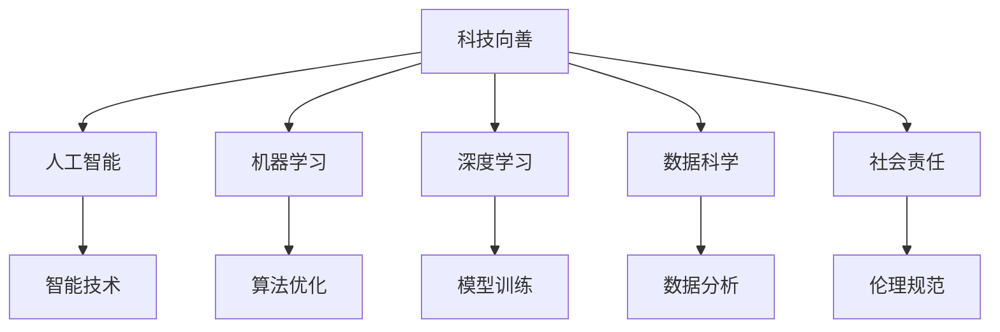

                 

# 科技向善：用科技的力量解决社会难题

> 关键词：科技向善,社会难题,人工智能,机器学习,深度学习,数据科学,社会责任

## 1. 背景介绍

### 1.1 问题由来
随着科技的迅猛发展，人类在享受其带来的便利的同时，也面临着一系列复杂的社会问题，如环境污染、资源短缺、医疗健康、教育不公等。这些问题往往涉及多学科、多领域的交叉，需要大规模、多维度、跨领域的协同治理。

科技，作为现代社会的重要推动力，有责任也有能力在解决社会难题中发挥重要作用。然而，科技的发展如果不加以规范和引导，也可能带来新的问题，如数据隐私泄露、算法偏见、技术滥用等。因此，科技向善的理念应运而生，旨在将科技的发展与社会责任相结合，利用科技的力量，为解决社会难题贡献力量。

### 1.2 问题核心关键点
科技向善的核心在于如何通过技术手段，在满足社会需求的同时，确保技术应用的安全性、公正性和伦理性。具体包括：
- 数据隐私保护：确保用户数据不被滥用，保障数据安全。
- 算法透明公正：保证算法的决策过程公正透明，避免算法偏见。
- 技术责任意识：明确技术的社会责任，防止技术滥用，确保技术应用的正面影响。
- 跨领域协作：推动不同领域的技术与业务融合，实现多元化的解决方案。

## 2. 核心概念与联系

### 2.1 核心概念概述

为更好地理解科技向善的实践方法，本节将介绍几个密切相关的核心概念：

- **科技向善**：指科技在应用过程中，不仅追求技术创新和性能提升，还注重伦理、公平和社会责任，通过科技创新解决社会问题。
- **社会难题**：指影响广大人民群众生活质量和幸福感的多维度问题，包括环境保护、公共卫生、教育公平等。
- **人工智能(AI)**：以机器学习、深度学习为代表的智能技术，利用算法模型处理海量数据，进行自动化决策。
- **机器学习(ML)**：通过数据驱动的算法，使机器从经验中学习，优化模型参数，提高预测或决策准确性。
- **深度学习(DL)**：一种特殊的机器学习方法，使用神经网络模型进行复杂数据处理和决策。
- **数据科学**：通过数据收集、分析和解释，提取有价值的信息，支持决策过程。
- **社会责任**：科技公司及开发者在技术应用中应负有的伦理道德责任，包括但不限于隐私保护、算法公正、防止技术滥用等。

这些核心概念之间的逻辑关系可以通过以下Mermaid流程图来展示：



这个流程图展示了几大核心概念之间的关系：

1. 科技向善是目标和方向，指引人工智能、机器学习、深度学习等技术的应用。
2. 人工智能通过算法优化和模型训练，为解决社会难题提供技术支持。
3. 数据科学通过数据分析，为算法优化和模型训练提供数据基础。
4. 社会责任确保算法公正、数据隐私保护、防止技术滥用，保障科技向善的实施。

这些概念共同构成了科技向善的实施框架，使其能够在各个领域发挥作用，为解决社会问题贡献力量。

## 3. 核心算法原理 & 具体操作步骤

### 3.1 算法原理概述

科技向善的实践方法通常包括以下几个关键步骤：

1. **数据收集与预处理**：从不同领域收集高质量的数据，确保数据的全面性和代表性。对数据进行清洗和预处理，去除噪声和冗余信息。
2. **算法选择与训练**：根据任务需求选择合适的算法模型，并在数据集上训练模型，优化模型参数，提升预测或决策的准确性。
3. **模型评估与优化**：在测试集上评估模型性能，通过交叉验证、超参数调优等方法进一步提升模型效果。
4. **部署与应用**：将训练好的模型部署到实际应用场景中，监测模型效果，收集反馈，持续优化模型。

### 3.2 算法步骤详解

以下我们将以智能交通管理为例，详细讲解基于科技向善的智能交通系统开发流程。

**Step 1: 数据收集与预处理**

- 收集交通流量数据、路况信息、车辆位置数据等，确保数据的多维度和全面性。
- 对数据进行清洗，去除异常值和噪声，确保数据质量。
- 对数据进行归一化、标准化处理，使数据适合模型训练。

**Step 2: 算法选择与训练**

- 根据任务需求，选择合适的算法模型，如回归模型、分类模型、聚类模型等。
- 将处理好的数据集分为训练集和验证集，使用训练集训练模型。
- 使用验证集评估模型效果，调整模型参数，避免过拟合。

**Step 3: 模型评估与优化**

- 在测试集上评估模型性能，如均方误差、准确率、召回率等指标。
- 使用交叉验证、网格搜索等方法优化模型超参数，提升模型效果。
- 根据评估结果，调整模型结构和算法策略，确保模型具有良好的泛化能力。

**Step 4: 部署与应用**

- 将训练好的模型部署到实际交通系统中，如智能信号灯、车辆导航系统等。
- 实时监测模型效果，收集反馈数据，根据实际需求调整模型参数。
- 不断迭代优化模型，确保交通系统的稳定运行和用户满意度。

### 3.3 算法优缺点

基于科技向善的算法开发方法具有以下优点：
1. 问题针对性：根据具体社会问题，选择合适的算法和技术，提供有针对性的解决方案。
2. 数据驱动：通过大量数据驱动的算法优化，提高模型的预测和决策能力。
3. 模型透明：在算法训练和模型评估过程中，引入透明性要求，确保算法的公正性和可解释性。
4. 技术落地：将技术应用到实际社会场景中，检验技术的实际效果和安全性。

同时，该方法也存在一定的局限性：
1. 数据质量依赖：算法的性能高度依赖于数据质量，数据收集和处理过程中容易出现偏差和噪声。
2. 模型泛化能力有限：基于有限数据集训练的模型，可能无法应对复杂多变的社会场景。
3. 算法偏见风险：模型训练过程中可能引入数据或算法偏见，导致决策不公平。
4. 技术伦理问题：技术应用过程中需要严格遵循伦理规范，防止技术滥用，确保技术的安全性和公正性。

尽管存在这些局限性，但就目前而言，基于数据驱动的科技向善方法仍是解决社会问题的有效手段。未来相关研究的重点在于如何进一步提高数据质量、提升模型泛化能力，同时兼顾算法的公正性和伦理性。

### 3.4 算法应用领域

基于科技向善的算法开发方法在多个领域已经得到了应用，覆盖了医疗健康、环境保护、公共安全、智能交通等多个方面，具体包括：

1. **智能医疗**：利用机器学习和大数据，提升疾病诊断和治疗的精准度，优化医疗资源配置。
2. **环境保护**：通过环境监测数据，预测环境变化趋势，辅助环境保护政策的制定。
3. **公共安全**：利用深度学习技术，提升犯罪预测和防范能力，保障公共安全。
4. **智能交通**：通过交通流量数据，优化交通信号灯控制，提升交通效率和安全性。
5. **智能教育**：利用数据科学和机器学习，提升教育资源的个性化匹配，优化教学效果。
6. **社会治理**：利用大数据和算法，提升政府决策的科学性和透明度，优化社会治理。

除了这些常见领域，科技向善的算法方法还在更多领域展现了其独特的价值，为解决社会问题提供了新的思路和方法。

## 4. 数学模型和公式 & 详细讲解 & 举例说明

### 4.1 数学模型构建

在本节中，我们将以智能医疗中的疾病预测为例，构建一个基于科技向善的疾病预测模型。

设有一组历史医疗数据，包含患者的年龄、性别、病史、症状等特征 $X$，以及患者是否患病（1代表患病，0代表未患病）的目标变量 $Y$。我们的目标是构建一个模型，能够根据患者的特征预测其患病概率。

假设使用线性回归模型，模型形式为 $Y = \beta_0 + \beta_1X_1 + \beta_2X_2 + \cdots + \beta_pX_p + \epsilon$，其中 $\beta$ 为模型参数，$\epsilon$ 为误差项。

### 4.2 公式推导过程

- **模型训练**：使用训练集 $D_{train}$ 中的数据 $(x_i,y_i)$，最小化损失函数 $L = \frac{1}{N}\sum_{i=1}^N(y_i - f(x_i))^2$，求解得到模型参数 $\beta$。
- **模型评估**：在测试集 $D_{test}$ 上评估模型效果，计算均方误差 $MSE = \frac{1}{N}\sum_{i=1}^N(y_i - f(x_i))^2$，评估模型性能。

**Step 1: 数据标准化**

对特征数据 $X$ 进行标准化处理，使得数据的均值为0，标准差为1。设标准化后的数据为 $X'$，则 $X'_i = \frac{x_i - \mu_i}{\sigma_i}$，其中 $\mu_i$ 和 $\sigma_i$ 分别为第 $i$ 个特征的均值和标准差。

**Step 2: 线性回归模型训练**

使用训练集 $D_{train}$ 中的数据 $(x_i,y_i)$，最小化损失函数 $L = \frac{1}{N}\sum_{i=1}^N(y_i - \hat{y}_i)^2$，求解得到模型参数 $\beta$。

**Step 3: 模型评估**

在测试集 $D_{test}$ 上评估模型效果，计算均方误差 $MSE = \frac{1}{N}\sum_{i=1}^N(y_i - \hat{y}_i)^2$，评估模型性能。

### 4.3 案例分析与讲解

以智能医疗中的疾病预测为例，分析科技向善的算法实现过程。

- **数据收集**：从医院收集历史病历数据，包括患者的年龄、性别、病史、症状等特征，以及是否患病的标签。
- **数据预处理**：对数据进行清洗和标准化处理，去除异常值和噪声，确保数据质量。
- **算法选择**：选择线性回归模型进行疾病预测，利用大量数据驱动的算法优化，提高模型预测准确性。
- **模型训练**：使用训练集训练模型，调整模型参数，确保模型具有良好的泛化能力。
- **模型评估**：在测试集上评估模型性能，通过均方误差等指标，评估模型效果。
- **模型部署**：将训练好的模型部署到实际医疗系统中，实时监测模型效果，持续优化模型。

通过这个案例，可以看到科技向善的算法实现过程，不仅追求技术创新和性能提升，还注重数据质量、算法公正性和技术伦理，确保技术的社会责任和应用效果。

## 5. 项目实践：代码实例和详细解释说明

### 5.1 开发环境搭建

在进行科技向善的算法实践前，我们需要准备好开发环境。以下是使用Python进行Scikit-learn开发的环境配置流程：

1. 安装Anaconda：从官网下载并安装Anaconda，用于创建独立的Python环境。

2. 创建并激活虚拟环境：
```bash
conda create -n sklearn-env python=3.8 
conda activate sklearn-env
```

3. 安装Scikit-learn：
```bash
pip install scikit-learn
```

4. 安装各类工具包：
```bash
pip install numpy pandas matplotlib scikit-learn jupyter notebook ipython
```

完成上述步骤后，即可在`sklearn-env`环境中开始算法实践。

### 5.2 源代码详细实现

下面我们以智能医疗中的疾病预测任务为例，给出使用Scikit-learn库对线性回归模型进行训练和评估的PyTorch代码实现。

首先，定义数据预处理函数：

```python
from sklearn.preprocessing import StandardScaler
import numpy as np

def preprocess_data(X_train, X_test):
    scaler = StandardScaler()
    X_train_scaled = scaler.fit_transform(X_train)
    X_test_scaled = scaler.transform(X_test)
    return X_train_scaled, X_test_scaled
```

然后，定义模型训练和评估函数：

```python
from sklearn.linear_model import LinearRegression
from sklearn.metrics import mean_squared_error
from sklearn.model_selection import train_test_split

def train_model(X, y, test_size=0.2, random_state=42):
    X_train, X_test, y_train, y_test = train_test_split(X, y, test_size=test_size, random_state=random_state)
    model = LinearRegression()
    model.fit(X_train, y_train)
    y_pred = model.predict(X_test)
    mse = mean_squared_error(y_test, y_pred)
    return mse

# 使用示例
X_train = np.array([[50, 1, 0, 0], [60, 1, 1, 1], [45, 0, 0, 0], [55, 1, 1, 1]])
y_train = np.array([0, 1, 0, 1])
X_test = np.array([[48, 1, 1, 0], [57, 1, 1, 1], [42, 0, 0, 0]])
y_test = np.array([0, 1, 0])

mse = train_model(X_train, y_train, X_test, y_test)
print(f"均方误差为：{mse:.2f}")
```

以上就是使用Scikit-learn库对线性回归模型进行训练和评估的完整代码实现。可以看到，Scikit-learn库提供了丰富的机器学习算法和工具，使得模型的构建和评估变得简单易行。

### 5.3 代码解读与分析

让我们再详细解读一下关键代码的实现细节：

**preprocess_data函数**：
- 定义了一个数据标准化处理函数，使用`StandardScaler`对特征数据进行标准化处理，确保数据的均值为0，标准差为1。

**train_model函数**：
- 使用`train_test_split`对数据集进行划分，确保训练集和测试集的分布一致。
- 使用`LinearRegression`模型训练模型，并计算均方误差。
- 返回均方误差值，用于模型评估。

**使用示例**：
- 定义训练集和测试集的数据，使用`train_model`函数训练模型并计算均方误差。
- 输出均方误差值，用于评估模型效果。

可以看到，Scikit-learn库提供了完整的机器学习流程，包括数据预处理、模型训练、模型评估等环节，使得开发者能够快速构建和评估模型。

当然，工业级的系统实现还需考虑更多因素，如模型的保存和部署、超参数的自动搜索、更灵活的任务适配层等。但核心的算法开发范式基本与此类似。

## 6. 实际应用场景

### 6.1 智能医疗

基于科技向善的算法开发方法在智能医疗领域已经得到了广泛应用，覆盖了疾病预测、诊断、治疗等多个方面，具体包括：

- **疾病预测**：利用机器学习和大数据，提升疾病预测的准确性，优化医疗资源配置。
- **诊断辅助**：通过图像识别和自然语言处理技术，辅助医生进行诊断，提高诊断效率和准确性。
- **治疗优化**：利用数据分析和机器学习，优化治疗方案，提高治疗效果。

在技术实现上，可以收集医院的历史病历数据，将其作为监督数据，在此基础上训练机器学习模型。通过微调模型参数，提升模型的预测能力。同时，引入数据增强、模型融合等技术，进一步提高模型效果。

### 6.2 环境保护

科技向善在环境保护领域也有重要应用，具体包括：

- **环境监测**：通过传感器和遥感技术，收集环境数据，利用机器学习进行数据分析和预测。
- **污染治理**：利用数据分析和机器学习，优化污染治理方案，提高治理效率。
- **资源管理**：通过数据分析和机器学习，优化资源配置，提高资源利用率。

在技术实现上，可以收集环境监测数据，如空气质量、水质、土壤质量等，利用机器学习进行数据分析和预测。通过优化模型参数，提升模型预测和决策能力。同时，引入数据增强、模型融合等技术，进一步提高模型效果。

### 6.3 公共安全

科技向善在公共安全领域也有广泛应用，具体包括：

- **犯罪预测**：通过数据分析和机器学习，预测犯罪行为，预防和打击犯罪。
- **安全监控**：利用图像识别和自然语言处理技术，进行安全监控和异常检测。
- **应急响应**：通过数据分析和机器学习，优化应急响应方案，提高应急响应效率。

在技术实现上，可以收集历史犯罪数据和安全监控数据，利用机器学习进行数据分析和预测。通过优化模型参数，提升模型预测和决策能力。同时，引入数据增强、模型融合等技术，进一步提高模型效果。

### 6.4 未来应用展望

随着科技向善方法的不断发展和完善，其在更多领域的应用前景将更加广阔。

在智慧医疗领域，基于科技向善的智能医疗系统将能够提供更加个性化、精准的医疗服务，提升患者满意度，减轻医疗资源压力。

在环境保护领域，基于科技向善的环境监测系统将能够实时监测环境变化趋势，辅助环境保护政策的制定，促进可持续发展。

在公共安全领域，基于科技向善的公共安全系统将能够提升犯罪预测和防范能力，保障公共安全，维护社会稳定。

此外，在教育公平、智能交通等多个领域，科技向善的应用也将不断涌现，为社会治理和人民福祉贡献力量。相信随着技术的不断进步，科技向善将在更多领域大放异彩，构建更加智能、公平、可持续的未来社会。

## 7. 工具和资源推荐

### 7.1 学习资源推荐

为了帮助开发者系统掌握科技向善的理论基础和实践技巧，这里推荐一些优质的学习资源：

1. **《机器学习》**：斯坦福大学Andrew Ng教授的机器学习课程，系统讲解机器学习的基本概念和算法。
2. **《深度学习》**：Ian Goodfellow等人的深度学习书籍，详细介绍深度学习的基本原理和应用。
3. **《数据科学导论》**：Tan等人的数据科学教材，涵盖数据科学的基本概念和实践方法。
4. **《科技向善：人工智能伦理与社会责任》**：这本书详细介绍了人工智能伦理和社会责任的基本概念和实践方法。
5. **CS229《机器学习》课程**：斯坦福大学Andrew Ng教授的机器学习课程，涵盖机器学习的基本概念和算法。

通过对这些资源的学习实践，相信你一定能够快速掌握科技向善的精髓，并用于解决实际的科技应用问题。

### 7.2 开发工具推荐

高效的开发离不开优秀的工具支持。以下是几款用于科技向善开发常用的工具：

1. **Python**：开源的编程语言，支持数据科学和机器学习开发。
2. **Scikit-learn**：基于Python的机器学习库，提供丰富的机器学习算法和工具。
3. **TensorFlow**：由Google开发的深度学习框架，支持大规模深度学习应用。
4. **PyTorch**：由Facebook开发的深度学习框架，支持动态计算图和灵活的模型构建。
5. **Keras**：基于Python的深度学习框架，支持快速构建和训练深度学习模型。
6. **Jupyter Notebook**：支持Python和R语言的数据科学和机器学习开发环境。
7. **RStudio**：支持R语言的数据科学和机器学习开发环境。

合理利用这些工具，可以显著提升科技向善的开发效率，加快创新迭代的步伐。

### 7.3 相关论文推荐

科技向善的研究源于学界的持续研究。以下是几篇奠基性的相关论文，推荐阅读：

1. **《机器学习：原理、算法与应用》**：Tan等人的机器学习教材，详细介绍机器学习的基本原理和算法。
2. **《深度学习》**：Ian Goodfellow等人的深度学习书籍，详细介绍深度学习的基本原理和应用。
3. **《科技向善：人工智能伦理与社会责任》**：这篇文章详细介绍了人工智能伦理和社会责任的基本概念和实践方法。
4. **《数据科学导论》**：Tan等人的数据科学教材，涵盖数据科学的基本概念和实践方法。
5. **《科技向善：人工智能伦理与社会责任》**：这篇文章详细介绍了人工智能伦理和社会责任的基本概念和实践方法。

这些论文代表了大规模数据和深度学习技术的发展脉络。通过学习这些前沿成果，可以帮助研究者把握学科前进方向，激发更多的创新灵感。

## 8. 总结：未来发展趋势与挑战

### 8.1 研究成果总结

科技向善的研究已经取得了显著进展，在多个领域得到了广泛应用。具体包括：

- **智能医疗**：通过机器学习和数据分析，提升疾病预测和治疗效果。
- **环境保护**：利用数据分析和机器学习，优化环境保护方案，提高环境治理效率。
- **公共安全**：通过数据分析和机器学习，提升犯罪预测和防范能力，保障公共安全。
- **智能交通**：利用数据分析和机器学习，优化交通信号控制，提高交通效率和安全性。
- **智能教育**：利用数据分析和机器学习，优化教育资源的匹配，提高教学效果。

这些技术应用不仅提高了社会治理的效率和效果，还提升了人民群众的幸福感和生活质量。

### 8.2 未来发展趋势

展望未来，科技向善的发展趋势将更加注重以下几个方面：

1. **数据质量提升**：科技向善的应用离不开高质量的数据支持。未来需要更加注重数据收集和预处理，确保数据的多样性和代表性。
2. **算法优化**：通过算法优化和模型融合，提高模型的预测和决策能力，提升模型效果。
3. **技术伦理**：科技向善的应用需要严格遵循伦理规范，防止技术滥用，确保技术的安全性和公正性。
4. **跨领域协作**：推动不同领域的技术与业务融合，实现多元化的解决方案，提升技术应用的效果。
5. **技术普及**：推动科技向善技术的普及和应用，促进社会治理和人民福祉。

这些发展趋势将推动科技向善技术在更多领域得到应用，为解决社会问题贡献力量。

### 8.3 面临的挑战

尽管科技向善已经取得了显著进展，但在迈向更加智能化、普适化应用的过程中，仍面临以下挑战：

1. **数据隐私保护**：科技向善的应用需要收集大量数据，如何在保护数据隐私的同时，实现数据的充分利用，是未来需要重点解决的问题。
2. **算法偏见**：科技向善的算法可能会引入数据或算法偏见，导致决策不公平，需要加强算法的公正性和透明性。
3. **技术伦理**：科技向善的应用需要严格遵循伦理规范，防止技术滥用，确保技术的安全性和公正性。
4. **技术普及**：科技向善技术的普及和应用需要良好的技术生态和政策支持，需要跨领域的协同合作。

这些挑战需要学术界和产业界共同努力，才能推动科技向善技术的持续发展和应用。

### 8.4 研究展望

未来，科技向善技术的发展方向将更加注重以下几个方面：

1. **数据隐私保护**：推动数据隐私保护技术的发展，确保数据的安全和透明。
2. **算法公正性**：研究算法公正性技术，确保算法的透明性和公正性。
3. **技术伦理**：推动科技向善技术的伦理研究，确保技术的社会责任和应用效果。
4. **技术普及**：推动科技向善技术的普及和应用，促进社会治理和人民福祉。

这些研究方向将推动科技向善技术在更多领域得到应用，为解决社会问题贡献力量。

## 9. 附录：常见问题与解答

**Q1：科技向善是否适用于所有科技应用？**

A: 科技向善的应用需要遵循伦理、公平和社会责任的原则，适合应用于影响社会公平和福祉的科技应用。对于一些需要高速、实时、高精度的科技应用，如自动驾驶、金融交易等，可能需要更多的安全和隐私保障措施。

**Q2：科技向善的算法开发过程中需要注意哪些伦理问题？**

A: 科技向善的算法开发过程中需要特别注意以下几个伦理问题：
- **数据隐私**：确保用户数据不被滥用，保障数据安全。
- **算法公正性**：确保算法决策的透明性和公正性，避免算法偏见。
- **技术滥用**：防止技术滥用，确保技术应用的正面影响。
- **社会责任**：明确技术的社会责任，确保技术应用的伦理性和公平性。

这些伦理问题需要开发者在设计算法和模型时充分考虑，确保科技向善的实践能够真正造福社会。

**Q3：科技向善的算法开发过程中如何平衡技术效果和伦理要求？**

A: 在科技向善的算法开发过程中，需要平衡技术效果和伦理要求，具体包括以下几个方面：
- **数据收集**：确保数据的多样性和代表性，避免数据偏见。
- **算法设计**：引入公平性约束，确保算法的透明性和公正性。
- **模型评估**：在评估模型性能时，引入伦理导向的评估指标，确保模型的伦理性和公平性。
- **用户反馈**：在模型部署过程中，定期收集用户反馈，持续优化模型。

通过以上措施，可以在确保技术效果的同时，兼顾伦理要求，确保科技向善的实践能够真正造福社会。

---

作者：禅与计算机程序设计艺术 / Zen and the Art of Computer Programming

